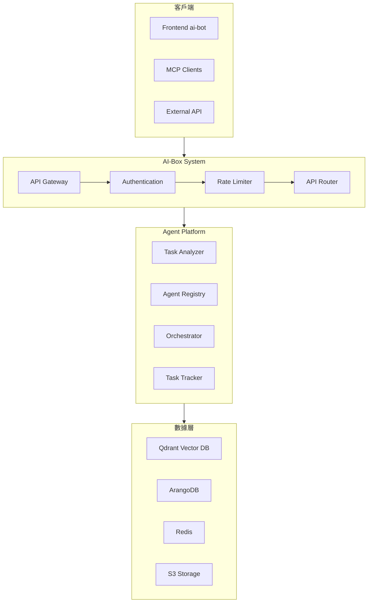
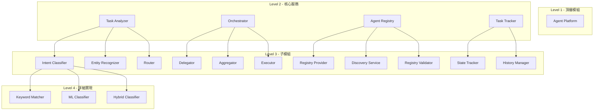

# MAI-S0100 Agent平台核心架構規格書

**文件編號**: MAI-S0100  
**版本**: 1.1  
**日期**: 2026-02-27  
**依據代碼**: `agents/`

---

## 1. 產品目的 (Product Purpose)

## 1.1 核心聲明

Agent 平台是 AI-Box 的核心協調層，負責接收用戶請求、進行意圖分類與任務解析、協調多 Agent 執行任務、並聚合結果返回給用戶。

**解決問題**:
- 用戶請求的智能理解和分類
- 多 Agent 協作與任務委派
- 任務狀態追蹤與結果聚合
- 策略驅動的訪問控制

**服務對象**:
- AI-Box 前端用戶
- 外部 MCP 客戶端
- 系統管理員

## 1.2 產品願景

成為企業級 AI 應用的核心樞紐，提供靈活、可擴展的 Agent 協調能力，支持多種場景的智能對話與任務執行。

---

## 2. 產品概覽 (Product Overview)

## 2.1 目標用戶

| 用戶類型 | 使用場景 | 需求 |
|---------|---------|------|
| 業務用戶 | 智能對話、數據查詢、文件處理 | 簡單易用的接口 |
| 開發者 | Agent 開發、流程定制 | 豐富的 API 和擴展點 |
| 系統管理員 | 系統配置、策略管理 | 安全可靠的管理界面 |

## 2.2 系統邊界



**系統邊界說明**:
- 客戶端: Frontend (ai-bot)、MCP 客戶端、外部 API
- 邊界內: API Layer + Agent Platform
- 外部依賴: 數據庫、緩存、存儲服務

## 2.3 技術棧

| 層級 | 技術 | 版本 | 用途 |
|------|------|------|------|
| API | FastAPI | 0.100+ | REST API 框架 |
| 協議 | MCP | 1.0 | 模型上下文協議 |
| 圖數據庫 | ArangoDB | 3.11+ | 知識圖譜存儲 |
| 向量數據庫 | Qdrant | 1.7+ | 語義搜索 |
| 緩存 | Redis | 7.0+ | 會話緩存、任務隊列 |
| 消息隊列 | RQ | 1.14+ | 異步任務處理 |
| 對象存儲 | SeaweedFS | 3.50+ | 文件存儲 (S3 相容) |
| LLM 整合 | Ollama / OpenAI | - | 模型調用 |

## 2.4 運行環境

| 環境 | 說明 |
|------|------|
| 開發環境 | 本地 Docker Compose |
| 測試環境 | 獨立服務器，隔離網絡 |
| 生產環境 | Kubernetes 集群或多節點部署 |

**端口配置**:
- API Server: 8000
- ArangoDB: 8529
- Redis: 6379
- Qdrant: 6333
- SeaweedFS: 8333

---

## 3. 功能需求 (Functional Requirements)

## 3.1 核心功能

### 3.1.1 任務分析 (Task Analysis)

| 功能 ID | 功能名稱 | 說明 |
|--------|---------|------|
| F-01-001 | 意圖分類 | 識別用戶輸入的意圖類型 |
| F-01-002 | 實體識別 | 提取文本中的關鍵實體 |
| F-01-003 | 語義解析 | 解析用戶查詢的語義結構 |
| F-01-004 | 參數提取 | 從輸入中提取結構化參數 |

### 3.1.2 任務協調 (Task Orchestration)

| 功能 ID | 功能名稱 | 說明 |
|--------|---------|------|
| F-01-010 | 任務委派 | 將任務委派給合適的 Agent |
| F-01-011 | 結果聚合 | 聚合多個 Agent 的執行結果 |
| F-01-012 | 任務回滾 | 支持任務失敗時的回滾操作 |
| F-01-013 | 異常處理 | 統一的異常處理和恢復 |

### 3.1.3 Agent 管理 (Agent Management)

| 功能 ID | 功能名稱 | 說明 |
|--------|---------|------|
| F-01-020 | Agent 註冊 | 動態註冊新的 Agent |
| F-01-021 | Agent 發現 | 根據能力發現可用 Agent |
| F-01-022 | 狀態追蹤 | 追蹤 Agent 的在線狀態 |
| F-01-023 | 健康檢查 | 定期檢查 Agent 健康狀態 |

### 3.1.4 策略引擎 (Policy Engine)

| 功能 ID | 功能名稱 | 說明 |
|--------|---------|------|
| F-01-030 | 策略評估 | 根據上下文評估訪問策略 |
| F-01-031 | 策略管理 | 動態管理訪問策略 |
| F-01-032 | 規則引擎 | 支持複雜規則的執行 |
| F-01-033 | 審計日誌 | 記錄策略執行的審計日誌 |

### 3.1.5 狀態管理 (State Management)

| 功能 ID | 功能名稱 | 說明 |
|--------|---------|------|
| F-01-040 | 狀態持久化 | 保存任務執行狀態 |
| F-01-041 | 狀態回放 | 支持任務步驟回放 |
| F-01-042 | 歷史記錄 | 記錄完整的執行歷史 |
| F-01-043 | 狀態同步 | 多節點狀態同步 |

## 3.2 組件清單 (Level 3-4)

### 3.2.1 核心服務組件



| L1 | L2 | L3 | L4 | 實現文件 | 職責 |
|----|----|----|----|----------|------|
| Agent Platform | Task Analyzer | Intent Classifier | | `task_analyzer/intent_classifier.py` | 意圖分類 |
| Agent Platform | Task Analyzer | Intent Classifier | Keyword Matcher | `task_analyzer/keyword_matcher.py` | 關鍵詞匹配 |
| Agent Platform | Task Analyzer | Intent Classifier | ML Classifier | `task_analyzer/ml_classifier.py` | ML 模型分類 |
| Agent Platform | Task Analyzer | Entity Recognizer | | `task_analyzer/entity_recognizer.py` | 實體識別 |
| Agent Platform | Task Analyzer | Router | | `task_analyzer/router.py` | 路由分發 |
| Agent Platform | Orchestrator | Delegator | | `orchestrator/delegator.py` | 任務委派 |
| Agent Platform | Orchestrator | Aggregator | | `orchestrator/aggregator.py` | 結果聚合 |
| Agent Platform | Orchestrator | Executor | | `orchestrator/executor.py` | 執行引擎 |
| Agent Platform | Agent Registry | Registry Provider | | `services/registry/provider.py` | 註冊提供 |
| Agent Platform | Agent Registry | Discovery Service | | `services/registry/discovery.py` | 服務發現 |
| Agent Platform | Agent Registry | Registry Validator | | `services/registry/validator.py` | 驗證器 |
| Agent Platform | Task Tracker | State Tracker | | `services/orchestrator/task_tracker.py` | 狀態追蹤 |
| Agent Platform | Task Tracker | History Manager | | `services/orchestrator/history.py` | 歷史管理 |

### 3.2.2 GRO 組件

| L1 | L2 | L3 | L4 | 實現文件 | 職責 |
|----|----|----|----|----------|------|
| Agent Platform | Policy Engine | Rule Evaluator | | `policy_engine/rule_evaluator.py` | 規則評估 |
| Agent Platform | Policy Engine | Policy Loader | | `policy_engine/policy_loader.py` | 策略加載 |
| Agent Platform | Policy Engine | Policy Parser | | `policy_engine/policy_parser.py` | 策略解析 |
| Agent Platform | State Store | Persistence | | `state_store/state_persistence.py` | 持久化 |
| Agent Platform | State Store | Replay | | `state_store/state_replay.py` | 狀態回放 |
| Agent Platform | State Store | State Machine | | `state_store/state_machine.py` | 狀態機 |
| Agent Platform | Observation Collector | Fan In | | `observation_collector/fan_in.py` | 觀察收集 |
| Agent Platform | Observation Collector | Summary | | `observation_collector/observation_summary.py` | 觀察摘要 |

### 3.2.3 ReAct FSM 組件

| L1 | L2 | L3 | L4 | 實現文件 | 職責 |
|----|----|----|----|----------|------|
| Agent Platform | ReAct FSM | State Machine | | `react_fsm/state_machine.py` | 狀態機 |
| Agent Platform | ReAct FSM | States | | `react_fsm/states.py` | 狀態定義 |
| Agent Platform | ReAct FSM | Transitions | | `react_fsm/transitions.py` | 狀態轉換 |
| Agent Platform | ReAct FSM | Executor | | `react_fsm/executor.py` | 執行器 |
| Agent Platform | ReAct FSM | Reviewer | | `react_fsm/reviewer.py` | 結果審查 |

---

## 4. 性能要求 (Performance Requirements)

## 4.1 響應時間

| 指標 | 目標值 | 說明 |
|------|--------|------|
| 意圖分類響應時間 | ≤ 500ms | 從接收到分類結果 |
| 策略評估響應時間 | ≤ 100ms | 單次策略評估 |
| 狀態保存響應時間 | ≤ 200ms | 狀態持久化 |
| Agent 發現響應時間 | ≤ 100ms | 服務發現 |
| 任務創建響應時間 | ≤ 300ms | 從請求到任務創建 |

## 4.2 吞吐量

| 指標 | 目標值 | 說明 |
|------|--------|------|
| 請求並發處理 | ≥ 100 QPS | 峰值並發請求 |
| 任務提交速率 | ≥ 50 TPS | 每秒任務提交數 |
| 策略評估速率 | ≥ 1000 TPS | 每秒策略評估次數 |

## 4.3 並發能力

| 指標 | 目標值 | 說明 |
|------|--------|------|
| 同時活躍任務數 | ≥ 1000 | 並發執行任務數 |
| 同時在線 Agent 數 | ≥ 100 | 註冊 Agent 數量 |
| 會話並發數 | ≥ 500 | 同時會話數 |

## 4.4 擴展性

| 指標 | 目標值 | 說明 |
|------|--------|------|
| 水平擴展 | 線性增長 | 增加節點可線性提升性能 |
| 數據擴展 | 支持百萬級任務 | 任務歷史數據存儲 |
| 功能擴展 | 插件化架構 | 新功能熱部署 |

---

## 5. 非功能性需求 (Non-Functional Requirements)

## 5.1 安全性

| 需求 ID | 需求描述 | 優先級 |
|---------|---------|--------|
| NFR-01-001 | 支持 OAuth2.0 認證 | 必須 |
| NFR-01-002 | 支持 JWT Token 驗證 | 必須 |
| NFR-01-003 | 支持 RBAC 角色權限控制 | 必須 |
| NFR-01-004 | 敏感數據加密傳輸 (TLS 1.3) | 必須 |
| NFR-01-005 | 密碼/密鑰加密存儲 | 必須 |
| NFR-01-006 | 審計日誌記錄所有管理操作 | 必須 |
| NFR-01-007 | API 請求限流保護 | 應該 |
| NFR-01-008 | SQL 注入防護 | 必須 |
| NFR-01-009 | XSS 攻擊防護 | 必須 |

## 5.2 可靠性

| 需求 ID | 需求描述 | 目標值 |
|---------|---------|--------|
| NFR-01-010 | 系統可用性 | ≥ 99.9% |
| NFR-01-011 | 單一故障點消除 | 無 SPOF |
| NFR-01-012 | 自動故障恢復 | < 30 秒 |
| NFR-01-013 | 數據持久化 | RPO ≤ 5 分鐘 |
| NFR-01-014 | 狀態一致性 | 強一致性 |

## 5.3 可用性

| 需求 ID | 需求描述 | 目標值 |
|---------|---------|--------|
| NFR-01-020 | 系統啟動時間 | ≤ 30 秒 |
| NFR-01-021 | 服務熱重載 | ≤ 5 秒 |
| NFR-01-022 | 錯誤恢復時間 | ≤ 10 秒 |
| NFR-01-023 | 維護窗口 | 零停機 |

## 5.4 維護性

| 需求 ID | 需求描述 | 說明 |
|---------|---------|------|
| NFR-01-030 | 配置熱更新 | 無需重啟 |
| NFR-01-031 | 策略熱部署 | 無需重啟 |
| NFR-01-032 | Agent 熱註冊 | 動態發現 |
| NFR-01-033 | 日誌分級輸出 | DEBUG/INFO/WARN/ERROR |
| NFR-01-034 | 性能監控指標 | Prometheus 格式 |

## 5.5 相容性

| 需求 ID | 需求描述 | 說明 |
|---------|---------|------|
| NFR-01-040 | API 版本管理 | v1, v2 |
| NFR-01-041 | 向後相容 | 舊版本 API 兼容 |
| NFR-01-042 | 瀏覽器相容 | Chrome/Firefox/Safari 最新版 |
| NFR-01-043 | 移動端響應式 | 支持手機訪問 |

---

## 6. 外部接口 (External Interfaces)

## 6.1 API 接口

### 6.1.1 任務管理 API

| 方法 | 端點 | 說明 |
|------|------|------|
| POST | /api/v1/tasks | 創建任務 |
| GET | /api/v1/tasks/{task_id} | 查詢任務狀態 |
| DELETE | /api/v1/tasks/{task_id} | 取消任務 |
| GET | /api/v1/tasks/{task_id}/replay | 任務回放 |

### 6.1.2 Agent 註冊 API

| 方法 | 端點 | 說明 |
|------|------|------|
| POST | /api/v1/agents/register | 註冊 Agent |
| GET | /api/v1/agents/discover | 發現 Agent |
| GET | /api/v1/agents | 列舉 Agent |
| DELETE | /api/v1/agents/{agent_id} | 註銷 Agent |

### 6.1.3 策略管理 API

| 方法 | 端點 | 說明 |
|------|------|------|
| GET | /api/v1/policies | 列表策略 |
| POST | /api/v1/policies | 創建策略 |
| PUT | /api/v1/policies/{policy_id} | 更新策略 |
| DELETE | /api/v1/policies/{policy_id} | 刪除策略 |

## 6.2 數據格式

### 6.2.1 請求/響應格式

```json
// 請求格式
{
    "user_id": "user_123",
    "session_id": "sess_abc",
    "input": "查詢料號 NI001 的庫存",
    "context": {
        "language": "zh-TW",
        "metadata": {}
    }
}

// 響應格式
{
    "task_id": "task_xyz",
    "status": "COMPLETED",
    "result": {
        "output": "...",
        "format": "text"
    }
}
```

### 6.2.2 錯誤格式

```json
{
    "error": {
        "code": "E001-001",
        "message": "錯誤描述",
        "details": {}
    }
}
```

---

## 7. 設計約束與假設 (Design Constraints & Assumptions)

## 7.1 技術約束

| 約束 ID | 約束描述 | 說明 |
|---------|---------|------|
| C-01-001 | 語言版本 | Python 3.12+ |
| C-01-002 | 框架版本 | FastAPI 0.100+ |
| C-01-003 | 數據庫版本 | ArangoDB 3.11+, Redis 7.0+ |
| C-01-004 | 協議標準 | MCP Protocol 1.0 |
| C-01-005 | API 風格 | RESTful |

## 7.2 環境約束

| 約束 ID | 約束描述 | 說明 |
|---------|---------|------|
| C-01-010 | 部署環境 | Linux (Ubuntu 22.04+) |
| C-01-011 | 容器環境 | Docker 24.0+, Kubernetes 1.28+ |
| C-01-012 | 內存要求 | 最小 8GB RAM |
| C-01-013 | CPU 要求 | 最小 4 核心 |
| C-01-014 | 磁盤空間 | 最小 50GB SSD |

## 7.3 假設條件

| 假設 ID | 假設描述 | 驗證方式 |
|---------|---------|----------|
| A-01-001 | LLM 服務可用 | 健康檢查 |
| A-01-002 | 數據庫連接穩定 | 連接池管理 |
| A-01-003 | 網絡延遲 < 100ms | 內網部署 |
| A-01-004 | 用戶輸入為 UTF-8 編碼 | 輸入驗證 |
| A-01-005 | 會話超時時間 30 分鐘 | 配置管理 |

## 7.4 依賴關係

| 依賴 ID | 依賴服務 | 版本要求 | 重要性 |
|---------|---------|---------|--------|
| D-01-001 | ArangoDB | 3.11+ | 必須 |
| D-01-002 | Redis | 7.0+ | 必須 |
| D-01-003 | Qdrant | 1.7+ | 必須 |
| D-01-004 | SeaweedFS | 3.50+ | 必須 |
| D-01-005 | Ollama | 0.1+ | 應該 |
| D-01-006 | LLM Provider | - | 可選 |

---

## 8. 質量標準 (Quality Standards)

## 8.1 可靠性指標

| 指標 | 目標值 | 測量方式 |
|------|--------|----------|
| 系統可用率 | ≥ 99.9% | 月度運行時間/總時間 |
| MTTF (平均故障間隔) | ≥ 720 小時 | 故障間隔統計 |
| MTTR (平均修復時間) | ≤ 30 分鐘 | 故障修復統計 |
| 數據丟失率 | 0 | RPO=0 |

## 8.2 錯誤率容忍

| 指標 | 最大容忍值 | 說明 |
|------|-----------|------|
| API 錯誤率 | ≤ 0.1% | 5xx 錯誤比例 |
| 任務失敗率 | ≤ 1% | 總任務失敗比例 |
| 超時率 | ≤ 0.5% | 超時任務比例 |
| 認證失敗率 | ≤ 1% | 認證錯誤比例 |

## 8.3 代碼質量標準

| 指標 | 目標值 | 說明 |
|------|--------|------|
| 單元測試覆蓋率 | ≥ 80% | 新代碼必須 |
| 靜態分析 | 0 錯誤 | mypy, ruff |
| 文档覆盖率 | 100% | 公共 API |
| 循環複雜度 | ≤ 10 | 每個函數 |

---

## 9. 安全規範 (Security Requirements)

## 9.1 認證與授權

### 9.1.1 認證機制

| 需求 | 描述 |
|------|------|
| 認證方式 | OAuth 2.0 + JWT |
| Token 類型 | Access Token + Refresh Token |
| Token 有效期 | Access: 1 小時, Refresh: 7 天 |
| 密碼策略 | 至少 8 位，包含大小寫+數字 |

### 9.1.2 授權機制

| 需求 | 描述 |
|------|------|
| 權限模型 | RBAC (角色-based 訪問控制) |
| 角色層級 | 超級管理員 > 管理員 > 用戶 > 訪客 |
| 資源權限 | 讀/寫/執行 三級 |
| 權限繼承 | 子資源繼承父資源權限 |

## 9.2 數據保護

| 需求 | 描述 |
|------|------|
| 傳輸加密 | TLS 1.3 |
| 存儲加密 | AES-256 |
| 敏感數據 | 密碼/Token 加密存儲 |
| 脫敏規則 | 日誌中隱藏敏感信息 |

---

## 10. 錯誤碼詳細定義

### 10.1 錯誤碼結構

```
格式: E-{MMM}-{NNN}
MMM: 模組編碼
NNN: 錯誤序號

模組編碼:
- 001: Task Analyzer
- 002: Orchestrator
- 003: Agent Registry
- 004: Policy Engine
- 005: State Store
- 006: Observation Collector
- 007: ReAct FSM
- 099: Common Errors
```

### 10.2 Task Analyzer 錯誤碼

| 錯誤碼 | 名稱 | 描述 | 原因 | 處理方式 |
|--------|------|------|------|----------|
| E001-001 | INTENT_CLASSIFICATION_FAILED | 意圖分類失敗 | LLM 調用異常 | 返回 `UNKNOWN_INTENT`，記錄日誌 |
| E001-002 | INTENT_LOW_CONFIDENCE | 置信度過低 | 置信度 < 0.5 | 請求用戶澄清 |
| E001-003 | ENTITY_EXTRACTION_FAILED | 實體識別失敗 | 文本格式異常 | 返回空實體列表，繼續處理 |
| E001-004 | ENTITY_TYPE_UNSUPPORTED | 不支持的實體類型 | 實體類型不在定義中 | 記錄日誌，返回部分結果 |
| E001-005 | ROUTING_FAILED | 路由失敗 | 無法找到合適的 Agent | 返回 `ROUTING_FAILED` |
| E001-006 | ROUTING_NO_AGENT_AVAILABLE | 無可用 Agent | 所有 Agent 不可用 | 返回 `NO_AGENT_AVAILABLE` |
| E001-007 | CONTEXT_MISSING_REQUIRED_FIELD | 上下文缺少必要字段 | context 驗證失敗 | 返回 `INVALID_CONTEXT` |

### 10.3 Orchestrator 錯誤碼

| 錯誤碼 | 名稱 | 描述 | 原因 | 處理方式 |
|--------|------|------|------|----------|
| E002-001 | TASK_EXECUTION_FAILED | 任務執行失敗 | Agent 執行異常 | 記錄錯誤，嘗試回滾 |
| E002-002 | TASK_TIMEOUT | 任務超時 | 超過設定時間 | 終止任務，返回超時錯誤 |
| E002-003 | TASK_CANCELLED | 任務取消 | 用戶主動取消 | 更新狀態為 CANCELLED |
| E002-004 | AGENT_DELEGATION_FAILED | Agent 委派失敗 | Agent 不可用 | 嘗試備用 Agent |
| E002-005 | RESULT_AGGREGATION_FAILED | 結果聚合失敗 | 結果格式不一致 | 返回部分結果，標記失敗 |
| E002-006 | ROLLBACK_FAILED | 回滾失敗 | 狀態不一致 | 記錄日誌，標記需要人工處理 |
| E002-007 | CIRCULAR_DEPENDENCY | 循環依賴 | Agent 調用形成環 | 阻止執行，返回錯誤 |
| E002-008 | RESOURCE_EXHAUSTED | 資源耗盡 | 內存/CPU 不足 | 返回 `RESOURCE_EXHAUSTED` |

### 10.4 Agent Registry 錯誤碼

| 錯誤碼 | 名稱 | 描述 | 原因 | 處理方式 |
|--------|------|------|------|----------|
| E003-001 | AGENT_NOT_FOUND | Agent 不存在 | agent_id 無效 | 返回空列表 |
| E003-002 | AGENT_REGISTRATION_FAILED | 註冊失敗 | 數據驗證失敗 | 返回錯誤詳情 |
| E003-003 | AGENT_UNREGISTRATION_FAILED | 註銷失敗 | Agent 正在執行任務 | 返回忙碌狀態 |
| E003-004 | CAPABILITY_MISMATCH | 能力不匹配 | Agent 無法滿足需求 | 繼續搜索其他 Agent |
| E003-005 | DISCOVERY_FAILED | 服務發現失敗 | 註冊表異常 | 返回錯誤，使用緩存 |
| E003-006 | VALIDATION_FAILED | 驗證失敗 | 能力描述格式錯誤 | 記錄日誌，返回 false |

### 10.5 Policy Engine 錯誤碼

| 錯誤碼 | 名稱 | 描述 | 原因 | 處理方式 |
|--------|------|------|------|----------|
| E004-001 | POLICY_LOAD_FAILED | 策略加載失敗 | 文件格式錯誤 | 使用上一版本策略 |
| E004-002 | POLICY_PARSE_FAILED | 策略解析失敗 | 語法錯誤 | 跳過該策略，記錄日誌 |
| E004-003 | POLICY_EVALUATION_TIMEOUT | 策略評估超時 | 規則複雜度過高 | 返回 DENY，記錄日誌 |
| E004-004 | POLICY_CONFLICT | 策略衝突 | 多個策略結果矛盾 | 按優先級處理 |
| E004-005 | POLICY_MODIFIER_ERROR | 修改器錯誤 | modifier 執行異常 | 忽略 modifier |
| E004-006 | CONTEXT_VALIDATION_FAILED | 上下文驗證失敗 | 缺少必要字段 | 返回 DENY |

### 10.6 State Store 錯誤碼

| 錯誤碼 | 名稱 | 描述 | 原因 | 處理方式 |
|--------|------|------|------|----------|
| E005-001 | STATE_NOT_FOUND | 狀態不存在 | task_id 無效 | 返回空狀態 |
| E005-002 | STATE_SAVE_FAILED | 狀態保存失敗 | 數據庫連接失敗 | 重試 3 次，拋出異常 |
| E005-003 | STATE_VERSION_CONFLICT | 版本衝突 | 並發更新 | 使用樂觀鎖 |
| E005-004 | STATE_REPLAY_FAILED | 回放失敗 | 步驟數據丟失 | 返回可用步驟 |
| E005-005 | STATE_EXPIRED | 狀態過期 | 超過保留時間 | 返回過期標記 |

### 10.7 Common Errors

| 錯誤碼 | 名稱 | 描述 | 處理方式 |
|--------|------|------|----------|
| E099-001 | INTERNAL_ERROR | 內部錯誤 | 記錄完整堆棧 |
| E099-002 | VALIDATION_ERROR | 驗證錯誤 | 返回字段級錯誤 |
| E099-003 | AUTHENTICATION_FAILED | 認證失敗 | 返回 401 |
| E099-004 | AUTHORIZATION_FAILED | 授權失敗 | 返回 403 |
| E099-005 | RESOURCE_NOT_FOUND | 資源不存在 | 返回 404 |
| E099-006 | METHOD_NOT_ALLOWED | 方法不允許 | 返回 405 |

---

## 11. API 詳細規格

### 11.1 任務管理 API

#### 11.1.1 創建任務

```
POST /api/v1/tasks
```

**Request:**
```json
{
    "user_id": "user_123",
    "session_id": "sess_abc",
    "input": "查詢料號 NI001 的庫存",
    "context": {
        "language": "zh-TW",
        "metadata": {}
    },
    "options": {
        "timeout": 60,
        "priority": "normal"
    }
}
```

**Response (成功):**
```json
{
    "task_id": "task_xyz",
    "status": "PENDING",
    "created_at": "2026-02-27T10:00:00Z",
    "estimated_duration": 30
}
```

**Response (錯誤):**
```json
{
    "error": {
        "code": "E002-001",
        "message": "任務執行失敗",
        "details": {}
    }
}
```

#### 11.1.2 查詢任務狀態

```
GET /api/v1/tasks/{task_id}
```

**Response:**
```json
{
    "task_id": "task_xyz",
    "status": "COMPLETED",
    "progress": 100,
    "result": {
        "output": "...",
        "format": "text"
    },
    "steps": [
        {
            "step_id": "step_1",
            "action": "intent_classification",
            "status": "COMPLETED"
        }
    ],
    "created_at": "2026-02-27T10:00:00Z",
    "completed_at": "2026-02-27T10:00:30Z"
}
```

#### 11.1.3 取消任務

```
DELETE /api/v1/tasks/{task_id}
```

#### 11.1.4 任務回放

```
GET /api/v1/tasks/{task_id}/replay?from_step=1
```

### 11.2 Agent 註冊 API

| 方法 | 端點 | 說明 |
|------|------|------|
| POST | /api/v1/agents/register | 註冊 Agent |
| GET | /api/v1/agents/discover?intent=query_inventory | 發現 Agent |
| GET | /api/v1/agents?type=data_agent&status=active | 列舉 Agent |
| DELETE | /api/v1/agents/{agent_id} | 註銷 Agent |

### 11.3 策略管理 API

| 方法 | 端點 | 說明 |
|------|------|------|
| GET | /api/v1/policies | 列表策略 |
| POST | /api/v1/policies | 創建策略 |
| PUT | /api/v1/policies/{policy_id} | 更新策略 |
| DELETE | /api/v1/policies/{policy_id} | 刪除策略 |

---

## 12. 驗收標準

### 12.1 功能驗收

| ID | 標準 | 測試方法 |
|----|------|----------|
| AC-01-001 | Task Analyzer 能正確分類意圖 | 輸入 100 個測試用例，準確率 > 90% |
| AC-01-002 | Task Analyzer 能正確識別實體 | 實體識別 F1 > 0.85 |
| AC-01-003 | Orchestrator 能正確委派任務 | 模擬 50 個複雜任務，全部正確委派 |
| AC-01-004 | Agent Registry 能正確發現 Agent | 根據 capability 搜索，返回正確結果 |
| AC-01-005 | Policy Engine 能正確評估策略 | 100 個策略測試用例，全部正確評估 |
| AC-01-006 | State Store 能正確保存和回放狀態 | 模擬並發場景，狀態正確 |

### 12.2 錯誤處理驗收

| ID | 標準 |
|----|------|
| AC-01-010 | 所有錯誤碼都有對應處理邏輯 |
| AC-01-011 | 錯誤日誌包含足夠的調試信息 |
| AC-01-012 | 系統不會因為單一錯誤而崩潰 |

### 12.3 性能驗收

| ID | 標準 |
|----|------|
| AC-01-020 | 意圖分類響應時間 < 500ms |
| AC-01-021 | 策略評估響應時間 < 100ms |
| AC-01-022 | 狀態保存響應時間 < 200ms |
| AC-01-023 | 支持 100 個並發任務 |

### 12.4 安全驗收

| ID | 標準 |
|----|------|
| AC-01-030 | 通過 OWASP Top 10 安全測試 |
| AC-01-031 | 敏感數據加密傳輸 |
| AC-01-032 | 權限控制生效 |

---

*文件結束*
