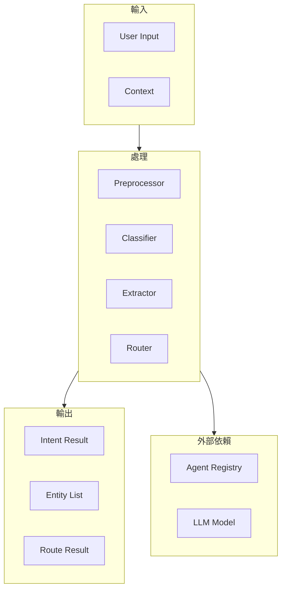
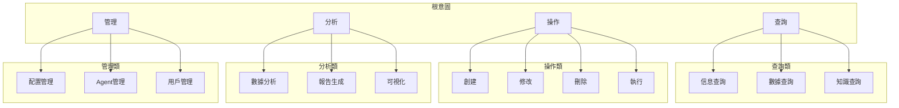

# MAI-S0110 意圖分類與任務路由規格書

**文件編號**: MAI-S0110  
**版本**: 1.1  
**日期**: 2026-02-27  
**依據代碼**: `agents/`

---

## 1. 產品目的 (Product Purpose)

# 1.1 核心聲明

意圖分類與任務路由是 Agent 平台的入口模組，負責接收用戶自然語言輸入、識別用戶意圖 (Intent)、提取相關實體 (Entity)、並路由到合適的處理 Agent。

**解決問題**:
- 用戶輸入的智能理解
- 複雜查詢的結構化解析
- 精準的任務路由分配
- 多意圖的歧義處理

**服務對象**:
- 前端用戶（通過 API）
- 外部系統（通過 MCP 協議）
- 其他 Agent（任務委派）

# 1.2 產品願景

成為企業級對話系統的核心理解引擎，提供高精度、低延遲的意圖識別和實體提取能力，支持複雜場景下的智能路由決策。

---

## 2. 產品概覽 (Product Overview)

# 2.1 目標用戶

| 用戶類型 | 使用場景 | 需求 |
|---------|---------|------|
| 業務用戶 | 自然語言查詢 | 準確理解意圖 |
| 開發者 | API 集成 | 穩定的接口 |
| 系統管理員 | 意圖配置 | 靈活配置 |

# 2.2 系統邊界



**系統邊界說明**:
- 輸入: 用戶自然語言、上下文信息
- 處理: 預處理、分類、提取、路由
- 輸出: 意圖結果、實體列表、路由結果
- 外部依賴: Agent Registry、LLM Model

# 2.3 技術棧

| 層級 | 技術 | 版本 | 用途 |
|------|------|------|------|
| 框架 | FastAPI | 0.100+ | API 服務 |
| NLP | spaCy / Transformers | - | 實體識別 |
| ML | ONNX Runtime | 1.15+ | 模型推理 |
| 緩存 | Redis | 7.0+ | 結果緩存 |

# 2.4 運行環境

| 環境 | 說明 |
|------|------|
| 部署方式 | Docker 容器化 |
| 擴展方式 | 水平擴展 |
| 依賴服務 | Redis, LLM |

---

## 3. 功能需求 (Functional Requirements)

# 3.1 核心功能

## 3.1.1 文本預處理

| 功能 ID | 功能名稱 | 說明 |
|--------|---------|------|
| F-02-001 | 文本正規化 | 統一文本格式、去除噪音 |
| F-02-002 | 分詞處理 | 中文/英文分詞 |
| F-02-003 | 實體預標記 | 初步識別可能實體 |

## 3.1.2 意圖分類

| 功能 ID | 功能名稱 | 說明 |
|--------|---------|------|
| F-02-010 | 關鍵詞匹配 | 基於關鍵詞的快速分類 |
| F-02-011 | 規則分類 | 基於預定義規則的分類 |
| F-02-012 | ML 模型分類 | 基於機器學習模型 |
| F-02-013 | 多模型融合 | 三種分類器結果融合 |

## 3.1.3 實體提取

| 功能 ID | 功能名稱 | 說明 |
|--------|---------|------|
| F-02-020 | 模式匹配 | 正則表達式匹配 |
| F-02-021 | 規則提取 | 基於規則的提取 |
| F-02-022 | NER 模型 | 命名實體識別 |

## 3.1.4 路由決策

| 功能 ID | 功能名稱 | 說明 |
|--------|---------|------|
| F-02-030 | Agent 發現 | 根據意圖發現合適 Agent |
| F-02-031 | Agent 排序 | 多候選時排序選擇 |
| F-02-032 | 備用路由 | 異常時的備用方案 |

# 3.2 組件清單 (Level 3-4)

## 3.2.1 預處理組件

| L1 | L2 | L3 | L4 | 實現文件 | 職責 |
|----|----|----|----|----------|------|
| Task Analyzer | Preprocessor | Normalizer | | `preprocessor/normalizer.py` | 文本正規化 |
| Task Analyzer | Preprocessor | Tokenizer | | `preprocessor/tokenizer.py` | 分詞 |
| Task Analyzer | Preprocessor | Entity Spotter | | `preprocessor/entity_spotter.py` | 實體預標記 |

## 3.2.2 分類組件

| L1 | L2 | L3 | L4 | 實現文件 | 職責 |
|----|----|----|----|----------|------|
| Task Analyzer | Classifier | Keyword Matcher | | `classifier/keyword_matcher.py` | 關鍵詞匹配 |
| Task Analyzer | Classifier | Keyword Matcher | SynonymHandler | `classifier/synonym_handler.py` | 同義詞處理 |
| Task Analyzer | Classifier | Keyword Matcher | WildcardHandler | `classifier/wildcard_handler.py` | 通配符處理 |
| Task Analyzer | Classifier | Rule Classifier | | `classifier/rule_classifier.py` | 規則分類 |
| Task Analyzer | Classifier | Rule Classifier | RuleEngine | `classifier/rule_engine.py` | 規則引擎 |
| Task Analyzer | Classifier | ML Classifier | | `classifier/ml_classifier.py` | ML 模型分類 |
| Task Analyzer | Classifier | ML Classifier | IntentModel | `classifier/models/intent_model.py` | 意圖識別模型 |
| Task Analyzer | Classifier | Hybrid Combiner | | `classifier/hybrid_combiner.py` | 多模型合併 |

## 3.2.3 提取組件

| L1 | L2 | L3 | L4 | 實現文件 | 職責 |
|----|----|----|----|----------|------|
| Task Analyzer | Extractor | Rule Extractor | | `extractor/rule_extractor.py` | 規則提取 |
| Task Analyzer | Extractor | NER Model | | `extractor/ner_model.py` | 命名實體識別 |
| Task Analyzer | Extractor | Pattern Recognizer | | `extractor/pattern_recognizer.py` | 模式識別 |

## 3.2.4 決策組件

| L1 | L2 | L3 | L4 | 實現文件 | 職責 |
|----|----|----|----|----------|------|
| Task Analyzer | Decision | Confidence Scorer | | `decision/confidence_scorer.py` | 置信度計算 |
| Task Analyzer | Decision | Alternative Generator | | `decision/alternative_generator.py` | 備選生成 |
| Task Analyzer | Decision | Selector | | `decision/selector.py` | 選擇器 |

## 3.2.5 意圖體系



---

## 4. 性能要求 (Performance Requirements)

# 4.1 響應時間

| 指標 | 目標值 | 說明 |
|------|--------|------|
| 文本預處理 | ≤ 10ms | 單次處理 |
| 意圖分類 (混合) | ≤ 200ms | 三分類器融合 |
| 實體提取 | ≤ 100ms | 含 NER 推理 |
| 路由決策 | ≤ 50ms | Agent 發現+排序 |
| 端到端延遲 | ≤ 500ms | 從輸入到路由結果 |

# 4.2 吞吐量

| 指標 | 目標值 | 說明 |
|------|--------|------|
| 請求並發 | ≥ 50 QPS | 單實例 |
| 並發會話 | ≥ 500 | 會話並發數 |

# 4.3 準確率指標

| 指標 | 目標值 | 說明 |
|------|--------|------|
| 意圖分類準確率 | ≥ 90% | 測試集準確率 |
| 實體識別 F1 | ≥ 0.85 | F1 Score |
| 路由準確率 | ≥ 95% | 正確路由比例 |

---

## 5. 非功能性需求 (Non-Functional Requirements)

# 5.1 安全性

| 需求 ID | 需求描述 | 優先級 |
|---------|---------|--------|
| NFR-02-001 | API 訪問認證 | 必須 |
| NFR-02-002 | 輸入內容過濾 | 必須 |
| NFR-02-003 | 敏感信息脫敏 | 應該 |

# 5.2 可靠性

| 需求 ID | 需求描述 | 目標值 |
|---------|---------|--------|
| NFR-02-010 | 系統可用性 | ≥ 99.9% |
| NFR-02-011 | 故障自動切換 | 備用分類器 |
| NFR-02-012 | 結果緩存命中率 | ≥ 60% |

# 5.3 可用性

| 需求 ID | 需求描述 | 目標值 |
|---------|---------|--------|
| NFR-02-020 | 冷啟動時間 | ≤ 10 秒 |
| NFR-02-021 | 模型熱更新 | ≤ 5 秒 |

# 5.4 維護性

| 需求 ID | 需求描述 | 說明 |
|---------|---------|------|
| NFR-02-030 | 意圖動態配置 | 無需重啟 |
| NFR-02-031 | 分類器熱切換 | 切換備用 |
| NFR-02-032 | 日誌審計 | 完整記錄 |

---

## 6. 外部接口 (External Interfaces)

# 6.1 API 接口

| 方法 | 端點 | 說明 |
|------|------|------|
| POST | /api/v1/analyze | 意圖分析 |
| GET | /api/v1/intents | 意圖列表 |
| GET | /api/v1/entity-types | 實體類型 |

# 6.2 數據格式

## 6.2.1 分析請求

```json
{
    "text": "查詢料號 NI001 的庫存數量",
    "context": {
        "user_id": "user_123",
        "session_id": "sess_abc",
        "language": "zh-TW"
    },
    "options": {
        "return_entities": true,
        "return_alternatives": true,
        "threshold": 0.5
    }
}
```

## 6.2.2 分析響應

```json
{
    "intent": {
        "name": "QUERY_INVENTORY",
        "confidence": 0.92,
        "alternatives": [...]
    },
    "entities": [...],
    "route": {
        "agent": "data_agent",
        "action": "execute_query",
        "parameters": {...}
    },
    "metadata": {
        "processing_time_ms": 125
    }
}
```

---

## 7. 設計約束與假設 (Design Constraints & Assumptions)

# 7.1 技術約束

| 約束 ID | 約束描述 | 說明 |
|---------|---------|------|
| C-02-001 | 語言支持 | 繁體中文為主 |
| C-02-002 | 文本長度 | 最大 10000 字元 |
| C-02-003 | 編碼格式 | UTF-8 |

# 7.2 環境約束

| 約束 ID | 約束描述 | 說明 |
|---------|---------|------|
| C-02-010 | GPU 需求 | 可選 (NER 加速) |
| C-02-011 | 內存需求 | 最小 4GB |

# 7.3 假設條件

| 假設 ID | 假設描述 | 驗證方式 |
|---------|---------|----------|
| A-02-001 | 輸入為有效文本 | 輸入驗證 |
| A-02-002 | 用戶有有效會話 | Session 檢查 |
| A-02-003 | LLM 服務可用 | 健康檢查 |

# 7.4 依賴關係

| 依賴 ID | 依賴服務 | 版本要求 | 重要性 |
|---------|---------|---------|--------|
| D-02-001 | Redis | 7.0+ | 應該 |
| D-02-002 | LLM Service | - | 必須 |

---

## 8. 質量標準 (Quality Standards)

# 8.1 準確率標準

| 指標 | 目標值 | 測量方式 |
|------|--------|----------|
| 意圖分類準確率 | ≥ 90% | 測試集評估 |
| 實體 F1 Score | ≥ 0.85 | 標準數據集 |
| 路由準確率 | ≥ 95% | 模擬測試 |

# 8.2 錯誤容忍

| 指標 | 最大容忍值 | 說明 |
|------|-----------|------|
| 超時率 | ≤ 1% | 處理超時比例 |
| 無法識別率 | ≤ 5% | 無法識別比例 |

---

# 9. 錯誤碼詳細定義

## 9.1 預處理錯誤

| 錯誤碼 | 名稱 | 描述 | 原因 | 處理方式 |
|--------|------|------|------|----------|
| E101-001 | TEXT_EMPTY | 輸入文本為空 | 用戶未輸入 | 返回錯誤提示 |
| E101-002 | TEXT_TOO_LONG | 文本過長 | 超過 10000 字元 | 截斷處理 |
| E101-003 | TEXT_INVALID_ENCODING | 編碼錯誤 | 非 UTF-8 | 返回錯誤 |
| E101-004 | NORMALIZATION_FAILED | 正規化失敗 | 特殊字符 | 原始文本繼續 |

## 9.2 分類錯誤

| 錯誤碼 | 名稱 | 描述 | 原因 | 處理方式 |
|--------|------|------|------|----------|
| E102-001 | CLASSIFIER_UNAVAILABLE | 分類器不可用 | 模型未載入 | 切換到備用分類器 |
| E102-002 | CLASSIFICATION_TIMEOUT | 分類超時 | 處理時間過長 | 返回超時錯誤 |
| E102-003 | INTENT_NOT_DEFINED | 意圖未定義 | 識別到未知意圖 | 返回 UNKNOWN |
| E102-004 | LOW_CONFIDENCE | 置信度過低 | 低於閾值 | 請求澄清 |
| E102-005 | MULTIPLE_HIGH_CONFIDENCE | 多個高置信度 | 結果衝突 | 返回備選列表 |

## 9.3 提取錯誤

| 錯誤碼 | 名稱 | 描述 | 原因 | 處理方式 |
|--------|------|------|------|----------|
| E103-001 | EXTRACTION_FAILED | 提取失敗 | 處理異常 | 返回空列表 |
| E103-002 | ENTITY_TYPE_UNSUPPORTED | 不支持的類型 | 類型未定義 | 返回其他實體 |
| E103-003 | ENTITY_AMBIGUOUS | 實體歧義 | 多個可能值 | 請求用戶確認 |

## 9.4 路由錯誤

| 錯誤碼 | 名稱 | 描述 | 原因 | 處理方式 |
|--------|------|------|------|----------|
| E104-001 | ROUTE_NO_AGENT | 無可用 Agent | 沒有符合條件的 | 返回錯誤 |
| E104-002 | ROUTE_MULTIPLE_AGENTS | 多個候選 Agent | 匹配多個 | 返回首個+備選 |
| E104-003 | ROUTE_AGENT_UNAVAILABLE | Agent 不可用 | 連接失敗 | 嘗試備用 |
| E104-004 | ROUTE_CAPABILITY_MISMATCH | 能力不匹配 | 需求無法滿足 | 降級處理 |

---

# 10. API 詳細規格

## 10.1 分類 API

```
POST /api/v1/analyze
```

**Request:**
```json
{
    "text": "查詢料號 NI001 的庫存數量",
    "context": {
        "user_id": "user_123",
        "session_id": "sess_abc",
        "language": "zh-TW"
    },
    "options": {
        "return_entities": true,
        "return_alternatives": true,
        "threshold": 0.5
    }
}
```

**Response:**
```json
{
    "intent": {
        "name": "QUERY_INVENTORY",
        "confidence": 0.92,
        "alternatives": [...]
    },
    "entities": [...],
    "route": {
        "agent": "data_agent",
        "action": "execute_query",
        "parameters": {...}
    },
    "metadata": {
        "processing_time_ms": 125,
        "classifiers_used": ["keyword", "rule", "ml"]
    }
}
```

## 10.2 意圖列表 API

```
GET /api/v1/intents
```

## 10.3 實體類型 API

```
GET /api/v1/entity-types
```

---

# 11. 預定義意圖清單

## 11.1 查詢類 (Query)

| Intent ID | 名稱 | 描述 | 關鍵詞 |
|-----------|------|------|--------|
| QUERY_INVENTORY | 庫存查詢 | 查詢物料庫存 | 庫存,有多少,數量 |
| QUERY_WORK_ORDER | 工單查詢 | 查詢工單狀態 | 工單,訂單,進度 |
| QUERY_SHIPPING | 出貨查詢 | 查詢出貨信息 | 出貨,發貨,物流 |
| QUERY_QUALITY | 品質查詢 | 查詢品質數據 | 品質,良率,合格率 |
| QUERY_PRICE | 價格查詢 | 查詢價格信息 | 價格,多少錢,報價 |

## 11.2 操作類 (Action)

| Intent ID | 名稱 | 描述 | 關鍵詞 |
|-----------|------|------|--------|
| ACTION_CREATE | 創建 | 創建新記錄 | 新增,創建,建立 |
| ACTION_UPDATE | 更新 | 更新記錄 | 修改,更新,編輯 |
| ACTION_DELETE | 刪除 | 刪除記錄 | 刪除,移除,清除 |
| ACTION_EXECUTE | 執行 | 執行操作 | 執行,開始,運行 |

## 11.3 分析類 (Analyze)

| Intent ID | 名稱 | 描述 | 關鍵詞 |
|-----------|------|------|--------|
| ANALYZE_TREND | 趨勢分析 | 分析趨勢 | 趨勢,走向,變化 |
| ANALYZE_COMPARISON | 對比分析 | 對比分析 | 對比,比較,差異 |
| ANALYZE_SUMMARY | 彙總分析 | 數據彙總 | 彙總,合計,總計 |

## 11.4 管理類 (Manage)

| Intent ID | 名稱 | 描述 | 關鍵詞 |
|-----------|------|------|--------|
| MANAGE_CONFIG | 配置管理 | 系統配置 | 配置,設置,調整 |
| MANAGE_USER | 用戶管理 | 用戶操作 | 用戶,權限,角色 |

---

# 12. 驗收標準

## 12.1 功能驗收

| ID | 標準 | 測試方法 |
|----|------|----------|
| AC-02-001 | 意圖分類準確率 > 90% | 1000 個測試用例 |
| AC-02-002 | 實體識別 F1 > 0.85 | 標準數據集測試 |
| AC-02-003 | 路由準確率 > 95% | 模擬 200 個任務 |
| AC-02-004 | 處理延遲 < 500ms | 性能測試 |

## 12.2 錯誤處理驗收

| ID | 標準 |
|----|------|
| AC-02-010 | 所有錯誤碼有對應處理 |
| AC-02-011 | 錯誤可恢復性 > 80% |

## 12.3 性能驗收

| ID | 標準 |
|----|------|
| AC-02-020 | 端到端延遲 < 500ms |
| AC-02-021 | 支援 50 QPS 並發 |

---

#*文件結束*
