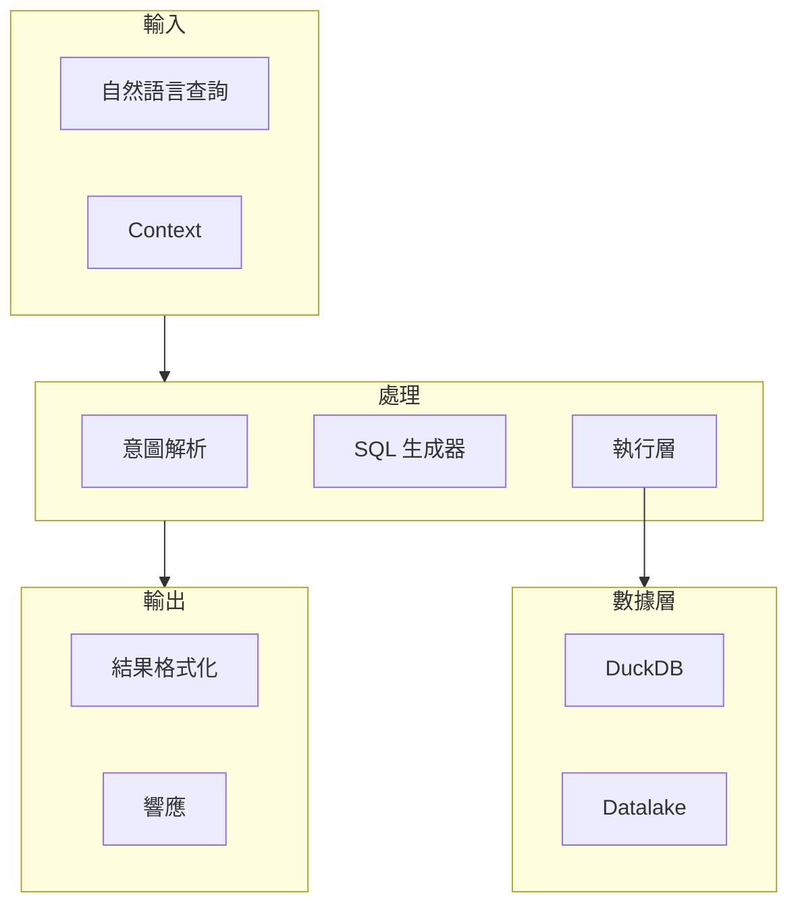

# MAI-S0120 數據查詢服務規格書

**文件編號**: MAI-S0120  
**版本**: 1.1  
**日期**: 2026-02-27  
**依據代碼**: `agents/`

---

## 1. 產品目的 (Product Purpose)

# 1.1 核心聲明

數據查詢服務是 AI-Box 的結構化數據查詢引擎，負責接收自然語言查詢 (NLQ)、通過 Schema-Driven Query 架構解析意圖和參數、根據 Resolver 狀態機自動生成 SQL、執行查詢並格式化結果返回。

**解決問題**:
- 自然語言到結構化 SQL 的轉換
- Schema 驅動的安全查詢
- 防止 SQL 注入攻擊
- 統一的數據查詢接口

**服務對象**:
- MM-Agent (意圖分類後的查詢執行)
- 前端用戶 (直接查詢)
- 外部系統 (API 調用)

# 1.2 產品願景

成為企業級數據查詢的统一入口，提供安全、準確、高效的 Schema-Driven Query 能力，支持複雜的時間週期解析和參數映射。

---

## 2. 產品概覽 (Product Overview)

# 2.1 目標用戶

| 用戶類型 | 使用場景 | 需求 |
|---------|---------|------|
| 業務人員 | 自然語言查詢數據 | 免 SQL 技能 |
| 開發者 | API 集成 | 穩定接口 |
| 管理員 | 查詢監控 | 審計日誌 |

# 2.2 系統邊界



**重要說明：Schema-Driven Query vs Text-to-SQL**

```
┌─────────────────────────────────────────────────────────────┐
│                    架構對比                                  │
├─────────────────────────────────────────────────────────────┤
│  Text-to-SQL (舊):                                         │
│  NLQ ──▶ LLM ──▶ SQL ──▶ 執行                          │
│           直接生成                                          │
├─────────────────────────────────────────────────────────────┤
│  Schema-Driven Query (新):                                 │
│  NLQ ──▶ LLM(Intent+Params) ──▶ Resolver ──▶ SQL     │
│           解析意圖           狀態機生成                    │
│                                                             │
│  Intent 定義: datalake-system/metadata/.../intents.json   │
│  Bindings  : datalake-system/metadata/.../bindings.json  │
└─────────────────────────────────────────────────────────────┘
```

# 2.3 技術棧

| 層級 | 技術 | 版本 | 用途 |
|------|------|------|------|
| 查詢引擎 | DuckDB | 0.9+ | OLAP 查詢 |
| 數據湖 | Parquet | - | 列式存儲 |
| API | FastAPI | 0.100+ | 接口服務 |
| 緩存 | Redis | 7.0+ | 結果緩存 |

# 2.4 運行環境

| 環境 | 說明 |
|------|------|
| 部署節點 | 獨立服務 (Port 8004) |
| 依賴服務 | DuckDB, Redis |
| 擴展方式 | 水平擴展 |

---

## 3. 功能需求 (Functional Requirements)

# 3.1 核心功能

## 3.1.1 意圖解析

| 功能 ID | 功能名稱 | 說明 |
|--------|---------|------|
| F-03-001 | Intent 解析 | 識別查詢意圖類型 |
| F-03-002 | 參數提取 | 從 NLQ 提取結構化參數 |
| F-03-003 | 時間解析 | TimePeriodRAG 時間週期解析 |
| F-03-004 | 實體映射 | 參數與 Schema 映射 |

## 3.1.2 SQL 生成

| 功能 ID | 功能名稱 | 說明 |
|--------|---------|------|
| F-03-010 | 模板選擇 | 根據 Intent 選擇 SQL 模板 |
| F-03-011 | 參數綁定 | 將參數綁定到模板 |
| F-03-012 | SQL 驗證 | 語法和安全性驗證 |
| F-03-013 | SQL 優化 | 查詢優化建議 |

## 3.1.3 查詢執行

| 功能 ID | 功能名稱 | 說明 |
|--------|---------|------|
| F-03-020 | 安全過濾 | SQL 注入檢測 |
| F-03-021 | 查詢緩存 | 相同查詢結果緩存 |
| F-03-022 | 結果格式化 | 轉換為統一格式 |
| F-03-023 | 超時控制 | 查詢超時管理 |

# 3.2 組件清單 (Level 3-4)

## 3.2.1 解析層組件

| L1 | L2 | L3 | L4 | 實現文件 | 職責 |
|----|----|----|----|----------|------|
| Data-Agent | Parser | Intent Parser | | `services/schema_driven_query/intent_parser.py` | 意圖識別 |
| Data-Agent | Parser | Intent Parser | PromptBuilder | `services/schema_driven_query/prompt_builder.py` | Prompt 構建 |
| Data-Agent | Parser | Intent Parser | ResponseParser | `services/schema_driven_query/response_parser.py` | 響應解析 |
| Data-Agent | Parser | Time Period Parser | | `services/schema_driven_query/time_parser.py` | 時間解析 |
| Data-Agent | Parser | Entity Parser | | `services/schema_driven_query/entity_parser.py` | 實體解析 |

## 3.2.2 生成層組件

| L1 | L2 | L3 | L4 | 實現文件 | 職責 |
|----|----|----|----|----------|------|
| Data-Agent | Resolver | Resolver State Machine | | `services/schema_driven_query/resolver.py` | 狀態機 |
| Data-Agent | Resolver | SQL Template | | `services/schema_driven_query/templates/` | SQL 模板 |
| Data-Agent | Resolver | Parameter Binder | | `services/schema_driven_query/binder.py` | 參數綁定 |
| Data-Agent | Resolver | SQL Validator | | `services/schema_driven_query/validator.py` | SQL 驗證 |

## 3.2.3 執行層組件

| L1 | L2 | L3 | L4 | 實現文件 | 職責 |
|----|----|----|----|----------|------|
| Data-Agent | Executor | Query Cache | | `services/executor/query_cache.py` | 查詢緩存 |
| Data-Agent | Executor | Query Executor | | `services/executor/query_executor.py` | 查詢執行 |
| Data-Agent | Executor | Security Filter | | `services/executor/security_filter.py` | 安全過濾 |
| Data-Agent | Executor | Result Formatter | | `services/formatter/result_formatter.py` | 結果格式化 |

---

## 4. 性能要求 (Performance Requirements)

# 4.1 響應時間

| 指標 | 目標值 | 說明 |
|------|--------|------|
| Intent 解析 | ≤ 2000ms | 含 LLM 調用 |
| SQL 生成 | ≤ 100ms | 狀態機執行 |
| 查詢執行 | ≤ 5000ms | 簡單查詢 |
| 結果格式化 | ≤ 50ms | 數據轉換 |

# 4.2 吞吐量

| 指標 | 目標值 | 說明 |
|------|--------|------|
| 請求並發 | ≥ 20 QPS | 單實例 |
| 緩存命中率 | ≥ 60% | 相同查詢 |

# 4.3 資源限制

| 指標 | 限制值 | 說明 |
|------|--------|------|
| 單次返回行數 | ≤ 10000 | 超過截斷 |
| 單次查詢Timeout | ≤ 30 秒 | 可配置 |
| 並發查詢數 | ≤ 50 | 單實例 |

---

## 5. 非功能性需求 (Non-Functional Requirements)

# 5.1 安全性

| 需求 ID | 需求描述 | 優先級 |
|---------|---------|--------|
| NFR-03-001 | SQL 注入防護 | 必須 |
| NFR-03-002 | 查詢權限控制 | 必須 |
| NFR-03-003 | 敏感數據脫敏 | 應該 |
| NFR-03-004 | 查詢審計日誌 | 必須 |

# 5.2 可靠性

| 需求 ID | 需求描述 | 目標值 |
|---------|---------|--------|
| NFR-03-010 | 系統可用性 | ≥ 99.9% |
| NFR-03-011 | 查詢成功率 | ≥ 99% |
| NFR-03-012 | 故障恢復時間 | ≤ 30 秒 |

# 5.3 數據質量

| 需求 ID | 需求描述 | 說明 |
|---------|---------|------|
| NFR-03-020 | Schema 一致性 | 與 Registry 同步 |
| NFR-03-021 | 結果準確性 | SQL 語義正確 |

---

## 6. 外部接口 (External Interfaces)

# 6.1 API 接口

| 方法 | 端點 | 說明 |
|------|------|------|
| POST | /api/v1/data-agent/jp/execute | 執行查詢 |
| GET | /api/v1/data-agent/jp/health | 健康檢查 |

# 6.2 數據格式

## 6.2.1 執行請求

```json
{
    "task_id": "task_001",
    "task_type": "schema_driven_query",
    "task_data": {
        "nlq": "查詢料號 NI001 的庫存"
    }
}
```

## 6.2.2 執行響應 (成功)

```json
{
    "status": "success",
    "result": {
        "sql": "SELECT item_no, warehouse_no, quantity FROM mart_inventory_wide WHERE item_no = 'NI001'",
        "data": [
            {"item_no": "NI001", "warehouse_no": "W01", "quantity": 1000}
        ],
        "row_count": 1,
        "columns": ["item_no", "warehouse_no", "quantity"],
        "execution_time_ms": 45.2
    },
    "errors": [],
    "warnings": []
}
```

## 6.2.3 執行響應 (錯誤)

```json
{
    "status": "error",
    "error_code": "E301-003",
    "message": "缺少必要參數: item_no",
    "details": {
        "missing_parameter": "item_no",
        "hint": "請提供要查詢的料號"
    }
}
```

---

## 7. 設計約束與假設 (Design Constraints & Assumptions)

# 7.1 技術約束

| 約束 ID | 約束描述 | 說明 |
|---------|---------|------|
| C-03-001 | 只讀查詢 | 不支援 INSERT/UPDATE/DELETE |
| C-03-002 | Schema 來源 | 必須來自 schema_registry.json |
| C-03-003 | SQL 模板 | 基於 Intent 定義生成 |

# 7.2 環境約束

| 約束 ID | 約束描述 | 說明 |
|---------|---------|------|
| C-03-010 | DuckDB 部署 | 內嵌或獨立 |
| C-03-011 | 內存要求 | 最小 8GB |

# 7.3 假設條件

| 假設 ID | 假設描述 | 驗證方式 |
|---------|---------|----------|
| A-03-001 | LLM 服務可用 | 健康檢查 |
| A-03-002 | Schema 正確 | 配置驗證 |
| A-03-003 | 數據可訪問 | 權限檢查 |

# 7.4 依賴關係

| 依賴 ID | 依賴服務 | 版本要求 | 重要性 |
|---------|---------|---------|--------|
| D-03-001 | DuckDB | 0.9+ | 必須 |
| D-03-002 | Redis | 7.0+ | 應該 |
| D-03-003 | LLM Service | - | 必須 |

---

## 8. 質量標準 (Quality Standards)

# 8.1 準確率標準

| 指標 | 目標值 | 測量方式 |
|------|--------|----------|
| Intent 識別率 | ≥ 95% | 測試集 |
| SQL 生成正確率 | ≥ 98% | 驗證套件 |

# 8.2 錯誤容忍

| 指標 | 最大容忍值 | 說明 |
|------|-----------|------|
| 查詢失敗率 | ≤ 1% | 總查詢數 |
| 超時率 | ≤ 2% | 總查詢數 |

---

# 9. 錯誤碼詳細定義

## 9.1 解析錯誤

| 錯誤碼 | 名稱 | 描述 | 原因 | 處理方式 |
|--------|------|------|------|----------|
| E301-001 | INTENT_PARSE_FAILED | 意圖解析失敗 | LLM 響應格式錯誤 | 返回 PARSE_ERROR |
| E301-002 | INTENT_UNRECOGNIZED | 無法識別意圖 | 不在 Intent 庫中 | 返回 UNKNOWN_INTENT |
| E301-003 | PARAMETER_MISSING | 缺少必要參數 | 參數提取失敗 | 返回 MISSING_PARAMETER |
| E301-004 | PARAMETER_INVALID | 參數無效 | 格式/類型錯誤 | 返回 INVALID_PARAMETER |
| E301-005 | TIME_PERIOD_INVALID | 時間周期無效 | 解析失敗 | 使用默認時間 |

## 9.2 生成錯誤

| 錯誤碼 | 名稱 | 描述 | 原因 | 處理方式 |
|--------|------|------|------|----------|
| E302-001 | TEMPLATE_NOT_FOUND | 模板未找到 | Intent 無模板 | 返回 GENERATION_ERROR |
| E302-002 | BINDING_FAILED | 參數綁定失敗 | 類型不匹配 | 返回 BINDING_ERROR |
| E302-003 | SQL_SYNTAX_ERROR | SQL 語法錯誤 | 生成錯誤 | 返回 SYNTAX_ERROR |
| E302-004 | SQL_VALIDATION_FAILED | SQL 驗證失敗 | 不符合規範 | 返回 VALIDATION_ERROR |

## 9.3 執行錯誤

| 錯誤碼 | 名稱 | 描述 | 原因 | 處理方式 |
|--------|------|------|------|----------|
| E303-001 | CONNECTION_FAILED | 連接失敗 | 數據庫不可用 | 返回 CONNECTION_ERROR |
| E303-002 | QUERY_TIMEOUT | 查詢超時 | 超過 timeout | 返回 TIMEOUT |
| E303-003 | PERMISSION_DENIED | 權限不足 | 無查詢權限 | 返回 PERMISSION_DENIED |
| E303-004 | QUERY_CANCELLED | 查詢取消 | 用戶取消 | 返回 CANCELLED |
| E303-005 | RESOURCE_LIMIT | 資源限制 | 超過限制 | 返回 RESOURCE_LIMIT |

## 9.4 結果錯誤

| 錯誤碼 | 名稱 | 描述 | 原因 | 處理方式 |
|--------|------|------|------|----------|
| E304-001 | RESULT_EMPTY | 結果為空 | 無符合數據 | 返回空結果 |
| E304-002 | RESULT_TOO_LARGE | 結果過大 | 超過 max_rows | 截斷+警告 |
| E304-003 | FORMATTING_FAILED | 格式化失敗 | 數據類型錯誤 | 返回原始數據 |

---

# 10. API 詳細規格

## 10.1 執行查詢

```
POST /api/v1/data-agent/jp/execute
```

**Request:**
```json
{
    "task_id": "task_001",
    "task_type": "schema_driven_query",
    "task_data": {
        "nlq": "查詢料號 NI001 的庫存"
    }
}
```

**Response (成功):**
```json
{
    "status": "success",
    "result": {
        "sql": "SELECT item_no, warehouse_no, quantity FROM mart_inventory_wide WHERE item_no = 'NI001'",
        "data": [
            {"item_no": "NI001", "warehouse_no": "W01", "quantity": 1000}
        ],
        "row_count": 1,
        "columns": ["item_no", "warehouse_no", "quantity"],
        "execution_time_ms": 45.2
    },
    "errors": [],
    "warnings": []
}
```

**Response (錯誤):**
```json
{
    "status": "error",
    "error_code": "E301-003",
    "message": "缺少必要參數: item_no",
    "details": {
        "missing_parameter": "item_no",
        "hint": "請提供要查詢的料號"
    }
}
```

## 10.2 健康檢查

```
GET /api/v1/data-agent/jp/health
```

---

# 11. 支援的 Intent 詳細定義

## 11.1 QUERY_INVENTORY

```json
{
    "intent_id": "QUERY_INVENTORY",
    "name": "庫存查詢",
    "description": "查詢物料的庫存數量",
    "parameters": [
        {
            "name": "item_no",
            "type": "string",
            "required": true,
            "source": "nlq"
        },
        {
            "name": "warehouse_no",
            "type": "string",
            "required": false,
            "source": "nlq"
        }
    ],
    "sql_template": "SELECT {columns} FROM mart_inventory_wide WHERE {conditions}"
}
```

## 11.2 QUERY_WORK_ORDER

```json
{
    "intent_id": "QUERY_WORK_ORDER",
    "name": "工單查詢",
    "description": "查詢工單信息",
    "parameters": [
        {
            "name": "work_order_no",
            "type": "string",
            "required": false,
            "source": "nlq"
        },
        {
            "name": "status",
            "type": "enum",
            "required": false,
            "source": "nlq",
            "values": ["PENDING", "IN_PROGRESS", "COMPLETED"]
        }
    ]
}
```

---

# 12. 驗收標準

## 12.1 功能驗收

| ID | 標準 | 測試方法 |
|----|------|----------|
| AC-03-001 | 能正確解析常見庫存查詢意圖 | 100 個測試用例 |
| AC-03-002 | 能生成正確的 SQL | SQL 驗證套件 |
| AC-03-003 | 查詢響應時間 < 10s | 性能測試 |
| AC-03-004 | 所有錯誤有對應處理 | 錯誤注入測試 |

## 12.2 性能驗收

| ID | 標準 |
|----|------|
| AC-03-010 | 支援 20 QPS 並發 |
| AC-03-011 | 緩存命中率 ≥ 60% |

## 12.3 安全驗收

| ID | 標準 |
|----|------|
| AC-03-020 | SQL 注入攻擊被阻止 |
| AC-03-021 | 未授權查詢被拒絕 |

---

#*文件結束*
