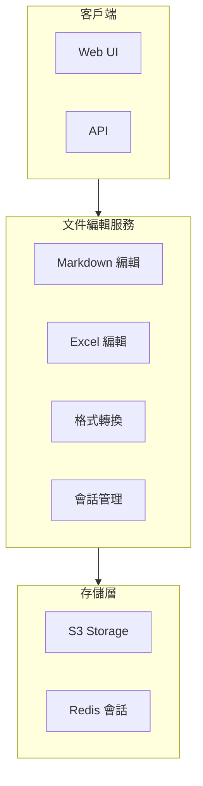

# MAI-S0130 文件編輯服務規格書

**文件編號**: MAI-S0130  
**版本**: 1.1  
**日期**: 2026-02-27  
**依據代碼**: `agents/`

---

## 1. 產品目的 (Product Purpose)

# 1.1 核心聲明

文件編輯服務提供對話式文件編輯能力，支持 Markdown、Excel 等格式的編輯、轉換功能，實現直觀的文件操作體驗。

**解決問題**:
- 非技術用戶的文件編輯需求
- 跨格式文檔轉換
- 版本控制與歷史管理
- 編輯操作的審計追蹤

**服務對象**:
- 前端用戶 (對話式編輯)
- 開發者 (API 調用)
- 系統管理員 (審計監控)

# 1.2 產品願景

成為企業級文檔處理的統一入口，提供自然語言驅動的智能編輯體驗。

---

## 2. 產品概覽 (Product Overview)

# 2.1 目標用戶

| 用戶類型 | 使用場景 | 需求 |
|---------|---------|------|
| 業務人員 | 文檔編輯 | 對話式操作 |
| 數據分析師 | Excel 處理 | 數據讀寫 |
| 開發者 | API 集成 | 完整接口 |

# 2.2 系統邊界



# 2.3 技術棧

| 層級 | 技術 | 版本 | 用途 |
|------|------|------|------|
| 編輯引擎 | openpyxl | 3.1+ | Excel 處理 |
| 轉換 | pandoc | 3.1+ | 格式轉換 |
| 緩存 | Redis | 7.0+ | 會話存儲 |
| 存儲 | SeaweedFS | 3.50+ | 文件存儲 |

---

## 3. 功能需求 (Functional Requirements)

# 3.1 核心功能

## 3.1.1 Markdown 編輯

| 功能 ID | 功能名稱 | 說明 |
|--------|---------|------|
| F-04-001 | 對話式編輯 | 通過自然語言指令編輯 |
| F-04-002 | 草稿管理 | 創建和管理草稿 |
| F-04-003 | 版本提交 | 提交更改記錄 |
| F-04-004 | 版本回滾 | 回滾到歷史版本 |

## 3.1.2 Excel 編輯

| 功能 ID | 功能名稱 | 說明 |
|--------|---------|------|
| F-04-010 | 讀取單元格 | 讀取指定單元格 |
| F-04-011 | 寫入單元格 | 寫入數據到單元格 |
| F-04-012 | 添加行 | 插入新行 |
| F-04-013 | 刪除行 | 刪除指定行 |
| F-04-014 | Sheet 管理 | 工作表操作 |

## 3.1.3 文件格式轉換

| 功能 ID | 功能名稱 | 說明 |
|--------|---------|------|
| F-04-020 | Markdown 轉 PDF | 文檔導出 |
| F-04-021 | Markdown 轉 HTML | 網頁發布 |
| F-04-022 | PDF 轉 Markdown | 文本提取 |
| F-04-023 | Excel 轉 PDF | 報表導出 |
| F-04-024 | 批量轉換 | 多文件批量處理 |

## 3.1.4 會話管理

| 功能 ID | 功能名稱 | 說明 |
|--------|---------|------|
| F-04-030 | 創建會話 | 建立編輯會話 |
| F-04-031 | 會話狀態 | 追蹤會話狀態 |
| F-04-032 | 會話過期 | 自動清理過期會話 |
| F-04-033 | 並發控制 | 防止同時編輯衝突 |

## 3.1.5 審計日誌

| 功能 ID | 功能名稱 | 說明 |
|--------|---------|------|
| F-04-040 | 操作記錄 | 記錄所有編輯操作 |
| F-04-041 | 查詢日誌 | 審計日誌查詢 |
| F-04-042 | 合規導出 | 合規格式導出 |

---

## 4. 性能要求 (Performance Requirements)

# 4.1 響應時間

| 指標 | 目標值 | 說明 |
|------|--------|------|
| 會話創建 | ≤ 500ms | 會話初始化 |
| 編輯響應 | ≤ 2000ms | 含 LLM 處理 |
| 格式轉換 | ≤ 30s | 文件大小相關 |

# 4.2 吞吐量

| 指標 | 目標值 | 說明 |
|------|--------|------|
| 並發會話 | ≥ 100 | 活躍會話數 |
| 轉換隊列 | ≥ 10 | 並行轉換數 |

---

## 5. 非功能性需求 (Non-Functional Requirements)

# 5.1 安全性

| 需求 ID | 需求描述 | 優先級 |
|---------|---------|--------|
| NFR-04-001 | 文件訪問權限 | 必須 |
| NFR-04-002 | 會話隔離 | 必須 |
| NFR-04-003 | 操作審計 | 必須 |

# 5.2 可靠性

| 需求 ID | 需求描述 | 目標值 |
|---------|---------|--------|
| NFR-04-010 | 系統可用性 | ≥ 99.9% |
| NFR-04-011 | 數據一致性 | 強一致性 |

---

## 6. 外部接口 (External Interfaces)

# 6.1 API 接口

| 方法 | 端點 | 功能 |
|------|------|------|
| POST | /api/v1/editing/session | 創建會話 |
| POST | /api/v1/editing/edit | 執行編輯 |
| POST | /api/v1/editing/commit | 提交更改 |
| POST | /api/v1/editing/rollback | 回滾 |
| POST | /api/v1/editing/convert | 格式轉換 |
| GET | /api/v1/editing/session/{id} | 獲取會話 |
| DELETE | /api/v1/editing/session/{id} | 關閉會話 |

# 6.2 數據格式

## 6.2.1 創建會話

```json
POST /api/v1/editing/session
{
    "user_id": "user_123",
    "file_path": "s3://bucket/doc.md"
}

// 響應
{
    "session_id": "sess_xxx",
    "status": "active",
    "file_path": "s3://bucket/doc.md"
}
```

## 6.2.2 執行編輯

```json
POST /api/v1/editing/edit
{
    "session_id": "sess_xxx",
    "instruction": "在第二段後添加新內容"
}

// 響應
{
    "status": "success",
    "diff": "...",
    "preview_url": "s3://bucket/preview/xxx"
}
```

---

## 7. 設計約束與假設 (Design Constraints & Assumptions)

# 7.1 技術約束

| 約束 ID | 約束描述 | 說明 |
|---------|---------|------|
| C-04-001 | 文件大小 | 最大 100MB |
| C-04-002 | 會話時長 | 最長 24 小時 |
| C-04-003 | 轉換格式 | 僅支持表格式轉換 |

# 7.2 假設條件

| 假設 ID | 假設描述 | 驗證方式 |
|---------|---------|----------|
| A-04-001 | S3 服務可用 | 健康檢查 |
| A-04-002 | 文件格式正確 | 格式驗證 |

---

## 8. 質量標準 (Quality Standards)

# 8.1 準確率標準

| 指標 | 目標值 | 說明 |
|------|--------|------|
| 指令解析準確率 | ≥ 90% | 自然語言理解 |
| 轉換成功率 | ≥ 99% | 格式轉換 |

---

# 9. 錯誤碼詳細定義

## 9.1 Markdown 編輯錯誤

| 錯誤碼 | 名稱 | 描述 | 處理方式 |
|--------|------|------|----------|
| E401-001 | FILE_NOT_FOUND | 文件不存在 | 返回錯誤 |
| E401-002 | INVALID_FILE_FORMAT | 文件格式錯誤 | 返回錯誤 |
| E401-003 | INSTRUCTION_PARSE_FAILED | 指令解析失敗 | 返回錯誤 |
| E401-004 | EDIT_EXECUTION_FAILED | 編輯執行失敗 | 返回錯誤 |
| E401-005 | PERMISSION_DENIED | 權限不足 | 返回錯誤 |
| E401-006 | DRAFT_NOT_FOUND | 草稿不存在 | 返回錯誤 |
| E401-007 | COMMIT_FAILED | 提交失敗 | 返回錯誤 |
| E401-008 | ROLLBACK_FAILED | 回滾失敗 | 返回錯誤 |

## 9.2 Excel 編輯錯誤

| 錯誤碼 | 名稱 | 描述 | 處理方式 |
|--------|------|------|----------|
| E410-001 | SHEET_NOT_FOUND | Sheet 不存在 | 返回錯誤 |
| E410-002 | INVALID_CELL_REFERENCE | 座標無效 | 返回錯誤 |
| E410-003 | INVALID_DATA_TYPE | 數據類型錯誤 | 返回錯誤 |
| E410-004 | FILE_LOCKED | 文件被鎖定 | 返回錯誤 |

## 9.3 格式轉換錯誤

| 錯誤碼 | 名稱 | 描述 | 處理方式 |
|--------|------|------|----------|
| E420-001 | UNSUPPORTED_FORMAT | 不支持的格式 | 返回錯誤 |
| E420-002 | CONVERSION_FAILED | 轉換失敗 | 返回錯誤 |
| E420-003 | FILE_CORRUPTED | 文件損壞 | 返回錯誤 |
| E420-004 | CONVERSION_TIMEOUT | 轉換超時 | 返回錯誤 |
| E420-005 | OUT_OF_MEMORY | 內存不足 | 返回錯誤 |

## 9.4 會話管理錯誤

| 錯誤碼 | 名稱 | 描述 | 處理方式 |
|--------|------|------|----------|
| E430-001 | SESSION_NOT_FOUND | 會話不存在 | 返回錯誤 |
| E430-002 | SESSION_EXPIRED | 會話過期 | 返回錯誤 |
| E430-003 | SESSION_LIMIT_EXCEEDED | 會話數量上限 | 返回錯誤 |

## 9.5 審計錯誤

| 錯誤碼 | 名稱 | 描述 | 處理方式 |
|--------|------|------|----------|
| E440-001 | AUDIT_LOG_FAILED | 日誌寫入失敗 | 返回錯誤 |

---

# 10. API 詳細規格

## 10.1 主要端點

| 方法 | 端點 | 功能 |
|------|------|------|
| POST | /api/v1/editing/session | 創建編輯會話 |
| POST | /api/v1/editing/edit | 執行編輯 |
| POST | /api/v1/editing/commit | 提交更改 |
| POST | /api/v1/editing/rollback | 回滾 |
| POST | /api/v1/editing/convert | 格式轉換 |
| GET | /api/v1/editing/session/{id} | 獲取會話 |
| DELETE | /api/v1/editing/session/{id} | 關閉會話 |

## 10.2 支援的轉換格式

| 源格式 | 目標格式 | 狀態 |
|--------|----------|------|
| Markdown | PDF | ✅ |
| Markdown | HTML | ✅ |
| PDF | Markdown | ✅ |
| Word | Markdown | ✅ |
| Excel | PDF | ✅ |

---

# 11. 驗收標準

## 11.1 功能驗收

| ID | 標準 |
|----|------|
| AC-04-001 | Markdown 編輯指令正確解析和執行 |
| AC-04-002 | Excel 讀寫操作正確 |
| AC-04-003 | 格式轉換正確輸出 |
| AC-04-004 | 會話狀態正確管理 |
| AC-04-005 | 所有錯誤有對應處理和日誌 |
| AC-04-006 | 編輯操作有完整審計日誌 |

## 11.2 性能驗收

| ID | 標準 |
|----|------|
| AC-04-010 | 編輯響應 < 2s |
| AC-04-011 | 支援 100 個並發會話 |

---

#*文件結束*
