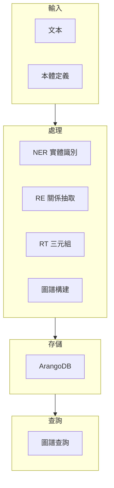

# MAI-S0140 知識圖譜服務規格書

**文件編號**: MAI-S0140  
**版本**: 1.1  
**日期**: 2026-02-27  
**依據代碼**: `agents/`

---

## 1. 產品目的 (Product Purpose)

# 1.1 核心聲明

知識圖譜服務提供知識本體 (Ontology) 管理和知識圖譜構建、查詢服務，支撐企業級知識管理與智能問答場景。

**解決問題**:
- 知識結構化存儲
- 實體與關係抽取
- 知識圖譜構建與查詢
- 本體版本管理

**服務對象**:
- 知識管理員
- 數據工程師
- 智能問答系統

# 1.2 產品願景

成為企業知識管理的核心引擎，提供完整的知識圖譜生命周期管理能力。

---

## 2. 產品概覽 (Product Overview)

# 2.1 目標用戶

| 用戶類型 | 使用場景 | 需求 |
|---------|---------|------|
| 知識管理員 | 本體管理 | 版本控制 |
| 數據工程師 | 圖譜構建 | 批量處理 |
| 開發者 | 圖譜查詢 | API 接口 |

# 2.2 系統邊界

# 2.3 技術棧

| 層級 | 技術 | 版本 | 用途 |
|------|------|------|------|
| 圖數據庫 | ArangoDB | 3.11+ | 圖譜存儲 |
| NLP | Transformers | - | NER/RE/RT |
| API | FastAPI | 0.100+ | 接口服務 |

---

## 3. 功能需求 (Functional Requirements)

# 3.1 核心功能

## 3.1.1 本體管理

| 功能 ID | 功能名稱 | 說明 |
|--------|---------|------|
| F-05-001 | 本體載入 | 載入本體定義 |
| F-05-002 | 本體列表 | 列出所有本體 |
| F-05-003 | 本體創建 | 創建新本體 |
| F-05-004 | 本體更新 | 更新本體定義 |
| F-05-005 | 本體刪除 | 刪除本體 |
| F-05-006 | 版本控制 | 本體版本管理 |

## 3.1.2 NER 實體識別

| 功能 ID | 功能名稱 | 說明 |
|--------|---------|------|
| F-05-010 | 實體提取 | 從文本識別實體 |
| F-05-011 | 批量提取 | 批量處理文本 |
| F-05-012 | 實體類型識別 | 識別實體類型 |

## 3.1.3 RE 關係抽取

| 功能 ID | 功能名稱 | 說明 |
|--------|---------|------|
| F-05-020 | 關係抽取 | 抽取實體間關係 |
| F-05-021 | 關係驗證 | 驗證關係有效性 |

## 3.1.4 RT 三元組抽取

| 功能 ID | 功能名稱 | 說明 |
|--------|---------|------|
| F-05-030 | 三元組抽取 | 抽取 S-P-O 三元組 |
| F-05-031 | 三元組規範化 | 規範化三元組格式 |

## 3.1.5 知識圖譜構建

| 功能 ID | 功能名稱 | 說明 |
|--------|---------|------|
| F-05-040 | 圖譜構建 | 存儲實體和關係 |
| F-05-041 | 圖譜添加 | 增量添加三元組 |
| F-05-042 | 圖譜刪除 | 刪除實體和關係 |

## 3.1.6 知識圖譜查詢

| 功能 ID | 功能名稱 | 說明 |
|--------|---------|------|
| F-05-050 | 實體查找 | 根據名稱查找實體 |
| F-05-051 | 關係查詢 | 查詢實體的關係 |
| F-05-052 | 子圖查詢 | 查詢子圖結構 |
| F-05-053 | 相似性搜索 | 向量相似性搜索 |

---

## 4. 性能要求 (Performance Requirements)

# 4.1 響應時間

| 指標 | 目標值 | 說明 |
|------|--------|------|
| 本體載入 | ≤ 500ms | 單本體 |
| 實體提取 | ≤ 1000ms | 單文本 |
| 圖譜查詢 | ≤ 500ms | 簡單查詢 |
| 子圖查詢 | ≤ 2000ms | 複雜查詢 |

# 4.2 吞吐量

| 指標 | 目標值 | 說明 |
|------|--------|------|
| 實體提取 | ≥ 10 QPS | 單實例 |
| 批量處理 | ≥ 1000 條/分 | 批量 |

---

## 5. 非功能性需求 (Non-Functional Requirements)

# 5.1 安全性

| 需求 ID | 需求描述 | 優先級 |
|---------|---------|--------|
| NFR-05-001 | 本體訪問控制 | 必須 |
| NFR-05-002 | 圖譜權限管理 | 必須 |
| NFR-05-003 | 操作審計日誌 | 必須 |

# 5.2 可靠性

| 需求 ID | 需求描述 | 目標值 |
|---------|---------|--------|
| NFR-05-010 | 系統可用性 | ≥ 99.9% |
| NFR-05-011 | 數據一致性 | 強一致性 |

---

## 6. 外部接口 (External Interfaces)

# 6.1 API 接口

| 方法 | 端點 | 功能 |
|------|------|------|
| GET | /api/v1/ontology | 列表本體 |
| POST | /api/v1/ontology | 創建本體 |
| GET | /api/v1/ontology/{domain} | 獲取本體 |
| POST | /api/v1/kg/ner | NER 實體識別 |
| POST | /api/v1/kg/re | RE 關係抽取 |
| POST | /api/v1/kg/rt | RT 三元組抽取 |
| POST | /api/v1/kg/build | 構建圖譜 |
| GET | /api/v1/kg/query | 圖譜查詢 |

---

## 7. 設計約束與假設 (Design Constraints & Assumptions)

# 7.1 技術約束

| 約束 ID | 約束描述 | 說明 |
|---------|---------|------|
| C-05-001 | 圖數據庫 | ArangoDB |
| C-05-002 | 實體數上限 | 單圖譜 1000 萬 |

# 7.2 假設條件

| 假設 ID | 假設描述 | 驗證方式 |
|---------|---------|----------|
| A-05-001 | ArangoDB 可用 | 健康檢查 |
| A-05-002 | LLM 服務可用 | NER/RE |

---

## 8. 質量標準 (Quality Standards)

# 8.1 準確率標準

| 指標 | 目標值 | 說明 |
|------|--------|------|
| NER F1 | ≥ 0.85 | 實體識別 |
| RE F1 | ≥ 0.80 | 關係抽取 |

---

# 9. 錯誤碼詳細定義

## 9.1 本體管理錯誤

| 錯誤碼 | 名稱 | 描述 | 處理方式 |
|--------|------|------|----------|
| E501-001 | ONTOLOGY_NOT_FOUND | 本體不存在 | 返回錯誤 |
| E501-002 | ONTOLOGY_INVALID | 本體格式錯誤 | 返回錯誤 |
| E501-003 | ONTOLOGY_CONFLICT | 本體衝突 | 返回錯誤 |
| E501-004 | VERSION_NOT_FOUND | 版本不存在 | 返回錯誤 |

## 9.2 NER 錯誤

| 錯誤碼 | 名稱 | 描述 | 處理方式 |
|--------|------|------|----------|
| E510-001 | NER_MODEL_LOAD_FAILED | 模型載入失敗 | 返回錯誤 |
| E510-002 | TEXT_PROCESSING_FAILED | 文本處理失敗 | 返回錯誤 |
| E510-003 | ENTITY_TYPE_UNSUPPORTED | 實體類型不支持 | 返回錯誤 |

## 9.3 RE 錯誤

| 錯誤碼 | 名稱 | 描述 | 處理方式 |
|--------|------|------|----------|
| E520-001 | RE_MODEL_LOAD_FAILED | 模型載入失敗 | 返回錯誤 |
| E520-002 | RELATION_TYPE_UNSUPPORTED | 關係類型不支持 | 返回錯誤 |
| E520-003 | ENTITY_NOT_FOUND | 實體不存在 | 返回錯誤 |

## 9.4 RT 錯誤

| 錯誤碼 | 名稱 | 描述 | 處理方式 |
|--------|------|------|----------|
| E530-001 | TRIPLE_EXTRACTION_FAILED | 三元組抽取失敗 | 返回錯誤 |
| E530-002 | TRIPLE_INVALID | 三元組格式錯誤 | 返回錯誤 |

## 9.5 圖譜構建錯誤

| 錯誤碼 | 名稱 | 描述 | 處理方式 |
|--------|------|------|----------|
| E540-001 | DB_CONNECTION_FAILED | 數據庫連接失敗 | 返回錯誤 |
| E540-002 | KG_WRITE_FAILED | 圖譜寫入失敗 | 返回錯誤 |
| E540-003 | KG_QUERY_TIMEOUT | 圖譜查詢超時 | 返回錯誤 |
| E540-004 | ENTITY_ID_CONFLICT | 實體ID衝突 | 返回錯誤 |

## 9.6 圖譜查詢錯誤

| 錯誤碼 | 名稱 | 描述 | 處理方式 |
|--------|------|------|----------|
| E550-001 | QUERY_SYNTAX_ERROR | 查詢語法錯誤 | 返回錯誤 |
| E550-002 | EMPTY_RESULT | 查詢結果為空 | 返回空結果 |
| E550-003 | QUERY_TIMEOUT | 查詢超時 | 返回錯誤 |

---

# 10. API 詳細規格

## 10.1 主要端點

| 方法 | 端點 | 功能 |
|------|------|------|
| GET | /api/v1/ontology | 列表本體 |
| POST | /api/v1/ontology | 創建本體 |
| GET | /api/v1/ontology/{domain} | 獲取本體 |
| POST | /api/v1/kg/ner | NER 實體識別 |
| POST | /api/v1/kg/re | RE 關係抽取 |
| POST | /api/v1/kg/rt | RT 三元組抽取 |
| POST | /api/v1/kg/build | 構建圖譜 |
| GET | /api/v1/kg/query | 圖譜查詢 |

---

# 11. 驗收標準

## 11.1 功能驗收

| ID | 標準 |
|----|------|
| AC-05-001 | 本體正確載入和管理 |
| AC-05-002 | NER/RE/RT 正確抽取實體和關係 |
| AC-05-003 | 知識圖譜正確構建和查詢 |
| AC-05-004 | 所有錯誤有對應處理和日誌 |
| AC-05-005 | 查詢響應時間 < 5 秒 |

## 11.2 性能驗收

| ID | 標準 |
|----|------|
| AC-05-010 | 實體提取 ≥ 10 QPS |
| AC-05-011 | 批量處理 ≥ 1000 條/分 |

---

#*文件結束*
