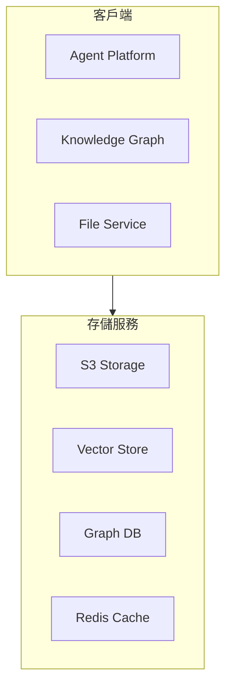

# MAI-S0150 存儲服務規格書

**文件編號**: MAI-S0150  
**版本**: 1.1  
**日期**: 2026-02-27  
**依據代碼**: `agents/`

---

## 1. 產品目的 (Product Purpose)

# 1.1 核心聲明

存儲服務提供統一的存儲服務接口，支持文件、向量、圖數據的持久化，為 AI-Box 平台提供多元化的數據存儲能力。

**解決問題**:
- 異構數據的統一存儲
- 高效的向量檢索
- 圖結構數據的關係管理
- 熱數據的緩存加速

**服務對象**:
- Agent 平台
- 知識圖譜服務
- 文件管理服務

# 1.2 產品願景

成為 AI-Box 平台的統一存儲層，提供高性能、高可用的數據持久化服務。

---

## 2. 產品概覽 (Product Overview)

# 2.1 目標用戶

| 用戶類型 | 使用場景 | 需求 |
|---------|---------|------|
| Agent 平台 | 數據持久化 | 統一接口 |
| 知識圖譜 | 圖數據存儲 | 圖查詢能力 |
| 文件服務 | 大文件存儲 | S3 兼容 |

# 2.2 系統邊界

# 2.3 技術棧

| 層級 | 技術 | 版本 | 用途 |
|------|------|------|------|
| 對象存儲 | SeaweedFS | 3.50+ | S3 兼容存儲 |
| 向量數據庫 | Qdrant | 1.7+ | 向量檢索 |
| 圖數據庫 | ArangoDB | 3.11+ | 圖數據存儲 |
| 緩存 | Redis | 7.0+ | 內存緩存 |

---

## 3. 功能需求 (Functional Requirements)

# 3.1 核心功能

## 3.1.1 文件存儲

| 功能 ID | 功能名稱 | 說明 |
|--------|---------|------|
| F-06-001 | 文件上傳 | 上傳文件到 S3 |
| F-06-002 | 文件下載 | 下載文件 |
| F-06-003 | 文件刪除 | 刪除文件 |
| F-06-004 | 文件列舉 | 列舉目錄文件 |
| F-06-005 | 預簽名 URL | 生成臨時訪問 URL |

## 3.1.2 向量存儲

| 功能 ID | 功能名稱 | 說明 |
|--------|---------|------|
| F-06-010 | 向量插入 | 插入向量數據 |
| F-06-011 | 向量搜索 | 相似性搜索 |
| F-06-012 | 集合管理 | 創建/刪除集合 |
| F-06-013 | 集合信息 | 獲取集合元數據 |

## 3.1.3 圖數據存儲

| 功能 ID | 功能名稱 | 說明 |
|--------|---------|------|
| F-06-020 | 文檔創建 | 創建圖文檔 |
| F-06-021 | 文檔讀取 | 讀取圖文檔 |
| F-06-022 | 文檔更新 | 更新圖文檔 |
| F-06-023 | 文檔刪除 | 刪除圖文檔 |
| F-06-024 | 邊管理 | 創建/刪除邊 |
| F-06-025 | AQL 查詢 | 執行 AQL 查詢 |

## 3.1.4 緩存服務

| 功能 ID | 功能名稱 | 說明 |
|--------|---------|------|
| F-06-030 | 緩存設置 | 設置鍵值 |
| F-06-031 | 緩存獲取 | 獲取鍵值 |
| F-06-032 | 緩存刪除 | 刪除鍵值 |
| F-06-033 | 緩存檢查 | 檢查鍵是否存在 |
| F-06-034 | 計數器 | 遞增/遞減操作 |

---

## 4. 性能要求 (Performance Requirements)

# 4.1 響應時間

| 指標 | 目標值 | 說明 |
|------|--------|------|
| 文件上傳 | ≤ 5000ms | 與文件大小相關 |
| 文件下載 | ≤ 3000ms | 與文件大小相關 |
| 向量搜索 | ≤ 100ms | 100 萬向量 |
| AQL 查詢 | ≤ 500ms | 簡單查詢 |

# 4.2 吞吐量

| 指標 | 目標值 | 說明 |
|------|--------|------|
| 並發連接 | ≥ 100 | 每服務 |
| 緩存 QPS | ≥ 10000 | Redis |

---

## 5. 非功能性需求 (Non-Functional Requirements)

# 5.1 安全性

| 需求 ID | 需求描述 | 優先級 |
|---------|---------|--------|
| NFR-06-001 | 訪問權限控制 | 必須 |
| NFR-06-002 | 數據加密傳輸 | 必須 |
| NFR-06-003 | 敏感數據脫敏 | 應該 |

# 5.2 可靠性

| 需求 ID | 需求描述 | 目標值 |
|---------|---------|--------|
| NFR-06-010 | 系統可用性 | ≥ 99.9% |
| NFR-06-011 | 數據持久性 | ≥ 99.999% |

---

## 6. 外部接口 (External Interfaces)

# 6.1 API 接口

## 6.1.1 文件存儲 API

| 方法 | 端點 | 功能 |
|------|------|------|
| POST | /api/v1/storage/upload | 上傳文件 |
| GET | /api/v1/storage/{key} | 下載文件 |
| DELETE | /api/v1/storage/{key} | 刪除文件 |
| GET | /api/v1/storage/list | 列舉文件 |

## 6.1.2 向量存儲 API

| 方法 | 端點 | 功能 |
|------|------|------|
| POST | /api/v1/vector/insert | 插入向量 |
| POST | /api/v1/vector/search | 搜索向量 |
| DELETE | /api/v1/vector/collection | 刪除集合 |

## 6.1.3 圖數據 API

| 方法 | 端點 | 功能 |
|------|------|------|
| POST | /api/v1/graph/document | 創建文檔 |
| GET | /api/v1/graph/document/{key} | 獲取文檔 |
| PUT | /api/v1/graph/document/{key} | 更新文檔 |
| DELETE | /api/v1/graph/document/{key} | 刪除文檔 |
| POST | /api/v1/graph/query | 執行 AQL |

---

## 7. 設計約束與假設 (Design Constraints & Assumptions)

# 7.1 技術約束

| 約束 ID | 約束描述 | 說明 |
|---------|---------|------|
| C-06-001 | 單文件大小 | 最大 1GB |
| C-06-002 | 向量維度 | 最大 4096 維 |
| C-06-003 | 緩存 TTL | 最大 24 小時 |

# 7.2 假設條件

| 假設 ID | 假設描述 | 驗證方式 |
|---------|---------|----------|
| A-06-001 | 各存儲服務可用 | 健康檢查 |
| A-06-002 | 網絡穩定 | 內網部署 |

---

## 8. 質量標準 (Quality Standards)

# 8.1 可靠性指標

| 指標 | 目標值 | 說明 |
|------|--------|------|
| 可用率 | ≥ 99.9% | 各存儲服務 |
| 數據持久性 | ≥ 99.999% | 寫入確認 |

---

# 9. 錯誤碼詳細定義

## 9.1 文件存儲錯誤

| 錯誤碼 | 名稱 | 描述 | 處理方式 |
|--------|------|------|----------|
| E601-001 | FILE_NOT_FOUND | 文件不存在 | 返回錯誤 |
| E601-002 | UPLOAD_FAILED | 上傳失敗 | 返回錯誤 |
| E601-003 | PERMISSION_DENIED | 權限不足 | 返回錯誤 |
| E601-004 | STORAGE_FULL | 存儲空間不足 | 返回錯誤 |
| E601-005 | FILE_TOO_LARGE | 文件過大 | 返回錯誤 |

## 9.2 向量存儲錯誤

| 錯誤碼 | 名稱 | 描述 | 處理方式 |
|--------|------|------|----------|
| E610-001 | COLLECTION_NOT_FOUND | 集合不存在 | 返回錯誤 |
| E610-002 | DIMENSION_MISMATCH | 向量維度不匹配 | 返回錯誤 |
| E610-003 | INSERT_FAILED | 向量插入失敗 | 返回錯誤 |
| E610-004 | SEARCH_TIMEOUT | 搜索超時 | 返回錯誤 |
| E610-005 | CONNECTION_FAILED | 連接失敗 | 返回錯誤 |

## 9.3 圖數據錯誤

| 錯誤碼 | 名稱 | 描述 | 處理方式 |
|--------|------|------|----------|
| E620-001 | COLLECTION_NOT_FOUND | 集合不存在 | 返回錯誤 |
| E620-002 | DOCUMENT_NOT_FOUND | 文檔不存在 | 返回錯誤 |
| E620-003 | AQL_SYNTAX_ERROR | AQL 語法錯誤 | 返回錯誤 |
| E620-004 | TRANSACTION_FAILED | 事務失敗 | 返回錯誤 |
| E620-005 | CONNECTION_FAILED | 連接失敗 | 返回錯誤 |

## 9.4 緩存錯誤

| 錯誤碼 | 名稱 | 描述 | 處理方式 |
|--------|------|------|----------|
| E630-001 | CONNECTION_FAILED | 連接失敗 | 返回錯誤 |
| E630-002 | CACHE_EXPIRED | 緩存過期 | 返回 null |
| E630-003 | CACHE_MISS | 緩存未命中 | 返回 null |

---

# 10. API 詳細規格

## 10.1 文件存儲 API

| 方法 | 端點 | 功能 |
|------|------|------|
| POST | /api/v1/storage/upload | 上傳文件 |
| GET | /api/v1/storage/{key} | 下載文件 |
| DELETE | /api/v1/storage/{key} | 刪除文件 |
| GET | /api/v1/storage/list | 列舉文件 |

## 10.2 向量存儲 API

| 方法 | 端點 | 功能 |
|------|------|------|
| POST | /api/v1/vector/insert | 插入向量 |
| POST | /api/v1/vector/search | 搜索向量 |
| DELETE | /api/v1/vector/collection | 刪除集合 |

## 10.3 圖數據 API

| 方法 | 端點 | 功能 |
|------|------|------|
| POST | /api/v1/graph/document | 創建文檔 |
| GET | /api/v1/graph/document/{key} | 獲取文檔 |
| PUT | /api/v1/graph/document/{key} | 更新文檔 |
| DELETE | /api/v1/graph/document/{key} | 刪除文檔 |
| POST | /api/v1/graph/query | 執行 AQL |

---

# 11. 驗收標準

## 11.1 功能驗收

| ID | 標準 |
|----|------|
| AC-06-001 | 文件上傳/下載正確執行 |
| AC-06-002 | 向量搜索正確返回結果 |
| AC-06-003 | 圖數據 CRUD 正確執行 |
| AC-06-004 | 緩存正確設置和獲取 |
| AC-06-005 | 所有錯誤有對應處理和日誌 |

## 11.2 性能驗收

| ID | 標準 |
|----|------|
| AC-06-010 | 向量搜索 < 100ms |
| AC-06-011 | 緩存 QPS ≥ 10000 |

---

#*文件結束*
