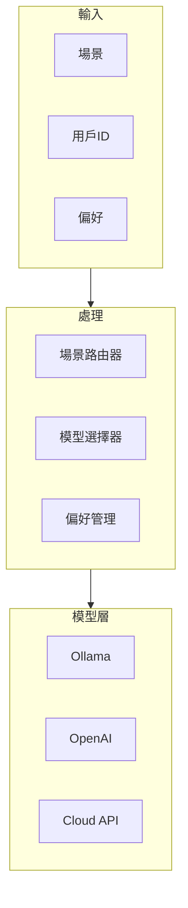

# MAI-S0160 MoE模型路由規格書

**文件編號**: MAI-S0160  
**版本**: 1.1  
**日期**: 2026-02-27  
**依據代碼**: `agents/`

---

## 1. 產品目的 (Product Purpose)

# 1.1 核心聲明

MoE (Mixture of Experts) 模型路由系統根據任務類型和場景，動態選擇最適合的 LLM 模型，實現智能的模型調度與成本優化。

**解決問題**:
- 多模型場景適配
- 用戶偏好自定義
- 模型成本控制
- 模型可用性管理

**服務對象**:
- Agent 平台
- 任務調度系統
- 最終用戶

# 1.2 產品願景

成為 AI-Box 平台的智能模型調度中心，實現模型資源的最優分配。

---

## 2. 產品概覽 (Product Overview)

# 2.1 目標用戶

| 用戶類型 | 使用場景 | 需求 |
|---------|---------|------|
| Agent 平台 | 任務處理 | 智能模型選擇 |
| 開發者 | API 調用 | 靈活配置 |
| 最終用戶 | 偏好設置 | 自定義體驗 |

# 2.2 系統邊界

# 2.3 技術棧

| 層級 | 技術 | 版本 | 用途 |
|------|------|------|------|
| 路由 | FastAPI | 0.100+ | 接口服務 |
| 配置 | JSON | - | 場景配置 |
| 緩存 | Redis | 7.0+ | 偏好存儲 |
| 模型 | Ollama | 0.1+ | 本地模型 |

---

## 3. 功能需求 (Functional Requirements)

# 3.1 核心功能

## 3.1.1 場景路由

| 功能 ID | 功能名稱 | 說明 |
|--------|---------|------|
| F-07-001 | 場景識別 | 識別任務場景 |
| F-07-002 | 模型選擇 | 根據場景選擇模型 |
| F-07-003 | 場景配置 | 獲取場景配置 |
| F-07-004 | 備用路由 | 模型不可用時切換 |

## 3.1.2 模型管理

| 功能 ID | 功能名稱 | 說明 |
|--------|---------|------|
| F-07-010 | 模型列表 | 列出可用模型 |
| F-07-011 | 模型信息 | 獲取模型詳情 |
| F-07-012 | 可用性檢查 | 檢查模型狀態 |

## 3.1.3 用戶偏好

| 功能 ID | 功能名稱 | 說明 |
|--------|---------|------|
| F-07-020 | 偏好設置 | 設置用戶偏好 |
| F-07-021 | 偏好獲取 | 獲取用戶偏好 |
| F-07-022 | 偏好刪除 | 刪除用戶偏好 |
| F-07-023 | 偏好繼承 | 繼承默認偏好 |

## 3.1.4 成本控制

| 功能 ID | 功能名稱 | 說明 |
|--------|---------|------|
| F-07-030 | 成本追蹤 | 追蹤使用成本 |
| F-07-031 | 成本限制 | 超限攔截 |
| F-07-032 | 配額管理 | 配額控制 |

---

## 4. 性能要求 (Performance Requirements)

# 4.1 響應時間

| 指標 | 目標值 | 說明 |
|------|--------|------|
| 模型選擇 | ≤ 50ms | 場景路由 |
| 偏好讀取 | ≤ 10ms | Redis 讀取 |
| 成本計算 | ≤ 5ms | 內存計算 |

# 4.2 吞吐量

| 指標 | 目標值 | 說明 |
|------|--------|------|
| 路由請求 | ≥ 1000 QPS | 單實例 |

---

## 5. 非功能性需求 (Non-Functional Requirements)

# 5.1 可靠性

| 需求 ID | 需求描述 | 目標值 |
|---------|---------|--------|
| NFR-07-010 | 系統可用性 | ≥ 99.9% |
| NFR-07-011 | 故障切換 | < 1 秒 |

# 5.2 擴展性

| 需求 ID | 需求描述 | 說明 |
|---------|---------|------|
| NFR-07-020 | 模型熱添加 | 無需重啟 |
| NFR-07-021 | 場景動態配置 | 熱更新 |

---

## 6. 外部接口 (External Interfaces)

# 6.1 API 接口

| 方法 | 端點 | 功能 |
|------|------|------|
| GET | /api/v1/moe/scenes | 獲取場景列表 |
| GET | /api/v1/moe/scenes/{scene}/config | 獲取場景配置 |
| POST | /api/v1/moe/select | 選擇模型 |
| GET | /api/v1/moe/models | 獲取模型列表 |
| GET | /api/v1/moe/user-preferences | 獲取用戶偏好 |
| PUT | /api/v1/moe/user-preferences/{scene} | 設置用戶偏好 |
| DELETE | /api/v1/moe/user-preferences/{scene} | 刪除用戶偏好 |

---

## 7. 設計約束與假設 (Design Constraints & Assumptions)

# 7.1 技術約束

| 約束 ID | 約束描述 | 說明 |
|---------|---------|------|
| C-07-001 | 場景數量 | 最多 100 -07-002個 |
| C | 模型數量 | 最多 50 個 |

# 7.2 假設條件

| 假設 ID | 假設描述 | 驗證方式 |
|---------|---------|----------|
| A-07-001 | 模型服務可用 | 健康檢查 |
| A-07-002 | Redis 可用 | 連接檢查 |

---

## 8. 質量標準 (Quality Standards)

# 8.1 準確率標準

| 指標 | 目標值 | 說明 |
|------|--------|------|
| 模型選擇正確率 | ≥ 99% | 場景匹配 |

---

# 9. 錯誤碼詳細定義

## 9.1 路由錯誤

| 錯誤碼 | 名稱 | 描述 | 處理方式 |
|--------|------|------|----------|
| E701-001 | SCENE_NOT_FOUND | 場景不存在 | 返回默認模型 |
| E701-002 | MODEL_UNAVAILABLE | 模型不可用 | 嘗試備用模型 |
| E701-003 | CONFIG_ERROR | 配置錯誤 | 返回錯誤 |

## 9.2 模型管理錯誤

| 錯誤碼 | 名稱 | 描述 | 處理方式 |
|--------|------|------|----------|
| E710-001 | MODEL_NOT_FOUND | 模型不存在 | 返回錯誤 |
| E710-002 | MODEL_UNAVAILABLE | 模型不可用 | 返回錯誤 |

## 9.3 偏好錯誤

| 錯誤碼 | 名稱 | 描述 | 處理方式 |
|--------|------|------|----------|
| E720-001 | PREFERENCE_SET_FAILED | 偏好設置失敗 | 返回錯誤 |
| E720-002 | PREFERENCE_GET_FAILED | 偏好讀取失敗 | 返回默認配置 |

## 9.4 成本錯誤

| 錯誤碼 | 名稱 | 描述 | 處理方式 |
|--------|------|------|----------|
| E730-001 | COST_LIMIT_EXCEEDED | 成本超限 | 返回錯誤 |
| E730-002 | QUOTA_EXHAUSTED | 配額不足 | 返回錯誤 |

---

# 10. 支援的場景配置

| 場景 | 模型 | 溫度 | 超時 |
|------|------|------|------|
| chat | gpt-oss:120b-cloud | 0.7 | 60s |
| semantic_understanding | gpt-oss:120b-cloud | 0.3 | 30s |
| task_analysis | gpt-oss:120b-cloud | 0.3 | 45s |
| orchestrator | gpt-oss:120b-cloud | 0.2 | 30s |
| embedding | nomic-embed-text:latest | - | 120s |
| knowledge_graph_extraction | gpt-oss:120b-cloud | 0.2 | 180s |

---

# 11. API 詳細規格

## 11.1 主要端點

| 方法 | 端點 | 功能 |
|------|------|------|
| GET | /api/v1/moe/scenes | 獲取場景列表 |
| GET | /api/v1/moe/scenes/{scene}/config | 獲取場景配置 |
| POST | /api/v1/moe/select | 選擇模型 |
| GET | /api/v1/moe/models | 獲取模型列表 |
| GET | /api/v1/moe/user-preferences | 獲取用戶偏好 |
| PUT | /api/v1/moe/user-preferences/{scene} | 設置用戶偏好 |
| DELETE | /api/v1/moe/user-preferences/{scene} | 刪除用戶偏好 |

---

# 12. 驗收標準

## 12.1 功能驗收

| ID | 標準 |
|----|------|
| AC-07-001 | 場景路由正確選擇模型 |
| AC-07-002 | 用戶偏好正確生效 |
| AC-07-003 | 模型可用性正確檢測 |
| AC-07-004 | 所有錯誤有對應處理 |

## 12.2 性能驗收

| ID | 標準 |
|----|------|
| AC-07-010 | 模型選擇 < 50ms |
| AC-07-011 | 支援 1000 QPS |

---

#*文件結束*
