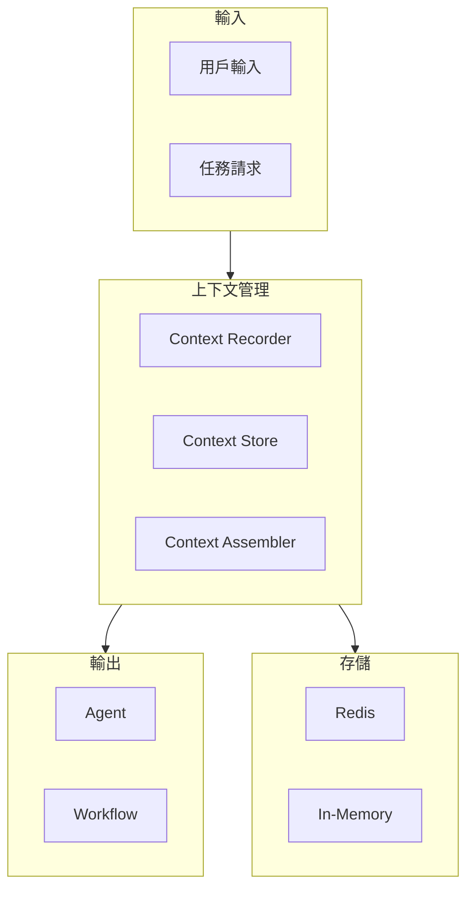

# MAI-S0170 上下文管理服務規格書

**文件編號**: MAI-S0170  
**版本**: 1.1  
**日期**: 2026-02-27  
**依據代碼**: `agents/`

---

## 1. 產品目的 (Product Purpose)

# 1.1 核心聲明

上下文管理服務是 AI-Box 的核心狀態管理層，負責在對話和任務執行過程中維護、管理和傳遞上下文信息，確保多輪對話和鏈式處理的連貫性。

**解決問題**:
- 多輪對話的狀態維護
- 任務執行過程中的上下文傳遞
- 跨 Agent 的信息共享
- 工作流狀態追蹤

**服務對象**:
- Agent 平台
- 工作流引擎
- 前端會話管理

# 1.2 產品願景

成為 AI-Box 平台的信息樞紐，提供高效、可靠的上下文傳遞和狀態管理能力。

---

## 2. 產品概覽 (Product Overview)

# 2.1 目標用戶

| 用戶類型 | 使用場景 | 需求 |
|---------|---------|------|
| Agent 平台 | 跨輪對話 | 狀態維護 |
| 工作流引擎 | 多步驟任務 | 上下文傳遞 |
| 前端 | 會話管理 | 歷史記錄 |

# 2.2 系統邊界

# 2.3 技術棧

| 層級 | 技術 | 版本 | 用途 |
|------|------|------|------|
| 緩存 | Redis | 7.0+ | 上下文持久化 |
| 內存 | Dict | - | 臨時存儲 |
| 序列化 | JSON | - | 狀態序列化 |

---

## 3. 功能需求 (Functional Requirements)

# 3.1 核心功能

## 3.1.1 上下文記錄

| 功能 ID | 功能名稱 | 說明 |
|--------|---------|------|
| F-10-001 | 上下文保存 | 保存對話/任務上下文 |
| F-10-002 | 上下文加載 | 恢復歷史上下文 |
| F-10-003 | 上下文序列化 | 狀態序列化/反序列化 |
| F-10-004 | 上下文過期 | 自動清理過期上下文 |

## 3.1.2 上下文組裝

| 功能 ID | 功能名稱 | 說明 |
|--------|---------|------|
| F-10-010 | 上下文組裝 | 組裝多源上下文 |
| F-10-011 | 上下文裁剪 | 根據需要裁剪上下文 |
| F-10-012 | 上下文合併 | 合併多個上下文 |
| F-10-013 | 上下文優先級 | 優先級排序 |

## 3.1.3 上下文傳遞

| 功能 ID | 功能名稱 | 說明 |
|--------|---------|------|
| F-10-020 | 跨輪傳遞 | 對話輪次間傳遞 |
| F-10-021 | 跨 Agent 傳遞 | 多 Agent 協作傳遞 |
| F-10-022 | 跨工作流傳遞 | 工作流步驟間傳遞 |

---

## 4. 性能要求 (Performance Requirements)

# 4.1 響應時間

| 指標 | 目標值 | 說明 |
|------|--------|------|
| 上下文保存 | ≤ 10ms | Redis 寫入 |
| 上下文加載 | ≤ 20ms | 完整上下文 |
| 上下文組裝 | ≤ 50ms | 多源組裝 |

# 4.2 容量

| 指標 | 目標值 | 說明 |
|------|--------|------|
| 單上下文大小 | ≤ 1MB | JSON 序列化 |
| 並發上下文 | ≥ 1000 | 活躍會話數 |

---

## 5. 非功能性需求 (Non-Functional Requirements)

# 5.1 可靠性

| 需求 ID | 需求描述 | 目標值 |
|---------|---------|--------|
| NFR-10-010 | 數據持久性 | ≥ 99.9% |
| NFR-10-011 | 故障恢復 | 自動恢復 |

# 5.2 安全性

| 需求 ID | 需求描述 | 優先級 |
|---------|---------|--------|
| NFR-10-020 | 上下文隔離 | 會話級隔離 |
| NFR-10-021 | 敏感數據脫敏 | 應該 |

---

## 6. 外部接口 (External Interfaces)

# 6.1 API 接口

| 方法 | 端點 | 功能 |
|------|------|------|
| POST | /api/v1/context/save | 保存上下文 |
| GET | /api/v1/context/load | 加載上下文 |
| DELETE | /api/v1/context/clear | 清除上下文 |

---

## 7. 設計約束與假設 (Design Constraints & Assumptions)

# 7.1 技術約束

| 約束 ID | 約束描述 | 說明 |
|---------|---------|------|
| C-10-001 | 上下文大小 | 最大 1MB |
| C-10-002 | TTL 限制 | 最長 24 小時 |

# 7.2 假設條件

| 假設 ID | 假設描述 | 驗證方式 |
|---------|---------|----------|
| A-10-001 | Redis 可用 | 健康檢查 |

---

## 8. 質量標準 (Quality Standards)

# 8.1 一致性標準

| 指標 | 目標值 | 說明 |
|------|--------|------|
| 上下文完整率 | ≥ 99.9% | 狀態不丟失 |

---

# 9. 錯誤碼詳細定義

## 9.1 上下文錯誤

| 錯誤碼 | 名稱 | 描述 | 處理方式 |
|--------|------|------|----------|
| E1001-001 | CONTEXT_NOT_FOUND | 上下文不存在 | 返回空上下文 |
| E1001-002 | CONTEXT_SAVE_FAILED | 保存失敗 | 重試 |
| E1001-003 | CONTEXT_LOAD_FAILED | 加載失敗 | 返回錯誤 |
| E1001-004 | CONTEXT_EXPIRED | 上下文過期 | 返回過期標記 |
| E1001-005 | CONTEXT_TOO_LARGE | 上下文過大 | 裁剪後保存 |

---

# 10. API 詳細規格

## 10.1 主要端點

| 方法 | 端點 | 功能 |
|------|------|------|
| POST | /api/v1/context/save | 保存上下文 |
| GET | /api/v1/context/load?session_id=xxx | 加載上下文 |
| DELETE | /api/v1/context/clear?session_id=xxx | 清除上下文 |

---

# 11. 驗收標準

## 11.1 功能驗收

| ID | 標準 |
|----|------|
| AC-10-001 | 上下文正確保存和恢復 |
| AC-10-002 | 跨輪對話狀態正確 |
| AC-10-003 | 上下文正確傳遞給 Agent |

## 11.2 性能驗收

| ID | 標準 |
|----|------|
| AC-10-010 | 上下文保存 < 10ms |
| AC-10-011 | 支援 1000 個並發會話 |

---

#*文件結束*
