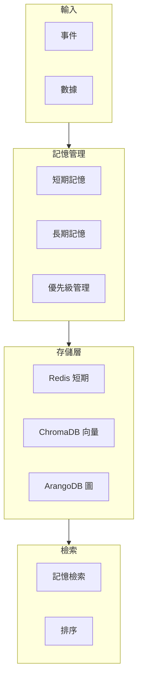

# MAI-S0180 記憶管理服務規格書

**文件編號**: MAI-S0180  
**版本**: 1.1  
**日期**: 2026-02-27  
**依據代碼**: `agents/`

---

## 1. 產品目的 (Product Purpose)

# 1.1 核心聲明

記憶管理服務提供短期記憶和長期記憶的分層管理能力，支援記憶存儲、檢索、更新和刪除，為 Agent 提供持續的知識和對話歷史。

**解決問題**:
- 短期會話記憶的管理
- 長期知識的持久化
- 記憶的有效檢索
- 記憶優先級管理

**服務對象**:
- Agent 平台
- 知識圖譜服務
- 對話系統

# 1.2 產品願景

成為 AI-Box 平台的記憶中樞，提供像人類一樣的記憶層次管理能力。

---

## 2. 產品概覽 (Product Overview)

# 2.1 目標用戶

| 用戶類型 | 使用場景 | 需求 |
|---------|---------|------|
| Agent | 上下文理解 | 歷史記憶 |
| 用戶 | 個性化體驗 | 偏好記憶 |
| 系統 | 知識積累 | 長期存儲 |

# 2.2 系統邊界

# 2.3 技術棧

| 層級 | 技術 | 版本 | 用途 |
|------|------|------|------|
| 短期記憶 | Redis | 7.0+ | 會話級記憶 |
| 向量存儲 | ChromaDB | 0.4+ | 語義檢索 |
| 圖存儲 | ArangoDB | 3.11+ | 關係記憶 |
| 內存 | Dict | - | 緩存 |

---

## 3. 功能需求 (Functional Requirements)

# 3.1 核心功能

## 3.1.1 短期記憶

| 功能 ID | 功能名稱 | 說明 |
|--------|---------|------|
| F-20-001 | 記憶存儲 | 短期記憶寫入 |
| F-20-002 | 記憶讀取 | 短期記憶讀取 |
| F-20-003 | 記憶過期 | TTL 自動過期 |
| F-20-004 | 記憶清除 | 手動清除 |

## 3.1.2 長期記憶

| 功能 ID | 功能名稱 | 說明 |
|--------|---------|------|
| F-20-010 | 向量存儲 | 語義記憶存儲 |
| F-20-011 | 向量檢索 | 相似性搜索 |
| F-20-012 | 圖存儲 | 關係記憶存儲 |
| F-20-013 | 圖檢索 | 關係查詢 |

## 3.1.3 記憶優先級

| 功能 ID | 功能名稱 | 說明 |
|--------|---------|------|
| F-20-020 | 優先級評估 | 評估記憶重要性 |
| F-20-021 | 記憶淘汰 | 低優先級記憶清理 |
| F-20-022 | 記憶強化 | 重要記憶強化 |

## 3.1.4 AAM 記憶管理

| 功能 ID | 功能名稱 | 說明 |
|--------|---------|------|
| F-20-030 | AAM 存儲 | 統一記憶存儲接口 |
| F-20-031 | AAM 檢索 | 統一記憶檢索接口 |
| F-20-032 | AAM 更新 | 記憶更新 |
| F-20-033 | AAM 刪除 | 記憶刪除 |

---

## 4. 性能要求 (Performance Requirements)

# 4.1 響應時間

| 指標 | 目標值 | 說明 |
|------|--------|------|
| 短期記憶讀寫 | ≤ 5ms | Redis |
| 向量檢索 | ≤ 100ms | 100萬向量 |
| 圖檢索 | ≤ 50ms | 簡單查詢 |

# 4.2 容量

| 指標 | 目標值 | 說明 |
|------|--------|------|
| 向量存儲 | ≥ 1000萬 | 單實例 |
| 圖節點 | ≥ 1000萬 | 單實例 |

---

## 5. 非功能性需求 (Non-Functional Requirements)

# 5.1 可靠性

| 需求 ID | 需求描述 | 目標值 |
|---------|---------|--------|
| NFR-20-010 | 系統可用性 | ≥ 99.9% |
| NFR-20-011 | 數據持久性 | ≥ 99.999% |

# 5.2 安全性

| 需求 ID | 需求描述 | 優先級 |
|---------|---------|--------|
| NFR-20-020 | 記憶隔離 | 必須 |
| NFR-20-021 | 訪問控制 | 必須 |

---

## 6. 外部接口 (External Interfaces)

# 6.1 API 接口

| 方法 | 端點 | 功能 |
|------|------|------|
| POST | /api/v1/memory/store | 存儲記憶 |
| GET | /api/v1/memory/retrieve | 檢索記憶 |
| PUT | /api/v1/memory/update | 更新記憶 |
| DELETE | /api/v1/memory/delete | 刪除記憶 |

---

## 7. 設計約束與假設 (Design Constraints & Assumptions)

# 7.1 技術約束

| 約束 ID | 約束描述 | 說明 |
|---------|---------|------|
| C-20-001 | 向量維度 | 最大 4096 維 |
| C-20-002 | 短期記憶 TTL | 最大 24 小時 |

# 7.2 假設條件

| 假設 ID | 假設描述 | 驗證方式 |
|---------|---------|----------|
| A-20-001 | 存儲服務可用 | 健康檢查 |

---

## 8. 質量標準 (Quality Standards)

# 8.1 檢索質量

| 指標 | 目標值 | 說明 |
|------|--------|------|
| 檢索準確率 | ≥ 90% | Top-K 準確率 |

---

# 9. 錯誤碼詳細定義

## 9.1 記憶錯誤

| 錯誤碼 | 名稱 | 描述 | 處理方式 |
|--------|------|------|----------|
| E2001-001 | MEMORY_NOT_FOUND | 記憶不存在 | 返回空 |
| E2001-002 | MEMORY_STORE_FAILED | 存儲失敗 | 重試 |
| E2001-003 | MEMORY_RETRIEVE_FAILED | 檢索失敗 | 返回錯誤 |
| E2001-004 | MEMORY_DELETE_FAILED | 刪除失敗 | 返回錯誤 |
| E2001-005 | VECTOR_DIMENSION_MISMATCH | 維度不匹配 | 返回錯誤 |

---

# 10. API 詳細規格

## 10.1 主要端點

| 方法 | 端點 | 功能 |
|------|------|------|
| POST | /api/v1/memory/store | 存儲記憶 |
| GET | /api/v1/memory/retrieve?query=xxx | 檢索記憶 |
| PUT | /api/v1/memory/update | 更新記憶 |
| DELETE | /api/v1/memory/delete | 刪除記憶 |

---

# 11. 驗收標準

## 11.1 功能驗收

| ID | 標準 |
|----|------|
| AC-20-001 | 短期記憶正確讀寫 |
| AC-20-002 | 向量檢索正確返回 |
| AC-20-003 | 記憶優先級正確管理 |

## 11.2 性能驗收

| ID | 標準 |
|----|------|
| AC-20-010 | 向量檢索 < 100ms |
| AC-20-011 | 支援 1000萬 向量 |

---

#*文件結束*
