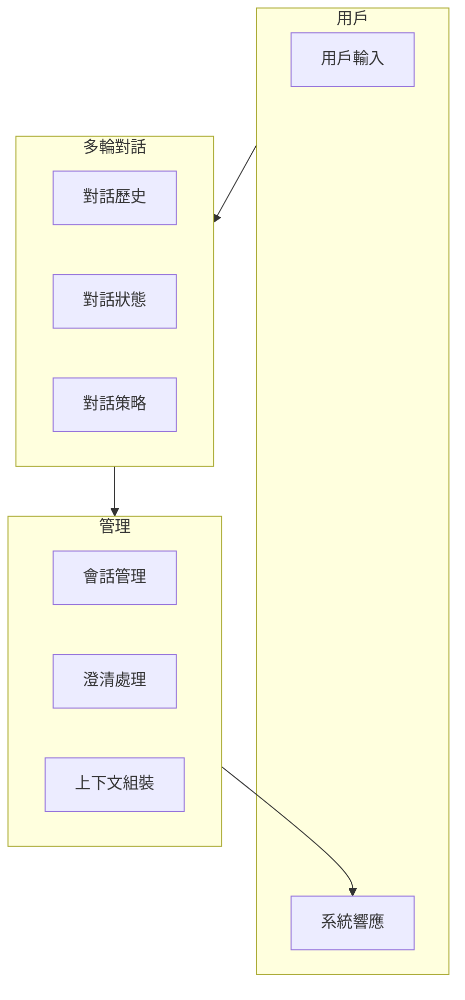

# MAI-S0190 多輪對話服務規格書

**文件編號**: MAI-S0190  
**版本**: 1.1  
**日期**: 2026-02-27  
**依據代碼**: `agents/`

---

## 1. 產品目的 (Product Purpose)

# 1.1 核心聲明

多輪對話服務支撐 AI-Box 的連續對話能力，管理對話歷史、理解對話上下文、處理對話狀態，並支持澄清問題和對話策略。

**解決問題**:
- 多輪對話的連貫性
- 對話歷史的有效管理
- 對話狀態追蹤
- 澄清問題處理

**服務對象**:
- 前端用戶
- Agent 平台
- 對話系統

# 1.2 產品願景

提供像人類一樣的自然對話體驗，支援複雜的多輪交互場景。

---

## 2. 產品概覽 (Product Overview)

# 2.1 目標用戶

| 用戶類型 | 使用場景 | 需求 |
|---------|---------|------|
| 用戶 | 自然對話 | 連貫體驗 |
| 開發者 | API 集成 | 靈活接口 |
| 系統 | 對話管理 | 狀態追蹤 |

# 2.2 系統邊界

# 2.3 技術棧

| 層級 | 技術 | 版本 | 用途 |
|------|------|------|------|
| 會話 | Redis | 7.0+ | 會話存儲 |
| 歷史 | ArangoDB | 3.11+ | 歷史存儲 |
| API | FastAPI | 0.100+ | 接口服務 |

---

## 3. 功能需求 (Functional Requirements)

# 3.1 核心功能

## 3.1.1 對話歷史

| 功能 ID | 功能名稱 | 說明 |
|--------|---------|------|
| F-30-001 | 歷史記錄 | 記錄對話輪次 |
| F-30-002 | 歷史檢索 | 檢索歷史對話 |
| F-30-003 | 歷史摘要 | 壓縮長對話 |
| F-30-004 | 歷史清除 | 清除歷史 |

## 3.1.2 對話狀態

| 功能 ID | 功能名稱 | 說明 |
|--------|---------|------|
| F-30-010 | 狀態維護 | 維護對話狀態 |
| F-30-011 | 狀態轉換 | 狀態變化追蹤 |
| F-30-012 | 狀態恢復 | 恢復歷史狀態 |

## 3.1.3 澄清處理

| 功能 ID | 功能名稱 | 說明 |
|--------|---------|------|
| F-30-020 | 意圖澄清 | 請求用戶澄清 |
| F-30-021 | 參數確認 | 確認關鍵參數 |
| F-30-022 | 歧義處理 | 處理多義問題 |

## 3.1.4 對話策略

| 功能 ID | 功能名稱 | 說明 |
|--------|---------|------|
| F-30-030 | 主動詢問 | 主動引導對話 |
| F-30-031 | 話題轉換 | 平滑切換話題 |
| F-30-032 | 對話總結 | 生成對話摘要 |

---

## 4. 性能要求 (Performance Requirements)

# 4.1 響應時間

| 指標 | 目標值 | 說明 |
|------|--------|------|
| 對話歷史檢索 | ≤ 50ms | 單會話 |
| 上下文組裝 | ≤ 100ms | 10 輪對話 |
| 狀態更新 | ≤ 20ms | 狀態寫入 |

# 4.2 容量

| 指標 | 目標值 | 說明 |
|------|--------|------|
| 單會話輪次 | ≥ 100 輪 | 歷史容量 |
| 並發會話 | ≥ 500 | 活躍會話 |

---

## 5. 非功能性需求 (Non-Functional Requirements)

# 5.1 可用性

| 需求 ID | 需求描述 | 目標值 |
|---------|---------|--------|
| NFR-30-010 | 對話連貫性 | ≥ 99% |
| NFR-30-011 | 會話保持 | ≥ 99.9% |

# 5.2 隱私

| 需求 ID | 需求描述 | 優先級 |
|---------|---------|--------|
| NFR-30-020 | 對話加密 | 應該 |
| NFR-30-021 | 數據脫敏 | 應該 |

---

## 6. 外部接口 (External Interfaces)

# 6.1 API 接口

| 方法 | 端點 | 功能 |
|------|------|------|
| POST | /api/v1/chat/send | 發送消息 |
| GET | /api/v1/chat/history | 獲取歷史 |
| GET | /api/v1/chat/session | 獲取會話 |
| DELETE | /api/v1/chat/session | 刪除會話 |

---

## 7. 設計約束與假設 (Design Constraints & Assumptions)

# 7.1 技術約束

| 約束 ID | 約束描述 | 說明 |
|---------|---------|------|
| C-30-001 | 單輪消息大小 | 最大 10KB |
| C-30-002 | 會話時長 | 最長 24 小時 |

# 7.2 假設條件

| 假設 ID | 假設描述 | 驗證方式 |
|---------|---------|----------|
| A-30-001 | 用戶已認證 | Token 驗證 |

---

## 8. 質量標準 (Quality Standards)

# 8.1 對話質量

| 指標 | 目標值 | 說明 |
|------|--------|------|
| 上下文保持率 | ≥ 95% | 10 輪後 |

---

# 9. 錯誤碼詳細定義

## 9.1 對話錯誤

| 錯誤碼 | 名稱 | 描述 | 處理方式 |
|--------|------|------|----------|
| E3001-001 | SESSION_NOT_FOUND | 會話不存在 | 創建新會話 |
| E3001-002 | SESSION_EXPIRED | 會話過期 | 返回過期 |
| E3001-003 | MESSAGE_SEND_FAILED | 發送失敗 | 重試 |
| E3001-004 | HISTORY_NOT_FOUND | 歷史不存在 | 返回空列表 |
| E3001-005 | CLARIFICATION_REQUIRED | 需要澄清 | 返回澄清問題 |

---

# 10. API 詳細規格

## 10.1 主要端點

| 方法 | 端點 | 功能 |
|------|------|------|
| POST | /api/v1/chat/send | 發送消息 |
| GET | /api/v1/chat/history?session_id=xxx | 獲取歷史 |
| GET | /api/v1/chat/session?session_id=xxx | 獲取會話 |
| DELETE | /api/v1/chat/session?session_id=xxx | 刪除會話 |

---

# 11. 驗收標準

## 11.1 功能驗收

| ID | 標準 |
|----|------|
| AC-30-001 | 正確記錄對話歷史 |
| AC-30-002 | 正確維護對話狀態 |
| AC-30-003 | 正確處理澄清問題 |
| AC-30-004 | 正確實現對話策略 |

## 11.2 性能驗收

| ID | 標準 |
|----|------|
| AC-30-010 | 上下文組裝 < 100ms |
| AC-30-011 | 支援 500 個並發會話 |

---

#*文件結束*
