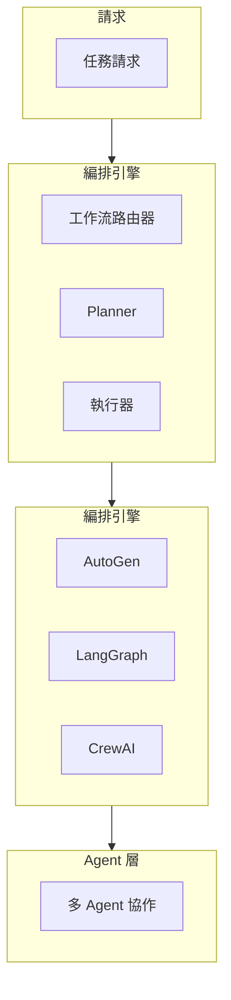

# MAI-S0200 鏈式處理與編排規格書

**文件編號**: MAI-S0200  
**版本**: 1.1  
**日期**: 2026-02-27  
**依據代碼**: `agents/`

---

## 1. 產品目的 (Product Purpose)

# 1.1 核心聲明

鏈式處理與編排服務是 AI-Box 的工作流引擎，支援多種編排模式（AutoGen、CrewAI、LangChain Graph），實現複雜任務的自動化處理和 Agent 協作。

**解決問題**:
- 複雜任務的分解與執行
- 多 Agent 協作編排
- 工作流狀態管理
- 編排模式靈活切換

**服務對象**:
- 開發者
- 系統管理員
- 自動化任務

# 1.2 產品願景

成為 AI-Box 的智能編排中心，支援複雜業務場景的自動化處理。

---

## 2. 產品概覽 (Product Overview)

# 2.1 目標用戶

| 用戶類型 | 使用場景 | 需求 |
|---------|---------|------|
| 開發者 | 工作流開發 | 靈活編程 |
| 業務人員 | 流程自動化 | 低代碼 |
| 系統 | 批量處理 | 高吞吐 |

# 2.2 系統邊界

# 2.3 技術棧

| 層級 | 技術 | 版本 | 用途 |
|------|------|------|------|
| 編排 | AutoGen | 0.2+ | 多代理編排 |
| 圖編排 | LangChain | 0.1+ | 圖工作流 |
| 編排 | CrewAI | 0.1+ | 代理團隊 |
| 狀態 | Redis | 7.0+ | 狀態管理 |

---

## 3. 功能需求 (Functional Requirements)

# 3.1 核心功能

## 3.1.1 工作流路由

| 功能 ID | 功能名稱 | 說明 |
|--------|---------|------|
| F-40-001 | 模式選擇 | 選擇合適編排模式 |
| F-40-002 | 動態路由 | 根據任務動態路由 |
| F-40-003 | 模式切換 | 運行時切換模式 |

## 3.1.2 執行規劃

| 功能 ID | 功能名稱 | 說明 |
|--------|---------|------|
| F-40-010 | 任務分解 | 分解複雜任務 |
| F-40-011 | 執行計劃 | 生成執行步驟 |
| F-40-012 | 依賴分析 | 分析任務依賴 |
| F-40-013 | 計劃調整 | 動態調整計劃 |

## 3.1.3 混合編排

| 功能 ID | 功能名稱 | 說明 |
|--------|---------|------|
| F-40-020 | AutoGen 模式 | 多代理對話編排 |
| F-40-021 | LangGraph 模式 | 圖狀態編排 |
| F-40-022 | CrewAI 模式 | 代理團隊編排 |
| F-40-023 | 混合模式 | 多模式協作 |

## 3.1.4 狀態管理

| 功能 ID | 功能名稱 | 說明 |
|--------|---------|------|
| F-40-030 | 狀態保存 | 保存執行狀態 |
| F-40-031 | 狀態恢復 | 恢復執行狀態 |
| F-40-032 | 檢查點 | 設置執行檢查點 |
| F-40-033 | 斷點恢復 | 從檢查點恢復 |

---

## 4. 性能要求 (Performance Requirements)

# 4.1 響應時間

| 指標 | 目標值 | 說明 |
|------|--------|------|
| 工作流啟動 | ≤ 500ms | 初始化 |
| 步驟執行 | ≤ 30s | 單步驟 |
| 狀態保存 | ≤ 50ms | 檢查點 |

# 4.2 吞吐量

| 指標 | 目標值 | 說明 |
|------|--------|------|
| 並發工作流 | ≥ 50 | 活躍流程 |
| 步驟處理 | ≥ 100 TPS | 每秒步驟 |

---

## 5. 非功能性需求 (Non-Functional Requirements)

# 5.1 可靠性

| 需求 ID | 需求描述 | 目標值 |
|---------|---------|--------|
| NFR-40-010 | 工作流成功率 | ≥ 99% |
| NFR-40-011 | 故障恢復 | 自動恢復 |
| NFR-40-012 | 斷點支持 | 精確恢復 |

# 5.2 可擴展性

| 需求 ID | 需求描述 | 說明 |
|---------|---------|------|
| NFR-40-020 | 動態 Agent 添加 | 熱添加 |
| NFR-40-021 | 自定義工作流 | 插件化 |

---

## 6. 外部接口 (External Interfaces)

# 6.1 API 接口

| 方法 | 端點 | 功能 |
|------|------|------|
| POST | /api/v1/workflow/start | 啟動工作流 |
| GET | /api/v1/workflow/status | 獲取狀態 |
| POST | /api/v1/workflow/pause | 暫停工作流 |
| POST | /api/v1/workflow/resume | 恢復工作流 |
| DELETE | /api/v1/workflow/stop | 停止工作流 |

---

## 7. 設計約束與假設 (Design Constraints & Assumptions)

# 7.1 技術約束

| 約束 ID | 約束描述 | 說明 |
|---------|---------|------|
| C-40-001 | 工作流深度 | 最大 50 步 |
| C-40-002 | 超時時間 | 最長 1 小時 |

# 7.2 假設條件

| 假設 ID | 假設描述 | 驗證方式 |
|---------|---------|----------|
| A-40-001 | Agent 服務正常 | 健康檢查 |

---

## 8. 質量標準 (Quality Standards)

# 8.1 執行質量

| 指標 | 目標值 | 說明 |
|------|--------|------|
| 執行成功率 | ≥ 99% | 正常場景 |
| 狀態準確率 | ≥ 99.9% | 狀態一致 |

---

# 9. 錯誤碼詳細定義

## 9.1 編排錯誤

| 錯誤碼 | 名稱 | 描述 | 處理方式 |
|--------|------|------|----------|
| E4001-001 | WORKFLOW_NOT_FOUND | 工作流不存在 | 返回錯誤 |
| E4001-002 | WORKFLOW_START_FAILED | 啟動失敗 | 返回錯誤 |
| E4001-003 | WORKFLOW_TIMEOUT | 執行超時 | 終止並返回 |
| E4001-004 | STEP_EXECUTION_FAILED | 步驟執行失敗 | 重試或終止 |
| E4001-005 | AGENT_NOT_AVAILABLE | Agent 不可用 | 嘗試備用 |
| E4001-006 | STATE_SAVE_FAILED | 狀態保存失敗 | 警告繼續 |

---

# 10. API 詳細規格

## 10.1 主要端點

| 方法 | 端點 | 功能 |
|------|------|------|
| POST | /api/v1/workflow/start | 啟動工作流 |
| GET | /api/v1/workflow/status?workflow_id=xxx | 獲取狀態 |
| POST | /api/v1/workflow/pause?workflow_id=xxx | 暫停工作流 |
| POST | /api/v1/workflow/resume?workflow_id=xxx | 恢復工作流 |
| DELETE | /api/v1/workflow/stop?workflow_id=xxx | 停止工作流 |

---

# 11. 驗收標準

## 11.1 功能驗收

| ID | 標準 |
|----|------|
| AC-40-001 | 正確執行多步驟工作流 |
| AC-40-002 | 正確實現混合編排 |
| AC-40-003 | 正確實現斷點恢復 |
| AC-40-004 | 正確處理執行失敗 |

## 11.2 性能驗收

| ID | 標準 |
|----|------|
| AC-40-010 | 工作流啟動 < 500ms |
| AC-40-011 | 支援 50 個並發工作流 |

---

#*文件結束*
