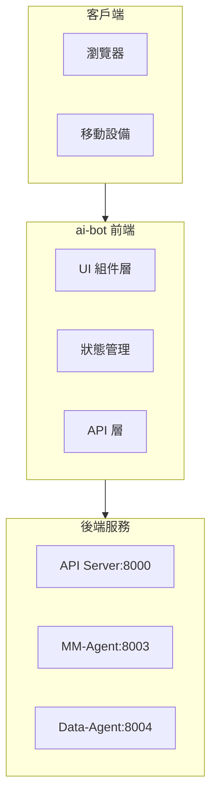

# FAI-S01000 前端整體架構規格書

**文件編號**: FAI-S01000  
**版本**: 1.0  
**日期**: 2026-02-27  
**依據代碼**: `ai-bot/src/`

---

## 1.1 核心聲明

AI-Box 前端 (ai-bot) 是基於 React 18+ 和 TypeScript 構建的現代化 AI 聊天應用，提供智能對話、多語言支持、文件管理、知識庫等功能。

**解決問題**:
- 用戶與 AI-Agent 的交互界面
- 多模態內容展示
- 文件管理和預覽
- 知識庫與本體管理

**服務對象**:
- 最終用戶
- 開發者
- 系統管理員

## 1.2 產品願景

成為企業級 AI 應用的現代化前端入口，提供直觀、高效的用戶體驗。

---

# 2. 產品概覽 (Product Overview)

## 2.1 目標用戶

| 用戶類型 | 使用場景 | 需求 |
|---------|---------|------|
| 業務用戶 | 智能對話、文件處理 | 易用性 |
| 開發者 | 調試、監控 | 開發工具 |
| 管理員 | 系統配置、用戶管理 | 管理功能 |

## 2.2 系統邊界



## 2.3 技術棧

| 層級 | 技術 | 版本 | 用途 |
|------|------|------|------|
| 框架 | React | 18.3+ | UI 框架 |
| 語言 | TypeScript | 5.0+ | 類型安全 |
| 樣式 | Tailwind CSS | 3.0+ | 樣式系統 |
| 路由 | React Router | 7.0+ | 路由管理 |
| 狀態 | Zustand | 5.0+ | 狀態管理 |
| 構建 | Vite | 5.0+ | 構建工具 |
| 圖表 | Recharts | 2.0+ | 數據可視化 |
| Markdown | react-markdown | 9.0+ | Markdown 渲染 |
| Mermaid | mermaid | 10.0+ | 流程圖渲染 |

---

# 3. 功能需求 (Functional Requirements)

## 3.1 核心功能

### 3.1.1 用戶界面

| 功能 ID | 功能名稱 | 說明 |
|--------|---------|------|
| F-01-001 | 響應式布局 | 適配桌面和移動設備 |
| F-01-002 | 深色/淺色主題 | 主題切換 |
| F-01-003 | 多語言支持 | 繁中/簡中/英文 |
| F-01-004 | 側邊欄導航 | 任務、收藏夾、助理列表 |

### 3.1.2 路由與導航

| 功能 ID | 功能名稱 | 說明 |
|--------|---------|------|
| F-01-010 | 頁面路由 | 多頁面導航 |
| F-01-011 | 路由守衛 | 登入權限控制 |
| F-01-012 | 麵包屑導航 | 當前位置指示 |

### 3.1.3 狀態管理

| 功能 ID | 功能名稱 | 說明 |
|--------|---------|------|
| F-01-020 | 全局狀態 | Zustand 狀態管理 |
| F-01-021 | 會話狀態 | 對話會話管理 |
| F-01-022 | 主題狀態 | 主題偏好持久化 |
| F-01-023 | 語言狀態 | 語言偏好持久化 |

---

# 4. 性能要求 (Performance Requirements)

## 4.1 響應時間

| 指標 | 目標值 | 說明 |
|------|--------|------|
| 首屏加載 | ≤ 2s | 首次訪問 |
| 頁面切換 | ≤ 200ms | 路由轉換 |
| API 請求 | ≤ 1s | 單次請求 |

## 4.2 兼容性

| 指標 | 目標值 | 說明 |
|------|--------|------|
| 瀏覽器支持 | Chrome/Firefox/Safari 最新版 | 主流瀏覽器 |
| 屏幕響應 | 320px - 2560px | 響應式 |

---

# 5. 非功能性需求 (Non-Functional Requirements)

## 5.1 可用性

| 需求 ID | 需求描述 | 目標值 |
|---------|---------|--------|
| NFR-01-010 | 頁面可用率 | ≥ 99.9% |
| NFR-01-011 | 加載失敗處理 | 友好提示 |

## 5.2 兼容性

| 需求 ID | 需求描述 | 說明 |
|---------|---------|------|
| NFR-01-020 | 瀏覽器兼容 | Chrome 90+, Firefox 90+, Safari 15+ |
| NFR-01-021 | 響應式設計 | 支援多種屏幕尺寸 |

---

# 6. 外部接口 (External Interfaces)

## 6.1 前端 API 接口

| 方法 | 端點 | 功能 |
|------|------|------|
| POST | /api/v1/chat | 發送聊天消息 |
| GET | /api/v1/tasks | 獲取任務列表 |
| GET | /api/v1/agents | 獲取 Agent 列表 |

## 6.2 組件接口

| 組件 | 接口 | 說明 |
|------|------|------|
| ChatArea | Props: messages, onSend | 聊天區域 |
| FileTree | Props: files, onSelect | 文件樹 |
| KnowledgeBaseModal | Props: isOpen, onClose | 知識庫模態框 |

---

# 7. 設計約束與假設 (Design Constraints & Assumptions)

## 7.1 技術約束

| 約束 ID | 約束描述 | 說明 |
|---------|---------|------|
| C-01-001 | Node.js 版本 | ≥ 18.0 |
| C-01-002 | 瀏�器支持 | 現代瀏覽器 |

## 7.2 假設條件

| 假設 ID | 假設描述 | 驗證方式 |
|---------|---------|----------|
| A-01-001 | 後端 API 正常 | 健康檢查 |
| A-01-002 | 網絡穩定 | 超時處理 |

---

# 8. 質量標準 (Quality Standards)

## 8.1 構建質量

| 指標 | 目標值 | 說明 |
|------|--------|------|
| 構建成功 | 100% | Vite 構建 |
| 類型檢查 | 0 錯誤 | TypeScript |

---

## 9. 項目結構

```
ai-bot/src/
├── components/           # React 組件 (88 個)
│   ├── ChatArea.tsx
│   ├── ChatInput.tsx
│   ├── FileViewer.tsx
│   ├── KnowledgeBaseModal.tsx
│   ├── OntologyManagerModal.tsx
│   ├── IEEEditor/
│   └── SystemAdmin/
├── pages/               # 頁面組件
├── lib/                 # 工具函數 (14 個)
│   ├── api.ts
│   ├── utils.ts
│   └── jwtUtils.ts
├── contexts/           # React Context
├── hooks/              # 自定義 Hooks
└── types/              # 類型定義
```

---

## 10. 驗收標準

### 10.1 功能驗收

| ID | 標準 |
|----|------|
| AC-01-001 | 正確響應式布局 |
| AC-01-002 | 主題切換正常 |
| AC-01-003 | 語言切換正常 |

### 10.2 構建驗收

| ID | 標準 |
|----|------|
| AC-01-010 | Vite 構建成功 |
| AC-01-011 | 類型檢查通過 |

---

*文件結束*
