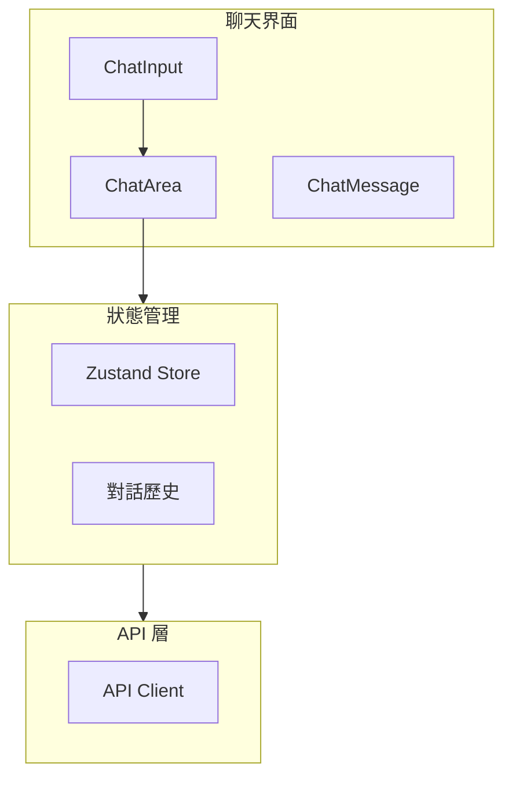

# FAI-S01100 聊天模組規格書

**文件編號**: FAI-S01100  
**版本**: 1.0  
**日期**: 2026-02-27  
**依據代碼**: `ai-bot/src/`

---

## 1.1 核心聲明

聊天模組是 ai-bot 的核心交互模組，負責用戶與 AI-Agent 的對話功能，包括消息展示、輸入處理、對話歷史等功能。

**解決問題**:
- 實時消息展示
- 用戶輸入處理
- 對話狀態維護
- 消息操作（複製、刪除）

**服務對象**:
- 最終用戶
- AI-Agent 系統

---

# 2. 產品概覽 (Product Overview)

## 2.1 目標用戶

| 用戶類型 | 使用場景 | 需求 |
|---------|---------|------|
| 用戶 | 發送消息、查看回覆 | 流暢體驗 |
| 開發者 | 調試對話 | 詳細日誌 |

## 2.2 系統邊界



---

# 3. 功能需求 (Functional Requirements)

## 3.1 核心功能

### 3.1.1 消息展示

| 功能 ID | 功能名稱 | 說明 |
|--------|---------|------|
| F-02-001 | 消息列表 | 展示對話消息 |
| F-02-002 | 消息渲染 | 支援 Markdown/Mermaid |
| F-02-003 | 消息時間 | 顯示時間戳 |
| F-02-004 | 消息狀態 | 發送中/成功/失敗 |

### 3.1.2 消息輸入

| 功能 ID | 功能名稱 | 說明 |
|--------|---------|------|
| F-02-010 | 文本輸入 | 多行文本輸入 |
| F-02-011 | 發送按鈕 | 發送消息 |
| F-02-012 | Enter 發送 | 快捷鍵支持 |
| F-02-013 | 輸入提示 | 顯示輸入狀態 |

### 3.1.3 消息操作

| 功能 ID | 功能名稱 | 說明 |
|--------|---------|------|
| F-02-020 | 複製消息 | 複製內容 |
| F-02-021 | 刪除消息 | 刪除單條消息 |
| F-02-022 | 重新生成 | 重新生成回覆 |
| F-02-023 | 展開/摺疊 | 長消息摺疊 |

---

# 4. 性能要求 (Performance Requirements)

## 4.1 響應時間

| 指標 | 目標值 | 說明 |
|------|--------|------|
| 消息渲染 | ≤ 100ms | 單條消息 |
| 滾動流暢 | 60fps | 滾動性能 |
| 輸入響應 | ≤ 50ms | 輸入響應 |

---

# 5. 非功能性需求 (Non-Functional Requirements)

## 5.1 可用性

| 需求 ID | 需求描述 | 目標值 |
|---------|---------|--------|
| NFR-02-010 | 消息完整顯示 | ≥ 99.9% |
| NFR-02-011 | 輸入響應 | 無感知延遲 |

---

# 6. 外部接口 (External Interfaces)

## 6.1 組件接口

### 6.1.1 ChatArea

```typescript
interface ChatAreaProps {
  messages: ChatMessage[];
  isLoading: boolean;
  onMessageSend?: (content: string) => void;
}
```

### 6.1.2 ChatInput

```typescript
interface ChatInputProps {
  onSend: (content: string) => void;
  disabled?: boolean;
  placeholder?: string;
}
```

### 6.1.3 ChatMessage

```typescript
interface ChatMessageProps {
  message: Message;
  onCopy?: (content: string) => void;
  onDelete?: (id: string) => void;
}
```

---

# 7. 設計約束與假設 (Design Constraints & Assumptions)

## 7.1 技術約束

| 約束 ID | 約束描述 | 說明 |
|---------|---------|------|
| C-02-001 | 消息長度 | 最大 10000 字元 |
| C-02-002 | 附件數 | 最多 5 個 |

---

## 8. 錯誤處理

| 錯誤場景 | 處理方式 |
|----------|----------|
| 網絡失敗 | 顯示重試按鈕 |
| 消息發送失敗 | 顯示錯誤狀態 |
| 渲染失敗 | 顯示原始內容 |

---

## 9. 組件清單

| 組件 | 路徑 | 職責 |
|------|------|------|
| ChatArea | components/ChatArea.tsx | 聊天區域容器 |
| ChatInput | components/ChatInput.tsx | 消息輸入 |
| ChatMessage | components/ChatMessage.tsx | 消息展示 |
| MessageActions | components/MessageActions.tsx | 消息操作 |
| ChatSearchModal | components/ChatSearchModal.tsx | 對話搜索 |

---

## 10. 驗收標準

### 10.1 功能驗收

| ID | 標準 |
|----|------|
| AC-02-001 | 正確展示消息列表 |
| AC-02-002 | 正確處理用戶輸入 |
| AC-02-003 | 正確渲染 Markdown/Mermaid |

### 10.2 性能驗收

| ID | 標準 |
|----|------|
| AC-02-010 | 滾動保持 60fps |
| AC-02-011 | 輸入響應 < 50ms |

---

*文件結束*
