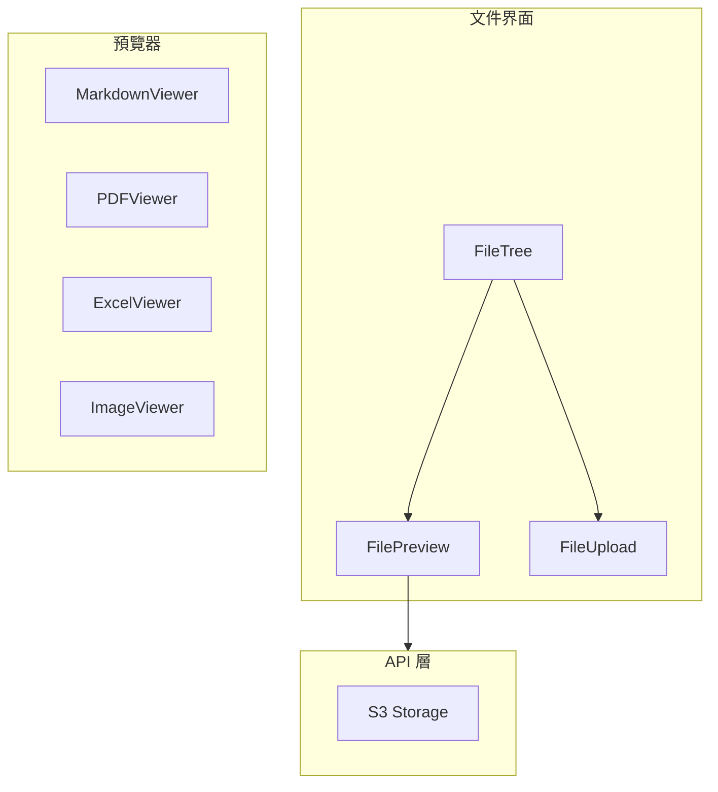

# FAI-S01200 文件管理模組規格書

**文件編號**: FAI-S01200  
**版本**: 1.0  
**日期**: 2026-02-27  
**依據代碼**: `ai-bot/src/`

---

## 1.1 核心聲明

文件管理模組提供 ai-bot 的文件瀏覽、預覽、上傳和管理功能，支持多種文件格式的展示和操作。

**解決問題**:
- 文件樹結構展示
- 多格式文件預覽
- 文件上傳下載
- 文件操作管理

**服務對象**:
- 最終用戶
- 開發者

---

# 2. 產品概覽 (Product Overview)

## 2.1 目標用戶

| 用戶類型 | 使用場景 | 需求 |
|---------|---------|------|
| 用戶 | 瀏覽、上傳文件 | 便捷操作 |
| 開發者 | 文件調試 | 詳細信息 |

## 2.2 系統邊界



---

# 3. 功能需求 (Functional Requirements)

## 3.1 核心功能

### 3.1.1 文件樹

| 功能 ID | 功能名稱 | 說明 |
|--------|---------|------|
| F-03-001 | 目錄展示 | 樹狀目錄結構 |
| F-03-002 | 文件列表 | 列表視圖 |
| F-03-003 | 文件搜索 | 搜索文件 |
| F-03-004 | 文件選擇 | 選中文件 |

### 3.1.2 文件預覽

| 功能 ID | 功能名稱 | 說明 |
|--------|---------|------|
| F-03-010 | Markdown 預覽 | 渲染 Markdown |
| F-03-011 | PDF 預覽 | 渲染 PDF |
| F-03-012 | Excel 預覽 | 渲染表格 |
| F-03-013 | 圖片預覽 | 渲染圖片 |
| F-03-014 | 代碼預覽 | 語法高亮 |

### 3.1.3 文件上傳

| 功能 ID | 功能名稱 | 說明 |
|--------|---------|------|
| F-03-020 | 拖拽上傳 | 拖拽文件 |
| F-03-021 | 點擊上傳 | 點擊選擇 |
| F-03-022 | 上傳進度 | 顯示進度 |
| F-03-023 | 上傳失敗重試 | 失敗處理 |

### 3.1.4 文件操作

| 功能 ID | 功能名稱 | 說明 |
|--------|---------|------|
| F-03-030 | 下載文件 | 下載到本地 |
| F-03-031 | 刪除文件 | 刪除確認 |
| F-03-032 | 移動文件 | 移動位置 |
| F-03-033 | 重命名 | 更改名稱 |

---

# 4. 性能要求 (Performance Requirements)

## 4.1 響應時間

| 指標 | 目標值 | 說明 |
|------|--------|------|
| 文件樹加載 | ≤ 500ms | 首次加載 |
| 文件預覽 | ≤ 1s | 簡單文件 |
| 大文件預覽 | ≤ 5s | PDF/Excel |

---

# 5. 非功能性需求 (Non-Functional Requirements)

## 5.1 兼容性

| 需求 ID | 需求描述 | 說明 |
|---------|---------|------|
| NFR-03-010 | 文件格式支持 | 常見格式 |

---

# 6. 外部接口 (External Interfaces)

## 6.1 組件接口

### 6.1.1 FileTree

```typescript
interface FileTreeProps {
  files: FileNode[];
  onSelect: (file: FileNode) => void;
  onUpload?: () => void;
}
```

### 6.1.2 FileViewer

```typescript
interface FileViewerProps {
  file: FileNode;
  content?: string;
}
```

### 6.1.3 FileUploadModal

```typescript
interface FileUploadModalProps {
  isOpen: boolean;
  onClose: () => void;
  onUpload: (files: File[]) => void;
}
```

---

# 7. 設計約束與假設 (Design Constraints & Assumptions)

## 7.1 技術約束

| 約束 ID | 約束描述 | 說明 |
|---------|---------|------|
| C-03-001 | 文件大小 | 最大 100MB |
| C-03-002 | 文件類型 | 支援常見類型 |

---

## 8. 錯誤處理

| 錯誤場景 | 處理方式 |
|----------|----------|
| 預覽失敗 | 顯示錯誤提示 |
| 上傳失敗 | 顯示重試按鈕 |
| 權限不足 | 顯示權限提示 |

---

## 9. 組件清單

| 組件 | 路徑 | 職責 |
|------|------|------|
| FileTree | components/FileTree.tsx | 文件樹 |
| FileList | components/FileList.tsx | 文件列表 |
| FileViewer | components/FileViewer.tsx | 文件預覽容器 |
| FileUploadModal | components/FileUploadModal.tsx | 上傳模態框 |
| FileMoveModal | components/FileMoveModal.tsx | 移動文件 |
| FileSearchModal | components/FileSearchModal.tsx | 文件搜索 |
| ExcelViewer | components/ExcelViewer.tsx | Excel 預覽 |
| PDFViewer | components/PDFViewer.tsx | PDF 預覽 |
| MarkdownViewer | components/MarkdownViewer.tsx | Markdown 預覽 |
| DOCXViewer | components/DOCXViewer.tsx | Word 預覽 |

---

## 10. 驗收標準

### 10.1 功能驗收

| ID | 標準 |
|----|------|
| AC-03-001 | 正確展示文件樹 |
| AC-03-002 | 正確預覽各類文件 |
| AC-03-003 | 正確上傳文件 |

### 10.2 性能驗收

| ID | 標準 |
|----|------|
| AC-03-010 | 文件樹加載 < 500ms |
| AC-03-011 | 預覽響應 < 1s |

---

*文件結束*
