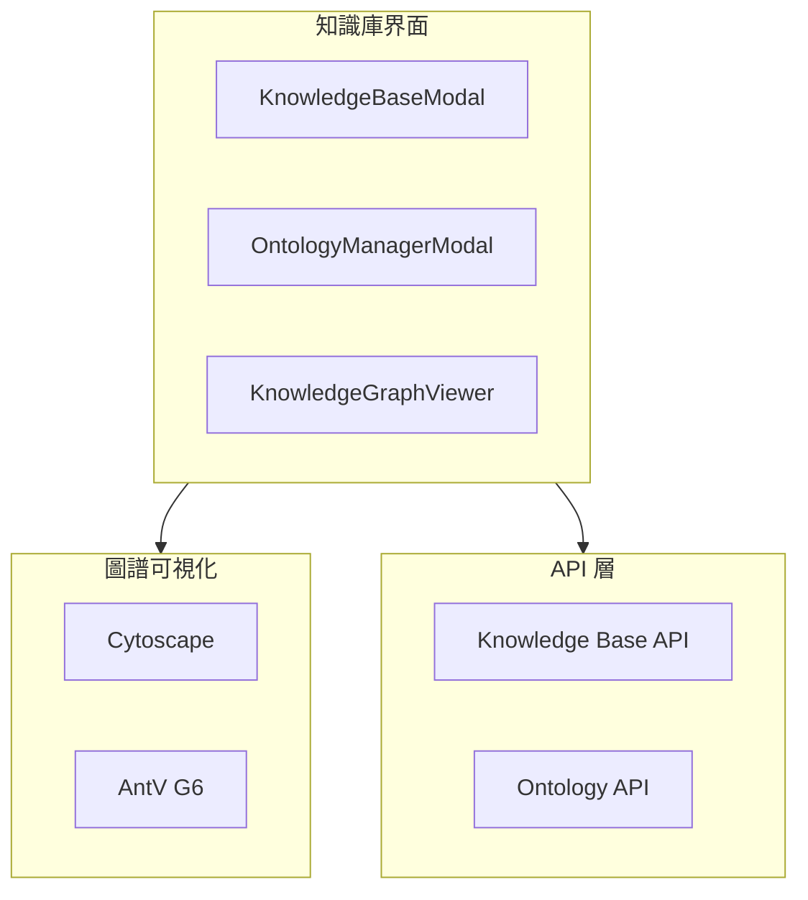

# FAI-S01300 知識庫模組規格書

**文件編號**: FAI-S01300  
**版本**: 1.0  
**日期**: 2026-02-27  
**依據代碼**: `ai-bot/src/`

---

## 1.1 核心聲明

知識庫模組提供知識庫和知識本體的管理功能，支持知識庫的創建、編輯、查詢，以及本體結構的可視化和管理。

**解決問題**:
- 知識庫 CRUD 操作
- 知識本體管理
- 知識圖譜可視化
- 實體關係展示

**服務對象**:
- 知識管理員
- 開發者

---

# 2. 產品概覽 (Product Overview)

## 2.1 目標用戶

| 用戶類型 | 使用場景 | 需求 |
|---------|---------|------|
| 管理員 | 知識庫管理 | 完整權限 |
| 開發者 | 本體調試 | 詳細視圖 |

## 2.2 系統邊界



---

# 3. 功能需求 (Functional Requirements)

## 3.1 核心功能

### 3.1.1 知識庫管理

| 功能 ID | 功能名稱 | 說明 |
|--------|---------|------|
| F-04-001 | 知識庫列表 | 顯示所有知識庫 |
| F-04-002 | 創建知識庫 | 新建知識庫 |
| F-04-003 | 編輯知識庫 | 修改知識庫 |
| F-04-004 | 刪除知識庫 | 刪除確認 |
| F-04-005 | 知識庫詳情 | 查看詳細信息 |

### 3.1.2 知識本體管理

| 功能 ID | 功能名稱 | 說明 |
|--------|---------|------|
| F-04-010 | 本體列表 | 顯示所有本體 |
| F-04-011 | 創建本體 | 新建本體結構 |
| F-04-012 | 編輯本體 | 修改本體定義 |
| F-04-013 | 刪除本體 | 刪除確認 |
| F-04-014 | 本體版本 | 版本管理 |

### 3.1.3 知識圖譜可視化

| 功能 ID | 功能名稱 | 說明 |
|--------|---------|------|
| F-04-020 | 圖譜渲染 | 展示知識圖譜 |
| F-04-021 | 節點操作 | 點擊、拖拽 |
| F-04-022 | 邊展示 | 展示關係 |
| F-04-023 | 圖譜布局 | 自動布局 |

---

# 4. 性能要求 (Performance Requirements)

## 4.1 響應時間

| 指標 | 目標值 | 說明 |
|------|--------|------|
| 知識庫列表 | ≤ 500ms | 首次加載 |
| 圖譜渲染 | ≤ 1s | 100 節點 |
| 本體操作 | ≤ 200ms | 單次操作 |

---

# 5. 非功能性需求 (Non-Functional Requirements)

## 5.1 數據完整性

| 需求 ID | 需求描述 | 目標值 |
|---------|---------|--------|
| NFR-04-010 | 操作確認 | 二次確認 |
| NFR-04-011 | 數據驗證 | 輸入校驗 |

---

# 6. 外部接口 (External Interfaces)

## 6.1 組件接口

### 6.1.1 KnowledgeBaseModal

```typescript
interface KnowledgeBaseModalProps {
  isOpen: boolean;
  onClose: () => void;
  onCreate?: (kb: KnowledgeBase) => void;
  onEdit?: (kb: KnowledgeBase) => void;
  onDelete?: (id: string) => void;
}
```

### 6.1.2 OntologyManagerModal

```typescript
interface OntologyManagerModalProps {
  isOpen: boolean;
  onClose: () => void;
  domain?: string;
}
```

### 6.1.3 KnowledgeGraphViewer

```typescript
interface KnowledgeGraphViewerProps {
  data: GraphData;
  onNodeClick?: (node: Node) => void;
  layout?: 'force' | 'dagre' | 'circular';
}
```

---

# 7. 設計約束與假設 (Design Constraints & Assumptions)

## 7.1 技術約束

| 約束 ID | 約束描述 | 說明 |
|---------|---------|------|
| C-04-001 | 圖譜節點 | 最大 500 節點 |
| C-04-002 | 本體大小 | 最大 1MB |

---

## 8. 錯誤處理

| 錯誤場景 | 處理方式 |
|----------|----------|
| 創建失敗 | 顯示錯誤信息 |
| 刪除失敗 | 顯示原因 |
| 圖譜渲染失敗 | 顯示原始數據 |

---

## 9. 組件清單

| 組件 | 路徑 | 職責 |
|------|------|------|
| KnowledgeBaseModal | components/KnowledgeBaseModal.tsx | 知識庫管理 |
| OntologyManagerModal | components/OntologyManagerModal.tsx | 本體管理 |
| KnowledgeGraphViewer | components/KnowledgeGraphViewer.tsx | 圖譜可視化 |
| CytoscapeGraph | components/CytoscapeGraph.tsx | Cytoscape 圖譜 |

---

## 10. 驗收標準

### 10.1 功能驗收

| ID | 標準 |
|----|------|
| AC-04-001 | 正確管理知識庫 |
| AC-04-002 | 正確管理本體 |
| AC-04-003 | 正確展示知識圖譜 |

### 10.2 性能驗收

| ID | 標準 |
|----|------|
| AC-04-010 | 圖譜渲染 < 1s |

---

*文件結束*
