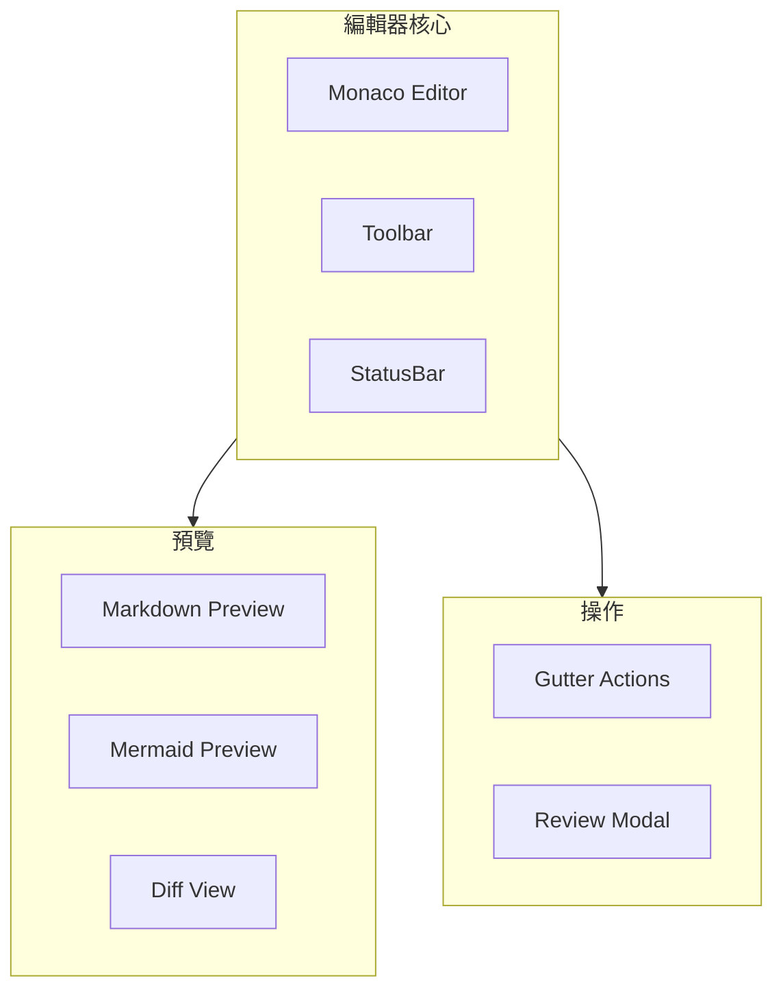

# FAI-S01400 編輯器模組規格書

**文件編號**: FAI-S01400  
**版本**: 1.0  
**日期**: 2026-02-27  
**依據代碼**: `ai-bot/src/`

---

## 1.1 核心聲明

編輯器模組提供專業的代碼編輯功能，基於 Monaco Editor，支持語法高亮、代碼補全、差異比對、Mermaid 預覽等高級功能。

**解決問題**:
- 代碼編輯
- 語法高亮
- 版本對比
- 即時預覽

**服務對象**:
- 開發者
- 技術用戶

---

# 2. 產品概覽 (Product Overview)

## 2.1 目標用戶

| 用戶類型 | 使用場景 | 需求 |
|---------|---------|------|
| 開發者 | 代碼編輯調試 | 完整功能 |
| 技術用戶 | 文檔編輯 | 易用性 |

## 2.2 系統邊界



---

# 3. 功能需求 (Functional Requirements)

## 3.1 核心功能

### 3.1.1 代碼編輯

| 功能 ID | 功能名稱 | 說明 |
|--------|---------|------|
| F-05-001 | Monaco 編輯 | 專業代碼編輯 |
| F-05-002 | 語法高亮 | 多語言支持 |
| F-05-003 | 代碼補全 | 智能補全 |
| F-05-004 | 多標籤 | 多文件編輯 |
| F-05-005 | 搜尋替換 | 查找替換 |

### 3.1.2 預覽功能

| 功能 ID | 功能名稱 | 說明 |
|--------|---------|------|
| F-05-010 | Markdown 預覽 | 即時預覽 |
| F-05-011 | Mermaid 預覽 | 流程圖預覽 |
| F-05-012 | 代碼高亮 | Prism 渲染 |
| F-05-013 | 即時更新 | 編輯即時預覽 |

### 3.1.3 差異比對

| 功能 ID | 功能名稱 | 說明 |
|--------|---------|------|
| F-05-020 | Diff 編輯器 | 對比視圖 |
| F-05-021 | 變更導航 | 跳轉變更 |
| F-05-022 | 邊欄操作 | Gutter 操作 |

### 3.1.4 審查功能

| 功能 ID | 功能名稱 | 說明 |
|--------|---------|------|
| F-05-030 | 審查模式 | 代碼審查 |
| F-05-031 | 評論功能 | 添加評論 |
| F-05-032 | 審查歷史 | 歷史記錄 |

---

# 4. 性能要求 (Performance Requirements)

## 4.1 響應時間

| 指標 | 目標值 | 說明 |
|------|--------|------|
| 編輯響應 | ≤ 16ms | 流暢輸入 |
| 預覽更新 | ≤ 100ms | 即時預覽 |
| 差異計算 | ≤ 500ms | 1000 行 |

---

# 5. 非功能性需求 (Non-Functional Requirements)

## 5.1 可用性

| 需求 ID | 需求描述 | 目標值 |
|---------|---------|--------|
| NFR-05-010 | 鍵盤快捷鍵 | 完整支持 |
| NFR-05-011 | 響應式 | 適配屏幕 |

---

# 6. 外部接口 (External Interfaces)

## 6.1 組件接口

### 6.1.1 MonacoEditor

```typescript
interface MonacoEditorProps {
  value: string;
  language?: string;
  onChange?: (value: string) => void;
  readOnly?: boolean;
}
```

### 6.1.2 IEEEditor

```typescript
interface IEEEditorProps {
  file: FileNode;
  onSave?: (content: string) => void;
  onClose?: () => void;
}
```

### 6.1.3 MermaidPreview

```typescript
interface MermaidPreviewProps {
  code: string;
  onError?: (error: Error) => void;
}
```

---

# 7. 設計約束與假設 (Design Constraints & Assumptions)

## 7.1 技術約束

| 約束 ID | 約束描述 | 說明 |
|---------|---------|------|
| C-05-001 | 文件大小 | 最大 1MB |
| C-05-002 | 語言支持 | 常見語言 |

---

## 8. 錯誤處理

| 錯誤場景 | 處理方式 |
|----------|----------|
| 語法錯誤 | 底部顯示錯誤 |
| 預覽失敗 | 顯示原始碼 |
| 保存失敗 | 顯示重試 |

---

## 9. 組件清單

| 組件 | 路徑 | 職責 |
|------|------|------|
| MonacoEditor | components/MonacoEditor.tsx | Monaco 封裝 |
| IEEEditor | pages/IEEEditor.tsx | 主編輯頁面 |
| Toolbar | components/IEEEditor/Toolbar.tsx | 工具欄 |
| StatusBar | components/IEEEditor/StatusBar.tsx | 狀態欄 |
| MermaidPreview | components/IEEEditor/MermaidPreview.tsx | Mermaid 預覽 |
| MonacoDiffEditor | components/IEEEditor/MonacoDiffEditor.tsx | 差異編輯 |
| ReviewModal | components/IEEEditor/ReviewModal.tsx | 審查模態框 |

---

## 10. 驗收標準

### 10.1 功能驗收

| ID | 標準 |
|----|------|
| AC-05-001 | 正確編輯代碼 |
| AC-05-002 | 正確預覽 Markdown |
| AC-05-003 | 正確預覽 Mermaid |
| AC-05-004 | 正確使用 Diff |

### 10.2 性能驗收

| ID | 標準 |
|----|------|
| AC-05-010 | 編輯響應 < 16ms |
| AC-05-011 | 預覽更新 < 100ms |

---

*文件結束*
