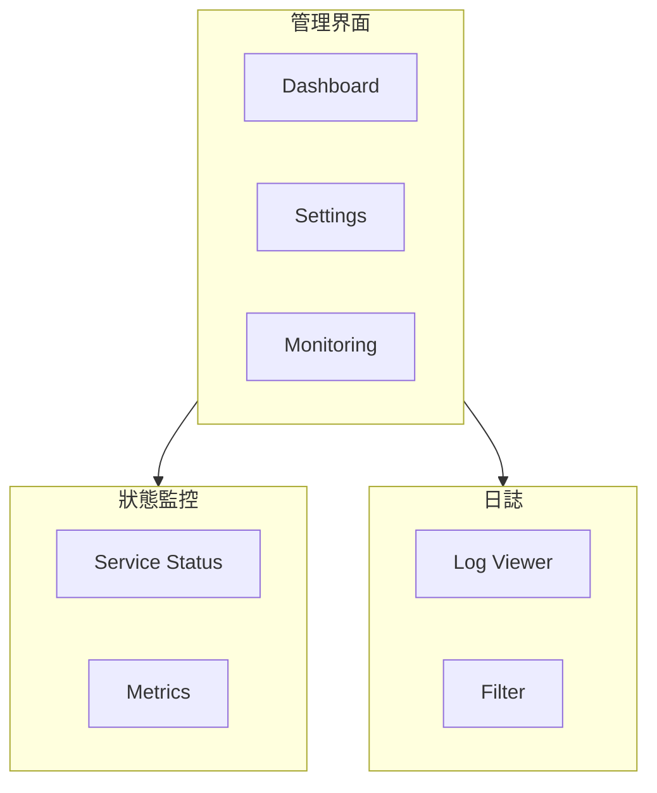

# FAI-S01500 系統管理模組規格書

**文件編號**: FAI-S01500  
**版本**: 1.0  
**日期**: 2026-02-27  
**依據代碼**: `ai-bot/src/`

---

## 1.1 核心聲明

系統管理模組提供 AI-Box 平台的管理功能，包括系統監控、服務狀態、日誌查看、用戶管理、配置管理等。

**解決問題**:
- 系統運行狀態監控
- 服務健康檢查
- 日誌查看分析
- 用戶權限管理
- 系統配置

**服務對象**:
- 系統管理員
- 運維人員

---

# 2. 產品概覽 (Product Overview)

## 2.1 目標用戶

| 用戶類型 | 使用場景 | 需求 |
|---------|---------|------|
| 管理員 | 系統配置 | 完整權限 |
| 運維 | 監控運維 | 實時數據 |

## 2.2 系統邊界



---

# 3. 功能需求 (Functional Requirements)

## 3.1 核心功能

### 3.1.1 儀表板

| 功能 ID | 功能名稱 | 說明 |
|--------|---------|------|
| F-06-001 | 系統概覽 | 關鍵指標展示 |
| F-06-002 | 服務狀態 | 各服務狀態 |
| F-06-003 | 快速操作 | 常見操作入口 |

### 3.1.2 系統監控

| 功能 ID | 功能名稱 | 說明 |
|--------|---------|------|
| F-06-010 | 即時指標 | CPU/內存/網絡 |
| F-06-011 | 歷史趨勢 | 圖表展示 |
| F-06-012 | 報警設置 | 閾值配置 |
| F-06-013 | 服務監控 | 各服務健康 |

### 3.1.3 日誌查看

| 功能 ID | 功能名稱 | 說明 |
|--------|---------|------|
| F-06-020 | 日誌列表 | 滾動列表 |
| F-06-021 | 日誌搜索 | 關鍵詞搜索 |
| F-06-022 | 日誌過濾 | 級別過濾 |
| F-06-023 | 日誌導出 | 下載日誌 |

### 3.1.4 系統設置

| 功能 ID | 功能名稱 | 說明 |
|--------|---------|------|
| F-06-030 | 用戶管理 | 用戶 CRUD |
| F-06-031 | 權限管理 | 角色權限 |
| F-06-032 | 系統配置 | 參數配置 |
| F-06-033 | 安全設置 | 密碼/認證 |

---

# 4. 性能要求 (Performance Requirements)

## 4.1 響應時間

| 指標 | 目標值 | 說明 |
|------|--------|------|
| 監控刷新 | ≤ 1s | 實時數據 |
| 日誌加載 | ≤ 2s | 1000 條 |
| 搜索響應 | ≤ 500ms | 搜索結果 |

---

# 5. 非功能性需求 (Non-Functional Requirements)

## 5.1 安全性

| 需求 ID | 需求描述 | 優先級 |
|---------|---------|--------|
| NFR-06-010 | 權限控制 | 必須 |
| NFR-06-011 | 操作審計 | 必須 |
| NFR-06-012 | 敏感數據保護 | 必須 |

---

# 6. 外部接口 (External Interfaces)

## 6.1 頁面接口

### 6.1.1 SystemMonitoring

```typescript
interface SystemMonitoringProps {
  refreshInterval?: number;
  onAlert?: (alert: Alert) => void;
}
```

### 6.1.2 ServiceStatusCard

```typescript
interface ServiceStatusCardProps {
  service: Service;
  onRestart?: (service: string) => void;
}
```

### 6.1.3 ServiceLogViewer

```typescript
interface ServiceLogViewerProps {
  serviceId: string;
  level?: 'info' | 'warn' | 'error';
  onFilter?: (filter: LogFilter) => void;
}
```

---

# 7. 設計約束與假設 (Design Constraints & Assumptions)

## 7.1 技術約束

| 約束 ID | 約束描述 | 說明 |
|---------|---------|------|
| C-06-001 | 角色權限 | 管理員/用戶 |
| C-06-002 | 日誌保留 | 30 天 |

---

## 8. 錯誤處理

| 錯誤場景 | 處理方式 |
|----------|----------|
| 服務不可用 | 顯示錯誤狀態 |
| 日誌獲取失敗 | 顯示重試 |
| 權限不足 | 顯示提示 |

---

## 9. 組件清單

| 組件 | 路徑 | 職責 |
|------|------|------|
| DashboardModal | components/SystemAdmin/DashboardModal.tsx | 儀表板 |
| ServiceStatusCard | components/SystemAdmin/ServiceStatusCard.tsx | 服務卡片 |
| ServiceLogViewer | components/SystemAdmin/ServiceLogViewer.tsx | 日誌查看 |
| SystemSettings | pages/SystemSettings.tsx | 系統設置 |
| SystemMonitoring | pages/SystemMonitoring.tsx | 系統監控 |
| SystemServiceStatus | pages/SystemServiceStatus.tsx | 服務狀態 |
| AgentRequestManagement | pages/AgentRequestManagement.tsx | Agent 管理 |

---

## 10. 驗收標準

### 10.1 功能驗收

| ID | 標準 |
|----|------|
| AC-06-001 | 正確展示系統狀態 |
| AC-06-002 | 正確查看日誌 |
| AC-06-003 | 正確管理用戶 |

### 10.2 性能驗收

| ID | 標準 |
|----|------|
| AC-06-010 | 監控刷新 < 1s |

---

*文件結束*
