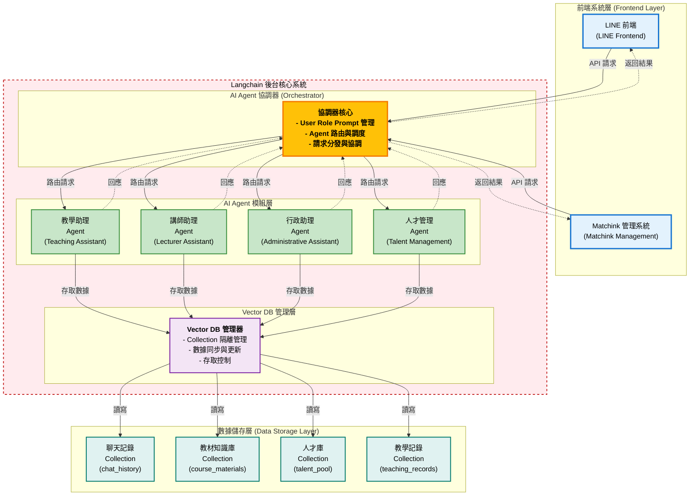
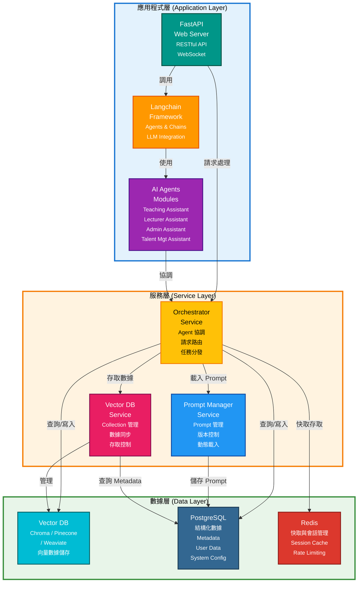
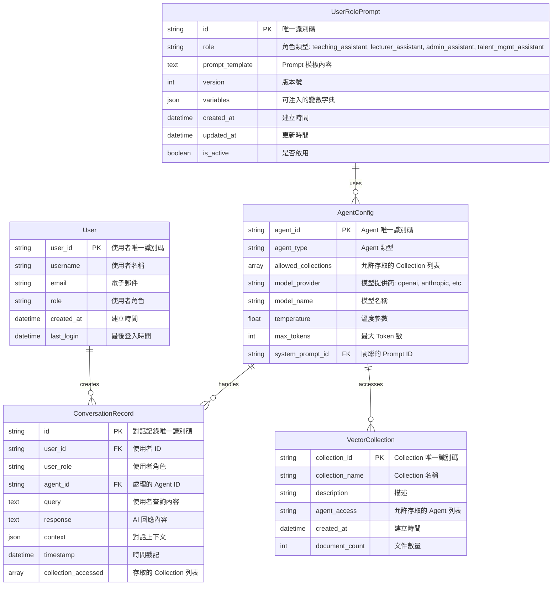
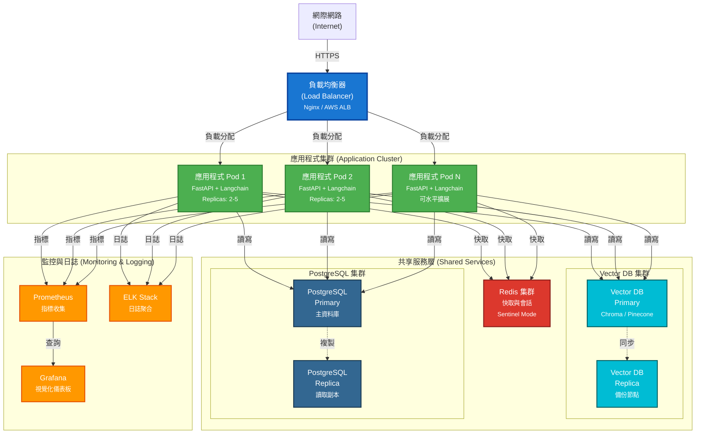

# 培訓學院暨媒合平台 AI 助手 - 系統分析文件 (SA)

<!-- Notion Page ID: 2ad10eba-142a-81c0-8603-ebaa488e2418 -->
<!-- Last synced: 2025-11-18 10:30:15 -->

## 文件資訊

- **文件版本**: v2.0
- **建立日期**: 2025-11-14
- **最後更新**: 2025-11-18 10:30:15
- **文件類型**: 系統分析文件 (System Analysis Document)
- **專案名稱**: 傑羅德 GenAI - 培訓學院暨媒合平台 AI 助手後台系統
- **專案範圍**: GenAI 核心系統（包含 Pipeline、RAG、LLM Provider Mgt.、多個 AI Agent 與內部代理）

---

## 1. 執行摘要 (Executive Summary)

### 1.1 專案背景

本專案旨在為「傑羅德 Matchink」建置一個 GenAI 核心系統，整合 LINE 前端與 Matchink 教學及推薦系統，透過 GenAI 核心支持智能助教、行政助理、講師助理及人才代理服務。HCI 為 Matchink 開發 GenAI 內核及相關 AI 多代理服務（多個代理可共同完成任務），實現智慧化的培訓學院與人才媒合平台。

### 1.2 專案目標

1. **建立統一的 GenAI 核心系統**：以 Langchain 為基礎架構，提供可擴展的 AI Agent 協調機制與多代理協作能力
2. **實現多角色 AI 助手**：透過 User Role Prompt 策略，為不同使用者（學員、講師、客戶、人才管理者）提供專屬的 AI 服務
3. **整合多源數據與外部 LLM**：整合 ChatGPT、Gemini、Grok 等外部 LLM，並將聊天記錄、教材、人才庫、教學記錄等數據整合至 Vector DB，透過 Collection 隔離確保數據安全
4. **提供模組化 AI Agent 生態**：建立多個專用 AI Agent（教學助理、講師助理、行政助理、人才管理助理）及內部代理（出題代理、AAM、教材知識圖譜代理、教學記錄查詢代理、人才職缺媒合與推薦代理），分別處理教學、媒合、管理等不同業務場景
5. **實現知識圖譜與向量化處理**：透過 AAM（向量化、標籤分類代理）與教材知識圖譜代理，實現知識的結構化與智能檢索

### 1.3 專案範圍

**包含範圍（GenAI 核心系統）：**
- GenAI 核心架構（Pipeline、RAG、Context Memory、Prompt Management）
- LLM Provider 管理系統（整合 ChatGPT、Gemini、Grok 等外部 LLM）
- 四個主要 AI Assistant（教學助理、講師助理、行政助理、人才管理助理）
- 內部 AI 代理（出題代理、AAM 向量化標籤分類代理、教材知識圖譜代理、教學記錄查詢代理、人才職缺媒合與推薦代理）
- Vector DB 數據整合與管理（包含題庫、歷史記錄分類、向量數據庫）
- User Role Prompt 管理系統
- Security Agent 與 File Uploader
- Security MonitorAI Agent
- 與 LINE 前端、Matchink 系統、SMS 的整合介面

**不包含範圍：**
- LINE 前端系統（已存在）
- Matchink 管理系統前端（已存在）
- Matchink 後端資料庫（Account/Role、Course Textbook、教學記錄、Enterprise Recruit Req.、Talent Pool）
- 基礎設施硬體採購

---

## 2. 系統概述 (System Overview)

### 2.1 系統定位

本系統是「傑羅德 GenAI」平台的核心後台，扮演以下角色：

1. **AI 協調中樞**：統一管理與協調多個 AI Agent 的運作，實現多代理協作機制
2. **知識管理核心**：整合並管理來自不同來源的知識資產（教材、教學記錄、人才庫等），透過向量化與知識圖譜實現智能檢索
3. **智能服務提供者**：為前端系統（LINE、Matchink）提供 AI 驅動的智能服務，支援 SMS 查詢與回應
4. **數據安全守門員**：透過 Security Agent 與 Security MonitorAI Agent 確保不同角色與業務場景的數據隔離與安全
5. **外部 LLM 整合中心**：統一管理與調度 ChatGPT、Gemini、Grok 等外部 LLM 服務
6. **知識處理引擎**：透過 AAM（向量化、標籤分類代理）與教材知識圖譜代理，實現知識的結構化處理與智能推薦

### 2.2 系統架構概覽



**架構說明**：

1. **前端系統層（藍色）**：
   - LINE 前端：提供學員互動介面
   - Matchink 管理系統：提供管理後台介面
   - SMS：支援簡訊查詢與回應

2. **外部整合層**：
   - **外部 LLM 提供商**：ChatGPT、Gemini、Grok，透過 LLM Provider Mgt. 模組統一管理
   - **Matchink 系統**：整合 Matchink 後端資料庫與系統服務

3. **GenAI 核心系統（紅色虛線框 - 本專案範圍）**：
   - **AI Assistant 層（綠色）**：四個主要 AI Assistant（教學助理、講師助理、行政助理、人才管理助理），對應不同使用者角色
   - **核心處理模組**：
     - **Pipeline**：中央處理管道，連接所有核心模組
     - **Prompt Management**：管理 User Role Prompt 模板與版本控制
     - **Context Memory**：儲存對話上下文與歷史記錄
     - **RAG（Retrieval-Augmented Generation）**：檢索增強生成，連接 Vector DB 進行知識檢索
     - **LLM Provider Mgt.**：管理外部 LLM 提供商，實現模型切換與負載均衡
   - **內部 AI 代理層**：
     - **出題代理（Question Generation Agent）**：連接題庫，為人才管理助理提供題目生成服務
     - **AAM（向量化、標籤分類代理）**：處理數據向量化與標籤分類，連接 Vector DB 與 history 資料庫
     - **教材知識圖譜代理**：處理教材知識圖譜，透過 File Uploader 上傳至 RAG
     - **教學記錄查詢代理**：查詢教學記錄與企業職缺需求
     - **人才職缺媒合與推薦代理**：處理人才與職缺的媒合與推薦
   - **安全與檔案處理**：
     - **Security Agent**：處理 Matchink 系統的安全認證與資料庫存取控制
     - **File Uploader**：處理檔案上傳，連接 RAG 進行知識整合
     - **Security MonitorAI Agent**：監控系統安全狀態與異常行為

4. **數據儲存層（青色）**：
   - **Vector DB**：向量資料庫，儲存向量化知識
   - **題庫（Question Bank）**：儲存題目資料，連接出題代理
   - **history 資料庫**：分類儲存歷史記錄
     - 教學類（Teaching category）
     - 學務類（Academic affairs category）
     - 課程類（Course category）
   - **Collection 隔離**：四個獨立的 Collection（chat_history、course_materials、talent_pool、teaching_records），實現數據隔離與安全

5. **Matchink 後端資料庫**：
   - Account / Role：帳號與角色資料
   - Course Textbook：課程教材
   - 教學記錄：教學相關記錄
   - Enterprise Recruit Req.：企業招募需求
   - Talent Pool：人才庫

### 2.3 核心設計理念

1. **User Role Prompt 策略**：根據使用者角色（學員、講師、客戶、人才管理者）動態載入對應的 System Prompt，確保 AI 助手具備正確的專業知識與行為模式
2. **Collection 隔離機制**：在 Vector DB 中使用不同的 Collection 儲存不同業務場景的數據，確保數據安全與隱私
3. **模組化 Agent 設計**：每個 AI Agent 專注於特定業務領域，提高系統的可維護性與擴展性
4. **統一協調機制**：透過 Pipeline 統一管理所有 Agent 與核心模組，實現資源共享與任務協調
5. **多代理協作機制**：多個代理可共同完成複雜任務，實現知識圖譜構建、向量化處理、媒合推薦等協作流程
6. **外部 LLM 統一管理**：透過 LLM Provider Mgt. 模組統一管理多個外部 LLM 提供商，實現模型切換、負載均衡與成本優化
7. **知識圖譜與向量化雙重檢索**：結合知識圖譜的結構化檢索與向量化的語意檢索，提供更精準的知識檢索能力
8. **分層安全機制**：透過 Security Agent 與 Security MonitorAI Agent 實現多層次的安全防護與監控

### 2.4 使用者角色與工作清單

根據架構圖，系統支援以下使用者角色及其對應的工作清單：

#### 2.4.1 學員（Student）

**對應 AI Assistant**：教學助理（Teaching Assistant）

**工作清單**：
- 課程詢問答復：回答學員關於課程內容、課程推薦等問題
- 協助查詢教師：提供教師資訊，協助預約教師諮詢時間
- 課後解題答復：解答學員課後作業問題，提供解題思路
- 協助學員自我評量：提供練習題目，評估學習進度，給予學習建議

#### 2.4.2 講師（Lecture）

**對應 AI Assistant**：講師助理（Lecturer Assistant）

**工作清單**：
- 講義答詢：回答講師關於教材內容的問題，提供教學資源建議
- 學員學習評量：分析學員學習數據，生成學習報告，提供教學改進建議
- 教員教學評量：分析教學效果，提供教學品質報告

#### 2.4.3 客戶（Customer）

**對應 AI Assistant**：行政助理（Administrative Assistant）

**工作清單**：
- 答復課務相關問題：回答課程報名流程、課程時間安排、課程費用等問題
- 答復 Matchink 學院活動：提供活動資訊查詢、活動報名協助、活動相關問題解答
- 教員教學評量：協助進行教學品質評估

#### 2.4.4 人才管理者 / 企業 HR 招募經理（Talent Manager / Enterprise HR Recruit Mgr.）

**對應 AI Assistant**：人才管理助理（Talent Management Assistant）

**工作清單**：
- 提供求職查詢：協助求職者查詢職缺資訊
- 依據求職者條件推薦企業：根據求職者的技能、經驗等條件，推薦合適的企業與職缺
- 提供人才查詢：協助企業查詢人才資訊
- 依據企業條件推薦人才：根據企業的招募需求，推薦合適的人才

---

## 3. 系統功能列表 (Functional Requirements)

### 3.0 功能總覽表

下表列出本系統所有功能模組，提供快速參考：

| 功能編號 | 功能名稱 | 所屬模組 | 優先級 | 功能簡述 |
|---------|---------|---------|--------|---------|
| FR-001 | Pipeline 核心處理管道 | 核心功能模組 | P0 (最高) | 統一管理與協調所有 AI Agent 與核心模組，負責請求路由與任務分發 |
| FR-002 | User Role Prompt 管理 | 核心功能模組 | P0 (最高) | 管理不同使用者角色的 System Prompt 模板，支援版本控制與動態載入 |
| FR-003 | LLM Provider 管理 | 核心功能模組 | P0 (最高) | 統一管理 ChatGPT、Gemini、Grok 等外部 LLM 提供商，實現模型切換與負載均衡 |
| FR-004 | RAG 檢索增強生成 | 核心功能模組 | P0 (最高) | 實現檢索增強生成，連接 Vector DB 進行知識檢索與生成 |
| FR-005 | Context Memory 上下文記憶 | 核心功能模組 | P0 (最高) | 儲存對話上下文與歷史記錄，支援多輪對話與上下文檢索 |
| FR-006 | 教學助理 AI Agent | 核心功能模組 | P0 (最高) | 處理學員課程詢問、課後解題、自我評量等教學相關服務 |
| FR-007 | 講師助理 AI Agent | 核心功能模組 | P0 (最高) | 協助講師處理教學事務、講義答詢、學員評量分析 |
| FR-008 | 行政助理 AI Agent | 核心功能模組 | P1 (高) | 處理課務問題、Matchink 學院活動、行政流程協助 |
| FR-009 | 人才管理助理 AI Agent | 核心功能模組 | P1 (高) | 處理人才媒合業務、履歷分析、職缺比對與推薦 |
| FR-010 | 出題代理 | 內部代理模組 | P1 (高) | 連接題庫，為人才管理助理提供題目生成服務 |
| FR-011 | AAM 向量化標籤分類代理 | 內部代理模組 | P0 (最高) | 處理數據向量化與標籤分類，連接 Vector DB 與 history 資料庫 |
| FR-012 | 教材知識圖譜代理 | 內部代理模組 | P1 (高) | 處理教材知識圖譜，透過 File Uploader 上傳至 RAG |
| FR-013 | 教學記錄查詢代理 | 內部代理模組 | P1 (高) | 查詢教學記錄與企業職缺需求，連接 Matchink 後端資料庫 |
| FR-014 | 人才職缺媒合與推薦代理 | 內部代理模組 | P1 (高) | 處理人才與職缺的媒合與推薦，連接人才庫與企業職缺資料 |
| FR-015 | Vector DB 整合管理 | 數據管理模組 | P0 (最高) | 整合多數據源至 Vector DB，管理 Collection 與數據同步 |
| FR-016 | 題庫管理 | 數據管理模組 | P1 (高) | 管理題庫資料，支援題目新增、查詢與分類 |
| FR-017 | 歷史記錄分類管理 | 數據管理模組 | P1 (高) | 管理歷史記錄的分類（教學類、學務類、課程類）與檢索 |
| FR-018 | 數據隔離與安全機制 | 數據管理模組 | P0 (最高) | 實現基於角色的數據存取控制，確保 Collection 隔離 |
| FR-019 | Security Agent | 安全模組 | P0 (最高) | 處理 Matchink 系統的安全認證與資料庫存取控制 |
| FR-020 | Security MonitorAI Agent | 安全模組 | P0 (最高) | 監控系統安全狀態與異常行為，提供安全告警 |
| FR-021 | File Uploader | 檔案處理模組 | P1 (高) | 處理檔案上傳，連接 RAG 進行知識整合 |
| FR-022 | LINE 前端整合介面 | 整合介面模組 | P0 (最高) | 與 LINE 前端系統整合，處理 Webhook 與訊息格式轉換 |
| FR-023 | SMS 整合介面 | 整合介面模組 | P1 (高) | 與 SMS 系統整合，處理簡訊查詢與回應 |
| FR-024 | Matchink 系統整合介面 | 整合介面模組 | P1 (高) | 與 Matchink 後端整合，同步人才與職缺資料 |
| FR-025 | 系統監控 | 監控管理模組 | P1 (高) | 監控 AI Agent 執行狀態、系統效能指標、錯誤追蹤 |
| FR-026 | 日誌管理 | 監控管理模組 | P1 (高) | 記錄系統操作、對話記錄，提供日誌查詢與分析功能 |

**優先級說明**：
- **P0 (最高)**：核心功能，必須在第一階段完成
- **P1 (高)**：重要功能，建議在第一階段完成，或可在第二階段補充

**功能分類**：
- **核心功能模組**：系統運作的核心功能，包含 Pipeline、Prompt 管理、LLM Provider 管理、RAG、Context Memory 與各 AI Agent
- **內部代理模組**：內部 AI 代理，包含出題代理、AAM、教材知識圖譜代理、教學記錄查詢代理、人才職缺媒合與推薦代理
- **數據管理模組**：負責數據整合、儲存與安全控制，包含 Vector DB、題庫、歷史記錄分類管理
- **安全模組**：系統安全相關功能，包含 Security Agent 與 Security MonitorAI Agent
- **檔案處理模組**：檔案上傳與處理功能
- **整合介面模組**：與外部系統的整合介面，包含 LINE、SMS、Matchink 系統整合
- **監控管理模組**：系統監控、日誌與管理功能

---

### 3.1 核心功能模組

#### 3.1.1 Pipeline 核心處理管道

**功能編號**: FR-001
**功能名稱**: Pipeline 核心處理管道
**功能描述**:
- 作為系統的中央處理管道，連接所有核心模組（Prompt Management、Context Memory、RAG、LLM Provider Mgt.）
- 統一管理與協調所有 AI Agent 的運作
- 負責請求路由與任務分發
- 處理 Agent 之間的協作與數據傳遞
- 管理請求的生命週期與錯誤處理

**核心組件**:
- **請求接收器**：接收來自前端系統（LINE、Matchink、SMS）的請求
- **路由引擎**：根據使用者角色與請求類型，路由至對應的 AI Agent
- **協調器**：管理 Agent 的執行狀態與資源分配
- **數據傳遞機制**：處理 Agent 之間的數據傳遞與協作

**輸入**:
- 使用者 ID
- 使用者角色 (Role)
- 請求內容 (Query)
- 對話上下文 (Context)

**輸出**:
- AI Agent 回應
- 執行狀態
- 錯誤訊息（如有）

**業務規則**:
- 必須根據使用者角色載入對應的 User Role Prompt
- 必須確保不同角色的數據隔離
- 必須記錄所有請求與回應，用於後續分析
- 必須支援多代理協作機制

---

#### 3.1.2 LLM Provider 管理系統

**功能編號**: FR-003
**功能名稱**: LLM Provider 管理
**功能描述**:
- 統一管理多個外部 LLM 提供商（ChatGPT、Gemini、Grok）
- 實現模型切換與負載均衡
- 管理 API Key 與成本追蹤
- 提供模型效能監控與故障轉移

**支援的 LLM 提供商**:
- OpenAI (ChatGPT)
- Google (Gemini)
- xAI (Grok)

**功能細項**:
1. **模型配置管理**
   - 新增、編輯、刪除 LLM 提供商配置
   - 管理 API Key 與認證資訊
   - 設定模型參數（temperature、max_tokens 等）

2. **負載均衡**
   - 根據請求類型與負載情況，自動選擇最適合的 LLM
   - 實現請求分流與負載分配
   - 支援故障自動轉移

3. **成本管理**
   - 追蹤各 LLM 的 API 調用成本
   - 設定成本預算與告警
   - 提供成本分析報表

4. **效能監控**
   - 監控各 LLM 的回應時間與成功率
   - 追蹤錯誤率與異常情況
   - 提供效能分析與優化建議

---

#### 3.1.3 RAG 檢索增強生成

**功能編號**: FR-004
**功能名稱**: RAG 檢索增強生成
**功能描述**:
- 實現檢索增強生成（Retrieval-Augmented Generation）機制
- 採用 HCI 獨特的增強式檢索 RAG 模式，包含三元組分析與圖譜化處理
- 連接 Vector DB 進行知識檢索
- 結合檢索結果與 LLM 生成，提供更準確的回應
- 支援多來源知識整合

**核心功能**:
1. **HCI 獨特的增強式檢索 RAG 模式**
   - **文件上載時的三元組分析與圖譜化**：當文件透過 File Uploader 上載時，系統會自動進行三元組分析（主語-謂語-賓語），提取實體、關係與屬性，並將這些知識結構化為知識圖譜，實現知識的圖譜化處理
   - **記憶管理時的三元組分析與圖譜化**：在 Context Memory 進行對話上下文與歷史記錄管理時，系統同樣會進行三元組分析，將對話內容中的知識點提取並圖譜化，建立知識之間的關聯關係
   - **知識圖譜與向量化雙重檢索**：結合知識圖譜的結構化檢索（基於三元組的關係查詢）與向量化的語意檢索，提供更精準的知識檢索能力，實現語意理解與結構化查詢的完美結合

2. **向量檢索**
   - 將使用者查詢轉換為向量
   - 在 Vector DB 中進行相似度搜尋
   - 返回最相關的知識片段

3. **知識整合**
   - 整合多個 Collection 的檢索結果
   - 過濾與排序檢索結果
   - 準備上下文資訊供 LLM 使用

4. **生成增強**
   - 將檢索結果作為上下文傳遞給 LLM
   - 生成基於檢索結果的回應
   - 確保回應的準確性與相關性

**數據來源**:
- Vector DB 各 Collection
- 題庫
- 歷史記錄資料庫

---

#### 3.1.4 Context Memory 上下文記憶

**功能編號**: FR-005
**功能名稱**: Context Memory 上下文記憶
**功能描述**:
- 儲存對話上下文與歷史記錄
- 採用 HCI 獨特模式，記憶管理時進行三元組分析與圖譜化
- 支援多輪對話與上下文檢索
- 管理對話會話狀態
- 提供上下文摘要與壓縮機制

**核心功能**:
1. **對話上下文儲存**
   - 儲存每輪對話的查詢與回應
   - 維護對話會話狀態
   - 支援上下文檢索與回顧

2. **歷史記錄管理**
   - 分類儲存歷史記錄（教學類、學務類、課程類）
   - 支援歷史記錄查詢與分析
   - 實現歷史記錄的向量化與檢索

3. **三元組分析與圖譜化（HCI 獨特模式）**
   - 在記憶管理時進行三元組分析（主語-謂語-賓語）
   - 提取對話內容中的實體、關係與屬性
   - 將知識點提取並圖譜化，建立知識之間的關聯關係
   - 實現結構化知識管理，提高知識檢索的準確性

4. **上下文優化**
   - 實現上下文摘要機制
   - 壓縮過長的對話歷史
   - 保留關鍵資訊與上下文

**數據儲存**:
- PostgreSQL：結構化對話記錄
- Vector DB：向量化對話上下文
- Redis：會話快取

---

#### 3.1.5 User Role Prompt 管理系統

**功能編號**: FR-002
**功能名稱**: User Role Prompt 管理
**功能描述**:
- 管理不同使用者角色的 System Prompt 模板
- 支援 Prompt 的版本控制與更新
- 提供 Prompt 的動態載入機制
- 支援 Prompt 的 A/B 測試

**支援的角色類型**:
- 教學助理 (Teaching Assistant)
- 講師助理 (Lecturer Assistant)
- 行政助理 (Administrative Assistant)
- 人才管理助理 (Talent Management Assistant)

**功能細項**:
1. **Prompt 模板管理**
   - 建立、編輯、刪除 Prompt 模板
   - 支援變數注入（如使用者名稱、課程資訊等）
   - 支援多語言 Prompt

2. **版本控制**
   - Prompt 版本歷史記錄
   - 版本回滾功能
   - 版本比較功能

3. **動態載入**
   - 根據使用者角色即時載入對應 Prompt
   - 支援 Prompt 快取機制
   - 支援 Prompt 熱更新

---

#### 3.1.6 教學助理 Agent

**功能編號**: FR-006
**功能名稱**: 教學助理 AI Agent
**功能描述**:
- 處理學員的課程相關詢問
- 提供課後問題解答
- 協助學員自我評量
- 查詢教師資訊

**主要功能**:
1. **課程詢問答復**
   - 回答課程內容相關問題
   - 提供課程推薦
   - 解釋課程大綱與學習目標

2. **課後解題答復**
   - 解答學員課後作業問題
   - 提供解題思路與步驟
   - 引導學員自主學習

3. **協助學員自我評量**
   - 提供練習題目
   - 評估學員學習進度
   - 給予學習建議

4. **協助查詢教師**
   - 提供教師資訊
   - 協助預約教師諮詢時間

**數據來源**:
- 教材知識庫 Collection
- 課程資料庫
- 教學記錄 Collection

---

#### 3.1.7 講師助理 Agent

**功能編號**: FR-007
**功能名稱**: 講師助理 AI Agent
**功能描述**:
- 協助講師處理教學相關事務
- 提供講義答詢服務
- 進行學員學習評量分析
- 協助教員教學評量

**主要功能**:
1. **講義答詢**
   - 回答講師關於教材內容的問題
   - 提供教學資源建議
   - 協助準備教學材料

2. **學員學習評量**
   - 分析學員學習數據
   - 生成學習報告
   - 提供教學改進建議

3. **教員教學評量**
   - 分析教學效果
   - 提供教學品質報告
   - 建議教學優化方向

**數據來源**:
- 教材知識庫 Collection
- 教學記錄 Collection
- 學員學習數據

---

#### 3.1.8 行政助理 Agent

**功能編號**: FR-008
**功能名稱**: 行政助理 AI Agent
**功能描述**:
- 處理課務相關問題
- 回答 Matchink 學院活動相關詢問
- 協助行政流程處理

**主要功能**:
1. **答復課務相關問題**
   - 課程報名流程
   - 課程時間安排
   - 課程費用相關問題

2. **答復 Matchink 學院活動**
   - 活動資訊查詢
   - 活動報名協助
   - 活動相關問題解答

3. **行政流程協助**
   - 文件處理指引
   - 流程說明
   - 常見問題解答

**數據來源**:
- 聊天記錄 Collection（歷史問答）
- 行政資料庫
- 活動資料庫

---

#### 3.1.9 人才管理助理 Agent

**功能編號**: FR-009
**功能名稱**: 人才管理助理 AI Agent
**功能描述**:
- 處理人才媒合相關業務
- 分析與比對人才與職缺
- 提供媒合建議

**主要功能**:
1. **人才分析**
   - 解析履歷內容
   - 提取技能標籤
   - 評估人才能力

2. **職缺比對**
   - 分析職缺需求
   - 比對人才與職缺
   - 計算匹配度

3. **媒合推薦**
   - 生成推薦列表
   - 提供推薦理由
   - 追蹤媒合結果

**數據來源**:
- 人才庫 Collection
- 企業職缺資料庫
- 媒合記錄 Collection

---

### 3.2 內部代理模組

#### 3.2.1 出題代理 (Question Generation Agent)

**功能編號**: FR-010
**功能名稱**: 出題代理
**功能描述**:
- 連接題庫，為人才管理助理提供題目生成服務
- 根據需求生成不同類型的題目
- 支援題目的分類與標籤管理

**主要功能**:
1. **題目生成**
   - 根據技能需求生成對應的題目
   - 支援多種題型（選擇題、問答題、實作題等）
   - 自動生成題目難度標籤

2. **題庫管理**
   - 連接題庫資料庫
   - 支援題目的新增、查詢與分類
   - 管理題目的使用統計

**數據來源**:
- 題庫（Question Bank）

---

#### 3.2.2 AAM 向量化標籤分類代理

**功能編號**: FR-011
**功能名稱**: AAM 向量化標籤分類代理
**功能描述**:
- 處理數據向量化與標籤分類
- 包含三元組分析（主語-謂語-賓語），提取實體、關係與屬性
- 連接 Vector DB 與 history 資料庫
- 實現知識的結構化處理

**主要功能**:
1. **向量化處理**
   - 將文本數據轉換為向量
   - 儲存至 Vector DB
   - 優化向量檢索效能

2. **三元組分析（HCI 獨特模式）**
   - 進行三元組分析（主語-謂語-賓語）
   - 提取實體、關係與屬性
   - 建立知識之間的關聯關係
   - 為知識圖譜構建提供基礎

3. **標籤分類**
   - 自動提取文本標籤
   - 分類至對應的歷史記錄類別（教學類、學務類、課程類）
   - 支援標籤的更新與維護

**數據來源**:
- Vector DB
- history 資料庫（教學類、學務類、課程類）

---

#### 3.2.3 教材知識圖譜代理

**功能編號**: FR-012
**功能名稱**: 教材知識圖譜代理
**功能描述**:
- 處理教材知識圖譜
- 包含三元組分析，將知識結構化為知識圖譜
- 透過 File Uploader 上傳至 RAG
- 實現知識的結構化與關聯

**主要功能**:
1. **三元組分析與知識圖譜構建（HCI 獨特模式）**
   - 從教材中進行三元組分析（主語-謂語-賓語）
   - 提取實體、關係與屬性
   - 建立知識點之間的關聯
   - 構建知識圖譜結構

2. **知識整合**
   - 透過 File Uploader 上傳知識圖譜
   - 整合至 RAG 系統
   - 支援知識圖譜的更新與維護

**數據來源**:
- Course Textbook（Matchink 後端資料庫）
- File Uploader

---

#### 3.2.4 教學記錄查詢代理

**功能編號**: FR-013
**功能名稱**: 教學記錄查詢代理
**功能描述**:
- 查詢教學記錄與企業職缺需求
- 連接 Matchink 後端資料庫
- 提供數據查詢與分析服務

**主要功能**:
1. **教學記錄查詢**
   - 查詢教學相關記錄
   - 提供教學數據分析
   - 支援多條件查詢與篩選

2. **企業職缺查詢**
   - 查詢企業招募需求
   - 提供職缺數據分析
   - 支援職缺比對與推薦

**數據來源**:
- 教學記錄（Matchink 後端資料庫）
- Enterprise Recruit Req.（Matchink 後端資料庫）

---

#### 3.2.5 人才職缺媒合與推薦代理

**功能編號**: FR-014
**功能名稱**: 人才職缺媒合與推薦代理
**功能描述**:
- 處理人才與職缺的媒合與推薦
- 連接人才庫與企業職缺資料
- 實現智能媒合算法

**主要功能**:
1. **人才職缺比對**
   - 分析人才技能與職缺需求
   - 計算匹配度分數
   - 生成比對報告

2. **智能推薦**
   - 根據匹配度生成推薦列表
   - 提供推薦理由與說明
   - 支援雙向推薦（人才推薦職缺、職缺推薦人才）

**數據來源**:
- Talent Pool（Matchink 後端資料庫）
- Enterprise Recruit Req.（Matchink 後端資料庫）

---

### 3.3 數據管理功能模組

#### 3.3.1 Vector DB 整合管理

**功能編號**: FR-015
**功能名稱**: Vector DB 整合與管理
**功能描述**:
- 整合多個數據源至 Vector DB
- 管理不同業務場景的 Collection
- 提供數據同步與更新機制

**Collection 設計**:
1. **聊天記錄 Collection** (`chat_history`)
   - 儲存所有對話記錄
   - 支援語意搜尋
   - 按角色與時間分類

2. **教材知識庫 Collection** (`course_materials`)
   - 儲存課程教材內容
   - 支援向量化搜尋
   - 按課程與章節分類

3. **人才庫 Collection** (`talent_pool`)
   - 儲存人才履歷資訊
   - 支援技能標籤搜尋
   - 按技能與經驗分類

4. **教學記錄 Collection** (`teaching_records`)
   - 儲存教學相關記錄
   - 支援教學分析
   - 按課程與時間分類

**功能細項**:
1. **數據匯入**
   - 批次匯入歷史數據
   - 即時同步新數據
   - 數據格式驗證

2. **Collection 管理**
   - 建立與刪除 Collection
   - 設定 Collection 權限
   - 監控 Collection 使用狀況

3. **數據更新**
   - 增量更新機制
   - 數據版本控制
   - 數據清理與優化

---

#### 3.3.2 題庫管理

**功能編號**: FR-016
**功能名稱**: 題庫管理
**功能描述**:
- 管理題庫資料，支援題目新增、查詢與分類
- 連接出題代理，提供題目生成服務
- 支援題目的分類、標籤與難度管理

**主要功能**:
1. **題目管理**
   - 新增、編輯、刪除題目
   - 支援多種題型（選擇題、問答題、實作題等）
   - 題目的分類與標籤管理

2. **題庫查詢**
   - 根據技能、難度、題型等條件查詢題目
   - 支援題目的批量操作
   - 提供題目使用統計

**數據來源**:
- 題庫（Question Bank）資料庫

---

#### 3.3.3 歷史記錄分類管理

**功能編號**: FR-017
**功能名稱**: 歷史記錄分類管理
**功能描述**:
- 管理歷史記錄的分類（教學類、學務類、課程類）與檢索
- 透過 AAM 代理實現自動分類
- 支援歷史記錄的向量化與檢索

**主要功能**:
1. **分類管理**
   - 自動分類歷史記錄至對應類別
   - 支援手動調整分類
   - 管理分類規則與標籤

2. **歷史記錄檢索**
   - 根據分類查詢歷史記錄
   - 支援向量化檢索
   - 提供歷史記錄分析與統計

**數據分類**:
- 教學類（Teaching category）
- 學務類（Academic affairs category）
- 課程類（Course category）

**數據來源**:
- history 資料庫

---

#### 3.3.4 數據隔離與安全機制

**功能編號**: FR-018
**功能名稱**: 數據隔離與安全
**功能描述**:
- 確保不同 Agent 只能存取授權的 Collection
- 實現基於角色的存取控制 (RBAC)
- 記錄所有數據存取日誌

**安全規則**:
1. **教學助理 Agent**
   - 可存取：教材知識庫、教學記錄、聊天記錄（學員相關）
   - 不可存取：人才庫、企業職缺資料

2. **講師助理 Agent**
   - 可存取：教材知識庫、教學記錄、學員學習數據
   - 不可存取：人才庫、企業職缺資料

3. **行政助理 Agent**
   - 可存取：聊天記錄、行政資料、活動資料
   - 不可存取：人才庫、企業職缺資料（部分）

4. **人才管理助理 Agent**
   - 可存取：人才庫、企業職缺資料、媒合記錄
   - 不可存取：教材知識庫、教學記錄（詳細內容）

---

### 3.4 安全模組

#### 3.4.1 Security Agent

**功能編號**: FR-019
**功能名稱**: Security Agent
**功能描述**:
- 處理 Matchink 系統的安全認證與資料庫存取控制
- 實現基於角色的存取控制
- 管理 API Key 與 Token 驗證

**主要功能**:
1. **安全認證**
   - 驗證 Matchink 系統的 API 請求
   - 管理 Secret Token 與對應關係
   - 實現請求簽章驗證

2. **資料庫存取控制**
   - 控制對 Matchink 後端資料庫的存取
   - 實現基於角色的權限管理
   - 記錄所有資料庫存取操作

**數據來源**:
- Matchink 系統
- Matchink backend DB

---

#### 3.4.2 Security MonitorAI Agent

**功能編號**: FR-020
**功能名稱**: Security MonitorAI Agent
**功能描述**:
- 監控系統安全狀態與異常行為
- 提供安全告警與通知
- 實現安全事件分析與追蹤

**主要功能**:
1. **安全監控**
   - 監控系統的異常行為
   - 追蹤安全事件
   - 分析安全趨勢

2. **告警機制**
   - 設定安全告警規則
   - 發送安全告警通知
   - 記錄告警歷史

---

### 3.5 檔案處理模組

#### 3.5.1 File Uploader

**功能編號**: FR-021
**功能名稱**: File Uploader
**功能描述**:
- 處理檔案上傳，連接 RAG 進行知識整合
- 採用 HCI 獨特的增強式檢索 RAG 模式，文件上載時自動進行三元組分析與圖譜化
- 支援多種檔案格式
- 實現檔案的解析與向量化

**主要功能**:
1. **檔案上傳**
   - 接收檔案上傳請求
   - 驗證檔案格式與大小
   - 儲存檔案至指定位置

2. **三元組分析與圖譜化（HCI 獨特模式）**
   - 文件上載時自動進行三元組分析（主語-謂語-賓語）
   - 提取實體、關係與屬性
   - 將知識結構化為知識圖譜
   - 實現知識的圖譜化處理

3. **知識整合**
   - 解析檔案內容
   - 透過教材知識圖譜代理處理
   - 整合至 RAG 系統

**支援的檔案格式**:
- PDF、Word、Excel、PowerPoint
- 文字檔、Markdown
- 圖片檔（OCR 處理）

---

### 3.6 整合介面功能

#### 3.6.1 LINE 前端整合介面

**功能編號**: FR-022
**功能名稱**: LINE 前端整合
**功能描述**:
- 接收 LINE Webhook 請求
- 處理 LINE 訊息格式
- 回傳格式化的回應

**技術規格**:
- 支援 LINE Messaging API
- 處理文字、圖片、檔案等訊息類型
- 支援 Rich Menu 與 Quick Reply
- 實現訊息簽章驗證

---

#### 3.6.2 SMS 整合介面

**功能編號**: FR-023
**功能名稱**: SMS 整合介面
**功能描述**:
- 與 SMS 系統整合，處理簡訊查詢與回應
- 支援簡訊的接收與發送
- 實現簡訊格式轉換

**主要功能**:
1. **簡訊接收**
   - 接收 SMS 查詢請求
   - 解析簡訊內容
   - 轉換為系統內部格式

2. **簡訊發送**
   - 格式化 AI 回應為簡訊格式
   - 發送簡訊回應
   - 處理發送狀態與錯誤

**技術規格**:
- 支援 SMS Gateway API
- 處理簡訊長度限制
- 實現簡訊編碼轉換

---

#### 3.6.3 Matchink 系統整合介面

**功能編號**: FR-024
**功能名稱**: Matchink 系統整合
**功能描述**:
- 與 Matchink 後端資料庫整合
- 同步人才與職缺資料
- 提供媒合結果回傳

**整合內容**:
- 人才資料同步
- 職缺資料同步
- 媒合結果回傳
- 數據查詢 API

---

### 3.7 監控與管理功能

#### 3.7.1 系統監控

**功能編號**: FR-025
**功能名稱**: 系統監控
**功能描述**:
- 監控 AI Agent 執行狀態
- 追蹤系統效能指標
- 記錄錯誤與異常

**監控指標**:
- Agent 回應時間
- 請求處理量
- 錯誤率
- 資源使用率

---

#### 3.7.2 日誌管理

**功能編號**: FR-026
**功能名稱**: 日誌管理
**功能描述**:
- 記錄所有系統操作
- 儲存對話記錄
- 提供日誌查詢與分析

**日誌類型**:
- 系統日誌
- 應用程式日誌
- 存取日誌
- 錯誤日誌

---

## 3.5 管理平台功能模組 (Admin Platform)

### 3.5.0 管理平台功能總覽表

管理平台是系統運維與管理的核心介面，提供完整的系統管理、監控與配置功能。

| 功能編號 | 功能名稱 | 所屬模組 | 優先級 | 功能難度 | 功能簡述 |
|---------|---------|---------|--------|---------|---------|
| ADM-001 | 系統管理 - 賬戶管理 | 系統管理模組 | P0 (最高) | 簡單 | 管理平台使用者賬戶的建立、編輯、刪除與權限設定 |
| ADM-002 | 系統管理 - 安全組/角色管理 | 系統管理模組 | P0 (最高) | 中等 | 定義與管理安全組、角色權限，實現 RBAC 存取控制 |
| ADM-003 | 系統管理 - Matchink 用戶對應 | 系統管理模組 | P0 (最高) | 簡單 | 管理 Matchink User ID 與 Secret Token 的對應關係 |
| ADM-004 | 服務管理 - AI Agent 配置管理 | 服務管理模組 | P0 (最高) | 中等 | 配置與管理各 AI Agent 的參數、模型選擇與權限設定 |
| ADM-005 | 服務管理 - Prompt 版本管理 | 服務管理模組 | P0 (最高) | 中等 | Prompt 模板的版本控制、A/B 測試與回滾功能 |
| ADM-006 | 服務管理 - Vector DB Collection 管理 | 服務管理模組 | P0 (最高) | 中等 | 管理 Vector DB 的 Collection、數據導入/導出與索引維護 |
| ADM-007 | 服務管理 - LLM 模型配置 | 服務管理模組 | P1 (高) | 中等 | 配置與管理 LLM 模型提供商、API Key 與模型參數 |
| ADM-008 | 部署管理 - 版本發布管理 | 部署管理模組 | P0 (最高) | 困難 | 管理系統版本、發布流程與回滾機制 |
| ADM-009 | 部署管理 - 環境配置管理 | 部署管理模組 | P0 (最高) | 中等 | 管理開發、測試、生產環境的配置與切換 |
| ADM-010 | 部署管理 - 服務健康檢查 | 部署管理模組 | P1 (高) | 中等 | 監控服務健康狀態、自動重啟與故障恢復 |
| ADM-011 | Dashboard - 系統監控儀表板 | 監控管理模組 | P0 (最高) | 中等 | 即時監控系統效能、請求量、錯誤率等關鍵指標 |
| ADM-012 | Dashboard - AI Agent 效能監控 | 監控管理模組 | P0 (最高) | 中等 | 監控各 AI Agent 的執行效能、回應時間與使用率 |
| ADM-013 | Dashboard - 成本分析儀表板 | 監控管理模組 | P1 (高) | 困難 | 分析 LLM API 調用成本、資源使用成本與優化建議 |
| ADM-014 | 數據管理 - 數據備份與還原 | 數據管理模組 | P0 (最高) | 中等 | 定期備份數據、手動備份與還原功能 |
| ADM-015 | 數據管理 - 數據清理與歸檔 | 數據管理模組 | P1 (高) | 中等 | 清理過期數據、數據歸檔與儲存優化 |
| ADM-016 | 數據管理 - 數據統計與分析 | 數據管理模組 | P1 (高) | 困難 | 提供數據使用統計、趨勢分析與報表生成 |
| ADM-017 | 日誌管理 - 日誌查詢與檢索 | 日誌管理模組 | P0 (最高) | 中等 | 提供日誌查詢、篩選、搜尋與匯出功能 |
| ADM-018 | 日誌管理 - 日誌分析與可視化 | 日誌管理模組 | P1 (高) | 困難 | 日誌數據分析、異常檢測與視覺化呈現 |
| ADM-019 | 告警管理 - 告警規則配置 | 告警管理模組 | P0 (最高) | 中等 | 配置告警規則、閾值設定與通知方式 |
| ADM-020 | 告警管理 - 告警通知與處理 | 告警管理模組 | P0 (最高) | 簡單 | 告警通知發送、告警處理流程與歷史記錄 |
| ADM-021 | 審計管理 - 操作審計日誌 | 審計管理模組 | P0 (最高) | 中等 | 記錄所有管理操作、操作者追蹤與審計報表 |
| ADM-022 | 審計管理 - 安全審計分析 | 審計管理模組 | P1 (高) | 困難 | 安全事件分析、異常行為檢測與風險評估 |
| ADM-023 | 用戶管理 - 終端用戶管理 | 用戶管理模組 | P1 (高) | 簡單 | 查看與管理終端用戶列表、使用狀態與統計 |
| ADM-024 | 用戶管理 - 使用統計分析 | 用戶管理模組 | P1 (高) | 中等 | 分析用戶使用行為、活躍度與使用趨勢 |
| ADM-025 | 報表管理 - 系統使用報表 | 報表管理模組 | P1 (高) | 中等 | 生成系統使用統計報表、效能報表與成本報表 |
| ADM-026 | 報表管理 - 自定義報表 | 報表管理模組 | P2 (中) | 困難 | 支援自定義報表欄位、時間範圍與匯出格式 |

**優先級說明**：
- **P0 (最高)**：核心功能，必須在第一階段完成
- **P1 (高)**：重要功能，建議在第一階段完成，或可在第二階段補充
- **P2 (中)**：增強功能，可在後續版本中實現

**功能難度評級**：
- **簡單（Easy）**：基礎 CRUD 操作、簡單查詢、標準功能實現，預估工時 1-3 天
- **中等（Medium）**：複雜業務邏輯、多系統整合、性能優化，預估工時 3-7 天
- **困難（Hard）**：複雜算法、高性能要求、分布式系統、大數據處理，預估工時 7-15 天

---

### 3.5.1 系統管理模組

#### ADM-001: 系統管理 - 賬戶管理

**功能描述**：
- 管理平台使用者賬戶的建立、編輯、刪除
- 賬戶狀態管理（啟用/停用）
- 密碼管理與重置
- 賬戶資訊查詢

**功能難度**：簡單
**預估工時**：2 天

---

#### ADM-002: 系統管理 - 安全組/角色管理

**功能描述**：
- 定義安全組與角色
- 設定角色權限（讀取、寫入、刪除、管理）
- 角色與用戶的關聯管理
- 權限繼承與覆蓋機制

**功能難度**：中等
**預估工時**：5 天

---

#### ADM-003: 系統管理 - Matchink 用戶對應

**功能描述**：
- 建立 Matchink User ID 與 Secret Token 的對應關係
- Token 的生成、更新與撤銷
- 對應關係的查詢與管理
- Token 使用記錄追蹤

**功能難度**：簡單
**預估工時**：2 天

---

### 3.5.2 服務管理模組

#### ADM-004: 服務管理 - AI Agent 配置管理

**功能描述**：
- 配置各 AI Agent 的基本資訊（名稱、描述、類型）
- 設定 Agent 的模型提供商與模型名稱
- 配置 Agent 參數（temperature、max_tokens）
- 設定 Agent 可存取的 Collection 列表
- Agent 的啟用/停用控制
- Agent 效能參數調整

**功能難度**：中等
**預估工時**：5 天

---

#### ADM-005: 服務管理 - Prompt 版本管理

**功能描述**：
- Prompt 模板的建立、編輯與刪除
- Prompt 版本控制（建立新版本、查看歷史版本）
- Prompt 的 A/B 測試配置
- Prompt 版本回滾功能
- Prompt 使用統計與效果分析
- Prompt 變數管理

**功能難度**：中等
**預估工時**：6 天

---

#### ADM-006: 服務管理 - Vector DB Collection 管理

**功能描述**：
- Collection 的建立、刪除與重命名
- Collection 的權限設定（哪些 Agent 可存取）
- 數據導入功能（批次上傳、API 導入）
- 數據導出功能（匯出為 JSON、CSV）
- Collection 索引管理與重建
- Collection 數據統計（文件數量、大小）

**功能難度**：中等
**預估工時**：7 天

---

#### ADM-007: 服務管理 - LLM 模型配置

**功能描述**：
- 配置 LLM 模型提供商（OpenAI、Anthropic 等）
- 管理 API Key（新增、更新、撤銷）
- 設定模型參數（預設 temperature、max_tokens）
- 模型切換與測試
- API 調用限額管理
- 成本追蹤與預警

**功能難度**：中等
**預估工時**：5 天

---

### 3.5.3 部署管理模組

#### ADM-008: 部署管理 - 版本發布管理

**功能描述**：
- 系統版本的建立與管理
- 發布流程管理（測試、預發布、正式發布）
- 版本回滾機制
- 發布歷史記錄
- 版本差異比較
- 自動化部署腳本管理

**功能難度**：困難
**預估工時**：10 天

---

#### ADM-009: 部署管理 - 環境配置管理

**功能描述**：
- 管理開發、測試、生產環境的配置
- 環境變數管理
- 配置檔的版本控制
- 環境切換功能
- 配置驗證與測試
- 敏感資訊加密管理

**功能難度**：中等
**預估工時**：5 天

---

#### ADM-010: 部署管理 - 服務健康檢查

**功能描述**：
- 服務健康狀態監控
- 自動健康檢查機制
- 服務自動重啟功能
- 故障恢復策略
- 服務依賴關係管理
- 健康檢查歷史記錄

**功能難度**：中等
**預估工時**：6 天

---

### 3.5.4 監控管理模組

#### ADM-011: Dashboard - 系統監控儀表板

**功能描述**：
- 即時系統效能指標（CPU、記憶體、網路）
- 請求量統計（QPS、TPS）
- 錯誤率監控
- 回應時間分佈
- 系統負載趨勢圖
- 自定義時間範圍查詢

**功能難度**：中等
**預估工時**：6 天

---

#### ADM-012: Dashboard - AI Agent 效能監控

**功能描述**：
- 各 AI Agent 的執行效能監控
- Agent 回應時間統計
- Agent 使用率分析
- Agent 錯誤率追蹤
- Agent 效能對比分析
- Agent 效能趨勢圖

**功能難度**：中等
**預估工時**：5 天

---

#### ADM-013: Dashboard - 成本分析儀表板

**功能描述**：
- LLM API 調用成本統計
- 按模型、按 Agent 的成本分析
- 成本趨勢預測
- 成本優化建議
- 預算設定與預警
- 成本報表匯出

**功能難度**：困難
**預估工時**：10 天

---

### 3.5.5 數據管理模組

#### ADM-014: 數據管理 - 數據備份與還原

**功能描述**：
- 定期自動備份設定
- 手動備份觸發
- 備份策略管理（全量、增量）
- 備份數據驗證
- 數據還原功能
- 備份歷史記錄

**功能難度**：中等
**預估工時**：6 天

---

#### ADM-015: 數據管理 - 數據清理與歸檔

**功能描述**：
- 過期數據自動清理規則設定
- 數據歸檔策略
- 歸檔數據查詢與還原
- 儲存空間優化
- 數據清理歷史記錄
- 清理前數據預覽

**功能難度**：中等
**預估工時**：5 天

---

#### ADM-016: 數據管理 - 數據統計與分析

**功能描述**：
- 數據使用統計（總量、增長趨勢）
- 數據分佈分析
- 數據品質分析
- 異常數據檢測
- 自定義統計報表
- 數據視覺化圖表

**功能難度**：困難
**預估工時**：12 天

---

### 3.5.6 日誌管理模組

#### ADM-017: 日誌管理 - 日誌查詢與檢索

**功能描述**：
- 日誌查詢介面（時間範圍、關鍵字、級別）
- 日誌篩選功能（按服務、按用戶、按錯誤類型）
- 全文搜尋功能
- 日誌匯出功能（JSON、CSV、TXT）
- 日誌下載與分享
- 查詢歷史記錄

**功能難度**：中等
**預估工時**：5 天

---

#### ADM-018: 日誌管理 - 日誌分析與可視化

**功能描述**：
- 日誌數據統計分析
- 錯誤模式識別
- 異常行為檢測
- 日誌視覺化圖表（時間序列、分佈圖）
- 日誌關聯分析
- 智能告警建議

**功能難度**：困難
**預估工時**：12 天

---

### 3.5.7 告警管理模組

#### ADM-019: 告警管理 - 告警規則配置

**功能描述**：
- 告警規則建立與編輯
- 告警閾值設定（CPU、記憶體、錯誤率、回應時間）
- 告警條件組合（AND、OR）
- 告警通知方式設定（Email、SMS、Webhook）
- 告警級別定義（緊急、警告、資訊）
- 告警規則測試功能

**功能難度**：中等
**預估工時**：6 天

---

#### ADM-020: 告警管理 - 告警通知與處理

**功能描述**：
- 告警通知發送
- 告警處理流程管理
- 告警確認與關閉
- 告警升級機制
- 告警歷史記錄
- 告警統計分析

**功能難度**：簡單
**預估工時**：3 天

---

### 3.5.8 審計管理模組

#### ADM-021: 審計管理 - 操作審計日誌

**功能描述**：
- 記錄所有管理平台操作（建立、修改、刪除）
- 操作者追蹤（用戶 ID、IP 位址、時間）
- 操作內容記錄（變更前後對比）
- 審計日誌查詢與篩選
- 審計報表生成
- 審計日誌匯出

**功能難度**：中等
**預估工時**：5 天

---

#### ADM-022: 審計管理 - 安全審計分析

**功能描述**：
- 安全事件分析
- 異常行為檢測（異常登入、異常操作）
- 風險評估與評分
- 安全趨勢分析
- 威脅情報整合
- 安全報告生成

**功能難度**：困難
**預估工時**：12 天

---

### 3.5.9 用戶管理模組

#### ADM-023: 用戶管理 - 終端用戶管理

**功能描述**：
- 終端用戶列表查詢
- 用戶基本資訊查看
- 用戶狀態管理（啟用/停用）
- 用戶使用統計
- 用戶搜尋與篩選
- 用戶批量操作

**功能難度**：簡單
**預估工時**：3 天

---

#### ADM-024: 用戶管理 - 使用統計分析

**功能描述**：
- 用戶活躍度分析
- 用戶使用行為分析
- 用戶使用趨勢圖
- 用戶分群分析
- 用戶留存率分析
- 用戶價值分析

**功能難度**：中等
**預估工時**：6 天

---

### 3.5.10 報表管理模組

#### ADM-025: 報表管理 - 系統使用報表

**功能描述**：
- 系統使用統計報表（請求量、用戶數、使用時長）
- 效能報表（回應時間、錯誤率、可用性）
- 成本報表（API 調用成本、資源成本）
- 報表排程設定（每日、每週、每月）
- 報表自動發送（Email）
- 報表匯出（PDF、Excel）

**功能難度**：中等
**預估工時**：7 天

---

#### ADM-026: 報表管理 - 自定義報表

**功能描述**：
- 自定義報表欄位選擇
- 自定義時間範圍設定
- 自定義篩選條件
- 報表模板儲存與重用
- 報表視覺化配置（圖表類型、顏色）
- 報表分享與權限控制

**功能難度**：困難
**預估工時**：12 天

---

## 4. 非功能性需求 (Non-Functional Requirements)

### 4.1 效能需求

- **回應時間**:
  - 一般查詢回應時間 < 3 秒
  - 複雜查詢回應時間 < 10 秒

- **吞吐量**:
  - 支援同時處理 100+ 個請求
  - 峰值負載支援 500+ 請求/分鐘

- **可用性**:
  - 系統可用性 > 99.5%
  - 計劃性維護時間 < 4 小時/月

### 4.2 安全需求

- **身份驗證**: 支援 OAuth 2.0 / JWT 認證
- **數據加密**: 傳輸層使用 TLS 1.3，儲存層數據加密
- **存取控制**: 基於角色的存取控制 (RBAC)
- **審計日誌**: 記錄所有敏感操作

### 4.3 可擴展性需求

- **水平擴展**: 支援多實例部署
- **模組化設計**: 支援新增 AI Agent 而不影響現有功能
- **API 設計**: 提供標準化 API 介面，便於第三方整合

### 4.4 可維護性需求

- **程式碼品質**: 遵循 PEP 8 / ESLint 規範
- **文件完整性**: 提供完整的 API 文件與系統文件
- **測試覆蓋率**: 單元測試覆蓋率 > 80%

---

## 5. 系統架構設計 (System Architecture)

### 5.1 技術架構



**架構層級說明**：

1. **應用程式層（藍色）**：
   - **FastAPI Web Server**：提供 RESTful API 與 WebSocket 服務，作為系統對外介面
   - **Langchain Framework**：AI 框架，提供 Agents、Chains 與 LLM 整合能力
   - **AI Agents Modules**：四個專用 AI Agent 模組，實現具體業務邏輯

2. **服務層（橙色）**：
   - **Orchestrator Service**：核心協調服務，負責 Agent 協調、請求路由與任務分發
   - **Prompt Manager Service**：Prompt 管理服務，處理版本控制與動態載入
   - **Vector DB Service**：Vector DB 管理服務，處理 Collection 管理與數據同步

3. **數據層（綠色）**：
   - **Vector DB**：向量資料庫（Chroma/Pinecone/Weaviate），儲存向量化數據
   - **PostgreSQL**：關聯式資料庫，儲存結構化數據、Metadata 與系統配置
   - **Redis**：記憶體資料庫，用於快取與會話管理

**技術特點**：
- **分層架構**：清晰的層級劃分，便於維護與擴展
- **服務解耦**：各服務獨立運作，透過標準介面溝通
- **數據分離**：不同類型的數據使用對應的儲存方案

### 5.2 技術選型

**後端框架**:
- Python 3.11+
- FastAPI (Web Framework)
- Langchain (AI Framework)
- Pydantic (Data Validation)

**AI/ML 技術**:
- OpenAI API / Anthropic Claude API
- Langchain Agents & Chains
- Vector DB: Chroma / Pinecone / Weaviate

**資料庫**:
- PostgreSQL (結構化數據)
- Vector DB (向量數據)
- Redis (快取與會話管理)

**部署與運維**:
- Docker & Docker Compose
- Kubernetes (可選)
- Prometheus & Grafana (監控)

---

## 6. 數據模型設計 (Data Model)

### 6.1 核心數據實體



**數據實體說明**：

#### 6.1.1 UserRolePrompt（使用者角色 Prompt）

**用途**：儲存不同使用者角色的 System Prompt 模板

**關鍵欄位**：
- `role`：定義四種角色類型
- `prompt_template`：Prompt 模板內容，支援變數注入
- `version`：版本控制，支援 A/B 測試與回滾
- `variables`：可注入的變數字典，如使用者名稱、課程資訊等

**關聯關係**：
- 一個 Prompt 可被多個 Agent 使用（透過 `AgentConfig.system_prompt_id`）

---

#### 6.1.2 AgentConfig（Agent 配置）

**用途**：定義每個 AI Agent 的配置與權限

**關鍵欄位**：
- `agent_type`：Agent 類型（教學助理、講師助理等）
- `allowed_collections`：定義該 Agent 可存取的 Collection 列表，實現數據隔離
- `model_provider` 與 `model_name`：指定使用的 LLM 模型
- `temperature` 與 `max_tokens`：控制 AI 回應的參數

**關聯關係**：
- 關聯到 `UserRolePrompt`（使用對應的 Prompt）
- 可存取多個 `VectorCollection`（根據 `allowed_collections`）

---

#### 6.1.3 ConversationRecord（對話記錄）

**用途**：記錄所有使用者與 AI Agent 的對話

**關鍵欄位**：
- `query` 與 `response`：儲存完整的對話內容
- `context`：儲存對話上下文，支援多輪對話
- `collection_accessed`：記錄本次對話存取了哪些 Collection，用於審計

**關聯關係**：
- 關聯到 `User`（記錄使用者）
- 關聯到 `AgentConfig`（記錄處理的 Agent）

---

#### 6.1.4 User（使用者）

**用途**：儲存使用者基本資訊

**關鍵欄位**：
- `role`：使用者角色，用於決定可使用的 Agent 與 Prompt

---

#### 6.1.5 VectorCollection（Vector DB Collection）

**用途**：管理 Vector DB 中的 Collection 配置

**關鍵欄位**：
- `collection_name`：Collection 名稱（如 `chat_history`, `course_materials`）
- `agent_access`：定義哪些 Agent 可以存取此 Collection
- `document_count`：追蹤 Collection 中的文件數量

**數據隔離機制**：
- 透過 `agent_access` 欄位控制存取權限
- 每個 Agent 只能存取 `AgentConfig.allowed_collections` 中定義的 Collection

---

## 7. API 設計 (API Design)

### 7.1 核心 API 端點

#### 7.1.1 處理查詢請求

```
POST /api/v1/chat/query
```

**請求體**:
```json
{
  "user_id": "user_123",
  "user_role": "student",
  "query": "我想了解產品經理課程",
  "context": {
    "conversation_id": "conv_456",
    "previous_messages": []
  }
}
```

**回應**:
```json
{
  "response": "產品經理課程涵蓋...",
  "agent_used": "teaching_assistant",
  "collections_accessed": ["course_materials"],
  "timestamp": "2025-11-14T10:00:00Z"
}
```

---

#### 7.1.2 管理 User Role Prompt

```
GET /api/v1/prompts/{role}
POST /api/v1/prompts
PUT /api/v1/prompts/{id}
DELETE /api/v1/prompts/{id}
```

---

## 8. 安全設計 (Security Design)

### 8.1 身份驗證與授權

- **JWT Token**: 所有 API 請求需攜帶有效的 JWT Token
- **角色驗證**: 系統驗證使用者角色，確保只能存取授權的資源
- **API Key**: 外部系統整合使用 API Key 認證

### 8.2 數據安全

- **Collection 隔離**: 透過 Vector DB 的 Collection 機制實現數據隔離
- **存取控制**: Agent 只能存取被授權的 Collection
- **數據加密**: 敏感數據在儲存與傳輸時加密

### 8.3 審計與日誌

- **操作日誌**: 記錄所有數據存取操作
- **審計追蹤**: 追蹤敏感操作的執行者與時間
- **異常監控**: 監控異常存取行為

---

## 9. 部署方案 (Deployment Plan)

### 9.1 部署架構



**部署架構說明**：

1. **負載均衡層（藍色）**：
   - 使用 Nginx 或 AWS ALB 進行流量分配
   - 支援 SSL/TLS 終止
   - 實現健康檢查與自動故障轉移

2. **應用程式集群（綠色）**：
   - 多個 Pod 實例，支援水平擴展（2-5 個副本）
   - 每個 Pod 包含 FastAPI 與 Langchain 框架
   - 無狀態設計，可隨時擴縮容

3. **共享服務層**：
   - **Vector DB 集群（青色）**：主從架構，確保高可用性
   - **PostgreSQL 集群（深藍色）**：主從複製，讀寫分離
   - **Redis 集群（紅色）**：Sentinel 模式，提供高可用快取服務

4. **監控與日誌層（橙色）**：
   - Prometheus：收集系統指標
   - Grafana：視覺化監控儀表板
   - ELK Stack：日誌聚合與分析

**部署特點**：
- **高可用性**：多實例部署，避免單點故障
- **可擴展性**：支援水平擴展，應對流量增長
- **數據持久化**：資料庫主從架構，確保數據安全
- **監控完善**：完整的監控與日誌系統

### 9.2 環境配置

- **開發環境**: 單機 Docker Compose 部署
- **測試環境**: Kubernetes 集群部署
- **生產環境**: 高可用 Kubernetes 集群 + 雲端服務

---

## 10. 測試策略 (Testing Strategy)

### 10.1 單元測試

- Agent 功能測試
- Prompt 管理測試
- Vector DB 操作測試

### 10.2 整合測試

- API 端點測試
- Agent 協作測試
- 數據隔離測試

### 10.3 效能測試

- 負載測試
- 壓力測試
- 回應時間測試

---

## 11. 專案時程規劃 (Project Timeline)

### 11.1 階段一：基礎建設 (4 週)

- Week 1-2: 系統架構設計與技術選型
- Week 3-4: 基礎框架搭建與 Vector DB 整合

### 11.2 階段二：核心功能開發 (8 週)

- Week 5-6: Orchestrator 與 Prompt 管理系統
- Week 7-8: 教學助理 Agent
- Week 9-10: 講師助理 Agent
- Week 11-12: 行政助理與人才管理 Agent

### 11.3 階段三：整合與測試 (4 週)

- Week 13-14: LINE 與 Matchink 整合
- Week 15-16: 系統測試與優化

---

## 12. 風險評估與應對 (Risk Assessment)

### 12.1 技術風險

- **風險**: Vector DB 效能瓶頸
- **應對**: 實施數據分片與快取策略

- **風險**: AI Agent 回應品質不穩定
- **應對**: 實施 A/B 測試與持續優化機制

### 12.2 業務風險

- **風險**: 使用者接受度低
- **應對**: 提供完整的使用者培訓與支援

---

## 13. 附錄 (Appendix)

### 13.1 名詞解釋

- **Agent**: AI 代理程式，負責處理特定業務場景的智能任務
- **Collection**: Vector DB 中的數據集合，用於數據隔離
- **Orchestrator**: 協調器，負責管理與調度多個 Agent
- **User Role Prompt**: 根據使用者角色動態載入的 System Prompt

### 13.2 參考文件

- Langchain 官方文件
- Vector DB 技術文件
- 原有平台需求文件

---

## 文件審核記錄

| 版本 | 日期 | 審核人 | 審核意見 |
|------|------|--------|----------|
| v1.0 | 2025-11-14 | - | 初版建立 |

---

**文件結束**
