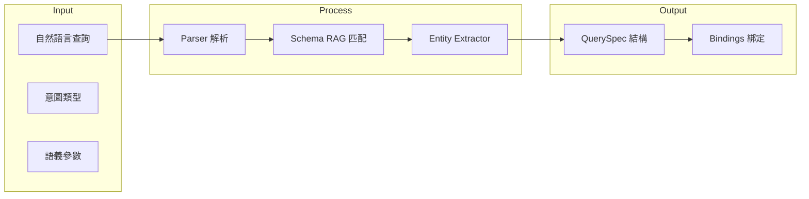

# DAI-S0110 Data-Agent Intent 解析與 RAG 規格書

**文件編號**: DAI-S0110  
**版本**: 4.0.0  
**日期**: 2026-02-27  
**依據代碼**: `datalake-system/data_agent/services/schema_driven_query/`

---

## 1. 產品目的 (Product Purpose)

### 1.1 核心聲明

Data-Agent Intent 解析與 RAG 服務負責將自然語言查詢解析為結構化的意圖和參數，並通過 RAG 技術匹配正確的 Schema 綁定。

### 1.2 解決問題

- 自然語言的歧義性處理
- 語義概念到數據庫 Schema 的映射
- Intent 識別與參數提取

### 1.3 服務對象

- MM-Agent（上游調用者）
- 查詢路由器

---

## 2. 產品概覽 (Product Overview)

### 2.1 目標用戶

| 用戶類型 | 使用場景 | 需求 |
|----------|----------|------|
| MM-Agent | 傳遞結構化查詢 | 精準意圖識別 |
| 開發者 | 調試與監控 | API 接口 |

### 2.2 系統邊界



### 2.3 技術棧

| 層級 | 技術 | 版本 | 用途 |
|------|------|------|------|
| Parser | integrated_parser.py | - | LLM 調用解析 |
| RAG | da_intent_rag.py | - | Intent RAG 匹配 |
| Embedding | embedding_manager.py | - | 向量管理 |
| Entity | entity_extractor.py | - | 實體提取 |

---

## 3. 功能需求 (Functional Requirements)

### 3.1 核心功能

| 功能 ID | 功能名稱 | 說明 |
|---------|----------|------|
| F-DA-011-001 | Intent 解析 | 將 NLQ 解析為 Intent 類型 |
| F-DA-011-002 | 參數提取 | 提取語義參數（material_id, warehouse 等） |
| F-DA-011-003 | Schema RAG 匹配 | 通過 RAG 匹配正確的表和字段 |
| F-DA-011-004 | 實體識別 | 識別查詢中的關鍵實體 |
| F-DA-011-005 | 向量檢索 | 支持語義相似性搜索 |

### 3.2 Parser 功能

| 功能 ID | 功能名稱 | 說明 |
|---------|----------|------|
| F-DA-011-010 | LLM 調用 | 調用 LLM 進行意圖解析 |
| F-DA-011-011 | JSON 解析 | 解析 LLM 返回的 JSON |
| F-DA-011-012 | 錯誤處理 | 解析失敗的異常處理 |

### 3.3 RAG 功能

| 功能 ID | 功能名稱 | 說明 |
|---------|----------|------|
| F-DA-011-020 | Intent 向量檢索 | 從 Qdrant 檢索相似 Intent |
| F-DA-011-021 | Bindings 匹配 | 匹配對應的 Schema Bindings |
| F-DA-011-022 | Concepts 映射 | 映射語義概念到字段 |

---

## 4. 性能要求 (Performance Requirements)

### 4.1 響應時間

| 指標 | 目標值 | 說明 |
|------|--------|------|
| Intent 解析 | ≤ 2000ms | 單次 LLM 調用 |
| RAG 檢索 | ≤ 100ms | 向量相似性搜索 |
| 實體提取 | ≤ 500ms | 單次實體識別 |

### 4.2 吞吐量

| 指標 | 目標值 | 說明 |
|------|--------|------|
| QPS | ≥ 10 | 單實例並發 |

---

## 5. 非功能性需求 (Non-Functional Requirements)

### 5.1 安全性

| 需求 ID | 需求描述 | 優先級 |
|---------|----------|--------|
| NFR-DA-011-001 | LLM API Key 安全存儲 | 必須 |
| NFR-DA-011-002 | 輸入驗證與清洗 | 必須 |

### 5.2 可靠性

| 需求 ID | 需求描述 | 目標值 |
|---------|----------|--------|
| NFR-DA-011-010 | 系統可用性 | ≥ 99.9% |
| NFR-DA-011-011 | LLM 失敗降級 | 支持 fallback |

---

## 6. 外部接口 (External Interfaces)

### 6.1 內部接口

| 模組 | 接口 | 說明 |
|------|------|------|
| Parser | `parse(nlq: str) -> ParsedQuery` | 解析入口 |
| RAG | `search_intent(intent_name: str) -> IntentResult` | Intent 搜索 |
| Entity | `extract_entities(text: str) -> List[Entity]` | 實體提取 |

### 6.2 數據格式

**輸入格式**:
```json
{
  "nlq": "查詢料號 10-0001 的庫存",
  "context": {}
}
```

**輸出格式**:
```json
{
  "intent": "QUERY_STOCK",
  "params": {
    "material_id": "10-0001"
  },
  "confidence": 0.95
}
```

---

## 7. 錯誤碼詳細定義

### 7.1 Parser 錯誤

| 錯誤碼 | 名稱 | 描述 | 處理方式 |
|--------|------|------|----------|
| E110-001 | PARSE_LLM_FAILED | LLM 調用失敗 | 返回錯誤，記錄日誌 |
| E110-002 | PARSE_JSON_INVALID | JSON 解析失敗 | 返回錯誤，建議重試 |
| E110-003 | PARSE_INTENT_EMPTY | 意圖為空 | 返回默認意圖 |

### 7.2 RAG 錯誤

| 錯誤碼 | 名稱 | 描述 | 處理方式 |
|--------|------|------|----------|
| E111-001 | RAG_SEARCH_FAILED | 向量檢索失敗 | 使用 fallback |
| E111-002 | RAG_NO_RESULT | 檢索無結果 | 返回空結果 |

---

## 8. API 詳細規格

### 8.1 主要接口

| 方法 | 接口 | 功能 |
|------|------|------|
| POST | `/api/v1/data-agent/v4/parse` | 解析查詢 |
| GET | `/api/v1/data-agent/v4/intents` | 獲取可用 Intent |
| POST | `/api/v1/data-agent/v4/rag/search` | RAG 搜索 |

---

## 9. 驗收標準

### 9.1 功能驗收

| ID | 標準 |
|----|------|
| AC-DA-011-001 | 能正確解析「查詢料號 XXX 的庫存」為 QUERY_STOCK |
| AC-DA-011-002 | 能提取 material_id 參數 |
| AC-DA-011-003 | RAG 檢索準確率 ≥ 90% |

### 9.2 性能驗收

| ID | 標準 |
|----|------|
| AC-DA-011-010 | Intent 解析響應時間 < 3 秒 |
| AC-DA-011-011 | RAG 檢索響應時間 < 200ms |

---

*文件結束*
