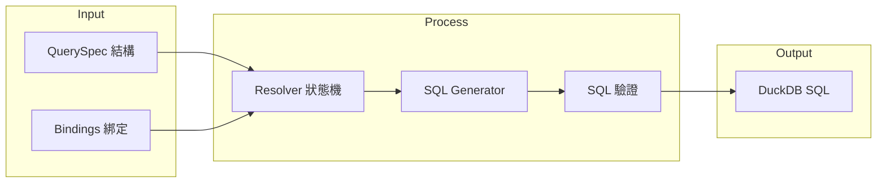

# DAI-S0120 Data-Agent SQL 生成引擎規格書

**文件編號**: DAI-S0120  
**版本**: 4.0.0  
**日期**: 2026-02-27  
**依據代碼**: `datalake-system/data_agent/services/schema_driven_query/`

---

## 1. 產品目的 (Product Purpose)

### 1.1 核心聲明

SQL 生成引擎負責將結構化的 QuerySpec 轉換為可執行的 DuckDB SQL 語句，實現 Schema-Driven Query 的核心轉換邏輯。

### 1.2 解決問題

- 語義概念到 SQL 字段的映射
- 動態 SQL 生成
- SQL 語法驗證

### 1.3 服務對象

- Data-Agent 調用層
- 查詢執行器

---

## 2. 產品概覽 (Product Overview)

### 2.1 目標用戶

| 用戶類型 | 使用場景 | 需求 |
|----------|----------|------|
| Data-Agent | 查詢轉換 | 精準 SQL 生成 |
| 開發者 | 調試 | SQL 預覽 |

### 2.2 系統邊界



### 2.3 技術棧

| 層級 | 技術 | 版本 | 用途 |
|------|------|------|------|
| Resolver | resolver.py | - | 狀態機匹配 |
| SQL Gen | sql_generator.py | - | SQL 生成 |
| Validator | pre_validator.py | - | 前置驗證 |

---

## 3. 功能需求 (Functional Requirements)

### 3.1 核心功能

| 功能 ID | 功能名稱 | 說明 |
|---------|----------|------|
| F-DA-012-001 | 狀態機解析 | 根據 Intent 類型選擇解析策略 |
| F-DA-012-002 | Bindings 映射 | 映射語義字段到 DB 字段 |
| F-DA-012-003 | SQL 生成 | 生成 DuckDB SQL 語句 |
| F-DA-012-004 | SQL 驗證 | 驗證 SQL 語法正確性 |
| F-DA-012-005 | WHERE 條件構建 | 動態構建 WHERE 子句 |

### 3.2 Resolver 功能

| 功能 ID | 功能名稱 | 說明 |
|---------|----------|------|
| F-DA-012-010 | Intent 路由 | 根據意圖選擇處理邏輯 |
| F-DA-012-011 | 參數驗證 | 驗證必需參數是否存在 |
| F-DA-012-012 | 綁定選擇 | 選擇正確的 Schema 綁定 |

### 3.3 SQL Generator 功能

| 功能 ID | 功能名稱 | 說明 |
|---------|----------|------|
| F-DA-012-020 | SELECT 構建 | 構建 SELECT 子句 |
| F-DA-012-021 | FROM 處理 | 處理表名和 JOIN |
| F-DA-012-022 | WHERE 構建 | 動態 WHERE 條件 |
| F-DA-012-023 | LIMIT 處理 | 分頁和限制 |

---

## 4. 性能要求 (Performance Requirements)

### 4.1 響應時間

| 指標 | 目標值 | 說明 |
|------|--------|------|
| SQL 生成 | ≤ 100ms | 單次生成 |
| 驗證時間 | ≤ 50ms | 語法驗證 |

### 4.2 吞吐量

| 指標 | 目標值 | 說明 |
|------|--------|------|
| QPS | ≥ 50 | 單實例並發 |

---

## 5. 非功能性需求 (Non-Functional Requirements)

### 5.1 安全性

| 需求 ID | 需求描述 | 優先級 |
|---------|----------|--------|
| NFR-DA-012-001 | SQL 注入防護 | 必須 |
| NFR-DA-012-002 | 權限控制 | 必須 |

### 5.2 可靠性

| 需求 ID | 需求描述 | 目標值 |
|---------|----------|--------|
| NFR-DA-012-010 | 生成成功率 | ≥ 99% |
| NFR-DA-012-011 | SQL 正確率 | ≥ 95% |

---

## 6. 外部接口 (External Interfaces)

### 6.1 內部接口

| 模組 | 接口 | 說明 |
|------|------|------|
| Resolver | `resolve(query_spec: QuerySpec) -> ResolvedQuery` | 解析入口 |
| SQLGen | `generate_sql(resolved: ResolvedQuery) -> str` | SQL 生成 |

### 6.2 數據格式

**輸入格式**:
```json
{
  "intent": "QUERY_STOCK",
  "params": {
    "material_id": "10-0001"
  },
  "bindings": {
    "table": "mart_inventory_wide",
    "fields": {
      "material_id": "item_no"
    }
  }
}
```

**輸出格式**:
```sql
SELECT item_no, warehouse_no, quantity 
FROM mart_inventory_wide 
WHERE item_no = '10-0001'
LIMIT 100
```

---

## 7. 錯誤碼詳細定義

### 7.1 Resolver 錯誤

| 錯誤碼 | 名稱 | 描述 | 處理方式 |
|--------|------|------|----------|
| E120-001 | RESOLVER_NO_INTENT | 意圖未識別 | 返回錯誤 |
| E120-002 | RESOLVER_NO_BINDINGS | 無可用綁定 | 返回錯誤 |
| E120-003 | RESOLVER_PARAM_MISSING | 參數缺失 | 返回錯誤 |

### 7.2 SQL Generator 錯誤

| 錯誤碼 | 名稱 | 描述 | 處理方式 |
|--------|------|------|----------|
| E121-001 | SQL_GEN_FAILED | 生成失敗 | 返回錯誤 |
| E121-002 | SQL_INVALID | SQL 無效 | 拋出異常 |
| E121-003 | SQL_TABLE_NOT_FOUND | 表不存在 | 返回錯誤 |

---

## 8. API 詳細規格

### 8.1 主要接口

| 方法 | 接口 | 功能 |
|------|------|------|
| POST | `/api/v1/data-agent/v4/generate` | 生成 SQL |
| POST | `/api/v1/data-agent/v4/validate` | 驗證 SQL |

---

## 9. 驗收標準

### 9.1 功能驗收

| ID | 標準 |
|----|------|
| AC-DA-012-001 | 能正確生成「查詢料號庫存」的 SQL |
| AC-DA-012-002 | 能正確處理 WHERE 條件 |
| AC-DA-012-003 | SQL 語法正確，可執行 |

### 9.2 性能驗收

| ID | 標準 |
|----|------|
| AC-DA-012-010 | SQL 生成時間 < 100ms |
| AC-DA-012-011 | 驗證時間 < 50ms |

---

*文件結束*
