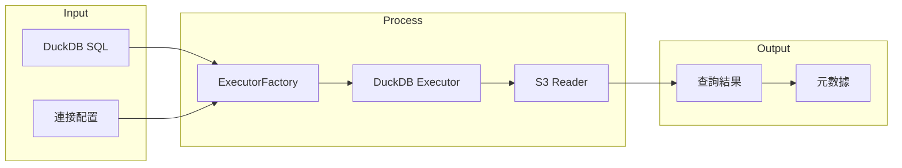

# DAI-S0130 Data-Agent 查詢執行器規格書

**文件編號**: DAI-S0130  
**版本**: 4.0.0  
**日期**: 2026-02-27  
**依據代碼**: `datalake-system/data_agent/services/schema_driven_query/`

---

## 1. 產品目的 (Product Purpose)

### 1.1 核心聲明

查詢執行器負責執行生成的 SQL 語句，連接 DuckDB 和 S3 存儲，實現數據的實際檢索。

### 1.2 解決問題

- DuckDB 連接管理
- S3 Parquet 文件查詢
- 查詢結果處理

### 1.3 服務對象

- Data-Agent API 層
- 外部調用者

---

## 2. 產品概覽 (Product Overview)

### 2.1 目標用戶

| 用戶類型 | 使用場景 | 需求 |
|----------|----------|------|
| API | 查詢執行 | 高效執行 |
| 監控 | 性能監控 | 查詢統計 |

### 2.2 系統邊界



### 2.3 技術棧

| 層級 | 技術 | 版本 | 用途 |
|------|------|------|------|
| Executor | executor.py | - | 執行器工廠 |
| DuckDB | duckdb_executor.py | 1.4.4 | 數據庫連接 |
| S3 | SeaweedFS | - | Parquet 讀取 |

---

## 3. 功能需求 (Functional Requirements)

### 3.1 核心功能

| 功能 ID | 功能名稱 | 說明 |
|---------|----------|------|
| F-DA-013-001 | 連接管理 | DuckDB 連接池管理 |
| F-DA-013-002 | SQL 執行 | 執行 DuckDB SQL |
| F-DA-013-003 | S3 讀取 | 讀取 Parquet 文件 |
| F-DA-013-004 | 結果處理 | 結果格式化與分頁 |
| F-DA-013-005 | 性能監控 | 查詢時間統計 |

### 3.2 Executor Factory 功能

| 功能 ID | 功能名稱 | 說明 |
|---------|----------|------|
| F-DA-013-010 | 執行器選擇 | 根據 SQL 類型選擇執行器 |
| F-DA-013-011 | 連接池 | 維護連接池 |
| F-DA-013-012 | 異常處理 | 執行異常處理 |

### 3.3 DuckDB Executor 功能

| 功能 ID | 功能名稱 | 說明 |
|---------|----------|------|
| F-DA-013-020 | 查詢執行 | 執行 SELECT 語句 |
| F-DA-013-021 | 參數綁定 | 參數化查詢 |
| F-DA-013-022 | 結果轉換 | 結果轉為 DataFrame |

---

## 4. 性能要求 (Performance Requirements)

### 4.1 響應時間

| 指標 | 目標值 | 說明 |
|------|--------|------|
| 連接建立 | ≤ 500ms | 首次連接 |
| 查詢執行 | ≤ 5000ms | 簡單查詢 |
| 結果返回 | ≤ 1000ms | 結果處理 |

### 4.2 吞吐量

| 指標 | 目標值 | 說明 |
|------|--------|------|
| QPS | ≥ 20 | 單實例並發 |
| 並發連接 | ≤ 10 | 連接池大小 |

---

## 5. 非功能性需求 (Non-Functional Requirements)

### 5.1 安全性

| 需求 ID | 需求描述 | 優先級 |
|---------|----------|--------|
| NFR-DA-013-001 | 連接憑證安全 | 必須 |
| NFR-DA-013-002 | 查詢超時保護 | 必須 |

### 5.2 可靠性

| 需求 ID | 需求描述 | 目標值 |
|---------|----------|--------|
| NFR-DA-013-010 | 執行成功率 | ≥ 99% |
| NFR-DA-013-011 | 連接可用性 | ≥ 99.9% |

---

## 6. 外部接口 (External Interfaces)

### 6.1 內部接口

| 模組 | 接口 | 說明 |
|------|------|------|
| Factory | `get_executor(db_type: str) -> BaseExecutor` | 獲取執行器 |
| DuckDB | `execute(sql: str, params: dict) -> Result` | 執行 SQL |

### 6.2 數據格式

**輸入格式**:
```json
{
  "sql": "SELECT * FROM mart_inventory_wide WHERE item_no = ?",
  "params": ["10-0001"],
  "timeout": 30000
}
```

**輸出格式**:
```json
{
  "status": "success",
  "data": [...],
  "row_count": 100,
  "execution_time_ms": 45.2
}
```

---

## 7. 錯誤碼詳細定義

### 7.1 連接錯誤

| 錯誤碼 | 名稱 | 描述 | 處理方式 |
|--------|------|------|----------|
| E130-001 | CONN_DUCKDB_FAILED | DuckDB 連接失敗 | 重試或返回錯誤 |
| E130-002 | CONN_TIMEOUT | 連接超時 | 返回錯誤 |
| E130-003 | CONN_POOL_EXHAUSTED | 連接池耗盡 | 排隊等待 |

### 7.2 執行錯誤

| 錯誤碼 | 名稱 | 描述 | 處理方式 |
|--------|------|------|----------|
| E131-001 | EXEC_SQL_FAILED | SQL 執行失敗 | 返回錯誤信息 |
| E131-002 | EXEC_TIMEOUT | 執行超時 | 取消查詢 |
| E131-003 | EXEC_S3_FAILED | S3 讀取失敗 | 返回錯誤 |

---

## 8. API 詳細規格

### 8.1 主要接口

| 方法 | 接口 | 功能 |
|------|------|------|
| POST | `/api/v1/data-agent/v4/execute` | 執行查詢 |
| POST | `/api/v1/data-agent/v4/execute/stream` | SSE 流式執行 |

---

## 9. 驗收標準

### 9.1 功能驗收

| ID | 標準 |
|----|------|
| AC-DA-013-001 | 能正確執行 SQL 查詢 |
| AC-DA-013-002 | 能正確讀取 S3 Parquet |
| AC-DA-013-003 | 返回正確的結果格式 |

### 9.2 性能驗收

| ID | 標準 |
|----|------|
| AC-DA-013-010 | 查詢執行時間 < 5 秒 |
| AC-DA-013-011 | 支持並發查詢 |

---

*文件結束*
