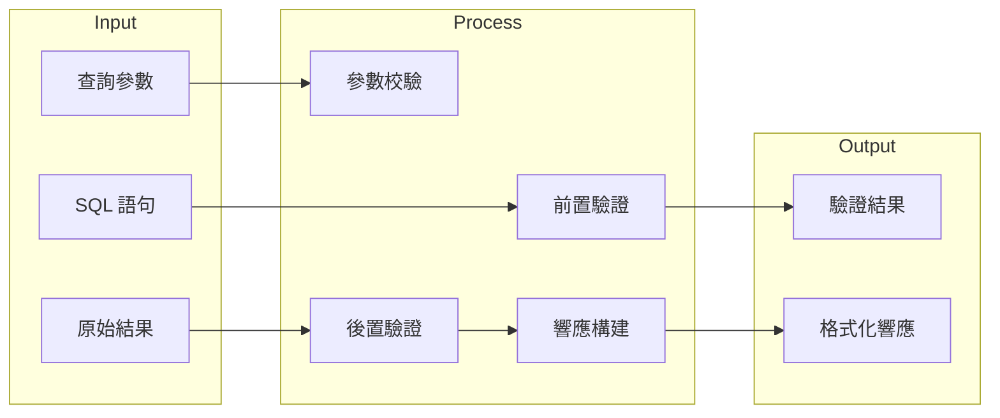

# DAI-S0140 Data-Agent 驗證與響應處理規格書

**文件編號**: DAI-S0140  
**版本**: 4.0.0  
**日期**: 2026-02-27  
**依據代碼**: `datalake-system/data_agent/services/schema_driven_query/`

---

## 1. 產品目的 (Product Purpose)

### 1.1 核心聲明

驗證與響應處理負責 SQL 執行的前置驗證、參數校驗，以及結果的後置處理和格式化。

### 1.2 解決問題

- 防止無效 SQL 執行
- 參數合法性校驗
- 結果標準化

### 1.3 服務對象

- SQL 生成器
- API 響應層

---

## 2. 產品概覽 (Product Overview)

### 2.1 目標用戶

| 用戶類型 | 使用場景 | 需求 |
|----------|----------|------|
| SQL Gen | 前置驗證 | 確保 SQL 可執行 |
| API | 響應格式化 | 統一輸出格式 |

### 2.2 系統邊界



### 2.3 技術棧

| 層級 | 技術 | 版本 | 用途 |
|------|------|------|------|
| Validator | pre_validator.py | - | 前置驗證 |
| Response | response_builder.py | - | 響應構建 |
| Entity | entity_extractor.py | - | 實體處理 |

---

## 3. 功能需求 (Functional Requirements)

### 3.1 前置驗證功能

| 功能 ID | 功能名稱 | 說明 |
|---------|----------|------|
| F-DA-014-001 | SQL 語法檢查 | 檢查 SQL 語法 |
| F-DA-014-002 | 危險 SQL 攔截 | 阻止 DROP/DELETE |
| F-DA-014-003 | 表存在性檢查 | 檢查表是否存 |
| F-DA-014-004 | 字段合法性 | 檢查字段是否存在 |

### 3.2 參數驗證功能

| 功能 ID | 功能名稱 | 說明 |
|---------|----------|------|
| F-DA-014-010 | 必填參數檢查 | 檢查必要參數 |
| F-DA-014-011 | 參數類型校驗 | 類型正確性 |
| F-DA-014-012 | 參數範圍校驗 | 數值範圍檢查 |
| F-DA-014-013 | 參數格式校驗 | 格式規範檢查 |

### 3.3 後置驗證功能

| 功能 ID | 功能名稱 | 說明 |
|---------|----------|------|
| F-DA-014-020 | 結果非空檢查 | 結果是否有效 |
| F-DA-014-021 | 數據完整性 | 數據一致性 |
| F-DA-014-022 | 異常數據標記 | 標記異常數據 |

### 3.4 響應構建功能

| 功能 ID | 功能名稱 | 說明 |
|---------|----------|------|
| F-DA-014-030 | 結果格式化 | JSON 格式化 |
| F-DA-014-031 | 字段映射 | 字段名稱轉換 |
| F-DA-014-032 | 分頁處理 | 分頁元數據 |
| F-DA-014-033 | SSE 格式化 | Server-Sent Events |

---

## 4. 性能要求 (Performance Requirements)

### 4.1 響應時間

| 指標 | 目標值 | 說明 |
|------|--------|------|
| 前置驗證 | ≤ 50ms | 單次驗證 |
| 後置驗證 | ≤ 100ms | 結果驗證 |
| 響應構建 | ≤ 50ms | 格式轉換 |

### 4.2 吞吐量

| 指標 | 目標值 | 說明 |
|------|--------|------|
| QPS | ≥ 50 | 單實例並發 |

---

## 5. 非功能性需求 (Non-Functional Requirements)

### 5.1 安全性

| 需求 ID | 需求描述 | 優先級 |
|---------|----------|--------|
| NFR-DA-014-001 | SQL 注入防護 | 必須 |
| NFR-DA-014-002 | 參數清洗 | 必須 |

### 5.2 可靠性

| 需求 ID | 需求描述 | 目標值 |
|---------|----------|--------|
| NFR-DA-014-010 | 驗證覆蓋率 | 100% |
| NFR-DA-014-011 | 誤攔截率 | < 1% |

---

## 6. 外部接口 (External Interfaces)

### 6.1 內部接口

| 模組 | 接口 | 說明 |
|------|------|------|
| PreValidator | `validate(sql: str, params: dict) -> ValidationResult` | 前置驗證 |
| PostValidator | `validate_result(data: list) -> ValidationResult` | 後置驗證 |
| ResponseBuilder | `build(result: QueryResult) -> Response` | 響應構建 |

### 6.2 數據格式

**驗證輸入**:
```json
{
  "sql": "SELECT * FROM table WHERE id = ?",
  "params": {"id": "123"},
  "context": {}
}
```

**響應輸出**:
```json
{
  "status": "success",
  "result": {
    "data": [...],
    "columns": ["id", "name"],
    "row_count": 10,
    "execution_time_ms": 45.2
  },
  "validated": true,
  "warnings": []
}
```

---

## 7. 錯誤碼詳細定義

### 7.1 前置驗證錯誤

| 錯誤碼 | 名稱 | 描述 | 處理方式 |
|--------|------|------|----------|
| E140-001 | PRE_VAL_SQL_INVALID | SQL 無效 | 阻止執行 |
| E140-002 | PRE_VAL_DANGEROUS_SQL | 危險 SQL | 阻止執行 |
| E140-003 | PRE_VAL_TABLE_NOT_FOUND | 表不存在 | 返回錯誤 |
| E140-004 | PRE_VAL_PARAM_MISSING | 參數缺失 | 返回錯誤 |

### 7.2 後置驗證錯誤

| 錯誤碼 | 名稱 | 描述 | 處理方式 |
|--------|------|------|----------|
| E141-001 | POST_VAL_EMPTY_RESULT | 結果為空 | 警告返回 |
| E141-002 | POST_VAL_DATA_INVALID | 數據無效 | 標記異常 |

### 7.3 響應構建錯誤

| 錯誤碼 | 名稱 | 描述 | 處理方式 |
|--------|------|------|----------|
| E142-001 | BUILD_FAILED | 構建失敗 | 返回原始結果 |

---

## 8. API 詳細規格

### 8.1 主要接口

| 方法 | 接口 | 功能 |
|------|------|------|
| POST | `/api/v1/data-agent/v4/validate/pre` | 前置驗證 |
| POST | `/api/v1/data-agent/v4/validate/post` | 後置驗證 |

---

## 9. 驗收標準

### 9.1 功能驗收

| ID | 標準 |
|----|------|
| AC-DA-014-001 | 能正確攔截危險 SQL |
| AC-DA-014-002 | 能驗證必填參數 |
| AC-DA-014-003 | 能正確格式化響應 |

### 9.2 性能驗收

| ID | 標準 |
|----|------|
| AC-DA-014-010 | 驗證時間 < 100ms |
| AC-DA-014-011 | 響應構建時間 < 50ms |

---

*文件結束*
