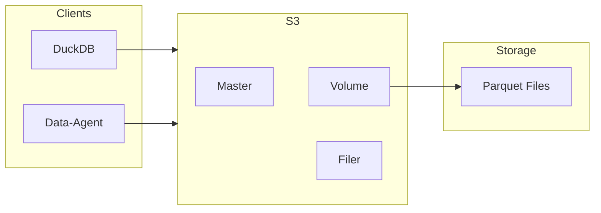

# DAI-S0220 Datalake S3 存儲規格書

**文件編號**: DAI-S0220  
**版本**: 1.0  
**日期**: 2026-02-27  
**依據代碼**: `datalake-system/`, `storage/seaweedfs/`

---

## 1. 產品目的 (Product Purpose)

### 1.1 核心聲明

Datalake S3 存儲負責管理 SeaweedFS S3 相容存儲，提供 Parquet 文件的讀寫服務。

### 1.2 解決問題

- 大規模數據存儲
- S3 相容接口
- 數據持久化

### 1.3 服務對象

- DuckDB 執行器
- Data-Agent

---

## 2. 產品概覽 (Product Overview)

### 2.1 目標用戶

| 用戶類型 | 使用場景 | 需求 |
|----------|----------|------|
| DuckDB | Parquet 讀取 | S3 接口訪問 |
| Data-Agent | 數據寫入 | 文件上傳 |

### 2.2 系統邊界

### 2.3 技術棧

| 層級 | 技術 | 版本 | 用途 |
|------|------|------|------|
| S3 | SeaweedFS | 3.56+ | S3 相容存儲 |
| Protocol | S3 API | - | 標準 S3 協議 |
| Format | Parquet | - | 列式存儲格式 |

---

## 3. 功能需求 (Functional Requirements)

### 3.1 存儲功能

| 功能 ID | 功能名稱 | 說明 |
|---------|----------|------|
| F-DL-022-001 | 文件上傳 | S3 Put Object |
| F-DL-022-002 | 文件下載 | S3 Get Object |
| F-DL-022-003 | 文件列表 | S3 List Objects |
| F-DL-022-004 | 文件刪除 | S3 Delete Object |

### 3.2 Parquet 處理

| 功能 ID | 功能名稱 | 說明 |
|---------|----------|------|
| F-DL-022-010 | 分區讀取 | 按分區讀取 Parquet |
| F-DL-022-011 | 列裁剪 | 只讀取需要的列 |
| F-DL-022-012 | 壓縮支持 | Snappy/Gzip 壓縮 |

### 3.3 數據路徑

| 表名 | 路徑 |
|------|------|
| mart_inventory_wide | s3://tiptop-raw/raw/v1/tiptop_jp/mart_inventory_wide/ |
| mart_work_order_wide | s3://tiptop-raw/raw/v1/tiptop_jp/mart_work_order_wide/ |
| mart_shipping_wide | s3://tiptop-raw/raw/v1/tiptop_jp/mart_shipping_wide/ |

---

## 4. 性能要求 (Performance Requirements)

### 4.1 響應時間

| 指標 | 目標值 | 說明 |
|------|--------|------|
| 文件讀取 | ≤ 3s | 單文件讀取 |
| 文件上傳 | ≤ 5s | 單文件上傳 |

### 4.2 吞吐量

| 指標 | 目標值 | 說明 |
|------|--------|------|
| 讀取带宽 | ≥ 100 MB/s | 順序讀取 |
| 寫入带宽 | ≥ 50 MB/s | 順序寫入 |

---

## 5. 非功能性需求 (Non-Functional Requirements)

### 5.1 可靠性

| 需求 ID | 需求描述 | 目標值 |
|---------|----------|--------|
| NFR-DL-022-010 | 數據持久性 | 11 個 9 |
| NFR-DL-022-011 | 可用性 | ≥ 99.9% |

---

## 6. 外部接口 (External Interfaces)

### 6.1 S3 接口

| 方法 | 接口 | 功能 |
|------|------|------|
| GET | /{bucket}/{path} | 讀取對象 |
| PUT | /{bucket}/{path} | 寫入對象 |
| DELETE | /{bucket}/{path} | 刪除對象 |

### 6.2 配置

| 參數 | 值 |
|------|-----|
| Endpoint | localhost:8334 |
| Bucket | tiptop-raw |
| Access Key | admin |
| Secret Key | admin123 |

---

## 7. 錯誤碼詳細定義

### 7.1 S3 錯誤

| 錯誤碼 | 名稱 | 描述 |
|--------|------|------|
| E220-001 | S3_CONN_FAILED | 連接失敗 |
| E220-002 | S3_UPLOAD_FAILED | 上傳失敗 |
| E220-003 | S3_NOT_FOUND | 文件不存在 |

---

## 8. 驗收標準

### 8.1 功能驗收

| ID | 標準 |
|----|------|
| AC-DL-022-001 | 能通過 S3 接口讀寫 Parquet |
| AC-DL-022-002 | DuckDB 能直接查詢 S3 Parquet |

---

*文件結束*
