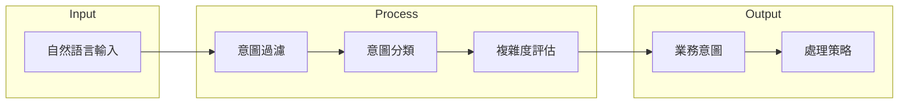

# DAI-S0310 MM-Agent 意圖分類規格書

**文件編號**: DAI-S0310  
**版本**: 3.1  
**日期**: 2026-02-27  
**依據代碼**: `datalake-system/mm_agent/bpa/`

---

## 1. 產品目的 (Product Purpose)

### 1.1 核心聲明

MM-Agent 意圖分類服務負責將用戶輸入的自然語言分類為結構化的業務意圖，實現任務路由和處理策略選擇。

### 1.2 解決問題

- 用戶意圖識別
- 任務類型分類
- 複雜度評估

### 1.3 服務對象

- 前端調用者
- Agent Chain

---

## 2. 產品概覽 (Product Overview)

### 2.1 目標用戶

| 用戶類型 | 使用場景 | 需求 |
|----------|----------|------|
| 前端 | 用戶查詢 | 意圖識別 |
| Chain | 任務分發 | 意圖傳遞 |

### 2.2 系統邊界



### 2.3 技術棧

| 層級 | 技術 | 版本 | 用途 |
|------|------|------|------|
| Classifier | intent_classifier.py | - | 意圖分類 |
| Analyzer | semantic_analyzer.py | - | 語義分析 |
| RAG | mm_intent_rag_client.py | - | Intent RAG |

---

## 3. 功能需求 (Functional Requirements)

### 3.1 意圖過濾

| 功能 ID | 功能名稱 | 說明 |
|---------|----------|------|
| F-MM-031-001 | 打招呼檢測 | 識別問候語 |
| F-MM-031-002 | 無效輸入過濾 | 過濾無關輸入 |
| F-MM-031-003 | 簡單指代消解 | this/that 消解 |

### 3.2 意圖分類

| 功能 ID | 功能名稱 | 說明 |
|---------|----------|------|
| F-MM-031-010 | 簡單查詢分類 | 庫存、訂單查詢 |
| F-MM-031-011 | 複雜任務分類 | 多步驟任務 |
| F-MM-031-012 | 業務操作分類 | 修改、刪除操作 |

### 3.3 語義分析

| 功能 ID | 功能名稱 | 說明 |
|---------|----------|------|
| F-MM-031-020 | 時間提取 | 識別時間表達 |
| F-MM-031-021 | 數量提取 | 識別數量表達 |
| F-MM-031-022 | 條件分析 | WHERE 條件 |

---

## 4. 性能要求 (Performance Requirements)

### 4.1 響應時間

| 指標 | 目標值 | 說明 |
|------|--------|------|
| 意圖分類 | ≤ 2000ms | LLM 調用 |
| 語義分析 | ≤ 500ms | 規則分析 |

### 4.2 準確率

| 指標 | 目標值 | 說明 |
|------|--------|------|
| 意圖分類準確率 | ≥ 90% | 測試集 |
| 語義提取準確率 | ≥ 95% | 關鍵字段 |

---

## 5. 非功能性需求 (Non-Functional Requirements)

### 5.1 可靠性

| 需求 ID | 需求描述 | 目標值 |
|---------|----------|--------|
| NFR-MM-031-010 | 系統可用性 | ≥ 99.9% |
| NFR-MM-031-011 | 失敗降級 | 支持 fallback |

---

## 6. 外部接口 (External Interfaces)

### 6.1 接口定義

| 方法 | 接口 | 功能 |
|------|------|------|
| POST | `/api/v1/mm-agent/classify` | 意圖分類 |
| POST | `/api/v1/mm-agent/analyze` | 語義分析 |

### 6.2 數據格式

**輸入**:
```json
{
  "query": "查詢料號 10-0001 的庫存"
}
```

**輸出**:
```json
{
  "intent": "QUERY_STOCK",
  "params": {
    "material_id": "10-0001"
  },
  "complexity": "simple",
  "confidence": 0.95
}
```

---

## 7. 錯誤碼詳細定義

| 錯誤碼 | 名稱 | 描述 |
|--------|------|------|
| E310-001 | CLASSIFY_FAILED | 分類失敗 |
| E310-002 | INTENT_EMPTY | 意圖為空 |
| E310-003 | ANALYZE_FAILED | 分析失敗 |

---

## 8. 驗收標準

| ID | 標準 |
|----|------|
| AC-MM-031-001 | 能正確分類「查詢庫存」為 QUERY_STOCK |
| AC-MM-031-002 | 能識別時間參數 |

---

*文件結束*
