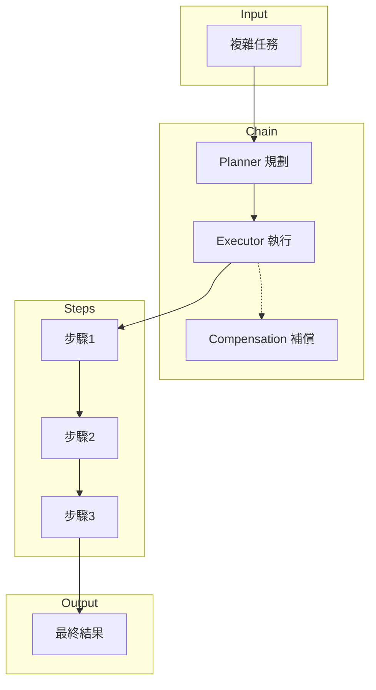

# DAI-S0330 MM-Agent Agent Chain 執行規格書

**文件編號**: DAI-S0330  
**版本**: 3.1  
**日期**: 2026-02-27  
**依據代碼**: `datalake-system/mm_agent/chain/`

---

## 1. 產品目的 (Product Purpose)

### 1.1 核心聲明

Agent Chain 執行服務負責協調複雜任務的分解、執行和結果聚合，實現多步驟工作流的自動化處理。

### 1.2 解決問題

- 複雜任務分解
- 步驟執行協調
- 結果聚合

### 1.3 服務對象

- MM-Agent 主流程
- 外部調用者

---

## 2. 產品概覽 (Product Overview)

### 2.1 目標用戶

| 用戶類型 | 使用場景 | 需求 |
|----------|----------|------|
| 主流程 | 任務調度 | Chain 協調 |
| 監控 | 執行追蹤 | 狀態監控 |

### 2.2 系統邊界



### 2.3 技術棧

| 層級 | 技術 | 版本 | 用途 |
|------|------|------|------|
| Chain | mm_agent_chain.py | - | Chain 主控 |
| Planner | react_planner.py | - | 任務規劃 |
| Executor | react_executor.py | - | 步驟執行 |
| Context | context_manager.py | - | 上下文管理 |

---

## 3. 功能需求 (Functional Requirements)

### 3.1 任務規劃

| 功能 ID | 功能名稱 | 說明 |
|---------|----------|------|
| F-MM-033-001 | 任務分解 | 拆分複雜任務 |
| F-MM-033-002 | 依賴分析 | 分析步驟依賴 |
| F-MM-033-003 | 執行計劃 | 生成執行計劃 |

### 3.2 步驟執行

| 功能 ID | 功能名稱 | 說明 |
|---------|----------|------|
| F-MM-033-010 | 步驟調度 | 按計劃執行 |
| F-MM-033-011 | 狀態追蹤 | 追蹤執行狀態 |
| F-MM-033-012 | 異常處理 | 處理執行異常 |
| F-MM-033-013 | 重試機制 | 失敗重試 |

### 3.3 上下文管理

| 功能 ID | 功能名稱 | 說明 |
|---------|----------|------|
| F-MM-033-020 | 上下文保存 | 保存執行上下文 |
| F-MM-033-021 | 上下文恢復 | 恢復歷史上下文 |
| F-MM-033-022 | 變量傳遞 | 步驟間變量傳遞 |

### 3.4 補償機制

| 功能 ID | 功能名稱 | 說明 |
|---------|----------|------|
| F-MM-033-030 | 失敗回滾 | 回滾失敗操作 |
| F-MM-033-031 | 部分完成 | 處理部分完成場景 |

---

## 4. 性能要求 (Performance Requirements)

### 4.1 響應時間

| 指標 | 目標值 | 說明 |
|------|--------|------|
| 規劃時間 | ≤ 3000ms | 任務規劃 |
| 步驟執行 | ≤ 5000ms/步 | 單步執行 |

### 4.2 吞吐量

| 指標 | 目標值 | 說明 |
|------|--------|------|
| 並發 Chain | ≤ 5 | 單實例 |

---

## 5. 非功能性需求 (Non-Functional Requirements)

### 5.1 可靠性

| 需求 ID | 需求描述 | 目標值 |
|---------|----------|--------|
| NFR-MM-033-010 | Chain 完成率 | ≥ 95% |
| NFR-MM-033-011 | 異常恢復 | 支持 |

---

## 6. 外部接口 (External Interfaces)

### 6.1 接口定義

| 方法 | 接口 | 功能 |
|------|------|------|
| POST | `/api/v1/mm-agent/chain/execute` | 執行 Chain |
| GET | `/api/v1/mm-agent/chain/status/{task_id}` | 查詢狀態 |
| POST | `/api/v1/mm-agent/chain/cancel` | 取消執行 |

### 6.2 數據格式

**輸入**:
```json
{
  "task": "查詢庫存並發送郵件",
  "params": {...}
}
```

**輸出**:
```json
{
  "task_id": "chain_001",
  "status": "completed",
  "steps": [...],
  "result": {...}
}
```

---

## 7. 錯誤碼詳細定義

| 錯誤碼 | 名稱 | 描述 |
|--------|------|------|
| E330-001 | PLAN_FAILED | 規劃失敗 |
| E330-002 | STEP_FAILED | 步驟執行失敗 |
| E330-003 | CHAIN_TIMEOUT | Chain 超時 |
| E330-004 | COMPENSATE_FAILED | 補償失敗 |

---

## 8. 驗收標準

| ID | 標準 |
|----|------|
| AC-MM-033-001 | 能正確分解「查詢並發送」任務 |
| AC-MM-033-002 | 能正確執行多步驟 Chain |

---

*文件結束*
