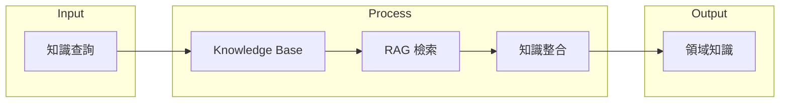

# DAI-S0340 MM-Agent 知識服務規格書

**文件編號**: DAI-S0340  
**版本**: 3.1  
**日期**: 2026-02-27  
**依據代碼**: `datalake-system/mm_agent/`

---

## 1. 產品目的 (Product Purpose)

### 1.1 核心聲明

知識服務負責管理領域知識的檢索和整合，為 Agent 提供專業知識支持。

### 1.2 解決問題

- 領域知識檢索
- 專業術語解釋
- 業務規則查詢

### 1.3 服務對象

- Agent 執行流程
- 問答系統

---

## 2. 產品概覽 (Product Overview)

### 2.1 目標用戶

| 用戶類型 | 使用場景 | 需求 |
|----------|----------|------|
| Agent | 知識檢索 | 專業知識 |
| 問答 | 答案生成 | 知識增強 |

### 2.2 系統邊界

### 2.3 技術棧

| 層級 | 技術 | 版本 | 用途 |
|------|------|------|------|
| Service | knowledge_service.py | - | 知識服務 |
| KB | knowledge/ | - | 知識庫文件 |
| RAG | embedding + Qdrant | - | 向量檢索 |

---

## 3. 功能需求 (Functional Requirements)

### 3.1 知識檢索

| 功能 ID | 功能名稱 | 說明 |
|---------|----------|------|
| F-MM-034-001 | 語義檢索 | 向量相似性搜索 |
| F-MM-034-002 | 關鍵詞檢索 | 精確匹配 |
| F-MM-034-003 | 混合檢索 | 語義+關鍵詞 |

### 3.2 知識管理

| 功能 ID | 功能名稱 | 說明 |
|---------|----------|------|
| F-MM-034-010 | 知識添加 | 新增知識條目 |
| F-MM-034-011 | 知識更新 | 修改知識內容 |
| F-MM-034-012 | 知識版本 | 版本管理 |

### 3.3 知識類型

| 類型 | 說明 |
|------|------|
| 物料管理知識 | 庫管員專業知識 |
| 作業程序 | 標準作業程序 |
| ERP 操作 | TIPTOP 操作手冊 |

---

## 4. 性能要求 (Performance Requirements)

| 指標 | 目標值 | 說明 |
|------|--------|------|
| 檢索時間 | ≤ 500ms | 單次檢索 |
| 知識匹配 | ≥ 3 條 | 返回數量 |

---

## 5. 非功能性需求 (Non-Functional Requirements)

### 5.1 可靠性

| 需求 ID | 需求描述 | 目標值 |
|---------|----------|--------|
| NFR-MM-034-010 | 知識可用性 | ≥ 99% |
| NFR-MM-034-011 | 檢索準確率 | ≥ 85% |

---

## 6. 外部接口 (External Interfaces)

### 6.1 接口定義

| 方法 | 接口 | 功能 |
|------|------|------|
| POST | `/api/v1/mm-agent/knowledge/search` | 知識搜索 |
| POST | `/api/v1/mm-agent/knowledge/add` | 添加知識 |
| GET | `/api/v1/mm-agent/knowledge/{id}` | 獲取知識 |

---

## 7. 錯誤碼詳細定義

| 錯誤碼 | 名稱 | 描述 |
|--------|------|------|
| E340-001 | KB_NOT_FOUND | 知識庫不存在 |
| E340-002 | SEARCH_FAILED | 檢索失敗 |
| E340-003 | ADD_FAILED | 添加失敗 |

---

## 8. 驗收標準

| ID | 標準 |
|----|------|
| AC-MM-034-001 | 能檢索相關領域知識 |
| AC-MM-034-002 | 能正確整合知識到回答 |

---

*文件結束*
