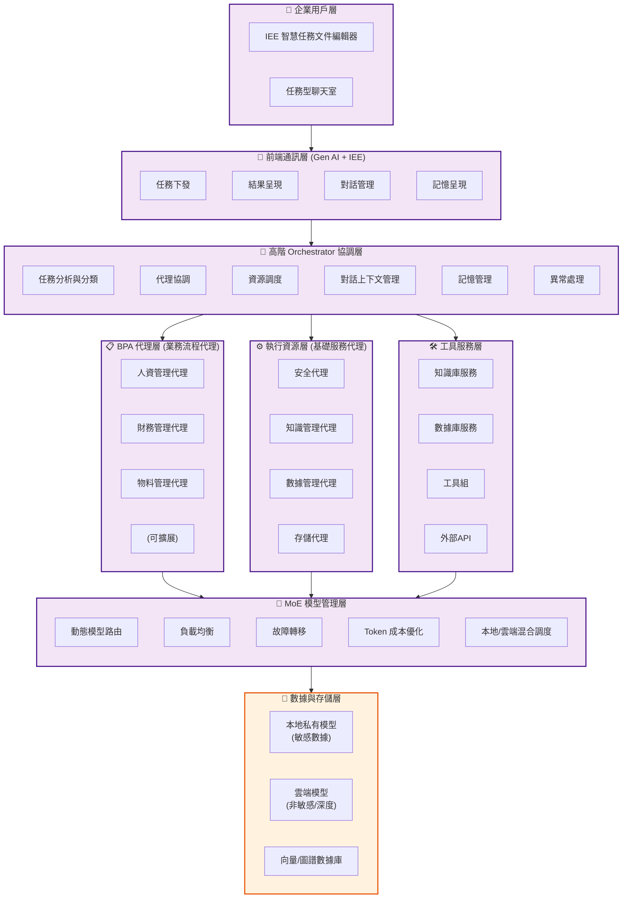

# AI-Box 企業級AI智能體應用平台專案報告

**報告日期**：2026-02-25  
**版本**：v2.0  
**負責人**：Daniel Chung

---

## 目錄

1. [產品價值說明](#一產品價值說明)
2. [系統架構說明](#二系統架構說明)
3. [功能模組說明](#三功能模組說明)
4. [開發進度](#四開發進度)
5. [代碼規模統計](#五代碼規模統計)
6. [技術規格摘要](#六技術規格摘要)
7. [總結與下一步](#七總結與下一步)

---

## 一、產品價值說明

### 1.1 核心定位

**AI-Box** 是一個**企業級AI智能體（Agent）應用平台**，旨在協助企業透過智能化代理系統提升營運效率與生產力。

### 1.2 與傳統AI助理的差異

| 維度 | 傳統AI助理 | AI-Box 企業代理平台 |
|------|-----------|-------------------|
| **應用深度** | 簡單問答、檔案生成 | 複雜企業流程自動化 |
| **執行模式** | 單次互動 | 多輪任務執行（512k+ tokens 記憶） |
| **架構** | 單一模型 | **多代理協作 + 多模型分流** |
| **知識管理** | 基本RAG | **向量+圖譜混合檢索 + Ontology** |
| **數據獲取** | Text-to-SQL | **SQLD（Schema Query Driven）精準獲取** |
| **部署** | 雲端為主 | **本地私有模型 + 雲端混合** |

### 1.3 企業價值主張

#### 1. 流程自動化
- 透過設置各類業務代理（HR、財務、物料管理），輔助企業管理人員處理日常事務
- 多代理協作，處理複雜企業流程

#### 2. 知識資產化
- 強化向量與圖譜混合檢索，確保知識精準獲取
- Ontology 知識本體管理，為未來AI推斷奠定基礎

#### 3. 數據決策支持
- SQLD 架構提升數據庫查詢準確性
- 企業私有數據本地處理，確保安全性

#### 4. 成本優化
- 不同代理/工具採用不同模型
- 本地私有模型處理敏感數據，雲端模型處理非敏感任務
- 有效控制企業 Token 成本

#### 5. 彈性擴展
- 預留本地模型微調與定制訓練接口
- 可根據企業特定需求訓練專用模型

---

## 二、系統架構說明

### 2.1 三層式代理架構



### 2.2 核心設計原則

1. **任務驅動**：以任務（Task）為單位的上下文管理，確保長任務完整執行
2. **記憶持久**：512k+ tokens 記憶處理，支援複雜多輪對話
3. **模型分流**：不同代理使用最適模型，優化成本與效能
4. **數據安全**：企業私有數據本地處理，敏感資訊不外洩
5. **知識增強**：向量檢索 + 圖譜推理 + Ontology 約束

---

## 三、功能模組說明

### 3.1 前端模組

| 模組 | 功能說明 | 技術 |
|------|---------|------|
| **IEE 智慧任務文件編輯器** | 對標IDE的專業文件編輯體驗，AI驅動的精準編輯與Diff | React + TypeScript |
| **任務型聊天室** | 以任務為單位的上下文管理，避免傳統聊天室歷史割裂 | WebSocket |
| **文件樹管理** | 企業文件結構化管理 | React |

### 3.2 後端核心模組

| 模組 | 功能說明 | 狀態 |
|------|---------|------|
| **Agent 平台** | 三層式代理架構，支援多代理協作與動態註冊 | ~85% |
| **Orchestrator 協調器** | 高階任務分析、代理協調、資源調度 | 完整實現 |
| **AAM 系統** | 長短記憶架構，長期記憶向量+圖譜存儲 | ~60% |
| **MoE 系統** | 多模型動態路由、負載均衡、故障轉移 | ~90% |
| **生成式AI鏈式處理** | System Prompt定義、文件處理流程 | ~85% |

### 3.3 知識管理模組

| 模組 | 功能說明 | 狀態 |
|------|---------|------|
| **強化RAG系統** | 語義切片 + 向量檢索 + 圖譜協同 | ~80% |
| **知識圖譜系統** | NER/RE/RT三元組提取 + ArangoDB存儲 | ~85% |
| **Ontology系統** | 3-tier架構（Base/Domain/Major） | ~90% |
| **SQLD 數據獲取** | Schema Query Driven 精準數據查詢 | 完整實現 |

### 3.4 內建代理清單

| 代理名稱 | 功能說明 | 代碼規模 |
|---------|---------|---------|
| `orchestrator_manager` | 協調管理代理 | ~21,500 行 |
| `system_config_agent` | 系統配置代理 | ~1,200 行 |
| `ka_agent` | 知識架構師代理 | ~830 行 |
| `data_agent` | 數據查詢代理 | ~506 行 |
| `document_editing_v2` | 文件編輯代理（v2版本） | ~366 行 |
| `security_manager` | 安全管理代理 | 完整實現 |
| `storage_manager` | 存儲管理代理 | 完整實現 |
| `registry_manager` | 註冊管理代理 | 完整實現 |
| `moe_agent` | MoE路由代理 | 完整實現 |
| `knowledge_ontology_agent` | 知識本體代理 | 完整實現 |
| `task_cleanup_agent` | 任務清理代理 | 有測試 |
| `md_to_pdf` | Markdown轉PDF | 有測試 |
| `pdf_to_md` | PDF轉Markdown | 完整 |
| `md_to_html` | Markdown轉HTML | 完整 |
| `xls_editor` | Excel編輯代理 | 完整 |
| `xls_to_pdf` | Excel轉PDF | 完整 |

### 3.5 關鍵組件實現細節

#### 3.5.1 Orchestrator Manager（協調管理器）

| 項目 | 數值 |
|------|------|
| **代碼規模** | ~21,500 行 |
| **實現狀態** | ✅ 完整實現 |
| **關鍵功能** | - Agent 註冊與發現<br>- 任務分發與調度<br>- 結果聚合<br>- 負載均衡 |

#### 3.5.2 Agent Registry（Agent 註冊與發現）

| 項目 | 數值 |
|------|------|
| **代碼規模** | 1,797 行（6 個文件） |
| **實現狀態** | ✅ 完整實現 |
| **關鍵功能** | - 內部/外部 Agent 註冊<br>- 動態加載配置<br>- 健康心跳檢查<br>- System Agent 集成 |

#### 3.5.3 ReAct FSM 執行引擎

| 項目 | 數值 |
|------|------|
| **代碼規模** | 945 行（5 個文件） |
| **實現狀態** | 🟡 框架實現 |
| **關鍵功能** | - 5 狀態狀態機（Awareness→Planning→Delegation→Observation→Decision）<br>- 狀態持久化<br>- 回放功能 |

#### 3.5.4 Entity Memory（實體記憶）

| 項目 | 數值 |
|------|------|
| **代碼規模** | 2,108 行（5 個文件） |
| **實現狀態** | ✅ 完整實現 |
| **關鍵功能** | - 指代消解（這個/那個/它）<br>- 實體提取與學習<br>- 短期/長期記憶架構<br>- 混合搜尋（精確+向量） |

#### 3.5.5 MoE 系統

| 項目 | 數值 |
|------|------|
| **代碼規模** | 2,019 行（5 個文件） |
| **實現狀態** | ✅ 完整實現 |
| **關鍵功能** | - 6 場景路由<br>- 故障轉移<br>- 負載均衡策略<br>- 用戶偏好記憶 |

**支援的場景**：

| 場景 | 用途 |
|------|------|
| chat | 對話 |
| semantic_understanding | 語義理解 |
| task_analysis | 任務分析 |
| orchestrator | 協調 |
| embedding | 向量嵌入 |
| knowledge_graph_extraction | 知識圖譜 |

#### 3.5.6 Schema-Driven Query

| 項目 | 數值 |
|------|------|
| **代碼規模** | 6,743 行 |
| **實現狀態** | ✅ 完整實現 |
| **關鍵功能** | - NLQ 解析<br>- 概念匹配<br>- 綁定解析<br>- SQL 生成<br>- DuckDB 執行 |

**狀態流程**：
```
INIT → PARSE_NLQ → MATCH_CONCEPTS → RESOLVE_BINDINGS 
→ VALIDATE → BUILD_AST → EMIT_SQL → EXECUTE → COMPLETED
```

#### 3.5.7 IEE Document Editing V2

| 項目 | 數值 |
|------|------|
| **代碼規模** | 4,314 行（Python 後端） |
| **實現狀態** | 🟡 框架實現 |
| **關鍵功能** | - Markdown 解析<br>- 目標定位<br>- AI 內容生成<br>- 語意漂移檢查<br>- 風格檢查 |

### 3.6 數據與存儲模組

| 模組 | 用途 | 技術 |
|------|-----|------|
| **向量數據庫** | RAG 向量存儲與檢索 | Qdrant |
| **圖數據庫** | 知識圖譜存儲與推理 | ArangoDB |
| **緩存/隊列** | 會話緩存、異步任務隊列 | Redis + RQ |
| **對象存儲** | 企業文件、審計日誌存儲 | SeaweedFS (S3) |

---

## 四、开发进度

### 4.1 階段總覽

| 階段 | 名稱 | 狀態 | 進度 |
|------|------|------|------|
| 階段一 | 基礎架構階段 | ✅ 已完成 | 74.3% |
| 階段二 | Agent 核心階段 | ✅ 已完成 | 100% |
| 階段三 | 工作流引擎階段 | ✅ 已完成 | 100% |
| 階段四 | 數據處理階段 | ✅ 已完成 | 100% |
| 階段五 | LLM MoE 階段 | ✅ 已完成 | 100% |
| 階段六 | 高可用部署階段 | ⏸️ 規劃中 | 0% |
| 階段七 | 測試與優化階段 | ⏸️ 規劃中 | 0% |

### 4.2 核心組件進度

| 組件 | 完成度 | 狀態 | 說明 |
|------|--------|------|------|
| **Orchestrator 協調器** | 100% | ✅ 完整 | 任務分析、代理協調、資源調度 |
| **Agent 註冊與發現** | 100% | ✅ 完整 | 動態註冊、發現、調用機制 |
| **多代理協作框架** | 85% | ✅ 基本完成 | ReAct FSM + Saga補償模式 |
| **MoE 模型路由** | 90% | ✅ 基本完成 | 動態路由、負載均衡、故障轉移 |
| **知識圖譜** | 85% | ✅ 基本完成 | NER/RE/RT + ArangoDB |
| **Ontology** | 90% | ✅ 基本完成 | 3-tier架構 |
| **強化RAG** | 80% | ✅ 基本完成 | 語義切片 + 混合檢索 |
| **SQLD 數據獲取** | 100% | ✅ 完整 | Schema-Driven Query |
| **AAM 記憶系統** | 60% | 🔄 部分 | 短期記憶完整，長期記憶進行中 |
| **IEE 前端** | 60% | 🔄 部分 | 基礎編輯器，AI驅動編輯進行中 |
| **本地模型微調** | 0% | ❌ 規劃中 | 預留接口，未來實現 |
| **Personal Data/RoLA** | 0% | ❌ 規劃中 | 個人化學習系統 |

### 4.3 測試覆蓋

| 類別 | 數量 |
|------|------|
| **單元測試** | 70+ 個測試文件 |
| **集成測試** | 30+ 個集成測試 |
| **端到端測試** | 10+ 個 E2E 測試 |
| **總測試代碼行數** | ~49,769 行 |

---

## 五、代碼規模統計

### 5.1 核心模組代碼行數

| 模組 | 代碼行數 | 佔比 |
|------|---------|------|
| **agents/** | 60,925 行 | 27.7% |
| **services/** | 42,267 行 | 19.3% |
| **api/** | 42,028 行 | 19.1% |
| **llm/** | 8,645 行 | 3.9% |
| **database/** | 4,462 行 | 2.0% |
| **mcp/** | 2,888 行 | 1.3% |
| **system/** | 2,195 行 | 1.0% |
| **kag/** | 1,280 行 | 0.6% |
| **storage/** | 1,516 行 | 0.7% |
| **小計（核心）** | **165,206 行** | **75.3%** |

### 5.2 完整專案代碼行數

| 類別 | 代碼行數 | 佔比 |
|------|---------|------|
| 核心代碼 (agents + services + api + llm + database + mcp + system + kag + storage) | 165,206 行 | 33.0% |
| datalake-system | 193,833 行 | 38.7% |
| tests/ | 49,769 行 | 9.9% |
| scripts/ | 38,117 行 | 7.6% |
| **總計** | **~501,390 行** | **100%** |

### 5.3 關鍵組件代碼規模對照

| 組件 | 代碼規模 | 狀態 |
|------|----------|------|
| Orchestrator Manager | ~21,500 行 | ✅ 完整 |
| Entity Memory | 2,108 行 | ✅ 完整 |
| MoE 系統 | 2,019 行 | ✅ 完整 |
| Agent Registry | 1,797 行 | ✅ 完整 |
| Schema-Driven Query | 6,743 行 | ✅ 完整 |
| Editing V2 | 4,314 行 | 🟡 框架 |
| ReAct FSM | 945 行 | 🟡 框架 |

---

## 六、技術規格摘要

### 6.1 技術棧

| 類別 | 技術 |
|------|------|
| 後端框架 | FastAPI + Python 3.11 |
| 前端框架 | React + TypeScript |
| 圖數據庫 | ArangoDB |
| 向量數據庫 | Qdrant |
| 緩存/隊列 | Redis + RQ |
| 對象存儲 | SeaweedFS (S3相容) |
| LLM | Ollama + 雲端模型混合 |

### 6.2 支援模型

#### 本地模型
- Llama3.2
- Mistral Nemo
- Qwen3 系列
- nomic-embed-text

#### 雲端模型
- GPT-OSS
- GLM (4.6/4.7)
- OpenAI GPT
- Gemini

### 6.3 部署架構

- **本地私有部署**：Kubernetes
- **混合雲端**：敏感數據本地處理，非敏感任務雲端處理
- **異步任務**：Redis Workers

---

## 七、總結與下一步

### 7.1 當前優勢

| 維度 | 說明 |
|------|------|
| ✅ **架構完整** | 三層代理架構，支援企業級多代理協作 |
| ✅ **知識增強** | 向量+圖譜混合檢索 + Ontology |
| ✅ **數據精準** | SQLD Schema-Driven Query |
| ✅ **成本優化** | MoE多模型分流 + 本地/雲端混合 |
| ✅ **安全合規** | 企業私有數據本地處理 |
| 🔄 **進行中** | AAM長期記憶、IEE AI驅動編輯 |
| ❌ **規劃中** | 本地模型微調、Personal Data/RoLA |

### 7.2 與原設計目標的差距

| 設計目標 | 實現情況 | 差距 |
|---------|---------|------|
| 完整的Agent平台 | ✅ 85% | 部分Agent需完善 |
| 完整的AAM系統 | 🔄 60% | 雙模型架構、LoRA微調待實現 |
| 完整的IEE系統 | 🔄 60% | AI驅動編輯、文件同步待實現 |
| Personal Data/RoLA | ❌ 0% | 完全待開發 |

### 7.3 下一步計劃

#### 短期（1-2個月）
1. 完善 AAM 系統：實現 GraphRAG 深度整合
2. 完善 IEE：實現 AI 驅動編輯功能
3. 性能優化與 Bug 修復

#### 中期（3-6個月）
1. Personal Data / RoLA 個人化學習系統
2. AAM 雙模型架構（M_fast/M_deep）
3. IEE 與 Notion 等知識庫集成

---

## 附錄：文檔導航

- [系統設計文檔](./系統設計文檔/README.md)
- [開發進度](./開發進度/README.md)
- [項目控制表](./開發過程文件/項目控制表.md)
- [組件開發狀態對比](./開發進度/組件開發狀態對比.md)

---

**報告完成**
