# AI-Box Agent 架構規格書 v2

**版本**：2.0  
**創建日期**：2025-01-27  
**創建人**：Daniel Chung  
**最後修改日期**：2025-12-20

> **📋 相關文檔**：
>
> - [Orchestrator-協調層規格書.md](./Orchestrator-協調層規格書.md) - Orchestrator 協調層完整規格（**必讀**）
> - [Security-Agent-規格書.md](./Security-Agent-規格書.md) - Security Agent 詳細規格（**必讀**）
> - [System-Config-Agent-規格書.md](./System-Config-Agent-規格書.md) - System Config Agent 詳細規格（**必讀**）
> - [Agent-註冊-規格書.md](./Agent-註冊-規格書.md) - Agent 註冊規格（包含 Schema 配置）
> - [LogService-規格書.md](./Tools/LogService-規格書.md) - LogService 統一日誌服務規格（**必讀**）
> - [ConfigMetadata-配置元數據機制規格書.md](./Tools/ConfigMetadata-配置元數據機制規格書.md) - 配置元數據機制規格（**必讀**）
> - [Ebot-生態功能點清單.md](./Ebot-生態功能點清單.md) - 詳細功能點盤點
> - [從AI-Agent-探討Ebot-生態（MCC-、MAC).md](./從AI-Agent-探討Ebot-生態（MCC-、MAC).md) - Ebot 生態架構
> - [AI-Box-架構規劃 copy.md](./AI-Box-架構規劃 copy.md) - 整體系統架構

> **實現狀態標記說明**：
>
> - ✅ **已實現**：功能已完整實現並可用
> - 🔄 **部分實現**：功能已實現但需要增強或完善
> - ❌ **未實現**：功能尚未實現，需要開發
> - 🔧 **需要修改**：功能已實現但需要根據新需求修改

---

## 目錄

1. [架構概述](#1-架構概述)
2. [三層架構設計](#2-三層架構設計)
3. [協調層（AI-Box Orchestration Agent）](#3-協調層ai-box-orchestration-agent)
4. [專屬服務層（Dedicated Service Agents）](#4-專屬服務層dedicated-service-agents)
5. [業務執行層（Business Process Agents）](#5-業務執行層business-process-agents)
6. [通信協議與接口](#6-通信協議與接口)
7. [實現狀態對比](#7-實現狀態對比)
8. [開發路線圖](#8-開發路線圖)

---

## 1. 架構概述

### 1.1 設計理念

AI-Box Agent 系統採用**三層分離架構**，實現職責清晰、易於擴展的 Multi-Agent 協作平台：

```
┌─────────────────────────────────────────────────────────┐
│  第一層：協調層（AI-Box Orchestration Agent）          │
│  - 任務分析、Agent 註冊、任務路由與協調                │
└─────────────────────────────────────────────────────────┘
                        ↓ 統一調用接口
┌─────────────────────────────────────────────────────────┐
│  第二層：專屬服務層（Dedicated Service Agents）        │
│  - 提供共享服務：Security, Reports, Data, MoE 等       │
└─────────────────────────────────────────────────────────┘
                        ↓ 服務調用
┌─────────────────────────────────────────────────────────┐
│  第三層：業務執行層（Business Process Agents）          │
│  - 執行具體業務邏輯：HR Recruiting, Finance 等          │
└─────────────────────────────────────────────────────────┘
```

### 1.2 核心原則

1. **統一協調**：所有 Agent 調用都通過 Orchestrator
2. **服務共享**：專屬服務 Agent 提供共享能力，避免重複開發
3. **業務隔離**：業務 Agent 專注於業務邏輯，不直接訪問基礎設施
4. **異步支持**：支持異步任務執行和狀態追蹤
5. **指令澄清**：當指令不明確時，主動澄清而非降級處理

### 1.3 架構圖

```mermaid
graph TB
    subgraph Layer1["第一層：協調層"]
        TA["Task Analyzer<br/>任務分析器<br/>✅ 已實現<br/>🔄 需增強"]
        AR["Agent Registry<br/>Agent 註冊表<br/>✅ 已實現<br/>🔄 需增強"]
        AO["Agent Orchestrator<br/>Agent 協調器<br/>✅ 已實現<br/>🔄 需增強"]
        TT["Task Tracker<br/>任務追蹤器<br/>❌ 需實現"]
        
        TA -->|任務分類<br/>意圖解析| AR
        AR -->|Agent 發現<br/>負載均衡| AO
        AO -->|任務路由<br/>結果聚合| TA
        AO -->|任務追蹤| TT
    end
    
    subgraph Layer2["第二層：專屬服務層"]
        SEC["Security Agent<br/>✅ 已實現<br/>🔄 需增強"]
        REP["Reports Agent<br/>🔄 部分實現"]
        COD["Coder Agent<br/>❌ 未實現"]
        MOE["MoE Agent<br/>🔄 需要封裝"]
        KAG["Knowledge Ontology Agent<br/>🔄 需要封裝"]
        DAT["Data Agent<br/>❌ 未實現"]
        ANA["Analyzer Agent<br/>❌ 未實現"]
        STA["Status Agent<br/>❌ 未實現"]
        REG["Registry Manager Agent<br/>✅ 已實現"]
        STO["Storage Manager Agent<br/>✅ 已實現"]
        SYS["System Config Agent<br/>🔄 部分實現"]
    end
    
    subgraph Tools["工具層（Tools）"]
        LOG["LogService<br/>統一日誌服務<br/>❌ 需實現"]
        CFG["ConfigMetadata<br/>配置元數據<br/>❌ 需實現"]
    end
    
    subgraph Layer3["第三層：業務執行層"]
        HR["HR Recruiting Agent<br/>未實現"]
        FIN["Finance Auditing Agent<br/>未實現"]
        QUO["Quotation Agent<br/>未實現"]
        PUR["Purchase Inquiry Agent<br/>未實現"]
        QC["QC Analyzer Agent<br/>未實現"]
        PLAN["Planning Agent<br/>已實現"]
        EXEC["Execution Agent<br/>已實現"]
        REV["Review Agent<br/>已實現"]
    end
    
    AO -->|統一調用接口| SEC
    AO -->|統一調用接口| REP
    AO -->|統一調用接口| COD
    AO -->|統一調用接口| MOE
    AO -->|統一調用接口| KAG
    AO -->|統一調用接口| DAT
    AO -->|統一調用接口| ANA
    AO -->|統一調用接口| STA
    AO -->|統一調用接口| SYS
    
    AO -->|日誌記錄| LOG
    AO -->|配置驗證| CFG
    SEC -->|日誌記錄| LOG
    SYS -->|日誌記錄| LOG
    SYS -->|配置驗證| CFG
    
    SEC -->|服務支持| HR
    REP -->|服務支持| FIN
    DAT -->|服務支持| QUO
    MOE -->|服務支持| PUR
    KAG -->|服務支持| QC
    COD -->|服務支持| PLAN
    ANA -->|服務支持| EXEC
    STA -->|服務支持| REV
    SYS -->|服務支持| PLAN
    
    classDef implemented fill:#d4edda,stroke:#28a745,stroke-width:2px
    classDef partial fill:#fff3cd,stroke:#ffc107,stroke-width:2px
    classDef notImplemented fill:#f8d7da,stroke:#dc3545,stroke-width:2px
    
    class TA,AR,AO,SEC,REG,STO,PLAN,EXEC,REV implemented
    class REP,MOE,KAG,SYS partial
    class COD,DAT,ANA,STA,HR,FIN,QUO,PUR,QC,TT,LOG,CFG notImplemented
```



---

## 2. 三層架構設計

### 2.1 第一層：協調層（AI-Box Orchestration Agent）

**職責**：任務分析、Agent 管理、任務路由與協調

**核心組件**：

1. **Task Analyzer（任務分析器）** ⭐ **已集成到 Orchestrator**

   - 任務分類與意圖識別
   - 指令澄清機制（槽位提取、澄清問題生成）
   - Agent 能力匹配
   - 工作流選擇（LangChain/CrewAI/AutoGen/Hybrid）
   - 配置操作專用解析（生成 `ConfigIntent`）
   - **詳細說明請參考**：[Orchestrator-協調層規格書.md](./Orchestrator-協調層規格書.md) 第 3.1 節

2. **Agent Registry（Agent 註冊表）**

   - Agent 註冊與發現
   - 健康監控與負載均衡
   - 權限管理與安全審計
   - Agent 能力索引
   - ⭐ **新增**：`input_schema` 支持（前置檢查約束）
   - **詳細說明請參考**：[Agent-註冊-規格書.md](./Agent-註冊-規格書.md)

3. **Agent Orchestrator（Agent 協調器）**

   - 任務路由與分發
   - 結果聚合與管理
   - 異步任務追蹤
   - 統一服務調用接口（ATC）
   - ⭐ **新增**：第一層預檢（格式與邊界驗證）
   - ⭐ **新增**：自然語言理解與意圖解析
   - ⭐ **新增**：結果修飾（使用 LLM 轉換為自然語言）
   - **詳細說明請參考**：[Orchestrator-協調層規格書.md](./Orchestrator-協調層規格書.md)

4. **Task Tracker（任務追蹤器）** ⭐ **新增**

   - 任務記錄與狀態追蹤
   - 異步任務支持
   - 任務狀態查詢 API
   - **詳細說明請參考**：[Orchestrator-協調層規格書.md](./Orchestrator-協調層規格書.md) 第 3.4 節

### 2.2 第二層：專屬服務層（Dedicated Service Agents）

**職責**：提供共享服務，供業務 Agent 調用

**服務列表**：

| 服務 Agent               | 功能描述                                | 狀態        | 詳細規格 |
| ------------------------ | --------------------------------------- | ----------- | -------- |
| Security Agent           | 權限驗證、風險評估、安全審計            | ✅ 已實現   | [Security-Agent-規格書.md](./Security-Agent-規格書.md) |
| Reports Agent            | 報告生成（HTML/JSON/PDF）、結構化輸出   | 🔄 部分實現 | - |
| Coder Agent              | 代碼生成、代碼執行、代碼審查            | ❌ 未實現   | - |
| MoE Agent                | LLM 路由服務、模型選擇、成本優化        | 🔄 需要封裝 | - |
| Knowledge Ontology Agent | 知識圖譜服務、Ontology 管理、GraphRAG   | 🔄 需要封裝 | - |
| Data Agent               | 數據查詢服務、Text-to-SQL、安全查詢閘道 | ❌ 未實現   | - |
| Analyzer Agent           | 數據分析服務、統計分析、可視化          | ❌ 未實現   | - |
| Status Agent             | 狀態監控服務、任務狀態追蹤、健康檢查    | ❌ 未實現   | - |
| Registry Manager Agent   | Agent 註冊管理、註冊審核                | ✅ 已實現   | - |
| Storage Manager Agent    | 存儲管理服務、文件管理                  | ✅ 已實現   | - |
| System Config Agent      | 系統設置服務、配置管理、參數調整        | 🔄 部分實現 | [System-Config-Agent-規格書.md](./System-Config-Agent-規格書.md) |

### 2.3 第三層：業務執行層（Business Process Agents）

**職責**：執行具體業務邏輯

**業務 Agent 列表**：

| 業務 Agent             | 功能描述           | 狀態      |
| ---------------------- | ------------------ | --------- |
| Planning Agent         | 任務規劃、計劃生成 | ✅ 已實現 |
| Execution Agent        | 任務執行、工具調用 | ✅ 已實現 |
| Review Agent           | 結果審查、質量檢查 | ✅ 已實現 |
| HR Recruiting Agent    | 人力資源招聘業務   | ❌ 未實現 |
| Finance Auditing Agent | 財務審計業務       | ❌ 未實現 |
| Quotation Agent        | 報價業務           | ❌ 未實現 |
| Purchase Inquiry Agent | 採購詢價業務       | ❌ 未實現 |
| QC Analyzer Agent      | 質量控制分析業務   | ❌ 未實現 |

---

## 3. 協調層（AI-Box Orchestration Agent）

### 3.1 Task Analyzer（任務分析器）

#### 3.1.1 核心功能

**✅ 已實現**：

- 任務分類（`agents/task_analyzer/classifier.py`）
- 工作流選擇（`agents/task_analyzer/workflow_selector.py`）
- LLM 路由選擇（`agents/task_analyzer/llm_router.py`）

**❌ 需要新增**：

- 指令澄清機制（槽位提取、澄清問題生成）
- 意圖識別增強
- 前端指定 Agent 的驗證邏輯

#### 3.1.2 指令澄清機制設計

**需求**：當指令不明確時，主動澄清而非降級處理

**實現方案**：

```python
class InstructionClarificationResult(BaseModel):
    """指令澄清結果"""
    is_clear: bool
    required_slots: List[str]  # 缺失的槽位
    clarification_question: Optional[str]  # 澄清問題
    matched_agents: List[str]  # 匹配的 Agent
    task_id: str  # 任務ID（用於異步追蹤）

class TaskAnalyzer:
    def analyze_with_clarification(
        self, 
        instruction: str, 
        context: dict,
        specified_agent_id: Optional[str] = None
    ) -> InstructionClarificationResult:
        """
        分析指令並判斷是否需要澄清
      
        Args:
            instruction: 用戶指令
            context: 上下文信息
            specified_agent_id: 前端指定的 Agent ID（可選）
      
        Returns:
            澄清結果
        """
        # 1. 如果前端指定了 Agent，直接驗證能力
        if specified_agent_id:
            agent = self._registry.get_agent_info(specified_agent_id)
            if not agent:
                return InstructionClarificationResult(
                    is_clear=False,
                    required_slots=[],
                    clarification_question=f"指定的 Agent '{specified_agent_id}' 不存在",
                    matched_agents=[],
                    task_id=""
                )
          
            # 驗證 Agent 能力是否匹配
            if not self._validate_agent_capability(agent, instruction):
                return InstructionClarificationResult(
                    is_clear=False,
                    required_slots=[],
                    clarification_question=f"Agent '{specified_agent_id}' 無法處理此任務",
                    matched_agents=[],
                    task_id=""
                )
          
            return InstructionClarificationResult(
                is_clear=True,
                required_slots=[],
                clarification_question=None,
                matched_agents=[specified_agent_id],
                task_id=str(uuid.uuid4())
            )
      
        # 2. 未指定 Agent，進行意圖分析和槽位提取
        intent_result = self._extract_intent(instruction, context)
        slots = self._extract_slots(instruction, intent_result)
        required_slots = self._get_required_slots(intent_result.intent)
        missing_slots = [s for s in required_slots if s not in slots]
      
        # 3. 如果槽位不全，生成澄清問題
        if missing_slots:
            clarification = self._generate_clarification(missing_slots, intent_result)
            return InstructionClarificationResult(
                is_clear=False,
                required_slots=missing_slots,
                clarification_question=clarification,
                matched_agents=[],
                task_id=str(uuid.uuid4())
            )
      
        # 4. 槽位完整，匹配 Agent
        matched_agents = self._discover_agents_by_capability(intent_result, slots)
        return InstructionClarificationResult(
            is_clear=True,
            required_slots=[],
            clarification_question=None,
            matched_agents=[a.agent_id for a in matched_agents],
            task_id=str(uuid.uuid4())
        )
```

**實現位置**：`agents/task_analyzer/analyzer.py`

**優先級**：高

### 3.2 Agent Registry（Agent 註冊表）

#### 3.2.1 核心功能

**✅ 已實現**：

- Agent 註冊機制（`agents/services/registry/registry.py`）
- Agent 發現機制（`agents/services/registry/discovery.py`）
- 健康監控（`agents/services/registry/health_monitor.py`）
- 權限管理（`agents/services/registry/models.py`）

**🔄 需要增強**：

- 安全審計與測試機制
- 負載均衡策略優化

#### 3.2.2 數據模型

```python
class AgentRegistryInfo(BaseModel):
    """Agent 註冊信息"""
    agent_id: str
    agent_type: str  # "dedicated_service" | "business_process"
    name: str
    status: AgentStatus  # REGISTERING | ONLINE | MAINTENANCE | DEPRECATED | OFFLINE
    endpoints: AgentEndpoints
    capabilities: List[str]
    metadata: AgentMetadata
    permissions: AgentPermissionConfig
    registered_at: datetime
    last_heartbeat: Optional[datetime]
    load: int
```

**實現位置**：`agents/services/registry/models.py`

### 3.3 Agent Orchestrator（Agent 協調器）

#### 3.3.1 核心功能

**✅ 已實現**：

- 任務路由與分發（`agents/services/orchestrator/orchestrator.py`）
- 結果聚合（`agents/services/processing/aggregator.py`）
- 負載均衡

**❌ 需要新增**：

- 統一服務調用接口（`call_service()` 方法）
- 異步任務追蹤（持久化到 ArangoDB）
- 任務狀態查詢 API

#### 3.3.2 統一服務調用接口（ATC）

**需求**：所有業務 Agent 必須通過 Orchestrator 調用專屬服務

**實現方案**：

```python
class AgentOrchestrator:
    async def call_service(
        self,
        service_type: str,  # "reports", "data", "moe", etc.
        service_method: str,
        params: Dict[str, Any],
        caller_agent_id: str
    ) -> Any:
        """
        調用專屬服務 Agent（統一入口）
      
        所有業務 Agent 必須通過此方法調用專屬服務
      
        Args:
            service_type: 服務類型（"reports", "data", "moe", "kag", etc.）
            service_method: 服務方法名稱
            params: 方法參數
            caller_agent_id: 調用者 Agent ID
      
        Returns:
            服務調用結果
      
        Raises:
            ServiceNotFoundError: 服務不存在
            PermissionError: 無權限調用
        """
        # 1. 驗證調用者權限
        caller = self._registry.get_agent_info(caller_agent_id)
        if not caller:
            raise PermissionError(f"Agent {caller_agent_id} not found")
      
        # 2. 發現專屬服務 Agent
        service_agents = self._discovery.discover_agents(
            agent_type=service_type,
            category="dedicated_service"
        )
      
        if not service_agents:
            raise ServiceNotFoundError(f"Service {service_type} not available")
      
        # 3. 選擇服務 Agent（負載均衡）
        service_agent = self._select_best_agent(service_agents)
      
        # 4. 調用服務
        service_request = AgentServiceRequest(
            task_id=str(uuid.uuid4()),
            task_type=service_type,
            task_data={
                "method": service_method,
                "params": params,
                "caller": caller_agent_id
            }
        )
      
        service = self._registry.get_agent(service_agent.agent_id)
        response = await service.execute(service_request)
      
        return response.result
```

**實現位置**：`agents/services/orchestrator/orchestrator.py`

**優先級**：高

#### 3.3.3 異步任務追蹤

**需求**：支持異步任務執行，用戶可以離開後再回來查看狀態

**實現方案**：

```python
class TaskTracker:
    """任務追蹤服務（支持異步查詢）"""
  
    def __init__(self, storage: Optional[Any] = None):
        self._storage = storage or ArangoDBTaskStorage()
  
    def create_task(
        self, 
        instruction: str,
        clarification_result: InstructionClarificationResult
    ) -> str:
        """創建任務並返回 task_id"""
        task_id = clarification_result.task_id
        task_record = TaskRecord(
            task_id=task_id,
            instruction=instruction,
            status="pending_clarification" if not clarification_result.is_clear else "pending",
            clarification_question=clarification_result.clarification_question,
            created_at=datetime.now(),
            updated_at=datetime.now()
        )
        self._storage.save_task(task_record)
        return task_id
  
    def get_task_status(self, task_id: str) -> Optional[TaskStatus]:
        """獲取任務狀態（支持異步查詢）"""
        task_record = self._storage.get_task(task_id)
        if not task_record:
            return None
      
        return TaskStatus(
            task_id=task_id,
            status=task_record.status,
            progress=task_record.progress,
            result=task_record.result,
            error=task_record.error,
            clarification_question=task_record.clarification_question,
            updated_at=task_record.updated_at
        )
```

**實現位置**：`agents/services/orchestrator/task_tracker.py`（新建）

**優先級**：高

---

## 4. 專屬服務層（Dedicated Service Agents）

### 4.1 已實現的專屬服務 Agent

#### 4.1.1 Security Agent ✅

**實現位置**：`agents/builtin/security_manager/agent.py`

**功能**：

- ⭐ **權限驗證**：檢查「這件事誰能做」（RBAC、層級權限、租戶隔離）
- ⭐ **風險評估**：判斷「這件事危不危險」（高/中/低風險，二次確認機制）
- ⭐ **審計上下文**：為審計日誌提供安全相關的上下文信息
- 安全審計與日誌記錄

**核心接口**：

```python
async def verify_access(
    admin_id: str,
    intent: Dict[str, Any],
    context: Optional[Dict[str, Any]] = None
) -> SecurityCheckResult
```

**狀態**：✅ 已實現（需增強：與 Orchestrator 和 System Config Agent 的無縫集成）

**詳細說明請參考**：[Security-Agent-規格書.md](./Security-Agent-規格書.md)

#### 4.1.2 Registry Manager Agent ✅

**實現位置**：`agents/builtin/registry_manager/agent.py`

**功能**：

- Agent 註冊管理
- 註冊審核

**狀態**：✅ 已實現

#### 4.1.3 Storage Manager Agent ✅

**實現位置**：`agents/builtin/storage_manager/agent.py`

**功能**：

- 存儲管理服務
- 文件管理

**狀態**：✅ 已實現

#### 4.1.4 Orchestrator Manager Agent ✅

**實現位置**：`agents/builtin/orchestrator_manager/agent.py`

**功能**：

- 協調管理
- 任務路由決策

**狀態**：✅ 已實現

### 4.2 部分實現的專屬服務 Agent

#### 4.2.1 Reports Agent 🔄

**實現位置**：`agents/services/processing/report_generator.py`

**已實現功能**：

- HTML 報告生成 ✅
- Markdown 報告生成 ✅

**需要增強**：

- 結構化 JSON 輸出（`displayType: inline/link`）❌
- PDF 報告生成 ❌
- 內嵌圖表數據（`inlineData`）❌
- 報告存儲服務 ❌

**優先級**：高

#### 4.2.2 MoE Agent 🔄

**實現位置**：`llm/moe/moe_manager.py`

**已實現功能**：

- MoE 路由系統 ✅
- 多種路由策略 ✅
- 負載均衡 ✅
- 故障轉移 ✅

**需要增強**：

- 封裝為專屬服務 Agent ❌
- 統一調用接口 ❌

**優先級**：高

#### 4.2.3 Knowledge Ontology Agent 🔄

**實現位置**：

- `genai/api/services/kg_builder_service.py`
- `kag/kag_schema_manager.py`

**已實現功能**：

- 知識圖譜構建 ✅
- Ontology 管理 ✅
- 圖譜查詢 ✅

**需要增強**：

- 封裝為專屬服務 Agent ❌
- GraphRAG 支持增強 🔄

**優先級**：中

### 4.3 未實現的專屬服務 Agent

#### 4.3.1 Coder Agent ❌

**功能需求**：

- 代碼生成
- 代碼執行
- 代碼審查
- 代碼優化

**實現位置**：`agents/builtin/coder_agent/`（新建）

**優先級**：中

#### 4.3.2 Data Agent ❌

**功能需求**：

- 數據查詢服務
- Text-to-SQL 轉換
- 安全查詢閘道
- 權限驗證
- SQL 注入防護

**實現位置**：`agents/builtin/data_agent/`（新建）

**優先級**：高

#### 4.3.3 Analyzer Agent ❌

**功能需求**：

- 數據分析服務
- 統計分析
- 可視化生成

**實現位置**：`agents/builtin/analyzer_agent/`（新建）

**優先級**：中

#### 4.3.4 Status Agent ❌

**功能需求**：

- 狀態監控服務
- 任務狀態追蹤
- 健康檢查

**實現位置**：`agents/builtin/status_agent/`（新建）

**優先級**：低

#### 4.3.5 System Config Agent 🔄

**功能需求**：

- ⭐ **自然語言交互**：通過 AI 聊天方式進行系統設置
- ⭐ **配置管理**：系統級/租戶級/用戶級三層配置管理
- ⭐ **配置驗證**：雙層驗證機制（第一層預檢 + 第二層深檢）
- ⭐ **配置預覽**：先預覽後執行，影響分析與成本預估
- ⭐ **時光機功能**：基於審計日誌的配置回滾
- ⭐ **主動巡檢**：主動檢測配置衝突並提供修復建議
- 配置變更審計與追蹤

**實現位置**：`agents/builtin/system_config_agent/`（需實現）

**基礎服務**：🔄 **部分實現**
- ✅ ConfigStoreService 已實現（`services/api/services/config_store_service.py`）
- ✅ AuditLogService 已實現（`services/api/services/audit_log_service.py`）
- ✅ ComplianceService 已實現（`services/api/services/compliance_service.py`）
- ❌ 需要封裝為專屬服務 Agent
- ❌ 需要集成 LogService（統一日誌服務）
- ❌ 需要集成 ConfigMetadata（配置元數據機制）

**優先級**：高（核心優化功能）

**功能詳述**：

- **自然語言理解**：由 Orchestrator 通過 Task Analyzer 完成，生成 `ConfigIntent`
- **配置查詢**：單一配置查詢、有效配置查詢（合併後）、配置列表查詢
- **配置設置**：創建、更新、刪除配置，支持部分更新
- **配置驗證**：
  - 第一層預檢（Orchestrator 層）：格式與邊界驗證
  - 第二層深檢（System Config Agent 層）：邏輯與收斂驗證
- **配置預覽**：變更前生成預覽，包含影響分析、成本預估、風險評估
- **時光機功能**：基於審計日誌的配置回滾，支持「復原剛才的設置」
- **主動巡檢**：定期掃描配置衝突，檢測收斂規則違反，主動提醒和修復建議

**詳細說明請參考**：[System-Config-Agent-規格書.md](./System-Config-Agent-規格書.md)

---

## 5. 業務執行層（Business Process Agents）

### 5.1 已實現的業務 Agent

#### 5.1.1 Planning Agent ✅

**實現位置**：`agents/core/planning/agent.py`

**功能**：

- 任務規劃
- 計劃生成

**狀態**：✅ 已實現

#### 5.1.2 Execution Agent ✅

**實現位置**：`agents/core/execution/agent.py`

**功能**：

- 任務執行
- 工具調用

**狀態**：✅ 已實現

#### 5.1.3 Review Agent ✅

**實現位置**：`agents/core/review/agent.py`

**功能**：

- 結果審查
- 質量檢查

**狀態**：✅ 已實現

### 5.2 未實現的業務 Agent

以下業務 Agent 需要根據具體業務需求開發：

- HR Recruiting Agent ❌
- Finance Auditing Agent ❌
- Quotation Agent ❌
- Purchase Inquiry Agent ❌
- QC Analyzer Agent ❌

**優先級**：低（根據業務需求決定）

### 4.4 工具層（Tools Layer）⭐ **新增**

#### 4.4.1 LogService（統一日誌服務）❌

**功能需求**：

- ⭐ **統一日誌接口**：所有 Agent 使用統一的 `LogService` 接口記錄日誌
- ⭐ **任務級日誌**：Orchestrator 記錄宏觀的任務生命週期
- ⭐ **審計日誌**：System Config Agent 記錄配置變更的詳細信息（before/after）
- ⭐ **安全日誌**：Security Agent 記錄權限攔截和風險評估
- ⭐ **Trace ID 串聯**：使用 `trace_id` 串聯整個請求的生命週期

**實現位置**：`services/api/core/log/log_service.py`（需實現）

**存儲設計**：

- Collection：`system_logs`
- 日誌類型：`TASK`（任務級）、`AUDIT`（審計）、`SECURITY`（安全）

**優先級**：高（所有 Agent 的前置條件）

**詳細說明請參考**：[LogService-規格書.md](./Tools/LogService-規格書.md)

#### 4.4.2 ConfigMetadata（配置元數據機制）❌

**功能需求**：

- ⭐ **配置定義存儲**：JSON 文件存儲配置約束（專案目錄，唯一數據源）
- ⭐ **啟動加載機制**：系統啟動時將所有 JSON 定義讀入內存緩存
- ⭐ **單一存儲機制**：只使用 JSON 文件，移除 ArangoDB 的 config_definitions Collection
- ⭐ **雙層驗證機制**：
  - 第一層預檢（Orchestrator）：格式與邊界驗證（從內存緩存讀取）
  - 第二層深檢（System Config Agent）：邏輯與收斂驗證（從內存緩存讀取）
- ⭐ **硬性約束**：確保 AI 無法設置非法值（如不存在的模型、超出範圍的數值）

**實現位置**：

- JSON 文件：`services/api/core/config/definitions/*.json`（唯一數據源）
- 加載器：`services/api/core/config/definition_loader.py`（需實現）

**優先級**：高（System Config Agent 的前置條件）

**詳細說明請參考**：[ConfigMetadata-配置元數據機制規格書.md](./Tools/ConfigMetadata-配置元數據機制規格書.md)

---

## 6. 通信協議與接口

### 6.1 Agent Service Protocol

**✅ 已實現**：`agents/services/protocol/base.py`

**支持的協議**：

- HTTP REST API ✅
- MCP Protocol ✅

### 6.2 統一調用接口

**❌ 需要新增**：`call_service()` 方法

**接口定義**：

```python
async def call_service(
    service_type: str,
    service_method: str,
    params: Dict[str, Any],
    caller_agent_id: str
) -> Any
```

### 6.3 異步任務查詢接口

**❌ 需要新增**：任務狀態查詢 API

**接口定義**：

```python
GET /api/v1/orchestrator/tasks/{task_id}/status
```

---

## 7. 實現狀態對比

### 7.1 協調層實現狀態

| 組件               | 功能         | 狀態 | 實現位置                                         | 備註     |
| ------------------ | ------------ | ---- | ------------------------------------------------ | -------- |
| Task Analyzer      | 任務分類     | ✅   | `agents/task_analyzer/classifier.py`           | 已實現   |
| Task Analyzer      | 工作流選擇   | ✅   | `agents/task_analyzer/workflow_selector.py`    | 已實現   |
| Task Analyzer      | LLM 路由     | ✅   | `agents/task_analyzer/llm_router.py`           | 已實現   |
| Task Analyzer      | 指令澄清     | 🔄   | `agents/task_analyzer/analyzer.py`             | 部分實現，需增強 |
| Task Analyzer      | 配置操作解析 | 🔄   | `agents/task_analyzer/analyzer.py`             | 部分實現，需增強 |
| Agent Registry     | 註冊機制     | ✅   | `agents/services/registry/registry.py`         | 已實現   |
| Agent Registry     | 發現機制     | ✅   | `agents/services/registry/discovery.py`        | 已實現   |
| Agent Registry     | 健康監控     | ✅   | `agents/services/registry/health_monitor.py`   | 已實現   |
| Agent Registry     | input_schema | ❌   | `agents/services/registry/models.py`           | 需要新增 |
| Agent Orchestrator | 任務路由     | ✅   | `agents/services/orchestrator/orchestrator.py` | 已實現   |
| Agent Orchestrator | 結果聚合     | ✅   | `agents/services/processing/aggregator.py`     | 已實現   |
| Agent Orchestrator | 自然語言理解 | 🔄   | `agents/services/orchestrator/orchestrator.py` | 部分實現，需增強 |
| Agent Orchestrator | 第一層預檢   | ❌   | `agents/services/orchestrator/orchestrator.py` | 需要新增 |
| Agent Orchestrator | 結果修飾     | ❌   | `agents/services/orchestrator/orchestrator.py` | 需要新增 |
| Agent Orchestrator | 統一調用接口 | ❌   | -                                                | 需要新增 |
| Task Tracker       | 任務追蹤     | ❌   | `agents/services/orchestrator/task_tracker.py` | 需要新增 |

### 7.2 專屬服務層實現狀態

| 服務 Agent                 | 狀態 | 實現位置                                           | 完成度 |
| -------------------------- | ---- | -------------------------------------------------- | ------ |
| Security Agent             | ✅   | `agents/builtin/security_manager/`               | 80%    | 需增強：與 Orchestrator 和 System Config Agent 集成 |
| Registry Manager Agent     | ✅   | `agents/builtin/registry_manager/`               | 100%   | - |
| Storage Manager Agent      | ✅   | `agents/builtin/storage_manager/`                | 100%   | - |
| Orchestrator Manager Agent | ✅   | `agents/builtin/orchestrator_manager/`           | 100%   | - |
| Reports Agent              | 🔄   | `agents/services/processing/report_generator.py` | 60%    | - |
| MoE Agent                  | 🔄   | `llm/moe/moe_manager.py`                         | 80%    | - |
| Knowledge Ontology Agent   | 🔄   | `genai/api/services/kg_builder_service.py`       | 70%    | - |
| Coder Agent                | ❌   | -                                                  | 0%     | - |
| Data Agent                 | ❌   | -                                                  | 0%     | - |
| Analyzer Agent             | ❌   | -                                                  | 0%     | - |
| Status Agent               | ❌   | -                                                  | 0%     | - |
| System Config Agent        | 🔄   | `services/api/services/config_store_service.py`  | 40%    | 需實現：Agent 封裝、LogService 集成、ConfigMetadata 集成 |

### 7.3 業務執行層實現狀態

| 業務 Agent             | 狀態 | 實現位置                   | 完成度 |
| ---------------------- | ---- | -------------------------- | ------ |
| Planning Agent         | ✅   | `agents/core/planning/`  | 100%   |
| Execution Agent        | ✅   | `agents/core/execution/` | 100%   |
| Review Agent           | ✅   | `agents/core/review/`    | 100%   |
| HR Recruiting Agent    | ❌   | -                          | 0%     |
| Finance Auditing Agent | ❌   | -                          | 0%     |
| Quotation Agent        | ❌   | -                          | 0%     |
| Purchase Inquiry Agent | ❌   | -                          | 0%     |
| QC Analyzer Agent      | ❌   | -                          | 0%     |

### 7.4 工具層實現狀態

| 工具服務           | 狀態 | 實現位置                                           | 完成度 | 備註 |
| ------------------ | ---- | -------------------------------------------------- | ------ | ---- |
| LogService         | ❌   | `services/api/core/log/log_service.py`             | 0%     | 需實現：統一日誌服務 |
| ConfigMetadata     | ❌   | `services/api/core/config/definition_loader.py`    | 0%     | 需實現：配置元數據機制 |

### 7.5 整體實現統計

| 類別           | 已實現       | 部分實現    | 未實現       | 總計         |
| -------------- | ------------ | ----------- | ------------ | ------------ |
| 協調層組件     | 7            | 2           | 4            | 13           |
| 專屬服務 Agent | 4            | 4           | 4            | 12           |
| 業務 Agent     | 3            | 0           | 5            | 8            |
| 工具層服務     | 0            | 0           | 2            | 2            |
| **總計** | **14** | **6** | **15** | **35** |

**完成度**：40.0% (14/35)，部分實現 17.1% (6/35)

---

## 8. 開發路線圖

### 8.1 第一階段：核心功能完善（2-3週）

**目標**：完善協調層核心功能和工具層服務

**任務**：

1. ✅ 實現 LogService（統一日誌服務）⭐ **新增**
   - 創建 `LogService` 類
   - 實現 `log_task()`、`log_audit()`、`log_security()` 方法
   - 創建 `system_logs` Collection
   - 與 Orchestrator、Security Agent、System Config Agent 集成
   - **詳細說明請參考**：[LogService-規格書.md](./Tools/LogService-規格書.md)

2. ✅ 實現 ConfigMetadata（配置元數據機制）⭐ **新增**
   - 創建 JSON 定義文件（`services/api/core/config/definitions/*.json`，唯一數據源）
   - 實現 `DefinitionLoader`（啟動加載機制，加載到內存緩存）
   - 移除 ArangoDB 的 `config_definitions` Collection（簡化為單一存儲機制）
   - 在 Orchestrator 中實現第一層預檢（從內存緩存讀取）
   - 在 System Config Agent 中實現第二層深檢（從內存緩存讀取）
   - **詳細說明請參考**：[ConfigMetadata-配置元數據機制規格書.md](./Tools/ConfigMetadata-配置元數據機制規格書.md)

3. ✅ 增強 Orchestrator 協調層
   - 集成 Task Analyzer（自然語言理解）
   - 實現第一層預檢（格式與邊界驗證）
   - 實現結果修飾（使用 LLM 轉換為自然語言）
   - 實現 Task Tracker（異步任務追蹤）
   - **詳細說明請參考**：[Orchestrator-協調層規格書.md](./Orchestrator-協調層規格書.md)

4. ✅ 增強 Security Agent
   - 與 Orchestrator 無縫集成
   - 與 System Config Agent 無縫集成
   - 完善權限檢查邏輯和風險評估
   - **詳細說明請參考**：[Security-Agent-規格書.md](./Security-Agent-規格書.md)

5. ✅ 實現指令澄清機制
   - 槽位提取
   - 澄清問題生成
   - 前端指定 Agent 驗證

6. ✅ 實現統一服務調用接口（ATC）
   - `call_service()` 方法
   - 服務發現與路由
   - 權限驗證

**優先級**：高（所有後續開發的前置條件）

### 8.2 第二階段：System Config Agent 實現（2-3週）

**目標**：實現 System Config Agent 核心功能

**任務**：

1. ✅ 實現 System Config Agent 基礎架構
   - 創建 `SystemConfigAgent` 類
   - 實現 `AgentServiceProtocol` 接口
   - 註冊到 Agent Registry
   - 集成 LogService 和 ConfigMetadata

2. ✅ 實現配置查詢和設置功能
   - 配置查詢（單一配置、有效配置、配置列表）
   - 配置設置（創建、更新、刪除）
   - 配置驗證（第二層深檢：收斂規則、業務規則）

3. ✅ 實現高級功能（核心優化）⭐
   - 配置預覽與確認機制（先預覽後執行）
   - 時光機功能（Rollback）
   - 主動式巡檢（Proactive Suggestion）

4. ✅ 實現審計日誌記錄
   - 使用 LogService 記錄配置變更（包含 before/after）
   - 記錄 AQL 執行語法
   - 記錄合規檢查結果

**優先級**：高（核心優化功能）

**詳細說明請參考**：[System-Config-Agent-規格書.md](./System-Config-Agent-規格書.md)

### 8.3 第三階段：專屬服務完善（2-3週）

**目標**：完善和新增其他專屬服務 Agent

**任務**：

1. ✅ 增強 Reports Agent
   - 結構化 JSON 輸出
   - PDF 報告生成
   - 內嵌圖表數據

2. ✅ 封裝 MoE Agent
   - 封裝為專屬服務 Agent
   - 統一調用接口

3. ✅ 封裝 Knowledge Ontology Agent
   - 封裝為專屬服務 Agent
   - GraphRAG 增強

4. ✅ 實現 Data Agent
   - Text-to-SQL
   - 安全查詢閘道
   - 權限驗證

**優先級**：中

### 8.4 第四階段：專屬服務擴展（3-4週）

**目標**：新增其他專屬服務 Agent

**任務**：

1. ✅ 實現 Coder Agent
2. ✅ 實現 Analyzer Agent
3. ✅ 實現 Status Agent

**優先級**：中

### 8.5 第五階段：業務 Agent 擴展（按需）

**目標**：根據業務需求新增業務 Agent

**任務**：

1. 實現 HR Recruiting Agent（按需）
2. 實現 Finance Auditing Agent（按需）
3. 實現其他業務 Agent（按需）

**優先級**：低

---

## 9. 技術規範

### 9.1 Agent 開發規範

#### 9.1.1 專屬服務 Agent 開發規範

**必須實現**：

- `AgentServiceProtocol` 接口
- `execute()` 方法
- 健康檢查端點
- 錯誤處理機制

**示例**：

```python
from agents.services.protocol.base import (
    AgentServiceProtocol,
    AgentServiceRequest,
    AgentServiceResponse,
)

class ReportsAgent(AgentServiceProtocol):
    """Reports Agent - 報告生成服務"""
  
    async def execute(self, request: AgentServiceRequest) -> AgentServiceResponse:
        """執行報告生成任務"""
        task_data = request.task_data
        method = task_data.get("method")
        params = task_data.get("params", {})
      
        if method == "generate_report":
            result = await self._generate_report(params)
        elif method == "generate_inline_data":
            result = await self._generate_inline_data(params)
        else:
            raise ValueError(f"Unknown method: {method}")
      
        return AgentServiceResponse(
            task_id=request.task_id,
            status="completed",
            result=result
        )
```

#### 9.1.2 業務 Agent 開發規範

**必須實現**：

- `AgentServiceProtocol` 接口
- 通過 Orchestrator 調用專屬服務
- 業務邏輯封裝

**示例**：

```python
class HRRecruitingAgent(AgentServiceProtocol):
    """HR Recruiting Agent - 人力資源招聘業務"""
  
    def __init__(self, orchestrator: AgentOrchestrator):
        self._orchestrator = orchestrator
  
    async def execute(self, request: AgentServiceRequest) -> AgentServiceResponse:
        """執行招聘業務邏輯"""
        # 1. 業務邏輯處理
        # ...
      
        # 2. 調用專屬服務（必須通過 Orchestrator）
        report_result = await self._orchestrator.call_service(
            service_type="reports",
            service_method="generate_report",
            params={"data": data},
            caller_agent_id=self.agent_id
        )
      
        # 3. 返回結果
        return AgentServiceResponse(
            task_id=request.task_id,
            status="completed",
            result={"report": report_result}
        )
```

### 9.2 數據模型規範

#### 9.2.1 任務狀態模型

```python
class TaskStatus(str, Enum):
    """任務狀態"""
    PENDING = "pending"  # 待處理
    PENDING_CLARIFICATION = "pending_clarification"  # 等待澄清
    ASSIGNED = "assigned"  # 已分配
    RUNNING = "running"  # 運行中
    COMPLETED = "completed"  # 已完成
    FAILED = "failed"  # 失敗
    CANCELLED = "cancelled"  # 已取消
```

#### 9.2.2 報告輸出模型

```python
class ReportOutput(BaseModel):
    """報告輸出模型"""
    responseId: str
    status: str
    displayType: Literal["inline", "link"]  # 關鍵欄位
    content: ReportContent

class ReportContent(BaseModel):
    """報告內容"""
    summary: str
    inlineData: Optional[InlineData]  # displayType="inline" 時使用
    linkData: Optional[LinkData]  # displayType="link" 時使用

class InlineData(BaseModel):
    """內嵌數據"""
    chartType: str
    chartData: Dict[str, Any]
    keyMetrics: List[Dict[str, str]]

class LinkData(BaseModel):
    """連結數據"""
    reportUrl: str
    fileName: str
    fileSize: str
```

---

## 10. 總結

### 10.1 架構優勢

1. **清晰的分層架構**：職責分離，易於維護和擴展
2. **統一的協調機制**：所有調用都通過 Orchestrator，便於管理和審計
3. **共享服務設計**：避免重複開發，降低成本
4. **異步支持**：支持長時間運行的任務，提升用戶體驗
5. **指令澄清機制**：主動澄清而非降級，提升任務成功率

### 10.2 下一步行動

**立即開始**（最高優先級）：

1. ⭐ **實現 LogService（統一日誌服務）**
   - 所有 Agent 的前置條件
   - 支持任務追蹤、審計合規、安全分析
   - **詳細說明請參考**：[LogService-規格書.md](./Tools/LogService-規格書.md)

2. ⭐ **實現 ConfigMetadata（配置元數據機制）**
   - System Config Agent 的前置條件
   - JSON 文件存儲（唯一數據源）+ 啟動加載機制（加載到內存緩存）
   - 單一存儲機制（移除 ArangoDB 的 config_definitions Collection）
   - 雙層驗證機制（第一層預檢 + 第二層深檢，都從內存緩存讀取）
   - **詳細說明請參考**：[ConfigMetadata-配置元數據機制規格書.md](./Tools/ConfigMetadata-配置元數據機制規格書.md)

3. ⭐ **增強 Orchestrator 協調層**
   - 集成 Task Analyzer（自然語言理解）
   - 實現第一層預檢（格式與邊界驗證）
   - 實現結果修飾（使用 LLM 轉換為自然語言）
   - 實現 Task Tracker（異步任務追蹤）
   - **詳細說明請參考**：[Orchestrator-協調層規格書.md](./Orchestrator-協調層規格書.md)

4. ⭐ **增強 Security Agent**
   - 與 Orchestrator 無縫集成
   - 與 System Config Agent 無縫集成
   - **詳細說明請參考**：[Security-Agent-規格書.md](./Security-Agent-規格書.md)

**短期目標（1-2個月）**：

1. ⭐ **實現 System Config Agent（系統設置管理）**
   - 核心功能：配置查詢、設置、驗證
   - 核心優化：配置預覽、時光機功能、主動巡檢
   - **詳細說明請參考**：[System-Config-Agent-規格書.md](./System-Config-Agent-規格書.md)

2. 完善 Reports Agent（結構化 JSON 輸出）
3. 封裝 MoE Agent 和 Knowledge Ontology Agent
4. 實現 Data Agent（Text-to-SQL、安全查詢閘道）

**長期目標（3-6個月）**：

1. 實現其他專屬服務 Agent（Coder、Analyzer、Status）
2. 根據業務需求擴展業務 Agent
3. 優化性能和可擴展性
4. 完善 Agent 註冊流程（包含 Schema 配置）
   - **詳細說明請參考**：[Agent-註冊-規格書.md](./Agent-註冊-規格書.md)

---

**文檔版本**：v2.0
**最後更新**：2025-12-20
**維護者**：Daniel Chung
