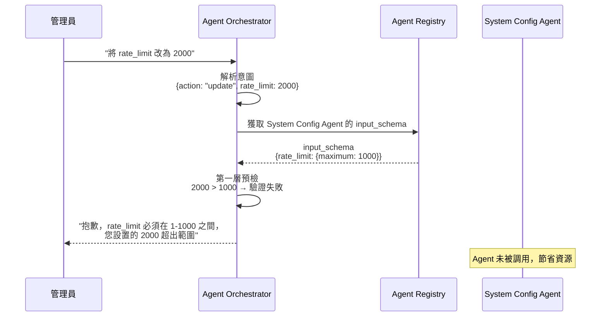

# Agent 註冊規格書

**版本**：2.0  
**創建日期**：2025-01-27  
**創建人**：Daniel Chung  
**最後修改日期**：2025-12-20

> **📋 相關文檔**：
>
> - [ConfigMetadata-配置元數據機制規格書.md](./Tools/ConfigMetadata-配置元數據機制規格書.md) - 配置元數據機制規格（**必讀**：了解 Schema 驗證機制）
> - [Orchestrator-協調層規格書.md](./Orchestrator-協調層規格書.md) - Orchestrator 協調層完整規格（**必讀**：了解前置檢查機制）
> - [AI-Box-Agent-架構規格書-v2.md](./AI-Box-Agent-架構規格書-v2.md) - Agent 架構總體設計

---

## 概述

✅ **前端 Agent 註冊頁面已提供以下功能**：

1. ✅ Secret ID/Key 輸入（身份驗證）
2. ✅ 端點配置（HTTP/MCP）
3. ⭐ **新增**：輸入 Schema 定義（前置檢查約束）

**核心價值**：通過在註冊時定義 `input_schema`，讓 Orchestrator 能夠在調用前攔截非法指令，實現「註冊即防護」。

---

## UI 位置和結構

### 標籤頁：端點配置（Endpoints Configuration）

當用戶選擇「外部 Agent」時，會在端點配置標籤頁的最上方顯示 Secret 驗證區塊。

### UI 層級結構

```
Agent 註冊 Modal
├── 基本資訊標籤頁
│   ├── Agent ID
│   ├── Agent 名稱
│   ├── Agent 類型
│   └── 描述
├── 端點配置標籤頁
│   ├── 內部 Agent 選項（勾選框）
│   └── 外部 Agent 配置區塊（取消勾選「內部 Agent」後顯示）
│       ├── Secret 驗證區塊 ⭐
│       │   ├── 標題：「外部 Agent 身份驗證」*
│       │   ├── 提示文字
│       │   ├── Secret ID 輸入框
│       │   ├── Secret Key 輸入框（密碼類型）
│       │   ├── 「驗證 Secret」按鈕
│       │   ├── 錯誤提示區域
│       │   └── 「還沒有 Secret ID？點擊這裡申請」鏈接
│       ├── 協議類型選擇（HTTP/MCP）
│       └── 端點 URL 輸入框
└── 執行約束標籤頁 ⭐ [新增]
    ├── 標題：「Agent 輸入 Schema 定義」
    ├── 提示文字：「請定義此 Agent 接受的參數範圍，Orchestrator 將據此執行前置攔截。」
    ├── JSON Schema 編輯器（Monaco Editor）
    ├── 「驗證 Schema 格式」按鈕
    └── Schema 驗證結果顯示區域
```

---

## Secret 輸入框詳細說明

### 1. Secret ID 輸入框

**位置**：端點配置標籤頁，Secret 驗證區塊內

**屬性**：

- **類型**：`text`（文本輸入框）
- **標籤**：`Secret ID（由 AI-Box 簽發）`
- **佔位符**：`例如：aibox-example-1234567890-abc123`
- **必填**：是（外部 Agent 必需）
- **禁用條件**：提交中或正在驗證 Secret

**代碼位置**：`ai-bot/src/components/AgentRegistrationModal.tsx` 第 525-536 行

### 2. Secret Key 輸入框

**位置**：端點配置標籤頁，Secret 驗證區塊內

**屬性**：

- **類型**：`password`（密碼輸入框，隱藏輸入）
- **標籤**：`Secret Key（由 AI-Box 簽發）`
- **佔位符**：`輸入 Secret Key`
- **必填**：是（外部 Agent 必需）
- **禁用條件**：提交中或正在驗證 Secret

**代碼位置**：`ai-bot/src/components/AgentRegistrationModal.tsx` 第 542-553 行

### 3. 驗證按鈕

**位置**：Secret Key 輸入框下方

**功能**：

- 調用 `verifySecret` API 驗證 Secret ID/Key
- 驗證中顯示載入狀態
- 驗證成功後顯示綠色成功提示
- 驗證失敗顯示錯誤信息

**代碼位置**：`ai-bot/src/components/AgentRegistrationModal.tsx` 第 561-577 行

---

## 完整 UI 流程

### 步驟 1：打開註冊頁面

用戶點擊「管理」按鈕，打開 Agent 註冊 Modal。

### 步驟 2：填寫基本資訊

在「基本資訊」標籤頁填寫 Agent 信息。

### 步驟 3：切換到端點配置

點擊「端點配置」標籤頁。

### 步驟 4：選擇外部 Agent

取消勾選「內部 Agent（運行在同一系統中）」。

### 步驟 5：輸入 Secret（新增的區塊）

立即顯示 Secret 驗證區塊：

```
┌─────────────────────────────────────────┐
│ 外部 Agent 身份驗證 *                   │
├─────────────────────────────────────────┤
│ ℹ️ 請使用由 AI-Box 簽發的 Secret...     │
│                                         │
│ Secret ID（由 AI-Box 簽發）            │
│ ┌─────────────────────────────────┐   │
│ │                                 │   │
│ └─────────────────────────────────┘   │
│                                         │
│ Secret Key（由 AI-Box 簽發）           │
│ ┌─────────────────────────────────┐   │
│ │ ••••••••••••••••••••••••••••••  │   │
│ └─────────────────────────────────┘   │
│                                         │
│ [ 驗證 Secret ]                        │
│                                         │
│ ℹ️ 還沒有 Secret ID？[點擊這裡申請]    │
└─────────────────────────────────────────┘
```

### 步驟 6：驗證 Secret

1. 輸入 Secret ID
2. 輸入 Secret Key（隱藏顯示）
3. 點擊「驗證 Secret」按鈕
4. 等待驗證結果

### 步驟 7：驗證成功

顯示綠色成功提示框：

```
┌─────────────────────────────────────────┐
│ ✅ Secret 驗證成功                      │
│ Secret ID: aibox-test-...              │
└─────────────────────────────────────────┘
```

### 步驟 8：繼續配置

驗證成功後，繼續配置協議類型和端點 URL。

### 步驟 9：定義前置檢查約束（Pre-check Constraints）⭐ **新增**

**目的**：為了確保 Orchestrator 能在調用前攔截非法指令，註冊時需提供該 Agent 的 `input_schema`。

**操作流程**：

1. 點擊「執行約束」標籤頁
2. 在 JSON Schema 編輯器中輸入 Schema 定義
3. 點擊「驗證 Schema 格式」按鈕
4. 驗證通過後，Schema 將與 Agent 一起註冊

**UI 界面**：

```
┌─────────────────────────────────────────┐
│ Agent 輸入 Schema 定義                   │
├─────────────────────────────────────────┤
│ ℹ️ 請定義此 Agent 接受的參數範圍，       │
│    Orchestrator 將據此執行前置攔截。    │
│                                         │
│ ┌───────────────────────────────────┐ │
│ │ {                                 │ │
│ │   "type": "object",               │ │
│ │   "properties": {                 │ │
│ │     "level": {                    │ │
│ │       "enum": ["system",          │ │
│ │                 "tenant",          │ │
│ │                 "user"]           │ │
│ │     },                            │ │
│ │     "rate_limit": {               │ │
│ │       "type": "integer",          │ │
│ │       "minimum": 1,               │ │
│ │       "maximum": 1000             │ │
│ │     }                             │ │
│ │   },                              │ │
│ │   "required": ["action", "level"] │ │
│ │ }                                 │ │
│ └───────────────────────────────────┘ │
│                                         │
│ [ 驗證 Schema 格式 ]                   │
│                                         │
│ ✅ Schema 格式驗證通過                │
└─────────────────────────────────────────┘
```

**配置項目說明**：

1. **Schema 類型**：採用標準 JSON Schema 格式
2. **硬性約束定義**：
   - `minimum` / `maximum`：限制數值範圍（如 API 限流 1-1000）
   - `enum`：限制固定選項（如模型清單、配置級別）
   - `required`：定義哪些參數是執行任務必備的「槽位 (Slots)」

**範例 Schema（System Config Agent 用）**：

```json
{
  "type": "object",
  "properties": {
    "scope": {
      "type": "string",
      "description": "配置範圍（如 genai.policy, llm.provider_config）"
    },
    "level": {
      "enum": ["system", "tenant", "user"],
      "description": "配置層級"
    },
    "action": {
      "enum": ["query", "create", "update", "delete", "list"],
      "description": "操作類型"
    },
    "rate_limit": {
      "type": "integer",
      "minimum": 1,
      "maximum": 1000,
      "description": "每分鐘請求數限制"
    },
    "allowed_models": {
      "type": "array",
      "items": {
        "type": "string",
        "enum": ["gpt-4o", "gpt-3.5-turbo", "claude-3-5-sonnet", "gemini-1.5-pro"]
      },
      "description": "允許使用的模型清單"
    }
  },
  "required": ["action", "level", "scope"]
}
```

**驗證功能**：

- ✅ JSON 格式驗證：確保 Schema 是有效的 JSON
- ✅ JSON Schema 規範驗證：確保符合 JSON Schema 標準
- ✅ 語法高亮：使用 Monaco Editor 提供代碼編輯體驗
- ✅ 實時驗證：輸入時自動檢查格式

---

## 代碼實現位置

### 組件文件

- **文件**：`ai-bot/src/components/AgentRegistrationModal.tsx`
- **標籤頁**：
  - `activeTab === 'endpoints'`：端點配置標籤頁
  - `activeTab === 'constraints'`：執行約束標籤頁 ⭐ **新增**

### Secret 輸入框

- **Secret ID**：第 525-536 行
- **Secret Key**：第 542-553 行
- **驗證按鈕**：第 561-577 行
- **驗證函數**：第 118-148 行（`handleVerifySecret`）

### Schema 輸入框 ⭐ **新增**

- **JSON Schema 編輯器**：使用 Monaco Editor
- **驗證按鈕**：調用 `validateSchema` 函數
- **驗證函數**：`handleValidateSchema()`

### 狀態管理

**Secret 相關**：
- `secretId`：Secret ID 輸入值
- `secretKey`：Secret Key 輸入值
- `secretVerified`：驗證狀態
- `isVerifyingSecret`：正在驗證標誌
- `secretVerificationError`：驗證錯誤信息

**Schema 相關** ⭐ **新增**：
- `inputSchema`：JSON Schema 字符串
- `schemaValidated`：Schema 驗證狀態
- `isValidatingSchema`：正在驗證標誌
- `schemaValidationError`：驗證錯誤信息

---

## 測試用 Secret

可以使用以下測試用 Secret 進行驗證：

**Secret ID**: `aibox-test-1764743150-1fc4e7ed`
**Secret Key**: `JpPMAnB655E9rW50sKW4PaGVciRP4vpvUEzRnJ6i9y0`

（需要先在 `.env` 文件中配置 `AGENT_SECRET_ID` 和 `AGENT_SECRET_KEY`）

---

## 架構邏輯說明

### 💡 前置檢查退回機制說明

#### 1. 註冊即防護

當此 Agent 註冊成功後，其 `input_schema` 會同步存入 ArangoDB 的 `AgentRegistry`。

**存儲位置**：
- Collection：`agent_registry`
- 字段：`metadata.capabilities.input_schema`

**數據結構**：
```json
{
  "agent_id": "system_config_agent",
  "metadata": {
    "capabilities": {
      "input_schema": {
        "type": "object",
        "properties": {
          "level": { "enum": ["system", "tenant", "user"] },
          "rate_limit": { "type": "integer", "minimum": 1, "maximum": 1000 }
        },
        "required": ["action", "level"]
      }
    }
  }
}
```

#### 2. Orchestrator 攔截

Orchestrator 在解析用戶意圖後，會先與此 Schema 比對。若管理員要求的數值與此硬性約束衝突，Orchestrator 將直接退回指令，不調用專屬服務 Agent，以節省資源並確保安全。

**攔截流程**：



**詳細說明請參考**：
- [ConfigMetadata-配置元數據機制規格書.md](./Tools/ConfigMetadata-配置元數據機制規格書.md) - 了解雙層驗證機制
- [Orchestrator-協調層規格書.md](./Orchestrator-協調層規格書.md) - 了解前置檢查實現

#### 3. 優勢說明

**解決 Agent 負擔問題**：
- ✅ 若未來 Agent 數量增加，Orchestrator 只要讀取這份註冊時填好的 Schema 就能做「通用驗證」
- ✅ 不需要為每個新 Agent 寫死代碼
- ✅ Orchestrator 只是一個「Schema 驗證引擎」，極致簡單

**明確前置條件**：
- ✅ 這份文件從單純的「身份驗證 (Secret)」升級到了「行為定義 (Schema)」
- ✅ Agent 在註冊時就明確聲明自己的硬性限制
- ✅ 管理員和開發者都能清楚了解 Agent 的約束條件

**UI 完備性**：
- ✅ 讓前端開發者知道除了 ID/Key 之外，還需要提供一個 JSON 編輯區域
- ✅ 供進階 Agent 開發者定義約束
- ✅ 提供 Monaco Editor 提供專業的代碼編輯體驗

---

## 總結

✅ **前端已完整實現 Agent 註冊功能**：

### 已實現功能

1. ✅ **身份驗證**：
   - 在「端點配置」標籤頁提供 Secret 輸入區塊
   - Secret ID 文本輸入框
   - Secret Key 密碼輸入框（隱藏顯示）
   - 驗證按鈕和狀態顯示
   - 錯誤提示和成功提示
   - 驗證通過後才能繼續註冊

2. ⭐ **前置檢查約束（新增）**：
   - 在「執行約束」標籤頁提供 JSON Schema 編輯器
   - Schema 格式驗證功能
   - 實時語法高亮和錯誤提示
   - Schema 驗證通過後與 Agent 一起註冊

### 功能位置

- **Secret 驗證**：端點配置標籤頁 → 外部 Agent 配置區塊 → Secret 驗證區塊
- **Schema 定義**：執行約束標籤頁 → JSON Schema 編輯器

### 核心價值

**「註冊即防護」**：通過在註冊時定義 `input_schema`，讓 Orchestrator 能夠在調用前攔截非法指令，實現：
- ✅ 節省資源：不需要調用 Agent 就能發現錯誤
- ✅ 確保安全：硬性約束防止 AI 設置非法值
- ✅ 高擴展性：未來新增 Agent 只需提供 Schema，無需修改 Orchestrator 代碼

---

**文檔版本**：2.0  
**最後更新**：2025-12-20  
**維護者**：Daniel Chung
