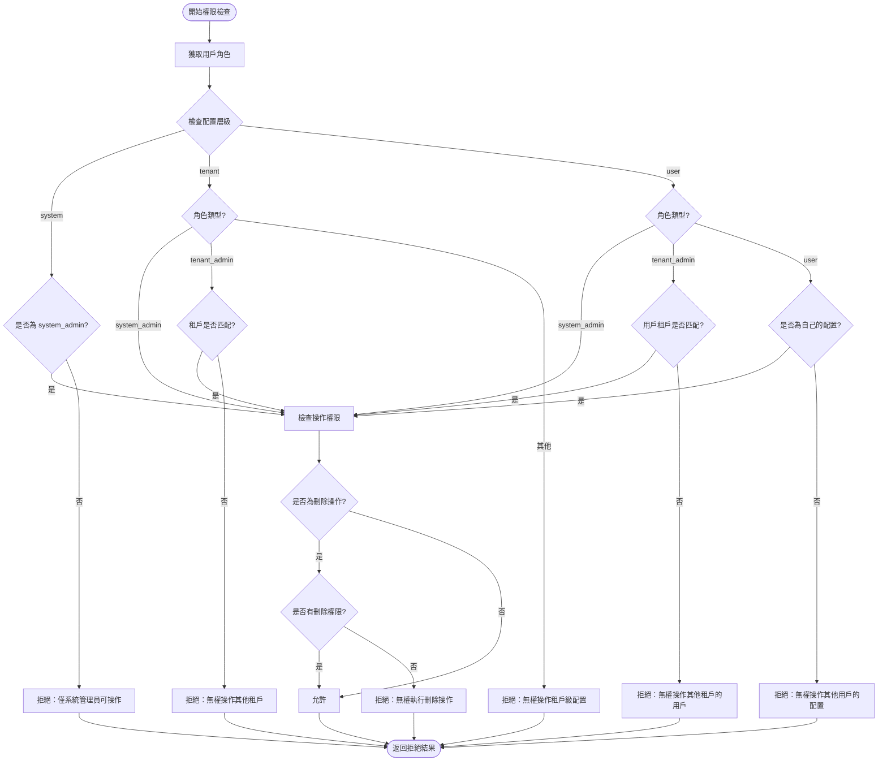
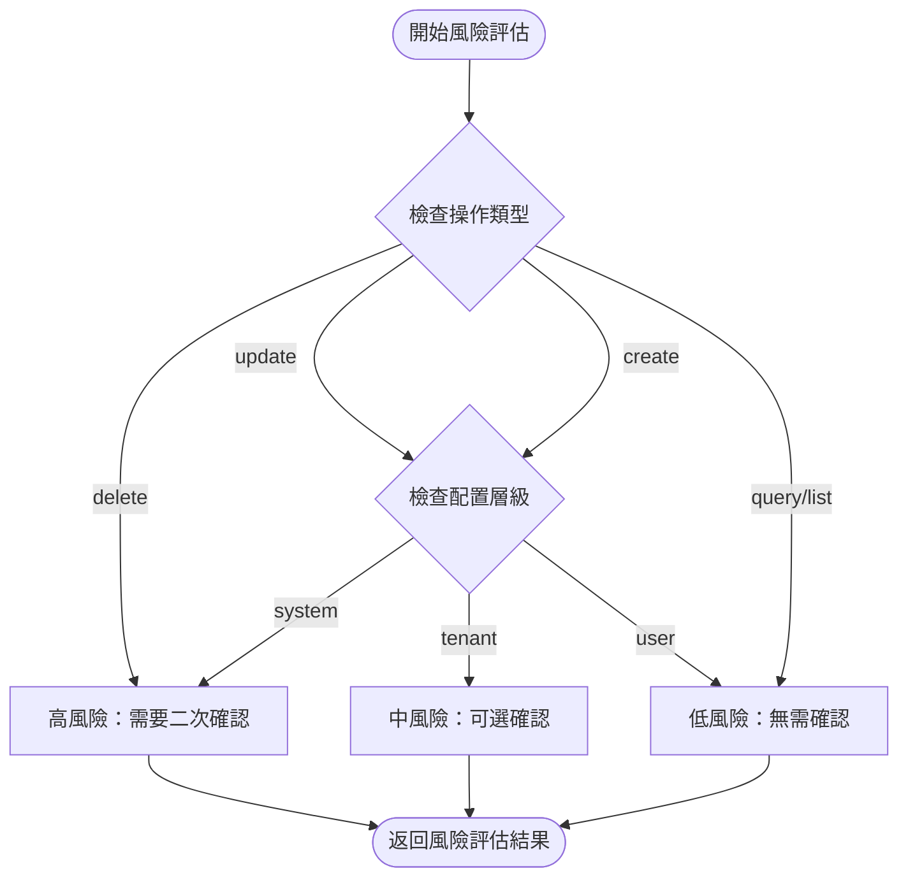
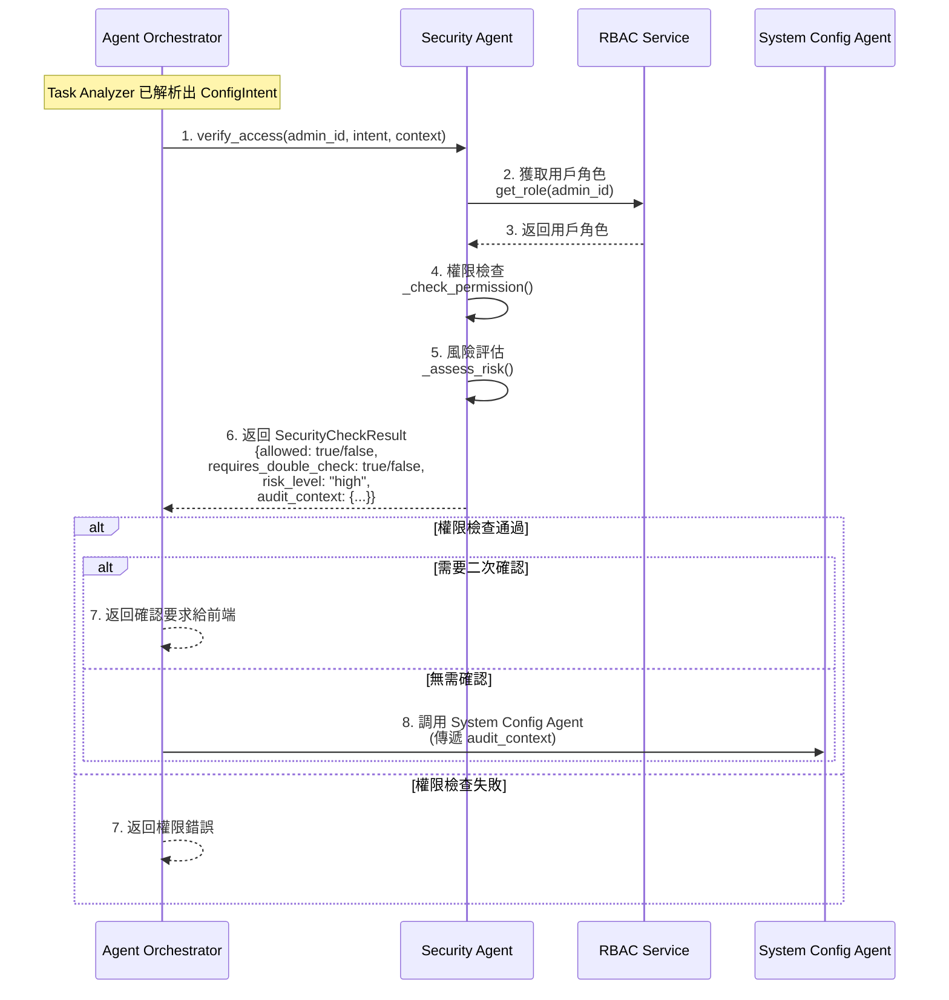

# Security Agent 規格書

**版本**：1.0  
**創建日期**：2025-12-20  
**創建人**：Daniel Chung  
**最後修改日期**：2025-12-20

> **📋 相關文檔**：
>
> - [AI-Box-Agent-架構規格書-v2.md](./AI-Box-Agent-架構規格書-v2.md) - Agent 架構總體設計
> - [Orchestrator-協調層規格書.md](./Orchestrator-協調層規格書.md) - Orchestrator 協調層完整規格（**必讀**：了解調用流程）
> - [System-Config-Agent-規格書.md](./System-Config-Agent-規格書.md) - System Config Agent 詳細規格
> - [LogService-規格書.md](./Tools/LogService-規格書.md) - LogService 統一日誌服務規格（**必讀**：了解日誌記錄機制）

---

## 目錄

1. [概述](#1-概述)
2. [設計理念](#2-設計理念)
3. [核心職責](#3-核心職責)
4. [接口設計](#4-接口設計)
5. [權限檢查邏輯](#5-權限檢查邏輯)
6. [風險評估](#6-風險評估)
7. [與 Orchestrator 的協作](#7-與-orchestrator-的協作)
8. [與 System Config Agent 的協作](#8-與-system-config-agent-的協作)
9. [實現計劃](#9-實現計劃)

---

## 1. 概述

### 1.1 定位

**Security Agent（安全代理）**是 AI-Box Agent 系統的**權限與安全守門員**，位於專屬服務層（第二層），負責：

- **權限驗證**：檢查「這件事誰能做」
- **風險評估**：判斷「這件事危不危險」
- **安全審計**：記錄安全相關的操作日誌
- **合規檢查**：驗證操作是否符合安全策略

### 1.2 設計目標

為了實現「**簡單系統**」的追求，Security Agent 的接口設計必須**極致標準化**，確保：

1. **Orchestrator 無需複雜判斷**：只需按照「檢查 -> 驗證 -> 執行」的流水線作業
2. **職責清晰分離**：Security Agent 只管「誰」和「危不危險」，不管「對不對」和「做不做」
3. **自動化審計**：開發者不需要在每個 API 寫日誌，Agent 在執行生命週期中會自動觸發審計

### 1.3 架構位置

```
┌─────────────────────────────────────────────────────────┐
│  第一層：協調層（Agent Orchestrator）                    │
│  - 調用 Security Agent 進行權限檢查                      │
└─────────────────────────────────────────────────────────┘
                        ↓ 標準化接口調用
┌─────────────────────────────────────────────────────────┐
│  第二層：專屬服務層（Security Agent）                    │
│  - 權限驗證與風險評估                                     │
└─────────────────────────────────────────────────────────┘
                        ↓ 權限驗證通過
┌─────────────────────────────────────────────────────────┐
│  第二層：專屬服務層（System Config Agent）               │
│  - 配置執行與合規檢查                                     │
└─────────────────────────────────────────────────────────┘
```

---

## 2. 設計理念

### 2.1 核心原則

**「這件事誰能做」以及「這件事危不危險」**

Security Agent 專注於：
- ✅ **權限驗證**：誰有權限執行此操作
- ✅ **風險評估**：此操作是否危險，是否需要二次確認
- ✅ **審計上下文**：為後續審計日誌提供安全上下文

Security Agent **不負責**：
- ❌ **業務邏輯驗證**：配置值是否正確（由 System Config Agent 負責）
- ❌ **合規性檢查**：配置是否符合收斂規則（由 System Config Agent 負責）
- ❌ **數據庫操作**：實際的配置 CRUD 操作（由 System Config Agent 負責）

### 2.2 標準化接口設計

為了實現「簡單系統」，Security Agent 的接口必須：

1. **輸入標準化**：接收統一的 `ConfigIntent` 和用戶信息
2. **輸出標準化**：返回統一的 `SecurityCheckResult`
3. **無狀態設計**：每次調用都是獨立的，不依賴會話狀態
4. **快速響應**：權限檢查必須快速，不應成為性能瓶頸

---

## 3. 核心職責

### 3.1 權限驗證（Access Verification）

**職責**：檢查用戶是否有權限執行特定操作

**檢查維度**：
1. **角色權限**：用戶角色是否允許此操作
2. **層級權限**：用戶是否有權限操作此層級的配置
3. **租戶隔離**：租戶管理員只能操作自己的租戶
4. **操作權限**：某些操作需要特殊權限

### 3.2 風險評估（Risk Assessment）

**職責**：評估操作的危險程度，決定是否需要二次確認

**風險級別**：
- **高風險**：系統級配置更新、配置刪除 → 需要二次確認
- **中風險**：租戶級配置更新、批量操作 → 可選確認
- **低風險**：配置查詢、只讀操作 → 無需確認

### 3.3 審計上下文（Audit Context）

**職責**：為審計日誌提供安全相關的上下文信息

**包含信息**：
- 用戶角色
- IP 地址
- 操作時間
- 風險級別
- 權限檢查結果

---

## 4. 接口設計

### 4.1 核心接口

```python
from typing import Dict, Optional, Any
from pydantic import BaseModel

class SecurityCheckRequest(BaseModel):
    """安全檢查請求"""
    admin_id: str  # 管理員用戶 ID
    intent: Dict[str, Any]  # ConfigIntent（由 Orchestrator 傳遞）
    context: Optional[Dict[str, Any]] = None  # 額外上下文（IP、User Agent 等）

class SecurityCheckResult(BaseModel):
    """安全檢查結果"""
    allowed: bool  # 是否允許執行
    reason: Optional[str] = None  # 如果不允許，說明原因
    requires_double_check: bool = False  # 是否需要二次確認
    risk_level: str = "low"  # 風險級別：low/medium/high
    audit_context: Dict[str, Any] = {}  # 審計上下文
```

### 4.2 Security Agent 實現

```python
class SecurityAgent(AgentServiceProtocol):
    """負責權限驗證與操作風險評估"""
    
    def __init__(self):
        self._rbac_service = get_rbac_service()
        self._audit_service = get_audit_log_service()
        self._log_service = get_log_service()  # ⭐ 集成 LogService（詳見 LogService 規格書）
    
    async def verify_access(
        self, 
        admin_id: str, 
        intent: Dict[str, Any],
        context: Optional[Dict[str, Any]] = None
    ) -> SecurityCheckResult:
        """
        驗證用戶權限並評估操作風險
        
        Args:
            admin_id: 管理員用戶 ID
            intent: ConfigIntent（包含 action、level、scope 等）
            context: 額外上下文（IP、User Agent、trace_id 等）
        
        Returns:
            SecurityCheckResult: 安全檢查結果
        """
        """
        驗證用戶權限並評估操作風險
        
        Args:
            admin_id: 管理員用戶 ID
            intent: ConfigIntent（包含 action、level、scope 等）
            context: 額外上下文（IP、User Agent 等）
        
        Returns:
            SecurityCheckResult: 安全檢查結果
        """
        # 1. 獲取用戶角色
        user_role = await self._rbac_service.get_role(admin_id)
        
        # 2. 權限檢查
        permission_check = await self._check_permission(admin_id, intent, user_role)
        if not permission_check.allowed:
            return SecurityCheckResult(
                allowed=False,
                reason=permission_check.reason,
                audit_context={
                    "admin_id": admin_id,
                    "admin_role": user_role,
                    "intent": intent,
                    "ip": context.get("ip") if context else None,
                    "user_agent": context.get("user_agent") if context else None
                }
            )
        
        # 3. 風險評估
        risk_assessment = await self._assess_risk(intent, user_role)
        
        # 4. 構建審計上下文
        audit_context = {
            "admin_id": admin_id,
            "admin_role": user_role,
            "intent": intent,
            "risk_level": risk_assessment.risk_level,
            "ip": context.get("ip") if context else None,
            "user_agent": context.get("user_agent") if context else None,
            "timestamp": datetime.utcnow().isoformat()
        }
        
        # 5. 記錄安全日誌（使用 LogService）
        trace_id = context.get("trace_id") if context else None
        if trace_id:
            await self._log_service.log_security(
                trace_id=trace_id,
                actor=admin_id,
                action="check_permission",
                content={
                    "intent": intent,
                    "permission_check": {
                        "allowed": permission_check.allowed,
                        "user_role": user_role,
                        "reason": permission_check.reason
                    },
                    "risk_assessment": {
                        "risk_level": risk_assessment.risk_level,
                        "requires_double_check": risk_assessment.requires_double_check
                    },
                    "audit_context": audit_context
                }
            )
            
            # 如果被攔截，記錄攔截日誌
            if not permission_check.allowed:
                await self._log_service.log_security(
                    trace_id=trace_id,
                    actor=admin_id,
                    action="access_denied",
                    content={
                        "intent": intent,
                        "reason": permission_check.reason,
                        "blocked": True,
                        "user_role": user_role
                    }
                )
        
        return SecurityCheckResult(
            allowed=True,
            requires_double_check=risk_assessment.requires_double_check,
            risk_level=risk_assessment.risk_level,
            audit_context=audit_context
        )
    
    async def _check_permission(
        self,
        admin_id: str,
        intent: Dict[str, Any],
        user_role: str
    ) -> PermissionCheckResult:
        """
        檢查用戶權限
        
        Returns:
            PermissionCheckResult: 權限檢查結果
        """
        action = intent.get("action")
        level = intent.get("level")
        tenant_id = intent.get("tenant_id")
        
        # 1. 系統級配置：只有 system_admin 可以操作
        if level == "system":
            if user_role != "system_admin":
                return PermissionCheckResult(
                    allowed=False,
                    reason="Security Error: 權限不足，僅系統管理員可修改全域配置"
                )
        
        # 2. 租戶級配置：tenant_admin 只能操作自己的租戶
        elif level == "tenant":
            if user_role == "tenant_admin":
                # 獲取用戶所屬租戶
                user_tenant = await self._rbac_service.get_user_tenant(admin_id)
                if tenant_id != user_tenant:
                    return PermissionCheckResult(
                        allowed=False,
                        reason=f"Security Error: 無權操作其他租戶的配置（您的租戶：{user_tenant}）"
                    )
            elif user_role != "system_admin":
                return PermissionCheckResult(
                    allowed=False,
                    reason="Security Error: 無權操作租戶級配置"
                )
        
        # 3. 用戶級配置：檢查用戶是否有權限操作目標用戶
        elif level == "user":
            if user_role == "tenant_admin":
                # 租戶管理員可以操作自己租戶下的用戶
                user_tenant = await self._rbac_service.get_user_tenant(admin_id)
                target_user_tenant = await self._rbac_service.get_user_tenant(intent.get("user_id"))
                if user_tenant != target_user_tenant:
                    return PermissionCheckResult(
                        allowed=False,
                        reason="Security Error: 無權操作其他租戶的用戶配置"
                    )
            elif user_role not in ["system_admin", "user"]:
                return PermissionCheckResult(
                    allowed=False,
                    reason="Security Error: 無權操作用戶級配置"
                )
        
        # 4. 操作級別權限檢查
        if action == "delete" and user_role not in ["system_admin", "tenant_admin"]:
            return PermissionCheckResult(
                allowed=False,
                reason="Security Error: 無權執行刪除操作"
            )
        
        return PermissionCheckResult(allowed=True)
    
    async def _assess_risk(
        self,
        intent: Dict[str, Any],
        user_role: str
    ) -> RiskAssessmentResult:
        """
        評估操作風險
        
        Returns:
            RiskAssessmentResult: 風險評估結果
        """
        action = intent.get("action")
        level = intent.get("level")
        
        # 高風險操作：需要二次確認
        is_high_risk = (
            (action in ["delete", "update"] and level == "system") or
            action == "delete"
        )
        
        # 中風險操作：可選確認
        is_medium_risk = (
            action == "update" and level == "tenant" or
            action == "create"
        )
        
        if is_high_risk:
            return RiskAssessmentResult(
                risk_level="high",
                requires_double_check=True
            )
        elif is_medium_risk:
            return RiskAssessmentResult(
                risk_level="medium",
                requires_double_check=False  # 可選，由 Orchestrator 決定
            )
        else:
            return RiskAssessmentResult(
                risk_level="low",
                requires_double_check=False
            )
```

### 4.3 數據模型

```python
class PermissionCheckResult(BaseModel):
    """權限檢查結果"""
    allowed: bool
    reason: Optional[str] = None

class RiskAssessmentResult(BaseModel):
    """風險評估結果"""
    risk_level: str  # low/medium/high
    requires_double_check: bool
```

---

## 5. 權限檢查邏輯

### 5.1 角色定義

| 角色 | 權限範圍 | 說明 |
|------|---------|------|
| `system_admin` | 所有配置操作 | 系統管理員，可操作所有層級的配置 |
| `tenant_admin` | 租戶級和用戶級配置 | 租戶管理員，只能操作自己租戶的配置 |
| `config_viewer` | 只讀查詢 | 配置查看者，只能查詢配置，不能修改 |
| `user` | 用戶級配置 | 普通用戶，只能操作自己的配置 |

### 5.2 層級權限矩陣

| 操作層級 | system_admin | tenant_admin | config_viewer | user |
|---------|-------------|--------------|---------------|------|
| **system** | ✅ 所有操作 | ❌ 無權限 | ✅ 只讀查詢 | ❌ 無權限 |
| **tenant** | ✅ 所有操作 | ✅ 自己租戶 | ✅ 只讀查詢 | ❌ 無權限 |
| **user** | ✅ 所有操作 | ✅ 自己租戶的用戶 | ✅ 只讀查詢 | ✅ 自己的配置 |

### 5.3 操作權限矩陣

| 操作類型 | system_admin | tenant_admin | config_viewer | user |
|---------|-------------|--------------|---------------|------|
| **query** | ✅ | ✅ | ✅ | ✅ |
| **list** | ✅ | ✅ | ✅ | ✅ |
| **create** | ✅ | ✅（租戶級） | ❌ | ✅（用戶級） |
| **update** | ✅ | ✅（租戶級） | ❌ | ✅（用戶級） |
| **delete** | ✅ | ✅（租戶級） | ❌ | ✅（用戶級） |
| **rollback** | ✅ | ✅（租戶級） | ❌ | ❌ |

### 5.4 權限檢查流程



---

## 6. 風險評估

### 6.1 風險級別定義

| 風險級別 | 觸發條件 | 二次確認要求 | 說明 |
|---------|---------|------------|------|
| **high** | 系統級配置更新、配置刪除 | ✅ 必須 | 可能影響整個系統或所有租戶 |
| **medium** | 租戶級配置更新、批量操作 | ⚠️ 可選 | 可能影響特定租戶或大量用戶 |
| **low** | 配置查詢、只讀操作 | ❌ 無需 | 不會修改系統狀態 |

### 6.2 風險評估規則

```python
def assess_risk(action: str, level: str) -> RiskLevel:
    """評估操作風險"""
    # 高風險：系統級刪除或更新
    if (action in ["delete", "update"] and level == "system") or action == "delete":
        return RiskLevel.HIGH
    
    # 中風險：租戶級更新或創建
    if action in ["update", "create"] and level == "tenant":
        return RiskLevel.MEDIUM
    
    # 低風險：查詢或列表
    return RiskLevel.LOW
```

### 6.3 風險評估流程



---

## 7. 與 Orchestrator 的協作

### 7.1 調用流程



### 7.2 Orchestrator 調用代碼

```python
# 在 Orchestrator 中的調用示例
async def process_natural_language_request(
    self,
    instruction: str,
    context: Optional[Dict[str, Any]] = None,
    user_id: Optional[str] = None,
    session_id: Optional[str] = None,
    specified_agent_id: Optional[str] = None
) -> TaskResult:
    """處理自然語言請求（完整流程）"""
    
    # 1. Task Analyzer 解析意圖
    analysis_result = await self._task_analyzer.analyze(...)
    
    # 2. Security Agent 權限檢查
    security_result = await self._security_agent.verify_access(
        admin_id=user_id,
        intent=analysis_result.intent,
        context={
            "ip": context.get("ip"),
            "user_agent": context.get("user_agent")
        }
    )
    
    if not security_result.allowed:
        return TaskResult(
            status="permission_denied",
            result={"error": security_result.reason}
        )
    
    # 3. 高風險操作需要二次確認
    if security_result.requires_double_check:
        return TaskResult(
            status="confirmation_required",
            result={
                "confirmation_message": self._generate_confirmation_message(
                    analysis_result.intent,
                    security_result.risk_level
                ),
                "audit_context": security_result.audit_context
            }
        )
    
    # 4. 調用 System Config Agent（傳遞 audit_context）
    config_result = await self._config_agent.execute_task(
        intent=analysis_result.intent,
        auth_context=security_result.audit_context  # ⭐ 傳遞審計上下文
    )
    
    # 5. 結果修飾
    formatted_result = await self._format_result(...)
    
    return TaskResult(
        task_id=task_id,
        status="completed",
        result=formatted_result
    )
```

### 7.3 接口標準化優勢

**「檢查 -> 驗證 -> 執行」流水線作業**：

1. **Orchestrator 無需複雜判斷**：
   - 只需調用 `verify_access()` 方法
   - 根據返回的 `allowed` 和 `requires_double_check` 決定下一步
   - 不需要了解具體的權限檢查邏輯

2. **職責清晰分離**：
   - Security Agent：負責「誰能做」和「危不危險」
   - System Config Agent：負責「對不對」和「做不做」
   - Orchestrator：負責協調和流程控制

3. **自動化審計**：
   - Security Agent 自動構建 `audit_context`
   - 傳遞給 System Config Agent，由 System Config Agent 記錄審計日誌
   - 開發者不需要在每個 API 手動寫日誌

---

## 8. 與 System Config Agent 的協作

### 8.1 數據流銜接

**Security Agent → System Config Agent**：

```
Orchestrator 調用 Security Agent
    ↓
Security Agent 返回 SecurityCheckResult
    ├── allowed: true
    ├── audit_context: {...}  ⭐ 關鍵：審計上下文
    └── risk_level: "high"
    ↓
Orchestrator 將 audit_context 傳遞給 System Config Agent
    ↓
System Config Agent 使用 audit_context 記錄審計日誌
```

### 8.2 System Config Agent 接收 audit_context

```python
# 在 System Config Agent 中的使用示例
class SystemConfigAgent(AgentServiceProtocol):
    """負責配置的合規檢查與 ArangoDB 交互"""
    
    async def execute_task(
        self,
        intent: ConfigIntent,
        auth_context: Dict[str, Any]  # ⭐ 由 Orchestrator 傳遞的 audit_context
    ) -> ConfigOperationResult:
        """
        執行配置任務
        
        Args:
            intent: 配置操作意圖
            auth_context: 安全上下文（包含 admin_id、admin_role、ip 等）
        """
        # 1. 合規性檢查（由 System Config Agent 負責）
        compliance = await compliance_service.validate(intent)
        if not compliance.is_valid:
            return ConfigOperationResult(
                success=False,
                message=f"Compliance Failure: {compliance.reason}"
            )
        
        # 2. 執行 ArangoDB 操作
        db_result = await config_store_service.update_config(...)
        
        # 3. 觸發審計日誌記錄（使用 auth_context）
        await audit_log_service.log(
            user_id=auth_context["admin_id"],  # ⭐ 使用 Security Agent 提供的上下文
            action=intent.action,
            resource_type="config",
            resource_id=intent.scope,
            ip_address=auth_context.get("ip"),
            user_agent=auth_context.get("user_agent"),
            details={
                "scope": intent.scope,
                "level": intent.level,
                "tenant_id": intent.tenant_id,
                "changes": db_result.changes,
                "risk_level": auth_context.get("risk_level"),  # ⭐ 風險級別
                "admin_role": auth_context.get("admin_role")  # ⭐ 用戶角色
            }
        )
        
        return ConfigOperationResult(
            success=True,
            message=f"已成功更新 {intent.scope} 設置",
            audit_log_id=audit_log_id
        )
```

### 8.3 協作優勢

**自動化審計**：

- ✅ Security Agent 構建完整的 `audit_context`
- ✅ Orchestrator 將 `audit_context` 傳遞給 System Config Agent
- ✅ System Config Agent 使用 `audit_context` 記錄審計日誌
- ✅ 開發者不需要在每個 API 手動寫日誌

**職責分離**：

- ✅ Security Agent：負責權限和風險，不涉及業務邏輯
- ✅ System Config Agent：負責業務邏輯和合規檢查，不涉及權限判斷
- ✅ 兩者通過標準化的 `audit_context` 無縫銜接

---

## 9. 實現計劃

### 9.1 第一階段：核心接口實現（1週）

**目標**：實現 Security Agent 的核心接口

**任務**：

1. ✅ 實現 `SecurityAgent` 類
   - 實現 `verify_access()` 方法
   - 實現 `_check_permission()` 方法
   - 實現 `_assess_risk()` 方法

2. ✅ 集成 RBAC Service
   - 實現 `get_role()` 方法調用
   - 實現 `get_user_tenant()` 方法調用

3. ✅ 實現數據模型
   - `SecurityCheckRequest`
   - `SecurityCheckResult`
   - `PermissionCheckResult`
   - `RiskAssessmentResult`

**優先級**：高（System Config Agent 的前置條件）

### 9.2 第二階段：權限檢查邏輯完善（1週）

**目標**：完善權限檢查邏輯

**任務**：

1. ✅ 實現層級權限檢查
   - 系統級權限檢查
   - 租戶級權限檢查
   - 用戶級權限檢查

2. ✅ 實現操作權限檢查
   - 刪除操作權限檢查
   - 更新操作權限檢查

3. ✅ 實現租戶隔離檢查
   - 租戶管理員只能操作自己的租戶
   - 用戶只能操作自己的配置

**優先級**：高

### 9.3 第三階段：風險評估完善（0.5週）

**目標**：完善風險評估邏輯

**任務**：

1. ✅ 實現風險級別評估
   - 高風險操作識別
   - 中風險操作識別
   - 低風險操作識別

2. ✅ 實現二次確認機制
   - 高風險操作標記
   - 確認消息生成

**優先級**：中

### 9.4 第四階段：與 Orchestrator 集成（0.5週）

**目標**：與 Orchestrator 無縫集成

**任務**：

1. ✅ 更新 Orchestrator 調用 Security Agent
   - 實現 `_check_permission()` 方法
   - 傳遞 `audit_context` 給 System Config Agent

2. ✅ 實現二次確認流程
   - 高風險操作確認機制
   - 確認消息生成

**優先級**：高

### 9.5 第五階段：測試與文檔（0.5週）

**目標**：完善測試和文檔

**任務**：

1. ✅ 編寫單元測試
2. ✅ 編寫集成測試
3. ✅ 文檔完善

**優先級**：中

---

## 10. 總結

### 10.1 核心優勢

1. **標準化接口**：極致標準化的接口設計，確保 Orchestrator 無需複雜判斷
2. **職責分離**：Security Agent 只管「誰」和「危不危險」，不管「對不對」和「做不做」
3. **自動化審計**：自動構建審計上下文，無需開發者手動寫日誌
4. **無縫銜接**：與 Orchestrator 和 System Config Agent 完美協作

### 10.2 技術亮點

- ✅ 標準化的權限檢查接口
- ✅ 智能的風險評估機制
- ✅ 自動化的審計上下文構建
- ✅ 清晰的職責分離設計

### 10.3 設計理念實現

**「簡單系統」的追求**：

- ✅ **複雜度被封裝在 Agent 的方法內**：權限檢查邏輯封裝在 Security Agent 內部
- ✅ **管理員只需輕鬆對話**：通過自然語言即可完成配置操作
- ✅ **極度嚴謹的內在**：內部的安全過濾、風險評估、審計追蹤確保系統安全

---

**文檔版本**：1.0  
**最後更新**：2025-12-20  
**維護者**：Daniel Chung

