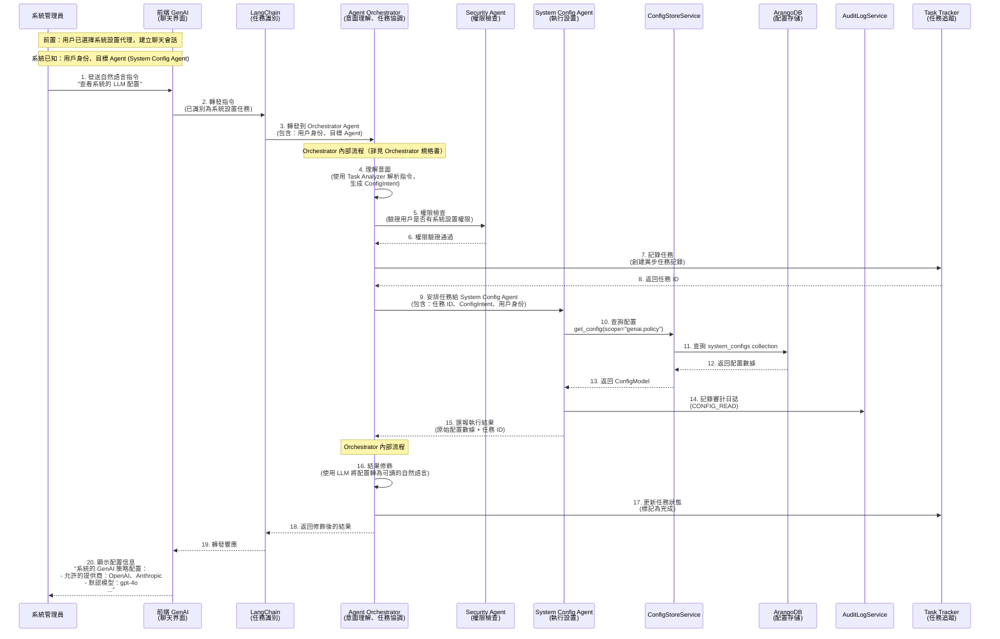
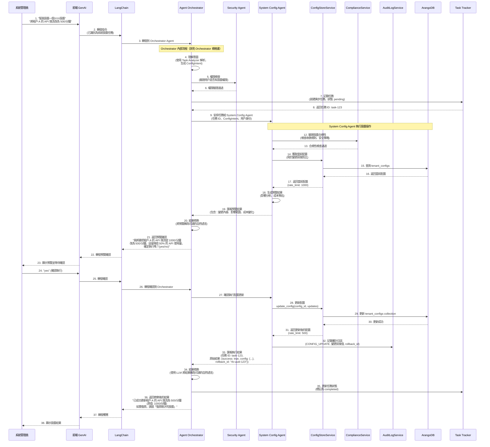
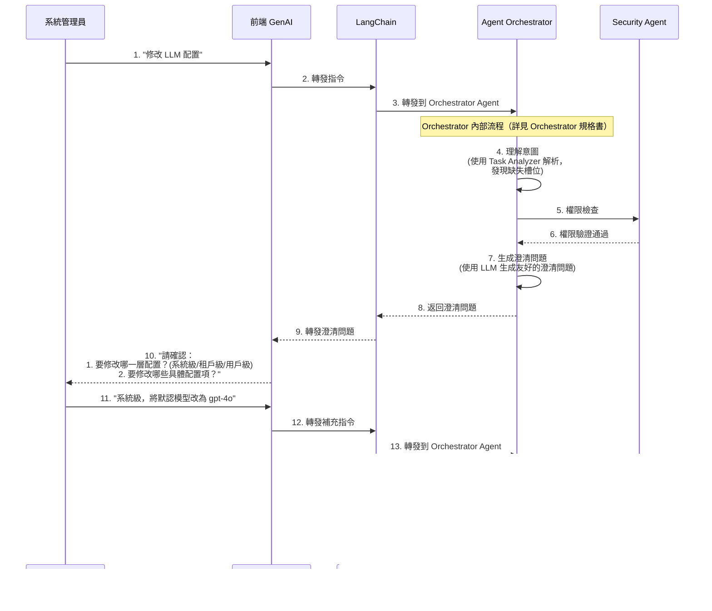

# 系統設置代理（System Config Agent）規格書

**版本**：1.0
**創建日期**：2025-12-20
**創建人**：Daniel Chung
**最後修改日期**：2025-12-20

> **📋 相關文檔**：
>
> - [AI-Box-Agent-架構規格書-v2.md](./AI-Box-Agent-架構規格書-v2.md) - Agent 架構總體設計
> - [Orchestrator-協調層規格書.md](./Orchestrator-協調層規格書.md) - Orchestrator 協調層完整規格（**必讀**：了解意圖解析流程）
> - [Security-Agent-規格書.md](./Security-Agent-規格書.md) - Security Agent 詳細規格（**必讀**：了解權限檢查與審計上下文）
> - [LogService-規格書.md](./Tools/LogService-規格書.md) - LogService 統一日誌服務規格（**必讀**：了解日誌記錄機制）
> - [ConfigMetadata-配置元數據機制規格書.md](./Tools/ConfigMetadata-配置元數據機制規格書.md) - 配置元數據機制規格（**必讀**：了解配置驗證機制）
> - [從AI-Agent-探討Ebot-生態（MCC-、MAC).md](./從AI-Agent-探討Ebot-生態（MCC-、MAC).md) - Ebot 生態架構

---

## 目錄

1. [需求描述](#1-需求描述)
2. [系統流程](#2-系統流程)
3. [功能設計](#3-功能設計)
4. [可操作的系統設計](#4-可操作的系統設計)
5. [安全管理與 AI 治理](#5-安全管理與-ai-治理)
6. [實現計劃](#6-實現計劃)

---

## 1. 需求描述

### 1.1 背景

隨著系統複雜度增加，傳統的系統管理界面和手動設置操作變得繁瑣且易出錯。管理員需要：

- 記憶大量配置項的位置和格式
- 理解複雜的配置層級關係（系統級/租戶級/用戶級）
- 手動驗證配置的正確性和合規性
- 追蹤配置變更歷史和影響範圍

### 1.2 目標

開發「系統設置代理（System Config Agent）」，使系統管理員能夠：

1. **通過自然語言交互**：使用 AI 聊天方式進行系統設置，無需記憶複雜的配置路徑
2. **智能查詢與設置**：直接詢問配置狀態或發出設置指令，代理自動理解並執行
3. **統一配置管理**：所有配置存儲在 ArangoDB 中，支持系統級/租戶級/用戶級三層配置
4. **安全與合規**：符合 AI 治理要求，所有操作可審計、可追溯

### 1.3 核心價值

- ✅ **簡化操作**：從複雜的 UI 操作轉為自然語言對話
- ✅ **降低錯誤**：通過 LLM 理解意圖，減少配置錯誤
- ✅ **提升效率**：快速查詢和批量設置，無需多步驟操作
- ✅ **合規保障**：自動記錄審計日誌，符合 AI 治理要求

---

## 2. 系統流程

### 2.1 整體交互流程（配置查詢）



### 2.2 配置設置流程（完整流程）



### 2.3 配置澄清流程（指令不明確時）



### 2.4 流程說明

#### 2.4.1 Orchestrator Agent 的核心職責

**重要**：Orchestrator Agent 不是簡單的轉發器，而是系統的**智能協調中心**。

**詳細職責說明請參考**：[Orchestrator-協調層規格書.md](./Orchestrator-協調層規格書.md)

**核心職責摘要**：

1. **意圖理解與分析**
   - 接收來自 LangChain 的指令
   - 使用 Task Analyzer 解析自然語言意圖（生成 `ConfigIntent`）
   - 提取槽位信息（scope、level、config_data 等）
   - 判斷指令是否清楚，是否需要澄清

2. **權限與安全檢查**
   - 調用 Security Agent 驗證用戶權限
   - 確保只有授權的管理員可以執行配置操作
   - 記錄安全審計信息

3. **任務安排與追蹤**
   - 創建異步任務記錄（通過 Task Tracker）
   - 將任務分配給 System Config Agent
   - 追蹤任務執行狀態
   - 支持任務狀態查詢（用戶可以離開後再回來查看）

4. **結果聚合與修飾**
   - 接收 System Config Agent 的原始執行結果
   - 使用 LLM 將技術性的配置數據轉換為友好的自然語言描述
   - 格式化響應，提供清晰的設置結果說明

#### 2.4.2 為什麼需要 Orchestrator？

**分離關注點**：

- **Orchestrator**：負責協調、理解、安全、追蹤
- **System Config Agent**：專注於配置的實際操作（CRUD）

**統一入口**：

- 所有 Agent 調用都通過 Orchestrator，便於：
  - 統一的安全檢查
  - 統一的審計追蹤
  - 統一的錯誤處理
  - 統一的結果格式化

**異步支持**：

- Orchestrator 負責任務追蹤，支持：
  - 長時間運行的配置操作
  - 用戶可以離開後再回來查看狀態
  - 任務狀態查詢 API

#### 2.4.3 流程中的關鍵節點

1. **前置條件**：
   - 用戶已選擇系統設置代理，建立聊天會話
   - 系統已知：用戶身份、目標 Agent（System Config Agent）
   - LangChain 已識別任務類型為「系統設置」

2. **意圖理解階段**：
   - Orchestrator 使用 Task Analyzer 解析指令
   - 提取必要的槽位信息
   - 判斷是否需要澄清

3. **安全檢查階段**：
   - 調用 Security Agent 驗證權限
   - 確保操作合規性

4. **任務執行階段**：
   - 創建異步任務記錄
   - 分配任務給 System Config Agent
   - System Config Agent 執行實際的配置操作

5. **結果處理階段**：
   - System Config Agent 匯報原始結果
   - Orchestrator 修飾結果為可讀的自然語言
   - 更新任務狀態
   - 返回給前端 GenAI

---

## 3. 功能設計

### 3.1 核心功能模塊

#### 3.1.1 自然語言理解（NLU）⭐ **由 Orchestrator 完成**

**功能描述**：將管理員的自然語言指令轉換為結構化的配置操作

**重要**：此功能**不在 System Config Agent 中實現**，而是由 **Orchestrator 協調層**完成。

**詳細說明請參考**：[Orchestrator-協調層規格書.md](./Orchestrator-協調層規格書.md) 第 3.1 節「Task Analyzer」

**架構設計**：

```
管理員自然語言指令
    ↓
Orchestrator 接收指令
    ↓
Orchestrator 使用 Task Analyzer 解析意圖
    ├── 任務分類（識別為配置操作）
    ├── 槽位提取（scope、level、config_data）
    ├── 指令澄清檢查
    └── 生成結構化 ConfigIntent
    ↓
Orchestrator 將 ConfigIntent 傳遞給 System Config Agent
    ↓
System Config Agent 接收結構化意圖，執行配置操作
```

**輸入示例**（管理員輸入）：

- "查看系統的 LLM 配置"
- "將租戶 A 的 API 限流改為 500/分鐘"
- "為所有租戶啟用 Claude 3 Sonnet 模型"

**輸出結構**（Orchestrator 生成）：

```python
class ConfigIntent(BaseModel):
    """配置操作意圖（由 Orchestrator 通過 Task Analyzer 生成）"""
    action: Literal["query", "create", "update", "delete", "list", "rollback"]
    scope: str  # 配置範圍，如 "genai.policy", "genai.model_registry"
    level: Literal["system", "tenant", "user"]
    tenant_id: Optional[str] = None
    user_id: Optional[str] = None
    config_data: Optional[Dict[str, Any]] = None
    clarification_needed: bool = False
    clarification_question: Optional[str] = None
    missing_slots: List[str] = []
    original_instruction: str  # 保留原始指令
```

**System Config Agent 的職責**：

- ✅ 接收已解析的 `ConfigIntent`（由 Orchestrator 傳遞）
- ✅ 執行配置操作（CRUD）
- ❌ **不負責**自然語言解析（由 Orchestrator 完成）

#### 3.1.2 配置查詢功能

**支持的查詢類型**：

1. **單一配置查詢**
   - 查詢系統級配置：`get_config(scope, level="system")`
   - 查詢租戶級配置：`get_config(scope, tenant_id, level="tenant")`
   - 查詢用戶級配置：`get_config(scope, tenant_id, user_id, level="user")`

2. **有效配置查詢**（合併後）
   - `get_effective_config(scope, tenant_id, user_id=None)`
   - 自動合併 system → tenant → user 三層配置

3. **配置列表查詢**
   - 列出所有系統級配置
   - 列出某租戶的所有配置
   - 按 scope 模式查詢（如 `genai.*`）

**自然語言示例**：

- "查看系統的 GenAI 策略配置" → `get_config("genai.policy", level="system")`
- "查看租戶 A 的有效配置" → `get_effective_config("genai.policy", "tenant_a")`
- "列出所有 LLM 相關配置" → `list_configs(scope_pattern="genai.*")`

#### 3.1.3 配置設置功能

**支持的設置類型**：

1. **創建配置**
   - 創建新的配置項
   - 驗證配置格式和合規性

2. **更新配置**
   - 更新現有配置
   - 支持部分更新（只更新指定字段）
   - 驗證收斂規則（tenant 配置不能擴權）

3. **刪除配置**
   - 軟刪除（設置 `is_active=false`）
   - 硬刪除（物理刪除，需確認）

**自然語言示例**：

- "將系統默認模型設為 gpt-4o" → `update_config("genai.policy", {"default_model": "gpt-4o"}, level="system")`
- "為租戶 A 添加 Claude 3 Sonnet 到允許列表" → `update_config("genai.policy", {"allowed_models": {...}}, tenant_id="tenant_a")`

#### 3.1.4 配置驗證功能

**詳細說明請參考**：[ConfigMetadata-配置元數據機制規格書.md](./Tools/ConfigMetadata-配置元數據機制規格書.md)

**驗證規則**：

1. **第一層預檢（Orchestrator 層）** ⭐ **新增**
   - 格式與邊界驗證：型別是否正確？數值是否在 min/max 內？
   - 枚舉值檢查：選項是否在 options 列表中？
   - **目的**：快速止損，不需喚醒 Agent，節省 Token，秒級回傳錯誤

2. **第二層深檢（System Config Agent 層）**
   - **收斂規則驗證**（WBS-4.2.1）
     - Tenant 配置的 `allowed_providers` 必須是 System 配置的子集
     - Tenant 配置的 `allowed_models` 必須是 System 配置的子集
     - 防止租戶擴權
   - **業務規則驗證**
     - 模型可用性檢查
     - 限流值合理性檢查
     - 配置衝突檢測
   - **目的**：業務嚴謹，確保配置在複雜環境下依然合規

3. **配置元數據驗證** ⭐ **新增**
   - 基於 `config_definitions` Collection 的硬性約束
   - 確保 AI 無法設置非法值（如不存在的模型、超出範圍的數值）
   - **詳細說明請參考**：[ConfigMetadata-配置元數據機制規格書.md](./Tools/ConfigMetadata-配置元數據機制規格書.md)

#### 3.1.5 配置歷史查詢

**功能描述**：查詢配置變更歷史

**支持的查詢**：

- 查詢某配置項的變更歷史
- 查詢某時間範圍內的所有配置變更
- 查詢某管理員的所有操作記錄

**自然語言示例**：

- "查看 genai.policy 的變更歷史"
- "查看最近一週的配置變更"
- "查看我昨天修改的配置"

### 3.2 支持的配置範圍（Scope）

基於 ArangoDB 中現有的配置集合，System Config Agent 支持以下配置範圍：

#### 3.2.1 GenAI 相關配置

| Scope | 描述 | Collection | 示例配置項 |
|-------|------|------------|------------|
| `genai.policy` | GenAI 策略配置 | `system_configs` / `tenant_configs` | `allowed_providers`, `allowed_models`, `default_model`, `rate_limit` |
| `genai.model_registry` | 模型註冊表配置 | `system_configs` / `tenant_configs` | 模型列表、版本信息 |
| `genai.tenant_secrets` | 租戶 API Key（加密） | `genai_tenant_secrets` | 加密後的 API Key |

#### 3.2.2 LLM 相關配置

| Scope | 描述 | Collection | 示例配置項 |
|-------|------|------------|------------|
| `llm.provider_config` | LLM 提供商配置 | `llm_provider_configs` | Provider 端點、認證信息 |
| `llm.moe_routing` | MoE 路由策略 | `system_configs` | 路由規則、模型選擇策略 |

#### 3.2.3 Ontology 相關配置

| Scope | 描述 | Collection | 示例配置項 |
|-------|------|------------|------------|
| `ontology.base` | Base Ontology 配置 | `ontologies` | Base Ontology 列表 |
| `ontology.domain` | Domain Ontology 配置 | `ontologies` | Domain Ontology 列表 |
| `ontology.major` | Major Ontology 配置 | `ontologies` | Major Ontology 列表 |

#### 3.2.4 系統級配置

| Scope | 描述 | Collection | 示例配置項 |
|-------|------|------------|------------|
| `system.security` | 安全配置 | `system_configs` | 安全策略、訪問控制 |
| `system.storage` | 存儲配置 | `system_configs` | 存儲路徑、容量限制 |
| `system.logging` | 日誌配置 | `system_configs` | 日誌級別、保留策略 |

### 3.3 響應格式化

**功能描述**：將配置數據轉換為友好的自然語言描述

**示例**：

**輸入**（ConfigModel）：

```json
{
  "scope": "genai.policy",
  "config_data": {
    "allowed_providers": ["openai", "anthropic"],
    "allowed_models": {
      "openai": ["gpt-4o", "gpt-3.5-turbo"],
      "anthropic": ["claude-3-opus", "claude-3-sonnet"]
    },
    "default_model": "gpt-4o",
    "rate_limit": 1000
  }
}
```

**輸出**（自然語言）：

```
系統的 GenAI 策略配置：
- 允許的提供商：OpenAI、Anthropic
- 允許的模型：
  * OpenAI: gpt-4o, gpt-3.5-turbo
  * Anthropic: claude-3-opus, claude-3-sonnet
- 默認模型：gpt-4o
- API 限流：1000 次/分鐘
```

---

## 4. 可操作的系統設計

### 4.1 ArangoDB Collections 設計

#### 4.1.1 配置存儲 Collections

**已存在的 Collections**：

1. **`system_configs`** - 系統級配置

   ```json
   {
     "_key": "genai.policy",
     "scope": "genai.policy",
     "tenant_id": null,
     "is_active": true,
     "config_data": {
       "allowed_providers": ["openai", "anthropic"],
       "allowed_models": {...},
       "default_model": "gpt-4o",
       "rate_limit": 1000
     },
     "metadata": {},
     "data_classification": "internal",
     "created_at": "2025-12-20T10:00:00Z",
     "updated_at": "2025-12-20T10:00:00Z",
     "created_by": "admin_user",
     "updated_by": "admin_user"
   }
   ```

2. **`tenant_configs`** - 租戶級配置

   ```json
   {
     "_key": "tenant_a_genai.policy",
     "tenant_id": "tenant_a",
     "scope": "genai.policy",
     "is_active": true,
     "config_data": {
       "allowed_providers": ["openai"],  // 必須是 system 的子集
       "allowed_models": {
         "openai": ["gpt-4o"]  // 必須是 system 的子集
       },
       "rate_limit": 500  // 可以覆蓋 system
     },
     "created_at": "2025-12-20T10:00:00Z",
     "updated_at": "2025-12-20T10:00:00Z",
     "created_by": "admin_user",
     "updated_by": "admin_user"
   }
   ```

3. **`user_configs`** - 用戶級配置（可選）

   ```json
   {
     "_key": "tenant_a_user_123_genai.policy",
     "tenant_id": "tenant_a",
     "user_id": "user_123",
     "scope": "genai.policy",
     "is_active": true,
     "config_data": {
       "default_model": "gpt-3.5-turbo"  // 個人偏好
     },
     "created_at": "2025-12-20T10:00:00Z",
     "updated_at": "2025-12-20T10:00:00Z"
   }
   ```

4. **`ontologies`** - Ontology 定義

   ```json
   {
     "_key": "base-finance-1.0.0",
     "tenant_id": null,
     "type": "base",
     "name": "finance",
     "version": "1.0.0",
     "default_version": true,
     "ontology_name": "base-finance",
     "entity_classes": [...],
     "object_properties": [...],
     "is_active": true,
     "created_at": "2025-12-20T10:00:00Z",
     "updated_at": "2025-12-20T10:00:00Z"
   }
   ```

5. **`llm_provider_configs`** - LLM 提供商配置

   ```json
   {
     "_key": "openai_prod",
     "provider": "openai",
     "environment": "production",
     "api_endpoint": "https://api.openai.com/v1",
     "api_key_encrypted": "...",
     "is_active": true,
     "created_at": "2025-12-20T10:00:00Z",
     "updated_at": "2025-12-20T10:00:00Z"
   }
   ```

#### 4.1.2 審計日誌 Collection

**`audit_logs`** - 配置操作審計日誌

```json
{
  "_key": "audit-uuid-123",
  "user_id": "admin_user",
  "action": "CONFIG_UPDATE",
  "resource_type": "config",
  "resource_id": "genai.policy",
  "timestamp": "2025-12-20T10:00:00Z",
  "ip_address": "192.168.1.100",
  "user_agent": "Mozilla/5.0...",
  "details": {
    "scope": "genai.policy",
    "level": "system",
    "changes": {
      "before": {"default_model": "gpt-3.5-turbo"},
      "after": {"default_model": "gpt-4o"}
    },
    "reason": "升級默認模型以提升性能"
  }
}
```

### 4.2 服務層設計

#### 4.2.1 新增服務（需實現）

**`ConfigPreviewService`** - 配置預覽服務

```python
class ConfigPreviewService:
    """配置預覽服務 - 生成配置變更預覽"""

    async def generate_preview(
        self,
        intent: ConfigIntent,
        current_config: ConfigModel
    ) -> ConfigPreview:
        """
        生成配置變更預覽

        Returns:
            ConfigPreview: 包含影響分析、成本預估、風險評估
        """
        # 1. 分析影響範圍
        impact = await self._analyze_impact(intent, current_config)

        # 2. 計算成本變化
        cost_change = await self._calculate_cost_change(intent, current_config)

        # 3. 評估風險
        risk = await self._assess_risk(intent, current_config)

        return ConfigPreview(
            changes=intent.config_data,
            impact_analysis=impact,
            cost_change=cost_change,
            risk_level=risk,
            confirmation_required=True
        )
```

**`ConfigRollbackService`** - 配置回滾服務

```python
class ConfigRollbackService:
    """配置回滾服務 - 基於審計日誌實現回滾"""

    async def rollback_config(
        self,
        rollback_id: str,
        admin_user_id: str
    ) -> RollbackResult:
        """
        回滾配置到指定狀態

        Args:
            rollback_id: 審計日誌中的 rollback_id
            admin_user_id: 執行回滾的管理員 ID

        Returns:
            RollbackResult: 回滾結果
        """
        # 1. 從審計日誌中獲取變更記錄
        audit_log = await self._get_audit_log_by_rollback_id(rollback_id)

        # 2. 提取變更前的配置
        before_config = audit_log.details["changes"]["before"]

        # 3. 執行回滾
        result = await self._restore_config(
            scope=audit_log.details["scope"],
            level=audit_log.details["level"],
            config_data=before_config,
            admin_user_id=admin_user_id
        )

        # 4. 記錄回滾操作
        await self._log_rollback_audit(rollback_id, admin_user_id, result)

        return result

    async def get_recent_changes(
        self,
        limit: int = 10
    ) -> List[AuditLog]:
        """獲取最近的配置變更（用於回滾選擇）"""
        # ...
```

**`ConfigInspectionService`** - 配置巡檢服務

```python
class ConfigInspectionService:
    """配置巡檢服務 - 主動檢測配置問題"""

    async def inspect_all_configs(self) -> List[InspectionIssue]:
        """
        巡檢所有配置，發現問題

        Returns:
            List[InspectionIssue]: 發現的問題列表
        """
        issues = []

        # 1. 檢查收斂規則違反
        convergence_issues = await self._check_convergence_rules()
        issues.extend(convergence_issues)

        # 2. 檢查配置不一致
        consistency_issues = await self._check_consistency()
        issues.extend(consistency_issues)

        # 3. 檢查安全策略違規
        security_issues = await self._check_security_policies()
        issues.extend(security_issues)

        return issues

    async def suggest_fix(self, issue: InspectionIssue) -> FixSuggestion:
        """
        為問題生成修復建議

        Returns:
            FixSuggestion: 修復建議（包含自動修復方案）
        """
        # ...
```

#### 4.2.2 基礎服務（已實現）

1. **`ConfigStoreService`** (`services/api/services/config_store_service.py`)
   - ✅ `save_config()` - 保存配置
   - ✅ `get_config()` - 獲取單層配置
   - ✅ `get_effective_config()` - 獲取有效配置（合併後）
   - ✅ `update_config()` - 更新配置
   - ✅ `delete_config()` - 刪除配置
   - ✅ `_validate_config_convergence()` - 驗證收斂規則

2. **`AuditLogService`** (`services/api/services/audit_log_service.py`)
   - ✅ `log()` - 記錄審計日誌
   - ✅ 支持異步記錄

3. **`OntologyStoreService`** (`services/api/services/ontology_store_service.py`)
   - ✅ Ontology CRUD 操作
   - ✅ Ontology 合併邏輯

#### 4.2.3 System Config Agent 服務（需實現）

**`SystemConfigAgent`** (`agents/builtin/system_config_agent/agent.py`)

**重要設計決策**：

根據架構設計，**System Config Agent 不需要直接調用 Task Analyzer**，因為：

1. **職責分離**：
   - **Orchestrator** 負責使用 Task Analyzer 解析自然語言意圖（詳見 [Orchestrator-協調層規格書.md](./Orchestrator-協調層規格書.md)）
   - **System Config Agent** 專注於配置的實際操作（CRUD）

2. **數據流**：
   - Orchestrator 通過 Task Analyzer 解析指令 → 生成結構化的 `ConfigIntent`
   - Orchestrator 將 `ConfigIntent` 傳遞給 System Config Agent
   - System Config Agent 接收已解析的意圖，直接執行操作

3. **優勢**：
   - 避免重複的意圖解析邏輯
   - 統一由 Orchestrator 管理意圖理解
   - System Config Agent 更專注、更輕量

**實現設計**：

```python
class SystemConfigAgent(AgentServiceProtocol):
    """系統設置代理 - 通過自然語言進行系統配置管理"""

    def __init__(self):
        self._config_service = get_config_store_service()
        self._audit_service = get_audit_log_service()
        self._compliance_service = get_compliance_service()
        self._preview_service = ConfigPreviewService()  # 配置預覽服務
        self._rollback_service = ConfigRollbackService()  # 配置回滾服務
        self._inspection_service = ConfigInspectionService()  # 配置巡檢服務
        self._ontology_service = get_ontology_store_service()
        self._log_service = get_log_service()  # ⭐ 集成 LogService（詳見 LogService 規格書）
        self._config_definition_service = get_config_definition_service()  # ⭐ 集成 ConfigDefinitionService（詳見 ConfigMetadata 規格書）

    async def execute(self, request: AgentServiceRequest) -> AgentServiceResponse:
        """
        處理系統配置相關的任務

        Args:
            request: Agent 服務請求，包含：
                - intent: 已解析的配置意圖（ConfigIntent，由 Orchestrator 解析，詳見 Orchestrator 規格書）
                - admin_user_id: 管理員用戶 ID
                - context: 上下文信息（包含原始指令、任務 ID、audit_context 等）
                    - audit_context: 由 Security Agent 構建的審計上下文（詳見 Security Agent 規格書）

        Returns:
            AgentServiceResponse: 包含配置查詢結果或設置確認
        """
        # 注意：intent 已經由 Orchestrator 解析完成（詳見 Orchestrator 規格書）
        intent: ConfigIntent = request.task_data.get("intent")
        if not intent:
            # 如果沒有提供 intent，說明 Orchestrator 沒有正確解析
            raise ValueError("ConfigIntent is required. Orchestrator should parse intent and pass it to System Config Agent.")

        admin_user_id = request.task_data.get("admin_user_id")
        context = request.task_data.get("context", {})
        audit_context = context.get("audit_context", {})  # ⭐ 由 Security Agent 提供的審計上下文
        trace_id = context.get("trace_id")  # ⭐ 由 Orchestrator 提供的 trace_id

        # 1. 權限驗證（已在 Orchestrator 層通過 Security Agent 驗證，這裡做二次確認）
        # 詳細說明請參考：[Security-Agent-規格書.md](./Security-Agent-規格書.md)
        await self._verify_permission(admin_user_id, intent)

        # 2. 第二層深檢：配置合規性驗證 ⭐ **新增**
        # 詳細說明請參考：[ConfigMetadata-配置元數據機制規格書.md](./Tools/ConfigMetadata-配置元數據機制規格書.md)
        # 注意：第一層預檢已在 Orchestrator 層完成（格式與邊界驗證）
        # 從內存緩存讀取定義（JSON 文件是唯一數據源）
        definition = await self._config_definition_service.get_config_definition(intent.scope)
        if definition:
            compliance_result = await self._validate_config_compliance(intent, definition)
            if not compliance_result.valid:
                return AgentServiceResponse(
                    task_id=request.task_id,
                    status="compliance_check_failed",
                    result={"error": compliance_result.reason}
                )

        # 3. 執行操作
        if intent.action == "query":
            result = await self._handle_query(intent)
        elif intent.action == "create":
            result = await self._handle_create(intent, admin_user_id)
        elif intent.action == "update":
            # 配置更新需要預覽確認
            result = await self._handle_update_with_preview(intent, admin_user_id)
        elif intent.action == "delete":
            result = await self._handle_delete(intent, admin_user_id)
        elif intent.action == "list":
            result = await self._handle_list(intent)
        elif intent.action == "rollback":
            # 時光機功能：回滾配置
            result = await self._handle_rollback(intent, admin_user_id)
        else:
            result = {"error": f"Unsupported action: {intent.action}"}

        # 3. 記錄審計日誌（使用 LogService）
        # 詳細說明請參考：[LogService-規格書.md](./Tools/LogService-規格書.md)
        # 注意：配置變更的審計日誌已在各操作方法中記錄（包含 before/after）
        # 這裡只記錄操作結果摘要
        if trace_id and intent.action in ["create", "update", "delete"]:
            await self._log_audit_summary(intent, admin_user_id, result, trace_id)

        return AgentServiceResponse(
            task_id=request.task_id,
            status="completed",
            result=result
        )

    async def _handle_query(self, intent: ConfigIntent) -> Dict[str, Any]:
        """處理配置查詢"""
        if intent.level == "system":
            config = self._config_service.get_config(intent.scope, tenant_id=None, user_id=None)
        elif intent.level == "tenant":
            config = self._config_service.get_config(intent.scope, tenant_id=intent.tenant_id, user_id=None)
        elif intent.level == "user":
            config = self._config_service.get_config(
                intent.scope,
                tenant_id=intent.tenant_id,
                user_id=intent.user_id
            )
        else:
            # 查詢有效配置（合併後）
            config = self._config_service.get_effective_config(
                intent.scope,
                tenant_id=intent.tenant_id or "",
                user_id=intent.user_id
            )

        return {
            "action": "query",
            "scope": intent.scope,
            "level": intent.level,
            "config": config.dict() if config else None
        }

    async def _handle_update_with_preview(
        self,
        intent: ConfigIntent,
        admin_user_id: str,
        trace_id: Optional[str] = None
    ) -> Dict[str, Any]:
        """
        處理配置更新（含預覽機制）

        注意：此方法會先生成預覽，實際更新需要管理員確認
        """
        # 1. 獲取當前配置（用於 before/after 對照）
        current_config = self._config_service.get_config(
            intent.scope,
            tenant_id=intent.tenant_id,
            user_id=intent.user_id
        )
        before_config = current_config.config_data if current_config else {}

        # 2. 生成預覽（影響分析、成本預估）
        preview = await self._preview_service.generate_preview(intent, current_config)

        # 3. 記錄預覽日誌（使用 LogService）
        if trace_id:
            await self._log_service.log_audit(
                trace_id=trace_id,
                actor=admin_user_id,
                action="preview_config",
                content={
                    "scope": intent.scope,
                    "before": before_config,
                    "proposed_changes": intent.config_data,
                    "preview": preview.dict()
                },
                level=intent.level,
                tenant_id=intent.tenant_id,
                user_id=intent.user_id
            )

        # 4. 返回預覽結果（等待 Orchestrator 確認）
        return {
            "action": "update",
            "preview": preview.dict(),
            "requires_confirmation": True,
            "confirmation_prompt": self._generate_confirmation_prompt(preview)
        }

    async def _handle_rollback(
        self,
        intent: ConfigIntent,
        admin_user_id: str
    ) -> Dict[str, Any]:
        """處理配置回滾（時光機功能）"""
        # 從 intent 中提取 rollback_id
        rollback_id = intent.config_data.get("rollback_id") if intent.config_data else None

        if not rollback_id:
            # 如果沒有指定 rollback_id，獲取最近的變更
            recent_changes = await self._rollback_service.get_recent_changes(limit=1)
            if not recent_changes:
                return {"error": "沒有找到可回滾的配置變更"}
            rollback_id = recent_changes[0].details.get("rollback_id")

        # 執行回滾
        result = await self._rollback_service.rollback_config(rollback_id, admin_user_id)

        return {
            "action": "rollback",
            "rollback_id": rollback_id,
            "success": result.success,
            "message": result.message
        }

    async def _verify_permission(self, user_id: str, intent: ConfigIntent) -> None:
        """驗證用戶權限（二次確認）"""
        # 權限驗證邏輯
        # 注意：主要權限檢查已在 Orchestrator 層通過 Security Agent 完成
        # ...

    async def _handle_update(
        self,
        intent: ConfigIntent,
        admin_user_id: str,
        trace_id: Optional[str] = None
    ) -> Dict[str, Any]:
        """
        處理配置更新（實際執行）

        注意：此方法在管理員確認後執行

        詳細說明請參考：[ConfigMetadata-配置元數據機制規格書.md](./Tools/ConfigMetadata-配置元數據機制規格書.md)
        """
        # 1. 獲取配置定義（用於第二層深檢）⭐ **新增**
        # 從內存緩存讀取定義（JSON 文件是唯一數據源）
        definition = await self._config_definition_service.get_config_definition(intent.scope)
        if definition:
            # 第二層深檢：邏輯與收斂驗證
            compliance_result = await self._validate_config_compliance(intent, definition)
            if not compliance_result.valid:
                raise ConvergenceRuleViolationError(compliance_result.reason)

        # 2. 獲取當前配置（用於 before/after 對照）
        current_config = await self._config_service.get_config(
            intent.scope,
            tenant_id=intent.tenant_id,
            user_id=intent.user_id
        )
        before_config = current_config.config_data if current_config else {}

        # 3. 執行配置更新
        db_result = await self._config_service.update_config(
            scope=intent.scope,
            data=intent.config_data,
            level=intent.level,
            tenant_id=intent.tenant_id,
            user_id=intent.user_id
        )
        after_config = db_result.config_data

        # 3. 構建 AQL 查詢記錄
        aql_query = f"""
            UPDATE {{_key: '{db_result._key}'}}
            WITH {{config_data: {json.dumps(after_config)}}}
            IN {'system_configs' if intent.level == 'system' else 'tenant_configs' if intent.level == 'tenant' else 'user_configs'}
        """

        # 4. 計算變更內容
        changes = self._calculate_changes(before_config, after_config)

        # 5. 記錄審計日誌（使用 LogService，包含 before/after）
        if trace_id:
            await self._log_service.log_audit(
                trace_id=trace_id,
                actor=admin_user_id,
                action="update_config",
                content={
                    "scope": intent.scope,
                    "before": before_config,
                    "after": after_config,
                    "changes": changes,
                    "aql_query": aql_query,
                    "rollback_id": f"rb-{uuid.uuid4()}",
                    "compliance_check": {
                        "passed": True,
                        "convergence_rule": "tenant rate_limit <= system max"
                    }
                },
                level=intent.level,
                tenant_id=intent.tenant_id,
                user_id=intent.user_id
            )

        return {
            "action": "update",
            "scope": intent.scope,
            "level": intent.level,
            "success": True,
            "config": after_config,
            "changes": changes
        }

    def _calculate_changes(
        self,
        before: Dict[str, Any],
        after: Dict[str, Any]
    ) -> Dict[str, Any]:
        """計算變更內容"""
        changes = {}
        for key in set(before.keys()) | set(after.keys()):
            if before.get(key) != after.get(key):
                changes[key] = {
                    "old": before.get(key),
                    "new": after.get(key)
                }
        return changes

    async def _log_audit_summary(
        self,
        intent: ConfigIntent,
        admin_user_id: str,
        result: Dict[str, Any],
        trace_id: str
    ) -> None:
        """
        記錄審計日誌摘要（操作結果）

        詳細的配置變更日誌已在各操作方法中記錄（包含 before/after）。
        這裡只記錄操作結果摘要。

        詳細說明請參考：[LogService-規格書.md](./Tools/LogService-規格書.md)
        """
        # 操作結果摘要已包含在主要審計日誌中，這裡可以記錄額外的摘要信息
        pass
```

**關鍵設計要點**：

1. **System Config Agent 接收結構化意圖**：
   - 不接收原始自然語言指令
   - 接收已解析的 `ConfigIntent` 對象
   - 意圖解析由 Orchestrator 通過 Task Analyzer 完成

2. **Task Analyzer 的職責**（在 Orchestrator 層）：
   - 解析自然語言指令
   - 提取槽位（scope、level、config_data 等）
   - 判斷指令是否清楚，是否需要澄清
   - 生成結構化的 `ConfigIntent`

3. **System Config Agent 的職責**：
   - 接收結構化意圖
   - 執行配置操作（CRUD）
   - 生成預覽、執行回滾等專業功能
   - 記錄審計日誌

### 4.3 API 接口設計

#### 4.3.1 Agent 服務接口

**通過 Orchestrator 調用**：

```python
# 通過 Orchestrator 統一調用
result = await orchestrator.call_service(
    service_type="system_config",
    service_method="execute",
    params={
        "instruction": "查看系統的 LLM 配置",
        "admin_user_id": "admin_123",
        "context": {}
    },
    caller_agent_id="orchestrator"
)
```

#### 4.3.2 直接 API 接口（可選）

**`POST /api/v1/system-config/execute`**

```json
{
  "instruction": "將系統默認模型改為 gpt-4o",
  "admin_user_id": "admin_123",
  "context": {
    "tenant_id": null,
    "user_id": null
  }
}
```

**響應**：

```json
{
  "task_id": "task-uuid-123",
  "status": "completed",
  "result": {
    "action": "update",
    "scope": "genai.policy",
    "level": "system",
    "message": "已成功更新系統默認模型為 gpt-4o",
    "config": {
      "default_model": "gpt-4o",
      "updated_at": "2025-12-20T10:00:00Z"
    }
  }
}
```

---

## 5. 安全管理與 AI 治理

### 5.1 權限控制

#### 5.1.1 角色基礎訪問控制（RBAC）

**管理員角色定義**：

| 角色 | 權限 | 說明 |
|------|------|------|
| `system_admin` | 所有配置操作 | 系統管理員，可操作所有配置 |
| `tenant_admin` | 租戶級配置操作 | 租戶管理員，只能操作本租戶配置 |
| `config_viewer` | 只讀查詢 | 配置查看者，只能查詢配置 |

**權限驗證流程**：

```python
async def _verify_permission(self, user_id: str, intent: ConfigIntent) -> None:
    """驗證用戶權限"""
    user_role = await self._get_user_role(user_id)

    # 系統級配置：只有 system_admin 可以操作
    if intent.level == "system" and user_role != "system_admin":
        raise PermissionError("只有系統管理員可以操作系統級配置")

    # 租戶級配置：tenant_admin 只能操作自己的租戶
    if intent.level == "tenant":
        if user_role == "tenant_admin":
            user_tenant = await self._get_user_tenant(user_id)
            if intent.tenant_id != user_tenant:
                raise PermissionError("無權操作其他租戶的配置")
        elif user_role != "system_admin":
            raise PermissionError("無權操作租戶級配置")
```

#### 5.1.2 操作級別權限

**危險操作需要額外確認**：

| 操作類型 | 危險級別 | 確認要求 |
|----------|----------|----------|
| 系統級配置更新 | 高 | 需要二次確認 |
| 配置刪除 | 高 | 需要二次確認 |
| 批量配置操作 | 中 | 需要確認影響範圍 |
| 配置查詢 | 低 | 無需確認 |

### 5.2 審計追蹤（WBS-4.1）

#### 5.2.1 審計日誌記錄

**所有配置操作都必須記錄審計日誌**：

**重要**：配置操作的審計日誌應使用 **LogService** 記錄，而不是直接使用 `AuditLogService`。

**詳細說明請參考**：[LogService-規格書.md](./Tools/LogService-規格書.md)

**使用 LogService 記錄審計日誌的示例**：

```python
# 在 System Config Agent 中記錄審計日誌
await self._log_service.log_audit(
    trace_id=trace_id,  # 由 Orchestrator 提供
    actor=admin_user_id,
    action="update_config",
    content={
        "scope": intent.scope,
        "before": before_config,  # ⭐ 變更前的配置
        "after": after_config,     # ⭐ 變更後的配置
        "changes": changes,        # ⭐ 變更內容對照
        "aql_query": aql_query,    # ⭐ AQL 執行語法
        "rollback_id": rollback_id,
        "compliance_check": {...}
    },
    level=intent.level,
    tenant_id=intent.tenant_id,
    user_id=intent.user_id
)
```

**舊的實現方式（已棄用）**：

以下使用 `AuditLogService` 的方式已棄用，應改用 LogService：

```python
# ❌ 已棄用：直接使用 AuditLogService
audit_log = AuditLogCreate(...)
self._audit_service.log(audit_log, async_mode=True)

# ✅ 推薦：使用 LogService
await self._log_service.log_audit(...)
```

#### 5.2.2 審計日誌查詢

**支持查詢配置操作歷史**：

- 查詢某配置項的所有變更記錄
- 查詢某管理員的所有操作記錄
- 查詢某時間範圍內的所有配置變更

### 5.3 合規性檢查（WBS-4.3）

#### 5.3.1 配置合規性驗證

**在配置更新前進行合規性檢查**：

```python
async def _validate_compliance(self, intent: ConfigIntent) -> List[ComplianceCheckResult]:
    """驗證配置合規性"""
    results = []

    # 1. 檢查收斂規則（tenant 配置不能擴權）
    if intent.level == "tenant" and intent.action in ["create", "update"]:
        convergence_check = await self._check_convergence_rule(intent)
        results.append(convergence_check)

    # 2. 檢查數據分類標記（WBS-4.2.1）
    if intent.config_data:
        classification_check = await self._check_data_classification(intent)
        results.append(classification_check)

    # 3. 檢查安全策略
    security_check = await self._check_security_policy(intent)
    results.append(security_check)

    return results
```

#### 5.3.2 ISO/IEC 42001 合規

**符合 ISO/IEC 42001 AI 治理標準**：

- ✅ **6.1 風險管理**：配置變更前進行風險評估
- ✅ **9.1 監控與測量**：記錄所有配置操作
- ✅ **10.1 持續改進**：定期審查配置合規性

#### 5.3.3 AIGP 合規

**符合 AIGP（AI Governance Professional）標準**：

- ✅ **數據治理**：配置數據分類與標記
- ✅ **模型治理**：LLM 配置管理
- ✅ **隱私治理**：多租戶配置隔離
- ✅ **安全治理**：配置訪問控制

### 5.4 數據分類與標記（WBS-4.2.1）

**配置數據必須標記分類級別**：

| 分類級別 | 說明 | 示例配置 |
|----------|------|----------|
| `PUBLIC` | 公開配置 | 系統公告、公開 API 端點 |
| `INTERNAL` | 內部配置 | 系統級 LLM 配置、路由策略 |
| `CONFIDENTIAL` | 機密配置 | 租戶 API Key、認證信息 |
| `RESTRICTED` | 受限配置 | 安全策略、訪問控制規則 |

**敏感性標籤**：

- `PII` - 個人身份信息
- `PHI` - 健康信息
- `FINANCIAL` - 財務信息
- `SECURITY` - 安全相關

### 5.5 配置變更影響分析

**在執行配置變更前，分析影響範圍**：

```python
async def _analyze_impact(self, intent: ConfigIntent) -> Dict[str, Any]:
    """分析配置變更的影響範圍"""

    impact = {
        "affected_tenants": [],
        "affected_users": [],
        "affected_services": [],
        "risk_level": "low",
        "recommendations": []
    }

    # 系統級配置變更：影響所有租戶
    if intent.level == "system":
        impact["affected_tenants"] = await self._get_all_tenants()
        impact["risk_level"] = "high"
        impact["recommendations"].append("建議在非業務時間執行")
        impact["recommendations"].append("建議先通知所有租戶")

    # 租戶級配置變更：影響該租戶的所有用戶
    elif intent.level == "tenant":
        impact["affected_tenants"] = [intent.tenant_id]
        impact["affected_users"] = await self._get_tenant_users(intent.tenant_id)
        impact["risk_level"] = "medium"

    return impact
```

---

## 6. 實現計劃

### 6.1 第一階段：核心功能實現（1-2週）

**目標**：實現基本的配置查詢和設置功能

**任務**：

1. ✅ 創建 System Config Agent 基礎架構
   - 實現 `SystemConfigAgent` 類
   - 實現 `AgentServiceProtocol` 接口
   - 註冊到 Agent Registry

2. ✅ 實現意圖接收與處理
   - System Config Agent 接收 Orchestrator 傳遞的已解析 `ConfigIntent`
   - 實現意圖驗證邏輯（確保意圖完整）
   - **注意**：意圖解析由 Orchestrator 通過 Task Analyzer 完成，不在 System Config Agent 中實現

3. ✅ 實現配置查詢功能
   - 實現 `_handle_query()` 方法
   - 支持單一配置查詢
   - 支持有效配置查詢（合併後）

4. ✅ 實現配置設置功能
   - 實現 `_handle_update()` 方法
   - 實現配置驗證邏輯
   - 集成 ConfigStoreService

5. ✅ 實現審計日誌記錄
   - 集成 AuditLogService
   - 記錄所有配置操作

**優先級**：高

### 6.2 第二階段：安全與合規增強（1週）

**目標**：增強安全性和合規性

**任務**：

1. ✅ 實現權限控制
   - 實現 RBAC 權限驗證
   - 實現操作級別權限檢查

2. ✅ 實現合規性檢查
   - 集成 ComplianceService
   - 實現配置合規性驗證
   - 實現收斂規則驗證

3. ✅ 實現配置變更影響分析
   - 實現 `_analyze_impact()` 方法
   - 提供變更前影響分析報告

**優先級**：高

### 6.3 第三階段：高級功能（1週）

**目標**：實現高級功能和優化

**任務**：

1. ✅ 實現配置預覽與確認機制 ⭐ **新增**
   - 配置變更前生成預覽
   - 影響分析（成本、性能、安全）
   - 強制確認機制（危險操作）

2. ✅ 實現時光機功能（Rollback）⭐ **新增**
   - 基於審計日誌的回滾
   - 自動生成 rollback_id
   - 支持「復原剛才的設置」指令

3. ✅ 實現主動式巡檢 ⭐ **新增**
   - 定期掃描配置衝突
   - 檢測收斂規則違反
   - 主動提醒和修復建議

4. ✅ 實現配置歷史查詢
   - 查詢配置變更歷史
   - 支持時間範圍查詢

5. ✅ 實現批量配置操作
   - 支持批量更新
   - 支持配置模板

6. ✅ 優化響應格式化
   - 使用 LLM 生成友好的自然語言描述
   - 支持多種輸出格式（文本、JSON、表格）

**優先級**：高（預覽與確認、Rollback、主動巡檢是核心優化功能）

### 6.4 第四階段：測試與文檔（0.5週）

**目標**：完善測試和文檔

**任務**：

1. ✅ 編寫單元測試
2. ✅ 編寫集成測試
3. ✅ 編寫使用文檔
4. ✅ 編寫 API 文檔

**優先級**：中

---

## 7. 使用示例

### 7.1 配置查詢示例

**管理員輸入**：

```
查看系統的 GenAI 策略配置
```

**Agent 響應**：

```
系統的 GenAI 策略配置：

- 允許的提供商：OpenAI、Anthropic
- 允許的模型：
  * OpenAI: gpt-4o, gpt-3.5-turbo
  * Anthropic: claude-3-opus, claude-3-sonnet
- 默認模型：gpt-4o
- API 限流：1000 次/分鐘
- 最後更新：2025-12-20 10:00:00
```

### 7.2 配置設置示例（含預覽確認）⭐ **優化功能**

**管理員輸入**：

```
將系統默認模型改為 gpt-4o
```

**Agent 預覽響應**（先預覽，後執行）：

```
我將要把系統默認模型從 GPT-3.5-Turbo 改為 GPT-4o。

影響分析：
- 受影響的租戶：所有租戶（共 10 個）
- 成本變化：預計增加約 20% 的 API 成本
  * 當前成本：$1,000/月
  * 預估新成本：$1,200/月
  * 增加：$200/月
- 性能影響：響應時間可能增加 30-50%
- 風險級別：中
- 建議：在非業務時間執行，並通知所有租戶

確定執行嗎？(yes/no)
```

**管理員確認**：

```
yes
```

**Agent 執行響應**：

```
✅ 已成功更新系統默認模型為 gpt-4o

配置詳情：
- 配置範圍：genai.policy
- 配置級別：系統級
- 變更內容：default_model: gpt-3.5-turbo → gpt-4o
- 更新時間：2025-12-20 10:05:00
- 操作者：admin_user
- 回滾 ID：rb-uuid-123

審計日誌已記錄（ID: audit-uuid-123）

💡 提示：如需復原此設置，請說「復原剛才的設置」
```

### 7.4 時光機功能示例（Rollback）⭐ **優化功能**

**管理員輸入**：

```
復原剛才的設置
```

**Agent 響應**：

```
已找到最近的配置變更：
- 配置項：genai.policy (系統級)
- 變更內容：default_model: gpt-3.5-turbo → gpt-4o
- 變更時間：2025-12-20 10:05:00
- 操作者：admin_user
- 回滾 ID：rb-uuid-123

確定要復原嗎？(yes/no)
```

**管理員確認**：

```
yes
```

**Agent 響應**：

```
✅ 已成功復原配置

復原詳情：
- 已將 default_model 恢復為 gpt-3.5-turbo
- 復原時間：2025-12-20 10:10:00
- 復原操作者：admin_user
- 回滾 ID：rb-uuid-123

審計日誌已記錄（ID: audit-uuid-456）
```

### 7.5 主動式巡檢示例 ⭐ **優化功能**

**Agent 主動提醒**（無需管理員輸入）：

```
🔍 配置巡檢發現問題：

1. 租戶 B 的配置違反收斂規則
   - 問題：租戶 B 的 allowed_providers 包含 'google'，
     但系統級配置中不允許 'google'
   - 影響：可能導致 API 調用失敗
   - 建議：移除 'google' 或更新系統級配置
   - 需要我修正嗎？(yes/no)
```

**管理員確認**：

```
yes
```

**Agent 響應**：

```
✅ 已修正租戶 B 的配置

修正詳情：
- 已從 allowed_providers 中移除 'google'
- 修正時間：2025-12-20 10:15:00
- 修正操作者：admin_user（系統自動修正）

審計日誌已記錄（ID: audit-uuid-789）

💡 提示：建議定期檢查配置，確保符合收斂規則
```

### 7.3 配置澄清示例

**管理員輸入**：

```
修改 LLM 配置
```

**Agent 響應**：

```
我需要更多信息來執行此操作：

1. 要修改哪一層配置？
   - 系統級（影響所有租戶）
   - 租戶級（指定租戶 ID）
   - 用戶級（指定用戶 ID）

2. 要修改哪些具體配置項？
   - 默認模型
   - 允許的模型列表
   - API 限流
   - 其他（請說明）

請提供上述信息，或直接說出完整指令，例如：
"將系統級的默認模型改為 gpt-4o"
```

---

## 8. 技術規範

### 8.1 數據模型

#### 8.1.1 ConfigIntent 模型

```python
from typing import Literal, Optional, Dict, Any, List
from pydantic import BaseModel

class ConfigIntent(BaseModel):
    """配置操作意圖"""
    action: Literal["query", "create", "update", "delete", "list"]
    scope: str  # 配置範圍，如 "genai.policy"
    level: Literal["system", "tenant", "user"]
    tenant_id: Optional[str] = None
    user_id: Optional[str] = None
    config_data: Optional[Dict[str, Any]] = None
    clarification_needed: bool = False
    clarification_question: Optional[str] = None
    missing_slots: List[str] = []
    original_instruction: str  # 保留原始指令
```

#### 8.1.2 ConfigOperationResult 模型

```python
class ConfigOperationResult(BaseModel):
    """配置操作結果"""
    action: str
    scope: str
    level: str
    success: bool
    message: str
    config: Optional[Dict[str, Any]] = None
    impact_analysis: Optional[Dict[str, Any]] = None
    audit_log_id: Optional[str] = None
```

### 8.2 錯誤處理

#### 8.2.1 錯誤類型

| 錯誤類型 | HTTP 狀態碼 | 說明 |
|----------|-------------|------|
| `PermissionDeniedError` | 403 | 無權執行此操作 |
| `ConfigNotFoundError` | 404 | 配置不存在 |
| `ValidationError` | 400 | 配置驗證失敗 |
| `ConvergenceRuleViolationError` | 400 | 違反收斂規則 |
| `ComplianceCheckFailedError` | 400 | 合規性檢查失敗 |

#### 8.2.2 錯誤響應格式

```json
{
  "error": {
    "code": "CONVERGENCE_RULE_VIOLATION",
    "message": "租戶配置的 allowed_providers 不能包含系統配置中不存在的提供商",
    "details": {
      "system_allowed": ["openai", "anthropic"],
      "tenant_provided": ["openai", "anthropic", "google"],
      "violation": "google 不在系統允許列表中"
    }
  }
}
```

---

## 9. 總結

### 9.1 核心優勢

1. **簡化操作**：從複雜的 UI 操作轉為自然語言對話
2. **降低錯誤**：通過 LLM 理解意圖，減少配置錯誤
3. **提升效率**：快速查詢和批量設置，無需多步驟操作
4. **合規保障**：自動記錄審計日誌，符合 AI 治理要求
5. **統一管理**：所有配置存儲在 ArangoDB，支持三層配置架構

### 9.2 技術亮點

- ✅ 自然語言理解與意圖解析
- ✅ 多層級配置管理（system/tenant/user）
- ✅ 配置合規性驗證與收斂規則檢查
- ✅ 完整的審計追蹤機制
- ✅ 符合 ISO/IEC 42001 和 AIGP 標準

### 9.3 下一步行動

**⚠️ 前置條件（必須先完成）**：

1. ⭐ **完成 Orchestrator 協調層實現**（最高優先級）
   - 這是實現 System Config Agent 自然語言交互的**前置條件**
   - 時間估算：1-2 週
   - **詳見**：[Orchestrator-協調層規格書.md](./Orchestrator-協調層規格書.md) 第 7 章「實現計劃」

**立即開始**（完成前置條件後）：

1. 實現 System Config Agent 基礎架構
2. 實現配置查詢和設置功能
3. 集成審計日誌記錄

**短期目標（1-2週）**：

1. 實現權限控制和合規性檢查
2. 實現配置變更影響分析
3. ⭐ **實現配置預覽與確認機制**（核心優化）
4. ⭐ **實現時光機功能（Rollback）**（核心優化）
5. 完善錯誤處理和用戶體驗

**中期目標（2-4週）**：

1. ⭐ **實現主動式巡檢功能**（核心優化）
2. 實現配置歷史查詢
3. 實現批量配置操作
4. 優化響應格式化和自然語言生成

**長期目標（1-2個月）**：

1. 優化巡檢策略和性能
2. 實現配置模板和批量操作
3. 實現配置影響預測（AI 驅動）
4. 實現配置最佳實踐建議

---

**文檔版本**：1.1
**最後更新**：2025-12-20
**維護者**：Daniel Chung

---

## 附錄 A：與 Orchestrator 的無縫銜接

### A.1 數據流銜接

**詳細說明請參考**：[Orchestrator-協調層規格書.md](./Orchestrator-協調層規格書.md) 第 8 章「與 System Config Agent 的無縫銜接」

**關鍵要點**：

1. **Orchestrator 負責**：
   - 接收自然語言指令
   - 使用 Task Analyzer 解析為 `ConfigIntent`
   - 權限檢查
   - 任務分發

2. **System Config Agent 負責**：
   - 接收已解析的 `ConfigIntent`
   - 執行配置操作（CRUD）
   - 返回原始結果

3. **Orchestrator 再次負責**：
   - 接收 System Config Agent 的原始結果
   - 使用 LLM 修飾為自然語言
   - 返回給前端

### A.2 接口銜接

**Orchestrator → System Config Agent**：

```python
# Orchestrator 調用 System Config Agent
agent_result = await self._dispatch_task(
    task_id=task_id,
    agent_id="system_config_agent",
    intent=config_intent.dict(),  # ConfigIntent 轉為字典
    context={
        "admin_user_id": user_id,
        "original_instruction": instruction
    }
)
```

**System Config Agent 接收**：

```python
# System Config Agent 接收
intent: ConfigIntent = ConfigIntent.parse_obj(request.task_data.get("intent"))
admin_user_id = request.task_data.get("admin_user_id")
```

### A.3 文檔銜接

**在 System Config Agent 規格書中**：

- 明確說明意圖解析由 Orchestrator 完成
- 說明 System Config Agent 接收已解析的 `ConfigIntent`
- 引用 Orchestrator 規格書了解完整的協調流程

**在 Orchestrator 規格書中**：

- 詳細說明 Task Analyzer 如何解析配置操作
- 說明如何生成 `ConfigIntent`
- 說明如何與 System Config Agent 協作
