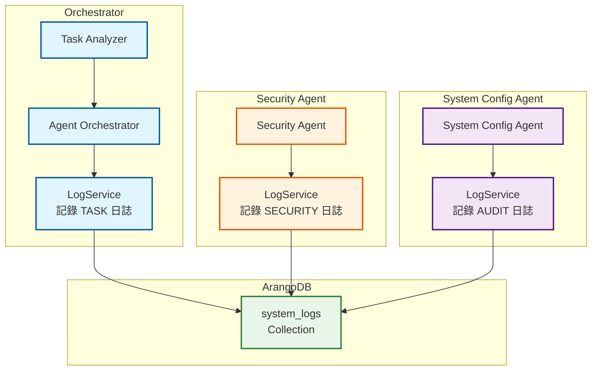

# LogService 統一日誌服務規格書

**版本**：1.1
**創建日期**：2025-12-20
**創建人**：Daniel Chung
**最後修改日期**：2025-12-21

> **📋 相關文檔**：
>
> - [Orchestrator-協調層規格書.md](../Orchestrator-協調層規格書.md) - Orchestrator 協調層完整規格
> - [Security-Agent-規格書.md](../Security-Agent-規格書.md) - Security Agent 詳細規格
> - [System-Config-Agent-規格書.md](../System-Config-Agent-規格書.md) - System Config Agent 詳細規格
> - [AI-Box-Agent-架構規格書-v2.md](../AI-Box-Agent-架構規格書-v2.md) - Agent 架構總體設計

---

## 目錄

1. [概述](#1-概述)
2. [設計理念](#2-設計理念)
3. [日誌架構設計](#3-日誌架構設計)
4. [接口設計](#4-接口設計)
5. [日誌類型定義](#5-日誌類型定義)
6. [ArangoDB 存儲設計](#6-arangodb-存儲設計)
7. [與各 Agent 的協作](#7-與各-agent-的協作)
8. [查詢與分析](#8-查詢與分析)
9. [LogService 與系統日誌的區別](#9-logservice-與系統日誌的區別)
10. [日誌記錄重點與最佳實踐](#10-日誌記錄重點與最佳實踐)
11. [內容大小管理](#11-內容大小管理)
12. [TTL 策略與日誌長度窗口管理](#12-ttl-策略與日誌長度窗口管理)
13. [日誌統計與監控](#13-日誌統計與監控)
14. [實現計劃](#14-實現計劃)

---

## 1. 概述

### 1.1 定位

**LogService（統一日誌服務）**是 AI-Box Agent 系統的**可觀測性與審計合規核心**，提供統一的日誌記錄接口，支持：

- **任務級日誌（Task Logs）**：Orchestrator 記錄宏觀的任務生命週期
- **審計日誌（Audit Logs）**：System Config Agent 記錄配置變更的詳細信息
- **安全日誌（Security Logs）**：Security Agent 記錄權限攔截和風險評估

### 1.2 設計目標

1. **統一接口**：所有 Agent 使用統一的 `LogService` 接口記錄日誌
2. **類型區分**：通過 `type` 字段區分不同類型的日誌（TASK/AUDIT/SECURITY）
3. **Trace ID 串聯**：使用 `trace_id` 串聯整個請求的生命週期
4. **可觀測性**：支持除錯、效能分析和問題追蹤
5. **審計合規**：符合 ISO/IEC 42001 標準，支持審計追蹤和合規證明

### 1.3 核心價值

- ✅ **系統簡單化**：統一的接口，所有 Agent 調用同一個服務
- ✅ **可觀測性**：完整的任務追蹤，快速定位問題
- ✅ **審計合規**：完整的變更記錄，支持合規審計
- ✅ **效能分析**：任務流轉路徑分析，優化系統性能

---

## 2. 設計理念

### 2.1 兩層日誌架構

**「兩者並行，但職責不同」**

就像一家公司：

- **總經理辦公室（Orchestrator）**：有一份總體的任務跟蹤表（任務級日誌）
- **各個部門（Agent）**：有自己的工作筆記（執行級日誌）

### 2.2 日誌類型職責

| 日誌類型 | 記錄者 | 職責 | 用途 |
|---------|--------|------|------|
| **TASK** | Orchestrator | 宏觀的任務生命週期 | 除錯、效能分析 |
| **AUDIT** | System Config Agent | 配置變更的詳細信息（before/after） | 審計、合規證明 |
| **SECURITY** | Security Agent | 權限攔截和風險評估 | 安全審計、威脅分析 |

### 2.3 統一接口設計

**系統簡單化**：透過一個 **`LogService`** 統一接口，讓所有 Agent 調用，這樣代碼最簡潔。

```python
# 所有 Agent 都使用同一個接口
log_service = get_log_service()

# Orchestrator 記錄任務流轉
await log_service.log_task(...)

# System Config Agent 記錄配置變更
await log_service.log_audit(...)

# Security Agent 記錄權限攔截
await log_service.log_security(...)
```

---

## 3. 日誌架構設計

### 3.1 整體架構



### 3.2 數據流設計

```
用戶請求
    ↓
Orchestrator 生成 trace_id
    ↓
┌─────────────────────────────────────┐
│ Orchestrator 記錄 TASK 日誌         │
│ - 任務路由路徑                       │
│ - 決策邏輯                           │
│ - Agent 調用順序                     │
└─────────────────────────────────────┘
    ↓
Security Agent 檢查權限
    ↓
┌─────────────────────────────────────┐
│ Security Agent 記錄 SECURITY 日誌   │
│ - 權限檢查結果                       │
│ - 風險評估分數                       │
│ - 攔截記錄（如適用）                 │
└─────────────────────────────────────┘
    ↓
System Config Agent 執行配置操作
    ↓
┌─────────────────────────────────────┐
│ System Config Agent 記錄 AUDIT 日誌 │
│ - 變更前/後對照（Before/After）      │
│ - AQL 執行語法                       │
│ - 配置變更詳情                       │
└─────────────────────────────────────┘
    ↓
所有日誌通過 trace_id 串聯
    ↓
ArangoDB system_logs Collection
```

---

## 4. 接口設計

### 4.1 核心接口

```python
from typing import Dict, Optional, Any, List
from pydantic import BaseModel
from datetime import datetime
from enum import Enum

class LogType(str, Enum):
    """日誌類型"""
    TASK = "TASK"  # 任務級日誌（Orchestrator）
    AUDIT = "AUDIT"  # 審計日誌（System Config Agent）
    SECURITY = "SECURITY"  # 安全日誌（Security Agent）

class LogService:
    """統一日誌服務，支援任務追蹤與審計合規"""

    def __init__(self, client: Optional[ArangoDBClient] = None):
        """初始化日誌服務"""
        self.client = client or ArangoDBClient()
        self._ensure_collection()

    async def log_event(
        self,
        trace_id: str,
        log_type: LogType,
        agent_name: str,
        actor: str,
        action: str,
        content: Dict[str, Any],
        level: Optional[str] = None,
        tenant_id: Optional[str] = None,
        user_id: Optional[str] = None
    ) -> str:
        """
        記錄日誌事件（統一接口）

        Args:
            trace_id: 追蹤 ID（用於串聯整個請求）
            log_type: 日誌類型（TASK/AUDIT/SECURITY）
            agent_name: Agent 名稱（如 "Orchestrator", "SystemConfigAgent"）
            actor: 執行者（用戶 ID 或 Agent ID）
            action: 操作類型（如 "update_config", "check_permission"）
            content: 日誌內容（包含 before/after、決策邏輯等）
            level: 配置層級（system/tenant/user，僅 AUDIT 類型需要）
            tenant_id: 租戶 ID（可選）
            user_id: 用戶 ID（可選）

        Returns:
            log_id: 日誌記錄 ID
        """
        log_entry = {
            "_key": f"{trace_id}_{log_type.value}_{int(datetime.utcnow().timestamp() * 1000)}",
            "trace_id": trace_id,
            "type": log_type.value,
            "agent_name": agent_name,
            "actor": actor,
            "action": action,
            "level": level,
            "tenant_id": tenant_id,
            "user_id": user_id,
            "content": content,
            "timestamp": datetime.utcnow().isoformat() + "Z"
        }

        # 執行 AQL 寫入 system_logs Collection
        collection = self.client.db.collection("system_logs")
        result = collection.insert(log_entry)
        return result["_key"]

    async def log_task(
        self,
        trace_id: str,
        actor: str,
        action: str,
        content: Dict[str, Any]
    ) -> str:
        """
        記錄任務級日誌（Orchestrator 專用）

        Args:
            trace_id: 追蹤 ID
            actor: 執行者（用戶 ID）
            action: 操作類型（如 "task_routing", "agent_selection"）
            content: 日誌內容（包含任務路由路徑、決策邏輯等）

        Returns:
            log_id: 日誌記錄 ID
        """
        return await self.log_event(
            trace_id=trace_id,
            log_type=LogType.TASK,
            agent_name="Orchestrator",
            actor=actor,
            action=action,
            content=content
        )

    async def log_audit(
        self,
        trace_id: str,
        actor: str,
        action: str,
        content: Dict[str, Any],
        level: str,
        tenant_id: Optional[str] = None,
        user_id: Optional[str] = None
    ) -> str:
        """
        記錄審計日誌（System Config Agent 專用）

        Args:
            trace_id: 追蹤 ID
            actor: 執行者（用戶 ID）
            action: 操作類型（如 "update_config", "delete_config"）
            content: 日誌內容（必須包含 before/after、AQL 語法等）
            level: 配置層級（system/tenant/user）
            tenant_id: 租戶 ID（可選）
            user_id: 用戶 ID（可選）

        Returns:
            log_id: 日誌記錄 ID
        """
        return await self.log_event(
            trace_id=trace_id,
            log_type=LogType.AUDIT,
            agent_name="SystemConfigAgent",
            actor=actor,
            action=action,
            content=content,
            level=level,
            tenant_id=tenant_id,
            user_id=user_id
        )

    async def log_security(
        self,
        trace_id: str,
        actor: str,
        action: str,
        content: Dict[str, Any]
    ) -> str:
        """
        記錄安全日誌（Security Agent 專用）

        Args:
            trace_id: 追蹤 ID
            actor: 執行者（用戶 ID）
            action: 操作類型（如 "check_permission", "assess_risk"）
            content: 日誌內容（包含權限檢查結果、風險評估分數、攔截記錄等）

        Returns:
            log_id: 日誌記錄 ID
        """
        return await self.log_event(
            trace_id=trace_id,
            log_type=LogType.SECURITY,
            agent_name="SecurityAgent",
            actor=actor,
            action=action,
            content=content
        )
```

### 4.2 查詢接口

```python
class LogService:
    """統一日誌服務"""

    async def get_logs_by_trace_id(
        self,
        trace_id: str
    ) -> List[Dict[str, Any]]:
        """
        根據 trace_id 查詢所有相關日誌

        用於追蹤整個請求的生命週期

        Args:
            trace_id: 追蹤 ID

        Returns:
            日誌列表（按時間排序）
        """
        aql = """
            FOR log IN system_logs
                FILTER log.trace_id == @trace_id
                SORT log.timestamp ASC
                RETURN log
        """
        cursor = self.client.db.aql.execute(aql, bind_vars={"trace_id": trace_id})
        return list(cursor)

    async def get_audit_logs(
        self,
        actor: Optional[str] = None,
        level: Optional[str] = None,
        tenant_id: Optional[str] = None,
        start_time: Optional[datetime] = None,
        end_time: Optional[datetime] = None,
        limit: int = 100
    ) -> List[Dict[str, Any]]:
        """
        查詢審計日誌

        Args:
            actor: 執行者（可選）
            level: 配置層級（可選）
            tenant_id: 租戶 ID（可選）
            start_time: 開始時間（可選）
            end_time: 結束時間（可選）
            limit: 返回數量限制

        Returns:
            審計日誌列表
        """
        filters = {"type": "AUDIT"}
        if actor:
            filters["actor"] = actor
        if level:
            filters["level"] = level
        if tenant_id:
            filters["tenant_id"] = tenant_id

        aql = """
            FOR log IN system_logs
                FILTER log.type == "AUDIT"
                FILTER log.actor == @actor OR @actor == null
                FILTER log.level == @level OR @level == null
                FILTER log.tenant_id == @tenant_id OR @tenant_id == null
                FILTER log.timestamp >= @start_time OR @start_time == null
                FILTER log.timestamp <= @end_time OR @end_time == null
                SORT log.timestamp DESC
                LIMIT @limit
                RETURN log
        """
        cursor = self.client.db.aql.execute(
            aql,
            bind_vars={
                "actor": actor,
                "level": level,
                "tenant_id": tenant_id,
                "start_time": start_time.isoformat() if start_time else None,
                "end_time": end_time.isoformat() if end_time else None,
                "limit": limit
            }
        )
        return list(cursor)

    async def get_security_logs(
        self,
        actor: Optional[str] = None,
        action: Optional[str] = None,
        start_time: Optional[datetime] = None,
        end_time: Optional[datetime] = None,
        limit: int = 100
    ) -> List[Dict[str, Any]]:
        """
        查詢安全日誌

        Args:
            actor: 執行者（可選）
            action: 操作類型（可選）
            start_time: 開始時間（可選）
            end_time: 結束時間（可選）
            limit: 返回數量限制

        Returns:
            安全日誌列表
        """
        # 類似 get_audit_logs 的實現
        pass
```

---

## 5. 日誌類型定義

### 5.1 TASK 日誌（任務級日誌）

**記錄者**：Orchestrator

**記錄內容**：

```json
{
  "trace_id": "uuid-12345",
  "type": "TASK",
  "agent_name": "Orchestrator",
  "actor": "admin_user_01",
  "action": "task_routing",
  "content": {
    "instruction": "幫我把租戶 A 的限流改為 500",
    "task_flow": [
      {
        "step": 1,
        "component": "Task Analyzer",
        "action": "parse_intent",
        "result": {
          "intent": {
            "action": "update",
            "scope": "genai.policy",
            "level": "tenant",
            "tenant_id": "tenant_a"
          },
          "confidence": 0.95
        },
        "duration_ms": 120
      },
      {
        "step": 2,
        "component": "Security Agent",
        "action": "verify_access",
        "result": {
          "allowed": true,
          "risk_level": "medium"
        },
        "duration_ms": 45
      },
      {
        "step": 3,
        "component": "System Config Agent",
        "action": "execute_task",
        "result": {
          "success": true,
          "config_id": "config-123"
        },
        "duration_ms": 230
      }
    ],
    "total_duration_ms": 395,
    "final_status": "completed"
  },
  "timestamp": "2025-12-20T10:00:00Z"
}
```

**用途**：

- ✅ **除錯 (Debugging)**：當管理員抱怨「為什麼我的設置沒反應」時，Orchestrator 的日誌能立刻告訴你卡在哪個 Agent
- ✅ **效能分析**：分析任務流轉路徑，優化系統性能
- ✅ **問題追蹤**：追蹤任務的完整生命週期

### 5.2 AUDIT 日誌（審計日誌）

**記錄者**：System Config Agent

**記錄內容**：

```json
{
  "trace_id": "uuid-12345",
  "type": "AUDIT",
  "agent_name": "SystemConfigAgent",
  "actor": "admin_user_01",
  "action": "update_config",
  "level": "tenant",
  "tenant_id": "tenant_a",
  "content": {
    "scope": "genai.policy",
    "before": {
      "rate_limit": 1000,
      "allowed_providers": ["openai", "anthropic"]
    },
    "after": {
      "rate_limit": 500,
      "allowed_providers": ["openai", "anthropic"]
    },
    "changes": {
      "rate_limit": {
        "old": 1000,
        "new": 500
      }
    },
    "aql_query": "UPDATE {_key: 'tenant_a_genai.policy'} WITH {config_data: {...}} IN tenant_configs",
    "rollback_id": "rb-uuid-123",
    "compliance_check": {
      "passed": true,
      "convergence_rule": "tenant rate_limit (500) <= system max (1000)"
    }
  },
  "timestamp": "2025-12-20T10:00:05Z"
}
```

**用途**：

- ✅ **安全審計 (Auditing)**：記錄所有配置變更，支持審計追蹤
- ✅ **合規證明**：符合 ISO/IEC 42001 標準，支持合規審計
- ✅ **時光機功能**：基於 before/after 實現配置回滾
- ✅ **變更追蹤**：追蹤配置變更歷史

### 5.3 SECURITY 日誌（安全日誌）

**記錄者**：Security Agent

**記錄內容**：

```json
{
  "trace_id": "uuid-12345",
  "type": "SECURITY",
  "agent_name": "SecurityAgent",
  "actor": "admin_user_01",
  "action": "check_permission",
  "content": {
    "intent": {
      "action": "update",
      "scope": "genai.policy",
      "level": "tenant",
      "tenant_id": "tenant_a"
    },
    "permission_check": {
      "allowed": true,
      "user_role": "tenant_admin",
      "reason": null
    },
    "risk_assessment": {
      "risk_level": "medium",
      "requires_double_check": false,
      "risk_factors": [
        "tenant_level_update",
        "rate_limit_change"
      ]
    },
    "audit_context": {
      "ip": "192.168.1.100",
      "user_agent": "Mozilla/5.0...",
      "admin_role": "tenant_admin"
    }
  },
  "timestamp": "2025-12-20T10:00:02Z"
}
```

**攔截記錄示例**：

```json
{
  "trace_id": "uuid-12346",
  "type": "SECURITY",
  "agent_name": "SecurityAgent",
  "actor": "user_02",
  "action": "check_permission",
  "content": {
    "intent": {
      "action": "update",
      "scope": "genai.policy",
      "level": "system"
    },
    "permission_check": {
      "allowed": false,
      "user_role": "tenant_admin",
      "reason": "Security Error: 權限不足，僅系統管理員可修改全域配置"
    },
    "risk_assessment": {
      "risk_level": "high",
      "blocked": true
    },
    "audit_context": {
      "ip": "192.168.1.101",
      "user_agent": "Mozilla/5.0...",
      "admin_role": "tenant_admin"
    }
  },
  "timestamp": "2025-12-20T10:05:00Z"
}
```

**用途**：

- ✅ **安全審計**：記錄所有權限檢查和攔截記錄
- ✅ **威脅分析**：分析非法請求模式和攻擊嘗試
- ✅ **合規證明**：證明系統有完善的安全控制機制

---

## 6. ArangoDB 存儲設計

### 6.1 Collection 設計

**Collection 名稱**：`system_logs`

**文檔結構**：

```json
{
  "_key": "uuid-12345_TASK_1734681600000",
  "trace_id": "uuid-12345",
  "type": "TASK|AUDIT|SECURITY",
  "agent_name": "Orchestrator|SystemConfigAgent|SecurityAgent",
  "actor": "admin_user_01",
  "action": "task_routing|update_config|check_permission",
  "level": "system|tenant|user",
  "tenant_id": "tenant_a",
  "user_id": "user_123",
  "content": {
    // 日誌內容（根據類型不同而異）
  },
  "timestamp": "2025-12-20T10:00:00Z"
}
```

### 6.2 索引設計

```python
# 創建索引以提高查詢性能
collection = db.collection("system_logs")

# 1. trace_id 索引（用於追蹤整個請求）
collection.add_index({
    "type": "persistent",
    "fields": ["trace_id", "timestamp"]
})

# 2. type 索引（用於按類型查詢）
collection.add_index({
    "type": "persistent",
    "fields": ["type", "timestamp"]
})

# 3. actor 索引（用於查詢特定用戶的操作）
collection.add_index({
    "type": "persistent",
    "fields": ["actor", "timestamp"]
})

# 4. 審計日誌複合索引（用於審計查詢）
collection.add_index({
    "type": "persistent",
    "fields": ["type", "level", "tenant_id", "timestamp"]
})

# 5. 時間範圍查詢索引
collection.add_index({
    "type": "persistent",
    "fields": ["timestamp"]
})

# 6. TTL 索引（可選：自動清理舊日誌）
collection.add_index({
    "type": "ttl",
    "fields": ["timestamp"],
    "expireAfter": 31536000  # 1 年（可配置）
})
```

### 6.3 數據分類與標記

根據 WBS-4.2.1 數據分類規範：

```json
{
  "_key": "uuid-12345_AUDIT_1734681600000",
  "trace_id": "uuid-12345",
  "type": "AUDIT",
  "data_classification": "INTERNAL",  // 審計日誌為內部數據
  "sensitivity_labels": ["AUDIT", "COMPLIANCE"],
  // ... 其他字段
}
```

---

## 7. 與各 Agent 的協作

### 7.1 Orchestrator 使用 LogService

```python
# 在 Orchestrator 中的使用示例
class AgentOrchestrator:
    """Agent 協調器"""

    def __init__(self, registry: Optional[Any] = None):
        self._registry = registry or get_agent_registry()
        self._task_analyzer = TaskAnalyzer()
        self._log_service = get_log_service()  # ⭐ 獲取 LogService

    async def process_natural_language_request(
        self,
        instruction: str,
        context: Optional[Dict[str, Any]] = None,
        user_id: Optional[str] = None
    ) -> TaskResult:
        """處理自然語言請求"""
        # 1. 生成 trace_id
        trace_id = str(uuid.uuid4())

        # 2. 記錄任務開始
        await self._log_service.log_task(
            trace_id=trace_id,
            actor=user_id,
            action="task_start",
            content={
                "instruction": instruction,
                "context": context
            }
        )

        # 3. Task Analyzer 解析意圖
        analysis_result = await self._task_analyzer.analyze(...)

        # 4. 記錄任務路由決策
        await self._log_service.log_task(
            trace_id=trace_id,
            actor=user_id,
            action="task_routing",
            content={
                "intent": analysis_result.intent,
                "suggested_agents": analysis_result.suggested_agents,
                "routing_decision": {
                    "selected_agent": target_agent_id,
                    "reason": "best_match"
                }
            }
        )

        # 5. Security Agent 權限檢查
        security_result = await self._security_agent.verify_access(...)

        # 6. 記錄權限檢查結果
        await self._log_service.log_task(
            trace_id=trace_id,
            actor=user_id,
            action="permission_check",
            content={
                "security_result": {
                    "allowed": security_result.allowed,
                    "risk_level": security_result.risk_level
                }
            }
        )

        # 7. 調用目標 Agent
        agent_result = await self._dispatch_task(...)

        # 8. 記錄任務完成
        await self._log_service.log_task(
            trace_id=trace_id,
            actor=user_id,
            action="task_completed",
            content={
                "final_status": "completed",
                "agent_result": agent_result,
                "total_duration_ms": duration_ms
            }
        )

        return TaskResult(...)
```

### 7.2 Security Agent 使用 LogService

```python
# 在 Security Agent 中的使用示例
class SecurityAgent(AgentServiceProtocol):
    """負責權限驗證與操作風險評估"""

    def __init__(self):
        self._rbac_service = get_rbac_service()
        self._log_service = get_log_service()  # ⭐ 獲取 LogService

    async def verify_access(
        self,
        admin_id: str,
        intent: Dict[str, Any],
        context: Optional[Dict[str, Any]] = None,
        trace_id: Optional[str] = None  # ⭐ 接收 trace_id
    ) -> SecurityCheckResult:
        """驗證用戶權限並評估操作風險"""
        # 1. 權限檢查
        permission_check = await self._check_permission(...)

        # 2. 風險評估
        risk_assessment = await self._assess_risk(...)

        # 3. 記錄安全日誌
        await self._log_service.log_security(
            trace_id=trace_id or str(uuid.uuid4()),
            actor=admin_id,
            action="check_permission",
            content={
                "intent": intent,
                "permission_check": {
                    "allowed": permission_check.allowed,
                    "user_role": user_role,
                    "reason": permission_check.reason
                },
                "risk_assessment": {
                    "risk_level": risk_assessment.risk_level,
                    "requires_double_check": risk_assessment.requires_double_check
                },
                "audit_context": audit_context
            }
        )

        # 4. 如果被攔截，記錄攔截日誌
        if not permission_check.allowed:
            await self._log_service.log_security(
                trace_id=trace_id,
                actor=admin_id,
                action="access_denied",
                content={
                    "intent": intent,
                    "reason": permission_check.reason,
                    "blocked": True
                }
            )

        return SecurityCheckResult(...)
```

### 7.3 System Config Agent 使用 LogService

```python
# 在 System Config Agent 中的使用示例
class SystemConfigAgent(AgentServiceProtocol):
    """負責配置的合規檢查與 ArangoDB 交互"""

    def __init__(self):
        self._config_service = get_config_store_service()
        self._log_service = get_log_service()  # ⭐ 獲取 LogService

    async def execute_task(
        self,
        intent: ConfigIntent,
        auth_context: Dict[str, Any],
        trace_id: Optional[str] = None  # ⭐ 接收 trace_id
    ) -> ConfigOperationResult:
        """執行配置任務"""
        # 1. 獲取當前配置（用於 before/after 對照）
        current_config = await self._config_service.get_config(...)
        before_config = current_config.config_data if current_config else {}

        # 2. 執行配置更新
        db_result = await self._config_service.update_config(...)
        after_config = db_result.config_data

        # 3. 構建 AQL 查詢記錄
        aql_query = f"""
            UPDATE {{_key: '{db_result._key}'}}
            WITH {{config_data: {json.dumps(after_config)}}}
            IN tenant_configs
        """

        # 4. 記錄審計日誌（包含 before/after）
        await self._log_service.log_audit(
            trace_id=trace_id or str(uuid.uuid4()),
            actor=auth_context.get("admin_id"),
            action=intent.action,
            content={
                "scope": intent.scope,
                "before": before_config,
                "after": after_config,
                "changes": self._calculate_changes(before_config, after_config),
                "aql_query": aql_query,
                "rollback_id": f"rb-{uuid.uuid4()}",
                "compliance_check": {
                    "passed": True,
                    "convergence_rule": "tenant rate_limit <= system max"
                }
            },
            level=intent.level,
            tenant_id=intent.tenant_id,
            user_id=intent.user_id
        )

        return ConfigOperationResult(...)

    def _calculate_changes(
        self,
        before: Dict[str, Any],
        after: Dict[str, Any]
    ) -> Dict[str, Any]:
        """計算變更內容"""
        changes = {}
        for key in set(before.keys()) | set(after.keys()):
            if before.get(key) != after.get(key):
                changes[key] = {
                    "old": before.get(key),
                    "new": after.get(key)
                }
        return changes
```

### 7.4 Orchestrator 作為日誌聚合器

**設計理念**：Orchestrator 可以扮演 **「日誌收集者」** 的角色

```python
# Orchestrator 在任務完成後，聚合所有日誌生成任務報告
class AgentOrchestrator:
    """Agent 協調器"""

    async def generate_task_report(self, trace_id: str) -> Dict[str, Any]:
        """
        生成任務報告（聚合所有相關日誌）

        當管理員問：「昨天下午誰動了租戶 A 的設置？」時，
        可以通過 trace_id 快速查詢所有相關日誌
        """
        # 1. 查詢所有相關日誌
        logs = await self._log_service.get_logs_by_trace_id(trace_id)

        # 2. 按類型分類
        task_logs = [log for log in logs if log["type"] == "TASK"]
        audit_logs = [log for log in logs if log["type"] == "AUDIT"]
        security_logs = [log for log in logs if log["type"] == "SECURITY"]

        # 3. 構建任務報告
        report = {
            "trace_id": trace_id,
            "task_summary": {
                "instruction": task_logs[0]["content"].get("instruction") if task_logs else None,
                "status": task_logs[-1]["content"].get("final_status") if task_logs else None,
                "total_duration_ms": task_logs[-1]["content"].get("total_duration_ms") if task_logs else None
            },
            "task_flow": [
                {
                    "step": i + 1,
                    "component": log["agent_name"],
                    "action": log["action"],
                    "timestamp": log["timestamp"]
                }
                for i, log in enumerate(logs)
            ],
            "security_checks": security_logs,
            "config_changes": audit_logs,
            "timeline": sorted(logs, key=lambda x: x["timestamp"])
        }

        return report
```

---

## 8. 查詢與分析

### 8.1 常見查詢場景

#### 8.1.1 追蹤完整任務生命週期

```python
# 查詢特定 trace_id 的所有日誌
logs = await log_service.get_logs_by_trace_id("uuid-12345")

# 結果：按時間排序的所有日誌（TASK + AUDIT + SECURITY）
```

#### 8.1.2 審計查詢

```python
# 查詢「昨天下午誰動了租戶 A 的設置？」
audit_logs = await log_service.get_audit_logs(
    tenant_id="tenant_a",
    start_time=datetime(2025, 12, 19, 14, 0, 0),
    end_time=datetime(2025, 12, 19, 18, 0, 0)
)

# 結果：所有相關的審計日誌，包含 before/after 對照
```

#### 8.1.3 安全分析

```python
# 查詢所有被攔截的請求
security_logs = await log_service.get_security_logs(
    action="access_denied",
    start_time=datetime(2025, 12, 1),
    end_time=datetime(2025, 12, 20)
)

# 結果：所有安全攔截記錄，用於威脅分析
```

#### 8.1.4 效能分析

```python
# 查詢任務流轉路徑，分析性能瓶頸
task_logs = await log_service.get_logs_by_trace_id("uuid-12345")
task_flow = [log for log in task_logs if log["type"] == "TASK"]

# 分析每個步驟的耗時
for step in task_flow:
    duration = step["content"].get("duration_ms", 0)
    print(f"{step['action']}: {duration}ms")
```

### 8.2 日誌聚合查詢

```python
# 查詢某個時間段內的所有配置變更
aql = """
    FOR log IN system_logs
        FILTER log.type == "AUDIT"
        FILTER log.timestamp >= @start_time
        FILTER log.timestamp <= @end_time
        COLLECT tenant = log.tenant_id INTO changes
        RETURN {
            tenant: tenant,
            change_count: LENGTH(changes),
            changes: changes[*].log
        }
"""
```

---

## 9. 實現計劃

### 9.1 第一階段：核心接口實現（1週）

**目標**：實現 LogService 核心接口

**任務**：

1. ✅ 創建 `LogService` 類
   - 實現 `log_event()` 方法
   - 實現 `log_task()` 方法
   - 實現 `log_audit()` 方法
   - 實現 `log_security()` 方法

2. ✅ 創建 ArangoDB Collection
   - 創建 `system_logs` collection
   - 創建必要的索引

3. ✅ 實現數據模型
   - `LogType` 枚舉
   - 日誌文檔結構

**優先級**：高

### 9.2 第二階段：查詢接口實現（0.5週）

**目標**：實現日誌查詢接口

**任務**：

1. ✅ 實現 `get_logs_by_trace_id()` 方法
2. ✅ 實現 `get_audit_logs()` 方法
3. ✅ 實現 `get_security_logs()` 方法

**優先級**：中

### 9.3 第三階段：與 Orchestrator 集成（0.5週）

**目標**：在 Orchestrator 中集成 LogService

**任務**：

1. ✅ 在 Orchestrator 中生成 trace_id
2. ✅ 記錄任務流轉日誌
3. ✅ 實現任務報告生成功能

**優先級**：高

### 9.4 第四階段：與 Security Agent 集成（0.5週）

**目標**：在 Security Agent 中集成 LogService

**任務**：

1. ✅ 記錄權限檢查日誌
2. ✅ 記錄風險評估日誌
3. ✅ 記錄攔截日誌

**優先級**：高

### 9.5 第五階段：與 System Config Agent 集成（0.5週）

**目標**：在 System Config Agent 中集成 LogService

**任務**：

1. ✅ 記錄配置變更日誌（包含 before/after）
2. ✅ 記錄 AQL 查詢語法
3. ✅ 記錄合規檢查結果

**優先級**：高

### 9.6 第六階段：測試與優化（0.5週）

**目標**：完善測試和優化

**任務**：

1. ✅ 編寫單元測試
2. ✅ 編寫集成測試
3. ✅ 性能優化（異步寫入、批量插入）
4. ✅ 文檔完善

**優先級**：中

---

## 10. 總結

### 10.1 核心優勢

1. **統一接口**：所有 Agent 使用統一的 `LogService` 接口
2. **類型區分**：通過 `type` 字段區分不同類型的日誌
3. **Trace ID 串聯**：使用 `trace_id` 串聯整個請求的生命週期
4. **可觀測性**：完整的任務追蹤，快速定位問題
5. **審計合規**：符合 ISO/IEC 42001 標準，支持審計追蹤

### 10.2 技術亮點

- ✅ 統一的日誌服務接口
- ✅ 完整的任務生命週期追蹤
- ✅ 詳細的配置變更記錄（before/after）
- ✅ 安全審計和威脅分析支持
- ✅ 高效的查詢和分析能力

### 10.3 設計理念實現

**「簡單系統」的追求**：

- ✅ **統一接口**：所有 Agent 調用同一個 `LogService`
- ✅ **職責清晰**：Orchestrator 記錄任務流轉，Agent 記錄執行細節
- ✅ **自動化記錄**：開發者不需要在每個 API 手動寫日誌
- ✅ **完整追蹤**：通過 trace_id 串聯整個請求的生命週期

---

**文檔版本**：1.1
**最後更新**：2025-12-21
**維護者**：Daniel Chung

---

## 更新記錄

| 版本 | 日期 | 更新人 | 更新內容 |
|------|------|--------|---------|
| 1.1 | 2025-12-21 | Daniel Chung | 添加內容大小管理、TTL 策略、日誌統計、與系統日誌區別等章節 |
| 1.0 | 2025-12-20 | Daniel Chung | 初始版本 |
