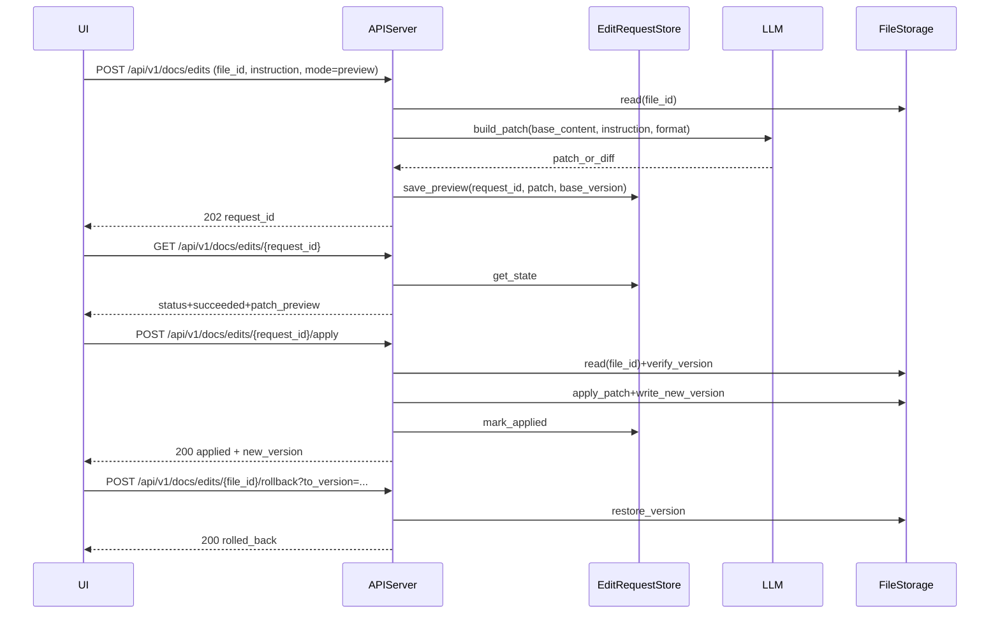

# GenAI 文件編輯（md/txt/json）MVP 計劃

## 目標與約束

- **目標**：提供一套產品化的「寫文件」能力：
  - 產生新文件（md/txt/json）
  - 對既有文件做「局部修改」：先產生 patch/diff 預覽，使用者按 **Apply** 才真正寫入
- **範圍**：僅支援 `md/txt/json`；**一次只處理 1 個檔案**。
- **可靠性**：支援 `request_id` lifecycle（離開頁面仍可完成）、版本化與 rollback、權限檢查與審計。

## 現況可重用元件（會直接沿用）

- **檔案與權限**：`api/routers/file_management.py`、`services/api/services/file_permission_service.py`
- **背景作業與 request_id**：`api/routers/chat.py` 的 request lifecycle、`services/api/services/genai_chat_request_store_service.py`
- **統一回應格式**：`api/core/response.py`

## 設計總覽（資料流）

## Patch/Preview 格式（MVP 規格）

- **md/txt**：採 **unified diff**（人類可讀、也利於 UI 顯示）。
- **json**：採 **JSON Patch (RFC6902)** 或「key-path 指令」形式（可做 schema/語法驗證、避免模型輸出整份 JSON）。
- **共同欄位**：
  - `file_id`
  - `base_version`（避免覆蓋競態）
  - `patch`（diff 或 json_patch）
  - `format`（md/txt/json）
  - `summary`（模型提供的變更摘要，用於 UI）

## 後端實作切分（建議新增的模組）

- **EditRequest models**：新增 Pydantic models（request_id、狀態 queued/running/succeeded/failed/aborted、preview patch、apply 結果、error）。
- **EditRequest store**：仿照 `services/api/services/genai_chat_request_store_service.py` 做 Redis-first + memory fallback + TTL。
- **Patch engine**：
  - md/txt：unified diff 套用器（必要：hunk context 校驗；失敗時回報可讀錯誤）
  - json：JSON Patch 套用器（先 parse+validate，再 apply）
- **安全/治理**：
  - 讀取/寫入前：`FilePermissionService.check_file_access(..., required_permission=Permission.FILE_UPDATE.value)`
  - 寫入前：檢查 `base_version`（不一致回 409）
  - 審計：沿用 `system/security/audit_decorator.py` 的模式記錄（user_id/tenant_id/request_id/file_id/summary）。

## API 設計（建議路由）

- `POST /api/v1/docs/edits`：建立編輯請求（預設 executor=local，可選 rq）→ 回 `202 + request_id`
- `GET /api/v1/docs/edits/{request_id}`：查詢 preview 狀態與 patch
- `POST /api/v1/docs/edits/{request_id}/apply`：套用 preview patch 寫回檔案（產生新 version）
- `POST /api/v1/docs/edits/{request_id}/abort`：中止（同 chat request）
- `GET /api/v1/docs/files/{file_id}/versions`：列出版本
- `POST /api/v1/docs/files/{file_id}/rollback`：rollback 到指定 version

## 前端（ai-bot）MVP UI（概念）

- 新增「文件助手」頁：
  - 左側選檔（沿用 FileTree）
  - 右側：instruction 輸入、Generate Preview、Diff viewer、Apply、Rollback
- preview-first：Generate 只會產生 diff，不會直接覆寫。

## 測試策略（pytest）

- **unit**：patch engine（md/txt/json）套用成功、context mismatch、invalid json patch。
- **api**：
  - 無 FILE_UPDATE → 403
  - base_version mismatch → 409
  - preview → apply → 版本+內容正確
  - request_id 狀態輪詢與 abort

## 驗收標準

- md/txt/json：可對指定 file_id 產生 preview patch，並可 Apply 寫回。
- 具備版本與 rollback。
- 權限與審計可用。
- 離開頁面後仍可用 request_id 查到 preview/apply 結果。
