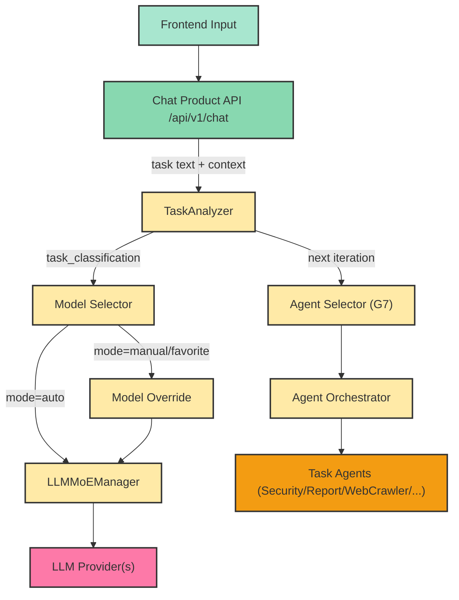
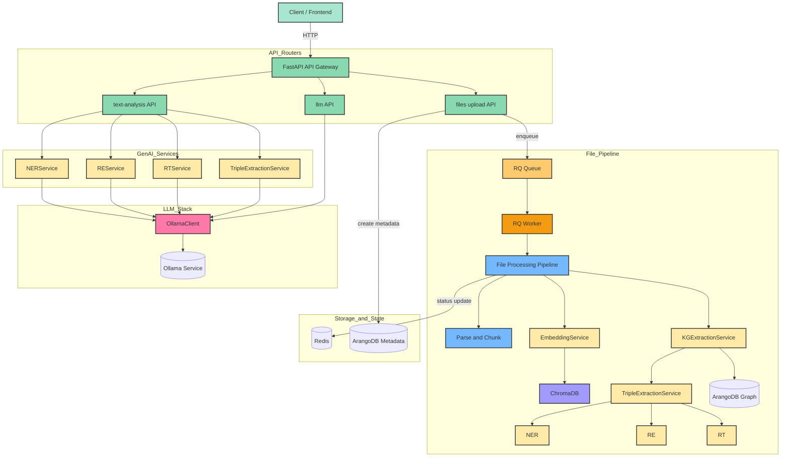
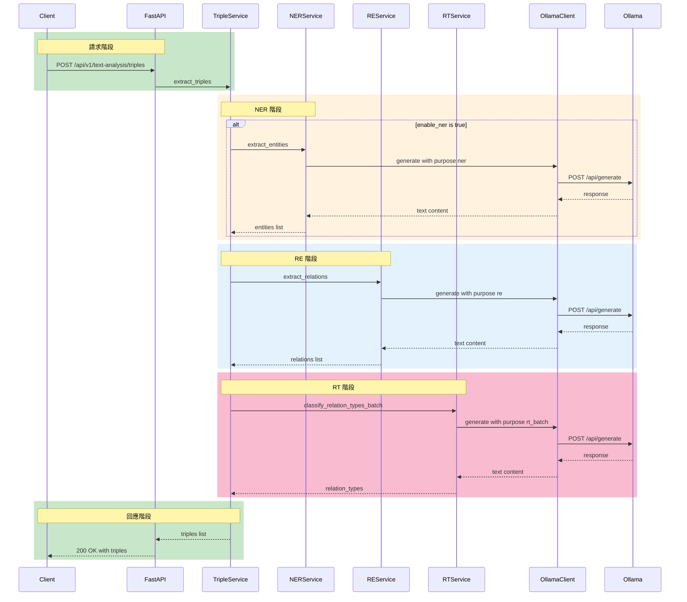
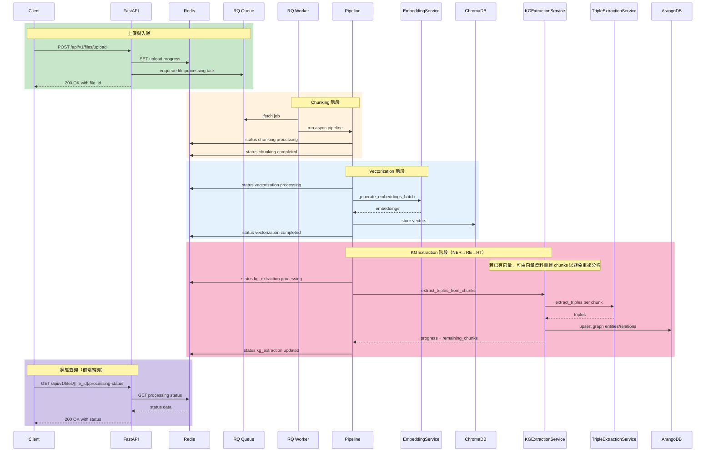
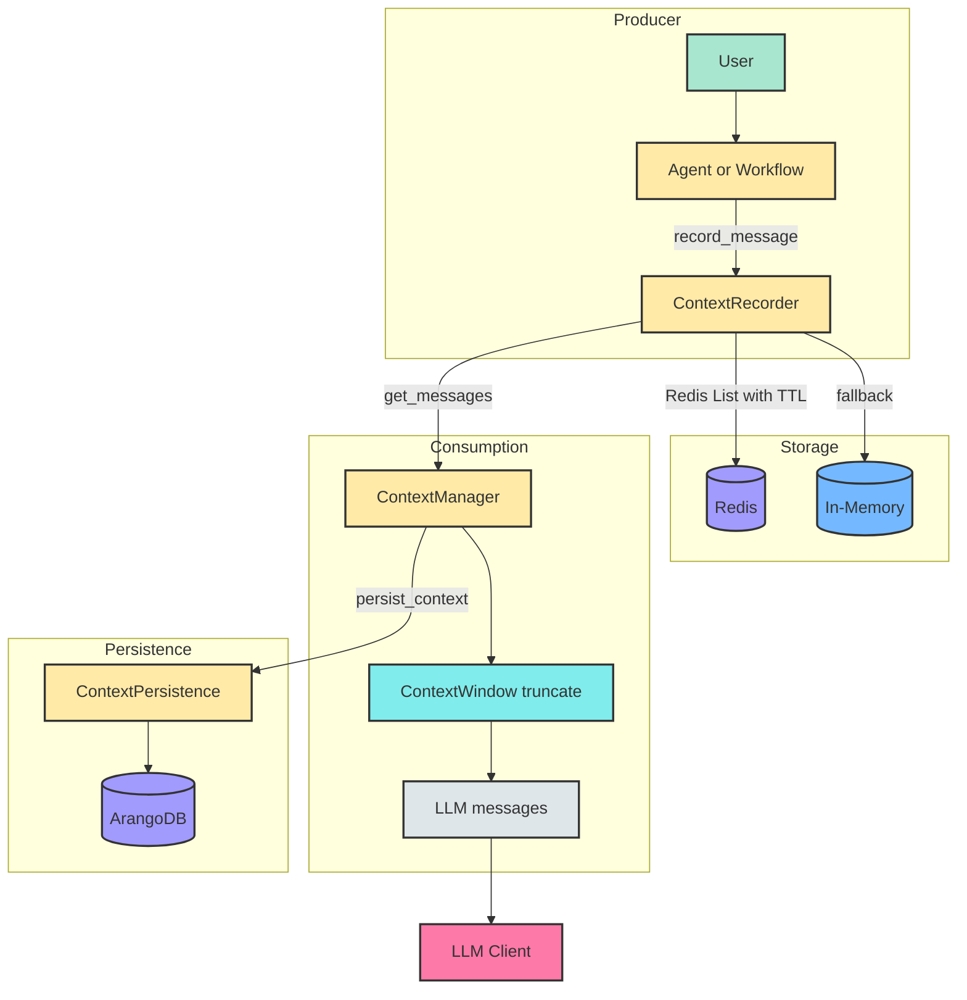
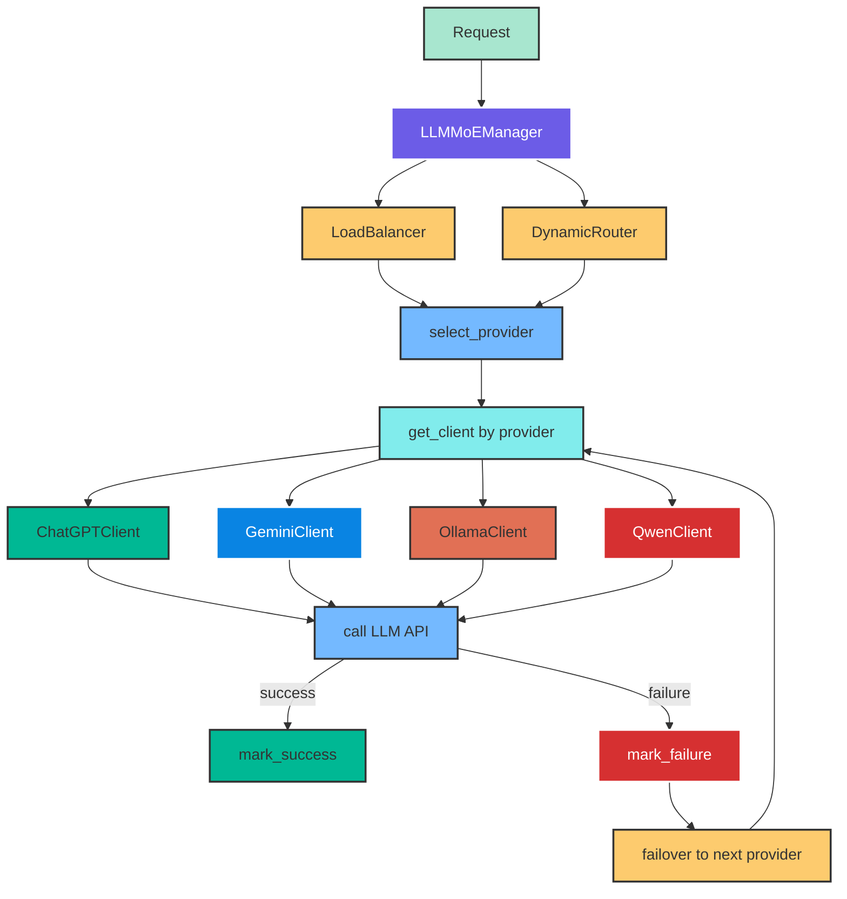

<!--
文件說明：GenAI 模型調用、Pipeline、上下文流程盤點（含 Mermaid 8.8 流程圖）
創建日期：2025-12-13 13:18:56 (UTC+8)
創建人：Daniel Chung
最後修改日期：2025-12-13 23:34:17 (UTC+8)
-->

# GenAI Pipeline 流程總覽

本文檔盤點 AI-Box 專案中與 **GenAI 模型調用**、**文本抽取 Pipeline（NER/RE/RT/Triple）**、**文件上傳後處理 Pipeline（分塊/向量化/KG）**、以及 **上下文（Context/Memory/Window/Persistence）** 相關的主要流程。

> **Mermaid 版本**：8.8（本文所有 Mermaid 圖使用 8.8 可用語法）

---

## 1. 關鍵模組與入口（檔案定位）

| 分類 | 檔案 | 說明 |
|------|------|------|
| API 入口 | `api/main.py` | 掛載路由 |
| LLM 統一介面 | `llm/clients/base.py` | generate/chat/embeddings |
| LLM 工廠 | `llm/clients/factory.py` | 多 Provider 工廠 |
| MoE 管理器 | `llm/moe/moe_manager.py` | 跨 provider 路由/負載/故障轉移 |
| Ollama Client | `llm/clients/ollama.py` | HTTP client 含節點路由 |
| GenAI User Config API | `api/routers/genai_user_config.py` | 使用者自帶 provider API key（狀態查詢/寫入/刪除） |
| GenAI Tenant Config API | `api/routers/genai_tenant_config.py` | 租戶政策/租戶級 secrets 管理（多租戶前置） |
| GenAI Secret Encryption | `services/api/services/genai_secret_encryption_service.py` | 使用者/租戶敏感資訊加密（AES-256-GCM；key 在 .env） |
| GenAI Config Resolver | `services/api/services/genai_config_resolver_service.py` | 合併 system/tenant/user 設定並注入 allowlist + credentials |
| GenAI Tenant Policy Store | `services/api/services/genai_tenant_policy_service.py` | 租戶政策 + 租戶級 API key（DB 優先 + fallback） |
| GenAI User Secret Store | `services/api/services/genai_user_llm_secret_service.py` | 使用者 API key（DB 優先 + fallback） |
| GenAI Chat Request Store | `services/api/services/genai_chat_request_store_service.py` | request_id 狀態存儲（Redis 優先 + fallback） |
| GenAI Chat RQ Job | `workers/genai_chat_job.py` | RQ worker 執行 request_id 任務入口 |
| NER 服務 | `genai/api/services/ner_service.py` | 命名實體識別 |
| RE 服務 | `genai/api/services/re_service.py` | 關係抽取 |
| RT 服務 | `genai/api/services/rt_service.py` | 關係類型分類 |
| Triple 服務 | `genai/api/services/triple_extraction_service.py` | 三元組提取 |
| 文件上傳 | `api/routers/file_upload.py` | 上傳+非同步處理（RQ） |
| RQ Queue | `database/rq/queue.py` | 隊列管理 |
| Worker Tasks | `workers/tasks.py` | RQ 任務函數（包裝 async pipeline） |
| Embedding | `services/api/services/embedding_service.py` | 向量化 |
| KG 抽取 | `services/api/services/kg_extraction_service.py` | KG 抽取（chunk 可續跑） |
| Context Manager | `genai/workflows/context/manager.py` | 上下文管理 |
| Context Recorder | `genai/workflows/context/recorder.py` | Redis/memory 記錄器 |
| Context Window | `genai/workflows/context/window.py` | 上下文截斷 |

---

## 1.1 產品級對話入口（前端輸入框）與模型選擇（Auto/指定/收藏）

> 重要：本文件作為「開發指導核心」，因此把你補充的兩個能力（模型選擇參數化、Agent 編排與 per-agent 模型策略）納入架構指引。

### 1.1.1 Model Selector（前端）→ MoE（後端）

- **前端**：`ai-bot/src/components/ChatInput.tsx` 已有 `Auto` 與多模型列表（含 Ollama/ChatGPT/Gemini/Qwen/Grok）。
- **後端**：`llm/moe/moe_manager.py` 提供統一 `chat()/generate()`，可依 `task_classification` 做 Auto routing。
- **系統參數（JSON）**：專案已有 `config/config.json`（由 `system/infra/config/config.py` 載入）。未來可把你說的「系統參數 json」放在此處（例如 cost/latency/quality 偏好、強制 provider、黑白名單等）。

建議將前端選擇抽象成以下 request 形狀（**產品級 Chat API** 需支援）：

- `model_selector.mode`: `auto` | `manual` | `favorite`
- `model_selector.model_id`: manual/favorite 時必填（例如 `gpt-4-turbo`、`qwen3-coder:30b`）
- `model_selector.policy_overrides`: 可選（對應「系統參數 json」覆蓋，例如 cost_threshold、low_latency）

> 補充：目前 repo 中的 `/api/v1/llm/*` 仍偏「基礎 LLM 服務端點」，尚未作為前端輸入框的產品級入口；產品級 Chat API 建議獨立 `/api/v1/chat/*` 並在此統一串接 MoE + Context/Memory。

### 1.1.2 Agent Selector（Auto/指定）與任務型 Agent（下一迭代）

- **任務分析基礎已存在**：`agents/task_analyzer/analyzer.py` 會產出 workflow 選擇 + LLM 路由建議（provider/model）。
- **代理平台骨架已存在**：Registry/Orchestrator/MCP executor：`agents/services/orchestrator/orchestrator.py`、`agents/services/registry/task_executor.py`。

**下一迭代（G7）要落地的能力**：
- 任務型 Agent 池：Security / Status / Report / WebCrawler / Knowledge（等）
- **per-agent / per-subtask 的模型策略**：
  - 例：Security 用高可靠模型；WebCrawler/整理用低成本模型；Report 用長上下文模型

### 1.1.3 指導性流程圖（前端輸入框 → 模型/代理路由）

---

### 1.1.4 可靠的背景作業（request_id lifecycle）與排定隊列（local / RQ）

- **需求背景**：使用者送出訊息後即使離開頁面，後端仍要持續處理；前端可用 `request_id` 輪詢結果或 `abort`。
- **API**（產品級 Chat）：
  - `POST /api/v1/chat/requests`：回 `202` + `request_id`，支援 `executor=local|rq`
  - `GET /api/v1/chat/requests/{request_id}`：查狀態（queued/running/succeeded/failed/aborted）
  - `POST /api/v1/chat/requests/{request_id}/abort`：中止（set abort flag + cancel local task）
- **存儲**：`services/api/services/genai_chat_request_store_service.py`（Redis-first + memory fallback, TTL）
- **RQ**：
  - queue：`database/rq/queue.py` 的 `GENAI_CHAT_QUEUE = "genai_chat"`
  - worker entry：`workers/genai_chat_job.py::run_genai_chat_request`
- **何時用 RQ**：
  - **短任務/低延遲**：local background task
  - **長任務/Agent 編排**：RQ（可跨進程、可重啟續跑）

### 1.1.5 多租戶前置：tenant/org policy + user config（含 user API key）

- **tenant_id 來源**：HTTP header `X-Tenant-ID`（fallback：`user.metadata.tenant_id`；default=`default`）
- **Policy 合併順序**：system(config) → tenant(DB) → user(DB；本階段先做 secrets) → request（僅允許收斂，不擴權）
- **租戶政策（非敏感）**：`services/api/services/genai_tenant_policy_service.py`
- **使用者 secrets（敏感）**：`services/api/services/genai_user_llm_secret_service.py`
- **加密**：`services/api/services/genai_secret_encryption_service.py`，環境變數 `GENAI_SECRET_ENCRYPTION_KEY`
- **解析器**：`services/api/services/genai_config_resolver_service.py` 產出 effective allowlist 與 provider API key（user > tenant）
- **管理 API**：
  - `PUT/GET /api/v1/genai/tenants/{tenant_id}/policy`
  - `PUT/DELETE /api/v1/genai/tenants/{tenant_id}/secrets/*`
  - `PUT/GET/DELETE /api/v1/genai/user/secrets*`

### 1.1.6 多模型調用 + Ollama（本地與公司 service）

- **模型清單 API**：`GET /api/v1/chat/models`
  - 靜態來源：`config/config.json` → `genai.model_registry.models`
  - 動態來源：Ollama `/api/tags`（可同時配置本地與公司 Ollama nodes；快取 TTL）
  - 預設套用 effective policy（system/tenant）
- **MoE 呼叫**：`LLMMoEManager.chat()/generate()` 支援 Auto/Manual/Favorite
  - Auto 時依 allowlist 的 `allowed_providers` 做路由/負載/故障轉移
  - per-request credentials 由 `context.llm_api_keys` 注入（避免全域 env 汙染與併發風險）

## 2. 全域總覽流程（已對齊「文件上傳→向量→圖譜」文件）

---

## 3. 文本抽取流程（/api/v1/text-analysis）

### 3.1 同步請求時序（以 triples 為例）

---

## 4. 文件上傳 → RQ 非同步處理流程（分塊 / 向量化 / 圖譜）

> 本章已對齊：
> - `docs/文件上傳向量圖譜/文件操作.md`
> - `docs/文件上傳向量圖譜/圖譜化流程NER-RE-RT標簽化工作流程.md`

### 4.1 主流程時序（上傳→分塊→向量→圖譜）

### 4.2 你文件中定義的「銜接點」核對結果

- **流程一致**：`文件操作.md` 所描述的 **RQ 非同步模式**（上傳→分塊→向量→圖譜）與本總覽一致。
- **可續跑一致**：`文件操作.md` 的 **圖譜分塊可續跑**（chunk 完成即寫入 ArangoDB、time budget 用盡會 enqueue 下一輪、Redis lock 防重複）與本總覽一致。
- **NER/RE/RT 銜接一致**：`圖譜化流程NER-RE-RT標簽化工作流程.md` 的 **NER→RE→RT→Triple→ArangoDB** 與本總覽一致（已在 2/4 章圖中標註 TripleExtractionService 介入）。
- **需要補充（已補）**：本總覽原本沒有明確畫出 **ArangoDB Graph** 與 **TripleExtractionService（NER/RE/RT）** 在文件處理的落點；已在「全域總覽」與「文件上傳時序」補上。

### 4.3 觀測與 API（對齊 `文件操作.md`）

- **上傳**：`POST /api/v1/files/upload`
- **處理狀態（前端輪詢）**：`GET /api/v1/files/{file_id}/processing-status`
  - 會包含 `chunking / vectorization / storage / kg_extraction` 狀態與進度
  - `kg_extraction` 會包含 `job_id / next_job_id / total_chunks / completed_chunks / remaining_chunks / failed_chunks / failed_permanent_chunks`
- **KG 分塊狀態（更完整）**：`GET /api/v1/files/{file_id}/kg/chunk-status`
- **KG 三元組列表**：`GET /api/v1/files/{file_id}/kg/triples?limit=100&offset=0`
- **重新生成（向量/圖譜）**：`POST /api/v1/files/{file_id}/regenerate`（body: `{"type":"vector"}` 或 `{"type":"graph"}`）

---

## 5. 上下文流程

---

## 6. LLM MoE 路由流程

---

## 7. 除錯觀察點

| 流程 | 觀察方式 |
|------|----------|
| 文本抽取 | 直接打 `/text-analysis/*`，觀察回傳與服務 log |
| 文件處理 | `GET /api/v1/files/{file_id}/processing-status` 看每階段狀態 |
| KG 分塊 | `GET /api/v1/files/{file_id}/kg/chunk-status` 看 chunk 級結果 |
| Worker | 查看 `logs/rq_worker_*.log` |
| FastAPI | 查看 `logs/fastapi.log` |

---

## 顏色圖例

| 顏色 | 類別 |
|------|------|
| 🟢 綠色 | Client / 成功 |
| 🟡 黃色 | Service / Router |
| 🔵 藍色 | Process / Memory |
| 🟣 紫色 | Database / MoE |
| 🩷 粉色 | LLM Client |
| 🔴 紅色 | External / 失敗 |
