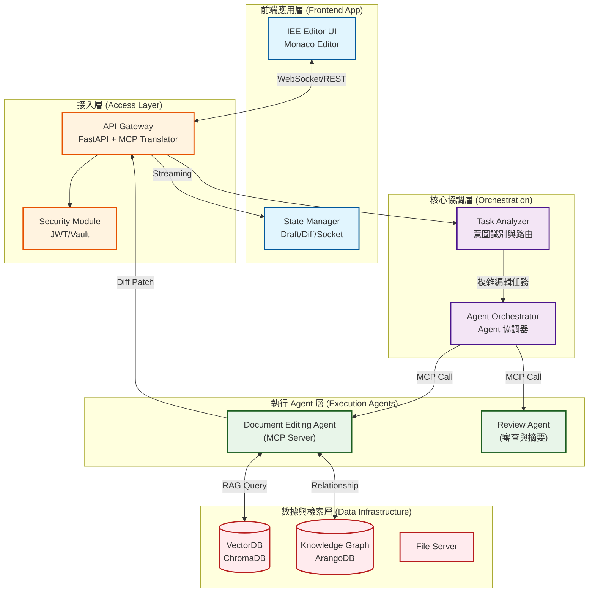

# AI-Box IEE 式 Markdown 文件編輯器開發規格書

<!-- Notion Page ID: 2ce10eba-142a-80f8-9dce-e46b779cf727 -->
<!-- Last synced: 2025-12-19T04:12:52.386Z -->
<!-- 可行性分析完成: 2025-01-27 -->
<!-- 規格書調整完成: 2025-01-27 -->

---

## 📋 文檔信息

- **版本**: 2.0 (已調整)
- **創建日期**: 2025-12-19
- **創建人**: Daniel Chung
- **最後修改日期**: 2025-01-27
- **可行性分析**: 已完成（見 `IEE編輯器可行性分析報告.md`）
- **可行性評分**: 9/10 (高度可行)

---

## 🔍 現有系統對應說明

本規格書已根據 AI-Box 現有系統架構進行調整。以下為現有系統已實現的功能：

### ✅ 已實現的基礎設施

1. **文件處理**: 已有 PDF、Word、Markdown 等解析器 (`services/api/processors/parsers/`)
2. **文件分塊**: 已有 `ChunkProcessor` (`services/api/processors/chunk_processor.py`)
3. **向量數據庫**: 已有 ChromaDB 完整集成 (`database/chromadb/`)
4. **知識圖譜**: 已有 ArangoDB 完整集成 (`database/arangodb/`)
5. **Agent 系統**: 已有 Orchestrator、Planning、Execution、Review Agents
6. **MCP 協議**: 已有完整的 MCP Server/Client 實現
7. **文件編輯**: 已有 `doc_patch_service.py` (支持 unified diff 和 JSON Patch)
8. **版本控制**: 已有基礎版本控制 (`doc_version` 字段)
9. **API Gateway**: 已有 FastAPI 後端 (`api/`)
10. **前端基礎**: 已有 React + TypeScript 前端 (`ai-bot/`)

### ⚠️ 需要實現的功能

1. **Monaco Editor 集成**: 前端編輯器組件
2. **IEE 編輯器界面**: 專門的編輯器頁面
3. **Search-and-Replace 協議**: 協議適配層
4. **WebSocket/SSE 流式傳輸**: 確認並實現（如需要）
5. **PDF/Word 轉 Markdown**: 增強現有解析器
6. **AST 驅動切片**: 增強現有分塊處理器
7. **Review Mode**: 審查模式界面
8. **Mermaid 渲染**: 圖表即時預覽

---

---

# 需求

## 摘要 (Executive Summary)

### 專案願景

開發「AI 驅動的長文件 IEE」,類似 代碼開發IDE，**用戶能透過與 AI 對話，對長篇 Markdown 文件（支持 PDF/Word 匯入）進行精準的局部編輯、內容插入及結構化更新（如 Mermaid 圖表）。系統強調「非侵入式編輯」，透過前端暫存、Diff 審查、版本提交**的流程，確保文檔的準確性與可追溯性。### 核心價值

  1. **精準定位：** 解決長文件中 AI 難以精確修改特定段落的痛點。
  1. **上下文理解：** 整合 RAG（向量檢索）與知識圖譜，使 AI 能理解跨章節、跨檔案的關聯。
  1. **結構化輸出：** 支持 Mermaid 流程圖即時渲染，讓文字與圖表同步協作。
  1. **安全控制：** 編輯內容需經人工審查（Review）與正式提交（Commit）後才生效。

### 系統架構與業務流程 (System Architecture & Workflow)

基於 **Agent AI Box** 的標準架構，本編輯器作為前端應用接入：



## 詳細描述 (Detailed Description)

### 1. 智慧文件處理 (Intelligent Ingestion)

系統不只是儲存文本，而是將文件「結構化」。透過 **Marker/LlamaParse** 確保複雜的 PDF 表格不跑掉。文件進入後，透過 **AST 切片技術** 保留標題層級，並將實體與關係存入知識圖譜，使 AI 不僅能「看見文字」，還能「理解邏輯」。### 2. 精準協作編輯 (Precision AI Editing)
捨棄「全量重寫」的低效模式，採用 **Search-and-Replace 協議**。  - **FIM (Fill-In-the-Middle)：** 當用戶在中間插入內容時，AI 具備預測上下文本的能力。

- **模糊匹配 (Fuzzy Match)：** 當用戶手動修改導致行號錯位時，系統能自動校準修改點。
- **Mermaid 整合：** AI 可直接生成流程圖代碼，並在編輯器中即時渲染為 SVG。

### 3. 前端暫存與視覺化 Diff (Draft & Diffing)

為了防止 AI 誤改，系統建立了一個「緩衝層」：  - **Shadow Model：** AI 的修改先套用在虛擬副本上。

- **視覺化回饋：** 比照 IDE 設計，用紅/綠色底色標註增刪內容，讓用戶在側邊欄一鍵 `Accept/Reject`。

### 4. 嚴謹的審查與提交 (Review & Submission)

文件修改後進入 **Review Mode**：  - **AI 摘要：** 提交前，AI 會自動總結本次修改了哪些重點，預填在 Commit Message 中。

- **增量同步：** 只有修改過的段落會重新進行向量化，節省 Token 並保持檢索系統的即時性。

---

# 大綱

**1. 系統架構與技術棧 (System Architecture & Tech Stack)**

- 1.1 前後端分離架構
- 1.2 編輯器核心選型
- 1.3 AI 模型與處理協議

**2. 文件處理與轉換模組 (Document Processing & Conversion)**

- 2.1 多格式匯入 (PDF/Word to MD)
- 2.2 Markdown 語義切片 (Chunking Strategy)
- 2.3 向量化與知識圖譜集成

**3. 前端編輯器實作細節 (Frontend Editor Implementation)**

- 3.1 狀態管理與版本暫存 (Draft Buffer)
- 3.2 局部 Diff 渲染與互動
- 3.3 Mermaid 圖表即時預覽引擎

**4. AI 編輯協議與指令集 (AI Editing Protocol)**

- 4.1 Search-and-Replace 局部修改機制
- 4.2 串流解析 (Streaming Parser)
- 4.3 上下文注入 (Context Injection) 策略

**5. 數據一致性與併發處理 (Consistency & Concurrency)**

- 5.1 偏移量校準 (Anchor Offset Correction)
- 5.2 提交與回滾機制 (Commit & Rollback)

**6. 非功能性需求與安全性 (Non-functional Requirements)**

- 6.1 Token 消耗優化
- 6.2 隱私與資料脫敏

# 1. 系統架構與技術棧 (System Architecture & Tech Stack)

### 1.1 前後端分離架構

- **前端 (Client Side):** 負責文檔的高性能渲染、用戶輸入攔截、Diff 狀態管理以及 Mermaid 圖形轉譯。採用單頁應用 (SPA) 模式以確保流暢的編輯體驗。
- **後端 (Server Side):** 負責長文檔的物理存儲、AI 任務編排、RAG 檢索增強、以及將 Word/PDF 等二進制格式解析為結構化 Markdown。
- **通訊協議:**
  - **WebSocket/SSE:** 用於 AI 編輯指令的流式傳輸 (Streaming)，實現「打字機式」的局部修改預覽。
  - **RESTful API:** 用於文件管理、版本提交及向量數據同步。

### 1.2 編輯器核心選型

- **主編輯器:** 建議選用 **Monaco Editor**。
  - **理由:** 內建強大的 `Diff Editor` 模式，支持 `Decorations` API，能輕易在行內顯示 AI 建議的變動，且具備 VS Code 級別的語法高亮。
- **Markdown 解析:** 使用 **unified / remark** 生態系統。
  - **理由:** 插件化架構，可精確控制 Markdown AST (抽象語法樹)，便於將 Mermaid 或自定義標籤（如 `@file`）與標準文本分離處理。

### 1.3 AI 模型與處理協議

- **模型選擇:**
  - **推理層:** GPT-4o 或 Claude 3.5 Sonnet（處理複雜指令與邏輯）。
  - **插入層:** DeepSeek-Coder 或 StarCoder (支持 FIM 模式，用於程式碼或結構化文本補全)。
- **結構化協議:** 強制要求模型遵循 **Search-and-Replace XML/JSON** 格式，避免全量生成，顯著降低長文檔處理的 Token 成本與時間延遲 (TTFT)。

### 1.3.1 通訊接口規格 (API Endpoints & MCP Schema)

本系統透過 **API Gateway** 暴露 FastAPI 接口，並在後端轉發為 **MCP Tool Calls**。

> **注意**: 現有系統已有部分文件編輯 API (`api/routers/docs_editing.py`)，新 API 需要與現有 API 集成或擴展。

#### **A. FastAPI Endpoints (Frontend -> Gateway)**

**1. 初始化編輯 Session** (需要實現)

- `POST /api/v1/editing/session/start`
- **Body**: `{ "doc_id": "uuid", "user_id": "uuid" }`
- **Response**: `{ "session_id": "uuid", "ws_url": "wss://.../stream" }`
- **備註**: 可基於現有的 `POST /api/v1/docs/create` 擴展

**2. 提交編輯指令 (Trigger Agent)** (需要實現)

- `POST /api/v1/editing/command`
- **Body**:

```json
{
  "session_id": "uuid",
  "command": "幫我優化這段程式碼",
  "cursor_context": {
    "file": "main.py",
    "line": 45,
    "selection": "def hello(): pass"
  }
}
```

- **備註**: 需要集成到現有的 Agent Orchestrator 系統

**現有相關 API** (可重用):

- `POST /api/v1/docs/create` - 創建編輯請求（已有）
- `GET /api/v1/docs/{request_id}/state` - 獲取編輯狀態（已有）
- `POST /api/v1/docs/{request_id}/apply` - 應用編輯（已有）

#### **B. MCP Tool Definition (Agent -> Editor)**

Agent 使用 `update_document` 工具來回傳結構化修改建議。

> **注意**: 現有系統已有 `doc_patch_service.py` 支持 unified diff 和 JSON Patch。Search-and-Replace 協議需要轉換為這兩種格式之一。

```json
{
  "name": "update_document",
  "description": "Apply search-and-replace patches to the document.",
  "inputSchema": {
    "type": "object",
    "properties": {
      "patches": {
        "type": "array",
        "items": {
          "type": "object",
          "properties": {
            "search_block": { "type": "string", "description": "Exact text to replace" },
            "replace_block": { "type": "string", "description": "New text content" },
            "confidence": { "type": "number", "description": "0.0-1.0 confidence score" }
          },
          "required": ["search_block", "replace_block"]
        }
      },
      "thought_chain": { "type": "string", "description": "Reasoning behind changes" }
    },
    "required": ["patches"]
  }
}
```

**實現建議**:

- 在 `doc_patch_service.py` 中添加 `search_replace_to_unified_diff()` 函數
- 將 Search-and-Replace 格式轉換為 unified diff 格式
- 使用現有的 `apply_unified_diff()` 函數應用修改

---

# 2. 文件處理與轉換模組 (Document Processing & Conversion)

### 2.1 多格式匯入 (PDF/Word to MD)

- **高保真轉換引擎：**
  - **PDF 處理：** 採用 **Marker** 或 **LlamaParse**。必須支持 OCR 識別、多欄位佈局解析以及表格自動 Markdown 化，避免傳統 PDF 解析導致的文字順序錯亂。
    - **現狀**: 已有 `PdfParser` (`services/api/processors/parsers/pdf_parser.py`)，使用 PyPDF2，只提取文本
    - **需要增強**: 集成 Marker/LlamaParse，實現 PDF 到 Markdown 的轉換
  - **Word 處理：** 使用 **Mammoth.js**。其核心策略是「由 HTML 映射 Markdown」，僅保留語意化標籤（標題、列表、加粗），剔除冗餘的 Office 樣式 XML，確保產出的 MD 乾淨且易於 AI 理解。
    - **現狀**: 已有 `DocxParser` (`services/api/processors/parsers/docx_parser.py`)，使用 python-docx，只提取文本
    - **需要增強**: 集成 Mammoth.js (Python 版本) 或實現 HTML 到 Markdown 的轉換
- **元數據保留：** 在轉換過程中，建立 `Original_Offset` 到 `Markdown_Line` 的映射表，用於後續回溯原始文件位置。

### 2.2 Markdown 語義切片 (Chunking Strategy)

- **結構化切片：** 捨棄固定字數切片，改採 **AST (Abstract Syntax Tree) 驅動切片**。
  - 以 Markdown 的 `H1` 至 `H3` 標題作為主要切割點。
  - **Context Window 補償：** 每個切片（Chunk）必須附帶其所屬的上層標題路徑（例如：`# 產品規格 > ## 功能描述 > ### 編輯器`），確保 AI 在處理局部片段時具備全局導航意識。
- **Token 負載平衡：** 單個 Chunk 大小控制在 500-1000 Tokens 之間，以優化向量檢索的精確度。

  **現狀**: 已有 `ChunkProcessor` (`services/api/processors/chunk_processor.py`)，支持語義分塊（基於段落/句子）

  **需要增強**:

- 集成 `unified/remark` 解析 Markdown AST
- 實現基於標題層級（H1-H3）的切片策略
- 在 metadata 中添加 `header_path` 字段（標題路徑）

### 2.3 向量化與知識圖譜集成 (Data Infrastructure)

- **雙路檢索系統 (Hybrid Retrieval)：**
  - **向量層 (Dense Retrieval)：** 使用 **ChromaDB** 存儲 Chunk Embeddings。
    - 模型：`text-embedding-3-small` 或同級模型。
    - 策略：Parent Document Retrieval (檢索小切片，回傳大切片)。
  - **圖譜層 (Knowledge Graph)：** 使用 **ArangoDB** 存儲實體關係。
    - 實體：`File`, `Section`, `Function`, `Variable`, `Requirement`。
    - 關係：`IMPORTS`, `CALLS`, `DEFINES`, `RELATES_TO`。

### **2.3.1 向量切片模型 (Vector Schema for ChromaDB)**

存儲於 ChromaDB 的 Metadata 結構定義：

```json
{
  "id": "doc_123_chunk_05",
  "embeddings": [0.012, -0.234, ...],  // 1536d Vector
  "document": "主編輯器建議選用 Monaco...", // Content for lexical search
  "metadatas": {
    "doc_id": "doc_123",
    "header_path": "# 系統架構 > ## 編輯器選型", # Breadcrumbs
    "start_line": 45,
    "end_line": 52,
    "last_modified": "2025-11-24T10:00:00Z"
  }
}
```

---

# 3. 前端編輯器實作細節 (Frontend Editor Implementation)

### 3.1 狀態管理與版本暫存 (Draft Buffer)

- **雙緩衝機制 (Double Buffering):**
  - **Stable State:** 存儲目前已保存的文件內容。
  - **Draft State:** 存儲用戶正在編輯或 AI 正在生成的內容。
- **暫存隊列 (Patch Queue):** AI 的所有修改建議不直接覆蓋原始文件，而是以 `Patch` 對象形式存在於內存。
  - 每個 `Patch` 包含：`id`, `range`, `content`, `status (pending/applied/rejected)`。
- **自動保存 (Auto-save):** 當用戶停止輸入 2 秒或手動點擊「保存」時，將 Draft State 同步至後端暫存區。

### **3.1.1 暫存物件介面 (Patch State Interface)**

前端 Redux/Zustand store 中管理的單個修改建議結構：讓前端工程師知道如何管理「建議視窗」的狀態，避免 UI 邏輯混亂

```typescript
interface AIPatch {
  id: string;                  // UUID
  originalRange: Range;        // Monaco Range (startLine, startCol...)
  originalText: string;        // 用於再次校驗的原始文本
  modifiedText: string;        // AI 建議的文本
  status: 'streaming' | 'pending_review' | 'accepted' | 'rejected';
  conflict: boolean;           // 是否檢測到用戶手動修改導致的衝突
}
```

### 3.2 局部 Diff 渲染與互動

- **Inline Diff 顯示:**
  - 利用 Monaco Editor 的 `setDecorations` 功能，將 AI 建議刪除的文字設為「紅底中劃線」，建議新增的文字設為「綠底」。
  - **側邊欄操作:** 在修改行的 Gutter（側邊欄）顯示 `Check (Accept)` 與 `Cross (Reject)` 圖標。
- **流式預覽 (Streaming Update):** 當後端 SSE (Server-Sent Events) 傳回 Token 時，前端即時在特定 Range 內渲染虛擬文字，而非等待全量回傳。

### 3.3 Mermaid 圖表即時預覽引擎

- **沙盒渲染 (Sandboxed Rendering):** 將 Mermaid 渲染邏輯放入 Web Worker，避免複雜圖表導致主執行緒阻塞。
- **雙模式顯示:**
  - **編輯模式:** 顯示 ` ```mermaid ` 源代碼。
  - **預覽模式:** 緊鄰代碼塊下方生成一個 SVG 渲染區域，支持縮放與導出為 PNG。
- **語法錯誤捕捉:** 若 Mermaid 語法不完整，預覽區顯示最近一次成功的快照並提示「語法錯誤中...」，而非顯示崩潰。

---

# 4. AI 編輯協議與指令集 (AI Editing Protocol)

### 4.1 Search-and-Replace 局部修改機制

- **指令格式：** 嚴格遵循 **MCP `update_document` Tool Schema** (JSON)，而非自由格式文本。
  - **格式範例：**

```json
{
  "patches": [
    {
      "search_block": "這是舊有的文案段落...",
      "replace_block": "這是 AI 修改後的精簡文案..."
    }
  ]
}
```

- **模糊匹配算法：** 當文件內容因用戶同時編輯而微幅變動時，後端使用 `Bitap` 算法進行模糊匹配，定位 `<search>` 片段的最接近位置。

  **現狀**: 已有 `doc_patch_service.py` 支持 unified diff 和 JSON Patch

  **需要實現**:

- 在 `doc_patch_service.py` 中添加 `search_replace_to_unified_diff()` 函數
- 實現 Search-and-Replace 到 unified diff 的轉換
- 實現模糊匹配算法（Bitap 或 Levenshtein Distance）

### 4.1.1 模糊匹配邏輯 (Fuzzy Logic)

當 searchBlock 無法精確匹配時，系統應執行以下 Fallback 策略 (Python 虛擬碼)：

```python
def locate_text(full_doc, search_block, cursor_pos):

```

  1. 嘗試精確查找

```python
 idx = full_doc.find(search_block)
 if idx != -1: return idx
```

  1. 去除空白後查找 (Normalized Match)
解決 AI 輸出時縮排不一致的問題

```python
norm_doc = remove_whitespace(full_doc)
norm_search = remove_whitespace(search_block)
if norm_search in norm_doc:
return map_index_back(norm_doc, full_doc)
```

  1. 限制範圍的模糊查找 (Levenshtein Distance)
僅在游標附近 +/- 1000 字範圍內搜索，容錯率 80%

```python
local_window = get_window(full_doc, cursor_pos, 1000)
match = fuzzy_search(local_window, search_block, cutoff=0.8)
return match.index if match else Error("Locate Failed")
```

---

### 4.2 串流解析 (Streaming Parser)

- **即時解析器：** 建立前端流式解析狀態機（State Machine）。當 WebSocket 接收到 `<replace>` 標籤開始時，前端立即在編輯器定位並開啟「修改中」的視覺效果，不需等待整個 Response 結束。
- **終止保護：** 若流式傳輸中斷，系統自動回滾該次 `Pending Patch`，避免殘留損毀的標籤。

  **需要確認**: 現有系統是否已實現 WebSocket/SSE 流式傳輸

- 如果已實現，需要確認協議格式是否匹配
- 如果未實現，需要實現 WebSocket/SSE 支持

### 4.3 上下文注入 (Context Injection) 策略

- **動態上下文窗：** 根據當前游標位置，自動抓取以下資訊：
    1. **文件大綱：** 所有的 `#` 標題及其層級。
    1. **局部細節：** 游標前後各 2,000 字的完整文本。
    1. **外部參考：** 用戶使用 `@` 提及的文件片段。

### 4.3.1 System Prompt 組裝範本

後端在發送請求給 LLM 時，Prompt 的組裝順序如下：> `[System Role]
你是文檔編輯專家，必須嚴格遵守 XML 輸出協議。(注入協議定義...)`
> [Knowledge Context (RAG)]
參考資料 (來自向量庫):
> [Current Editing Window]
檔案: {{filename}}
游標位置: 第 {{line_num}} 行
> [Code/Text Context]
> (游標所在行)
 ... (游標後 50 行) ...
> [User Instruction]
{{user_query}}
---

# 5. 數據一致性與併發處理 (Consistency & Concurrency)

### 5.1 偏移量校準 (Anchor Offset Correction)

- **問題對策：** 使用 **LWW-Element-Set (Last-Write-Wins)** 或 **OT (Operational Transformation)** 的簡化版。
- **機制：** 當 AI 生成建議時，記錄該片段的 `Base_Version_ID`。若用戶在 AI 思考期間修改了文件，前端比對版本號，若版本衝突，則提示用戶「文件已更動，請重新套用修改」。

### 5.2 提交與回滾機制 (Commit & Rollback)

- 二階段提交： 1. Apply (應用)： 將 AI 建議寫入 Draft State，用戶可自由撤銷（Undo）。

2. Commit (提交)： 用戶點擊「確認」後，前端發送請求至後端，後端更新資料庫並觸發 向量庫重新索引 (Re-indexing)。  - **版本快照：** 每次 `Commit` 自動生成一個 Git-like 的 Snapshot，支持一鍵還原至 AI 介入前的狀態。

  **現狀**: 已有基礎版本控制

- `POST /api/v1/docs/{request_id}/apply` - 應用編輯（已有）
- `doc_version` 字段追蹤版本（已有）
- 版本信息存儲在 `file_metadata.custom_metadata.doc_versions`（已有）

  **需要增強**:

- 實現增量向量化（僅重新索引修改的 Chunks）
- 實現版本快照的完整存儲和回滾功能

---

# 6.文件審查與發布流程 (Document Review & Submission)

### 文件審查與發布流程 (Document Review & Submission)

此模組負責將「Draft State」的變更正式合併至「Stable State」，並處理版本紀錄與向量索引的更新。### 6.1 AI 智慧變更摘要 (AI Change Summarization)
當用戶準備提交時，系統不應只列出 Diff，而應由 AI 自動生成「人類可讀」的變更日誌。  - **功能邏輯：**
    1. 收集本次 Session 中所有的 Accepted Patches。
    1. 發送至 LLM，Prompt 指令：「請將以下 5 個修改片段，總結為一份 200 字以內的變更日誌 (Changelog)，列點說明增加了什麼、刪除了什麼。」
    1. **UI 呈現：** 在提交視窗中預填這份 Summary，用戶可手動微調。

### 6.2 全局審查模式 (Global Review Mode)

提供一個獨立的「Review View」，而非編輯模式。  - **雙欄對比 (Side-by-side Diff)：**
    - **左側：** 上一次 Commit 的原始版本。
    - **右側：** 包含所有 AI 修改後的預覽版本。
    - **技術實作：** 使用 `MonacoDiffEditor` 元件，設置 `originalModel` 為 DB 中的舊版，`modifiedModel` 為當前的 Draft。

- **逐條確認 (Hunk Navigation)：**
  - 用戶可以點擊「上一個變更 / 下一個變更」按鈕，快速跳轉檢視修改點，防止在長文件中遺漏細節。

### 6.3 提交流水線 (Submission Pipeline)

點擊「確認提交」後，後端需執行原子化操作 (Atomic Operation)：  1. **Merge & Save:** 將 Draft 內容寫入主存儲 (File Storage / DB)。

  1. **Snapshot:** 建立版本快照 (Version v1.x)，允許隨時 Rollback。
  1. **Re-indexing (關鍵):**
    - **增量更新 (Incremental Update):** 僅針對**有變動的 Chunks** 重新計算 Embedding 並更新至 Vector DB，避免全量重建索引導致高昂成本。
    - **圖譜更新:** 若變更涉及實體定義，同步更新 Graph DB 中的關係。

### 6.3.1 提交 API (Submission Endpoint)

**提交接口 (FastAPI)**

> **注意**: 現有系統已有 `POST /api/v1/docs/{request_id}/apply` API，新 API 可以基於此擴展或作為別名。

- `POST /api/v1/editing/commit` (新 API，建議實現)
- 或使用現有: `POST /api/v1/docs/{request_id}/apply` (已有)

- **Body**:

```json
{
  "doc_id": "uuid",
  "base_version_id": "uuid",
  "summary": "AI 生成並經用戶確認的變更摘要",
  "content": "最終合併後的完整 Markdown 內容"
}
```

- **Response**:

```json
{
  "new_version_id": "uuid",
  "timestamp": "ISO8601",
  "reindexed_chunks": 5
}
```

**現有 API 對應**:

- `POST /api/v1/docs/{request_id}/apply` - 應用編輯（已有，返回 `new_version`）
- 需要增強: 添加 `reindexed_chunks` 字段到響應中

### 6.3.2 版本控制模型 (Version Control Schema)

**版本紀錄表 (DB Schema)**
用於支援 Rollback 與 Changelog 顯示。

> **注意**: 現有系統使用 ArangoDB 存儲版本信息，版本信息存儲在 `file_metadata.custom_metadata.doc_versions` 數組中。

**現有實現** (ArangoDB):

- Collection: `file_metadata`
- 版本信息存儲在 `custom_metadata.doc_versions` 數組中
- 每個版本包含: `version`, `version_file_id`, `storage_path`, `summary`, `request_id`

**版本結構** (現有):

```python
{
  "version": 1,
  "version_file_id": "uuid",
  "storage_path": "data/tasks/{task_id}/workspace/{filename}",
  "summary": "新增了章節 5.2 並修正了 Mermaid 語法",
  "request_id": "uuid"
}
```

**需要增強**:

- 添加 `created_at` 和 `created_by` 字段
- 實現完整的版本查詢和回滾 API

# 7. 非功能性需求與安全性 (Non-functional Requirements)

### 7.1 Token 消耗優化

- **緩存層 (Caching)：** 對於頻繁查詢的圖譜與向量片段建立緩存，減少重複調用 Embedding 模型。
- **摘要化 (Summarization)：** 針對超過 100,000 字的超長文檔，在 RAG 檢索前先進行「章節摘要」，AI 優先閱讀摘要後再決定深入檢索哪些區塊。

### 7.2 隱私與資料脫敏

- **在地化處理：** PDF 與 Word 轉換過程應在私有伺服器完成，不依賴第三方雲端轉換 API。
- **敏感資訊屏蔽：** 在發送給 AI 模型前，利用正則表達式（Regex）過濾文件中的敏感資訊（如身份證號、API Keys）。

---

# 8.「Search-and-Replace 協議」設計的系統提示詞（System Prompt）範本

## 後端 Prompt 範本：精準局部編輯協議

**Role:** 你是一個專業的文檔編輯助手。你的任務是根據用戶要求，對 Markdown 文件進行精確的局部修改。**Constraints:**  1. **禁止重寫全文**：僅輸出需要修改的部分。

  1. **格式要求**：你必須使用以下 XML 格式輸出所有的修改指令：

```json
{
  "patches": [
    {
      "search_block": "需要被替換的原始文本（必須與原文件完全一致）",
      "replace_block": "修改後的新文本"
    }
  ]
}
```

  1. **精確匹配**：`<search>` 標籤內的內容必須是原文件中真實存在的片段（包含空格、換行與縮排）。
  1. **多處修改**：若有多處修改，請並列多組 `<edit>` 區塊。
  1. **插入操作**：若要插入新內容，請在 `<search>` 中定位插入點的前一段文字，並在 `<replace>` 中包含該段文字加上新內容。
**Context:**  - **當前檔案路徑**：`{{file_path}}`

- **目前處理片段 (Context Chunk)**：

```xml
{{file_content_chunk}}
```

User Request:"{{user_query}}"Output Requirement:直接開始輸出 <edit> 指令，不要解釋「好的，我幫你修改了」或「根據您的要求」。---

### 實際應用案例說明

假設用戶要求：「在『系統架構』標題下增加一個關於『快取機制』的子章節，並使用 Mermaid 圖表描述。」**AI 的理想輸出範本：**

```xml
`update_document` Tool Call Example:
```json
{
  "patches": [
    {
      "search_block": "### 1.1 編輯器核心選型\n* **主編輯器:** 建議選用 **Monaco Editor**。",
      "replace_block": "### 1.2 編輯器核心選型\n* **主編輯器:** 建議選用 **Monaco Editor**。\n\n### 1.3 快取機制\n為了優化長文件處理效能，系統採用 Redis 進行分層快取..."
    }
  ]
}
```

## 技術實作關鍵點

  1. **Context 截斷**：傳送給 AI 的 `{{file_content_chunk}}` 應該是游標所在位置的前後各 2,000 - 4,000 字，而不是整份 10 萬字的文件。
  1. **後端校驗**：
    1. 後端收到回傳後，先用 `string.includes(search_text)` 檢查。
    1. 如果匹配失敗，嘗試使用 **Fuzzy Matching (模糊匹配)** 算法（如 Levenshtein Distance）找到最接近的行，容許 AI 在換行符號上的細微誤差。
  1. **串流攔截 (Streaming)**：當後端偵測到 `<replace>` 標籤出現，立即將後續內容透過 WebSocket 推送給前端，前端即可開始在編輯器中渲染綠色的「建議修改區」。

---

# 9. IEE Agent 自動化與工具協作協議 (Agentic Automation)

### 9.1 核心理念：隱形化技術細節

IEE 旨在消除用戶在「聊天視窗」與「文件編輯器」之間的複製貼上行為。Agent 不僅提供建議，還具備「手腳」來執行任務，並將結果直接反映在文檔中。### 9.2 多 Agent 協作任務流 (Multi-Agent Orchestration)
系統支援不同專業的 Agent 協作，由 **Orchestrator (協調者)** 進行任務分配：- **Runner Agent (執行者)：** 負責在沙盒中執行 Python 或 Shell 指令（例如性能測試 `comprehensive_test.py`）。

- **Editor Agent (編修者)：** 負責將 Runner 的執行結果，透過 Search-and-Replace 協議寫入文檔。

**現狀**: 已有完整的 Agent 系統

- Orchestrator: `agents/orchestrator/`
- Execution Agent: `agents/execution/`
- Planning Agent: `agents/planning/`
- Review Agent: `agents/review/`

**需要增強**:

- 擴展 Execution Agent 為 Document Editing Agent
- 實現 Search-and-Replace 協議的 MCP Tool
- 集成到現有的 Agent Orchestrator

### 9.3 隱藏式沙盒執行環境 (Execution Sandbox)

為了安全性與用戶體驗，所有的代碼執行必須在隔離環境中完成，且對用戶屏蔽代碼细节。- **工具定義 (Tool Call)：** Agent 擁有 `execute_script(lang, code)` 工具。

- **自動化範例：**
  - 用戶指令：「檢查這份文件的效能指標。」
  - **Agent 行為：** 自動生成並執行 `python3 /tmp/test_performance/comprehensive_test.py 2>&1 | head -100`。
  - **IEE 呈現：** 用戶僅看到狀態列顯示「正在分析效能...」，隨後文件中自動出現效能報告表格。

### 9.4 Agent 編輯指令交互 (Agent-to-Editor Protocol)

Agent 與 IEE 交互時，必須遵循以下「非侵入式」路徑：1. **意圖解析：** Agent 決定修改文檔。

1. **工具呼叫：** 調用 `edit_document` 工具，發送 XML Patch。
1. **UI 觸發：** 編輯器進入「建議模式」，用戶看到綠色高亮預覽，只需點擊 `[確認]`。

### 9.5 流程自動化介面 (Workflow UI/UX)

- **狀態標籤 (Status Tags)：** 取代傳統 IDE 的 Terminal，使用「Agent 正在運算數據...」等自然語言描述當前任務。
- **一鍵轉換 (One-click Conversion)：** 聊天序列中生成的有用數據，Agent 應主動詢問：「是否將此數據轉化為表格並插入第 4 章？」消除手動搬運。

---

# 10. 模組化文檔架構與動態組裝協議 (Modular Document & Assembly)

### 10.1 核心設計：1+N 主從架構

為應對超長文件（如技術規範、標案說明書），系統捨棄單一巨型檔案模式，採用「模組化分寫」標準：- **主文 (Master Document)**：僅包含背景、摘要、目錄大綱及各分段的引用鏈接。

- **分文 (Sub-sections)**：根據大綱拆分的獨立 Markdown 檔案，專注於具體章節內容。
- **關聯標準**：採用 Transclusion（嵌入式引用）語法 `![[filename]]` 進行關聯，而非傳統超連結。

### 10.2 智慧鏈接與解構 (Link Parsing & Deconstruction)

- **自動化拆解**：當用戶匯入長篇 PDF/Word 時，**IEE 協調器 (Orchestrator)** 會依據 H1-H3 標題自動切分並產生「主文」與「N 個分文」。
- **Agent 定位轉向**：當用戶與 Agent 對話「修改第一章」時，Agent 會自動識別主文中的引用鏈接，直接將 **Search-and-Replace** 指令定向至對應的分文檔案。

### 10.3 虛擬合併預覽 (Virtual Aggregation Rendering)

為了不打破用戶的「心流」體驗，前端編輯器需具備虛擬組裝能力：- **無縫滾動 (Seamless Scrolling)**：用戶在主文捲動時，系統自動異步加載（Lazy Loading）分文內容，在介面上呈現如同單一文件的連續視感。

- **跨檔案同步**：主文大綱標題的更動，應同步更新至對應分文的元數據（Metadata）中。

### 10.4 導出編譯引擎 (Compilation Engine)

在產生最終 PDF 或 Word 檔案時，系統執行「編譯（Compile）」流程：1. **標題層級校準 (Header Normalization)**：根據分文在主文中的嵌套層級，自動調整標題等級（例如：分文內的 `#` 若嵌入在主文 `##` 下，導出時自動降級為 `###`）。

1. **變數注入**：將主文定義的全局變數（如專案名稱、日期）自動填充至各分文的占位符中。
1. **格式統一化**：利用 **Pandoc** 進行最終排版渲染，確保字體、間距、引用格式在合併後完全一致。

### 10.5 模組化架構的 Agent 效益

- **並行處理**：允許不同的 Agent 同時處理不同的分文（例如：Runner Agent 處理數據分文，Editor Agent 處理文字分文），互不干擾。
- **精準 RAG**：向量檢索可精確鎖定至「分文檔案」，提升檢索後的 Context 質量與回答準確度。
