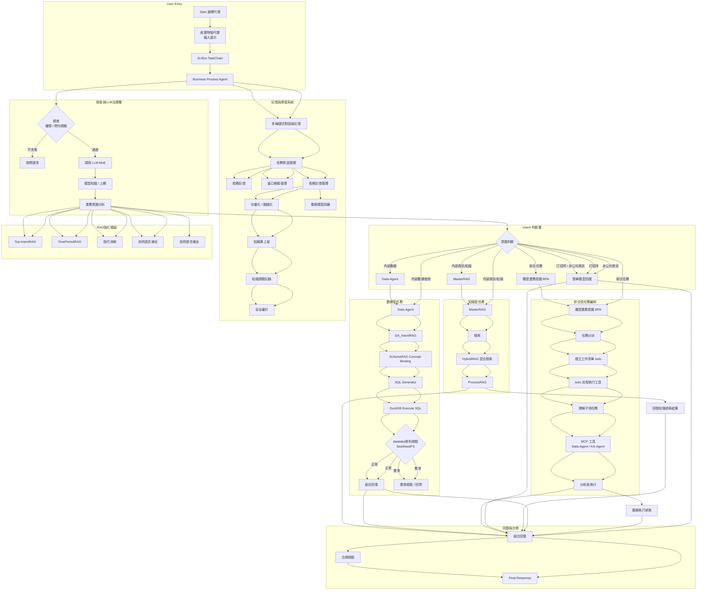

```mermaid
flowchart TD

%% =================================================
%% 1️⃣ 使用者入口層
%% =================================================

subgraph ENTRY[User Entry]
A[Start 選擇代理] --> B[經寶物管代理<br>輸入提示]
B --> C[AI-Box TaskChain]
C --> D[Business Process Agent]
end

%% =================================================
%% 2️⃣ 前置檢查與LLM層
%% =================================================

subgraph GOVERNANCE[檢查與LLM治理層]
D --> E{檢查<br>權限 / 問句規範}
E -->|不清晰| Q1[詢問澄清]
E -->|通過| F[調用 LLM MoE]
F --> G[模型知識 / 上網]
G --> H[業務意圖分析]
end

%% =================================================
%% 3️⃣ 意圖判斷層
%% =================================================

subgraph INTENT_LAYER[Intent 判斷層]
H --> I{意圖判斷}

I -->|打招呼 / 非公司資訊| S1[簡單模型回復]

I -->|內部資訊/知識| K0[MasterRAG]

I -->|內部數據| D0[Data-Agent]

I -->|綜合任務| T0[確認業務意圖 BPA]
end

%% =================================================
%% 4️⃣ 知識型任務
%% =================================================

subgraph KNOWLEDGE_TASK[知識型任務]
K0 --> K1[檢索]
K1 --> K2[HybridRAG]
K2 --> K3[ProcessRAG]
K3 --> K4[回復知識檢索結果]
end

%% =================================================
%% 5️⃣ 數據型任務
%% =================================================

subgraph DATA_TASK[數據型任務]
D0 --> D1[查詢意圖]
D1 --> D2[DA_IntentRAG]
D2 --> D3[SchemaRAG Concept Binding]
D3 --> D4[SQL Generator]
D4 --> D5[DuckDB Execute SQL]

D5 --> D6{SeaWeedFS datalake資料檢驗}
D6 -->|正常| D7[組合回復]
D6 -->|異常| D8[異常檢驗 / 回問]
end

%% =================================================
%% 6️⃣ 綜合任務（Orchestrator）
%% =================================================

subgraph ORCHESTRATOR[綜合性任務編排]
T0 --> T1[任務分派]
T1 --> T2[建立工作清單 todo]
T2 --> T3[todo 流程執行工具]
T3 --> T4[理解子項任務]

T4 --> T5[MCP 工具<br>Data-Agent / KA-Agent]
T5 --> T6[分析與執行]
T6 --> T7[匯報執行狀態]
end

%% =================================================
%% 7️⃣ 記憶與學習層
%% =================================================

subgraph MEMORY_LAYER[記憶與學習系統]
D --> M1[多輪鏈式對話與記憶]
M1 --> M2[任務對話管理]
M2 --> M3[短期記憶]
M2 --> M4[窗口移動管理]
M2 --> M5[長期記憶管理]

M5 --> M6[向量化 / 圖譜化]
M6 --> M7[知識庫上架]
M7 --> M8[知識調閱記錄]
M8 --> M9[安全審計]

M5 --> M10[動態模型訓練]
end

%% =================================================
%% 8️⃣ 強化RAG模組
%% =================================================

subgraph RAG_ENHANCEMENT[RAG強化模組]
H --> R1[Top-IntentRAG]
H --> R2[OrchestratorIntentRAG]
H --> R3[MM_IntentsRAG]
H --> R4[指代消解]
H --> R5[自然語言補全]
end

%% =================================================
%% 9️⃣ 合規與回復
%% =================================================

subgraph RESPONSE[回復與合規]
K4 --> Z[組合回復]
D7 --> Z
T7 --> Z
S1 --> Z

Z --> C1[合規檢驗]
C1 --> END[Final Response]
end
%% 2️⃣ 意圖分類
%% =========================

I -->|打招呼| S1[簡單模型回復]
I -->|非公司資訊| S1
I -->|內部資訊/知識| K1[MasterRAG]
I -->|內部數據查詢| D1[Data-Agent]
I -->|綜合任務| T1[確認業務意圖 BPA]

%% =========================
%% 3️⃣ 知識型流程
%% =========================

K1 --> K2[檢索]
K2 --> K3[HybridRAG 混合檢索]
K3 --> K4[ProcessRAG]
K4 --> K5[回復知識檢索結果]

%% =========================
%% 4️⃣ 數據型流程
%% =========================

D1 --> D2[DA_IntentRAG]
D2 --> D3[SchemaRAG Concept Binding]
D3 --> D4[SQL Generator]
D4 --> D5[DuckDB Execute SQL]

D5 --> D6{datalake資料檢驗<br>SeaWeedFS}
D6 -->|正常| D7[組合回復]
D6 -->|異常| D8[異常檢驗 / 回問]

%% =========================
%% 5️⃣ 綜合任務流程
%% =========================

T1 --> T2[任務分派]
T2 --> T3[建立工作清單 todo]
T3 --> T4[todo 流程執行工具]
T4 --> T5[理解子項任務]
T5 --> T6[MCP 工具<br>Data-Agent / KA-Agent]
T6 --> T7[分析與執行]
T7 --> T8[匯報執行狀態]

%% =========================
%% 6️⃣ 記憶與對話管理
%% =========================

D --> M1[多輪鏈式對話與記憶]
M1 --> M2[任務對話管理]
M2 --> M3[短期記憶]
M2 --> M4[窗口移動管理]
M2 --> M5[長期記憶管理]

M5 --> M6[向量化 / 圖譜化]
M6 --> M7[知識庫上架]
M7 --> M8[知識調閱記錄]
M8 --> M9[安全審計]

%% =========================
%% 7️⃣ 補強能力
%% =========================

H --> R1[Top-IntentRAG]
H --> R2[TimePeriodRAG]
H --> R3[指代消解]
H --> R4[自然語言補全]

%% =========================
%% 8️⃣ 最終回復
%% =========================

K5 --> Z[組合回復]
D7 --> Z
T8 --> Z
S1 --> Z

Z --> END[Final Response]
```
