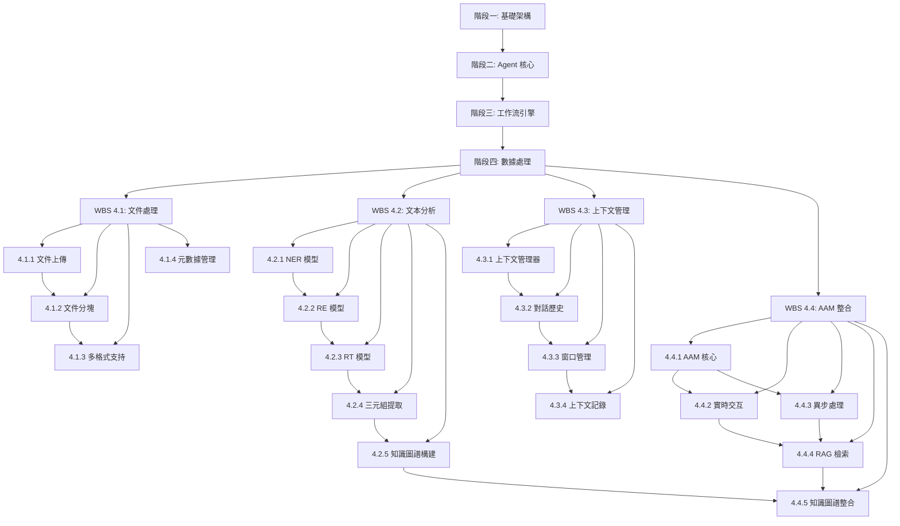

<!--
代碼功能說明: WBS 階段四 數據處理子計劃
創建日期: 2025-11-26 23:05 (UTC+8)
創建人: Daniel Chung
最後修改日期: 2025-11-26 23:05 (UTC+8)
-->

# WBS 階段四：數據處理子計劃

## 1. 背景與目標

### 1.1 背景

根據 [AI-Box 架構規劃](../../../Notion/pages/AI-Box/AI-Box-架構規劃.md) 和 [實施路線圖-WBS](../../../Notion/pages/AI-Box/plans2/實施路線圖-WBS.md)，階段四專注於實現完整的數據處理流水線，包括文件處理、文本分析、上下文管理和記憶增強模組（AAM）整合。

### 1.2 目標

- 實現完整的文件上傳、分塊、向量化流程
- 整合 NER/RE/RT 模型，實現知識圖譜自動構建
- 實現上下文管理系統，支持對話歷史和上下文窗口管理
- 整合 AAM 模組，實現混合 RAG 檢索和知識圖譜構建

### 1.3 總工期

**29.5 個工作日**（約 6 週）

---

## 2. 範圍

### 2.1 包含範圍

- **WBS 4.1**: 文件處理流程實現（6 天）
- **WBS 4.2**: 文本分析流程實現（NER/RE/RT）（9 天）
- **WBS 4.3**: 上下文管理實現（5.5 天）
- **WBS 4.4**: AAM 模組整合（9 天）

### 2.2 不包含範圍

- LLM MoE 路由實現（階段五）
- 高可用部署（階段六）
- 性能優化與測試（階段七）

### 2.3 依賴關係

- **前置依賴**: 階段一（基礎架構）、階段二（Agent 核心）、階段三（工作流引擎）
- **後續依賴**: 階段五（LLM MoE）、階段六（高可用部署）

---

## 3. 工作拆解

### 3.1 WBS 4.1: 文件處理流程實現

**總工期**: 6 天
**優先級**: P0（關鍵路徑）

#### 3.1.1 任務 4.1.1: 文件上傳處理（1.5 天）

**目標**: 實現文件上傳、格式驗證、存儲功能

**實施步驟**:

1. **API 端點設計**
   - 在 `services/api/routers/` 下建立 `file_upload.py`
   - 實現 `POST /api/v1/files/upload` 端點
   - 支持多文件上傳（multipart/form-data）
   - 實現文件大小限制（配置化，預設 100MB）

2. **文件格式驗證**
   - 建立 `services/api/utils/file_validator.py`
   - 支持格式：PDF、DOCX、TXT、MD、CSV、JSON
   - 實現 MIME 類型驗證
   - 實現文件內容驗證（防止惡意文件）

3. **文件存儲**
   - 建立 `services/api/storage/file_storage.py`
   - 實現本地文件系統存儲（預設）
   - 預留 S3/OSS 等雲存儲接口
   - 實現文件元數據記錄（文件名、大小、類型、上傳時間、用戶ID）

4. **配置管理**
   - 在 `config/config.example.json` 添加 `file_upload` 配置：

     ```json
     "file_upload": {
       "max_file_size": 104857600,
       "allowed_extensions": [".pdf", ".docx", ".txt", ".md", ".csv", ".json"],
       "storage_backend": "local",
       "storage_path": "./datasets/files",
       "enable_virus_scan": false
     }
     ```

**交付物**:

- `services/api/routers/file_upload.py`
- `services/api/utils/file_validator.py`
- `services/api/storage/file_storage.py`
- `config/config.example.json` 更新
- 單元測試：`tests/api/test_file_upload.py`

**驗收標準**:

- 支持多文件上傳（至少 5 個文件同時上傳）
- 文件格式驗證準確率 100%
- 文件存儲成功後返回文件 ID 和元數據
- API 響應時間 < 2 秒（單文件 < 10MB）

---

#### 3.1.2 任務 4.1.2: 文件分塊處理（1.5 天）

**目標**: 實現文件分塊、Chunk 生成功能

**實施步驟**:

1. **分塊策略設計**
   - 建立 `services/api/processors/chunk_processor.py`
   - 實現固定大小分塊（預設 512 tokens）
   - 實現滑動窗口分塊（overlap 20%）
   - 實現語義分塊（基於段落、句子邊界）

2. **多格式解析器**
   - 建立 `services/api/processors/parsers/` 目錄
   - 實現 `pdf_parser.py`（使用 PyPDF2 或 pdfplumber）
   - 實現 `docx_parser.py`（使用 python-docx）
   - 實現 `txt_parser.py`（純文本處理）
   - 實現 `md_parser.py`（Markdown 解析，保留結構）

3. **Chunk 元數據管理**
   - 每個 Chunk 包含：`chunk_id`、`file_id`、`chunk_index`、`text`、`metadata`
   - Metadata 包含：`start_position`、`end_position`、`page_number`（PDF）、`section`（MD）

4. **批量處理**
   - 實現異步處理（使用 Celery 或 FastAPI BackgroundTasks）
   - 支持大文件分塊（> 10MB）的後台處理
   - 實現處理進度查詢 API

**交付物**:

- `services/api/processors/chunk_processor.py`
- `services/api/processors/parsers/pdf_parser.py`
- `services/api/processors/parsers/docx_parser.py`
- `services/api/processors/parsers/txt_parser.py`
- `services/api/processors/parsers/md_parser.py`
- `services/api/routers/chunk_processing.py`（處理進度查詢）
- 單元測試：`tests/api/test_chunk_processor.py`

**驗收標準**:

- 支持 PDF、DOCX、TXT、MD 格式解析
- 分塊準確率 > 95%（不截斷句子）
- 10MB PDF 文件分塊處理時間 < 30 秒
- Chunk 元數據完整性 100%

---

#### 3.1.3 任務 4.1.3: 多格式支持（2 天）

**目標**: 擴展支持更多文件格式

**實施步驟**:

1. **擴展解析器**
   - 實現 `csv_parser.py`（CSV 表格解析）
   - 實現 `json_parser.py`（JSON 結構化數據解析）
   - 實現 `html_parser.py`（HTML 內容提取，使用 BeautifulSoup）
   - 實現 `xlsx_parser.py`（Excel 文件解析，使用 openpyxl）

2. **格式適配器模式**
   - 建立 `services/api/processors/parsers/base_parser.py`（抽象基類）
   - 所有解析器繼承基類，實現統一接口
   - 實現解析器註冊機制（Factory Pattern）

3. **錯誤處理與回退**
   - 實現解析失敗回退機制（降級為純文本提取）
   - 實現格式檢測失敗處理
   - 記錄解析錯誤日誌

4. **性能優化**
   - 實現解析器緩存（相同文件不重複解析）
   - 實現並行解析（多文件同時處理）
   - 優化大文件內存使用（流式處理）

**交付物**:

- `services/api/processors/parsers/base_parser.py`
- `services/api/processors/parsers/csv_parser.py`
- `services/api/processors/parsers/json_parser.py`
- `services/api/processors/parsers/html_parser.py`
- `services/api/processors/parsers/xlsx_parser.py`
- `services/api/processors/parser_factory.py`
- 單元測試：`tests/api/test_parsers.py`

**驗收標準**:

- 支持至少 8 種文件格式（PDF、DOCX、TXT、MD、CSV、JSON、HTML、XLSX）
- 格式檢測準確率 > 98%
- 解析錯誤率 < 2%
- 所有格式解析時間 < 文件大小（MB）* 3 秒

---

#### 3.1.4 任務 4.1.4: 文件元數據管理（1 天）

**目標**: 實現文件元數據提取、存儲、查詢功能

**實施步驟**:

1. **元數據模型設計**
   - 建立 `services/api/models/file_metadata.py`
   - 定義元數據 Schema（Pydantic Model）
   - 包含字段：`file_id`、`filename`、`file_type`、`file_size`、`upload_time`、`user_id`、`tags`、`description`、`custom_metadata`

2. **元數據存儲**
   - 使用 ArangoDB 存儲文件元數據（`entities` 集合，`type: "file"`）
   - 實現元數據 CRUD 操作
   - 實現元數據索引（文件名、類型、上傳時間、用戶ID）

3. **元數據提取**
   - 實現自動元數據提取（文件大小、類型、上傳時間）
   - 支持用戶自定義元數據（tags、description）
   - 實現元數據更新 API

4. **元數據查詢**
   - 實現 `GET /api/v1/files/{file_id}/metadata` 查詢單個文件元數據
   - 實現 `GET /api/v1/files/metadata` 查詢文件列表（支持篩選、排序、分頁）
   - 實現全文搜索（基於文件名、描述、tags）

**交付物**:

- `services/api/models/file_metadata.py`
- `services/api/services/file_metadata_service.py`
- `services/api/routers/file_metadata.py`
- 單元測試：`tests/api/test_file_metadata.py`

**驗收標準**:

- 元數據存儲成功率 100%
- 元數據查詢響應時間 < 500ms
- 支持至少 5 種篩選條件（類型、大小、時間範圍、用戶、tags）
- 全文搜索準確率 > 90%

---

### 3.2 WBS 4.2: 文本分析流程實現（NER/RE/RT）

**總工期**: 9 天
**優先級**: P0（關鍵路徑）

#### 3.2.1 任務 4.2.1: NER 模型整合（2 天）

**目標**: 整合命名實體識別模型、實現實體提取

**實施步驟**:

1. **NER 模型選擇與配置**
   - 評估可用模型：spaCy、transformers（BERT-based NER）、Ollama 本地模型
   - 在 `config/config.example.json` 添加 NER 配置：

     ```json
     "text_analysis": {
       "ner": {
         "model_type": "spacy",
         "model_name": "zh_core_web_sm",
         "fallback_model": "ollama:qwen3-coder:30b",
         "enable_gpu": false,
         "batch_size": 32
       }
     }
     ```

2. **NER 服務封裝**
   - 建立 `services/api/services/ner_service.py`
   - 實現統一的 NER 接口（抽象不同模型實現）
   - 實現模型加載與緩存機制
   - 實現批量實體識別（提高效率）

3. **實體類型定義**
   - 定義標準實體類型：`PERSON`、`ORG`、`LOC`、`DATE`、`MONEY`、`PRODUCT`、`EVENT` 等
   - 支持自定義實體類型（領域特定）
   - 實現實體類型映射（不同模型實體類型統一化）

4. **實體提取結果格式**
   - 定義實體結果 Schema：

     ```python
     {
       "text": "實體文本",
       "label": "實體類型",
       "start": 0,
       "end": 5,
       "confidence": 0.95
     }
     ```

**交付物**:

- `services/api/services/ner_service.py`
- `services/api/models/ner_models.py`（實體結果 Schema）
- `config/config.example.json` 更新
- 單元測試：`tests/api/test_ner_service.py`
- 性能測試腳本：`scripts/performance/test_ner_performance.py`

**驗收標準**:

- 支持至少 2 種 NER 模型（spaCy + Ollama 備選）
- 實體識別準確率 > 85%（中文文本）
- 批量處理速度 > 1000 tokens/秒
- API 響應時間 < 3 秒（單次請求，< 1000 tokens）

---

#### 3.2.2 任務 4.2.2: RE 模型整合（2 天）

**目標**: 整合關係抽取模型、實現關係提取

**實施步驟**:

1. **RE 模型選擇與配置**
   - 評估可用模型：基於 BERT 的關係抽取模型、Ollama 本地模型
   - 在 `config/config.example.json` 添加 RE 配置：

     ```json
     "text_analysis": {
       "re": {
         "model_type": "transformers",
         "model_name": "bert-base-chinese",
         "fallback_model": "ollama:qwen3-coder:30b",
         "enable_gpu": false,
         "max_relation_length": 128
       }
     }
     ```

2. **RE 服務封裝**
   - 建立 `services/api/services/re_service.py`
   - 實現關係抽取接口
   - 實現實體對關係抽取（基於 NER 結果）
   - 實現句子級關係抽取

3. **關係類型定義**
   - 定義標準關係類型：`LOCATED_IN`、`WORKS_FOR`、`PART_OF`、`RELATED_TO`、`OCCURS_AT` 等
   - 支持自定義關係類型
   - 實現關係類型映射

4. **關係提取結果格式**
   - 定義關係結果 Schema：

     ```python
     {
       "subject": {"text": "主體實體", "label": "PERSON"},
       "relation": "關係類型",
       "object": {"text": "客體實體", "label": "ORG"},
       "confidence": 0.88,
       "context": "關係出現的上下文"
     }
     ```

**交付物**:

- `services/api/services/re_service.py`
- `services/api/models/re_models.py`（關係結果 Schema）
- `config/config.example.json` 更新
- 單元測試：`tests/api/test_re_service.py`

**驗收標準**:

- 支持至少 1 種 RE 模型（transformers 或 Ollama）
- 關係抽取準確率 > 75%（中文文本）
- 支持至少 10 種標準關係類型
- API 響應時間 < 5 秒（單次請求，< 500 tokens）

---

#### 3.2.3 任務 4.2.3: RT 模型整合（1.5 天）

**目標**: 整合關係類型模型、實現關係分類

**實施步驟**:

1. **RT 模型選擇與配置**
   - 評估可用模型：基於分類的關係類型模型、Ollama 本地模型
   - 在 `config/config.example.json` 添加 RT 配置：

     ```json
     "text_analysis": {
       "rt": {
         "model_type": "ollama",
         "model_name": "qwen3-coder:30b",
         "enable_gpu": false,
         "classification_threshold": 0.7
       }
     }
     ```

2. **RT 服務封裝**
   - 建立 `services/api/services/rt_service.py`
   - 實現關係類型分類接口
   - 實現多標籤分類（一個關係可能屬於多個類型）
   - 實現關係類型驗證（確保類型一致性）

3. **關係類型層次結構**
   - 定義關係類型層次（父類型、子類型）
   - 實現類型繼承機制
   - 實現類型衝突檢測

4. **RT 結果格式**
   - 定義 RT 結果 Schema：

     ```python
     {
       "relation_text": "關係文本",
       "relation_types": [
         {"type": "類型1", "confidence": 0.9},
         {"type": "類型2", "confidence": 0.7}
       ],
       "primary_type": "類型1"
     }
     ```

**交付物**:

- `services/api/services/rt_service.py`
- `services/api/models/rt_models.py`（RT 結果 Schema）
- `config/config.example.json` 更新
- 單元測試：`tests/api/test_rt_service.py`

**驗收標準**:

- 支持至少 1 種 RT 模型（Ollama 或 transformers）
- 關係類型分類準確率 > 80%
- 支持至少 20 種關係類型
- API 響應時間 < 3 秒（單次請求）

---

#### 3.2.4 任務 4.2.4: 三元組提取（1.5 天）

**目標**: 實現實體-關係-實體三元組提取

**實施步驟**:

1. **三元組提取流程設計**
   - 建立 `services/api/services/triple_extraction_service.py`
   - 整合 NER、RE、RT 服務
   - 實現三元組提取流水線：

     ```
     文本 → NER（實體識別）→ RE（關係抽取）→ RT（關係分類）→ 三元組構建
     ```

2. **三元組構建邏輯**
   - 實現實體對匹配（基於 NER 結果）
   - 實現關係驗證（確保關係存在於實體對之間）
   - 實現三元組去重（相同三元組合併）
   - 實現三元組置信度計算（綜合 NER、RE、RT 置信度）

3. **三元組結果格式**
   - 定義三元組 Schema：

     ```python
     {
       "subject": {"text": "主體", "type": "PERSON", "start": 0, "end": 5},
       "relation": {"type": "WORKS_FOR", "confidence": 0.85},
       "object": {"text": "客體", "type": "ORG", "start": 10, "end": 15},
       "confidence": 0.80,
       "source_text": "原始文本",
       "context": "上下文"
     }
     ```

4. **批量處理優化**
   - 實現批量三元組提取（多文本並行處理）
   - 實現結果緩存（相同文本不重複處理）
   - 實現增量提取（僅處理新文本）

**交付物**:

- `services/api/services/triple_extraction_service.py`
- `services/api/models/triple_models.py`（三元組 Schema）
- `services/api/routers/triple_extraction.py`（API 端點）
- 單元測試：`tests/api/test_triple_extraction.py`

**驗收標準**:

- 三元組提取準確率 > 70%（中文文本）
- 支持批量處理（至少 10 個文本並行）
- 三元組去重準確率 100%
- API 響應時間 < 10 秒（單次請求，< 2000 tokens）

---

#### 3.2.5 任務 4.2.5: 知識圖譜構建（2 天）

**目標**: 實現知識圖譜自動構建、更新功能

**實施步驟**:

1. **知識圖譜 Schema 設計**
   - 參考 `docs/datasets/arangodb-kg-schema.md`
   - 在 ArangoDB 中建立實體和關係集合
   - 實現實體去重邏輯（相同實體合併）
   - 實現關係去重邏輯（相同關係合併）

2. **圖譜構建服務**
   - 建立 `services/api/services/kg_builder_service.py`
   - 實現三元組到圖譜的轉換邏輯
   - 實現實體節點創建/更新
   - 實現關係邊創建/更新
   - 實現圖譜增量更新（僅更新變更部分）

3. **圖譜查詢接口**
   - 實現實體查詢（根據實體文本、類型）
   - 實現關係查詢（根據關係類型、實體對）
   - 實現圖遍歷查詢（獲取實體的鄰居節點）
   - 實現子圖查詢（獲取實體的 N 度關係子圖）

4. **圖譜可視化**
   - 實現圖譜數據導出（JSON、GraphML 格式）
   - 預留圖譜可視化接口（供前端使用）

**交付物**:

- `services/api/services/kg_builder_service.py`
- `services/api/routers/kg_builder.py`（圖譜構建 API）
- `services/api/routers/kg_query.py`（圖譜查詢 API）
- `datasets/arangodb/kg_schema_update.yml`（Schema 更新）
- 單元測試：`tests/api/test_kg_builder.py`
- 集成測試：`tests/integration/test_kg_pipeline.py`

**驗收標準**:

- 三元組到圖譜轉換成功率 > 95%
- 實體去重準確率 > 90%
- 圖譜查詢響應時間 < 1 秒（單實體查詢）
- 支持至少 1000 個實體、5000 個關係的圖譜規模

---

### 3.3 WBS 4.3: 上下文管理實現

**總工期**: 5.5 天
**優先級**: P0（關鍵路徑）

#### 3.3.1 任務 4.3.1: 上下文管理器核心（1.5 天）

**目標**: 實現上下文管理器核心邏輯

**實施步驟**:

1. **上下文模型設計**
   - 建立 `agent_process/context/manager.py`
   - 定義上下文數據結構：

     ```python
     {
       "session_id": "會話ID",
       "user_id": "用戶ID",
       "messages": [
         {"role": "user", "content": "...", "timestamp": "..."},
         {"role": "assistant", "content": "...", "timestamp": "..."}
       ],
       "metadata": {
         "task_id": "任務ID",
         "workflow_type": "工作流類型",
         "context_window_size": 4096
       }
     }
     ```

2. **上下文存儲**
   - 使用 Redis 存儲短期上下文（會話級）
   - 使用 ChromaDB 存儲長期上下文（向量化存儲）
   - 使用 ArangoDB 存儲上下文關係（會話-任務-Agent 關係圖）

3. **上下文檢索**
   - 實現基於會話 ID 的上下文檢索
   - 實現基於任務 ID 的上下文檢索
   - 實現基於用戶 ID 的上下文檢索
   - 實現基於內容相似度的上下文檢索（向量檢索）

4. **上下文更新**
   - 實現上下文追加（新增消息）
   - 實現上下文更新（修改消息）
   - 實現上下文刪除（刪除會話）

**交付物**:

- `agent_process/context/manager.py`
- `agent_process/context/models.py`（上下文數據模型）
- `agent_process/context/storage.py`（存儲接口）
- 單元測試：`tests/agent_process/test_context_manager.py`

**驗收標準**:

- 上下文檢索響應時間 < 200ms（Redis）
- 上下文存儲成功率 100%
- 支持至少 1000 個並發會話
- 上下文數據一致性 100%

---

#### 3.3.2 任務 4.3.2: 對話歷史管理（1.5 天）

**目標**: 實現對話歷史存儲、檢索、管理功能

**實施步驟**:

1. **對話歷史模型**
   - 建立 `agent_process/context/conversation_history.py`
   - 定義對話消息結構（role、content、timestamp、metadata）
   - 實現對話會話管理（創建、查詢、刪除會話）

2. **歷史存儲策略**
   - 短期歷史（最近 100 條消息）：存儲在 Redis
   - 長期歷史（所有消息）：存儲在 ChromaDB（向量化）
   - 歷史元數據：存儲在 ArangoDB（會話關係圖）

3. **歷史檢索功能**
   - 實現按時間範圍檢索（最近 N 天、N 小時）
   - 實現按關鍵詞檢索（全文搜索）
   - 實現按相似度檢索（向量檢索）
   - 實現按任務類型檢索

4. **歷史管理功能**
   - 實現歷史清理（刪除過期會話）
   - 實現歷史導出（JSON、CSV 格式）
   - 實現歷史統計（會話數量、消息數量、活躍度）

**交付物**:

- `agent_process/context/conversation_history.py`
- `services/api/routers/conversation_history.py`（API 端點）
- 單元測試：`tests/agent_process/test_conversation_history.py`

**驗收標準**:

- 對話歷史檢索響應時間 < 500ms
- 支持至少 10000 條消息的歷史存儲
- 歷史檢索準確率 > 95%
- 歷史清理功能正常運行（無數據丟失）

---

#### 3.3.3 任務 4.3.3: 上下文窗口管理（1.5 天）

**目標**: 實現上下文窗口滑動、截斷邏輯

**實施步驟**:

1. **上下文窗口計算**
   - 建立 `agent_process/context/window_manager.py`
   - 實現 Token 計數（使用 tiktoken 或 transformers tokenizer）
   - 實現上下文窗口大小計算（基於模型限制）
   - 實現窗口滑動策略（保留重要消息，移除舊消息）

2. **窗口截斷策略**
   - 實現固定窗口截斷（保留最近 N 條消息）
   - 實現智能截斷（保留系統消息、用戶關鍵消息、最新消息）
   - 實現摘要截斷（將舊消息摘要後保留）

3. **窗口優化**
   - 實現消息壓縮（長消息摘要）
   - 實現重複內容去除
   - 實現無關內容過濾

4. **窗口配置**
   - 在 `config/config.example.json` 添加窗口配置：

     ```json
     "context_window": {
       "max_tokens": 4096,
       "reserve_system_messages": true,
       "reserve_user_messages": 10,
       "enable_compression": true,
       "compression_threshold": 2048
     }
     ```

**交付物**:

- `agent_process/context/window_manager.py`
- `config/config.example.json` 更新
- 單元測試：`tests/agent_process/test_window_manager.py`

**驗收標準**:

- Token 計數準確率 > 99%
- 上下文窗口截斷後仍保持對話連貫性
- 窗口管理響應時間 < 100ms
- 支持至少 5 種截斷策略

---

#### 3.3.4 任務 4.3.4: 上下文記錄（1 天）

**目標**: 實現上下文記錄、持久化存儲

**實施步驟**:

1. **上下文記錄器實現**
   - 建立 `agent_process/context/recorder.py`（參考現有實現）
   - 實現上下文自動記錄（每次對話後記錄）
   - 實現上下文手動記錄（API 觸發）
   - 實現記錄去重（避免重複記錄）

2. **記錄存儲**
   - 使用 ChromaDB 存儲上下文記錄（向量化）
   - 使用 ArangoDB 存儲上下文關係（會話-任務-結果關係）
   - 實現記錄索引（時間、用戶、任務類型）

3. **記錄檢索**
   - 實現基於內容的記錄檢索（向量檢索）
   - 實現基於元數據的記錄檢索（時間、用戶、任務）
   - 實現記錄聚合查詢（統計分析）

4. **記錄管理**
   - 實現記錄刪除（用戶請求或自動清理）
   - 實現記錄導出（JSON、CSV 格式）
   - 實現記錄分析（會話模式、任務分布）

**交付物**:

- `agent_process/context/recorder.py`（更新）
- `services/api/routers/context_record.py`（API 端點）
- 單元測試：`tests/agent_process/test_context_recorder.py`

**驗收標準**:

- 上下文記錄成功率 100%
- 記錄檢索響應時間 < 500ms
- 支持至少 10000 條記錄的存儲和檢索
- 記錄數據完整性 100%

---

### 3.4 WBS 4.4: AAM 模組整合

**總工期**: 9 天
**優先級**: P0（關鍵路徑）

#### 3.4.1 任務 4.4.1: AAM 核心架構（2 天）

**目標**: 設計 AAM 架構、實現核心接口

**實施步驟**:

1. **AAM 架構設計**
   - 參考架構規劃中的 AAM 模組設計
   - 建立 `agent_process/memory/aam/` 目錄結構
   - 設計 AAM 核心接口：
     - `retrieve_memory()`: 記憶檢索
     - `store_memory()`: 記憶存儲
     - `update_memory()`: 記憶更新
     - `delete_memory()`: 記憶刪除

2. **AAM 核心實現**
   - 建立 `agent_process/memory/aam/aam_core.py`
   - 實現 AAM 管理器類（AAMManager）
   - 實現記憶類型管理（短期記憶、長期記憶）
   - 實現記憶優先級管理（重要記憶優先檢索）

3. **記憶存儲適配器**
   - 建立 `agent_process/memory/aam/storage_adapter.py`
   - 實現 Redis 適配器（短期記憶）
   - 實現 ChromaDB 適配器（長期記憶向量存儲）
   - 實現 ArangoDB 適配器（記憶關係圖）

4. **AAM 配置**
   - 在 `config/config.example.json` 添加 AAM 配置：

     ```json
     "aam": {
       "enable_short_term": true,
       "enable_long_term": true,
       "short_term_ttl": 3600,
       "long_term_retention_days": 30,
       "memory_priority_threshold": 0.7,
       "enable_hybrid_retrieval": true
     }
     ```

**交付物**:

- `agent_process/memory/aam/aam_core.py`
- `agent_process/memory/aam/storage_adapter.py`
- `agent_process/memory/aam/models.py`（記憶數據模型）
- `config/config.example.json` 更新
- 單元測試：`tests/agent_process/test_aam_core.py`

**驗收標準**:

- AAM 核心接口實現完整
- 支持至少 3 種存儲適配器（Redis、ChromaDB、ArangoDB）
- AAM 配置靈活可調整
- 單元測試覆蓋率 > 80%

---

#### 3.4.2 任務 4.4.2: 實時交互子系統（2 天）

**目標**: 實現實時記憶檢索、上下文管理

**實施步驟**:

1. **實時檢索服務**
   - 建立 `agent_process/memory/aam/realtime_retrieval.py`
   - 實現實時記憶檢索（基於當前對話上下文）
   - 實現記憶相關度計算（向量相似度）
   - 實現記憶排序（按相關度、時間、重要性）

2. **上下文整合**
   - 整合 Context Manager（`agent_process/context/manager.py`）
   - 實現上下文到記憶的映射
   - 實現記憶到上下文的注入

3. **實時更新機制**
   - 實現記憶實時更新（對話過程中更新記憶）
   - 實現記憶增量更新（僅更新變更部分）
   - 實現記憶同步（多存儲適配器同步）

4. **性能優化**
   - 實現記憶檢索緩存（Redis 緩存熱點記憶）
   - 實現並行檢索（多適配器並行查詢）
   - 實現檢索結果合併（多源結果融合）

**交付物**:

- `agent_process/memory/aam/realtime_retrieval.py`
- `agent_process/memory/aam/context_integration.py`
- 單元測試：`tests/agent_process/test_realtime_retrieval.py`
- 集成測試：`tests/integration/test_aam_context_integration.py`

**驗收標準**:

- 實時檢索響應時間 < 300ms
- 記憶相關度計算準確率 > 85%
- 支持至少 100 個並發實時檢索請求
- 記憶同步一致性 100%

---

#### 3.4.3 任務 4.4.3: 異步 Agent 子系統（2 天）

**目標**: 實現異步記憶處理、知識提取

**實施步驟**:

1. **異步處理架構**
   - 建立 `agent_process/memory/aam/async_processor.py`
   - 實現異步任務隊列（使用 Celery 或 FastAPI BackgroundTasks）
   - 實現任務調度（優先級、重試、超時）

2. **知識提取 Agent**
   - 建立 `agent_process/memory/aam/knowledge_extraction_agent.py`
   - 實現知識提取邏輯（從對話中提取知識）
   - 整合 NER/RE/RT 服務（任務 4.2.1-4.2.3）
   - 實現知識三元組提取（任務 4.2.4）

3. **記憶處理流程**
   - 實現記憶分析（提取關鍵信息）
   - 實現記憶分類（按類型、重要性分類）
   - 實現記憶關聯（建立記憶之間的關係）

4. **異步任務管理**
   - 實現任務狀態查詢（進行中、完成、失敗）
   - 實現任務結果查詢
   - 實現任務取消機制

**交付物**:

- `agent_process/memory/aam/async_processor.py`
- `agent_process/memory/aam/knowledge_extraction_agent.py`
- `services/api/routers/aam_async_tasks.py`（任務管理 API）
- 單元測試：`tests/agent_process/test_async_processor.py`

**驗收標準**:

- 異步任務處理成功率 > 95%
- 知識提取準確率 > 70%
- 支持至少 100 個並發異步任務
- 任務狀態查詢響應時間 < 200ms

---

#### 3.4.4 任務 4.4.4: RAG 檢索流程（1.5 天）

**目標**: 實現向量檢索 + 圖檢索混合 RAG

**實施步驟**:

1. **混合檢索設計**
   - 建立 `agent_process/memory/aam/hybrid_rag.py`
   - 實現向量檢索（基於 ChromaDB）
   - 實現圖檢索（基於 ArangoDB 知識圖譜）
   - 實現檢索結果融合（多源結果合併、去重、排序）

2. **檢索策略**
   - 實現檢索策略配置（向量優先、圖優先、混合）
   - 實現檢索權重調整（向量權重、圖權重）
   - 實現檢索結果數量控制（Top-K）

3. **RAG 流程整合**
   - 整合 Retrieval Manager（`agent_process/retrieval/manager.py`）
   - 實現 RAG 查詢接口
   - 實現 RAG 結果格式化（供 LLM 使用）

4. **性能優化**
   - 實現檢索結果緩存
   - 實現並行檢索（向量和圖並行查詢）
   - 實現檢索結果預處理（過濾、排序）

**交付物**:

- `agent_process/memory/aam/hybrid_rag.py`
- `agent_process/retrieval/manager.py`（更新，整合 AAM）
- 單元測試：`tests/agent_process/test_hybrid_rag.py`
- 集成測試：`tests/integration/test_rag_pipeline.py`

**驗收標準**:

- 混合檢索響應時間 < 500ms
- 檢索結果相關度 > 80%
- 支持至少 3 種檢索策略
- RAG 結果格式正確（供 LLM 使用）

---

#### 3.4.5 任務 4.4.5: 知識圖譜構建（1.5 天）

**目標**: 實現三元組提取、圖譜構建邏輯（與任務 4.2.5 整合）

**實施步驟**:

1. **知識圖譜構建整合**
   - 整合任務 4.2.5 的知識圖譜構建服務
   - 建立 `agent_process/memory/aam/kg_builder_integration.py`
   - 實現 AAM 到知識圖譜的數據流（記憶 → 三元組 → 圖譜）

2. **自動圖譜更新**
   - 實現自動圖譜更新觸發（記憶存儲時觸發）
   - 實現增量圖譜更新（僅更新新記憶）
   - 實現圖譜更新衝突處理（實體合併、關係更新）

3. **圖譜查詢整合**
   - 整合任務 4.2.5 的圖譜查詢接口
   - 實現 AAM 記憶檢索時使用圖譜查詢
   - 實現圖譜到記憶的映射

4. **圖譜可視化**
   - 實現圖譜數據導出（供可視化工具使用）
   - 預留圖譜可視化 API（供前端使用）

**交付物**:

- `agent_process/memory/aam/kg_builder_integration.py`
- `agent_process/memory/aam/kg_query_integration.py`
- 單元測試：`tests/agent_process/test_aam_kg_integration.py`
- 集成測試：`tests/integration/test_aam_kg_pipeline.py`

**驗收標準**:

- 知識圖譜自動更新成功率 > 90%
- 圖譜查詢響應時間 < 1 秒
- 支持至少 5000 個實體、20000 個關係的圖譜規模
- AAM 與知識圖譜數據一致性 100%

---

## 4. 時間表

### 4.1 總體時間表（29.5 天）

| 週次 | 日期範圍 | 主要任務 | 負責人 |
|------|---------|---------|--------|
| 第 1 週 | Day 1-5 | WBS 4.1 文件處理流程實現 | Backend-1, Data-1 |
| 第 2 週 | Day 6-10 | WBS 4.2.1-4.2.3 NER/RE/RT 模型整合 | AI-1 |
| 第 3 週 | Day 11-15 | WBS 4.2.4-4.2.5 三元組提取與知識圖譜構建 | AI-1 |
| 第 4 週 | Day 16-20 | WBS 4.3 上下文管理實現 | Backend-1 |
| 第 5 週 | Day 21-25 | WBS 4.4.1-4.4.3 AAM 核心架構與子系統 | AI-2 |
| 第 6 週 | Day 26-29.5 | WBS 4.4.4-4.4.5 RAG 檢索與知識圖譜整合 | AI-2 |

### 4.2 關鍵里程碑

| 里程碑 | 日期 | 交付物 | 狀態 |
|--------|------|--------|------|
| M4.1 | Day 5 | 文件處理流程完成 | ⏸️ 未開始 |
| M4.2 | Day 10 | NER/RE/RT 模型整合完成 | ⏸️ 未開始 |
| M4.3 | Day 15 | 知識圖譜構建完成 | ⏸️ 未開始 |
| M4.4 | Day 20 | 上下文管理完成 | ⏸️ 未開始 |
| M4.5 | Day 25 | AAM 核心架構完成 | ⏸️ 未開始 |
| M4.6 | Day 29.5 | 階段四全部完成 | ⏸️ 未開始 |

---

## 5. 資源與交付物

### 5.1 人力資源

| 角色 | 負責人 | 投入時間 | 主要職責 |
|------|--------|---------|---------|
| Backend-1 | - | 8.5 天 | 文件上傳、元數據管理、上下文管理 |
| Data-1 | - | 3.5 天 | 文件分塊、多格式支持 |
| AI-1 | - | 9 天 | NER/RE/RT 模型整合、三元組提取、知識圖譜構建 |
| AI-2 | - | 9 天 | AAM 核心架構、實時/異步子系統、RAG 檢索 |

### 5.2 技術資源

- **開發環境**: Python 3.11+、FastAPI、Docker
- **數據庫**: ChromaDB、ArangoDB、Redis
- **AI 模型**: spaCy、transformers、Ollama
- **工具庫**: PyPDF2、python-docx、tiktoken

### 5.3 交付物清單

#### 代碼交付物

- `services/api/routers/file_upload.py`
- `services/api/processors/chunk_processor.py`
- `services/api/services/ner_service.py`
- `services/api/services/re_service.py`
- `services/api/services/rt_service.py`
- `services/api/services/triple_extraction_service.py`
- `services/api/services/kg_builder_service.py`
- `agent_process/context/manager.py`
- `agent_process/memory/aam/aam_core.py`
- `agent_process/memory/aam/hybrid_rag.py`

#### 配置交付物

- `config/config.example.json`（更新）
- `datasets/arangodb/kg_schema_update.yml`

#### 測試交付物

- 單元測試：`tests/api/test_*.py`
- 集成測試：`tests/integration/test_*.py`
- 性能測試腳本：`scripts/performance/test_*.py`

#### 文檔交付物

- API 文檔（OpenAPI/Swagger）
- 架構設計文檔
- 使用指南文檔

---

## 6. 風險與對策

### 6.1 技術風險

| 風險 | 影響 | 概率 | 對策 |
|------|------|------|------|
| NER/RE/RT 模型準確率不足 | 高 | 中 | 1. 評估多個模型，選擇最佳模型<br>2. 實現模型融合（多模型投票）<br>3. 提供人工校對接口 |
| 知識圖譜構建性能瓶頸 | 中 | 中 | 1. 實現批量處理優化<br>2. 實現異步處理<br>3. 優化 ArangoDB 索引 |
| 上下文窗口管理複雜度高 | 中 | 低 | 1. 採用成熟的 Token 計數庫<br>2. 實現多種截斷策略<br>3. 提供配置化選項 |
| AAM 模組整合複雜度高 | 高 | 中 | 1. 採用模組化設計<br>2. 實現接口抽象<br>3. 分階段整合測試 |

### 6.2 依賴風險

| 風險 | 影響 | 概率 | 對策 |
|------|------|------|------|
| 前置階段（階段一、二、三）延期 | 高 | 低 | 1. 提前確認依賴接口<br>2. 使用 Mock 接口先行開發<br>3. 與前置階段負責人密切溝通 |
| 外部模型服務不穩定 | 中 | 低 | 1. 實現多模型備選方案<br>2. 實現服務降級機制<br>3. 使用本地模型（Ollama）作為備選 |

### 6.3 資源風險

| 風險 | 影響 | 概率 | 對策 |
|------|------|------|------|
| 人力資源不足 | 中 | 低 | 1. 優先完成關鍵路徑任務<br>2. 調整非關鍵任務優先級<br>3. 尋求外部支援 |
| 計算資源不足（GPU） | 中 | 低 | 1. 優先使用 CPU 模型<br>2. 實現模型量化<br>3. 使用雲端 GPU 服務 |

---

## 7. 驗收標準

### 7.1 功能驗收標準

#### WBS 4.1 文件處理流程

- ✅ 支持至少 8 種文件格式上傳
- ✅ 文件分塊準確率 > 95%
- ✅ 文件元數據管理完整
- ✅ API 響應時間符合要求

#### WBS 4.2 文本分析流程

- ✅ NER 實體識別準確率 > 85%
- ✅ RE 關係抽取準確率 > 75%
- ✅ RT 關係分類準確率 > 80%
- ✅ 三元組提取準確率 > 70%
- ✅ 知識圖譜構建成功率 > 95%

#### WBS 4.3 上下文管理

- ✅ 上下文檢索響應時間 < 200ms
- ✅ 對話歷史管理完整
- ✅ 上下文窗口管理正確
- ✅ 上下文記錄成功率 100%

#### WBS 4.4 AAM 模組整合

- ✅ AAM 核心接口實現完整
- ✅ 實時檢索響應時間 < 300ms
- ✅ 異步任務處理成功率 > 95%
- ✅ 混合 RAG 檢索相關度 > 80%
- ✅ 知識圖譜自動更新成功率 > 90%

### 7.2 性能驗收標準

- ✅ 文件上傳處理：單文件 < 10MB，響應時間 < 2 秒
- ✅ 文件分塊處理：10MB PDF，處理時間 < 30 秒
- ✅ NER 處理：批量處理速度 > 1000 tokens/秒
- ✅ 三元組提取：單次請求 < 2000 tokens，響應時間 < 10 秒
- ✅ 上下文檢索：響應時間 < 200ms（Redis）
- ✅ 混合 RAG 檢索：響應時間 < 500ms

### 7.3 質量驗收標準

- ✅ 單元測試覆蓋率 > 80%
- ✅ 集成測試通過率 100%
- ✅ 代碼審查通過
- ✅ API 文檔完整
- ✅ 無嚴重 Bug（P0、P1 級別）

---

## 8. 依賴關係圖



---

## 9. 更新紀錄

| 日期 | 版本 | 說明 | 更新人 |
|------|------|------|--------|
| 2025-11-26 | 1.0 | 初版子計劃建立 | Daniel Chung |

---

**文檔版本**: 1.0
**最後更新**: 2025-11-26 23:05 (UTC+8)
**維護者**: AI Box 開發團隊
