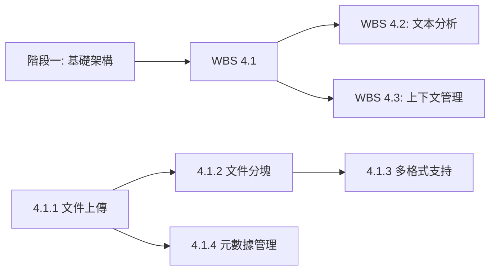

<!--
代碼功能說明: WBS 4.1 文件處理流程實現子計劃
創建日期: 2025-11-26 23:05 (UTC+8)
創建人: Daniel Chung
最後修改日期: 2025-11-26 23:05 (UTC+8)
-->

# WBS 4.1: 文件處理流程實現

## 1. 背景與目標

### 1.1 背景

根據 [AI-Box 架構規劃](../../../../Notion/pages/AI-Box/AI-Box-架構規劃.md) 和 [階段四主計劃](./wbs-4-data-processing.md)，WBS 4.1 專注於實現完整的文件處理流程，包括文件上傳、分塊、多格式支持和元數據管理。

### 1.2 目標

- 實現文件上傳、格式驗證、存儲功能
- 實現文件分塊、Chunk 生成功能
- 擴展支持多種文件格式（PDF、DOCX、TXT、MD、CSV、JSON、HTML、XLSX）
- 實現文件元數據提取、存儲、查詢功能

### 1.3 總工期

**6 個工作日**
**優先級**: P0（關鍵路徑）

### 1.4 依賴關係

- **前置依賴**:
  - 階段一：基礎架構（FastAPI 服務、ArangoDB）
  - 階段二：Agent 核心（Context Recorder）
- **後續依賴**:
  - WBS 4.2：文本分析流程（需要文件分塊結果）
  - WBS 4.3：上下文管理（需要文件元數據）

---

## 2. 工作拆解

### 2.1 任務 4.1.1: 文件上傳處理（1.5 天）

**目標**: 實現文件上傳、格式驗證、存儲功能

**實施步驟**:

1. **API 端點設計**
   - 在 `services/api/routers/` 下建立 `file_upload.py`
   - 實現 `POST /api/v1/files/upload` 端點
   - 支持多文件上傳（multipart/form-data）
   - 實現文件大小限制（配置化，預設 100MB）

2. **文件格式驗證**
   - 建立 `services/api/utils/file_validator.py`
   - 支持格式：PDF、DOCX、TXT、MD、CSV、JSON
   - 實現 MIME 類型驗證
   - 實現文件內容驗證（防止惡意文件）

3. **文件存儲**
   - 建立 `services/api/storage/file_storage.py`
   - 實現本地文件系統存儲（預設）
   - 預留 S3/OSS 等雲存儲接口
   - 實現文件元數據記錄（文件名、大小、類型、上傳時間、用戶ID）

4. **配置管理**
   - 在 `config/config.example.json` 添加 `file_upload` 配置：

     ```json
     "file_upload": {
       "max_file_size": 104857600,
       "allowed_extensions": [".pdf", ".docx", ".txt", ".md", ".csv", ".json"],
       "storage_backend": "local",
       "storage_path": "./datasets/files",
       "enable_virus_scan": false
     }
     ```

**交付物**:

- `services/api/routers/file_upload.py`
- `services/api/utils/file_validator.py`
- `services/api/storage/file_storage.py`
- `config/config.example.json` 更新
- 單元測試：`tests/api/test_file_upload.py`

**驗收標準**:

- 支持多文件上傳（至少 5 個文件同時上傳）
- 文件格式驗證準確率 100%
- 文件存儲成功後返回文件 ID 和元數據
- API 響應時間 < 2 秒（單文件 < 10MB）

---

### 2.2 任務 4.1.2: 文件分塊處理（1.5 天）

**目標**: 實現文件分塊、Chunk 生成功能

**實施步驟**:

1. **分塊策略設計**
   - 建立 `services/api/processors/chunk_processor.py`
   - 實現固定大小分塊（預設 512 tokens）
   - 實現滑動窗口分塊（overlap 20%）
   - 實現語義分塊（基於段落、句子邊界）

2. **多格式解析器**
   - 建立 `services/api/processors/parsers/` 目錄
   - 實現 `pdf_parser.py`（使用 PyPDF2 或 pdfplumber）
   - 實現 `docx_parser.py`（使用 python-docx）
   - 實現 `txt_parser.py`（純文本處理）
   - 實現 `md_parser.py`（Markdown 解析，保留結構）

3. **Chunk 元數據管理**
   - 每個 Chunk 包含：`chunk_id`、`file_id`、`chunk_index`、`text`、`metadata`
   - Metadata 包含：`start_position`、`end_position`、`page_number`（PDF）、`section`（MD）

4. **批量處理**
   - 實現異步處理（使用 Celery 或 FastAPI BackgroundTasks）
   - 支持大文件分塊（> 10MB）的後台處理
   - 實現處理進度查詢 API

**交付物**:

- `services/api/processors/chunk_processor.py`
- `services/api/processors/parsers/pdf_parser.py`
- `services/api/processors/parsers/docx_parser.py`
- `services/api/processors/parsers/txt_parser.py`
- `services/api/processors/parsers/md_parser.py`
- `services/api/routers/chunk_processing.py`（處理進度查詢）
- 單元測試：`tests/api/test_chunk_processor.py`

**驗收標準**:

- 支持 PDF、DOCX、TXT、MD 格式解析
- 分塊準確率 > 95%（不截斷句子）
- 10MB PDF 文件分塊處理時間 < 30 秒
- Chunk 元數據完整性 100%

---

### 2.3 任務 4.1.3: 多格式支持（2 天）

**目標**: 擴展支持更多文件格式

**實施步驟**:

1. **擴展解析器**
   - 實現 `csv_parser.py`（CSV 表格解析）
   - 實現 `json_parser.py`（JSON 結構化數據解析）
   - 實現 `html_parser.py`（HTML 內容提取，使用 BeautifulSoup）
   - 實現 `xlsx_parser.py`（Excel 文件解析，使用 openpyxl）

2. **格式適配器模式**
   - 建立 `services/api/processors/parsers/base_parser.py`（抽象基類）
   - 所有解析器繼承基類，實現統一接口
   - 實現解析器註冊機制（Factory Pattern）

3. **錯誤處理與回退**
   - 實現解析失敗回退機制（降級為純文本提取）
   - 實現格式檢測失敗處理
   - 記錄解析錯誤日誌

4. **性能優化**
   - 實現解析器緩存（相同文件不重複解析）
   - 實現並行解析（多文件同時處理）
   - 優化大文件內存使用（流式處理）

**交付物**:

- `services/api/processors/parsers/base_parser.py`
- `services/api/processors/parsers/csv_parser.py`
- `services/api/processors/parsers/json_parser.py`
- `services/api/processors/parsers/html_parser.py`
- `services/api/processors/parsers/xlsx_parser.py`
- `services/api/processors/parser_factory.py`
- 單元測試：`tests/api/test_parsers.py`

**驗收標準**:

- 支持至少 8 種文件格式（PDF、DOCX、TXT、MD、CSV、JSON、HTML、XLSX）
- 格式檢測準確率 > 98%
- 解析錯誤率 < 2%
- 所有格式解析時間 < 文件大小（MB）* 3 秒

---

### 2.4 任務 4.1.4: 文件元數據管理（1 天）

**目標**: 實現文件元數據提取、存儲、查詢功能

**實施步驟**:

1. **元數據模型設計**
   - 建立 `services/api/models/file_metadata.py`
   - 定義元數據 Schema（Pydantic Model）
   - 包含字段：`file_id`、`filename`、`file_type`、`file_size`、`upload_time`、`user_id`、`tags`、`description`、`custom_metadata`

2. **元數據存儲**
   - 使用 ArangoDB 存儲文件元數據（`entities` 集合，`type: "file"`）
   - 實現元數據 CRUD 操作
   - 實現元數據索引（文件名、類型、上傳時間、用戶ID）

3. **元數據提取**
   - 實現自動元數據提取（文件大小、類型、上傳時間）
   - 支持用戶自定義元數據（tags、description）
   - 實現元數據更新 API

4. **元數據查詢**
   - 實現 `GET /api/v1/files/{file_id}/metadata` 查詢單個文件元數據
   - 實現 `GET /api/v1/files/metadata` 查詢文件列表（支持篩選、排序、分頁）
   - 實現全文搜索（基於文件名、描述、tags）

**交付物**:

- `services/api/models/file_metadata.py`
- `services/api/services/file_metadata_service.py`
- `services/api/routers/file_metadata.py`
- 單元測試：`tests/api/test_file_metadata.py`

**驗收標準**:

- 元數據存儲成功率 100%
- 元數據查詢響應時間 < 500ms
- 支持至少 5 種篩選條件（類型、大小、時間範圍、用戶、tags）
- 全文搜索準確率 > 90%

---

## 3. 時間表

| 任務 | 工期 | 負責人 | 開始日期 | 完成日期 |
|------|------|--------|---------|---------|
| 4.1.1 文件上傳處理 | 1.5 天 | Backend-1 | Day 1 | Day 1-2 |
| 4.1.2 文件分塊處理 | 1.5 天 | Data-1 | Day 2 | Day 2-3 |
| 4.1.3 多格式支持 | 2 天 | Data-1 | Day 3 | Day 3-5 |
| 4.1.4 文件元數據管理 | 1 天 | Backend-1 | Day 5 | Day 5 |

**總計**: 6 天

---

## 4. 資源需求

### 4.1 人力資源

- **Backend-1**: 2.5 天（文件上傳、元數據管理）
- **Data-1**: 3.5 天（文件分塊、多格式支持）

### 4.2 技術資源

- **開發環境**: Python 3.11+、FastAPI
- **數據庫**: ArangoDB（元數據存儲）
- **工具庫**: PyPDF2、python-docx、openpyxl、BeautifulSoup

---

## 5. 驗收標準

### 5.1 功能驗收

- ✅ 支持至少 8 種文件格式上傳
- ✅ 文件分塊準確率 > 95%
- ✅ 文件元數據管理完整
- ✅ API 響應時間符合要求

### 5.2 性能驗收

- ✅ 文件上傳處理：單文件 < 10MB，響應時間 < 2 秒
- ✅ 文件分塊處理：10MB PDF，處理時間 < 30 秒
- ✅ 元數據查詢響應時間 < 500ms

### 5.3 質量驗收

- ✅ 單元測試覆蓋率 > 80%
- ✅ 代碼審查通過
- ✅ API 文檔完整

---

## 6. 風險與對策

| 風險 | 影響 | 概率 | 對策 |
|------|------|------|------|
| 大文件處理性能瓶頸 | 中 | 中 | 1. 實現異步處理<br>2. 實現流式處理<br>3. 優化內存使用 |
| 文件格式解析錯誤 | 中 | 低 | 1. 實現錯誤回退機制<br>2. 記錄詳細錯誤日誌<br>3. 提供人工校對接口 |
| 存儲空間不足 | 低 | 低 | 1. 實現文件清理策略<br>2. 支持雲存儲擴展<br>3. 監控存儲使用量 |

---

## 7. 依賴關係



---

## 8. 更新紀錄

| 日期 | 版本 | 說明 | 更新人 |
|------|------|------|--------|
| 2025-11-26 | 1.0 | 初版子計劃建立 | Daniel Chung |

---

**文檔版本**: 1.0
**最後更新**: 2025-11-26 23:05 (UTC+8)
**維護者**: AI Box 開發團隊
