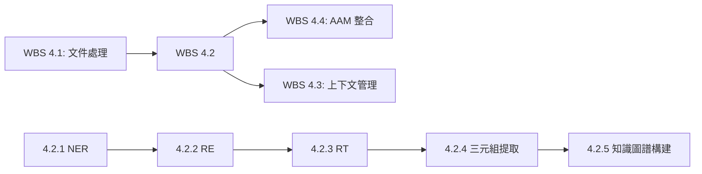

<!--
代碼功能說明: WBS 4.2 文本分析流程實現（NER/RE/RT）子計劃
創建日期: 2025-11-26 23:05 (UTC+8)
創建人: Daniel Chung
最後修改日期: 2025-11-26 23:05 (UTC+8)
-->

# WBS 4.2: 文本分析流程實現（NER/RE/RT）

## 1. 背景與目標

### 1.1 背景
根據 [AI-Box 架構規劃](../../../../Notion/pages/AI-Box/AI-Box-架構規劃.md) 和 [階段四主計劃](./wbs-4-data-processing.md)，WBS 4.2 專注於實現文本分析流程，包括命名實體識別（NER）、關係抽取（RE）、關係類型分類（RT）、三元組提取和知識圖譜構建。

### 1.2 目標
- 整合 NER/RE/RT 模型，實現實體和關係提取
- 實現三元組提取功能
- 實現知識圖譜自動構建和更新功能
- 為 AAM 模組和上下文管理提供知識基礎

### 1.3 總工期
**9 個工作日**
**優先級**: P0（關鍵路徑）

### 1.4 依賴關係
- **前置依賴**:
  - WBS 4.1：文件處理流程（需要文件分塊結果）
  - 階段一：基礎架構（ArangoDB、ChromaDB）
  - 階段一：Ollama LLM 整合
- **後續依賴**:
  - WBS 4.4：AAM 模組整合（需要知識圖譜）
  - WBS 4.3：上下文管理（需要實體和關係信息）

---

## 2. 工作拆解

### 2.1 任務 4.2.1: NER 模型整合（2 天）

**目標**: 整合命名實體識別模型、實現實體提取

**實施步驟**:

1. **NER 模型選擇與配置**
   - 評估可用模型：spaCy、transformers（BERT-based NER）、Ollama 本地模型
   - 在 `config/config.example.json` 添加 NER 配置：
     ```json
     "text_analysis": {
       "ner": {
         "model_type": "spacy",
         "model_name": "zh_core_web_sm",
         "fallback_model": "ollama:qwen3-coder:30b",
         "enable_gpu": false,
         "batch_size": 32
       }
     }
     ```

2. **NER 服務封裝**
   - 建立 `services/api/services/ner_service.py`
   - 實現統一的 NER 接口（抽象不同模型實現）
   - 實現模型加載與緩存機制
   - 實現批量實體識別（提高效率）

3. **實體類型定義**
   - 定義標準實體類型：`PERSON`、`ORG`、`LOC`、`DATE`、`MONEY`、`PRODUCT`、`EVENT` 等
   - 支持自定義實體類型（領域特定）
   - 實現實體類型映射（不同模型實體類型統一化）

4. **實體提取結果格式**
   - 定義實體結果 Schema：
     ```python
     {
       "text": "實體文本",
       "label": "實體類型",
       "start": 0,
       "end": 5,
       "confidence": 0.95
     }
     ```

**交付物**:
- `services/api/services/ner_service.py`
- `services/api/models/ner_models.py`（實體結果 Schema）
- `config/config.example.json` 更新
- 單元測試：`tests/api/test_ner_service.py`
- 性能測試腳本：`scripts/performance/test_ner_performance.py`

**驗收標準**:
- 支持至少 2 種 NER 模型（spaCy + Ollama 備選）
- 實體識別準確率 > 85%（中文文本）
- 批量處理速度 > 1000 tokens/秒
- API 響應時間 < 3 秒（單次請求，< 1000 tokens）

---

### 2.2 任務 4.2.2: RE 模型整合（2 天）

**目標**: 整合關係抽取模型、實現關係提取

**實施步驟**:

1. **RE 模型選擇與配置**
   - 評估可用模型：基於 BERT 的關係抽取模型、Ollama 本地模型
   - 在 `config/config.example.json` 添加 RE 配置：
     ```json
     "text_analysis": {
       "re": {
         "model_type": "transformers",
         "model_name": "bert-base-chinese",
         "fallback_model": "ollama:qwen3-coder:30b",
         "enable_gpu": false,
         "max_relation_length": 128
       }
     }
     ```

2. **RE 服務封裝**
   - 建立 `services/api/services/re_service.py`
   - 實現關係抽取接口
   - 實現實體對關係抽取（基於 NER 結果）
   - 實現句子級關係抽取

3. **關係類型定義**
   - 定義標準關係類型：`LOCATED_IN`、`WORKS_FOR`、`PART_OF`、`RELATED_TO`、`OCCURS_AT` 等
   - 支持自定義關係類型
   - 實現關係類型映射

4. **關係提取結果格式**
   - 定義關係結果 Schema：
     ```python
     {
       "subject": {"text": "主體實體", "label": "PERSON"},
       "relation": "關係類型",
       "object": {"text": "客體實體", "label": "ORG"},
       "confidence": 0.88,
       "context": "關係出現的上下文"
     }
     ```

**交付物**:
- `services/api/services/re_service.py`
- `services/api/models/re_models.py`（關係結果 Schema）
- `config/config.example.json` 更新
- 單元測試：`tests/api/test_re_service.py`

**驗收標準**:
- 支持至少 1 種 RE 模型（transformers 或 Ollama）
- 關係抽取準確率 > 75%（中文文本）
- 支持至少 10 種標準關係類型
- API 響應時間 < 5 秒（單次請求，< 500 tokens）

---

### 2.3 任務 4.2.3: RT 模型整合（1.5 天）

**目標**: 整合關係類型模型、實現關係分類

**實施步驟**:

1. **RT 模型選擇與配置**
   - 評估可用模型：基於分類的關係類型模型、Ollama 本地模型
   - 在 `config/config.example.json` 添加 RT 配置：
     ```json
     "text_analysis": {
       "rt": {
         "model_type": "ollama",
         "model_name": "qwen3-coder:30b",
         "enable_gpu": false,
         "classification_threshold": 0.7
       }
     }
     ```

2. **RT 服務封裝**
   - 建立 `services/api/services/rt_service.py`
   - 實現關係類型分類接口
   - 實現多標籤分類（一個關係可能屬於多個類型）
   - 實現關係類型驗證（確保類型一致性）

3. **關係類型層次結構**
   - 定義關係類型層次（父類型、子類型）
   - 實現類型繼承機制
   - 實現類型衝突檢測

4. **RT 結果格式**
   - 定義 RT 結果 Schema：
     ```python
     {
       "relation_text": "關係文本",
       "relation_types": [
         {"type": "類型1", "confidence": 0.9},
         {"type": "類型2", "confidence": 0.7}
       ],
       "primary_type": "類型1"
     }
     ```

**交付物**:
- `services/api/services/rt_service.py`
- `services/api/models/rt_models.py`（RT 結果 Schema）
- `config/config.example.json` 更新
- 單元測試：`tests/api/test_rt_service.py`

**驗收標準**:
- 支持至少 1 種 RT 模型（Ollama 或 transformers）
- 關係類型分類準確率 > 80%
- 支持至少 20 種關係類型
- API 響應時間 < 3 秒（單次請求）

---

### 2.4 任務 4.2.4: 三元組提取（1.5 天）

**目標**: 實現實體-關係-實體三元組提取

**實施步驟**:

1. **三元組提取流程設計**
   - 建立 `services/api/services/triple_extraction_service.py`
   - 整合 NER、RE、RT 服務
   - 實現三元組提取流水線：
     ```
     文本 → NER（實體識別）→ RE（關係抽取）→ RT（關係分類）→ 三元組構建
     ```

2. **三元組構建邏輯**
   - 實現實體對匹配（基於 NER 結果）
   - 實現關係驗證（確保關係存在於實體對之間）
   - 實現三元組去重（相同三元組合併）
   - 實現三元組置信度計算（綜合 NER、RE、RT 置信度）

3. **三元組結果格式**
   - 定義三元組 Schema：
     ```python
     {
       "subject": {"text": "主體", "type": "PERSON", "start": 0, "end": 5},
       "relation": {"type": "WORKS_FOR", "confidence": 0.85},
       "object": {"text": "客體", "type": "ORG", "start": 10, "end": 15},
       "confidence": 0.80,
       "source_text": "原始文本",
       "context": "上下文"
     }
     ```

4. **批量處理優化**
   - 實現批量三元組提取（多文本並行處理）
   - 實現結果緩存（相同文本不重複處理）
   - 實現增量提取（僅處理新文本）

**交付物**:
- `services/api/services/triple_extraction_service.py`
- `services/api/models/triple_models.py`（三元組 Schema）
- `services/api/routers/triple_extraction.py`（API 端點）
- 單元測試：`tests/api/test_triple_extraction.py`

**驗收標準**:
- 三元組提取準確率 > 70%（中文文本）
- 支持批量處理（至少 10 個文本並行）
- 三元組去重準確率 100%
- API 響應時間 < 10 秒（單次請求，< 2000 tokens）

---

### 2.5 任務 4.2.5: 知識圖譜構建（2 天）

**目標**: 實現知識圖譜自動構建、更新功能

**實施步驟**:

1. **知識圖譜 Schema 設計**
   - 參考 `docs/datasets/arangodb-kg-schema.md`
   - 在 ArangoDB 中建立實體和關係集合
   - 實現實體去重邏輯（相同實體合併）
   - 實現關係去重邏輯（相同關係合併）

2. **圖譜構建服務**
   - 建立 `services/api/services/kg_builder_service.py`
   - 實現三元組到圖譜的轉換邏輯
   - 實現實體節點創建/更新
   - 實現關係邊創建/更新
   - 實現圖譜增量更新（僅更新變更部分）

3. **圖譜查詢接口**
   - 實現實體查詢（根據實體文本、類型）
   - 實現關係查詢（根據關係類型、實體對）
   - 實現圖遍歷查詢（獲取實體的鄰居節點）
   - 實現子圖查詢（獲取實體的 N 度關係子圖）

4. **圖譜可視化**
   - 實現圖譜數據導出（JSON、GraphML 格式）
   - 預留圖譜可視化接口（供前端使用）

**交付物**:
- `services/api/services/kg_builder_service.py`
- `services/api/routers/kg_builder.py`（圖譜構建 API）
- `services/api/routers/kg_query.py`（圖譜查詢 API）
- `datasets/arangodb/kg_schema_update.yml`（Schema 更新）
- 單元測試：`tests/api/test_kg_builder.py`
- 集成測試：`tests/integration/test_kg_pipeline.py`

**驗收標準**:
- 三元組到圖譜轉換成功率 > 95%
- 實體去重準確率 > 90%
- 圖譜查詢響應時間 < 1 秒（單實體查詢）
- 支持至少 1000 個實體、5000 個關係的圖譜規模

---

## 3. 時間表

| 任務 | 工期 | 負責人 | 開始日期 | 完成日期 |
|------|------|--------|---------|---------|
| 4.2.1 NER 模型整合 | 2 天 | AI-1 | Day 6 | Day 6-7 |
| 4.2.2 RE 模型整合 | 2 天 | AI-1 | Day 8 | Day 8-9 |
| 4.2.3 RT 模型整合 | 1.5 天 | AI-1 | Day 10 | Day 10-11 |
| 4.2.4 三元組提取 | 1.5 天 | AI-1 | Day 11 | Day 11-12 |
| 4.2.5 知識圖譜構建 | 2 天 | AI-1 | Day 13 | Day 13-14 |

**總計**: 9 天

---

## 4. 資源需求

### 4.1 人力資源
- **AI-1**: 9 天（NER/RE/RT 模型整合、三元組提取、知識圖譜構建）

### 4.2 技術資源
- **開發環境**: Python 3.11+、FastAPI
- **數據庫**: ArangoDB（知識圖譜存儲）
- **AI 模型**: spaCy、transformers、Ollama
- **工具庫**: 參考各任務實施步驟

---

## 5. 驗收標準

### 5.1 功能驗收
- ✅ NER 實體識別準確率 > 85%
- ✅ RE 關係抽取準確率 > 75%
- ✅ RT 關係分類準確率 > 80%
- ✅ 三元組提取準確率 > 70%
- ✅ 知識圖譜構建成功率 > 95%

### 5.2 性能驗收
- ✅ NER 處理：批量處理速度 > 1000 tokens/秒
- ✅ 三元組提取：單次請求 < 2000 tokens，響應時間 < 10 秒
- ✅ 圖譜查詢響應時間 < 1 秒（單實體查詢）

### 5.3 質量驗收
- ✅ 單元測試覆蓋率 > 80%
- ✅ 集成測試通過率 100%
- ✅ 代碼審查通過

---

## 6. 風險與對策

| 風險 | 影響 | 概率 | 對策 |
|------|------|------|------|
| NER/RE/RT 模型準確率不足 | 高 | 中 | 1. 評估多個模型，選擇最佳模型<br>2. 實現模型融合（多模型投票）<br>3. 提供人工校對接口 |
| 知識圖譜構建性能瓶頸 | 中 | 中 | 1. 實現批量處理優化<br>2. 實現異步處理<br>3. 優化 ArangoDB 索引 |
| 模型服務不穩定 | 中 | 低 | 1. 實現多模型備選方案<br>2. 實現服務降級機制<br>3. 使用本地模型（Ollama）作為備選 |

---

## 7. 依賴關係



---

## 8. 更新紀錄

| 日期 | 版本 | 說明 | 更新人 |
|------|------|------|--------|
| 2025-11-26 | 1.0 | 初版子計劃建立 | Daniel Chung |

---

**文檔版本**: 1.0
**最後更新**: 2025-11-26 23:05 (UTC+8)
**維護者**: AI Box 開發團隊
