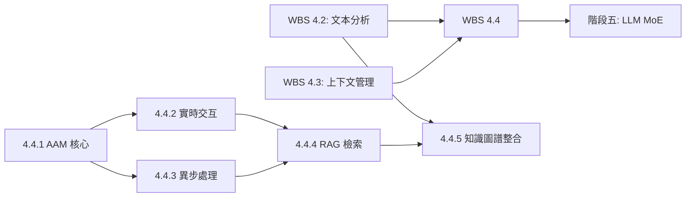

<!--
代碼功能說明: WBS 4.4 AAM 模組整合子計劃
創建日期: 2025-11-26 23:05 (UTC+8)
創建人: Daniel Chung
最後修改日期: 2025-11-26 23:05 (UTC+8)
-->

# WBS 4.4: AAM 模組整合

## 1. 背景與目標

### 1.1 背景
根據 [AI-Box 架構規劃](../../../../Notion/pages/AI-Box/AI-Box-架構規劃.md) 和 [階段四主計劃](./wbs-4-data-processing.md)，WBS 4.4 專注於整合 AAM（記憶增強模組），實現實時交互、異步處理、混合 RAG 檢索和知識圖譜整合功能。

### 1.2 目標
- 設計 AAM 架構、實現核心接口
- 實現實時記憶檢索、上下文管理
- 實現異步記憶處理、知識提取
- 實現向量檢索 + 圖檢索混合 RAG
- 實現知識圖譜構建整合

### 1.3 總工期
**9 個工作日**
**優先級**: P0（關鍵路徑）

### 1.4 依賴關係
- **前置依賴**:
  - WBS 4.2：文本分析流程（需要 NER/RE/RT 服務和知識圖譜）
  - WBS 4.3：上下文管理（需要上下文管理器）
  - 階段二：Agent 核心（Memory Manager 基礎）
  - 階段一：基礎架構（Redis、ChromaDB、ArangoDB）
- **後續依賴**:
  - 階段五：LLM MoE（需要 AAM 記憶檢索）

---

## 2. 工作拆解

### 2.1 任務 4.4.1: AAM 核心架構（2 天）

**目標**: 設計 AAM 架構、實現核心接口

**實施步驟**:

1. **AAM 架構設計**
   - 參考架構規劃中的 AAM 模組設計
   - 建立 `agent_process/memory/aam/` 目錄結構
   - 設計 AAM 核心接口：
     - `retrieve_memory()`: 記憶檢索
     - `store_memory()`: 記憶存儲
     - `update_memory()`: 記憶更新
     - `delete_memory()`: 記憶刪除

2. **AAM 核心實現**
   - 建立 `agent_process/memory/aam/aam_core.py`
   - 實現 AAM 管理器類（AAMManager）
   - 實現記憶類型管理（短期記憶、長期記憶）
   - 實現記憶優先級管理（重要記憶優先檢索）

3. **記憶存儲適配器**
   - 建立 `agent_process/memory/aam/storage_adapter.py`
   - 實現 Redis 適配器（短期記憶）
   - 實現 ChromaDB 適配器（長期記憶向量存儲）
   - 實現 ArangoDB 適配器（記憶關係圖）

4. **AAM 配置**
   - 在 `config/config.example.json` 添加 AAM 配置：
     ```json
     "aam": {
       "enable_short_term": true,
       "enable_long_term": true,
       "short_term_ttl": 3600,
       "long_term_retention_days": 30,
       "memory_priority_threshold": 0.7,
       "enable_hybrid_retrieval": true
     }
     ```

**交付物**:
- `agent_process/memory/aam/aam_core.py`
- `agent_process/memory/aam/storage_adapter.py`
- `agent_process/memory/aam/models.py`（記憶數據模型）
- `config/config.example.json` 更新
- 單元測試：`tests/agent_process/test_aam_core.py`

**驗收標準**:
- AAM 核心接口實現完整
- 支持至少 3 種存儲適配器（Redis、ChromaDB、ArangoDB）
- AAM 配置靈活可調整
- 單元測試覆蓋率 > 80%

---

### 2.2 任務 4.4.2: 實時交互子系統（2 天）

**目標**: 實現實時記憶檢索、上下文管理

**實施步驟**:

1. **實時檢索服務**
   - 建立 `agent_process/memory/aam/realtime_retrieval.py`
   - 實現實時記憶檢索（基於當前對話上下文）
   - 實現記憶相關度計算（向量相似度）
   - 實現記憶排序（按相關度、時間、重要性）

2. **上下文整合**
   - 整合 Context Manager（`agent_process/context/manager.py`）
   - 實現上下文到記憶的映射
   - 實現記憶到上下文的注入

3. **實時更新機制**
   - 實現記憶實時更新（對話過程中更新記憶）
   - 實現記憶增量更新（僅更新變更部分）
   - 實現記憶同步（多存儲適配器同步）

4. **性能優化**
   - 實現記憶檢索緩存（Redis 緩存熱點記憶）
   - 實現並行檢索（多適配器並行查詢）
   - 實現檢索結果合併（多源結果融合）

**交付物**:
- `agent_process/memory/aam/realtime_retrieval.py`
- `agent_process/memory/aam/context_integration.py`
- 單元測試：`tests/agent_process/test_realtime_retrieval.py`
- 集成測試：`tests/integration/test_aam_context_integration.py`

**驗收標準**:
- 實時檢索響應時間 < 300ms
- 記憶相關度計算準確率 > 85%
- 支持至少 100 個並發實時檢索請求
- 記憶同步一致性 100%

---

### 2.3 任務 4.4.3: 異步 Agent 子系統（2 天）

**目標**: 實現異步記憶處理、知識提取

**實施步驟**:

1. **異步處理架構**
   - 建立 `agent_process/memory/aam/async_processor.py`
   - 實現異步任務隊列（使用 Celery 或 FastAPI BackgroundTasks）
   - 實現任務調度（優先級、重試、超時）

2. **知識提取 Agent**
   - 建立 `agent_process/memory/aam/knowledge_extraction_agent.py`
   - 實現知識提取邏輯（從對話中提取知識）
   - 整合 NER/RE/RT 服務（任務 4.2.1-4.2.3）
   - 實現知識三元組提取（任務 4.2.4）

3. **記憶處理流程**
   - 實現記憶分析（提取關鍵信息）
   - 實現記憶分類（按類型、重要性分類）
   - 實現記憶關聯（建立記憶之間的關係）

4. **異步任務管理**
   - 實現任務狀態查詢（進行中、完成、失敗）
   - 實現任務結果查詢
   - 實現任務取消機制

**交付物**:
- `agent_process/memory/aam/async_processor.py`
- `agent_process/memory/aam/knowledge_extraction_agent.py`
- `services/api/routers/aam_async_tasks.py`（任務管理 API）
- 單元測試：`tests/agent_process/test_async_processor.py`

**驗收標準**:
- 異步任務處理成功率 > 95%
- 知識提取準確率 > 70%
- 支持至少 100 個並發異步任務
- 任務狀態查詢響應時間 < 200ms

---

### 2.4 任務 4.4.4: RAG 檢索流程（1.5 天）

**目標**: 實現向量檢索 + 圖檢索混合 RAG

**實施步驟**:

1. **混合檢索設計**
   - 建立 `agent_process/memory/aam/hybrid_rag.py`
   - 實現向量檢索（基於 ChromaDB）
   - 實現圖檢索（基於 ArangoDB 知識圖譜）
   - 實現檢索結果融合（多源結果合併、去重、排序）

2. **檢索策略**
   - 實現檢索策略配置（向量優先、圖優先、混合）
   - 實現檢索權重調整（向量權重、圖權重）
   - 實現檢索結果數量控制（Top-K）

3. **RAG 流程整合**
   - 整合 Retrieval Manager（`agent_process/retrieval/manager.py`）
   - 實現 RAG 查詢接口
   - 實現 RAG 結果格式化（供 LLM 使用）

4. **性能優化**
   - 實現檢索結果緩存
   - 實現並行檢索（向量和圖並行查詢）
   - 實現檢索結果預處理（過濾、排序）

**交付物**:
- `agent_process/memory/aam/hybrid_rag.py`
- `agent_process/retrieval/manager.py`（更新，整合 AAM）
- 單元測試：`tests/agent_process/test_hybrid_rag.py`
- 集成測試：`tests/integration/test_rag_pipeline.py`

**驗收標準**:
- 混合檢索響應時間 < 500ms
- 檢索結果相關度 > 80%
- 支持至少 3 種檢索策略
- RAG 結果格式正確（供 LLM 使用）

---

### 2.5 任務 4.4.5: 知識圖譜構建（1.5 天）

**目標**: 實現三元組提取、圖譜構建邏輯（與任務 4.2.5 整合）

**實施步驟**:

1. **知識圖譜構建整合**
   - 整合任務 4.2.5 的知識圖譜構建服務
   - 建立 `agent_process/memory/aam/kg_builder_integration.py`
   - 實現 AAM 到知識圖譜的數據流（記憶 → 三元組 → 圖譜）

2. **自動圖譜更新**
   - 實現自動圖譜更新觸發（記憶存儲時觸發）
   - 實現增量圖譜更新（僅更新新記憶）
   - 實現圖譜更新衝突處理（實體合併、關係更新）

3. **圖譜查詢整合**
   - 整合任務 4.2.5 的圖譜查詢接口
   - 實現 AAM 記憶檢索時使用圖譜查詢
   - 實現圖譜到記憶的映射

4. **圖譜可視化**
   - 實現圖譜數據導出（供可視化工具使用）
   - 預留圖譜可視化 API（供前端使用）

**交付物**:
- `agent_process/memory/aam/kg_builder_integration.py`
- `agent_process/memory/aam/kg_query_integration.py`
- 單元測試：`tests/agent_process/test_aam_kg_integration.py`
- 集成測試：`tests/integration/test_aam_kg_pipeline.py`

**驗收標準**:
- 知識圖譜自動更新成功率 > 90%
- 圖譜查詢響應時間 < 1 秒
- 支持至少 5000 個實體、20000 個關係的圖譜規模
- AAM 與知識圖譜數據一致性 100%

---

## 3. 時間表

| 任務 | 工期 | 負責人 | 開始日期 | 完成日期 |
|------|------|--------|---------|---------|
| 4.4.1 AAM 核心架構 | 2 天 | AI-2 | Day 21 | Day 21-22 |
| 4.4.2 實時交互子系統 | 2 天 | AI-2 | Day 23 | Day 23-24 |
| 4.4.3 異步 Agent 子系統 | 2 天 | AI-2 | Day 24 | Day 24-25 |
| 4.4.4 RAG 檢索流程 | 1.5 天 | AI-2 | Day 26 | Day 26-27 |
| 4.4.5 知識圖譜構建 | 1.5 天 | AI-2 | Day 27 | Day 27-28 |

**總計**: 9 天

---

## 4. 資源需求

### 4.1 人力資源
- **AI-2**: 9 天（所有 AAM 模組整合任務）

### 4.2 技術資源
- **開發環境**: Python 3.11+、FastAPI
- **數據庫**: Redis、ChromaDB、ArangoDB
- **工具庫**: Celery（可選）、transformers

---

## 5. 驗收標準

### 5.1 功能驗收
- ✅ AAM 核心接口實現完整
- ✅ 實時檢索響應時間 < 300ms
- ✅ 異步任務處理成功率 > 95%
- ✅ 混合 RAG 檢索相關度 > 80%
- ✅ 知識圖譜自動更新成功率 > 90%

### 5.2 性能驗收
- ✅ 實時檢索：響應時間 < 300ms
- ✅ 混合 RAG 檢索：響應時間 < 500ms
- ✅ 圖譜查詢：響應時間 < 1 秒

### 5.3 質量驗收
- ✅ 單元測試覆蓋率 > 80%
- ✅ 集成測試通過率 100%
- ✅ 代碼審查通過

---

## 6. 風險與對策

| 風險 | 影響 | 概率 | 對策 |
|------|------|------|------|
| AAM 模組整合複雜度高 | 高 | 中 | 1. 採用模組化設計<br>2. 實現接口抽象<br>3. 分階段整合測試 |
| 混合 RAG 檢索性能問題 | 中 | 中 | 1. 實現並行檢索<br>2. 實現結果緩存<br>3. 優化檢索算法 |
| 知識圖譜更新衝突 | 中 | 低 | 1. 實現衝突檢測機制<br>2. 實現實體合併策略<br>3. 實現關係更新邏輯 |

---

## 7. 依賴關係



---

## 8. 更新紀錄

| 日期 | 版本 | 說明 | 更新人 |
|------|------|------|--------|
| 2025-11-26 | 1.0 | 初版子計劃建立 | Daniel Chung |

---

**文檔版本**: 1.0
**最後更新**: 2025-11-26 23:05 (UTC+8)
**維護者**: AI Box 開發團隊
