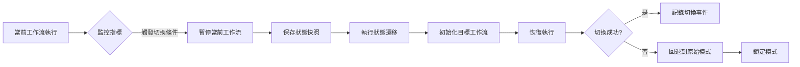

# 混合模式工作流文檔

**版本**: 1.0
**日期**: 2025-11-26
**作者**: Daniel Chung

## 概述

混合模式工作流結合了 AutoGen 的長程規劃能力與 LangGraph 的狀態可觀測性，適用於複雜度 ≥70 分的超高複雜度任務。該模式支援在執行期間動態切換工作流引擎，以優化執行效率和可靠性。

## 架構設計

### 核心組件

1. **HybridOrchestrator**: 混合模式編排器主類
   - 整合 PlanningSync、StateSync、SwitchController
   - 管理工作流執行和模式切換

2. **PlanningSync**: AutoGen → LangGraph 同步器
   - 將 AutoGen 執行計畫轉換為 LangGraph 狀態
   - 驗證同步一致性

3. **StateSync**: LangGraph → AutoGen 同步器
   - 將 LangGraph 狀態轉換為 AutoGen 計畫上下文
   - 更新執行計畫進度

4. **SwitchController**: 模式切換控制器
   - 判斷切換時機
   - 管理切換冷卻時間和次數限制
   - 處理切換失敗回退

5. **DecisionEngine**: 決策引擎
   - 根據任務特徵決定是否使用混合模式
   - 選擇主要和備用工作流

## 模式選擇決策規則

### 決策樹

```
任務分析
  ├─ 複雜度 ≥ 70 分 → 混合模式 (primary: AutoGen, fallback: LangGraph)
  ├─ 步驟數 > 10 → 混合模式 (primary: AutoGen, fallback: LangGraph)
  ├─ 需要可觀測性 → LangGraph 優先
  ├─ 需要長程規劃 → AutoGen 優先
  └─ 失敗歷史 → 啟用備用模式
```

### 決策規則詳情

| 條件 | 模式 | 主要工作流 | 備用工作流 | 理由 |
|------|------|-----------|-----------|------|
| 複雜度 ≥ 70 | hybrid | AutoGen | LangGraph | 高複雜度任務需要長程規劃 |
| 步驟數 > 10 | hybrid | AutoGen | LangGraph | 多步驟任務需要狀態管理 |
| 需要可觀測性 | single/hybrid | LangGraph | AutoGen | LangGraph 提供更好的狀態可觀測性 |
| 需要長程規劃 | single/hybrid | AutoGen | LangGraph | AutoGen 擅長多步驟規劃 |
| 失敗歷史 | hybrid | 根據任務類型 | 對應備用 | 提高可靠性 |

## 模式切換機制

### 切換條件

混合模式支援在執行期間動態切換，觸發條件包括：

1. **錯誤率 > 30%**: 當前模式執行失敗率過高
2. **成本超標**: 執行成本超過設定的閾值
3. **手動觸發**: 通過 context 中的 `force_switch_to` 參數
4. **延遲超標**: 執行延遲超過閾值（可配置）

### 切換流程



### 狀態遷移

#### AutoGen → LangGraph

1. 提取 AutoGen 執行計畫的步驟描述
2. 轉換為 LangGraph 的 `plan: List[str]`
3. 提取已完成步驟的結果作為 `outputs`
4. 設置 `current_step` 為當前執行步驟索引
5. 保留計畫元數據到 `context`

#### LangGraph → AutoGen

1. 提取 LangGraph 的 `outputs` 作為執行結果
2. 將 `plan` 轉換為 `PlanStep` 格式
3. 更新 `ExecutionPlan` 的步驟狀態
4. 根據 `current_step` 標記已完成步驟

### 切換限制

為避免頻繁切換造成性能問題，系統實施以下限制：

- **冷卻時間**: 默認 60 秒，切換後需等待冷卻時間才能再次切換
- **最大切換次數**: 默認 5 次，超過後鎖定模式
- **成本門檻**: 切換成本需低於設定閾值

## 使用範例

### 基本使用

```python
from agents.task_analyzer.analyzer import TaskAnalyzer
from agents.task_analyzer.models import TaskAnalysisRequest

# 創建任務分析請求
request = TaskAnalysisRequest(
    task="複雜的多步驟任務描述",
    context={
        "complexity_score": 80,
        "step_count": 15,
        "requires_observability": True,
        "requires_long_horizon": True,
    },
)

# 分析任務
analyzer = TaskAnalyzer()
result = analyzer.analyze(request)

# 檢查是否使用混合模式
if result.workflow_type == WorkflowType.HYBRID:
    strategy = result.analysis_details["workflow_strategy"]
    print(f"模式: {strategy['mode']}")
    print(f"主要工作流: {strategy['primary']}")
    print(f"備用工作流: {strategy['fallback']}")
```

### 手動指定混合模式

```python
from agents.workflows.base import WorkflowRequestContext
from agents.workflows.factory_router import get_workflow_factory_router
from agents.task_analyzer.models import WorkflowType

# 創建請求上下文
request_ctx = WorkflowRequestContext(
    task_id="task-1",
    task="任務描述",
    workflow_config={
        "primary_workflow": "autogen",
        "fallback_workflows": ["langgraph"],
    },
)

# 構建混合模式工作流
router = get_workflow_factory_router()
workflow = router.build_workflow(WorkflowType.HYBRID, request_ctx)

# 執行工作流
result = await workflow.run()
```

## 可觀測性

### Telemetry 事件

混合模式記錄以下 Telemetry 事件：

- `hybrid.workflow.start`: 工作流開始
- `hybrid.workflow.completed`: 工作流完成
- `hybrid.workflow.error`: 工作流出錯
- `hybrid.switch.initiated`: 切換開始
- `hybrid.switch.completed`: 切換完成
- `hybrid.switch.failed`: 切換失敗
- `hybrid.sync.checkpoint`: 同步檢查點

### 指標

- **切換次數**: 工作流執行期間的切換總數
- **切換成功率**: 成功切換次數 / 總切換次數
- **平均切換耗時**: 切換操作的平均執行時間
- **成本變化**: 切換前後的成本差異
- **狀態一致性**: 狀態遷移的一致性驗證結果

## KPI 報表模板

### 混合模式成功率

```
成功率 = (成功執行的混合任務數 / 總混合任務數) × 100%
目標: ≥ 95%
```

### 切換成功率

```
切換成功率 = (成功切換次數 / 總切換嘗試次數) × 100%
目標: ≥ 90%
```

### 狀態一致性

```
狀態一致性 = (狀態驗證通過次數 / 總狀態遷移次數) × 100%
目標: 100%
```

## 配置參數

### DecisionEngine 配置

```python
{
    "complexity_threshold_hybrid": 70,  # 混合模式複雜度閾值
    "step_count_threshold_hybrid": 10,  # 混合模式步驟數閾值
    "cost_threshold_switch": 100.0,     # 切換成本閾值（美元）
    "cooldown_seconds": 60,             # 切換冷卻時間（秒）
}
```

### SwitchController 配置

```python
{
    "cooldown_seconds": 60,  # 冷卻時間（秒）
    "max_switches": 5,      # 最大切換次數
}
```

### 切換條件配置

```python
{
    "error_rate_threshold": 0.3,        # 錯誤率閾值
    "cost_threshold": 100.0,            # 成本閾值
    "cooldown_seconds": 60,             # 冷卻時間
    "max_switches": 5,                  # 最大切換次數
}
```

## 故障處理

### 切換失敗處理

當模式切換失敗時，系統會：

1. 記錄失敗原因到 `switch_history`
2. 回退到原始模式
3. 鎖定模式避免頻繁切換
4. 記錄 Telemetry 事件

### 狀態不一致處理

當狀態遷移後驗證失敗時，系統會：

1. 記錄不一致的欄位
2. 嘗試修復不一致狀態
3. 如果修復失敗，回退到原始狀態

## 最佳實踐

1. **任務複雜度評估**: 在提交任務前評估複雜度，確保正確觸發混合模式
2. **切換條件配置**: 根據實際需求調整切換條件，避免過於頻繁或過於保守
3. **監控和告警**: 設置適當的監控指標和告警規則
4. **測試驗證**: 在生產環境使用前，充分測試混合模式的各種場景

## 更新紀錄

| 日期 | 版本 | 說明 | 更新人 |
|------|------|------|--------|
| 2025-11-26 | 1.0 | 初版文檔建立 | Daniel Chung |
