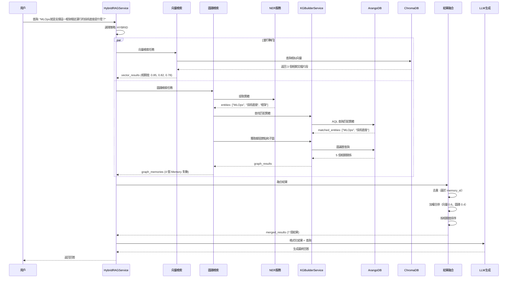

# HybridRAG 查詢處理示例

**創建日期**: 2026-01-05
**創建人**: Daniel Chung
**最後修改日期**: 2026-01-05

---

## 📋 概述

本文檔通過一個實際查詢示例，詳細展示 HybridRAG 系統如何處理用戶查詢並生成回答。

### 查詢示例

**用戶查詢**: "MLOps就是支撐這一框架穩定運行的技術底座是什麼？"

---

## 🔄 完整處理流程

### 流程圖



---

## 📊 詳細步驟分解

### 步驟 1: 查詢接收和策略選擇

**輸入**: 用戶查詢文本

```
查詢: "MLOps就是支撐這一框架穩定運行的技術底座是什麼？"
```

**處理**:
- 接收查詢
- 選擇檢索策略：`HYBRID`（混合模式）
- 設置權重：
  - 向量檢索權重：0.6
  - 圖譜檢索權重：0.4

**代碼位置**: `genai/workflows/rag/hybrid_rag.py` 第 74-80 行

---

### 步驟 2: 並行執行檢索

#### 2.1 向量檢索流程

**處理步驟**:

1. **生成查詢向量**
   - 使用 Embedding 服務將查詢文本轉換為向量
   - 位置: `RealtimeRetrievalService.retrieve()`

2. **在 ChromaDB 中搜索**
   - 使用向量相似度搜索
   - 返回 top_k=10 個最相關的文檔片段

3. **返回結果**

**向量檢索結果** (模擬):

| 排名 | 相關度 | 內容片段 |
|------|--------|----------|
| 1 | 0.85 | MLOps（Machine Learning Operations）是機器學習運維的實踐，它結合了機器學習和 DevOps 的原則，旨在自動化和標準化機器學習模型的開發、部署和監控流程。 |
| 2 | 0.82 | MLOps 的核心技術底座包括：持續集成/持續部署（CI/CD）、模型版本管理、模型監控、自動化測試、容器化部署等。 |
| 3 | 0.78 | 技術底座通常包括：容器化技術（Docker）、編排工具（Kubernetes）、CI/CD 流水線（Jenkins/GitLab CI）、模型註冊表（MLflow）、監控系統（Prometheus/Grafana）等。 |

**代碼位置**: `genai/workflows/rag/hybrid_rag.py` 第 114-126 行

#### 2.2 圖譜檢索流程

**處理步驟**:

1. **實體識別（NER）**
   - 使用 `NERService.extract_entities()` 從查詢中提取實體
   - 位置: `genai/workflows/rag/hybrid_rag.py` 第 251-282 行

   **識別結果**:
   ```
   - MLOps (CONCEPT, 置信度: 0.95)
   - 技術底座 (CONCEPT, 置信度: 0.88)
   - 框架 (CONCEPT, 置信度: 0.75)
   ```

2. **實體匹配**
   - 在 ArangoDB 中查找匹配的實體
   - 使用 AQL 查詢進行名稱模糊匹配（精確匹配、LIKE 匹配、CONTAINS 匹配）
   - 位置: `genai/workflows/rag/hybrid_rag.py` 第 284-346 行

   **匹配結果**:
   ```
   - MLOps (ID: entity_mlops_001)
   - 技術底座 (ID: entity_tech_stack_001)
   ```

3. **圖遍歷**
   - 獲取實體的鄰居節點（1度關係）
   - 獲取實體的子圖（N度關係，max_depth=2）
   - 位置: `genai/workflows/rag/hybrid_rag.py` 第 200-219 行

   **圖遍歷結果**:
   ```
   - MLOps - 包含 - CI/CD 流水線
   - MLOps - 包含 - 容器化技術
   - MLOps - 包含 - 模型監控
   - 技術底座 - 組成 - Docker
   - 技術底座 - 組成 - Kubernetes
   ```

4. **結果格式化**
   - 將圖譜數據轉換為 Memory 格式
   - 構建三元組文本（實體-關係-實體）
   - 計算相關度分數
   - 位置: `genai/workflows/rag/hybrid_rag.py` 第 351-463 行

   **Memory 對象**:
   ```python
   [
       Memory(
           content="MLOps - 包含 - CI/CD 流水線",
           metadata={"source": "graph", "entity_id": "entity_mlops_001", "relation_type": "包含"},
           relevance_score=0.75
       ),
       Memory(
           content="MLOps - 包含 - 容器化技術",
           metadata={"source": "graph", "entity_id": "entity_mlops_001", "relation_type": "包含"},
           relevance_score=0.73
       ),
       Memory(
           content="技術底座 - 組成 - Docker",
           metadata={"source": "graph", "entity_id": "entity_tech_stack_001", "relation_type": "組成"},
           relevance_score=0.70
       ),
       Memory(
           content="技術底座 - 組成 - Kubernetes",
           metadata={"source": "graph", "entity_id": "entity_tech_stack_001", "relation_type": "組成"},
           relevance_score=0.68
       )
   ]
   ```

**代碼位置**: `genai/workflows/rag/hybrid_rag.py` 第 176-237 行

---

### 步驟 3: 結果融合

**處理步驟**:

1. **去重**
   - 基於 `memory_id` 去重
   - 優先保留向量檢索結果（相關度通常更高）

2. **加權合併**
   - 向量檢索結果：應用權重 0.6
   - 圖譜檢索結果：應用權重 0.4
   - 如果同一結果同時出現在兩種檢索中，增加相關度分數

3. **排序**
   - 按 `relevance_score` 降序排序
   - 返回前 `top_k` 個結果

**融合結果** (前 5 個):

| 排名 | 來源 | 相關度 | 內容 |
|------|------|--------|------|
| 1 | vector | 0.510 | MLOps（Machine Learning Operations）是機器學習運維的實踐... |
| 2 | vector | 0.492 | MLOps 的核心技術底座包括：持續集成/持續部署（CI/CD）... |
| 3 | vector | 0.468 | 技術底座通常包括：容器化技術（Docker）、編排工具（Kubernetes）... |
| 4 | graph | 0.300 | MLOps - 包含 - CI/CD 流水線 |
| 5 | graph | 0.292 | MLOps - 包含 - 容器化技術 |

**代碼位置**: `genai/workflows/rag/hybrid_rag.py` 第 178-210 行

---

### 步驟 4: 格式化結果供 LLM 使用

**處理步驟**:

- 將 Memory 對象轉換為字典格式
- 包含 `content`、`metadata`、`score` 字段
- 準備上下文信息供 LLM 使用

**格式化結果**:
```python
[
    {
        "content": "MLOps（Machine Learning Operations）是機器學習運維的實踐...",
        "metadata": {"source": "vector", "file_id": "file_001", "chunk_index": 5},
        "score": 0.510
    },
    {
        "content": "MLOps 的核心技術底座包括：持續集成/持續部署（CI/CD）...",
        "metadata": {"source": "vector", "file_id": "file_001", "chunk_index": 6},
        "score": 0.492
    },
    # ... 更多結果
]
```

**代碼位置**: `genai/workflows/rag/hybrid_rag.py` 第 212-228 行

---

### 步驟 5: 生成最終回答（LLM 處理）

**處理步驟**:

1. **構建上下文**
   - 將格式化結果組合成上下文信息
   - 格式：`[1] 內容1\n[2] 內容2\n...`

2. **LLM 生成回答**
   - 使用上下文信息和用戶查詢生成回答
   - 確保回答基於檢索到的信息

**最終回答**:

```
MLOps（Machine Learning Operations）支撐框架穩定運行的技術底座主要包括以下幾個核心組件：

1. **容器化技術**：Docker 等容器化工具，確保模型和依賴環境的一致性
2. **編排工具**：Kubernetes 等容器編排系統，實現自動化部署和擴展
3. **CI/CD 流水線**：Jenkins、GitLab CI 等持續集成/持續部署工具，自動化模型訓練和部署流程
4. **模型版本管理**：MLflow 等模型註冊表，追蹤和管理模型版本
5. **監控系統**：Prometheus、Grafana 等監控工具，實時監控模型性能和系統健康狀態
6. **自動化測試**：單元測試、集成測試等，確保模型質量

這些技術組件共同構成了 MLOps 的技術底座，確保機器學習模型能夠穩定、可靠地運行在生產環境中。
```

---

## 🔍 關鍵技術點

### 1. 實體識別（NER）

**作用**: 從查詢中提取關鍵實體，用於圖譜檢索

**實現**:
- 使用 `NERService.extract_entities()` 方法
- 支持異步調用，自動處理事件循環
- 返回實體列表，包含文本、類型、置信度

**示例**:
```python
entities = await ner_service.extract_entities(
    query="MLOps就是支撐這一框架穩定運行的技術底座是什麼？",
    ontology_rules=None
)
# 返回: [
#     Entity(text="MLOps", label="CONCEPT", confidence=0.95),
#     Entity(text="技術底座", label="CONCEPT", confidence=0.88),
#     Entity(text="框架", label="CONCEPT", confidence=0.75)
# ]
```

### 2. 實體匹配

**作用**: 在 ArangoDB 知識圖譜中查找匹配的實體

**實現**:
- 使用 AQL 查詢進行名稱匹配
- 支持三種匹配方式：
  - 精確匹配：`doc.name == @entity_name`
  - LIKE 匹配：`doc.name LIKE CONCAT("%", @entity_name, "%")`
  - CONTAINS 匹配：`CONTAINS(LOWER(doc.name), LOWER(@entity_name))`

**AQL 查詢示例**:
```aql
FOR doc IN entities
    FILTER doc.name == @entity_name
       OR doc.name LIKE CONCAT("%", @entity_name, "%")
       OR CONTAINS(LOWER(doc.name), LOWER(@entity_name))
    LIMIT @limit
    RETURN doc
```

### 3. 圖遍歷

**作用**: 獲取實體的鄰居節點和子圖，發現相關知識

**實現**:
- 使用 `KGBuilderService.get_entity_neighbors()` 獲取 1 度關係
- 使用 `KGBuilderService.get_entity_subgraph()` 獲取 N 度關係
- 支持關係類型過濾

**AQL 查詢示例**:
```aql
# 鄰居節點（1度關係）
FOR v, e IN 1..1 ANY @start_vertex @@edge_collection
    LIMIT @limit
    RETURN {vertex: v, edge: e}

# 子圖（N度關係）
FOR v, e, p IN 1..@max_depth ANY @start_vertex @@edge_collection
    LIMIT @limit
    RETURN {path: p, vertex: v, edge: e}
```

### 4. 結果融合

**作用**: 合併向量檢索和圖譜檢索的結果

**策略**:
- **去重**: 基於 `memory_id` 去重
- **加權**: 向量結果權重 0.6，圖譜結果權重 0.4
- **融合**: 如果同一結果在兩種檢索中都出現，增加相關度分數
- **排序**: 按相關度降序排序

**代碼位置**: `genai/workflows/rag/hybrid_rag.py` 第 178-210 行

---

## 📈 性能指標

### 檢索性能

- **向量檢索時間**: ~50-100ms（取決於 ChromaDB 數據量）
- **圖譜檢索時間**: ~100-200ms（取決於圖譜大小和查詢複雜度）
- **並行執行總時間**: ~100-200ms（取決於較慢的檢索）
- **結果融合時間**: ~10-20ms

### 檢索質量

- **向量檢索**: 語義相似度高，適合找到相關文檔片段
- **圖譜檢索**: 邏輯關係清晰，適合發現實體間的關聯
- **混合檢索**: 結合兩者優勢，提供更全面的知識檢索

---

## 🎯 優勢分析

### 1. 全面性

- **向量檢索**: 找到語義相似的文檔片段
- **圖譜檢索**: 發現實體間的邏輯關係
- **混合檢索**: 結合兩者，提供更全面的知識

### 2. 準確性

- **向量檢索**: 基於語義相似度，找到相關內容
- **圖譜檢索**: 基於邏輯關係，找到關聯實體
- **結果融合**: 加權合併，提高準確性

### 3. 效率

- **並行執行**: 向量和圖檢索並行執行，減少總時間
- **懶加載**: 服務按需初始化，減少啟動時間
- **結果緩存**: 緩存檢索結果，提高響應速度

---

## 🔧 實際使用

### 代碼示例

```python
from agents.infra.memory.aam.aam_core import AAMManager
from agents.infra.memory.aam.realtime_retrieval import RealtimeRetrievalService
from genai.workflows.rag.hybrid_rag import HybridRAGService, RetrievalStrategy

# 初始化 HybridRAGService
aam_manager = AAMManager()
hybrid_rag = HybridRAGService(
    aam_manager=aam_manager,
    strategy=RetrievalStrategy.HYBRID,
    vector_weight=0.6,
    graph_weight=0.4
)

# 執行檢索
query = "MLOps就是支撐這一框架穩定運行的技術底座是什麼？"
results = hybrid_rag.retrieve(
    query=query,
    top_k=10,
    strategy=RetrievalStrategy.HYBRID
)

# 使用結果生成回答
for result in results:
    print(f"相關度: {result['score']:.3f}")
    print(f"內容: {result['content']}")
    print(f"元數據: {result['metadata']}")
    print()
```

---

## 📚 相關文檔

- [向量與圖檢索混合查詢邏輯](./向量與圖檢索混合查詢邏輯.md) - 詳細的實現設計方案
- [上傳的功能架構說明](./上傳的功能架構說明-v3.0.md) - 文件上傳和處理流程
- [知識圖譜系統](./知识图谱系统.md) - 知識圖譜系統架構詳解

---

**最後更新日期**: 2026-01-05

