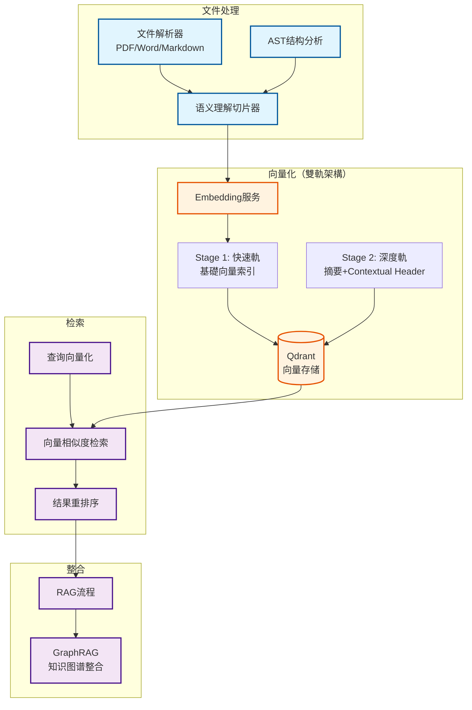

# 强化RAG系统架构文档

**创建日期**: 2025-12-25
**创建人**: Daniel Chung
**最后修改日期**: 2026-01-21

---

## 📋 概述

强化RAG系统是 AI-Box 的核心知识检索架构，通过语义理解切片技术与 **Qdrant** 向量存储，实现精准的文档检索与知识增强。系统采用**双轨 RAG 解析架构**，避免了传统RAG系统中完整段落被切割的问题，提供了更高质量的知识检索能力。

**重要更新** (2026-01-20):

- ✅ 向量數據庫從 ChromaDB 遷移到 **Qdrant**
- ✅ 實現**雙軌 RAG 解析架構**（Stage 1 快速軌 + Stage 2 深度軌）

> **相关文档**：
>
> - [AI-Box 雙軌 RAG 解析規格書](./AI-Box雙軌RAG解析規格書.md) - 雙軌架構詳細說明
> - [文件上传架构说明](./上傳的功能架構說明-v4.0.md) - RAG 系统详解
> - [AI-Box AAM 技術白皮書](../../../白皮書/AI-Box-AAM-長短記憶架構技術白皮書.md) - AAM 與 RAG 的整合
> - [知识图谱系统](./知识图谱系统.md) - 图检索与向量检索的协同

---

## 🏗️ 架构设计

### 核心设计理念

**问题**：传统RAG系统在文档切片时，可能会将完整的段落、句子切割，导致语义不完整，影响检索质量。

**解决方案**：

1. **双轨 RAG 解析架构**：
   - **Stage 1（快速軌）**: 快速完成基础向量索引，立即提供检索能力
   - **Stage 2（深度軌）**: 使用 LLM + VLM 进行深度理解，生成摘要和 Contextual Header

2. **语义理解切片**：通过大模型理解文意，识别语义边界
3. **AST驱动切片**：基于文档结构（标题层级）进行切片
4. **智能分块策略**：结合语义与结构，避免切割完整段落
5. **Contextual Header**：为每个 chunk 生成上下文标头，提升检索精度

### 架构图

---

## 🔧 核心组件

### 1. 语义理解切片

**技术方案**：

- 使用大模型理解文档语义
- 识别段落边界、句子边界
- 避免切割完整的语义单元

**实现位置**：`services/api/processors/chunk_processor.py`

**切片策略**：

1. **结构优先**：优先基于文档结构（标题层级）切片
2. **语义边界**：在结构基础上，识别语义边界
3. **大小控制**：控制切片大小，避免过大或过小

### 2. Qdrant 向量存储（雙軌架構）

**存储架构**：

- **Collection**：按文件组织的向量集合（`file_{file_id}`）
- **Payload**：存储文档元数据（文件ID、chunk索引、chunk文本等）
  - **Stage 1 基础 Payload**: `file_id`, `chunk_index`, `chunk_text`
  - **Stage 2 增强 Payload**: `global_summary`, `contextual_header`, `image_description` 等
- **索引**：向量索引用于快速相似度检索（HNSW 索引）

**实现位置**：

- 向量存储服务：`services/api/services/qdrant_vector_store_service.py`

**核心功能**：

- 向量存储与检索
- Payload 过滤和更新（`upsert`）
- 批量操作优化
- 支持 Stage 2 的 Payload 更新

**雙軌架構優勢**：

- ✅ Stage 1 快速完成，立即提供检索能力
- ✅ Stage 2 背景处理，不影響檢索功能
- ✅ Contextual Header 提升檢索精度

### 3. 检索流程

**检索步骤**：

1. **查询向量化**：将用户查询转换为向量
2. **向量相似度检索**：在 Qdrant 中检索相似向量
3. **Payload 过滤**：根据文件ID、用户ID等过滤结果
4. **结果重排序**：根据相关性、时间等因素重排序
5. **Top-K 返回**：返回最相关的 K 个结果

**雙軌架構優勢**：

- ✅ Stage 1 的基礎向量立即可用，檢索速度快
- ✅ Stage 2 的 Contextual Header 提供更多上下文，提升檢索相關性

**实现位置**：

- 检索服务：`services/api/services/chat_memory_service.py`
- RAG 管理器：`genai/workflows/rag/manager.py`

---

## 🔄 与知识图谱的协同

### 混合检索架构

**向量检索 + 图检索**：

- **向量检索**：快速找到语义相似的文档片段
- **图检索**：通过知识图谱的逻辑关系进行推理检索
- **结果融合**：合并两种检索结果，提升检索精度

**实现状态**：🔄 **部分实现**（向量检索已实现，图检索整合进行中）

---

## 📊 实现状态

### 已完成功能

| 功能模块 | 状态 | 说明 |
|---------|------|------|
| 文件解析 | ✅ 已实现 | PDF、Word、Markdown 等格式解析 |
| 语义切片 | ✅ 已实现 | ChunkProcessor 实现语义理解切片 |
| Qdrant 存储 | ✅ 已实现 | 向量存储与检索（从 ChromaDB 迁移） |
| Stage 1 快速軌 | ✅ 已实现 | 基础向量索引，立即提供检索能力 |
| 向量检索 | ✅ 已实现 | 相似度检索与 Payload 过滤 |
| RAG 流程 | ✅ 已实现 | 基础的 RAG 检索流程 |

### 进行中功能

| 功能模块 | 状态 | 说明 |
|---------|------|------|
| Stage 2 深度軌 | 🔄 计划中 | Prompt A/B/C 实现，Contextual Header 生成 |
| 图检索整合 | 🔄 进行中 | 与知识图谱系统的整合 |
| 结果重排序 | 🔄 进行中 | 基于相关性的重排序优化 |
| 混合检索优化 | 🔄 进行中 | 向量检索与图检索的融合策略 |

**詳細實施計劃**: 請參閱 [AI-Box 雙軌 RAG 解析實施計劃書](./AI-Box雙軌RAG解析實施計劃書.md)

---

## 🗺️ 开发进度

### 阶段四完成情况

根据 [项目控制表](../../../開發過程文件/項目控制表.md)，**阶段四：数据处理阶段**已完成：

- ✅ **文件解析与切片**（已完成）
- ✅ **向量化与存储**（已完成）
- ✅ **基础 RAG 检索**（已完成）

### 下一阶段计划

1. **图检索整合**：与知识图谱系统深度整合
2. **混合检索优化**：优化向量检索与图检索的融合策略
3. **检索性能优化**：提升检索速度与精度

---

## 📚 参考资料

### 相关文档

- [AI-Box 雙軌 RAG 解析規格書](./AI-Box雙軌RAG解析規格書.md) - 雙軌架構詳細說明
- [AI-Box 雙軌 RAG 解析實施計劃書](./AI-Box雙軌RAG解析實施計劃書.md) - 實施計劃和進度管控
- [文件上传架构说明](./上傳的功能架構說明-v4.0.md) - 完整上傳架構
- [VectorDB.md](./VectorDB.md) - Qdrant 向量數據庫架構
- [AI-Box AAM 技術白皮書](../../../白皮書/AI-Box-AAM-長短記憶架構技術白皮書.md) - AAM 與 RAG 的整合
- [知识图谱系统](./知识图谱系统.md) - 图检索与向量检索的协同

### 代码位置

- 文件解析：`services/api/processors/parsers/`
- 切片处理：`services/api/processors/chunk_processor.py`
- 向量存储：`services/api/services/qdrant_vector_store_service.py`
- 检索服务：`services/api/services/qdrant_vector_store_service.py`
- RAG 管理器：`genai/workflows/rag/manager.py`

---

**最后更新日期**: 2026-01-21
