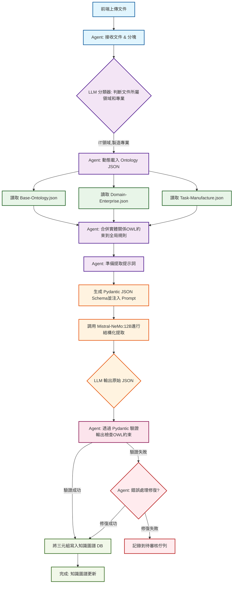

# 圖譜化流程 NER/RE/RT 標簽化工作

**文檔版本**: v1.0
**創建日期**: 2025-12-10
**創建人**: Daniel Chung
**最後修改日期**: 2025-12-10

---

## 目錄

1. [概述](#概述)
2. [現有架構分析](#現有架構分析)
3. [NER/RE/RT 工作流程](#nerrert-工作流程)
4. [代碼復用分析](#代碼復用分析)
5. [獨立功能評估](#獨立功能評估)
6. [優化建議](#優化建議)
7. [實施方案](#實施方案)

---

## 概述

### 背景

基於 `文件上傳系統功能與流程.md` 和 `文件上傳功能與架構總結.md` 的分析，本文檔針對圖譜化流程中的 NER（命名實體識別）、RE（關係抽取）、RT（關係分類）標簽化工作進行深入分析，評估是否可以復用現有代碼或需要獨立功能。

### 核心問題

1. **向量化與圖譜化的關係**：兩者是否可以共享代碼？
2. **NER/RE/RT 標簽化**：是否需要獨立的功能模組？
3. **代碼復用策略**：哪些部分可以復用，哪些需要獨立？

---

## 現有架構分析

### 1. 向量化流程架構

\`\`\`mermaid
graph TB
    A[文件上傳] --> B[文件解析]
    B --> C[文本分塊]
    C --> D[向量生成]
    D --> E[向量存儲到 ChromaDB]

    style A fill:#e1f5ff
    style E fill:#fce4ec\`\`\`

**核心組件**:

- \`process_vectorization_only()\`: 向量化處理函數
- \`EmbeddingService\`: 向量生成服務
- \`VectorStoreService\`: 向量存儲服務
- \`ChromaDB\`: 向量數據庫

### 2. 圖譜化流程架構

\`\`\`mermaid
graph TB
    A[文件上傳] --> B[文件解析]
    B --> C[文本分塊]
    C --> D[NER 實體識別]
    D --> E[RE 關係抽取]
    E --> F[RT 關係分類]
    F --> G[三元組提取]
    G --> H[圖譜構建到 ArangoDB]

    style A fill:#e1f5ff
    style H fill:#fce4ec\`\`\`

**核心組件**:

- \`process_kg_extraction_only()\`: 圖譜提取處理函數
- \`KGExtractionService\`: 圖譜提取服務
- \`TripleExtractionService\`: 三元組提取服務
- \`NERService\`: 命名實體識別服務
- \`REService\`: 關係抽取服務
- \`RTService\`: 關係分類服務
- \`KGBuilderService\`: 圖譜構建服務

### 3. 共享組件分析

\`\`\`mermaid
graph LR
    A[文件解析] --> B[向量化流程]
    A --> C[圖譜化流程]

    D[文本分塊] --> B
    D --> C

    style A fill:#e8f5e9
    style D fill:#e8f5e9\`\`\`

**可共享的組件**:

- ✅ **文件解析器** (\`get_parser()\`): 兩者都需要解析文件
- ✅ **文本分塊器** (\`get_chunk_processor()\`): 兩者都需要分塊處理
- ✅ **文件存儲** (\`FileStorage\`): 兩者都需要讀取文件
- ✅ **元數據服務** (\`FileMetadataService\`): 兩者都需要文件元數據

---

## NER/RE/RT 工作流程

### 完整標簽化流程

\`\`\`mermaid
sequenceDiagram
    participant Text as 文本輸入
    participant NER as NER服務
    participant RE as RE服務
    participant RT as RT服務
    participant Triple as 三元組提取
    participant KG as 圖譜構建

    Text->>NER: 提取實體
    NER->>NER: 識別實體類型` `(PERSON, ORG, LOC等)
    NER->>RE: 返回實體列表

    RE->>RE: 抽取實體間關係
    RE->>RE: 識別關係類型` `(工作於, 位於, 屬於等)
    RE->>RT: 返回關係列表

    RT->>RT: 分類關係類型
    RT->>RT: 標準化關係標簽
    RT->>Triple: 返回分類結果

    Triple->>Triple: 構建三元組` `(主體-關係-客體)
    Triple->>KG: 返回三元組列表

    KG->>KG: 構建知識圖譜
    KG->>KG: 存儲到 ArangoDB\`\`\`

### 1. NER (命名實體識別)

**功能**: 識別文本中的命名實體

**實體類型**:

- \`PERSON\`: 人物
- \`ORG\`: 組織
- \`LOC\`: 地點
- \`DATE\`: 日期
- \`MONEY\`: 金額
- \`PRODUCT\`: 產品
- \`EVENT\`: 事件

**實現方式**:

- **spaCy**: 本地模型（\`zh_core_web_sm\`）
- **Ollama**: LLM 模型（\`qwen3-coder:30b\`）
- **Gemini**: 外部 API

**代碼位置**: \`genai/api/services/ner_service.py\`

**關鍵方法**:
\`\`\`python
async def extract_entities(
    text: str,
    model_type: Optional[str] = None,
    user_id: Optional[str] = None,
    file_id: Optional[str] = None,
    task_id: Optional[str] = None,
) -> List[Entity]
\`\`\`

### 2. RE (關係抽取)

**功能**: 抽取實體之間的關係

**關係類型**: 動態識別（如"工作於"、"位於"、"屬於"等）

**實現方式**: 使用 LLM（Ollama/Gemini）進行關係抽取

**代碼位置**: \`genai/api/services/re_service.py\`

**關鍵方法**:
\`\`\`python
async def extract_relations(
    text: str,
    entities: List[Entity]
) -> List[Relation]
\`\`\`

### 3. RT (關係分類)

**功能**: 對抽取的關係進行標準化分類

**關係類型**: 標準化的關係標簽（如 \`works_for\`, \`located_in\`, \`belongs_to\`）

**實現方式**: 使用 LLM 進行關係分類

**代碼位置**: \`genai/api/services/rt_service.py\`

**關鍵方法**:
\`\`\`python
async def classify_relation_type(
    relation_text: str,
    subject: str,
    object: str
) -> List[RelationType]
\`\`\`

### 4. 三元組提取整合

**代碼位置**: \`genai/api/services/triple_extraction_service.py\`

**流程**:

1. NER 提取實體
2. RE 抽取關係
3. RT 分類關係類型
4. 構建三元組（主體-關係-客體）
5. 計算置信度
6. 去重

**關鍵方法**:
\`\`\`python
async def extract_triples(
    text: str,
    entities: Optional[List[Entity]] = None,
    enable_ner: bool = True,
) -> List[Triple]
\`\`\`

---

## 代碼復用分析

### 1. 文件解析與分塊

**復用情況**: ✅ **完全可復用**

**原因**:

- 向量化和圖譜化都需要相同的文件解析邏輯
- 兩者都使用相同的文本分塊策略
- 圖譜化可以重用向量化已生成的 chunks

**現有實現**:
\`\`\`python

# 向量化流程

chunks = chunk_processor.process(text, file_id, metadata)

# 圖譜化流程（可以重用）

chunks = await _reconstruct_chunks_from_vectors(file_id, user_id)

# 如果沒有向量，則重新分塊

if chunks is None:
    chunks = chunk_processor.process(text, file_id, metadata)
\`\`\`

**優化建議**: ✅ **已實現**

- \`process_kg_extraction_only()\` 已經實現了從向量重構 chunks 的邏輯
- 避免了重複解析和分塊

### 2. NER/RE/RT 服務

**復用情況**: ✅ **完全獨立，但可共享**

**原因**:

- NER/RE/RT 是圖譜化專用的服務
- 向量化不需要這些服務
- 但這些服務可以被其他功能復用（如問答系統、搜索系統）

**現有實現**:
\`\`\`python

# 圖譜化流程

triple_service = TripleExtractionService(
    ner_service=NERService(),
    re_service=REService(),
    rt_service=RTService()
)
\`\`\`

**優化建議**: ✅ **已實現**

- 服務採用單例模式，可以全局共享
- 支持多種模型（spaCy、Ollama、Gemini）
- 支持 fallback 機制

### 3. 處理流程

**復用情況**: ⚠️ **部分可復用**

**現有實現**:
\`\`\`python

# 向量化流程

async def process_vectorization_only(...):
    # 1. 文件解析
    # 2. 文本分塊
    # 3. 向量生成
    # 4. 向量存儲

# 圖譜化流程

async def process_kg_extraction_only(...):
    # 1. 嘗試重用已存在的 chunks
    # 2. 如果沒有，則重新解析和分塊
    # 3. NER/RE/RT 提取
    # 4. 圖譜構建
\`\`\`

**優化建議**: ✅ **已實現**

- 圖譜化已經實現了重用向量化 chunks 的邏輯
- 兩者可以獨立運行，也可以協同工作

---

## 獨立功能評估

### 1. NER/RE/RT 是否需要獨立功能？

**結論**: ✅ **需要獨立功能，但可以共享服務**

**理由**:

1. **功能獨立性**:

   - NER/RE/RT 是圖譜化的核心組件
   - 向量化不需要這些功能
   - 但這些服務可以被其他功能復用
2. **服務設計**:

   - ✅ 已採用服務化設計（\`NERService\`, \`REService\`, \`RTService\`）
   - ✅ 支持多種模型實現
   - ✅ 支持 fallback 機制
   - ✅ 採用單例模式，全局共享
3. **標簽化工作**:

   - NER: 實體標簽（PERSON, ORG, LOC 等）
   - RE: 關係標簽（動態識別）
   - RT: 關係類型標簽（標準化）

### 2. 標簽化工作流程

\`\`\`mermaid
graph TB
    A[文本輸入] --> B[NER 標簽化]
    B --> C[實體標簽 ` `PERSON, ORG, LOC等]

    A --> D[RE 標簽化]
    D --> E[關係標簽` `工作於, 位於等]

    E --> F[RT 標簽化]
    F --> G[標準化關係類型` `works_for, located_in等]

    C --> H[三元組構建]
    G --> H
    H --> I[圖譜存儲]

    style B fill:#e8f5e9
    style D fill:#e8f5e9
    style F fill:#e8f5e9
    style I fill:#fce4ec\`\`\`

### 3. 標簽化數據結構

**NER 標簽**:
\`\`\`python
Entity(
    text: str,           # 實體文本
    label: str,          # 實體類型標簽（PERSON, ORG, LOC等）
    start: int,          # 起始位置
    end: int,            # 結束位置
    confidence: float    # 置信度
)
\`\`\`

**RE 標簽**:
\`\`\`python
Relation(
    subject: Entity,     # 主體實體
    object: Entity,      # 客體實體
    relation: str,       # 關係文本（如"工作於"）
    confidence: float,   # 置信度
    context: str         # 上下文
)
\`\`\`

**RT 標簽**:
\`\`\`python
RelationType(
    type: str,           # 標準化關係類型（works_for, located_in等）
    confidence: float    # 置信度
)
\`\`\`

---

## 優化建議

### 1. 代碼復用優化

**現狀**: ✅ **已實現良好**

**建議**:

1. ✅ **保持現有架構**: 文件解析和分塊已實現復用
2. ✅ **保持服務獨立**: NER/RE/RT 服務已實現獨立和共享
3. ✅ **保持流程獨立**: 向量化和圖譜化可以獨立運行

### 2. 標簽化工作優化

**建議**:

1. **標簽標準化**:

   - 定義標準的實體類型標簽集
   - 定義標準的關係類型標簽集
   - 提供標簽映射機制
2. **標簽質量控制**:

   - 置信度閾值過濾
   - 標簽一致性檢查
   - 標簽衝突解決
3. **標簽可視化**:

   - 提供標簽統計信息
   - 支持標簽編輯和修正
   - 標簽質量評估

### 3. 性能優化

**建議**:

1. **批量處理**:

   - NER/RE/RT 支持批量處理
   - 減少 LLM 調用次數
2. **緩存機制**:

   - 緩存 NER/RE/RT 結果
   - 避免重複計算
3. **異步處理**:

   - 保持現有的異步處理機制
   - 支持並發處理

---

## 實施方案

### 方案一：保持現有架構（推薦）

**優點**:

- ✅ 代碼已實現良好的復用
- ✅ 服務已實現獨立和共享
- ✅ 流程已實現獨立運行
- ✅ 圖譜化已實現重用向量化的 chunks

**實施步驟**:

1. ✅ 保持現有架構不變
2. 增強標簽標準化
3. 增強標簽質量控制
4. 增強標簽可視化

### 方案二：進一步抽象（可選）

**優點**:

- 更統一的處理流程
- 更容易擴展新功能

**缺點**:

- 需要重構現有代碼
- 可能引入新的複雜性

**實施步驟**:

1. 創建統一的處理流程抽象
2. 向量化和圖譜化作為具體實現
3. 共享解析和分塊邏輯

### 推薦方案

**選擇**: **方案一（保持現有架構）**

**理由**:

1. 現有架構已經實現了良好的代碼復用
2. 圖譜化已經實現了重用向量化 chunks 的邏輯
3. NER/RE/RT 服務已經實現了獨立和共享
4. 不需要大規模重構

---

## 總結

### 代碼復用情況

| 組件      | 向量化 | 圖譜化 | 復用情況                                   |
| --------- | ------ | ------ | ------------------------------------------ |
| 文件解析  | ✅     | ✅     | ✅ 完全復用                                |
| 文本分塊  | ✅     | ✅     | ✅ 完全復用（圖譜化可重用向量化的 chunks） |
| 向量生成  | ✅     | ❌     | ❌ 向量化專用                              |
| NER/RE/RT | ❌     | ✅     | ✅ 圖譜化專用，但服務可共享                |
| 向量存儲  | ✅     | ❌     | ❌ 向量化專用                              |
| 圖譜構建  | ❌     | ✅     | ❌ 圖譜化專用                              |

### NER/RE/RT 標簽化工作

1. **NER 標簽化**: ✅ 已實現，支持多種模型
2. **RE 標簽化**: ✅ 已實現，使用 LLM 進行關係抽取
3. **RT 標簽化**: ✅ 已實現，標準化關係類型
4. **標簽整合**: ✅ 已實現，通過 \`TripleExtractionService\` 整合

### 結論

1. **代碼復用**: ✅ **已實現良好**

   - 文件解析和分塊完全復用
   - 圖譜化可以重用向量化的 chunks
   - 避免了重複解析和分塊
2. **獨立功能**: ✅ **已實現獨立**

   - NER/RE/RT 作為獨立服務
   - 向量化和圖譜化可以獨立運行
   - 服務採用單例模式，可以全局共享
3. **標簽化工作**: ✅ **已實現完整**

   - NER: 實體標簽（PERSON, ORG, LOC 等）
   - RE: 關係標簽（動態識別）
   - RT: 關係類型標簽（標準化）
4. **優化建議**:

   - 保持現有架構
   - 增強標簽標準化
   - 增強標簽質量控制
   - 增強標簽可視化

# 知識圖譜 Ontology

---

### 流程說明

1. **A 到 B (文件準備):** 外部系統上傳文件，Agent 進行初步切分。
2. **B 到 C (LLM 分類):** Agent 使用 LLM 的快速分類能力，識別文件的主題，決定需要哪些規則。
3. **C 到 D, E1/E2/E3 (動態載入):** 根據分類結果，Agent **只載入**所需的  **JSON 模組** ，體現了架構的效率和模組化。
4. **F 到 G (規則組合):** 這是 `kg_schema_manager.py` 的核心職責。它將三個 JSON 模組的規則合併，形成一個**統一且精確**的規則集。
5. **G 到 H (Pydantic 轉換):** Agent 利用 Pydantic 將合併後的規則轉化為 **JSON Schema** 格式，並將其注入到 **提示詞 (Prompt)** 中。
6. **H 到 I (LLM 提取):** 這是 Mistral-NeMo:12B 的工作。它根據嚴格的提示詞執行提取。
7. **J 到 K (Pydantic 驗證):** 關鍵的質量控制點。Agent 接收 LLM 輸出後，Pydantic 會檢查 JSON 格式、實體類型和  **OWL Domain/Range 約束** 。
8. **K 到 L/M/N (決策與固化):** 只有通過驗證的數據才能寫入知識圖譜 (L)。失敗的數據會進入錯誤處理流程 (M)，或被記錄下來供人工審核 (N)。

---

**文檔結束**
