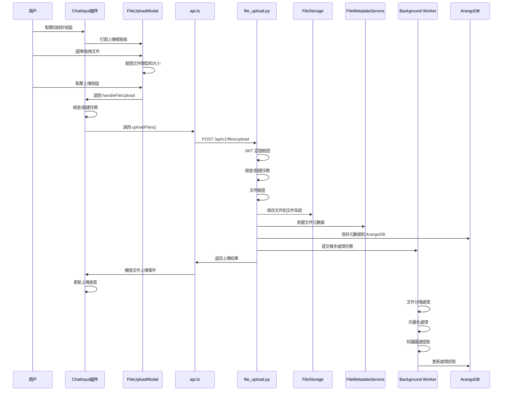

# 聊天輸入框文件上傳流程追蹤文檔

**創建日期**: 2025-01-27
**創建人**: Daniel Chung
**最後修改日期**: 2025-01-27

## 概述

本文檔詳細追蹤從前端 AI 聊天輸入框上傳文件的完整流程，包括前端觸發、API 調用、後端處理、文件存儲、異步處理等各個環節。

---

## 完整流程圖



---

## 詳細流程追蹤

### 階段 1: 前端觸發（ChatInput 組件）

#### 1.1 用戶操作入口

**文件位置**: `ai-bot/src/components/ChatInput.tsx`

**觸發點**: 用戶點擊聊天輸入框工具欄中的回紋針按鈕

```1540:1546:ai-bot/src/components/ChatInput.tsx
          <button
            onClick={handlePaperclipClick}
            className="p-2 rounded hover:bg-tertiary transition-colors text-tertiary hover:text-primary"
            aria-label="上傳文件"
          >
            <i className="fa-solid fa-paperclip"></i>
          </button>
```

#### 1.2 打開文件上傳模態框

**函數**: `handlePaperclipClick`

```842:845:ai-bot/src/components/ChatInput.tsx
  // 文件上傳處理函數
  const handlePaperclipClick = () => {
    setShowFileUploadModal(true);
  };
```

**狀態管理**:

- `showFileUploadModal`: 控制模態框顯示/隱藏
- `uploadingFiles`: 追蹤上傳中的文件列表
- `fileReferences`: 追蹤已附加到聊天的文件引用

#### 1.3 文件上傳模態框組件

**組件**: `FileUploadModal`
**文件**: `ai-bot/src/components/FileUploadModal.tsx`

**主要功能**:

1. **文件選擇**: 支持點擊選擇和拖拽上傳
2. **文件驗證**:
   - 文件類型驗證（PDF, DOCX, TXT, MD, CSV, XLS, XLSX, 圖片等）
   - 文件大小限制（默認 50MB）
3. **圖片預覽**: 自動為圖片文件生成預覽
4. **任務工作區選擇**: 可選是否上傳到任務工作區

**關鍵代碼**:

```92:101:ai-bot/src/components/FileUploadModal.tsx
export const FileUploadModal: React.FC<FileUploadModalProps> = ({
  isOpen,
  onClose,
  onUpload,
  maxFileSize = DEFAULT_MAX_FILE_SIZE,
  allowedTypes = DEFAULT_ALLOWED_TYPES,
  defaultTaskId, // 默認使用任務工作區（可選；若不提供則由後端自行創建 task）
  forceTaskId,
  hideUploadToWorkspaceToggle = false,
}) => {
```

#### 1.4 文件上傳處理函數

**函數**: `handleFileUpload`
**位置**: `ChatInput.tsx` 第 847-1101 行

**關鍵邏輯**:

1. **任務檢查與創建**:
   - 檢查是否為新任務（標題為"新任務"且無消息和文件）
   - 如果是新任務，自動創建任務（使用第一個文件名作為任務名稱）
   - 確定最終使用的 `taskId`

```847:934:ai-bot/src/components/ChatInput.tsx
  const handleFileUpload = async (files: File[], taskId?: string) => {
    if (files.length === 0) return;

    // 修改時間：2025-01-27 - 重構文件上傳邏輯，移除 temp-workspace
    // 檢查是否為新任務（第一次上傳文件）：
    // 1. 必須有 selectedTask
    // 2. 任務標題必須是"新任務"（表示是剛創建的空白任務）
    // 3. 沒有消息和文件
    const isNewTask = selectedTask &&
      (selectedTask.title === '新任務' || selectedTask.title === '新任务' || selectedTask.title === 'New Task') &&
      (!selectedTask.messages || selectedTask.messages.length === 0) &&
      (!selectedTask.fileTree || selectedTask.fileTree.length === 0);

    let finalTaskId: string | undefined = undefined;

    // 如果是新任務，創建任務並使用第一個文件名作為任務名稱
    if (isNewTask && onTaskCreate && selectedTask) {
      const firstFileName = files[0]?.name || '新任務';
      // 移除文件擴展名作為任務名稱
      const taskTitle = firstFileName.replace(/\.[^/.]+$/, '') || '新任務';

      // 生成新的任務ID（使用時間戳確保唯一性）
      const newTaskId = Date.now();

      const createdTask: Task = {
        ...selectedTask,
        id: newTaskId,
        title: taskTitle,
        fileTree: [], // 初始化文件樹
        // 確保 executionConfig 存在
        executionConfig: selectedTask.executionConfig || {
          mode: 'free',
        },
      };

      // 先創建任務，確保任務ID已生成並保存到後台
      // 使用 await 確保任務創建完成後再上傳文件
      try {
        await onTaskCreate(createdTask);
        // 等待任務保存完成（給後台同步一些時間）
        await new Promise(resolve => setTimeout(resolve, 100));
        finalTaskId = String(newTaskId);
      } catch (error) {
        console.error('[ChatInput] Failed to create task:', error);
        // 如果任務創建失敗，返回錯誤
        setUploadingFiles([]);
        return;
      }
    } else if (selectedTask && !isNewTask) {
      // 已有任務，使用現有任務ID
      finalTaskId = String(selectedTask.id);
    } else if (taskId) {
      // 使用傳遞的 taskId
      finalTaskId = taskId;
    } else {
      // 沒有任務且未提供 taskId，必須創建新任務
      const firstFileName = files[0]?.name || '新任務';
      const taskTitle = firstFileName.replace(/\.[^/.]+$/, '') || '新任務';
      const newTaskId = Date.now();

      const newTask: Task = {
        id: newTaskId,
        title: taskTitle,
        status: 'pending',
        dueDate: new Date().toISOString().split('T')[0],
        messages: [],
        executionConfig: {
          mode: 'free',
        },
        fileTree: [],
      };

      if (onTaskCreate) {
        try {
          await onTaskCreate(newTask);
          await new Promise(resolve => setTimeout(resolve, 100));
          finalTaskId = String(newTaskId);
        } catch (error) {
          console.error('[ChatInput] Failed to create task:', error);
          setUploadingFiles([]);
          return;
        }
      } else {
        console.error('[ChatInput] onTaskCreate callback not available');
        setUploadingFiles([]);
        return;
      }
    }
```

2. **調用 API 上傳**:
   - 創建文件元數據對象
   - 調用 `uploadFiles` API 函數
   - 監聽上傳進度

```936:957:ai-bot/src/components/ChatInput.tsx
    // 創建文件元數據
    const filesWithMetadata: FileWithMetadata[] = files.map((file) => ({
      file,
      id: `${Date.now()}-${Math.random()}`,
      status: 'pending',
      progress: 0,
    }));

    setUploadingFiles(filesWithMetadata);

    try {
      // 更新所有文件狀態為上傳中
      setUploadingFiles((prev) =>
        prev.map((f) => ({ ...f, status: 'uploading' }))
      );

      const response = await uploadFiles(files, (progress) => {
        // 更新總體進度到所有文件
        setUploadingFiles((prev) =>
          prev.map((f) => ({ ...f, progress }))
        );
      }, finalTaskId);
```

3. **處理上傳結果**:
   - 更新文件狀態（成功/失敗）
   - 觸發文件上傳完成事件
   - 觸發文件樹更新事件

```959:1012:ai-bot/src/components/ChatInput.tsx
      // 處理上傳結果
      if (response.success && response.data) {
        const uploadedMap = new Map(
          response.data.uploaded?.map((u) => [u.filename, u]) || []
        );
        const errorsMap = new Map(
          response.data.errors?.map((e) => [e.filename, e.error]) || []
        );

        // 更新每個文件的狀態
        setUploadingFiles((prev) =>
          prev.map((f) => {
            if (uploadedMap.has(f.file.name)) {
              return { ...f, status: 'success', progress: 100 };
            } else if (errorsMap.has(f.file.name)) {
              return {
                ...f,
                status: 'error',
                error: errorsMap.get(f.file.name) || '上傳失敗',
              };
            } else {
              return {
                ...f,
                status: 'error',
                error: '未知錯誤',
              };
            }
          })
        );

        // 觸發文件上傳完成事件，通知文件管理頁面刷新
        window.dispatchEvent(new CustomEvent('fileUploaded', {
          detail: { fileIds: response.data.uploaded?.map((u: any) => u.file_id) || [] }
        }));

        // 觸發文件樹更新事件，通知父組件更新文件樹（真實上傳成功）
        if (response.data.uploaded && response.data.uploaded.length > 0) {
          window.dispatchEvent(new CustomEvent('filesUploaded', {
            detail: {
              taskId: finalTaskId,
              files: response.data.uploaded.map((u: any) => ({
                file_id: u.file_id,
                filename: u.filename,
                file_type: u.file_type,
                file_size: u.file_size,
              }))
            }
          }));
        }

        // 所有文件處理完成後，等待3秒後清除（給用戶時間查看結果）
        setTimeout(() => {
          setUploadingFiles([]);
        }, 3000);
```

---

### 階段 2: API 調用層（api.ts）

#### 2.1 API 函數定義

**文件**: `ai-bot/src/lib/api.ts`
**函數**: `uploadFiles`
**位置**: 第 545-687 行

#### 2.2 請求構建

**關鍵步驟**:

1. **構建 FormData**:
   - 將所有文件添加到 `FormData`
   - 添加 `task_id`（如果提供）

```545:563:ai-bot/src/lib/api.ts
export async function uploadFiles(
  files: File[],
  onProgress?: (progress: number) => void,
  taskId?: string
): Promise<FileUploadResponse> {
  if (files.length === 0) {
    throw new Error('請選擇至少一個文件');
  }

  const formData = new FormData();
  files.forEach((file) => {
    formData.append('files', file);
  });

  // 修改時間：2025-01-27 - 移除 temp-workspace，task_id 必須提供
  // 如果未提供 task_id，後端會自動創建新任務
  if (taskId) {
    formData.append('task_id', taskId);
  }

  const url = `${API_URL}/files/upload`;
```

2. **使用 XMLHttpRequest 發送請求**:
   - 支持上傳進度追蹤
   - 添加 JWT 認證頭
   - 處理響應和錯誤

```567:686:ai-bot/src/lib/api.ts
  return new Promise((resolve, reject) => {
    const xhr = new XMLHttpRequest();

    // 進度監聽
    xhr.upload.addEventListener('progress', (e) => {
      if (e.lengthComputable && onProgress) {
        const percentComplete = Math.round((e.loaded / e.total) * 100);
        onProgress(percentComplete);
      }
    });

    // 完成處理
    xhr.addEventListener('load', () => {
      if (xhr.status >= 200 && xhr.status < 300) {
        try {
          const response = JSON.parse(xhr.responseText);
          // 修改時間：2025-12-12 - 上傳成功後通知前端刷新文件樹/列表
          try {
            const uploadedItems = response?.data?.uploaded || [];
            const uploadedFileIds = Array.isArray(uploadedItems)
              ? uploadedItems.map((i: any) => i?.file_id).filter(Boolean)
              : [];
            const resolvedTaskId =
              taskId ||
              response?.data?.task_id ||
              (uploadedItems?.[0]?.task_id ?? undefined);

            // 修改時間：2025-12-12 - 暫存最近一次上傳資訊，支援「上傳在聊天頁、切到文件頁」的刷新
            try {
              localStorage.setItem(
                'lastUploadInfo',
                JSON.stringify({
                  taskId: resolvedTaskId,
                  fileIds: uploadedFileIds,
                  ts: Date.now(),
                })
              );
            } catch {
              // ignore storage errors
            }

            // 向後兼容：同時派發 fileUploaded / filesUploaded（部分組件只聽其一）
            window.dispatchEvent(
              new CustomEvent('fileUploaded', {
                detail: {
                  fileIds: uploadedFileIds,
                  taskId: resolvedTaskId,
                },
              })
            );
            window.dispatchEvent(
              new CustomEvent('filesUploaded', {
                detail: {
                  files: uploadedItems,
                  taskId: resolvedTaskId,
                },
              })
            );
          } catch {
            // ignore event dispatch errors
          }
          resolve(response);
        } catch (error) {
          reject(new Error('無法解析服務器響應'));
        }
      } else {
        // 錯誤響應
        let errorMessage = `上傳失敗 (${xhr.status})`;
        try {
          const errorData = JSON.parse(xhr.responseText);
          errorMessage =
            errorData?.detail ||
            errorData?.message ||
            errorData?.error ||
            errorMessage;
        } catch {
          errorMessage = xhr.statusText || errorMessage;
        }

        // 401 未授權錯誤：清除無效 token 並觸發認證狀態變化
        if (xhr.status === 401) {
          console.warn('[uploadFiles] Authentication failed. Token may be missing, invalid, or expired.');
          localStorage.removeItem('access_token');
          localStorage.removeItem('refresh_token');
          localStorage.removeItem('isAuthenticated');
          window.dispatchEvent(new CustomEvent('authStateChanged', {
            detail: { isAuthenticated: false, reason: 'token_expired' }
          }));
        }

        const error = new Error(errorMessage);
        (error as any).status = xhr.status;
        reject(error);
      }
    });

    // 錯誤處理
    xhr.addEventListener('error', () => {
      reject(new Error('網絡錯誤，請檢查網絡連接'));
    });

    // 中止處理
    xhr.addEventListener('abort', () => {
      reject(new Error('上傳已取消'));
    });

    xhr.open('POST', url);

    // 添加認證頭（必須在 open() 之後設置）
    const token = getAuthToken();
    if (token) {
      xhr.setRequestHeader('Authorization', `Bearer ${token}`);
      console.log('[uploadFiles] Authorization header set with token');
    } else {
      console.warn('[uploadFiles] No access token found in localStorage. Upload may fail with 401 error.');
    }

    // 不設置 Content-Type，讓瀏覽器自動設置 multipart/form-data 邊界
    xhr.send(formData);
  });
}
```

---

### 階段 3: 後端 API 路由（file_upload.py）

#### 3.1 API 端點

**文件**: `api/routers/file_upload.py`
**路由**: `POST /api/v1/files/upload`
**函數**: `upload_files`

#### 3.2 請求處理流程

**關鍵步驟**:

1. **JWT 認證驗證**:
   - 使用 `get_current_user` 依賴注入
   - 驗證 JWT token
   - 獲取當前用戶信息

2. **任務檢查與創建**:
   - 如果提供了 `task_id`，檢查任務是否存在
   - 如果任務不存在，自動創建新任務
   - 確保任務工作區存在

3. **文件驗證**:
   - 使用 `FileValidator` 驗證文件類型和大小
   - 檢查文件權限

4. **文件保存**:
   - 使用 `FileStorage` 保存文件到文件系統
   - 生成唯一的 `file_id`
   - 確定文件存儲路徑

5. **元數據創建**:
   - 使用 `FileMetadataService` 創建文件元數據
   - 保存到 ArangoDB `file_metadata` 集合

6. **異步任務提交**:
   - 提交文件處理任務到 RQ 隊列
   - 任務包括：分塊、向量化、知識圖譜提取

#### 3.3 異步處理流程

**函數**: `process_file_chunking_and_vectorization`
**位置**: `file_upload.py` 第 386-808 行

**處理階段**:

1. **階段 1: 文件解析和分塊 (0-50%)**:
   - 根據文件類型選擇解析器
   - 解析文件內容
   - 將文件分塊（chunking）

```414:489:api/routers/file_upload.py
        # ========== 階段1: 文件解析和分塊 (0-50%) ==========
        _update_processing_status(
            file_id=file_id,
            chunking={"status": "processing", "progress": 0, "message": "開始解析文件"},
            overall_progress=10,
        )

        # 獲取解析器
        if file_type is None:
            file_type = "text/plain"
        parser = get_parser(file_type)

        # 解析文件
        storage = get_chunk_storage()
        # 修改時間：2025-12-12 - 從元數據取得 task_id / storage_path，避免在任務工作區存儲時讀不到文件
        task_id_from_metadata: Optional[str] = None
        metadata_storage_path: Optional[str] = None
        try:
            metadata_service = get_metadata_service()
            file_metadata_obj = metadata_service.get(file_id)
            if file_metadata_obj:
                task_id_from_metadata = getattr(file_metadata_obj, "task_id", None)
                metadata_storage_path = getattr(file_metadata_obj, "storage_path", None)
        except Exception as e:
            logger.warning(
                "Failed to get file metadata for reading content",
                file_id=file_id,
                error=str(e),
            )

        # LocalFileStorage.read_file 支持 (task_id, metadata_storage_path)
        try:
            file_content = storage.read_file(  # type: ignore[call-arg]
                file_id,
                task_id=task_id_from_metadata,
                metadata_storage_path=metadata_storage_path,
```

2. **階段 2: 向量化 (50-90%)**:
   - 使用 `EmbeddingService` 生成向量
   - 存儲到向量數據庫（ChromaDB）

3. **階段 3: 知識圖譜提取 (90-100%)**:
   - 使用 `KGExtractionService` 提取實體和關係
   - 存儲到 ArangoDB 知識圖譜集合

---

### 階段 4: 文件存儲

#### 4.1 存儲抽象層

**文件**: `storage/file_storage.py`
**類**: `FileStorage`（抽象基類）

**實現**: `LocalFileStorage`

- 保存文件到本地文件系統
- 路徑結構: `data/tasks/{task_id}/workspace/{file_id}.{ext}`

#### 4.2 元數據存儲

**服務**: `FileMetadataService`
**文件**: `services/api/services/file_metadata_service.py`
**存儲**: ArangoDB `file_metadata` 集合

**元數據字段**:

- `file_id`: 文件唯一標識
- `filename`: 文件名
- `file_type`: 文件類型（MIME）
- `file_size`: 文件大小
- `task_id`: 關聯的任務ID
- `storage_path`: 文件存儲路徑
- `status`: 文件狀態
- `processing_status`: 處理狀態

---

### 階段 5: 前端事件處理

#### 5.1 文件上傳完成事件

**事件名稱**: `fileUploaded`
**觸發時機**: 文件上傳成功後
**事件數據**:

```typescript
{
  fileIds: string[],
  taskId: string
}
```

#### 5.2 文件樹更新事件

**事件名稱**: `filesUploaded`
**觸發時機**: 文件上傳成功後
**事件數據**:

```typescript
{
  taskId: string,
  files: Array<{
    file_id: string,
    filename: string,
    file_type: string,
    file_size: number
  }>
}
```

#### 5.3 事件監聽器

**組件**: `FileTree`, `Home`, `FileManagement`
**功能**: 監聽文件上傳事件，自動刷新文件樹和文件列表

---

## 關鍵代碼位置總結

### 前端

| 組件/文件 | 功能 | 關鍵函數/位置 |
|----------|------|-------------|
| `ChatInput.tsx` | 聊天輸入框 | `handlePaperclipClick` (843行), `handleFileUpload` (847行) |
| `FileUploadModal.tsx` | 文件上傳模態框 | `FileUploadModal` 組件, `handleUpload` (230行) |
| `api.ts` | API 客戶端 | `uploadFiles` (545行) |
| `UploadProgress.tsx` | 上傳進度顯示 | `UploadProgress` 組件 |

### 後端

| 文件 | 功能 | 關鍵函數/位置 |
|------|------|-------------|
| `api/routers/file_upload.py` | 文件上傳路由 | `upload_files` 路由處理函數 |
| `storage/file_storage.py` | 文件存儲抽象 | `FileStorage.save_file()` |
| `services/api/services/file_metadata_service.py` | 元數據服務 | `FileMetadataService.create()` |
| `services/api/services/task_workspace_service.py` | 任務工作區服務 | `TaskWorkspaceService.create_workspace()` |
| `workers/tasks.py` | 異步處理任務 | `process_file_chunking_and_vectorization_task` |

---

## 數據流總結

### 請求流程

```
用戶操作
  ↓
ChatInput 組件 (點擊回紋針)
  ↓
FileUploadModal 組件 (選擇文件)
  ↓
handleFileUpload 函數 (任務檢查/創建)
  ↓
uploadFiles API 函數 (構建 FormData)
  ↓
POST /api/v1/files/upload (XMLHttpRequest)
  ↓
後端 file_upload.py (JWT 認證、文件驗證)
  ↓
FileStorage.save_file() (保存文件)
  ↓
FileMetadataService.create() (創建元數據)
  ↓
提交異步處理任務 (RQ 隊列)
  ↓
返回上傳結果
  ↓
觸發前端事件 (fileUploaded, filesUploaded)
  ↓
更新 UI (文件樹、上傳進度)
```

### 異步處理流程

```
RQ Worker 接收任務
  ↓
文件解析和分塊 (0-50%)
  ↓
向量化處理 (50-90%)
  ↓
知識圖譜提取 (90-100%)
  ↓
更新處理狀態 (Redis + ArangoDB)
```

---

## 與現有文檔的關係

### 相關文檔

1. **文件上傳系統功能與流程.md**:
   - 涵蓋整體文件上傳系統架構
   - 包含任務工作區機制
   - 包含認證與安全說明

2. **上傳的功能架構說明-v2.0.md**:
   - 涵蓋完整的文件上傳流程
   - 包含 Ontology 系統詳解
   - 包含異步處理流程

### 本文檔的補充

本文檔專門追蹤**從聊天輸入框上傳文件**的完整流程，重點包括：

1. ✅ **前端觸發點**: 詳細說明 ChatInput 組件中的上傳觸發邏輯
2. ✅ **任務創建邏輯**: 說明新任務的自動創建機制
3. ✅ **文件引用機制**: 說明文件如何附加到聊天消息
4. ✅ **事件系統**: 說明前端事件如何通知其他組件
5. ✅ **代碼位置**: 提供具體的代碼文件和行號引用

---

## 注意事項

### 任務創建時機

- 如果用戶在聊天輸入框上傳文件時沒有選中任務，系統會自動創建新任務
- 任務名稱使用第一個文件名（去除擴展名）
- 任務創建完成後才開始上傳文件

### 文件引用機制

- 上傳的文件可以通過 `@文件名` 的方式引用到聊天消息中
- 文件引用信息會包含在消息對象中，發送到後端
- 後端可以根據文件引用獲取文件內容進行處理

### 錯誤處理

- 網絡錯誤時會嘗試使用模擬文件上傳（mockFileStorage）
- 如果任務創建失敗，不會繼續上傳文件
- 如果上傳失敗且是新任務，會自動刪除已創建的任務

---

## 更新記錄

- **2025-01-27**: 創建文檔，追蹤從聊天輸入框上傳文件的完整流程

---

**最後更新**: 2025-01-27
**維護者**: Daniel Chung
