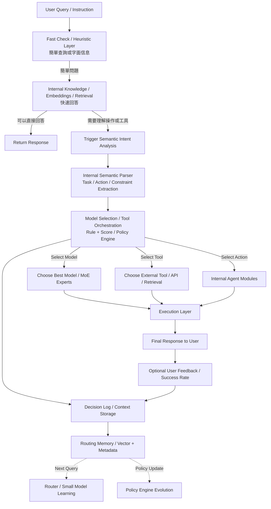

# 系统意图分析与决策流程分析

**创建日期**: 2025-12-30
**创建人**: Daniel Chung
**最后修改日期**: 2025-12-30

---

## 📋 概述

本文档基于实际代码分析，详细说明 AI-Box 系统如何分析用户意图并做出后续工作决策。系统采用**4 层渐进式路由架构（Progressive Routing）**，从快速过滤到完整决策，每个层级都有明确的职责和决策逻辑。

### 核心设计理念

> **"是否先用高階 LLM 直接回答"本身就是一個意圖決策結果**
> **不是每個問題都應該進入 Agent / Tool / Workflow**

系统采用**渐进式路由（Progressive Routing）**架构，先尝试低成本、低延迟的快速路径，只有当需要系统行动时才进入完整的决策流程。

---

## 🏗️ 整体架构流程（4 层渐进式路由）



### 4 层架构说明（ChatGPT 优化流程）

| 层级 | 名称 | 目的 | 技术栈 | 输出 |
|------|------|------|--------|------|
| **Layer 0** | Fast Check / Heuristic Layer | 快速检查（Regex / Heuristic / Length / Risk Filter），识别简单查询或字面信息 | 规则引擎 | 路由到 Layer 1 或 Layer 2 |
| **Layer 1** | Internal Knowledge / Embeddings / Retrieval | 内部知识检索（优先使用内部知识库），快速回答 | 向量检索 + 知识图谱 + Embeddings | 直接答案 或 触发语义意图分析 |
| **Layer 2** | Internal Semantic Parser | 内部语义解析器（Task / Action / Constraint Extraction） | 规则引擎 + 小模型（可选） | RouterDecision（意图分类结果） |
| **Layer 3** | Model Selection / Tool Orchestration | 模型选择和工具编排（Rule + Score / Policy Engine） | Rule + Score Hybrid + Policy Engine | DecisionResult（最终决策） |

### 架构流程说明（ChatGPT 优化流程）

1. **Layer 0 (Fast Check / Heuristic Layer)**：
   - 使用规则和启发式方法快速检查
   - 简单问题 → Layer 1（Internal Knowledge / Retrieval）
   - 复杂/行动/模糊查询 → Layer 2（Semantic Intent Parser）

2. **Layer 1 (Internal Knowledge / Embeddings / Retrieval)**：
   - **优先策略**：使用内部知识库检索（向量检索 + 知识图谱）
   - 如果内部知识库可以回答 → 直接返回结果
   - 如果内部知识库无法回答 → Fallback 到高级 LLM
   - 如果需要理解操作或工具 → 触发语义意图分析，进入 Layer 2

3. **Layer 2 (Internal Semantic Parser)**：
   - 内部语义解析器进行意图分析
   - Task / Action / Constraint Extraction
   - Rule Override 应用硬性规则（Policy Engine）
   - 输出 RouterDecision

4. **Layer 3 (Model Selection / Tool Orchestration)**：
   - 综合决策（Rule + Score / Policy Engine）
   - 选择最佳模型（MoE Experts）
   - 选择外部工具（API / Retrieval）
   - 选择内部 Agent 模块
   - 输出 DecisionResult

5. **Execution Layer**：
   - 执行选定的 Model/Tool/Action
   - 生成最终响应给用户

6. **Memory & Learning**：
   - 记录决策日志（Decision Log / Context Storage）
   - 存储到 Routing Memory（Vector + Metadata）
   - Router / Small Model Learning（用于下次查询）
   - Policy Engine Evolution（策略引擎演进）
   - 用户反馈和成功率用于优化

### 关键设计原则

1. **渐进式路由**：先尝试低成本路径，需要时再进入完整决策
2. **成本优化**：充分利用高级 LLM 的内建知识，避免不必要的系统开销
3. **延迟优化**：直接回答路径延迟最低，用户体验最好
4. **智能触发**：只有当需要系统行动时才进入 Layer 2/3

---

## 🔍 详细流程分析

### 第一步：请求入口（Orchestrator）

**文件**: `agents/services/orchestrator/orchestrator.py`

**入口函数**: `process_natural_language_request()`

**主要步骤**：

1. **生成 trace_id**：用于追踪整个请求生命周期
2. **记录任务开始日志**
3. **调用 Task Analyzer**：解析自然语言意图
4. **记录路由决策**
5. **根据决策类型执行后续流程**

---

### 第二步：Task Analyzer 核心分析流程（4 层架构）

**文件**: `agents/task_analyzer/analyzer.py`

**核心函数**: `TaskAnalyzer.analyze()`

#### Layer 0: Cheap Gating（快速过滤）

**目的**：极低成本快速过滤（Regex / Heuristic / Length / Risk Filter），识别简单查询和复杂/行动查询

**判断逻辑**：

```python
def _is_direct_answer_candidate(self, task: str) -> bool:
    """
    Layer 0: 判断是否应该直接由 LLM 回答（Factoid / Simple Query）
    还是需要进入 Layer 2 进行语义意图分析（Complex / Action / Ambiguous）
    """
    task_lower = task.lower().strip()

    # 1. 长度检查
    if len(task_lower) < 10:
        return True  # 简单查询 → Layer 1

    # 2. 简单关键词
    simple_keywords = ["你好", "hello", "hi", "謝謝", "thanks"]
    if task_lower in simple_keywords:
        return True  # 简单查询 → Layer 1

    # 3. Factoid / Definition 模式
    factoid_patterns = [
        r"什麼是\s*\w+",  # "什麼是 DevSecOps?"
        r"什麼叫\s*\w+",
        r"^[\w\s]+是哪家公司",  # "HCI 是哪家公司？"
        r"^[\w\s]+是什麼",
    ]
    if any(re.match(pattern, task_lower) for pattern in factoid_patterns):
        return True  # Factoid 查询 → Layer 1

    # 4. 检查是否有副作用关键词（需要系统行动）
    action_keywords = ["幫我", "幫", "執行", "運行", "執行", "查詢", "獲取"]
    if any(keyword in task_lower for keyword in action_keywords):
        return False  # 需要系统行动 → Layer 2

    # 5. 检查是否涉及内部状态/工具
    tool_indicators = ["股價", "股票", "天氣", "匯率", "時間", "位置"]
    if any(keyword in task_lower for keyword in tool_indicators):
        return False  # 需要工具 → Layer 2

    return True  # 默认：尝试直接回答 → Layer 1
```

**处理逻辑**：

- **Factoid / Simple Query** → 进入 Layer 1（Fast Answer Layer）
- **Complex / Action / Ambiguous** → 直接进入 Layer 2（Semantic Intent Trigger）

---

#### Layer 1: Internal Knowledge / Embeddings / Retrieval（内部知识检索）

**目的**：优先使用内部知识库（向量检索 + 知识图谱）快速回答，避免不必要的 LLM 调用

**设计理念**：

> **这一层优先使用内部知识，而不是外部 LLM，成本更低、延迟更低**

**技术栈**：

- **向量检索**：使用 EmbeddingService 生成查询向量，从 Vector Store 检索相似内容
- **知识图谱检索**：从 ArangoDB 知识图谱中检索相关实体和关系
- **混合检索**：结合向量检索和知识图谱检索的结果
- **Fallback 机制**：如果内部知识库无法回答，fallback 到高级 LLM

**处理流程**：

1. **优先策略：内部知识库检索**
   - 使用 `ChatMemoryService.retrieve_for_prompt()` 检索相关记忆和 RAG 内容
   - 使用 `EmbeddingService` 生成查询向量
   - 从 Vector Store 检索相似内容
   - 从知识图谱检索相关实体和关系

2. **判断是否可以回答**
   - 如果检索到的内容足够相关（相似度 > 阈值）→ 直接返回答案
   - 如果检索到的内容不够相关 → Fallback 到高级 LLM

3. **Fallback：高级 LLM 直接回答**
   - 使用高级 LLM（gpt-4o 或 gemini-1.5-pro）尝试直接回答
   - LLM 判断是否需要系统行动
   - **如果不需要系统行动**：
     - 直接返回答案
     - 不进入 Layer 2/3
   - **如果需要系统行动**：
     - 返回 `needs_system_action: true`
     - 进入 Layer 2（Semantic Intent Parser）

**优势**：

- ✅ **成本更低**：内部检索成本远低于 LLM API 调用
- ✅ **延迟更低**：向量检索比 LLM 调用更快
- ✅ **可控制性更强**：内部知识库可以精确控制
- ✅ **Fallback 机制**：如果内部知识不足，自动 fallback 到 LLM

---

#### Layer 2: Internal Semantic Parser（内部语义解析器）

**目的**：当 Layer 0 识别为复杂/行动查询，或 Layer 1 判断需要系统行动时，进行语义意图分析和提取

**包含组件**：

1. **Internal Semantic Parser**：内部语义解析器（Task / Action / Constraint Extraction）
   - 规则引擎进行意图提取
   - 小模型（可选）进行语义理解
   - 提取任务类型、行动类型、约束条件
2. **Rule Override**：硬性规则覆盖（Policy Engine）
3. **Router 前置 Recall**：检索相似决策（可选，提供 Context Bias）

**技术栈**：

- **规则引擎**：基于规则的模式匹配和意图提取
- **小模型（可选）**：使用小型 LLM 进行语义理解（成本低于 Router LLM）
- **Fallback 机制**：如果内部解析器无法准确提取，fallback 到 Router LLM

##### 2.2.1 Router 前置 Recall（可选）

**目的**：从 Routing Memory 检索相似的历史决策，为 Router LLM 提供上下文偏置

**实现**：

```python
similar_decisions = await self.routing_memory.recall_similar_decisions(
    request.task, top_k=3, filters={"success": True}
)
```

**注意**：失败不影响主流程，只是提供额外的上下文信息

##### 2.2.2 Router LLM（语义意图分类）

**文件**: `agents/task_analyzer/router_llm.py`

**核心组件**: `RouterLLM.route()`

**固定 System Prompt**（不可动）：

```
You are a routing and classification engine inside an enterprise GenAI system.

Your ONLY responsibility is to classify the user's query and system context
into a routing decision object.

STRICT RULES:
- You must NOT answer the user's question.
- You must NOT perform reasoning, planning, or step-by-step thinking.
- You must NOT select specific tools, agents, or models.
- You must NOT include explanations, markdown, or extra text.

You must ALWAYS return a valid JSON object that strictly follows the given JSON Schema.
If the query is ambiguous, unsafe, or unclear, choose the SAFEST and LOWEST-COST routing option.
```

**Router 输出 Schema**（`RouterDecision`）：

```python
class RouterDecision(BaseModel):
    intent_type: Literal["conversation", "retrieval", "analysis", "execution"]
    complexity: Literal["low", "mid", "high"]
    needs_agent: bool
    needs_tools: bool
    determinism_required: bool
    risk_level: Literal["low", "mid", "high"]
    confidence: float  # 0.0-1.0
```

**失败保护机制**：

- JSON 解析失败 → 使用 `SAFE_FALLBACK`
- Schema 验证失败 → 使用 `SAFE_FALLBACK`
- Confidence < 0.6 → 使用 `SAFE_FALLBACK`
- **不重试 Router LLM**（避免系统雪崩）

**Safe Fallback**：

```python
SAFE_FALLBACK = RouterDecision(
    intent_type="conversation",
    complexity="low",
    needs_agent=False,
    needs_tools=False,
    determinism_required=False,
    risk_level="low",
    confidence=0.0
)
```

##### 2.2.3 Rule Override（硬性规则覆盖 / Policy Engine）

**文件**: `agents/task_analyzer/rule_override.py`

**核心组件**: `RuleOverride.apply()`

**设计原则**：**Rule > LLM 永远成立**（Policy Engine 优先）

**规则类型**：

1. **危险关键词检测**：
   - 关键词：`["delete", "execute", "deploy", "drop", "shutdown", "remove", "destroy"]`
   - 规则：检测到危险关键词 → `risk_level = "high"`，`needs_agent = True`

2. **成本敏感检测**：
   - 关键词：`["便宜", "低成本", "免費", "cheap", "low cost", "free"]`
   - 规则：影响后续模型选择（通过 `system_constraints`）

3. **低延迟要求检测**：
   - 关键词：`["快速", "立即", "實時", "fast", "immediate", "realtime", "real-time"]`
   - 规则：优先使用本地模型（通过 `system_constraints`）

**输出**：`RouterDecision`（包含意图类型、复杂度、风险等级等）

**未来扩展**：

- 集成 OPA (Open Policy Agent) 或自定义 Policy Engine
- 支持动态策略更新
- 从 Routing Memory 中学习策略

---

#### Layer 3: Decision Engine（完整决策引擎）

**目的**：综合所有信息，选择最佳 Agent、Tool、Model

##### 2.3.1 Capability Matching（能力匹配）

**文件**: `agents/task_analyzer/capability_matcher.py`

**核心组件**: `CapabilityMatcher`

**匹配三个维度**：

##### 2.5.1 Agent 能力匹配

**数据源**：

- Agent Registry（`agents/services/registry/registry.py`）
- Agent Discovery（`agents/services/registry/discovery.py`）

**匹配逻辑**：

1. 从 Router Decision 提取所需能力
2. 从 Agent Registry 发现可用 Agent
3. 计算能力匹配度：`len(intersection(required, agent)) / len(required)`
4. 计算总评分（加权平均）：
   - capability_match: 35%
   - cost_score: 20%
   - latency_score: 15%
   - success_history: 20%
   - stability: 10%

##### 2.5.2 Tool 能力匹配

**数据源**：

- Tool Registry（`tools/registry_loader.py`）
- ArangoDB `tools_registry` collection

**匹配逻辑**：

1. 根据 `needs_tools` 和 `determinism_required` 筛选工具
2. 根据任务类型和意图匹配工具用途
3. 计算工具匹配度
4. 按总评分排序

##### 2.5.3 Model 能力匹配

**数据源**：

- LLM Model Service（从 ArangoDB 获取所有可用模型）
- Model Registry

**匹配逻辑**：

1. **提取所需 Model Capabilities**：
   - `conversation` → `CHAT`, `STREAMING`
   - `retrieval` → `CHAT`, `COMPLETION`
   - `analysis` → `CHAT`, `REASONING`
   - `execution` → `CHAT`, `FUNCTION_CALLING`

2. **计算模型评分**：
   - **能力匹配度**：`len(intersection(required, model)) / len(required)`
   - **成本评分**：
     - OLLAMA（本地模型）：0.95（成本最低）
     - 大上下文窗口（>100K）：0.5
     - 中等上下文窗口（>32K）：0.7
     - 小上下文窗口：0.8
   - **延迟评分**：
     - OLLAMA：0.9（延迟最低）
     - 云服务：0.7（延迟中等）
   - **历史成功率**：0.8（默认值，后续可从 Routing Memory 获取）
   - **稳定度**：
     - Active 状态 + 稳定提供商（OLLAMA/OPENAI/GOOGLE）：0.9
     - Active 状态 + 其他提供商：0.8
     - 非 Active 状态：0.5

3. **根据复杂度调整评分**：
   - 复杂任务（`high`）：能力匹配度 × 1.1
   - 简单任务（`low`）：成本评分 × 1.1

4. **总评分计算**（与 Agent/Tool 相同的权重）

##### 2.3.2 Decision Engine（综合决策 - Rule + Score Hybrid）

**文件**: `agents/task_analyzer/decision_engine.py`

**核心组件**: `DecisionEngine.decide()`

**决策流程**：

```
Router Output (from Layer 2)
   ↓
Capability Matching（能力匹配）
   - Agent Registry
   - Tool Registry
   - Model Capability List
   ↓
Rule Filter（硬性淘汰 / Policy Engine）
   - 风险等级过滤
   - 成本限制过滤
   - 约束和政策应用
   ↓
Scoring Engine（加权评分）
   - capability_match: 35%
   - cost_score: 20%
   - latency_score: 15%
   - success_history: 20%
   - stability: 10%
   ↓
Best Candidate Selection
   ↓
Fallback / Override
   ↓
DecisionResult
```

**Rule Filter（硬性规则过滤）**：

1. **风险等级过滤**：
   - `candidate.risk_level <= router.risk_level`

2. **成本限制过滤**：
   - `max_cost = "low"` → `candidate.cost_score >= 0.7`
   - `max_cost = "medium"` → `candidate.cost_score >= 0.5`
   - `max_cost = "high"` → 不限制

**选择逻辑**：

1. **选择 Agent**：
   - 如果 `router_decision.needs_agent` 且 `agent_candidates` 不为空
   - 选择 `total_score` 最高的 Agent
   - 最低可接受评分：0.5

2. **选择 Tool**：
   - 如果 `router_decision.needs_tools` 且 `tool_candidates` 不为空
   - 选择评分最高的工具（最多 3 个）
   - 最低可接受评分：0.5

3. **选择 Model**：
   - 从 `model_candidates` 中选择 `total_score` 最高的模型

4. **Fallback 检查**：
   - 如果总评分 < 0.5 → 使用 Fallback
   - Fallback：不使用 Agent，只使用基础模型

**决策结果**（`DecisionResult`）：

```python
class DecisionResult(BaseModel):
    router_result: RouterDecision
    chosen_agent: Optional[str]
    chosen_tools: List[str]
    chosen_model: Optional[str]
    score: float  # 总评分
    fallback_used: bool
    reasoning: str  # 决策理由
```

##### 2.3.3 传统流程（向后兼容）

为了保持向后兼容，系统还保留了传统的分类和工作流选择流程：

1. **任务分类**：`TaskClassifier.classify()`
2. **工作流选择**：`WorkflowSelector.select()`
3. **LLM 路由选择**：`LLMRouter.route()`

**注意**：这些传统流程的结果主要用于向后兼容，实际决策主要基于新的 4 层架构流程。

---

#### Layer 4: Routing Memory（决策记忆）

**目的**：记录决策历史，用于后续相似决策的检索

**存储方案**（混合方案）：

- **向量存储**：ChromaDB（决策语义）
- **元数据存储**：ArangoDB（决策事实）

**Decision Log 结构**：

```python
class DecisionLog(BaseModel):
    decision_id: str
    timestamp: datetime
    query: Dict[str, Any]  # text, embedding (optional)
    router_output: RouterDecision
    decision_engine: DecisionResult
    execution_result: Optional[Dict[str, Any]]  # success, latency_ms, cost
```

**写入流程**：

- **异步写入**（Fire-and-Forget）：不在执行路径上，避免延迟
- 失败不影响主流程
- 支持批量写入

---

### 第三步：后续处理（Orchestrator）

根据 Task Analyzer 的决策结果，Orchestrator 执行后续处理：

#### 3.1 日志查询（LOG_QUERY）

**直接处理**：不路由到 Agent，直接调用 `LogService` 执行查询

**原因**：

1. 日志查询是查询操作，不是业务逻辑执行
2. 减少架构复杂度
3. 性能更好（减少一层调用开销）

#### 3.2 配置操作（ConfigIntent）

**处理流程**：

1. **澄清检查**：如果 `clarification_needed = true`，返回澄清问题
2. **预检**：格式与边界验证
3. **权限检查**：通过 Security Agent
4. **路由到 System Config Agent**：执行配置操作

#### 3.3 一般任务

**处理流程**：

1. **检查是否需要 Agent**：根据 `requires_agent` 和 `suggested_agents`
2. **路由到 Agent**：使用 `suggested_agents[0]` 作为目标 Agent
3. **传递决策结果**：将 `decision_result` 传递给 Agent

---

## 📊 决策维度总结

### 意图类型（Intent Type）

| 类型 | 说明 | 典型场景 |
|------|------|----------|
| `conversation` | 对话 | 日常聊天、解释说明 |
| `retrieval` | 检索 | 查找信息、搜索数据 |
| `analysis` | 分析 | 推理、比较、评估 |
| `execution` | 执行 | 操作、命令、执行动作 |

### 复杂度（Complexity）

| 级别 | 说明 | 决策影响 |
|------|------|----------|
| `low` | 单步、明显 | 优先考虑成本，简单模型即可 |
| `mid` | 结构化推理 | 平衡成本和质量 |
| `high` | 多步或编排 | 优先考虑能力匹配度，需要强大模型 |

### 风险等级（Risk Level）

| 级别 | 说明 | 决策影响 |
|------|------|----------|
| `low` | 低风险 | 可以使用任何 Agent/Tool/Model |
| `mid` | 中等风险 | 避免高风险操作 |
| `high` | 高风险 | 强制使用 Agent 审核，限制 Tool 使用 |

---

## 🔧 评分体系

### 评分维度权重

| 维度 | 权重 | 说明 |
|------|------|------|
| capability_match | 35% | 能力匹配度（最重要） |
| cost_score | 20% | 成本评分（越便宜越高） |
| latency_score | 15% | 延迟评分（越快越高） |
| success_history | 20% | 历史成功率 |
| stability | 10% | 输出稳定度 |

### 总评分计算公式

```python
total_score = (
    0.35 * capability_match +
    0.20 * cost_score +
    0.15 * latency_score +
    0.20 * success_history +
    0.10 * stability
)
```

### 评分阈值

- **最低可接受评分**：0.5
- **Router LLM 最低置信度**：0.6
- **Fallback 触发阈值**：总评分 < 0.5

---

## 🎯 关键设计原则

### 1. 渐进式路由（Progressive Routing）

- **Layer 0 → Layer 1**：先尝试低成本、低延迟的快速路径
- **Layer 1 → Layer 2/3**：只有当需要系统行动时才进入完整决策
- **成本优化**：充分利用高级 LLM 的内建知识，避免不必要的系统开销

### 2. 分层决策

- **Layer 1 (Fast Answer)**：尝试直接回答，判断是否需要系统行动
- **Layer 2 (Semantic Intent)**：Router LLM 只做意图分类，不做资源选择
- **Layer 3 (Decision Engine)**：Capability Matcher 只做能力匹配，Decision Engine 做最终决策

### 3. 规则优先（Rule > LLM）

- 硬性规则（Rule Override）永远覆盖 LLM 决策
- 确保系统安全性和可控性

### 4. 失败保护

- Layer 1 失败 → 进入 Layer 2/3
- Router LLM 失败 → 使用 Safe Fallback
- 不重试 Router LLM（避免系统雪崩）
- Routing Memory 写入失败不影响主流程

### 5. 成本与延迟优化

- **Layer 0**：极低成本规则检查
- **Layer 1**：一次高级 LLM 调用（成本 < 启动 Agent/Tool/Workflow）
- **Layer 2/3**：仅在需要时执行，避免不必要的开销
- 优先使用本地模型（OLLAMA）

### 6. 智能触发

- Layer 1 判断是否需要系统行动（不是字词匹配，而是语义意图）
- 只有当需要外部状态、工具副作用、系统操作时才进入 Layer 2/3

---

## 📝 数据模型关键字段

### RouterDecision

```python
{
    "intent_type": "conversation" | "retrieval" | "analysis" | "execution",
    "complexity": "low" | "mid" | "high",
    "needs_agent": bool,
    "needs_tools": bool,
    "determinism_required": bool,
    "risk_level": "low" | "mid" | "high",
    "confidence": float  # 0.0-1.0
}
```

### DecisionResult

```python
{
    "router_result": RouterDecision,
    "chosen_agent": Optional[str],
    "chosen_tools": List[str],
    "chosen_model": Optional[str],
    "score": float,  # 0.0-1.0
    "fallback_used": bool,
    "reasoning": str
}
```

### CapabilityMatch

```python
{
    "candidate_id": str,
    "candidate_type": "agent" | "tool" | "model",
    "capability_match": float,  # 0.0-1.0
    "cost_score": float,  # 0.0-1.0
    "latency_score": float,  # 0.0-1.0
    "success_history": float,  # 0.0-1.0
    "stability": float,  # 0.0-1.0
    "total_score": float,  # 0.0-1.0
    "metadata": Dict[str, Any]
}
```

---

## 🔍 实际执行示例

### 示例 1：简单查询（Layer 0 → Layer 1）

**用户输入**："你好"

**处理流程**：

1. **Layer 0 (Cheap Gating)**：识别为简单查询（`simple_keywords` 匹配）
2. **Layer 1 (Fast Answer)**：使用高级 LLM 直接回答
   - 直接返回："你好！我可以帮助你什么？"
   - 不进入 Layer 2/3
   - 成本最低，延迟最低

### 示例 1b：知识性问题（Layer 0 → Layer 1）

**用户输入**："什麼是 DevSecOps?"

**处理流程**：

1. **Layer 0 (Fast Check / Heuristic Layer)**：匹配 `factoid_patterns`，识别为简单问题
2. **Layer 1 (Internal Knowledge / Retrieval)**：
   - **优先策略**：使用内部知识库检索（向量检索 + 知识图谱）
   - 如果检索到相关内容 → 基于检索内容生成答案
   - 如果检索不到相关内容 → Fallback 到高级 LLM
   - 高级 LLM 判断：不需要系统行动（仅需知识回答）
   - 直接返回 DevSecOps 的定义和说明
   - 不进入 Layer 2/3

### 示例 2：需要实时数据（Layer 0 → Layer 1 → Layer 2/3）

**用户输入**："幫我看看台積電今天的股價"

**处理流程**：

1. **Layer 0 (Fast Check / Heuristic Layer)**：检测到工具关键词 `"股價"`，识别为复杂/行动查询
2. **Layer 1 (Internal Knowledge / Retrieval)**：
   - **优先策略**：使用内部知识库检索
   - 检索结果：无法提供实时股價数据
   - **Fallback**：使用高级 LLM 判断
   - 高级 LLM 判断：需要实时数据 → `{"needs_system_action": true}`
   - 进入 Layer 2/3
3. **Layer 2 (Semantic Intent Analysis)**：
   - Router LLM 输出：

     ```json
     {
         "intent_type": "retrieval",
         "complexity": "low",
         "needs_agent": false,
         "needs_tools": true,
         "determinism_required": true,
         "risk_level": "mid",
         "confidence": 0.90
     }
     ```

4. **Layer 3 (Decision Engine)**：
   - Tool 匹配：`stock_price_tool`（评分：0.915）
   - Model 匹配：`ollama:llama3:8b`（评分：0.895）
   - 选择工具和模型，执行查询

### 示例 3：复杂分析任务（Layer 0 → Layer 1 → Layer 2/3）

**用户输入**："分析上个月的销售数据，找出异常趋势"

**处理流程**：

1. **Layer 0 (Cheap Gating)**：检测到 `"幫我"`，需要系统行动
2. **Layer 1 (Fast Answer)**：
   - 高级 LLM 判断：需要访问内部数据 → `{"needs_system_action": true}`
   - 进入 Layer 2/3
3. **Layer 2 (Semantic Intent Analysis)**：
   - Router 前置 Recall：检索相似决策（如果有）
   - Router LLM 输出：

   ```json
   {
       "intent_type": "analysis",
       "complexity": "high",
       "needs_agent": true,
       "needs_tools": true,
       "determinism_required": false,
       "risk_level": "low",
       "confidence": 0.85
   }
   ```

4. Rule Override：无危险关键词，无特殊规则
5. Capability Matching：
   - Agent 匹配：找到 `data_analysis_agent`（评分：0.82）
   - Tool 匹配：找到 `sql_query_tool`（评分：0.75）
   - Model 匹配：找到 `gpt-4o`（评分：0.78）
6. Decision Engine 决策：
   - `chosen_agent="data_analysis_agent"`
   - `chosen_tools=["sql_query_tool"]`
   - `chosen_model="gpt-4o"`
   - `score=0.78`
7. 记录决策到 Routing Memory
8. Orchestrator 路由到 `data_analysis_agent`

### 示例 4：危险操作（Layer 0 → Layer 1 → Layer 2/3）

**用户输入**："删除所有测试数据"

**处理流程**：

1. **Layer 0 (Cheap Gating)**：检测到 `"刪除"`，需要系统行动
2. **Layer 1 (Fast Answer)**：
   - 高级 LLM 判断：需要执行操作 → `{"needs_system_action": true}`
   - 进入 Layer 2/3
3. **Layer 2 (Semantic Intent Analysis)**：
   - Router LLM 输出：

   ```json
   {
       "intent_type": "execution",
       "complexity": "mid",
       "needs_agent": false,
       "needs_tools": true,
       "determinism_required": true,
       "risk_level": "low",
       "confidence": 0.70
   }
   ```

2. Rule Override 检测到危险关键词 `"delete"`：
   - 覆盖：`risk_level = "high"`
   - 覆盖：`needs_agent = true`
3. Capability Matching：
   - Agent 匹配：找到 `security_agent`（评分：0.88）
   - Tool 匹配：找到 `database_tool`（评分：0.65）
   - Model 匹配：找到 `gpt-4o`（评分：0.72）
4. Decision Engine 决策：
   - `chosen_agent="security_agent"`（强制审核）
   - `chosen_tools=["database_tool"]`
   - `chosen_model="gpt-4o"`
   - `score=0.75`
5. Orchestrator 路由到 `security_agent`（进行权限检查和安全审核）

---

## 🚀 性能优化点

### 1. Layer 0 (Cheap Gating) 快速路径

- 极低成本规则检查（正则表达式、关键词匹配）
- 快速识别 Direct Answer Candidate 和需要系统行动的查询

### 2. Layer 1 (Fast Answer) 成本优化

- **一次高级 LLM 调用** vs 多次调用 + 决策开销
- 充分利用 LLM 内建知识，避免不必要的系统开销
- 延迟最低：直接回答比复杂决策更快

### 3. 条件化执行 Layer 2/3

- 只有当 Layer 1 判断需要系统行动时才执行
- 减少不必要的 Router LLM 调用
- 减少不必要的 Capability Matching 和 Decision Engine 开销

### 4. 异步写入 Routing Memory

- 决策记录异步执行，不阻塞主流程
- 失败不影响主流程

### 5. 本地模型优先

- OLLAMA 模型成本最低、延迟最低
- 优先使用本地模型（如果可用）

### 6. 批量操作

- Routing Memory 支持批量写入
- 定期批量向量化

---

## 🔮 未来改进方向

### 1. Layer 1 判断优化

- 优化 System Prompt，提高判断准确率
- 使用 Function Calling 让 LLM 返回结构化判断结果
- 根据历史数据调整判断阈值

### 2. Router LLM 缓存

- 对相似查询缓存 Router 决策
- 使用 query embedding 作为缓存 key

### 3. 历史数据集成

- 从 Routing Memory 读取历史成功率
- 计算稳定性指标
- 动态调整评分权重
- 优化 Layer 0 的规则（基于历史数据）

### 4. 小模型 Router

- 使用历史决策训练小模型
- 降低 Router LLM 成本
- 考虑用小型模型替代 Layer 2 的 Router LLM

### 5. Policy Engine

- 从 Routing Memory 提取策略
- 使用 OPA 或自研 Policy Engine
- 自动化 Layer 0 规则的生成和优化

### 6. Layer 1 缓存优化

- 对常见知识性问题缓存答案
- 使用 query embedding 作为缓存 key
- 定期更新缓存内容

### 7. Policy Engine 集成

- 集成 OPA (Open Policy Agent) 或自定义 Policy Engine
- 从 Routing Memory 中学习策略
- 支持动态策略更新

### 8. Router 小模型训练

- 使用历史决策数据训练小型 Router 模型
- 降低 Router LLM 成本
- 考虑用小型模型替代 Layer 2 的 Router LLM

---

## 📚 相关文档

- [Task-Analyzer-细化开发规格](../核心组件/Task-Analyzer-细化开发规格.md)
- [任务分析流程追踪](../../任务分析流程追踪.md)
- [LLM模型列表](./LLM模型列表.md)

---

---

## 📝 架构变更说明

### 2025-12-30：采用 ChatGPT 优化流程（4 层渐进式路由架构）

**变更内容**：

1. **优化 Layer 1 (Internal Knowledge / Embeddings / Retrieval)**：
   - **优先策略**：使用内部知识库检索（向量检索 + 知识图谱）
   - **Fallback 机制**：如果内部知识库无法回答，fallback 到高级 LLM
   - **成本优化**：内部检索成本远低于 LLM API 调用
   - **延迟优化**：向量检索比 LLM 调用更快

2. **扩展 Layer 0 (Fast Check / Heuristic Layer)**：
   - 更丰富的规则检查（factoid、definition、副作用检查）
   - 识别简单问题和复杂/行动查询

3. **优化 Layer 2 (Internal Semantic Parser)**：
   - 内部语义解析器（规则引擎 + 小模型）
   - Fallback 到 Router LLM（如果内部解析器无法准确提取）

4. **条件化执行 Layer 2/3**：
   - 只有当 Layer 1 判断需要系统行动时才执行
   - 减少不必要的系统开销

**优势**：

- ✅ **成本优化**：内部检索成本远低于 LLM API 调用
- ✅ **延迟优化**：向量检索比 LLM 调用更快
- ✅ **可控制性更强**：内部知识库可以精确控制
- ✅ **Fallback 机制**：如果内部知识不足，自动 fallback 到 LLM
- ✅ **用户体验**：更符合 ChatGPT/Gemini 的交互模式
- ✅ **智能触发**：基于语义意图判断，而非字词匹配

---

---

## 📊 架构对比分析

详细对比 ChatGPT 优化流程与当前实现的差异，请参阅：

- [架构对比分析-ChatGPT优化流程](./架构对比分析-ChatGPT优化流程.md)

---

**最后更新日期**: 2025-12-30
**维护人**: Daniel Chung
