# 文件上傳功能與架構總結

**創建日期**: 2025-12-06
**創建人**: Daniel Chung
**最後修改日期**: 2025-12-06 (更新圖片處理說明)

## 目錄

1. [系統概述](#系統概述)
2. [前端操作流程](#前端操作流程)
3. [後端架構](#後端架構)
4. [向量化流程](#向量化流程)
5. [知識圖譜化流程](#知識圖譜化流程)
6. [AI治理機制](#ai治理機制)
7. [系統優勢](#系統優勢)
8. [技術架構圖](#技術架構圖)

---

## 系統概述

AI-Box 文件上傳系統是一個完整的企業級文件處理平台，支持多種文件格式的上傳、解析、向量化、知識圖譜提取和AI治理。系統採用前後端分離架構，提供安全、高效、可擴展的文件處理能力。

### 核心功能

- ✅ **多格式文件上傳**: 支持 PDF、Word、Excel、Markdown、CSV、TXT 等文檔格式，以及 BMP、PNG、JPEG、SVG 等圖片格式
- ✅ **圖片智能解釋**: 使用視覺模型（qwen3-vl:8b）自動生成圖片描述，支持 PNG、JPEG、BMP、SVG、GIF、WebP 等格式
- ✅ **智能文件解析**: 自動識別文件類型並使用對應解析器提取文本內容
- ✅ **文本分塊處理**: 將長文檔智能分割為適合處理的文本塊
- ✅ **向量化存儲**: 使用 Ollama 本地模型生成嵌入向量，存儲到 ChromaDB
- ✅ **知識圖譜提取**: 自動提取實體、關係，構建知識圖譜存儲到 ArangoDB
- ✅ **AI治理**: 完整的模型使用追蹤、數據質量監控、偏見檢測和可解釋性
- ✅ **安全加固**: RBAC權限控制、文件加密、惡意文件掃描、路徑驗證

---

## 前端操作流程

### 1. 文件上傳界面

**組件位置**: `ai-bot/src/components/FileUploadModal.tsx`

#### 功能特性

- **拖拽上傳**: 支持拖放文件到上傳區域
- **多文件選擇**: 支持同時選擇多個文件
- **圖片預覽**: 自動顯示圖片文件的預覽圖
- **文件類型驗證**: 前端驗證文件類型和大小
- **上傳進度顯示**: 實時顯示每個文件的上傳進度
- **暫存工作區**: 可選擇上傳到「暫存工作區」或指定任務

#### 支持的文件類型

**文檔類型**:

- PDF (`.pdf`)
- Word (`.docx`, `.doc`)
- Excel (`.xlsx`, `.xls`)
- Markdown (`.md`)
- CSV (`.csv`)
- 純文本 (`.txt`)

**圖片類型**:

- BMP (`.bmp`)
- PNG (`.png`)
- JPEG (`.jpg`, `.jpeg`)
- SVG (`.svg`)
- GIF (`.gif`)
- WebP (`.webp`)

#### 操作流程

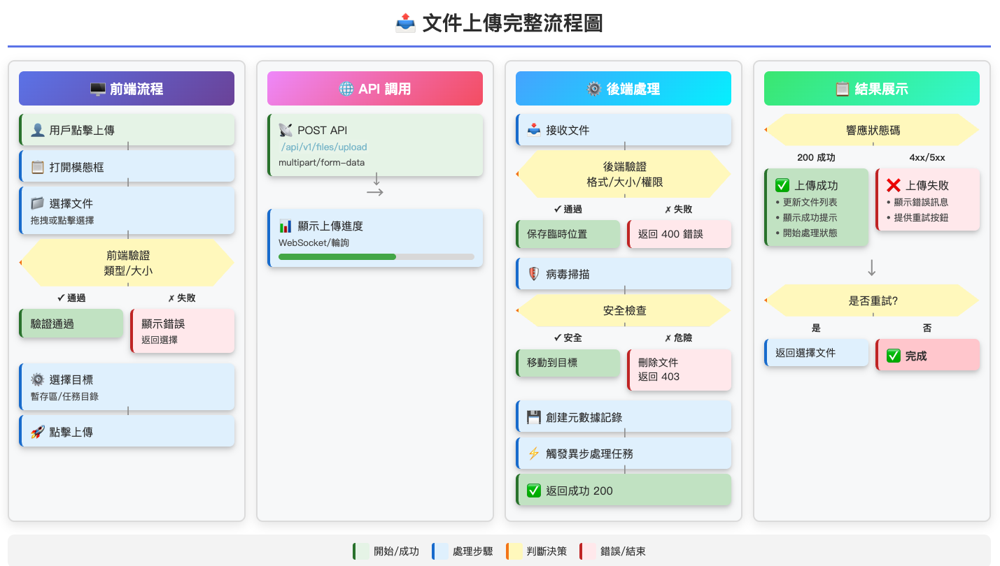

### 2. 文件管理界面

**組件位置**: `ai-bot/src/pages/FileManagement.tsx`

#### 功能特性

- **文件樹視圖**: 按任務/工作區組織的文件目錄結構
- **文件列表**: 顯示文件詳情（名稱、大小、類型、上傳時間）
- **文件搜索**: 支持按文件名、類型搜索
- **文件預覽**: 支持在線預覽文件內容
- **文件下載**: 支持下載已上傳的文件
- **處理狀態**: 顯示文件的分塊、向量化、KG提取狀態

#### 文件樹結構

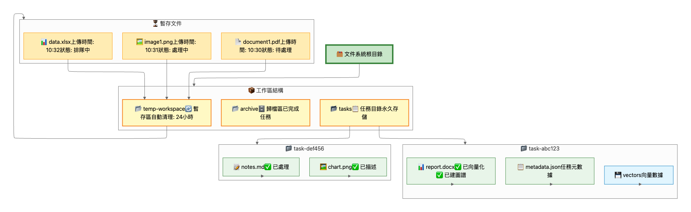

### 3. API 調用

**API 客戶端**: `ai-bot/src/lib/api.ts`

#### 主要 API 端點

```typescript
// 上傳文件
POST /api/v1/files/upload
Body: FormData {
  files: File[],
  task_id?: string
}

// 獲取文件列表
GET /api/v1/files?task_id=xxx&user_id=xxx

// 獲取文件詳情
GET /api/v1/files/{file_id}

// 獲取處理狀態
GET /api/v1/files/{file_id}/processing-status

// 下載文件
GET /api/v1/files/{file_id}/download

// 預覽文件
GET /api/v1/files/{file_id}/preview
```

---

## 後端架構

### 1. 文件上傳路由

**文件位置**: `api/routers/file_upload.py`

#### 核心流程

```python
@router.post("/upload")
async def upload_files(
    files: List[UploadFile],
    task_id: Optional[str],
    current_user: User
) -> JSONResponse:
    """
    文件上傳處理流程:
    1. 權限檢查 (RBAC)
    2. 文件驗證 (類型、大小、內容掃描)
    3. 文件名清理和路徑驗證
    4. 文件存儲 (本地/S3/OSS)
    5. 元數據創建
    6. 觸發異步處理 (分塊+向量化+KG提取)
    7. 返回上傳結果
    """
```

#### 安全檢查

1. **權限驗證**: 檢查用戶是否有 `file:upload` 權限
2. **文件掃描**: 使用 `FileScanner` 檢測惡意內容
3. **文件名清理**: 使用 `sanitize_filename` 防止路徑遍歷攻擊
4. **路徑驗證**: 使用 `validate_path` 檢查路徑安全性
5. **文件加密**: 可選的文件內容加密存儲（AES-256-GCM）

### 2. 文件存儲層

**文件位置**: `storage/file_storage.py`

#### 支持的存儲後端

- **本地存儲** (`LocalFileStorage`): 存儲到本地文件系統
- **S3存儲** (`S3FileStorage`): 存儲到 AWS S3
- **OSS存儲** (`OSSFileStorage`): 存儲到阿里雲 OSS

#### 存儲配置

```json
{
  "file_upload": {
    "storage": {
      "type": "local",
      "base_path": "/data/files",
      "encryption": {
        "enabled": true,
        "algorithm": "AES-256-GCM"
      }
    }
  }
}
```

### 3. 文件元數據服務

**文件位置**: `services/api/services/file_metadata_service.py`

#### 元數據模型

```python
class FileMetadata(BaseModel):
    file_id: str
    filename: str
    file_type: str
    file_size: int
    user_id: str
    task_id: str  # 用於組織文件到工作區
    upload_time: datetime
    status: str  # uploaded, processing, completed, failed
    tags: List[str]
    description: Optional[str]
```

#### 數據庫

- **ArangoDB**: 存儲文件元數據
- **集合名稱**: `file_metadata`
- **索引**: `file_id`, `filename`, `user_id`, `task_id`, `upload_time`

---

## 向量化流程

### 1. 文件解析

**解析器位置**: `services/api/processors/parsers/`

#### 支持的解析器

- **PDF解析器** (`pdf_parser.py`): 使用 PyPDF2 提取PDF文本
- **Word解析器** (`docx_parser.py`): 使用 python-docx 提取Word文檔
- **Markdown解析器** (`md_parser.py`): 解析Markdown格式
- **文本解析器** (`txt_parser.py`): 處理純文本文件
- **圖片解析器** (`image_parser.py`): 使用視覺模型（qwen3-vl:8b）生成圖片描述

#### 圖片解析器詳解

**圖片解析器** (`image_parser.py`): 使用視覺模型生成圖片描述

**技術實現**:

- **視覺模型**: 使用 Ollama 的 `qwen3-vl:8b` 模型
- **圖片元數據提取**: 使用 Pillow 庫提取圖片尺寸、格式、模式等信息
- **描述生成**: 調用視覺模型生成詳細的圖片描述文本
- **異步處理**: 支持異步圖片解析，不阻塞其他文件處理

**處理流程**:

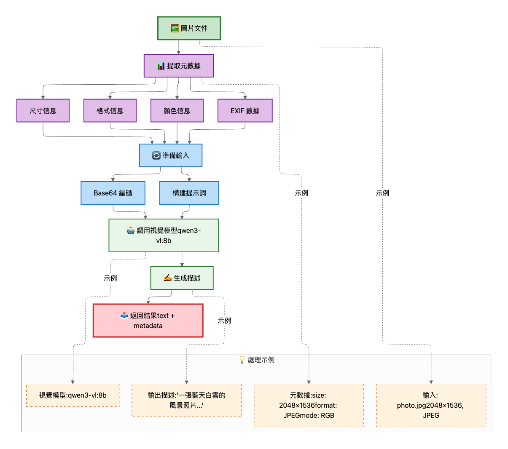

**支持的圖片格式**:

- PNG (`.png`)
- JPEG (`.jpg`, `.jpeg`)
- BMP (`.bmp`)
- SVG (`.svg`)
- GIF (`.gif`)
- WebP (`.webp`)

**錯誤處理**:

- 圖片解析失敗時返回錯誤描述，不影響其他文件處理
- 自動降級策略，確保系統穩定性

#### 解析流程

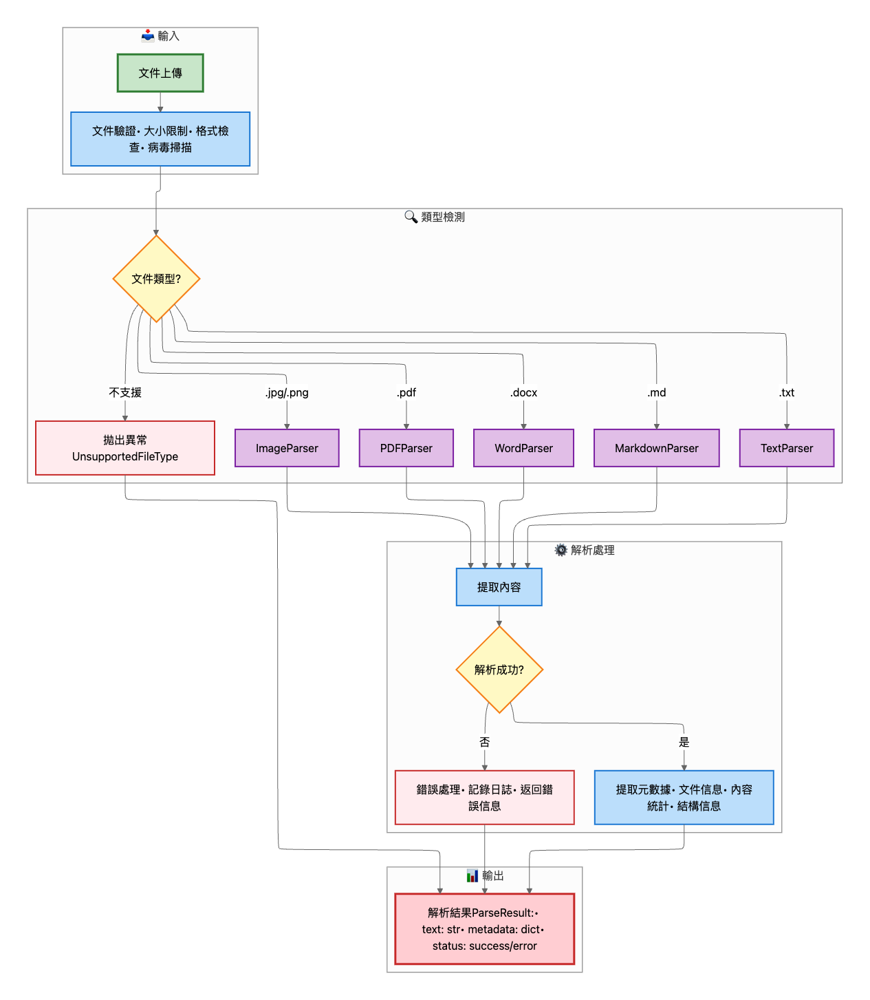

### 2. 文本分塊

**分塊處理器**: `services/api/processors/chunk_processor.py`

#### 分塊策略

- **固定大小分塊**: 按字符數或token數分割
- **重疊分塊**: 相鄰分塊之間有重疊，保證上下文連續性
- **智能分塊**: 按段落、句子邊界分割，保持語義完整性

#### 分塊配置

```json
{
  "chunk_processing": {
    "chunk_size": 1000,
    "chunk_overlap": 200,
    "strategy": "smart"  // fixed, smart, semantic
  }
}
```

### 3. 向量化服務

**服務位置**: `services/api/services/embedding_service.py`

#### 向量化流程

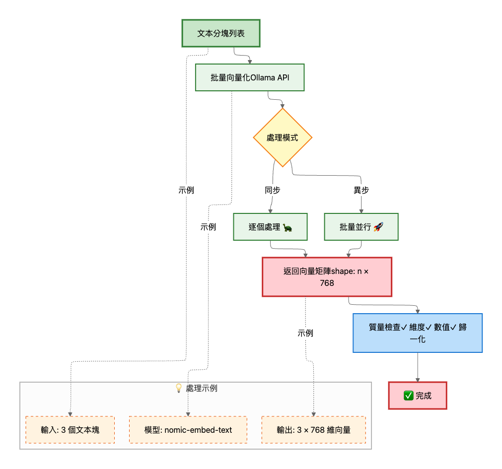

#### 技術細節

- **模型**: 使用 Ollama 本地模型 `nomic-embed-text`
- **批量處理**: 支持批量生成向量，提高效率
- **重試機制**: 自動重試失敗的請求（指數退避）
- **追蹤**: 記錄模型使用情況（用於AI治理）

#### 向量化代碼示例

```python
embedding_service = get_embedding_service()

# 單個文本向量化
vector = await embedding_service.generate_embedding(
    text="文本內容",
    user_id="user-123",
    file_id="file-456",
    task_id="task-789"
)

# 批量向量化
vectors = await embedding_service.generate_embeddings_batch(
    texts=["文本1", "文本2", "文本3"]
)
```

### 4. 圖片文件的特殊處理

**圖片文件處理流程**:

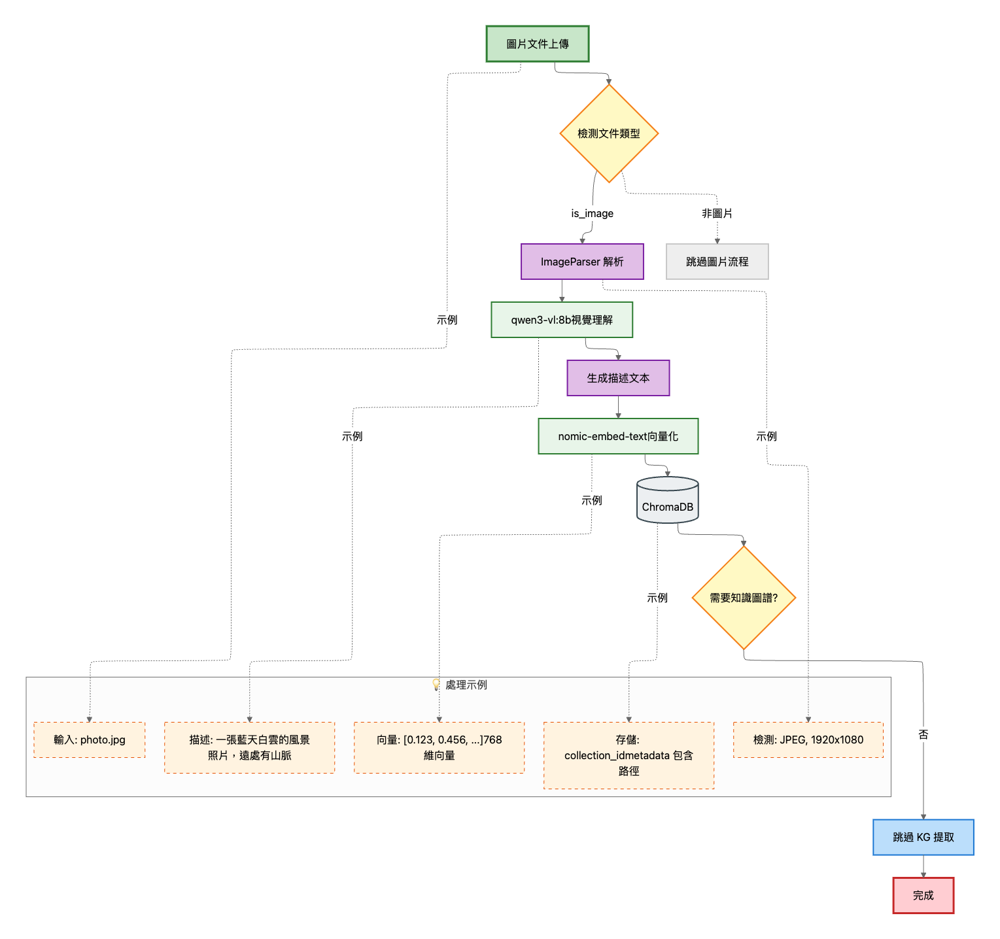

**圖片元數據存儲**:

ChromaDB 中存儲的圖片元數據包含：

- `file_id`: 文件ID
- `chunk_index`: 0（圖片只有一個chunk）
- `text`: 圖片描述文本
- `content_type`: "image"（標識這是圖片內容）
- `image_path`: 圖片文件路徑
- `image_format`: 圖片格式（PNG/JPEG等）
- `image_width`: 圖片寬度
- `image_height`: 圖片高度
- `vision_model`: 使用的視覺模型名稱（qwen3-vl:8b）
- `description_confidence`: 描述置信度（如果可用）

**與文本文件的區別**:

| 特性     | 文本文件               | 圖片文件                  |
| -------- | ---------------------- | ------------------------- |
| 解析方式 | 文本提取               | 視覺模型描述生成          |
| 分塊策略 | 智能分塊（多個chunks） | 單個chunk（描述文本）     |
| 向量化   | 每個chunk單獨向量化    | 描述文本向量化            |
| KG提取   | 執行NER/RE/RT          | 跳過（不適合）            |
| 元數據   | 文本元數據             | 圖片元數據 + 視覺模型信息 |

### 5. 向量存儲

### 4. 向量存儲

**服務位置**: `services/api/services/vector_store_service.py`

#### 存儲流程

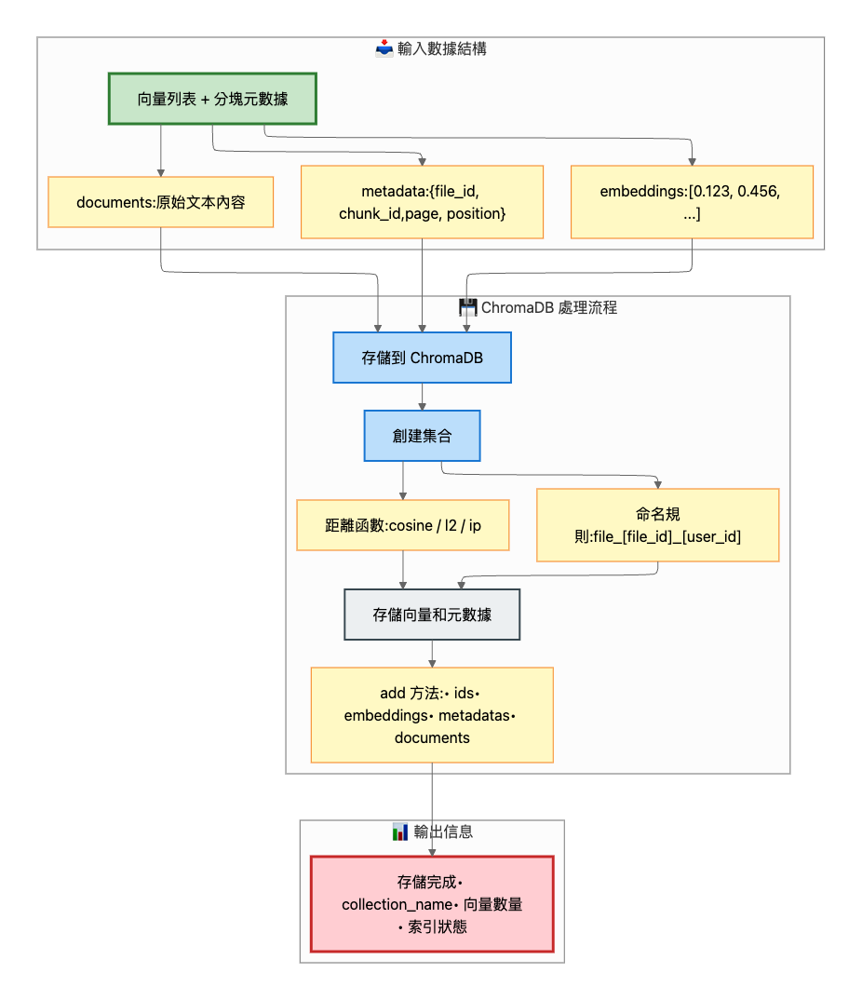

#### ChromaDB 結構

```python
{
  "ids": ["chunk-1", "chunk-2", ...],
  "embeddings": [[0.1, 0.2, ...], [0.3, 0.4, ...], ...],
  "metadatas": [
    {
      "file_id": "file-123",
      "chunk_index": 0,
      "text": "分塊文本",
      "user_id": "user-456"
    },
    ...
  ],
  "documents": ["分塊文本1", "分塊文本2", ...]
}
```

#### 查詢示例

```python
# 相似度搜索
results = vector_store_service.search(
    query_vector=query_embedding,
    collection_name="file_123_user_456",
    top_k=10
)
```

---

## 知識圖譜化流程

### 0. 圖片文件的處理

**重要**: 圖片文件在知識圖譜提取階段會被跳過。

**原因**:

- 圖片描述文本是視覺模型生成的摘要，不包含結構化的實體和關係
- 圖片描述主要用於語義搜索，而非知識圖譜構建
- 跳過KG提取可以提高處理效率，避免不必要的模型調用

**處理邏輯**:

```python
if is_image_file:
    # 跳過知識圖譜提取
    logger.info("圖片文件跳過知識圖譜提取")
else:
    # 執行正常的KG提取流程
    process_kg_extraction(...)
```

### 1. 三元組提取

**服務位置**: `genai/api/services/triple_extraction_service.py`

#### 提取流程

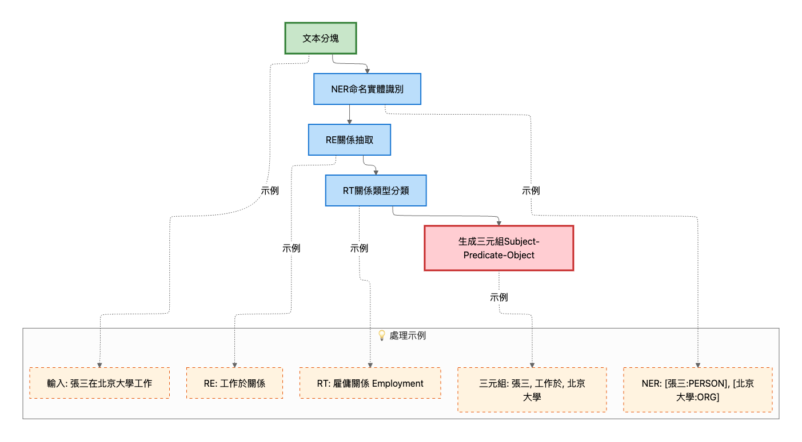

#### NER (命名實體識別)

**服務**: `genai/api/services/ner_service.py`

- **支持的模型**: spaCy, Ollama, Gemini
- **實體類型**: PERSON, ORG, LOC, DATE, MONEY, PRODUCT, EVENT 等
- **輸出**: 實體列表，包含文本、類型、位置、置信度

#### RE (關係抽取)

**服務**: `genai/api/services/re_service.py`

- **支持的模型**: Transformers, Ollama, Gemini
- **關係類型**: LOCATED_IN, WORKS_FOR, PART_OF, RELATED_TO 等
- **輸出**: 關係列表，包含主體、關係、客體、置信度、上下文

#### RT (關係類型分類)

**服務**: `genai/api/services/rt_service.py`

- **功能**: 對提取的關係進行類型分類
- **輸出**: 關係類型列表，包含類型名稱和置信度

### 2. 知識圖譜構建

**服務位置**: `services/api/services/kg_extraction_service.py`

#### 構建流程

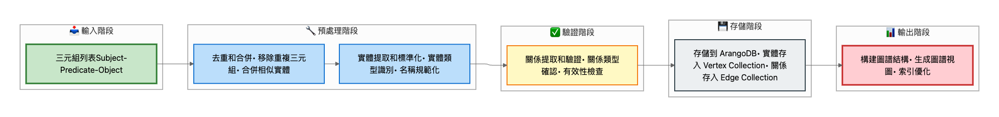

#### ArangoDB 圖譜結構

**頂點集合 (Vertices)**:

- `entities`: 實體節點
  - `_key`: 實體ID
  - `name`: 實體名稱
  - `type`: 實體類型
  - `file_id`: 來源文件ID
  - `user_id`: 用戶ID

**邊集合 (Edges)**:

- `relations`: 關係邊
  - `_from`: 主體實體ID
  - `_to`: 客體實體ID
  - `relation_type`: 關係類型
  - `confidence`: 置信度
  - `context`: 上下文
  - `file_id`: 來源文件ID

#### 圖譜查詢示例

```aql
// 查詢實體的所有關係
FOR v, e, p IN 1..2 OUTBOUND 'entities/entity-123' relations
  RETURN {
    entity: v.name,
    relation: e.relation_type,
    path: p.vertices[*].name
  }

// 查詢兩個實體之間的路徑
FOR path IN ANY SHORTEST_PATH
  'entities/entity-1' TO 'entities/entity-2'
  relations
  RETURN path
```

### 3. KG提取配置

```json
{
  "services": {
    "kg_extraction": {
      "mode": "all_chunks",  // all_chunks, important_only, sample
      "min_chunk_length": 100,
      "max_chunks": null,
      "importance_threshold": 0.7,
      "ner_model": "ollama",
      "re_model": "ollama",
      "rt_model": "ollama"
    }
  }
}
```

---

## AI治理機制

### 1. 模型使用追蹤

**服務位置**: `services/api/services/model_usage_service.py`

#### 追蹤內容

- **模型名稱和版本**: 記錄使用的模型
- **用戶ID**: 追蹤誰使用了模型
- **文件ID和任務ID**: 關聯到具體的文件和任務
- **輸入/輸出長度**: 記錄處理的數據量
- **延遲時間**: 記錄響應時間
- **成功率**: 記錄成功/失敗狀態
- **使用目的**: embedding, ner, re, rt, generation, chat 等

#### 追蹤實現

**Ollama客戶端集成**: `llm/clients/ollama.py`

```python
async def generate(
    self,
    prompt: str,
    *,
    user_id: Optional[str] = None,
    file_id: Optional[str] = None,
    task_id: Optional[str] = None,
    purpose: str = "generation"
):
    # ... 調用模型 ...
    # 自動追蹤使用情況
    _track_model_usage(
        model_name=model,
        user_id=user_id,
        input_length=len(prompt),
        output_length=len(text),
        latency_ms=latency_ms,
        purpose=purpose,
        ...
    )
```

**API端點**: `api/routers/model_usage.py`

```python
# 查詢模型使用記錄
GET /api/v1/model-usage/records?model_name=xxx&user_id=xxx

# 獲取模型使用統計
GET /api/v1/model-usage/stats?start_time=xxx&end_time=xxx
```

### 2. 數據質量監控

**服務位置**: `services/api/services/data_quality_service.py`

#### 檢查項目

1. **完整性檢查**:

   - 必需字段是否存在
   - 文件大小是否合理
   - 元數據是否完整
2. **一致性檢查**:

   - 文件擴展名與MIME類型是否匹配
   - 時間戳是否合理
3. **準確性檢查**:

   - 上傳時間是否在未來
   - 數據格式是否正確
4. **異常檢測**:

   - 文件名是否過長
   - 文件是否異常大

#### API端點

```python
# 檢查文件質量
GET /api/v1/data-quality/check/{file_id}
```

### 3. 偏見檢測

**服務位置**: `services/api/services/bias_detection_service.py`

#### 檢測類型

- **性別偏見**: 檢測性別相關敏感詞
- **種族偏見**: 檢測種族相關敏感詞
- **年齡偏見**: 檢測年齡相關敏感詞

#### 檢測方法

- **規則檢測**: 基於敏感詞模式匹配
- **統計檢測**: 檢測實體分布偏差
- **關係檢測**: 檢測關係中的偏見

### 4. 可解釋性

**服務位置**: `services/api/services/explainability_service.py`

#### 解釋內容

- **NER結果解釋**: 解釋實體識別的依據和置信度
- **RE結果解釋**: 解釋關係抽取的上下文和依據
- **RT結果解釋**: 解釋關係類型分類的置信度

#### 解釋格式

```python
{
  "decision_type": "ner",
  "decision": {...},
  "confidence": 0.95,
  "explanation": "識別到實體「張三」，類型為「PERSON」。置信度為95%。",
  "evidence": ["文本片段：..."],
  "context": "..."
}
```

### 5. AI治理報告

**服務位置**: `services/api/services/governance_report_service.py`

#### 報告內容

- **模型使用統計**: 總調用次數、用戶數、成功率、延遲
- **數據質量摘要**: 質量分數、問題統計
- **偏見檢測摘要**: 檢測到的偏見問題
- **建議**: 基於統計數據的優化建議

#### API端點

```python
# 生成治理報告
GET /api/v1/governance/report?start_time=xxx&end_time=xxx
```

---

## 系統優勢

### 1. 安全性

- ✅ **RBAC權限控制**: 細粒度的文件訪問權限管理
- ✅ **文件加密**: AES-256-GCM 加密存儲敏感文件
- ✅ **惡意文件掃描**: 自動檢測可疑內容
- ✅ **路徑驗證**: 防止路徑遍歷攻擊
- ✅ **文件名清理**: 防止惡意文件名攻擊
- ✅ **審計日誌**: 完整的操作記錄

### 2. 性能

- ✅ **異步處理**: 文件上傳後立即返回，後台異步處理
- ✅ **批量處理**: 支持批量向量化和KG提取
- ✅ **本地模型**: 使用本地Ollama模型，無網絡延遲
- ✅ **進度追蹤**: Redis實時更新處理進度
- ✅ **並發處理**: 支持多文件並發上傳和處理

### 3. 可擴展性

- ✅ **多存儲後端**: 支持本地、S3、OSS存儲
- ✅ **多模型支持**: 支持多種NER/RE/RT模型
- ✅ **插件化架構**: 解析器、分塊器可插拔
- ✅ **配置驅動**: 通過配置文件靈活調整參數

### 4. 數據隱私

- ✅ **本地處理**: 所有AI處理在本地完成，數據不出本地
- ✅ **加密存儲**: 敏感文件可選加密存儲
- ✅ **用戶隔離**: 每個用戶的數據完全隔離
- ✅ **任務隔離**: 文件按任務組織，支持多租戶

### 5. 可觀測性

- ✅ **模型使用追蹤**: 完整的模型調用記錄
- ✅ **處理狀態追蹤**: 實時查詢文件處理狀態
- ✅ **質量監控**: 自動檢測數據質量問題
- ✅ **治理報告**: 定期生成AI治理報告

### 6. 用戶體驗

- ✅ **拖拽上傳**: 直觀的文件上傳方式
- ✅ **進度顯示**: 實時顯示上傳和處理進度
- ✅ **圖片預覽**: 自動預覽圖片文件
- ✅ **文件管理**: 完整的文件管理界面
- ✅ **錯誤提示**: 清晰的錯誤信息提示

---

## 技術架構圖

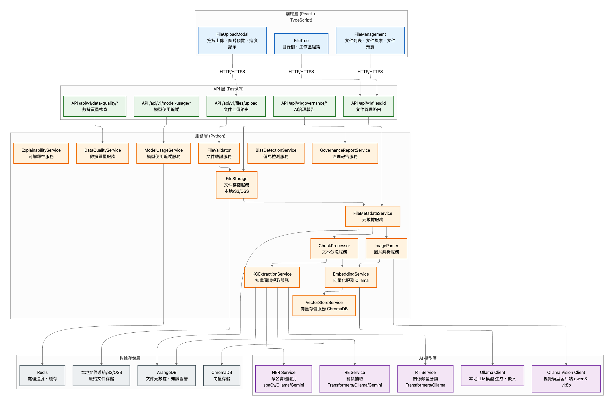

---

## 處理流程圖

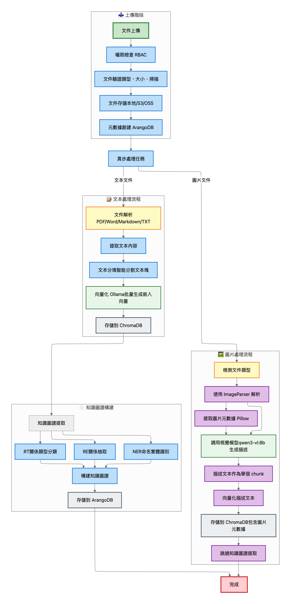


---

## 總結

AI-Box 文件上傳系統提供了一個完整、安全、高效的企業級文件處理解決方案。系統的核心優勢包括：

1. **完整的處理流程**: 從文件上傳到向量化、知識圖譜提取的完整流程
2. **強大的AI能力**: 支持多種AI模型，實現智能文本處理
3. **完善的治理機制**: 模型追蹤、質量監控、偏見檢測、可解釋性
4. **企業級安全**: RBAC權限、文件加密、惡意掃描、審計日誌
5. **優秀的用戶體驗**: 直觀的界面、實時進度、錯誤提示
6. **高度可擴展**: 支持多種存儲後端、AI模型、配置靈活

系統已經實現了階段1-6的核心功能，為企業提供了完整的AI文件處理和治理能力。
