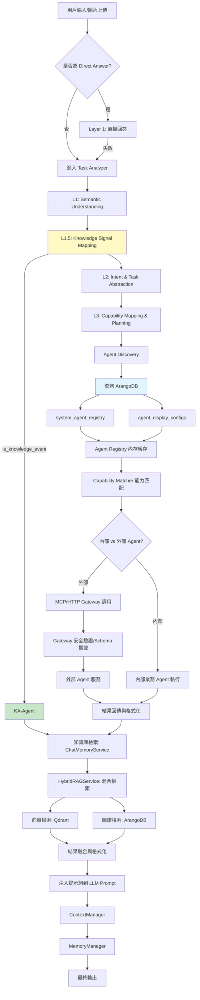
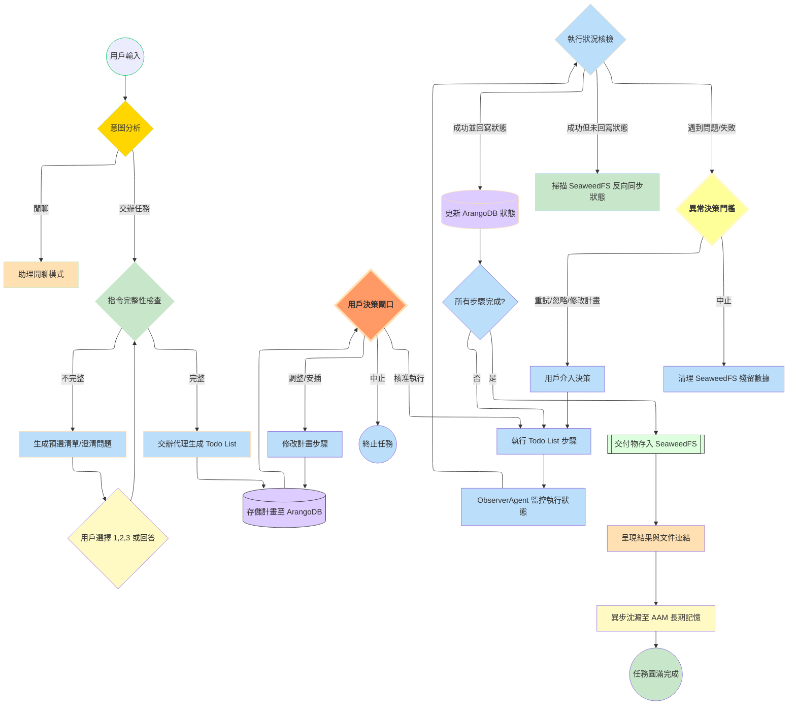

# AI-Box LangChain/Graph 驅動的完整聊天架構說明

**文檔版本**: v2.5
**最後更新**: 2026-01-28 UTC+8
**維護人**: Daniel Chung
**實現狀態**: ✅ 階段 1-10 核心實現完成，已進入技術債清理與下一迭代規劃階段
**關鍵亮點**: 雙軌並行解析(RAG)、統一MCP/HTTP代理規範、智能效能優化、Knowledge Signal Mapping (L1.5) 層

---

## 📋 系統現狀與階段 10 規劃

根據最新進展，我們已經完成了從基礎設施到效能優化的核心閉環。目前的階段 10 將聚焦於「多模態深度整合」與「第三方 Agent 生態擴展」。

### 1. 多模態深度整合 (RAG 視覺增強)

我們已經全面實施了 **《AI-Box 雙軌 RAG 解析規格書》**，多模態核心已在 LangGraph 中落地：

* **VisionAgent 節點**: 已實現專門的視覺解析節點，對接 `qwen3-vl`。
* **雙軌解析架構**:
  * **快速軌**: 基礎 Embedding 索引，確保即時檢索。
  * **深度軌**: 透過 `VisionAgent` 對圖片、圖表進行視覺解析。
* **視覺狀態流轉**: `AIBoxState` 現在支持存儲 and 傳遞視覺解析結果（Markdown 圖表與圖片描述）。

### 2. 第三方 Agent 生態規範 (MCP & HTTP)

針對外部 Agent 的整合，我們已經完成了標準化實現：

* **統一通信協議**: 完整的 **MCP** 和 **HTTP** 調用鏈路。
* **「註冊即防護」實施**: `SchemaValidator` 已集成至基礎節點框架，自動執行 `input_schema` 攔截。
* **MCP Gateway Client**: 已實現具備 `X-Gateway-Secret` 認證的專屬客戶端。
* **多模態渲染**: 前端界面已支持視覺解析結果的即時渲染。

---

## 🚀 發展方向與優化建議 (階段 10)

### ✅ 核心優化：Agent 生態與多模態落地

#### 1. 多模態全鏈路優化 (優先級：高)

* **視覺狀態管理**: 已在 `AIBoxState` 中完成 `vision_analysis` 支持。 ✅ **已完成**
* **多模態 Response**: 前端組件已支持渲染圖片解析結果。 ✅ **已完成**
* **視覺 Agent 節點**: `VisionAgent` 已成功加入 LangGraph 狀態機。 ✅ **已完成**

#### 2. 第三方 Agent 流程自動化 (優先級：高)

* **自動化註冊校驗**: `SchemaValidator` 已實現「註冊即防護」。 ✅ **已完成**
* **安全網關增強**: `MCPGatewayClient` 已實現安全 Headers 注入。 ✅ **已完成**

#### 3. 持續優化與擴展 (優先級：中)

* **自定義 Agent 模板**: 提供標準化模板供開發者快速開發符合 AI-Box 規範的 Agent。
* **API 擴展性**: 支持更豐富的第三方服務集成模式。

---

## 🔄 完整流程：從輸入到輸出 (含多模態與外部 Agent)

### 核心流程圖 (v2.5 更新 - 2026-01-28)

**重要更新**：
- ✅ 新增 **L1.5: Knowledge Signal Mapping** 層（純規則、可審計）
- ✅ 明確 **Agent Registry 查詢流程**（每次對話從 ArangoDB 查詢）
- ✅ 區分 **語義理解 vs 向量檢索** 的正確使用場景



---

## 任務治理動態流程設計




### 1. 狀態持久化：Todo List 的「契約化」管理

在開發時，不能僅將 Todo List 視為一個臨時變數，必須將其視為一份 **執行契約** 。

* **ArangoDB 結構設計** ：建立一個 `Task_Steps` 集合，每一步驟應包含 `status` (pending/processing/completed/failed)、`retry_count` 以及 `output_ref` (指向 SeaweedFS 的路徑)。
* **不可變性原則** ：一旦用戶在「決策閘口」核准了計畫，除非用戶手動調整，否則 Agent 不得擅自更改步驟內容。
* **關鍵注意** ：開發時需確保 `ObserverAgent` 能捕捉到 Agent 的隱形失敗（例如網路超時），並及時更新 ArangoDB 狀態，避免流程無限掛起。

### 2. 物理與邏輯分離：SeaweedFS 的文件治理

所有 Agent 產出的交付物（.md, .excel, .pdf 等）必須嚴格遵守統一的存儲路徑規範。

* **路徑規範** ：建議使用 `/user_id/task_id/step_id/filename` 作為路徑。
* **MIME 類型自動識別** ：Agent 寫入 SeaweedFS 時，必須帶上正確的 Content-Type，這對於前端呈現 .html 或 .png 交付物至關重要。
* **反向同步機制** ：這是最容易被忽視的開發重點——開發一個背景服務，定期檢查「計畫中標註已完成但 SeaweedFS 找不到檔案」或「檔案已產生但狀態未更新」的異常狀況。

### 3. 人機協作（HITL）節點的非同步處理

AI-Box 的「決策閘口」本質上是一個  **「斷點（Checkpoint）」** 。

* **掛起與恢復** ：在 LangGraph 中，必須使用 `interrupt_before` 或 `interrupt_after` 來暫停工作流。
* **預選清單生成** ：開發 `Orchestrator` 時，要訓練它從 `ResourceManager` 的參數定義中找出缺項，並格式化為 1, 2, 3 選項。這需要強大的 **Few-shot Prompting** 技巧。
* **關鍵注意** ：用戶介入後（調整或安插步驟），必須重新觸發 `Orchestrator` 的邏輯檢查，確保用戶新加的步驟不會導致後續任務崩潰。

### 4. Task Analyzer 與 Agent Discovery 流程

#### 4.1 是否每次對話都觸發？

**答案：幾乎每次都會，但有例外**

- ✅ **正常對話**：每次都會觸發 `task_analyzer.analyze()`，執行 L1-L5 處理
- ✅ **快速路徑**：用戶明確選擇 Agent 時，仍會查詢 Registry 驗證
- ⚠️ **例外**：Direct Answer 場景（如「什麼是 DevSecOps？」）會跳過 Task Analyzer

#### 4.2 Agent Registry 查詢機制

**每次對話都會從 ArangoDB 查詢**（動態查詢，非常駐內存）：

1. **system_agent_registry**：
   - 查詢時機：`registry.list_agents(include_system_agents=True)` 被調用時
   - 查詢內容：System Agents（內建 Agent）的完整配置
   - 緩存機制：查詢結果緩存在 `AgentRegistry._agents` 字典中（內存緩存）

2. **agent_display_configs**：
   - 查詢時機：`registry.get_all_agents()` 被調用時
   - 查詢內容：外部 Agent（第三方註冊的 Agent）的顯示配置
   - 限制：這些 Agent 可能沒有完整的能力列表（capabilities 為空）

**完整查詢流程**：
```
Task Analyzer.analyze()
  ↓
Capability Matcher.match_agents()
  ↓
Agent Discovery.discover_agents()
  ↓
Agent Registry.list_agents(include_system_agents=True)
  ↓
查詢 ArangoDB:
  ├─ system_agent_registry (System Agents)
  └─ agent_display_configs (外部 Agents)
  ↓
返回 Agent 列表（緩存在內存）
```

**性能考慮**：
- ⚠️ 每次對話都可能查詢 ArangoDB（如果緩存為空）
- ⚠️ 沒有持久化緩存（只有內存緩存）
- 💡 **建議**：實現查詢結果緩存（Redis 或 TTL 內存緩存），減少數據庫負載

**詳細說明**：請參閱 [Agent-Registry-查詢流程說明.md](../核心组件/Agent平台/Agent-Registry-查詢流程說明.md)

#### 4.3 Knowledge Signal Mapping（L1.5 層）

**新增（2026-01-28）**：語義觀測結果 → 治理事件判斷

**定位**：
- ❗ 它不是語義理解
- ❗ 它不是 intent 分類
- ❗ 它不是搜尋
- ✅ 它是 **語義觀測結果 → 治理事件判斷**

**核心原則**：
> **向量負責「相似性」，語義負責「責任歸屬」，治理只能建在後者之上。**

**流程**：
```
L1: Semantic Understanding
  ↓ (輸出: topics, entities, action_signals, modality, certainty)
L1.5: Knowledge Signal Mapper (純規則映射)
  ↓ (輸出: is_knowledge_event, knowledge_type, stability_estimate, ...)
L2: Intent & Task Abstraction
```

**Knowledge Signal 是唯一允許觸發 KA-Agent 的物件**：
- KA-Agent **只看 Knowledge Signal，不看 user text**
- 向量比對用於 KA-Agent 內部的相似性檢索，不用於語義理解和責任歸屬判斷

**詳細說明**：請參閱 [AI-Box 語義與任務工程-設計說明書-v4.md](../核心组件/語義與任務分析/AI-Box 語義與任務工程-設計說明書-v4.md#35-l15knowledge-signal-mapping-layer知識信號映射層---v40-新增)

---

### 5. 知識庫檢索流程（向量 + 圖譜混合檢索）

在用戶輸入處理後、LLM 調用前，系統會執行知識庫檢索以增強上下文。

#### 5.1 檢索流程

**核心組件**: `ChatMemoryService` → `HybridRAGService`

**檢索步驟**:

1. **向量檢索**（Qdrant）:
   - 使用 `EmbeddingService` 生成查詢向量
   - 從 Qdrant 向量數據庫中檢索語義相似的文檔片段
   - 支持 ACL 權限檢查（`query_vectors_with_acl`）

2. **圖譜檢索**（ArangoDB）:
   - 使用 `NERService` 從查詢中提取實體
   - 在 ArangoDB 中查找匹配的實體（`entities` collection）
   - 通過 `KGBuilderService` 獲取實體的鄰居節點和子圖（`relations` collection）
   - 將圖譜數據轉換為 Memory 格式

3. **混合檢索與結果融合**:
   - `HybridRAGService` 支持三種檢索策略：
     - `VECTOR_FIRST`: 向量優先，圖譜補充
     - `GRAPH_FIRST`: 圖譜優先，向量補充
     - `HYBRID`: 並行執行，加權合併（默認策略）
   - 結果去重（基於 `memory_id`）
   - 加權合併（`vector_weight=0.6`, `graph_weight=0.4`）
   - 按相關度排序

4. **提示詞格式化與注入**:
   - `_format_injection()` 方法將檢索結果格式化為系統消息
   - 提示詞明確指示 LLM 優先使用知識庫內容：
     ```
     以下為系統從知識庫中檢索到的相關內容（包括向量檢索和知識圖譜檢索結果）。
     請優先使用這些知識庫內容來回答用戶的問題。
     當用戶詢問是否能查到知識庫或自己的文件時，請明確告知用戶：是的，系統可以檢索到相關內容，並列出檢索到的內容摘要。
     ```
   - 注入到 LLM 的 `messages` 中作為 `system` 消息

**實現位置**:
- `services/api/services/chat_memory_service.py`: `retrieve_for_prompt()`
- `genai/workflows/rag/hybrid_rag.py`: `HybridRAGService`
- `api/routers/chat.py`: 在 LLM 調用前注入 `memory_result.injection_messages`

**相關文檔**:
- [向量與圖檢索混合查詢邏輯](../核心组件/文件上傳向量圖譜/向量與圖檢索混合查詢邏輯.md)
- [知識庫檢索問題診斷與修復指南](../核心组件/文件上傳向量圖譜/知識庫檢索問題診斷與修復指南.md)

### 6. 上下文與 AAM 記憶的整合

開發時需區分「系統級記憶」與「Agent 級記憶」。

* **Agent 專屬 Scratchpad** ：每個子 Agent 在執行 Todo 時，應有自己的臨時存儲區。只有在步驟完成後，才將精華摘要寫回全局會話。
* **記憶沈澱時機** ：只有在「任務圓滿完成」後，才將這份**經過用戶修正過的計畫**存入長期記憶（Qdrant/ArangoDB），作為未來的 SOP 模板。
* **知識庫檢索整合** ：在每次對話中，`ChatMemoryService` 會自動從知識庫（向量 + 圖譜）檢索相關內容，並注入到 LLM prompt 中，增強回答的準確性和相關性。

### 7. 待處理技術債與下一個迭代目標 (Next Iteration)

根據 2026-01-25 的 Gap Analysis 調研，以下為下一迭代需落實的重點：

* **任務步驟細粒度持久化**：實作 `Task_Steps` 集合，並在 `TaskManagerAgent` 中落實 `retry_count` 與 `output_ref` 的精確更新。
* **不可變契約校驗**：在 `TaskManagerAgent` 執行循環中加入校驗邏輯，確保未經用戶核准的計畫變更會被攔截。
* **ObserverAgent 實質監控**：將 `ObserverAgent` 中目前的模擬代碼替換為真實的 SeaweedFS 掃描與超時檢測邏輯。
* **反向同步背景服務**：開發專用的背景 Worker，處理 SeaweedFS 與 ArangoDB 之間的狀態最終一致性。
* **資料集引擎產線化**：將 `DecisionLog` 自動轉化為微調樣本的流程正式產品化。

---

## 📊 開發特別注意事項清單

| **開發維度**   | **核心注意點**                  | **推薦解決方案**                               |
| -------------------- | ------------------------------------- | ---------------------------------------------------- |
| **數據一致性** | 避免 ArangoDB 與 SeaweedFS 狀態不同步 | 實施「掃描反向更新」邏輯                             |
| **用戶體驗**   | 用戶可能看不懂複雜的 Todo List        | Orchestrator 需具備將技術步驟「中文化/白話化」的能力 |
| **安全性**     | 代理 Agent 可能生成危險的 Todo        | 引入 `PolicyAgent`對生成的計畫進行預先掃描         |
| **資源管理**   | 任務執行過久導致 Token 或成本暴增     | 設置每個步驟的 Max Token 限制與超時中斷              |

---

## 📝 更新記錄

| 日期       | 更新內容                                                      | 更新人       |
| ---------- | ------------------------------------------------------------- | ------------ |
| 2026-01-23 | 創建以 LangChain/Graph 為核心的完整聊天架構說明文檔           | Daniel Chung |
| 2026-01-23 | 新增任務管理與工作區管理章節，融入 LangGraph 狀態機           | Daniel Chung |
| 2026-01-24 | 更新為 v2.0：反映階段 1-8 完整實現狀態                         | Daniel Chung |
| 2026-01-24 | 更新為 v2.1：整合雙軌 RAG (多模態) 與外部 Agent (MCP) 生態規範 | Daniel Chung |
| 2026-01-24 | 調整階段 10 優化方向，對焦現有 RAG 視覺解析與 Agent 註冊規格  | Daniel Chung |
| 2026-01-25 | 更新為 v2.3：清理重複內容，新增下一迭代技術債與目標 (Next Iteration) | Daniel Chung |
| 2026-01-28 | 更新為 v2.4：新增知識庫檢索流程（向量 + 圖譜混合檢索）詳細說明，更新流程圖 | Daniel Chung |
| 2026-01-28 | 更新為 v2.5：新增 Task Analyzer 與 Agent Discovery 流程說明，新增 Knowledge Signal Mapping (L1.5) 層說明，明確 Agent Registry 查詢機制 | Daniel Chung |

---

**文檔版本**: v2.4
**最後更新**: 2026-01-28 UTC+8
**維護人**: Daniel Chung
**實現狀態**: ✅ 階段 1-10 核心實現完成，已進入技術債清理與下一迭代規劃階段
