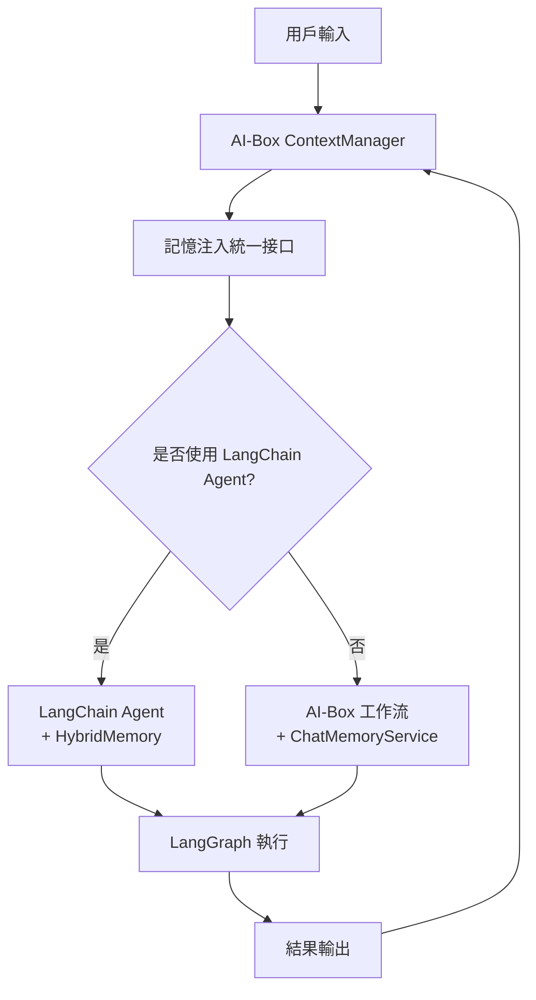

# AI-Box 與 LangChain 上下文管理衝突分析

**代碼功能說明**: 分析 AI-Box 上下文管理系統與 LangChain/LangGraph 記憶系統的潛在衝突點及解決方案
**創建日期**: 2026-01-23
**創建人**: Daniel Chung
**最後修改日期**: 2026-01-23

---

## 📋 分析總結

**結論**：AI-Box 與 LangChain 的上下文管理存在**部分重疊但可控的衝突**，主要風險在於：

1. **狀態管理重疊**：LangGraph 狀態 vs AI-Box ContextManager
2. **記憶系統並存**：LangChain Memory vs AI-Box MemoryManager
3. **API調用差異**：兩套不同的記憶注入機制

**解決策略**：採用**分層隔離**原則，讓 AI-Box 上下文管理作為上層，LangChain 作為底層執行引擎。

---

## 🔍 衝突分析

### 1. 狀態管理重疊

#### 問題描述
- **LangGraph State**：工作流級狀態管理，包含 `messages`, `context`, `status` 等
- **AI-Box ContextManager**：對話級上下文管理，包含會話歷史、消息記錄等

#### 潛在衝突點
```python
# LangGraph 狀態
class LangGraphState(TypedDict):
    messages: List[Message]      # 消息歷史
    context: Dict[str, Any]      # 上下文數據
    status: str                  # 執行狀態

# AI-Box ContextManager
class ContextManager:
    def add_message(self, session_id: str, message: Message):
        # 記錄消息到 Redis/ArangoDB
```

**衝突場景**：
- 消息可能被重複記錄
- 狀態同步問題
- 性能開銷增加

#### 解決方案
```python
# 採用橋接模式
class ContextBridge:
    """連接 LangGraph 狀態與 AI-Box ContextManager"""
    
    def sync_to_langgraph(self, aibox_context: AIBoxContext) -> LangGraphState:
        """將 AI-Box 上下文轉換為 LangGraph 狀態"""
        return {
            "messages": aibox_context.messages,
            "context": {
                "session_id": aibox_context.session_id,
                "user_id": aibox_context.user_id,
                # AI-Box 特有字段
                "task_id": aibox_context.task_id,
                "input_type": aibox_context.input_type
            }
        }
    
    def sync_from_langgraph(self, langgraph_state: LangGraphState, session_id: str):
        """從 LangGraph 狀態同步回 AI-Box ContextManager"""
        # 只同步必要的狀態變化
        pass
```

### 2. 記憶系統並存

#### 問題描述
- **LangChain Memory**：ConversationBufferMemory, ConversationSummaryMemory 等
- **AI-Box MemoryManager**：短期記憶(Redis) + 長期記憶(ChromaDB)

#### 潛在衝突點
```python
# LangChain Agent 記憶
agent = create_agent(
    model="gpt-4",
    tools=[tools],
    memory=ConversationBufferMemory()  # LangChain 記憶
)

# AI-Box 記憶注入
memory_results = chat_memory_service.retrieve_for_prompt(query, user_id)
enhanced_prompt = inject_memory_to_prompt(original_prompt, memory_results)
```

**衝突場景**：
- 記憶內容重複
- 記憶格式不兼容
- 記憶更新不同步

#### 解決方案
```python
# 採用組合模式
class HybridMemory:
    """整合 LangChain Memory 與 AI-Box MemoryManager"""
    
    def __init__(self, langchain_memory, aibox_memory_manager):
        self.langchain_memory = langchain_memory
        self.aibox_memory = aibox_memory_manager
    
    def save_context(self, inputs, outputs):
        """保存上下文到兩個記憶系統"""
        # 保存到 LangChain Memory
        self.langchain_memory.save_context(inputs, outputs)
        
        # 保存到 AI-Box MemoryManager
        self.aibox_memory.store_short_term(
            key=f"conversation_{inputs['session_id']}",
            value={"inputs": inputs, "outputs": outputs}
        )
    
    def load_memory_variables(self, inputs):
        """從兩個系統加載記憶"""
        # LangChain 記憶
        langchain_memories = self.langchain_memory.load_memory_variables(inputs)
        
        # AI-Box 記憶
        aibox_memories = self.aibox_memory.retrieve_short_term(
            f"conversation_{inputs['session_id']}"
        )
        
        # 合併結果
        return self._merge_memories(langchain_memories, aibox_memories)
```

### 3. API調用差異

#### 問題描述
- **LangChain Agent**：自動處理記憶注入
- **AI-Box ChatMemoryService**：手動檢索和注入記憶

#### 潛在衝突點
```python
# LangChain Agent 自動模式
response = agent.invoke({
    "messages": [{"role": "user", "content": "hello"}]
})  # 記憶自動處理

# AI-Box 手動模式  
memory_results = chat_memory_service.retrieve_for_prompt("hello", user_id)
enhanced_input = inject_memory(messages, memory_results)
response = llm.generate(enhanced_input)
```

#### 解決方案
```python
# 建立統一的記憶注入接口
class UnifiedMemoryInjector:
    """統一記憶注入接口"""
    
    def __init__(self, chat_memory_service, langchain_memory=None):
        self.chat_memory_service = chat_memory_service
        self.langchain_memory = langchain_memory
    
    async def inject_memory(self, messages: List[Message], user_id: str) -> List[Message]:
        """統一的記憶注入方法"""
        
        # AI-Box 記憶檢索
        memory_results = await self.chat_memory_service.retrieve_for_prompt(
            messages[-1].content, user_id
        )
        
        # 轉換為 LangChain 格式（如需要）
        if self.langchain_memory:
            langchain_formatted = self._convert_to_langchain_format(memory_results)
            # 更新 LangChain 記憶
            self.langchain_memory.save_context(
                {"input": messages[-1].content},
                {"output": ""}  # 待填充
            )
        
        # 注入到消息中
        enhanced_messages = self._inject_to_messages(messages, memory_results)
        return enhanced_messages
```

---

## 🏗️ 架構解決方案

### 建議架構：分層隔離



### 實現策略

#### 1. 狀態管理橋接
```python
class ContextLangGraphBridge:
    """ContextManager 與 LangGraph 的橋接層"""
    
    def __init__(self, context_manager, langgraph_workflow):
        self.context_manager = context_manager
        self.langgraph = langgraph_workflow
    
    async def execute_with_context(self, user_input: str, session_id: str):
        """帶上下文的工作流執行"""
        
        # 1. 從 ContextManager 獲取上下文
        context = await self.context_manager.get_context(session_id)
        
        # 2. 轉換為 LangGraph 狀態
        initial_state = self._convert_to_langgraph_state(context, user_input)
        
        # 3. 執行 LangGraph 工作流
        final_state = await self.langgraph.ainvoke(initial_state)
        
        # 4. 同步狀態回 ContextManager
        await self._sync_back_to_context(final_state, session_id)
        
        return final_state
```

#### 2. 記憶系統統一
```python
class UnifiedMemorySystem:
    """統一的記憶管理系統"""
    
    def __init__(self):
        self.aibox_memory = ChatMemoryService()
        self.langchain_memory = ConversationBufferMemory()
        self.memory_bridge = MemoryBridge()
    
    async def retrieve_and_inject(self, query: str, user_id: str, messages: List[Message]):
        """統一的記憶檢索和注入"""
        
        # 並行檢索兩個記憶系統
        aibox_task = self.aibox_memory.retrieve_for_prompt(query, user_id)
        langchain_task = self._get_langchain_memory(user_id)
        
        aibox_results, langchain_results = await asyncio.gather(aibox_task, langchain_task)
        
        # 通過橋接層合併
        merged_memory = self.memory_bridge.merge_memories(aibox_results, langchain_results)
        
        # 注入到消息中
        enhanced_messages = self._inject_memory_to_messages(messages, merged_memory)
        
        return enhanced_messages
```

#### 3. Agent 集成模式
```python
class LangChainAgentWrapper:
    """LangChain Agent 的包裝器，集成 AI-Box 上下文"""
    
    def __init__(self, langchain_agent, context_manager, memory_system):
        self.agent = langchain_agent
        self.context_manager = context_manager
        self.memory_system = memory_system
    
    async def invoke_with_context(self, input_data: dict, session_id: str):
        """帶上下文的 Agent 調用"""
        
        # 1. 增強輸入數據
        enhanced_input = await self.memory_system.retrieve_and_inject(
            input_data["messages"][-1]["content"],
            input_data.get("user_id"),
            input_data["messages"]
        )
        
        input_data["messages"] = enhanced_input
        
        # 2. 調用 LangChain Agent
        response = await self.agent.ainvoke(input_data)
        
        # 3. 更新上下文
        await self.context_manager.add_message(session_id, {
            "role": "assistant",
            "content": response["output"]
        })
        
        return response
```

---

## 📊 衝突風險評估

### 高風險場景

| 場景 | 風險等級 | 影響 | 解決方案 |
|------|----------|------|----------|
| 同時使用兩個記憶系統 | 🔴 高 | 記憶重複、格式衝突 | 實現統一記憶接口 |
| LangGraph 狀態與 ContextManager 同步 | 🟡 中 | 狀態不一致 | 實現橋接層 |
| Agent 記憶注入重疊 | 🟡 中 | 性能下降、混亂 | 建立記憶優先級 |

### 低風險場景

| 場景 | 風險等級 | 原因 |
|------|----------|------|
| 純 AI-Box 工作流 | 🟢 低 | 不使用 LangChain 組件 |
| 純 LangChain Agent | 🟢 低 | 不使用 AI-Box 上下文管理 |
| 只讀操作 | 🟢 低 | 不涉及狀態寫入 |

---

## 🚀 實施建議

### 階段一：隔離測試（推薦）
```python
# 1. 先測試純 AI-Box 模式
aibox_result = await task_analyzer.analyze(request)

# 2. 再測試純 LangChain 模式  
langchain_result = await langchain_agent.invoke(input_data)

# 3. 最後測試整合模式
hybrid_result = await hybrid_agent.invoke_with_context(input_data, session_id)
```

### 階段二：漸進整合
1. **狀態橋接**：實現 ContextManager ↔ LangGraph 狀態同步
2. **記憶統一**：建立統一的記憶檢索和注入接口
3. **Agent 包裝**：為 LangChain Agent 添加 AI-Box 上下文支持

### 階段三：優化整合
1. **性能監控**：監控記憶注入延遲和準確性
2. **衝突檢測**：建立衝突檢測和解決機制
3. **降級策略**：當整合失敗時的降級處理

---

## 📚 相關文檔

- [AI-Box上下文管理架構說明.md](./AI-Box上下文管理架構說明.md) - AI-Box 上下文管理詳解
- [語義與任務分析詳細說明.md](./語義與任務分析詳細說明.md) - 語義分析與 LangGraph 整合
- [向量與圖檢索混合查詢邏輯.md](./向量與圖檢索混合查詢邏輯.md) - 混合檢索邏輯

---

**結論**：通過合理的架構設計和橋接層，可以將 AI-Box 上下文管理與 LangChain/LangGraph 的衝突降到最低，並實現兩者的優勢互補。

**關鍵原則**：
1. **分層隔離**：AI-Box 作為上層協調，LangChain 作為底層執行
2. **橋接適配**：建立狀態和記憶的雙向同步機制
3. **統一接口**：提供一致的記憶注入和上下文管理 API

---

**文檔版本**: v1.0
**最後更新**: 2026-01-23
**維護人**: Daniel Chung