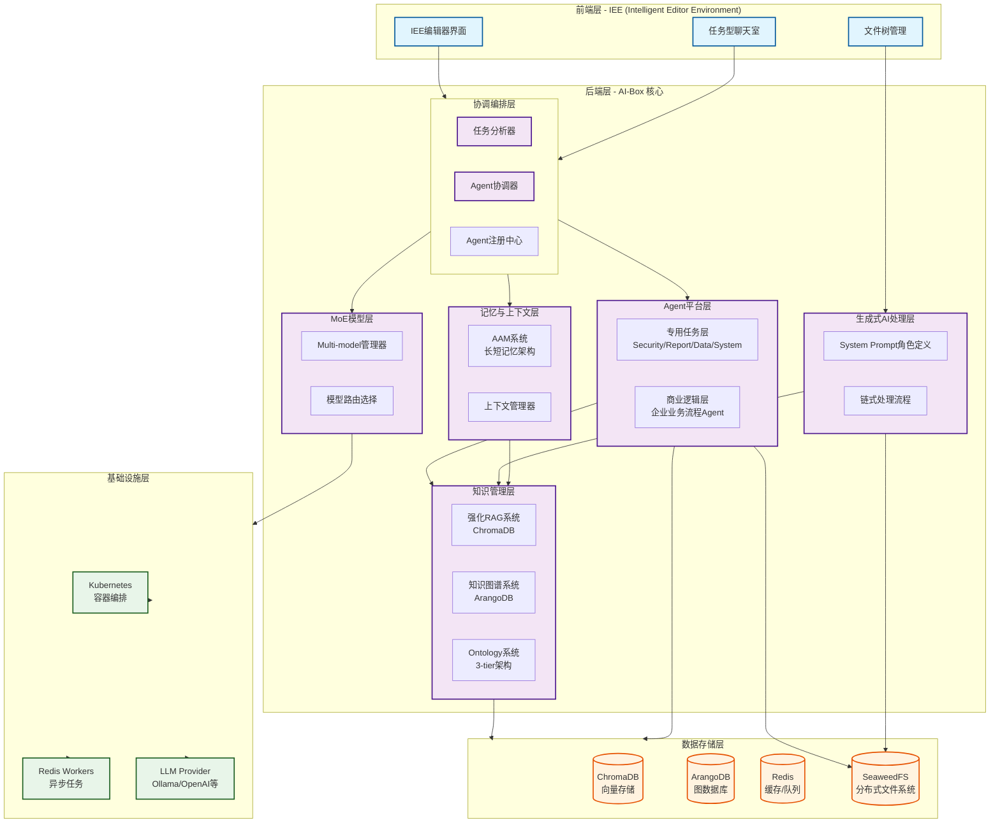

# AI-Box 系统设计文档

**创建日期**: 2025-12-25
**创建人**: Daniel Chung
**最后修改日期**: 2025-12-30

**更新记录**：

- 2025-12-30：添加工具組文檔（需求分析和開發規格）
- 2025-12-29：更新数据层架构图，添加 SeaweedFS 节点，反映最新的存储架构

---

## 📋 文档概述

本文档集全面阐述 AI-Box 系统的架构设计、核心组件、功能特性与开发进度，用于：

- **IP架构评估**：系统技术价值与创新点分析
- **资产鉴价**：系统商业价值与竞争优势评估
- **技术交接**：完整的架构设计与实现说明

> **文档导航**：本文档为主索引，详细内容请参考 [核心组件文档](./核心组件/) 和 [开发进度文档](./开发进度/)

---

## 🎯 系统概述

### 定位与愿景

**AI-Box** 是一个为企业设计的**集成式企业AI平台**，旨在通过先进的人工智能技术，为企业提供完整的AI能力集成、知识管理与智能协作解决方案。

**核心愿景**：

- 构建企业级的AI能力中心，统一管理多种AI能力
- 实现企业知识的结构化存储与智能检索
- 提供面向任务的智能协作环境，提升工作生产力
- 支持本地部署与混合架构，满足企业安全与合规需求

### 核心价值主张

1. **集成式平台**：统一集成生成式AI、RAG、知识图谱、Agent等多维度AI能力
2. **企业级架构**：支持多租户、安全隔离、高可用、可扩展
3. **智能知识管理**：结合向量检索与图推理，实现深度的知识理解与关联
4. **任务驱动协作**：基于任务的上下文管理，避免传统聊天室的历史割裂
5. **灵活的部署策略**：支持本地物理隔离，同时利用云端LLM优势

---

## 🏗️ 整体架构

### 架构层次图

### 核心设计理念

1. **分层架构**：前端、协调层、执行层、数据层、基础设施层清晰分离
2. **任务驱动**：以任务（Task）为单位的上下文管理，而非传统的聊天室模式
3. **Agent为中心**：通过多Agent架构处理复杂业务流程
4. **知识增强**：结合RAG、知识图谱、Ontology实现深度知识理解
5. **模型路由**：通过MoE架构，根据任务特性选择最适合的专家模型
6. **混合部署**：支持本地私有化部署与云端LLM的混合架构

---

## 🔧 核心组件概览

### 1. Agent Platform（Agent平台）

**三层架构设计**：

- **协调编排层**：任务分析、Agent注册、任务路由与协调
- **专用任务层**：系统级Agent（Security、Report、Data、System Config等）
- **商业逻辑层**：企业业务流程Agent（可扩展、可注册）

**详细文档**：[Agent-Platform.md](./核心组件/Agent-Platform.md)

### 2. AAM系统（AI-Augmented Memory）

**长短记忆架构**：

- **短期记忆**：基于LLM上下文窗口的实时交互记忆
- **长期记忆**：通过向量数据库和图数据库存储的历史知识
- **个性化模型**：基于用户偏好的个性化学习（规划中）

**详细文档**：[AAM系统.md](./核心组件/AAM系统.md)

### 3. 强化RAG系统

**核心特性**：

- **语义理解切片**：通过大模型理解文意，避免完整段落被切割
- **ChromaDB向量存储**：高效的向量检索能力
- **与知识图谱协同**：结合图查询增强检索精度

**详细文档**：[强化RAG系统.md](./核心组件/强化RAG系统.md)

### 4. 知识图谱系统

**核心能力**：

- **三元组提取**：NER（命名实体识别）、RE（关系抽取）、RT（关系类型）
- **ArangoDB图存储**：高效的图查询与推理能力
- **Ontology约束**：基于3-tier Ontology的精确抽取

**详细文档**：[知识图谱系统.md](./核心组件/知识图谱系统.md)

### 5. Ontology系统

**3-tier架构**：

- **Base层**：基础通用实体（5W1H框架）
- **Domain层**：领域特定实体（如Enterprise、Administration）
- **Major层**：专业特定实体（如Manufacture、NotionEditor）

**详细文档**：[Ontology系统.md](./核心组件/Ontology系统.md)

### 6. MoE系统（Mixture of Experts）

**Multi-model架构**：

- **专家模型选择**：根据任务类型和特性选择最适合的模型
- **任务分类路由**：通过Task Analyzer进行任务分类，动态路由到专家模型
- **LLM能力发现**：在ArangoDB中配置模型能力，支持动态发现

**详细文档**：[MoE系统.md](./核心组件/MoE系统.md)

### 7. IEE前端系统（Intelligent Editor Environment）

**核心特性**：

- **IDE式界面**：对标IDE，提供专业的文件编辑体验
- **任务型聊天室**：以任务为单位的上下文管理
- **文件编辑与diff**：支持AI驱动的精准文件编辑
- **文件同步工程**：规划与Notion等知识库集成

**详细文档**：[IEE前端系统.md](./核心组件/IEE前端系统.md)

### 8. 生成式AI链式处理系统

**处理流程**：

- **System Prompt角色定义**：通过Prompt定义AI的角色与技能
- **文件上传与处理**：多格式文件解析、向量化、知识提取
- **端到端处理链路**：从文件上传到知识入库的完整流程

**详细文档**：[生成式AI链式处理系统.md](./核心组件/生成式AI链式处理系统.md)

### 9. 存储架构

**统一对象存储与治理数据存储**：

- **SeaweedFS 分布式文件系统**：统一对象存储，支持 Kubernetes 环境下的弹性扩展
- **双服务部署架构**：AI-Box 和 DataLake 项目各自独立的 SeaweedFS 服务实例
- **治理数据存储**：审计日志、系统日志、版本历史、变更提案存储在 SeaweedFS（Append-Only 模式）
- **文件存储**：用户上传文件、Agent 产出文件存储在 SeaweedFS
- **Active State 数据**：知识图谱、当前生效的配置保留在 ArangoDB

**详细文档**：[资料架构建议报告](./資料架构建议报告.md)、[资料存储架构重构分析与计划](./資料存儲架構重構分析與計劃.md)

### 10. 部署架构

**混合部署策略**：

- **本地物理隔离**：企业敏感数据优先使用本地私有小模型处理
- **云端LLM优势**：非敏感场景利用云端强大LLM能力
- **Kubernetes容器管理**：灵活的集群扩展与维护
- **Redis Worker异步任务**：支持并发与异步处理

**详细文档**：[部署架构.md](./核心组件/部署架构.md)

### 11. Personal Data / RoLA（规划中）

**个人化学习系统**：

- **长期任务理解**：系统理解用户的长期任务与偏好
- **去隐私化记录**：通过token ID进行去隐私化的偏好记录
- **个性化服务**：基于个人偏好提供更贴心的服务

**详细文档**：[Personal-Data-RoLA.md](./核心组件/Personal-Data-RoLA.md)

---

## ✨ 系统特性与优势

### 技术创新点

1. **3-tier Ontology架构**：避免过多层级的复杂性，同时保证全面专业的知识表示
2. **AAM长短记忆架构**：结合短期上下文与长期知识，实现持续学习的AI系统
3. **混合RAG + 知识图谱**：向量检索与图推理结合，提升知识检索精度
4. **任务驱动上下文管理**：以任务为单位管理上下文，避免传统聊天室的割裂
5. **Multi-model专家路由**：根据任务特性动态选择最适合的专家模型
6. **IEE式前端设计**：对标IDE的专业文件编辑体验，突破传统聊天界面局限

### 商业价值

1. **企业级AI能力集成**：统一管理多种AI能力，降低集成成本
2. **知识资产沉淀**：通过知识图谱与向量检索，构建企业知识资产库
3. **生产效率提升**：通过任务驱动的智能协作，提升团队工作效率
4. **安全与合规**：支持本地部署与混合架构，满足企业安全需求
5. **可扩展架构**：基于Agent平台的可扩展架构，支持业务快速迭代

### 竞争优势

| 维度 | AI-Box | 传统RAG系统 | 传统聊天应用 |
|------|--------|-------------|--------------|
| 知识表示 | 向量+图+Ontology | 仅向量 | 无结构化知识 |
| 上下文管理 | 任务驱动 | 聊天室模式 | 聊天室模式 |
| 模型选择 | Multi-model动态路由 | 单一模型 | 单一模型 |
| 前端体验 | IEE式专业编辑 | 聊天界面 | 聊天界面 |
| 部署策略 | 混合架构 | 单一部署 | 云端部署 |
| 扩展性 | Agent平台可扩展 | 功能耦合 | 功能耦合 |

---

## 📚 文档导航

### 核心组件文档

- [Agent Platform](./核心组件/Agent-Platform.md) - Agent平台三层架构详解
- [AAM系统](./核心组件/AAM系统.md) - 长短记忆上下文架构
- [强化RAG系统](./核心组件/强化RAG系统.md) - ChromaDB向量化与语义切片
- [知识图谱系统](./核心组件/知识图谱系统.md) - ArangoDB图存储与NER/RE/RT提取
- [Ontology系统](./核心组件/Ontology系统.md) - 3-tier架构（base/domain/major）
- [MoE系统](./核心组件/MoE系统.md) - Multi-model专家模型架构
- [IEE前端系统](./核心组件/IEE前端系统.md) - Intelligent Editor Environment
- [生成式AI链式处理系统](./核心组件/生成式AI链式处理系统.md) - System prompt与文件处理流程
- [存储架构](./資料架构建议报告.md) - SeaweedFS 统一对象存储与治理数据存储
- [存储架构详细说明](./核心组件/存储架构.md) - SeaweedFS 双服务部署架构详细说明
- [SeaweedFS 使用指南](./核心组件/SeaweedFS使用指南.md) - SeaweedFS 使用指南和 API 示例
- [日志存储格式说明](./核心组件/日志存储格式说明.md) - JSON Lines 格式和日志存储规范
- [部署架构](./核心组件/部署架构.md) - 混合部署、k8s、Redis Worker、SeaweedFS 部署
- [Personal Data / RoLA](./核心组件/Personal-Data-RoLA.md) - 个人化学习系统（规划中）

### 开发进度文档

- [开发进度总览](./开发进度/README.md) - 各组件完成度统计
- [组件开发状态对比](./开发进度/组件开发状态对比.md) - 设计目标 vs 实现状态
- [测试计划](./开发进度/测试计划.md) - 各组件测试策略与覆盖率目标

### 系统价值分析

- [系统价值与独特性](./系统价值与独特性.md) - 技术创新点、商业价值、竞争优势分析

### API 文档

- [治理 API 文档](./API文档/治理API文档.md) - 版本历史、变更提案、审计日志 API

### 工具組文檔

- [工具組需求分析](./tools/工具組需求分析.md) - 工具組功能需求和使用場景分析
- [工具組開發規格](./tools/工具組開發規格.md) - 工具組技術規格和架構設計
- [時間服務設計說明](./tools/時間服務設計說明.md) - 時間服務（TimeService）設計與實現說明
- [System Config 存儲位置說明](./tools/System-Config-存储位置说明.md) - System Config 存儲位置和配置說明

### 开发指南

- [开发环境设置指南](./开发环境设置指南.md) - 开发环境配置，包括 SeaweedFS 配置

### 相关参考文档

- [项目控制表](../開發過程文件/項目控制表.md) - 项目开发进度追踪
- [项目结构说明](./项目结构说明.md) - 项目目录结构说明
- [Agent平台详细规格](./核心组件/Agent-Platform.md) - Agent平台架构规格
- [文件上传架构说明](./核心组件/文件上傳向量圖譜/上傳的功能架構說明-v2.0.md) - 文件处理流程详解（已更新 S3 URI 返回格式）
- [资料存储架构重构分析与计划](./資料存儲架構重構分析與計劃.md) - 存储架构重构实施计划
- [文件迁移指南](./資料存儲架構重構/文件遷移指南.md) - 文件从本地文件系统迁移到 SeaweedFS
- [DataLake 数据迁移指南](./資料存儲架構重構/DataLake數據遷移指南.md) - DataLake 数据从 ArangoDB 迁移到 SeaweedFS

---

## 🔄 文档更新说明

本文档集将随系统开发持续更新，各组件文档中的"实现状态"与"开发进度"部分会定期与 [项目控制表](../開發過程文件/項目控制表.md) 同步。

**最后更新日期**: 2025-12-30

**更新摘要**（2025-12-30）：

- 添加工具組需求分析和開發規格文檔
- 工具組包含：時間日期、天氣、地理位置等核心工具
- 規劃了擴展工具：單位轉換、計算、文本處理等
- 工具組將放置在項目根目錄下的 `tools/` 目錄
- **新增時間服務（TimeService）**：
  - 使用緩存機制提供高精度時間（每 100ms 更新一次系統時間）
  - 使用 `time.perf_counter()` 計算經過的時間，提供微秒級精度
  - 線程安全，支持多線程環境
  - 簡單實用，無需複雜的同步策略
  - 已在 API 啟動時自動初始化（單例模式）

**更新摘要**（2025-12-29）：

- 更新数据层架构图，将 FileStorage 替换为 SeaweedFS 分布式文件系统
- 添加 Agent 层和 GenAI 层到 SeaweedFS 的连接关系
- 反映最新的存储架构：ArangoDB + ChromaDB + Redis + SeaweedFS
- 添加新文档导航：治理 API 文档、开发环境设置指南
- 更新文件上传架构说明，添加 S3 URI 返回格式说明

---

## 📞 联系方式

如有疑问或建议，请联系项目负责人：Daniel Chung
